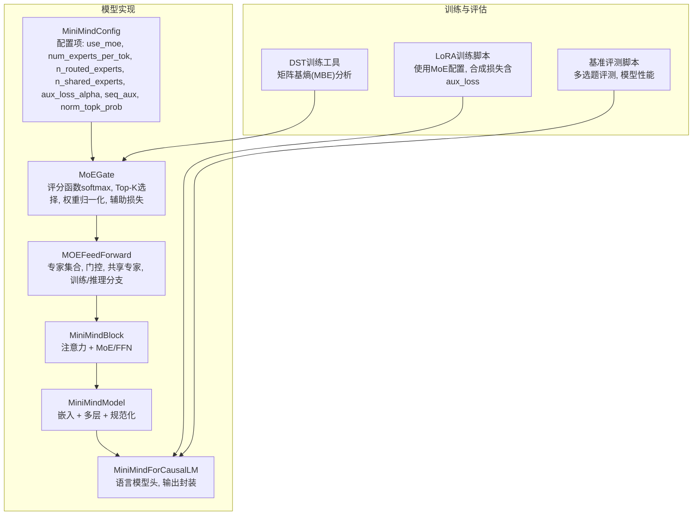
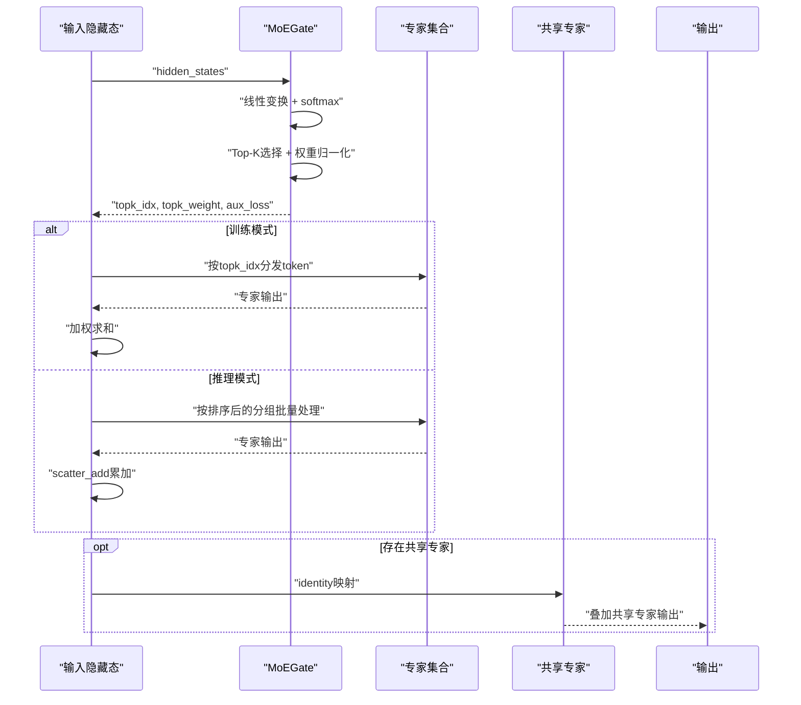
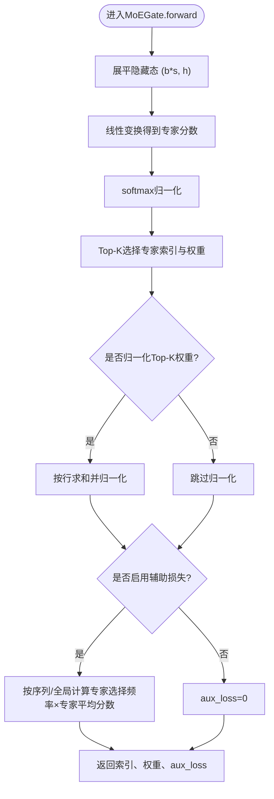
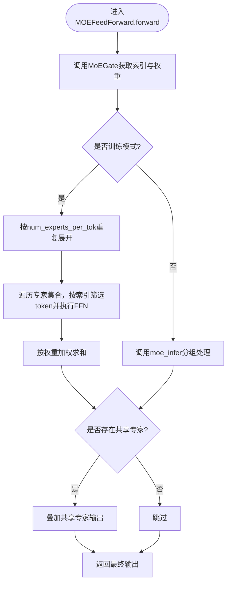
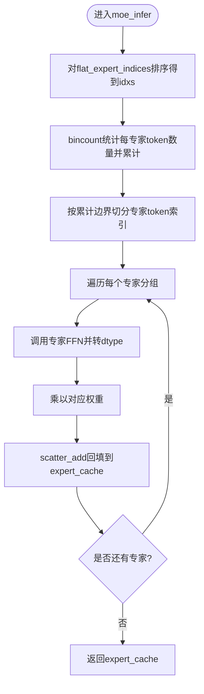
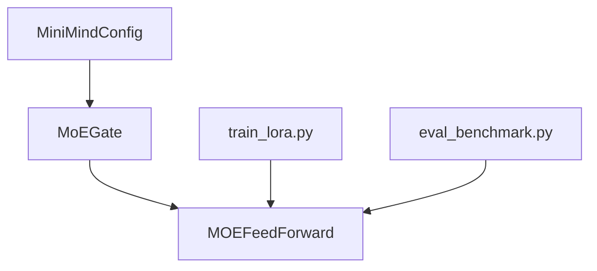

# 专家选择机制

<cite>
**本文档引用的文件**
- [model_minimind.py](file://model/model_minimind.py)
- [03_Phase3_模型架构详解.md](file://docs/03_Phase3_模型架构详解.md)
- [train_lora.py](file://trainer/train_lora.py)
- [eval_benchmark.py](file://eval_benchmark.py)
- [dst_hooks.py](file://DST-train/dst_hooks.py)
</cite>

## 目录
1. [简介](#简介)
2. [项目结构](#项目结构)
3. [核心组件](#核心组件)
4. [架构总览](#架构总览)
5. [详细组件分析](#详细组件分析)
6. [依赖分析](#依赖分析)
7. [性能考量](#性能考量)
8. [故障排查指南](#故障排查指南)
9. [结论](#结论)
10. [附录](#附录)

## 简介
本文件围绕MiniMind项目的专家选择机制展开，系统阐述Top-K专家选择算法在MoE（Mixture of Experts）模块中的实现细节，包括专家索引生成、权重分配、token到专家的映射过程；对比训练模式与推理模式下的不同策略及其性能考量；解释为何推理模式采用分组处理以提升效率；并提供专家利用率分析、负载均衡策略、专家选择对模型性能的影响、可视化示例、性能基准测试与调优建议，以及解决专家使用不均衡等常见问题的方法。

## 项目结构
与专家选择机制直接相关的代码集中在模型定义与MoE前向传播实现中，文档中也提供了架构与MoE模块的说明。训练脚本展示了如何在训练中使用MoE并结合辅助损失；评估脚本可用于基准测试与性能验证；DST训练工具中包含矩阵基熵（MBE）等指标，可用于专家权重分布的分析。

图表来源
- [model_minimind.py:8-78](file://model/model_minimind.py#L8-L78)
- [model_minimind.py:245-298](file://model/model_minimind.py#L245-L298)
- [model_minimind.py:301-360](file://model/model_minimind.py#L301-L360)
- [model_minimind.py:363-440](file://model/model_minimind.py#L363-L440)
- [train_lora.py:109-110](file://trainer/train_lora.py#L109-L110)
- [eval_benchmark.py:122-135](file://eval_benchmark.py#L122-L135)
- [dst_hooks.py:57-83](file://DST-train/dst_hooks.py#L57-L83)

章节来源
- [model_minimind.py:8-78](file://model/model_minimind.py#L8-L78)
- [model_minimind.py:245-298](file://model/model_minimind.py#L245-L298)
- [model_minimind.py:301-360](file://model/model_minimind.py#L301-L360)
- [model_minimind.py:363-440](file://model/model_minimind.py#L363-L440)
- [train_lora.py:109-110](file://trainer/train_lora.py#L109-L110)
- [eval_benchmark.py:122-135](file://eval_benchmark.py#L122-L135)
- [dst_hooks.py:57-83](file://DST-train/dst_hooks.py#L57-L83)

## 核心组件
- 配置项（MiniMindConfig）：控制是否启用MoE、每token选择的专家数、专家总数、共享专家数、评分函数、辅助损失系数、是否按序列计算辅助损失、Top-K概率是否归一化等。
- 门控网络（MoEGate）：基于隐藏态线性变换得到专家分数，softmax归一化后Top-K选择，计算辅助损失（负载均衡），输出专家索引、权重与辅助损失。
- MoE前向（MOEFeedForward）：训练模式逐专家处理并加权求和；推理模式采用分组批量处理以提升效率；可叠加共享专家输出。
- 训练与推理分支：训练时使用重复展开与循环处理；推理时使用排序分组与scatter_add累加，避免重复专家调用。
- 辅助损失（负载均衡）：通过专家选择频率与专家平均分数的乘积加权，抑制“路由崩塌”。

章节来源
- [model_minimind.py:8-78](file://model/model_minimind.py#L8-L78)
- [model_minimind.py:245-298](file://model/model_minimind.py#L245-L298)
- [model_minimind.py:301-360](file://model/model_minimind.py#L301-L360)
- [03_Phase3_模型架构详解.md:207-279](file://docs/03_Phase3_模型架构详解.md#L207-L279)

## 架构总览
MoE模块位于Transformer Block的前馈网络位置，可替换为标准FFN或MoE。门控网络为每个token输出各专家的分数，Top-K选择并归一化权重，随后在训练与推理两种模式下分别执行专家调用与加权聚合。

图表来源
- [model_minimind.py:245-298](file://model/model_minimind.py#L245-L298)
- [model_minimind.py:301-360](file://model/model_minimind.py#L301-L360)

## 详细组件分析

### 门控网络（MoEGate）
- 输入：隐藏态形状为(b, s, h)，展平为(b*s, h)。
- 计算：线性层得到专家分数，softmax归一化。
- Top-K：选择前K个专家，权重归一化（可选）。
- 辅助损失：按序列或全局计算专家选择频率与专家平均分数的乘积加权，抑制路由集中化。

图表来源
- [model_minimind.py:264-298](file://model/model_minimind.py#L264-L298)

章节来源
- [model_minimind.py:245-298](file://model/model_minimind.py#L245-L298)
- [03_Phase3_模型架构详解.md:225-243](file://docs/03_Phase3_模型架构详解.md#L225-L243)

### MoE前向（MOEFeedForward）
- 训练模式：将输入重复num_experts_per_tok次，按专家索引筛选token，逐专家执行FFN，再按权重加权求和。
- 推理模式：使用moe_infer，先对专家索引排序，统计每专家token数量，按分组批量调用专家，使用scatter_add累加并乘以对应权重，避免重复专家调用。

图表来源
- [model_minimind.py:316-360](file://model/model_minimind.py#L316-L360)

章节来源
- [model_minimind.py:301-360](file://model/model_minimind.py#L301-L360)
- [03_Phase3_模型架构详解.md:245-279](file://docs/03_Phase3_模型架构详解.md#L245-L279)

### 推理模式分组处理的效率优势
- 排序与分组：对flat_expert_indices排序，得到idxs，结合bincount的累计和得到每专家token边界。
- 分组调用：按边界切片，对每个专家分组调用FFN，避免重复专家多次调用。
- 累加与加权：使用scatter_add将专家输出按原始token位置回填，并乘以对应权重，保证输出顺序与输入一致。

图表来源
- [model_minimind.py:339-360](file://model/model_minimind.py#L339-L360)

章节来源
- [model_minimind.py:339-360](file://model/model_minimind.py#L339-L360)

### 专家利用率分析与负载均衡
- 利用率：通过辅助损失中的专家选择频率（ce）与专家平均分数（scores_for_seq_aux.mean(dim=1)或Pi）的乘积加权，衡量专家使用是否均衡。
- 负载均衡：当alpha>0时，辅助损失会惩罚专家选择过度集中，促使路由分布更均匀。
- 可视化示例：可绘制每token被分配到的专家分布直方图，或按批次统计专家选择频率热力图。

章节来源
- [model_minimind.py:279-298](file://model/model_minimind.py#L279-L298)
- [03_Phase3_模型架构详解.md:272-279](file://docs/03_Phase3_模型架构详解.md#L272-L279)

### 训练模式与推理模式的差异
- 训练模式：重复展开输入，逐专家处理，便于梯度反传与参数更新。
- 推理模式：分组批量处理，减少重复专家调用次数，提升吞吐与显存效率。

章节来源
- [model_minimind.py:316-360](file://model/model_minimind.py#L316-L360)
- [03_Phase3_模型架构详解.md:245-279](file://docs/03_Phase3_模型架构详解.md#L245-L279)

### 专家使用不均衡的常见问题与对策
- 问题：某些专家被过度选择，导致负载不均与训练不稳定。
- 对策：
  - 提高alpha或启用seq_aux，增强负载均衡约束。
  - 调整num_experts_per_tok与n_routed_experts，平衡容量与多样性。
  - 使用共享专家缓解热点专家压力。
  - 结合MBE（矩阵基熵）监控专家权重分布均匀性。

章节来源
- [model_minimind.py:279-298](file://model/model_minimind.py#L279-L298)
- [dst_hooks.py:57-83](file://DST-train/dst_hooks.py#L57-L83)

## 依赖分析
- 配置依赖：MiniMindConfig决定MoE开关与专家数量、Top-K、辅助损失等超参。
- 模块耦合：MoEGate与MOEFeedForward强耦合，前者提供索引与权重，后者负责调用与聚合。
- 训练集成：训练脚本将aux_loss加入合成损失，提升路由均衡性。
- 评估集成：基准评测脚本用于模型性能验证，间接反映专家选择对下游任务的影响。

图表来源
- [model_minimind.py:8-78](file://model/model_minimind.py#L8-L78)
- [model_minimind.py:245-298](file://model/model_minimind.py#L245-L298)
- [model_minimind.py:301-360](file://model/model_minimind.py#L301-L360)
- [train_lora.py:109-110](file://trainer/train_lora.py#L109-L110)
- [eval_benchmark.py:122-135](file://eval_benchmark.py#L122-L135)

章节来源
- [model_minimind.py:8-78](file://model/model_minimind.py#L8-L78)
- [model_minimind.py:245-298](file://model/model_minimind.py#L245-L298)
- [model_minimind.py:301-360](file://model/model_minimind.py#L301-L360)
- [train_lora.py:109-110](file://trainer/train_lora.py#L109-L110)
- [eval_benchmark.py:122-135](file://eval_benchmark.py#L122-L135)

## 性能考量
- 训练效率：重复展开与循环处理在GPU上仍需大量内存与计算，建议合理设置num_experts_per_tok与batch size。
- 推理效率：分组批量处理显著降低重复专家调用次数，提升吞吐；scatter_add回填保证输出顺序一致性。
- 辅助损失：适度的alpha可提升路由均衡，但过大可能影响主任务性能，需权衡。
- 混合精度：训练脚本支持bf16/f16，可提升吞吐并降低显存占用。

章节来源
- [model_minimind.py:316-360](file://model/model_minimind.py#L316-L360)
- [train_lora.py:113-115](file://trainer/train_lora.py#L113-L115)

## 故障排查指南
- 专家路由崩塌：若发现仅少数专家被频繁选择，增大alpha或启用seq_aux；检查Top-K与专家总数设置。
- 推理输出异常：确认moe_infer中排序与分组边界计算正确，scatter_add回填索引与权重匹配。
- 训练不稳定：适当降低alpha或调整学习率；检查共享专家是否过多导致路由稀释。
- 性能瓶颈：在推理端优先使用分组处理；监控显存占用与吞吐；必要时降低num_experts_per_tok或batch size。

章节来源
- [model_minimind.py:279-298](file://model/model_minimind.py#L279-L298)
- [model_minimind.py:339-360](file://model/model_minimind.py#L339-L360)

## 结论
MiniMind的专家选择机制通过MoEGate的Top-K路由与MOEFeedForward的双模式处理，实现了高效的MoE前馈网络。训练模式强调路由均衡与梯度稳定性，推理模式强调吞吐与显存效率。通过辅助损失与共享专家策略，可有效缓解专家使用不均衡问题。结合基准评测与MBE等指标，可进一步优化专家配置与训练策略，提升模型整体性能。

## 附录
- 可视化示例建议：
  - 专家选择频率直方图：统计每专家被选择次数，观察分布均匀性。
  - Token到专家映射热力图：展示序列中token被分配到的专家分布。
  - 辅助损失曲线：监控训练过程中路由均衡的变化趋势。
- 性能基准测试：
  - 使用eval_benchmark脚本对不同MoE配置进行评测，记录准确率与推理延迟。
  - 在相同硬件条件下对比训练与推理的吞吐与显存占用。
- 调优建议：
  - 逐步增加num_experts_per_tok与n_routed_experts，观察性能与均衡性的权衡。
  - 调整alpha与seq_aux，使辅助损失在均衡性与主任务性能间取得最佳平衡。
  - 引入共享专家以缓解热点专家压力，同时保持模型容量。

章节来源
- [eval_benchmark.py:122-135](file://eval_benchmark.py#L122-L135)
- [dst_hooks.py:57-83](file://DST-train/dst_hooks.py#L57-L83)