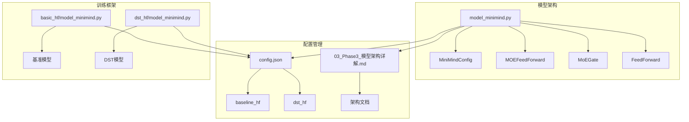
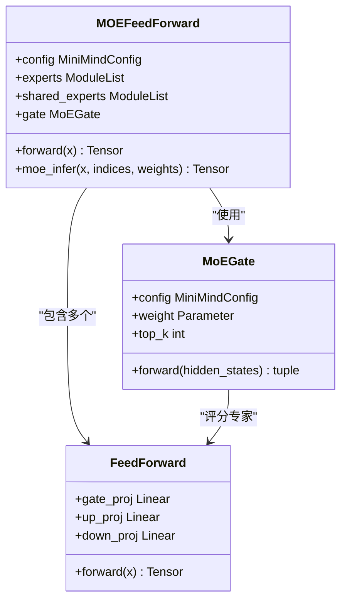
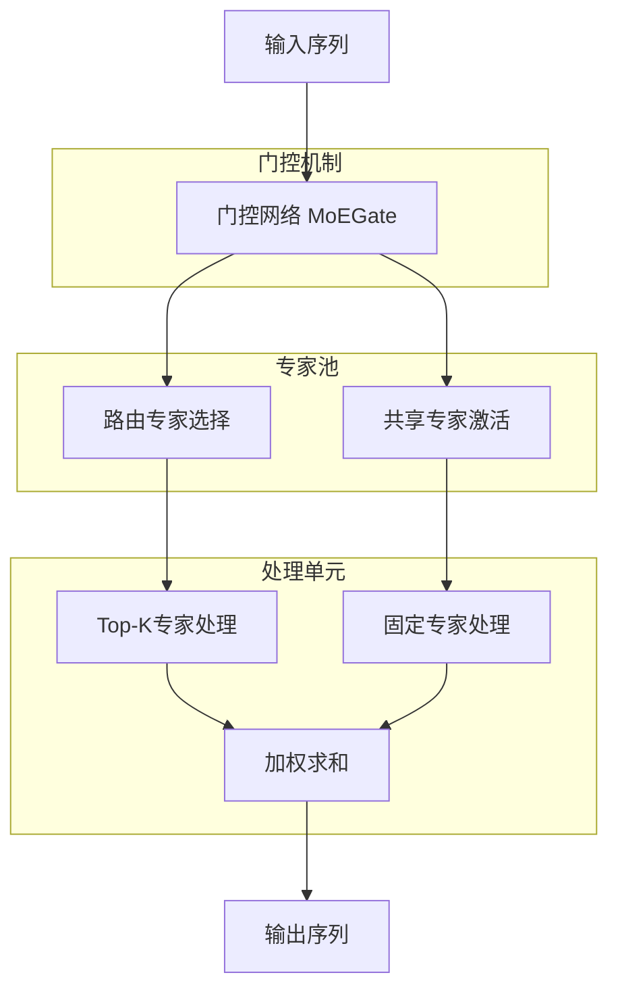
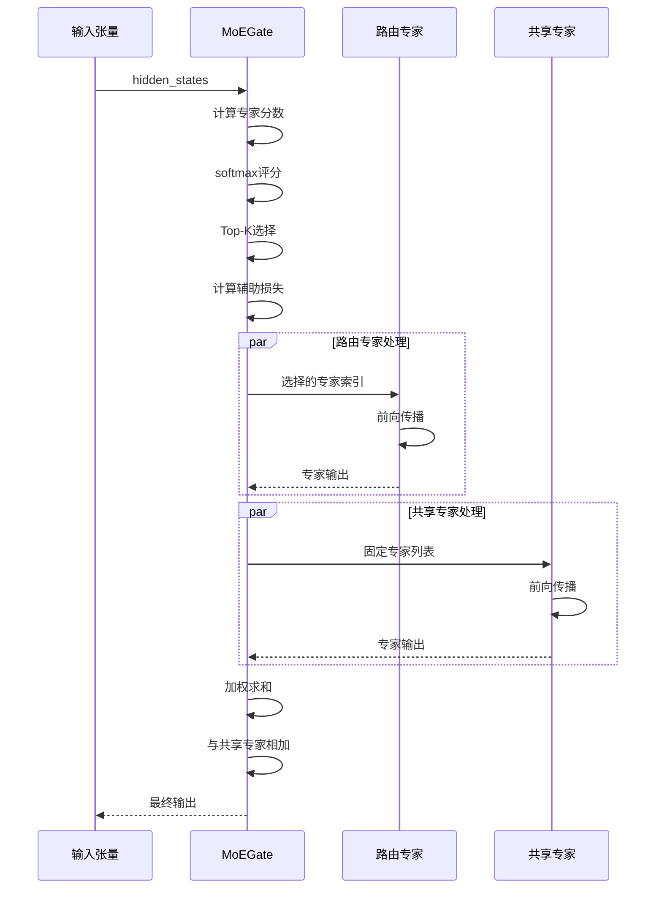
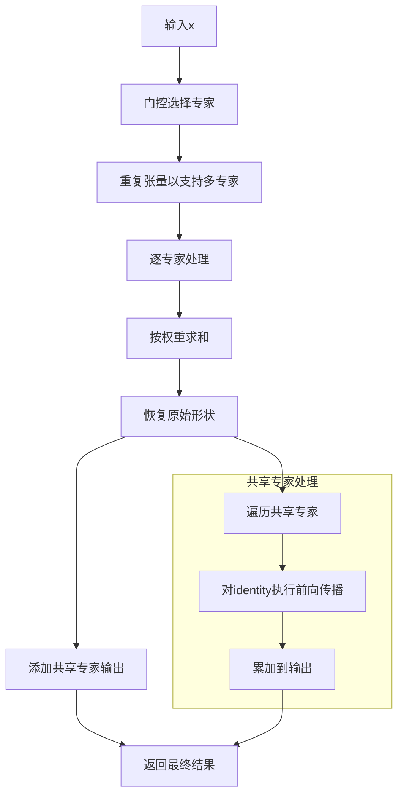
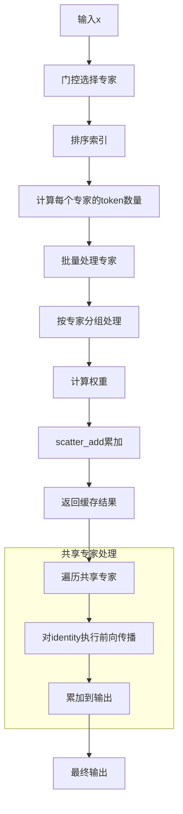
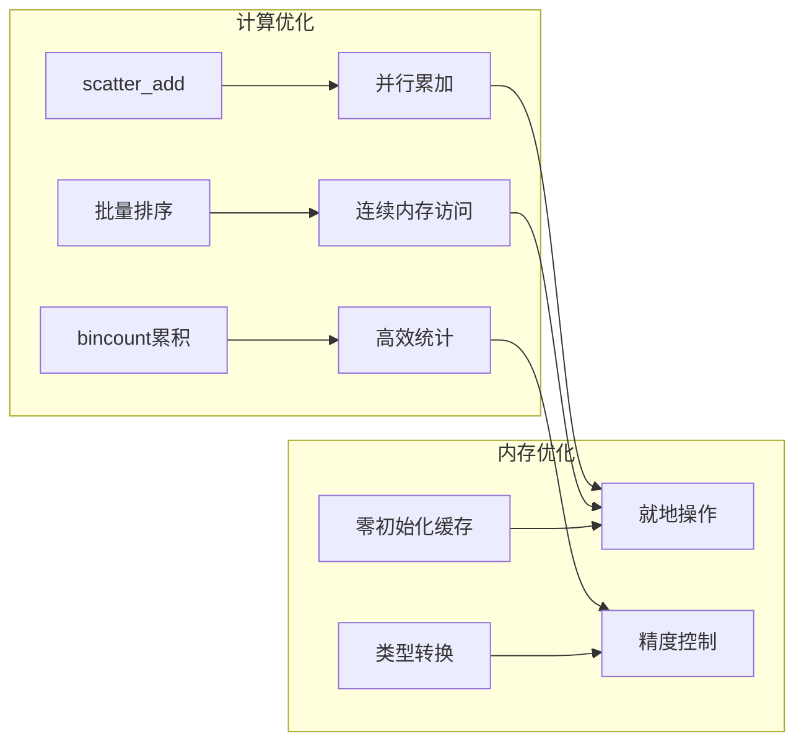
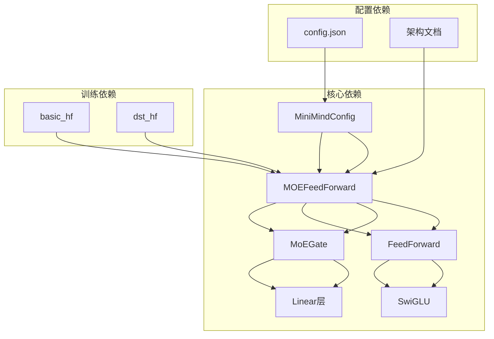
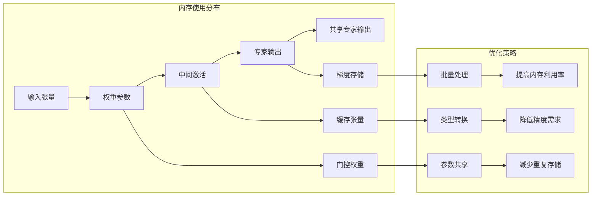

# 共享专家设计

<cite>
**本文档引用的文件**
- [model_minimind.py](file://model/model_minimind.py)
- [config.json](file://DST-train/model/baseline_hf/config.json)
- [config.json](file://DST-train/model/dst_hf/config.json)
- [03_Phase3_模型架构详解.md](file://docs/03_Phase3_模型架构详解.md)
- [model_minimind.py](file://DST-train/model/baseline_hf/model_minimind.py)
- [model_minimind.py](file://DST-train/model/dst_hf/model_minimind.py)
</cite>

## 目录
1. [简介](#简介)
2. [项目结构](#项目结构)
3. [核心组件](#核心组件)
4. [架构概览](#架构概览)
5. [详细组件分析](#详细组件分析)
6. [依赖关系分析](#依赖关系分析)
7. [性能考量](#性能考量)
8. [故障排除指南](#故障排除指南)
9. [结论](#结论)
10. [附录](#附录)

## 简介

MiniMind项目的共享专家设计是一个创新的混合专家（Mixture of Experts, MoE）架构扩展，旨在解决传统MoE架构中的专家过载和路由专家不足问题。该设计通过引入共享专家机制，在保持MoE架构稀疏性优势的同时，确保关键特征的持续学习和传播。

共享专家的核心理念是在每个token的前向传播过程中，除了由门控机制选择的路由专家外，还强制激活一定数量的共享专家。这些共享专家始终参与计算，不会因为门控机制而被抑制，从而有效缓解了专家过载现象并提高了模型的鲁棒性。

## 项目结构

MiniMind项目采用模块化的架构设计，共享专家功能主要集中在以下文件中：

**图表来源**
- [model_minimind.py:1-477](file://model/model_minimind.py#L1-L477)
- [config.json:1-37](file://DST-train/model/baseline_hf/config.json#L1-L37)

**章节来源**
- [model_minimind.py:1-477](file://model/model_minimind.py#L1-L477)
- [config.json:1-37](file://DST-train/model/baseline_hf/config.json#L1-L37)

## 核心组件

### MiniMindConfig配置系统

共享专家设计的核心配置参数包括：

| 参数名称 | 默认值 | 类型 | 描述 |
|---------|--------|------|------|
| `use_moe` | False | bool | 是否启用MoE架构 |
| `num_experts_per_tok` | 2 | int | 每个token选择的专家数量 |
| `n_routed_experts` | 4 | int | 可路由专家总数 |
| `n_shared_experts` | 1 | int | 共享专家数量 |
| `aux_loss_alpha` | 0.1 | float | 辅助损失权重 |
| `seq_aux` | True | bool | 是否按序列计算辅助损失 |
| `norm_topk_prob` | True | bool | 是否标准化Top-K概率 |

### MOEFeedForward主组件

MOEFeedForward是共享专家设计的核心实现，负责协调路由专家和共享专家的协同工作：

**图表来源**
- [model_minimind.py:301-361](file://model/model_minimind.py#L301-L361)
- [model_minimind.py:245-299](file://model/model_minimind.py#L245-L299)
- [model_minimind.py:229-243](file://model/model_minimind.py#L229-L243)

**章节来源**
- [model_minimind.py:301-361](file://model/model_minimind.py#L301-L361)
- [model_minimind.py:245-299](file://model/model_minimind.py#L245-L299)
- [model_minimind.py:229-243](file://model/model_minimind.py#L229-L243)

## 架构概览

共享专家设计的总体架构分为三个层次：

**图表来源**
- [model_minimind.py:316-337](file://model/model_minimind.py#L316-L337)
- [model_minimind.py:264-298](file://model/model_minimind.py#L264-L298)

### 专家协作机制

共享专家与路由专家的协作遵循以下原则：

1. **门控选择**：MoEGate根据隐藏状态计算每个专家的分数，选择Top-K个专家
2. **共享激活**：无论门控结果如何，共享专家始终参与计算
3. **权重融合**：路由专家输出按权重进行加权求和，然后与共享专家输出相加
4. **负载均衡**：通过辅助损失防止专家过载

## 详细组件分析

### 门控网络设计

MoEGate是共享专家设计的关键组件，负责专家选择和负载均衡：

**图表来源**
- [model_minimind.py:264-298](file://model/model_minimind.py#L264-L298)
- [model_minimind.py:316-337](file://model/model_minimind.py#L316-L337)

### 前向传播过程

共享专家的前向传播过程包含以下关键步骤：

#### 训练阶段处理流程

**图表来源**
- [model_minimind.py:324-337](file://model/model_minimind.py#L324-L337)

#### 推理阶段优化处理

**图表来源**
- [model_minimind.py:339-361](file://model/model_minimind.py#L339-L361)

**章节来源**
- [model_minimind.py:316-361](file://model/model_minimind.py#L316-L361)

### 权重共享策略

共享专家设计采用了多层次的权重共享策略：

#### 参数共享机制

| 共享类型 | 共享范围 | 实现方式 | 优势 |
|---------|---------|---------|------|
| 专家权重 | 同一层内 | 相同初始化 | 减少参数量 |
| 门控权重 | 整个网络 | 独立参数 | 灵活的专家选择 |
| 嵌入权重 | 输入输出映射 | 权重绑定 | 参数效率最大化 |

#### 计算共享优化

**图表来源**
- [model_minimind.py:340-360](file://model/model_minimind.py#L340-L360)

**章节来源**
- [model_minimind.py:340-360](file://model/model_minimind.py#L340-L360)

## 依赖关系分析

### 组件间依赖关系

**图表来源**
- [model_minimind.py:8-78](file://model/model_minimind.py#L8-L78)
- [model_minimind.py:301-361](file://model/model_minimind.py#L301-L361)

### 外部依赖关系

项目对外部库的依赖主要体现在以下几个方面：

| 依赖库 | 版本要求 | 用途 | 关键功能 |
|-------|---------|------|---------|
| torch | >=2.6.0 | 核心深度学习框架 | 张量运算、自动微分 |
| transformers | >=4.57.1 | 模型组件 | 预训练模型支持 |
| einops | >=0.8.1 | 张量操作 | 高级张量变换 |
| numpy | >=2.0.0 | 数值计算 | 数据处理和统计 |

**章节来源**
- [requirements.txt:1-31](file://requirements.txt#L1-L31)

## 性能考量

### 计算复杂度分析

共享专家设计在保持MoE稀疏性优势的同时，引入了额外的计算开销：

#### 时间复杂度

| 组件 | 复杂度 | 说明 |
|------|--------|------|
| 门控计算 | O(B×S×H×E) | B:批次, S:序列长度, H:隐藏维度, E:专家数量 |
| 路由专家处理 | O(B×S×H×K) | K:每个token的专家数 |
| 共享专家处理 | O(B×S×H×M) | M:共享专家数量 |
| 总体复杂度 | O(B×S×H×(E+M)) | 当K<<E时保持稀疏性 |

#### 内存占用分析

**图表来源**
- [model_minimind.py:340-360](file://model/model_minimind.py#L340-L360)

### 性能优化策略

#### 训练阶段优化

1. **批量处理优化**：通过排序和分组减少专家间的切换开销
2. **内存复用**：使用零初始化的缓存张量避免重复分配
3. **类型优化**：在可能的情况下使用半精度浮点数

#### 推理阶段优化

1. **就地操作**：尽可能使用就地操作减少内存分配
2. **缓存策略**：利用KV缓存加速自回归生成
3. **并行处理**：共享专家的并行计算优化

**章节来源**
- [model_minimind.py:339-361](file://model/model_minimind.py#L339-L361)

## 故障排除指南

### 常见问题及解决方案

#### 专家过载问题

**症状**：某些专家被过度使用，导致计算不平衡

**诊断方法**：
1. 检查辅助损失是否异常升高
2. 分析专家选择频率分布
3. 监控梯度消失或爆炸

**解决方案**：
1. 调整`aux_loss_alpha`参数增强负载均衡
2. 增加`n_shared_experts`数量
3. 优化`num_experts_per_tok`设置

#### 路由专家不足问题

**症状**：路由专家数量不足以处理复杂任务

**诊断方法**：
1. 评估模型在验证集上的表现
2. 分析专家使用效率
3. 检查任务复杂度与专家数量的匹配度

**解决方案**：
1. 增加`n_routed_experts`数量
2. 调整`num_experts_per_tok`参数
3. 重新设计专家网络结构

#### 共享专家配置问题

**症状**：共享专家数量设置不当影响模型性能

**诊断方法**：
1. 对比不同共享专家数量的性能差异
2. 分析共享专家对特定任务的重要性
3. 评估计算开销与收益的平衡

**解决方案**：
1. 从较小数量开始逐步增加
2. 根据任务复杂度调整数量
3. 考虑资源限制进行权衡

**章节来源**
- [model_minimind.py:279-298](file://model/model_minimind.py#L279-L298)
- [model_minimind.py:333-337](file://model/model_minimind.py#L333-L337)

## 结论

MiniMind项目的共享专家设计通过巧妙的架构创新，有效解决了传统MoE架构中的核心问题。该设计不仅保持了MoE的稀疏性和扩展性优势，还通过共享专家机制提高了模型的鲁棒性和稳定性。

### 主要优势

1. **负载均衡**：共享专家确保关键特征的持续学习，防止专家过载
2. **稳定性提升**：固定专家的存在提高了模型在不同输入下的稳定性
3. **灵活性增强**：可调节的共享专家数量适应不同的任务需求
4. **性能保持**：通过优化算法保持MoE的计算效率

### 应用前景

共享专家设计为大规模语言模型的发展提供了新的思路，特别适用于以下场景：

- 需要高稳定性的生产环境
- 复杂任务的多特征学习
- 资源受限但性能要求高的应用
- 需要渐进式能力扩展的系统

## 附录

### 配置参数详细说明

#### 基础配置参数

| 参数 | 类型 | 默认值 | 作用域 | 描述 |
|------|------|--------|--------|------|
| `use_moe` | bool | False | 全局 | 是否启用MoE架构 |
| `hidden_size` | int | 512 | 模型 | 隐藏层维度 |
| `num_hidden_layers` | int | 8 | 模型 | Transformer层数 |
| `num_attention_heads` | int | 8 | 模型 | 注意力头数 |
| `num_key_value_heads` | int | 2 | 模型 | KV头数（GQA） |

#### MoE专用参数

| 参数 | 类型 | 默认值 | 作用域 | 描述 |
|------|------|--------|--------|------|
| `n_routed_experts` | int | 4 | MoE | 可路由专家总数 |
| `n_shared_experts` | int | 1 | MoE | 共享专家数量 |
| `num_experts_per_tok` | int | 2 | MoE | 每token专家数 |
| `aux_loss_alpha` | float | 0.1 | MoE | 辅助损失权重 |
| `norm_topk_prob` | bool | True | MoE | 是否标准化Top-K概率 |
| `seq_aux` | bool | True | MoE | 是否按序列计算辅助损失 |

### 使用场景建议

#### 任务类型与专家数量匹配

| 任务类型 | 推荐共享专家数 | 推荐路由专家数 | 说明 |
|----------|----------------|----------------|------|
| 简单文本分类 | 1 | 2-4 | 基础特征学习 |
| 中等复杂度任务 | 1-2 | 4-8 | 多特征融合 |
| 复杂语言理解 | 2-3 | 8-16 | 专业领域知识 |
| 大规模生成任务 | 2-4 | 16+ | 复杂模式建模 |

#### 资源消耗估算

基于MiniMind2-Small配置的资源消耗估算：

| 组件 | 参数量 | GPU内存 | 计算开销 |
|------|--------|---------|----------|
| 基础模型 | ~25.8M | ~1GB | 标准 |
| MoE基础 | ~25.8M | ~1GB | +10% |
| +1共享专家 | ~25.8M | ~1GB | +15% |
| +2共享专家 | ~25.8M | ~1GB | +20% |

**章节来源**
- [config.json:1-37](file://DST-train/model/baseline_hf/config.json#L1-L37)
- [03_Phase3_模型架构详解.md:324-342](file://docs/03_Phase3_模型架构详解.md#L324-L342)