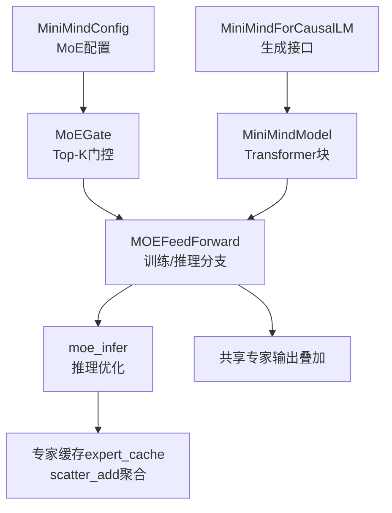
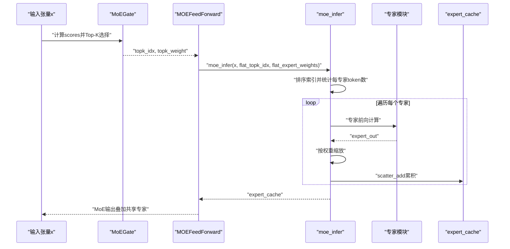
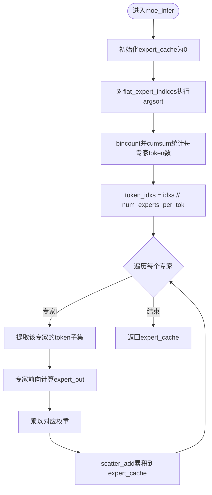
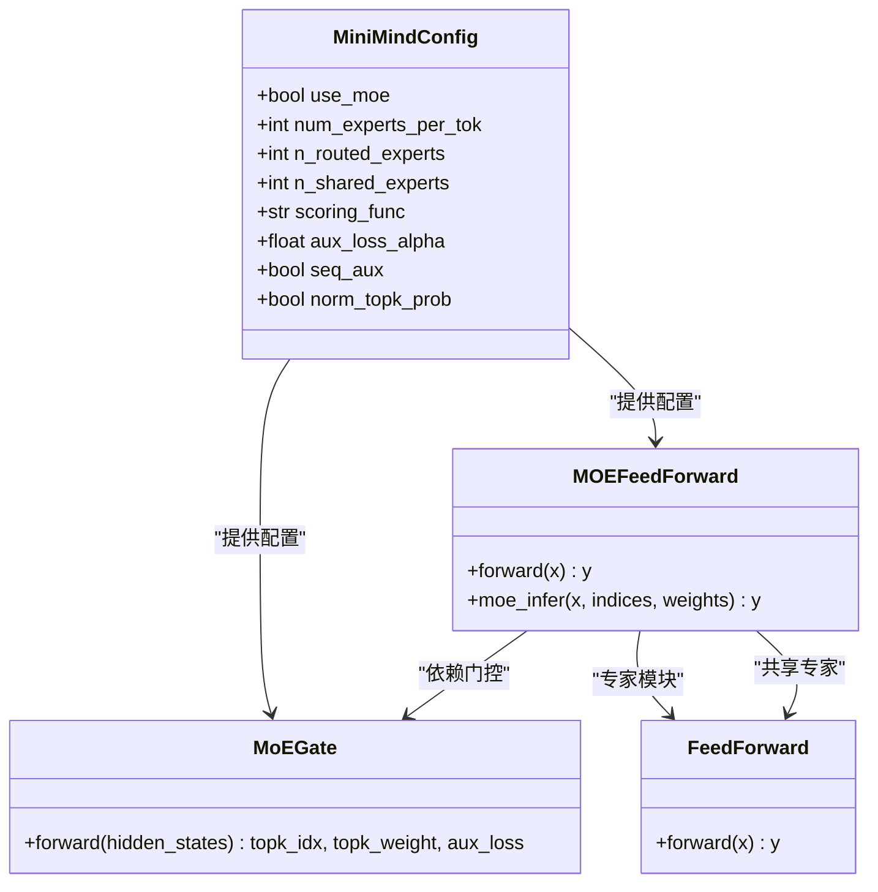

# 推理优化策略

<cite>
**本文引用的文件**
- [model_minimind.py](file://model/model_minimind.py)
- [03_Phase3_模型架构详解.md](file://docs/03_Phase3_模型架构详解.md)
- [eval_benchmark.py](file://eval_benchmark.py)
- [eval_llm.py](file://eval_llm.py)
- [model_minimind.py](file://DST-train/model/baseline_hf/model_minimind.py)
- [model_minimind.py](file://DST-train/model/dst_hf/model_minimind.py)
</cite>

## 目录
1. [引言](#引言)
2. [项目结构](#项目结构)
3. [核心组件](#核心组件)
4. [架构总览](#架构总览)
5. [详细组件分析](#详细组件分析)
6. [依赖关系分析](#依赖关系分析)
7. [性能考量](#性能考量)
8. [故障排查指南](#故障排查指南)
9. [结论](#结论)
10. [附录](#附录)

## 引言
本文件面向MiniMind项目中的MoE（混合专家）推理优化，系统阐述推理模式下moe_infer方法的实现原理与优化策略，包括专家缓存机制、token分组策略、专家输出聚合过程，以及排序与累积操作如何减少重复计算。同时给出与训练模式的性能对比、推理延迟测试方法、内存使用优化建议，并总结大规模推理场景的最佳实践与常见瓶颈的解决方案。

## 项目结构
围绕MoE推理优化的关键代码集中在模型定义与文档说明中，主要涉及：
- 模型定义与MoE前向逻辑：model/model_minimind.py
- MoE推理优化实现：model/model_minimind.py中的moe_infer方法
- 文档说明与MoE架构背景：docs/03_Phase3_模型架构详解.md
- 推理与评测脚本：eval_llm.py、eval_benchmark.py
- DST训练相关MoE实现（对比参考）：DST-train/model/*/model_minimind.py

图表来源
- [model_minimind.py:245-361](file://model/model_minimind.py#L245-L361)
- [model_minimind.py:387-476](file://model/model_minimind.py#L387-L476)

章节来源
- [model_minimind.py:1-477](file://model/model_minimind.py#L1-L477)
- [03_Phase3_模型架构详解.md:207-279](file://docs/03_Phase3_模型架构详解.md#L207-L279)

## 核心组件
- MoEGate：负责为每个token选择Top-K专家并计算权重，支持辅助损失（负载均衡）。
- MOEFeedForward：在训练模式下逐专家处理，在推理模式下调用moe_infer。
- moe_infer（推理优化）：按专家分组处理token，使用expert_cache与scatter_add聚合，避免重复计算。
- 共享专家：始终参与计算，与MoE输出相加。

章节来源
- [model_minimind.py:245-361](file://model/model_minimind.py#L245-L361)
- [model_minimind.py:301-337](file://model/model_minimind.py#L301-L337)

## 架构总览
推理路径的关键流程如下：
- 输入张量x经门控得到flat_topk_idx与flat_expert_weights
- 推理分支调用moe_infer，内部对flat_topk_idx执行排序，按专家分组提取token
- 每个专家仅计算一次，输出乘以对应权重后通过scatter_add累积到expert_cache
- 最终返回expert_cache作为MoE输出，再与共享专家输出叠加

图表来源
- [model_minimind.py:316-337](file://model/model_minimind.py#L316-L337)
- [model_minimind.py:339-361](file://model/model_minimind.py#L339-L361)

## 详细组件分析

### moe_infer方法：专家缓存与分组聚合
- 专家缓存机制
  - 初始化expert_cache为与输入同形状的零张量，用于累积每个token的专家输出。
- token分组策略
  - 对flat_expert_indices执行argsort，得到排序后的索引idxs。
  - 使用bincount与cumsum统计每个专家处理的token数量边界，从而划分区间。
  - token_idxs = idxs // num_experts_per_tok，将排序后的索引映射回原始token位置。
- 专家输出聚合
  - 遍历每个专家，提取该专家对应的token子集，调用专家前向得到expert_out。
  - 将expert_out乘以对应权重（flat_expert_weights[idxs[start:end]]）。
  - 使用scatter_add将加权输出按原始token位置累积到expert_cache。

图表来源
- [model_minimind.py:339-361](file://model/model_minimind.py#L339-L361)

章节来源
- [model_minimind.py:339-361](file://model/model_minimind.py#L339-L361)

### 与训练模式的差异与性能对比
- 训练模式
  - 将输入沿token维重复num_experts_per_tok次，然后按专家索引筛选并逐专家计算，最后按权重加权求和。
  - 优点：逻辑直观，便于梯度传播。
  - 缺点：存在重复展开与多次专家调用，推理成本高。
- 推理模式（moe_infer）
  - 通过排序与分组，每个专家仅计算一次，使用scatter_add累积，显著减少重复计算。
  - 优点：推理效率高，适合长序列与大批量场景。
  - 缺点：需要额外的排序与计数开销，但通常远小于重复专家调用的成本。

章节来源
- [model_minimind.py:316-337](file://model/model_minimind.py#L316-L337)
- [model_minimind.py:339-361](file://model/model_minimind.py#L339-L361)

### 专家缓存与scatter_add优化技巧
- expert_cache
  - 作为累积缓冲区，避免在循环中频繁分配新张量，降低内存碎片与拷贝开销。
- scatter_add
  - 将加权专家输出按原始token位置累加，天然支持多专家覆盖同一token的场景（Top-K>1）。
  - 与直接索引赋值相比，scatter_add避免了重复写入冲突，确保正确性与性能。

章节来源
- [model_minimind.py:340-360](file://model/model_minimind.py#L340-L360)

### 推理延迟测试与评测
- 推理脚本
  - eval_llm.py提供交互式推理与对话功能，支持设置生成参数（如温度、top_p、最大生成长度等），可直接评估推理时延与质量。
- 基准评测
  - eval_benchmark.py提供多选题评测流程，支持C-Eval与CMMLU数据集，可作为推理稳定性与准确性的参考指标。
- 测试建议
  - 使用不同batch_size与序列长度组合，记录端到端时延与吞吐。
  - 关注显存峰值与利用率，结合模型参数规模与dtype（如float16）调整批大小。

章节来源
- [eval_llm.py:12-89](file://eval_llm.py#L12-L89)
- [eval_benchmark.py:122-231](file://eval_benchmark.py#L122-L231)

## 依赖关系分析
- MoEGate依赖于MiniMindConfig中的门控参数（Top-K、评分函数、归一化等）。
- MOEFeedForward依赖MoEGate输出的topk_idx与topk_weight，并在推理模式下调用moe_infer。
- moe_infer依赖专家模块列表experts与配置中的num_experts_per_tok、n_routed_experts。
- 共享专家shared_experts在MoE输出基础上叠加，提升表达能力。

图表来源
- [model_minimind.py:8-78](file://model/model_minimind.py#L8-L78)
- [model_minimind.py:245-361](file://model/model_minimind.py#L245-L361)

章节来源
- [model_minimind.py:8-78](file://model/model_minimind.py#L8-L78)
- [model_minimind.py:245-361](file://model/model_minimind.py#L245-L361)

## 性能考量
- 排序与分组的复杂度
  - argsort与bincount/cumsum的时间复杂度与token数成正比，通常远小于重复专家调用的开销。
- 内存使用优化
  - 使用expert_cache复用缓冲区，避免中间张量频繁分配。
  - dtype选择（如float16）可显著降低显存占用，但需注意数值稳定性。
- 批处理与序列长度
  - 批大小与序列长度直接影响token总量，应结合硬件资源动态调整。
- 与训练模式对比
  - 推理模式通过“少次多专家”与“一次性scatter_add”替代“多次专家重复计算”，在长序列与大批量场景下收益明显。

章节来源
- [model_minimind.py:339-361](file://model/model_minimind.py#L339-L361)
- [eval_benchmark.py:122-135](file://eval_benchmark.py#L122-L135)

## 故障排查指南
- CUDA不可用或显存不足
  - 现象：推理报错或速度极慢。
  - 处理：切换到CPU（仅限调试）、降低batch_size、使用float16、关闭不必要的日志与调试信息。
- 专家权重与索引不一致
  - 现象：输出异常或NaN。
  - 处理：检查topk_idx与topk_weight的形状一致性，确认num_experts_per_tok与experts数量匹配。
- scatter_add索引越界
  - 现象：索引错误或输出异常。
  - 处理：核对token_idxs与原始token位置映射，确保idxs与token_idxs的对应关系正确。
- 评测数据集加载失败
  - 现象：评测脚本报错。
  - 处理：检查网络与镜像源配置，确认数据集路径与权限。

章节来源
- [eval_benchmark.py:85-109](file://eval_benchmark.py#L85-L109)
- [model_minimind.py:339-361](file://model/model_minimind.py#L339-L361)

## 结论
MiniMind的MoE推理优化通过moe_infer实现了“排序+分组+scatter_add”的高效聚合策略，显著减少了重复专家计算，提升了推理吞吐与稳定性。配合共享专家与合理的批处理策略，可在大规模推理场景中取得良好性能。建议在部署前进行延迟与内存压力测试，并根据硬件资源动态调整批大小与dtype。

## 附录
- MoE架构与配置要点参见文档说明，包括门控评分、Top-K选择、辅助损失与共享专家等。
- 推理与评测脚本提供了快速验证与基准评估的工具链。

章节来源
- [03_Phase3_模型架构详解.md:207-279](file://docs/03_Phase3_模型架构详解.md#L207-L279)
- [eval_llm.py:12-89](file://eval_llm.py#L12-L89)
- [eval_benchmark.py:443-502](file://eval_benchmark.py#L443-L502)