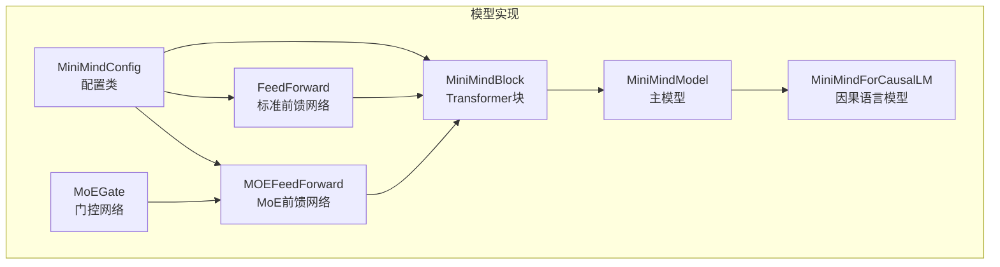
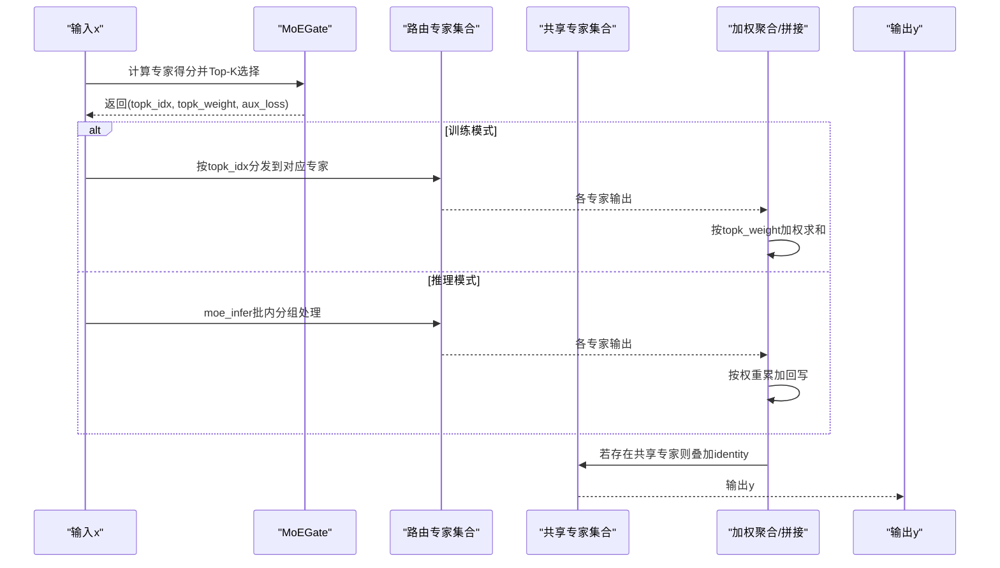
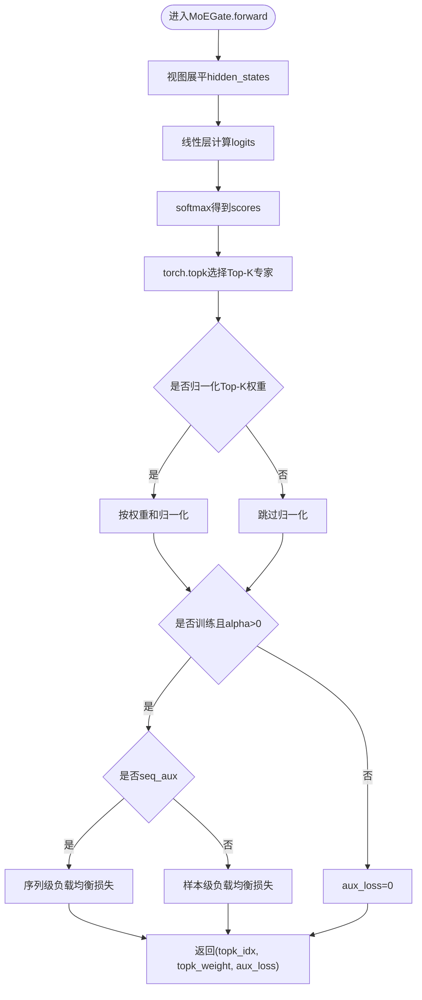
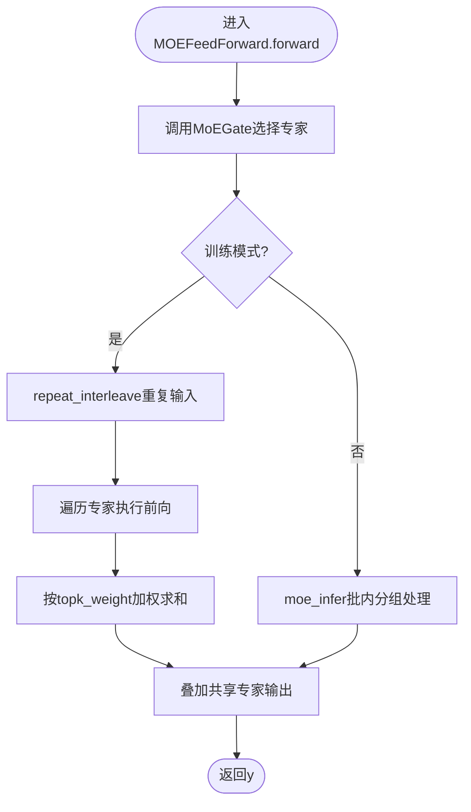
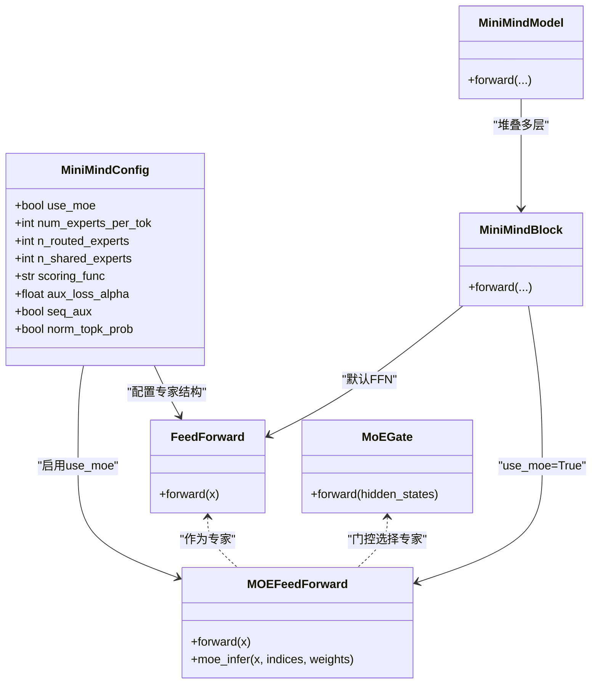

# 混合专家架构

<cite>
**本文引用的文件**
- [model_minimind.py](file://model/model_minimind.py)
- [model_minimind.py（HF基线版本）](file://DST-train/model/baseline_hf/model_minimind.py)
- [model_minimind.py（DST HF版本）](file://DST-train/model/dst_hf/model_minimind.py)
- [03_Phase3_模型架构详解.md](file://docs/03_Phase3_模型架构详解.md)
- [configuration.json（MiniMind2-PyTorch）](file://MiniMind2-PyTorch/configuration.json)
</cite>

## 目录
1. [简介](#简介)
2. [项目结构](#项目结构)
3. [核心组件](#核心组件)
4. [架构总览](#架构总览)
5. [详细组件分析](#详细组件分析)
6. [依赖关系分析](#依赖关系分析)
7. [性能考量](#性能考量)
8. [故障排查指南](#故障排查指南)
9. [结论](#结论)
10. [附录](#附录)

## 简介
本文件面向MiniMind项目中的混合专家（Mixture of Experts, MoE）架构，系统阐述其设计理念、专家选择机制、负载均衡策略与辅助损失、门控网络实现、Top-K专家选择与权重归一化、路由专家与共享专家的区别、MoE前向传播的训练与推理优化模式、以及路由崩塌问题的解决方案与专家利用率分析。同时提供参数量与计算开销对比、可视化示例思路与性能调优建议，帮助读者从原理到工程实现全面掌握MoE。

## 项目结构
与MoE相关的核心代码集中在模型定义文件中，文档中对MoE的实现细节与配置进行了说明。下图展示与MoE相关的模块与文件映射关系。

图表来源
- [model_minimind.py:8-78](file://model/model_minimind.py#L8-L78)
- [model_minimind.py:229-243](file://model/model_minimind.py#L229-L243)
- [model_minimind.py:301-375](file://model/model_minimind.py#L301-L375)
- [model_minimind.py:363-385](file://model/model_minimind.py#L363-L385)
- [model_minimind.py:387-477](file://model/model_minimind.py#L387-L477)

章节来源
- [model_minimind.py:8-78](file://model/model_minimind.py#L8-L78)
- [model_minimind.py:229-243](file://model/model_minimind.py#L229-L243)
- [model_minimind.py:301-375](file://model/model_minimind.py#L301-L375)
- [model_minimind.py:363-385](file://model/model_minimind.py#L363-L385)
- [model_minimind.py:387-477](file://model/model_minimind.py#L387-L477)

## 核心组件
- MiniMindConfig：集中管理MoE相关配置项，包括use_moe、num_experts_per_tok、n_routed_experts、n_shared_experts、scoring_func、aux_loss_alpha、seq_aux、norm_topk_prob等。
- FeedForward：标准SwiGLU前馈网络，作为MoE中的“专家”基础单元。
- MoEGate：门控网络，负责为每个token打分并选择Top-K专家，计算Top-K权重与辅助损失。
- MOEFeedForward：MoE前馈网络，组合多个专家与门控，实现训练与推理的差异化前向传播。
- MiniMindBlock：包含注意力与MoE/FFN的Transformer块。
- MiniMindModel：堆叠多层Block，收集各层aux_loss。
- MiniMindForCausalLM：封装LM头部与输出。

章节来源
- [model_minimind.py:8-78](file://model/model_minimind.py#L8-L78)
- [model_minimind.py:229-243](file://model/model_minimind.py#L229-L243)
- [model_minimind.py:245-298](file://model/model_minimind.py#L245-L298)
- [model_minimind.py:301-375](file://model/model_minimind.py#L301-L375)
- [model_minimind.py:363-385](file://model/model_minimind.py#L363-L385)
- [model_minimind.py:387-477](file://model/model_minimind.py#L387-L477)

## 架构总览
MoE在MiniMind中以“门控网络 + 路由专家 + 共享专家”的形式嵌入到Transformer块的前馈子层中。门控网络基于隐藏态计算每个专家的得分，Top-K选择并归一化权重，随后按权重加权聚合专家输出，并叠加共享专家输出。训练时计算辅助损失以维持专家利用率均衡，推理时采用批内分组的高效前向传播。

图表来源
- [model_minimind.py:321-337](file://model/model_minimind.py#L321-L337)
- [model_minimind.py:339-360](file://model/model_minimind.py#L339-L360)

章节来源
- [model_minimind.py:301-375](file://model/model_minimind.py#L301-L375)

## 详细组件分析

### 门控网络（MoEGate）
- 设计理念：以线性层将隐藏态映射到专家维度，softmax得到专家得分，Top-K选择Top-k专家及其权重。
- Top-K与权重归一化：当Top-K>1且开启归一化时，对Top-K权重进行归一化，确保权重和为1。
- 辅助损失（负载均衡）：在训练时计算，防止“路由崩塌”。支持两种模式：
  - 序列级（seq_aux=True）：按专家维度统计专家被选次数，除以专家总数与序列长度，再与专家平均分数相乘并求和。
  - 样本级（seq_aux=False）：直接统计专家被选频率与专家平均分数的乘积。
- 评分函数：当前实现仅支持softmax评分函数。

图表来源
- [model_minimind.py:264-298](file://model/model_minimind.py#L264-L298)

章节来源
- [model_minimind.py:245-298](file://model/model_minimind.py#L245-L298)

### 路由专家与共享专家
- 路由专家（routed experts）：按门控选择参与计算，数量由n_routed_experts决定。
- 共享专家（shared experts）：始终参与计算，数量由n_shared_experts决定，叠加在门控专家输出之上。
- 区别与作用：
  - 路由专家：按token动态选择，提升稀疏计算与专家利用率。
  - 共享专家：提供稳定特征增强，缓解路由不确定性带来的波动。

章节来源
- [model_minimind.py:301-315](file://model/model_minimind.py#L301-L315)
- [model_minimind.py:333-336](file://model/model_minimind.py#L333-L336)

### MoE前向传播（训练与推理优化）
- 训练模式：
  - 将输入重复num_experts_per_tok次，按topk_idx分发给对应专家，专家输出按topk_weight加权求和。
  - 类型一致性：专家输出与输入dtype一致，避免精度损失。
- 推理模式（moe_infer）：
  - 对flat_topk_idx排序，统计每个专家处理的token数量，按专家分组提取token并执行专家前向。
  - 将专家输出乘以对应权重，回写到expert_cache中，最终得到聚合输出。
  - 该模式避免重复展开，显著降低内存与访存压力。

图表来源
- [model_minimind.py:316-337](file://model/model_minimind.py#L316-L337)
- [model_minimind.py:339-360](file://model/model_minimind.py#L339-L360)

章节来源
- [model_minimind.py:301-375](file://model/model_minimind.py#L301-L375)

### 辅助损失与路由崩塌
- 辅助损失（aux_loss）：用于负载均衡，防止所有token被路由到少数专家，避免“路由崩塌”。
- 计算方式：
  - 序列级：统计专家被选次数，归一化为专家选择频率，与专家平均分数相乘并求和，再乘以alpha系数。
  - 样本级：直接统计专家选择频率与专家平均分数的乘积。
- alpha系数：控制辅助损失在总损失中的比重，通常较小以平衡主任务与负载均衡。

章节来源
- [model_minimind.py:279-298](file://model/model_minimind.py#L279-L298)
- [03_Phase3_模型架构详解.md:272-279](file://docs/03_Phase3_模型架构详解.md#L272-L279)

### 专家利用率分析
- 利用率指标：可通过统计每个专家被选次数占总选中次数的比例，评估专家使用均衡性。
- 影响因素：
  - Top-K越大，专家利用率越分散，但计算开销增加。
  - 归一化权重使权重和为1，利于稳定聚合。
  - 共享专家的存在会提升整体利用率，但也会增加计算量。

章节来源
- [model_minimind.py:284-289](file://model/model_minimind.py#L284-L289)
- [model_minimind.py:291-295](file://model/model_minimind.py#L291-L295)

### 参数量与计算开销对比
- 参数量构成：
  - 专家参数：每个专家包含Gate/Up/Down投影层，参数量约为3×(intermediate_size×hidden_size)。
  - 门控权重：形状为(n_routed_experts, hidden_size)，参数量为n_routed_experts×hidden_size。
  - 共享专家：若n_shared_experts>0，则额外增加相应参数。
- 计算开销：
  - 训练：需对每个专家分别前向，且进行加权聚合，显存与计算开销较高。
  - 推理：moe_infer按专家分组处理，减少重复展开，降低显存峰值与访存压力。
- 文档中的参数量估算示例展示了不同配置下的参数规模，便于对比。

章节来源
- [model_minimind.py:8-78](file://model/model_minimind.py#L8-L78)
- [03_Phase3_模型架构详解.md:324-342](file://docs/03_Phase3_模型架构详解.md#L324-L342)

## 依赖关系分析
MoE模块与模型其他组件的依赖关系如下：

图表来源
- [model_minimind.py:8-78](file://model/model_minimind.py#L8-L78)
- [model_minimind.py:229-243](file://model/model_minimind.py#L229-L243)
- [model_minimind.py:245-298](file://model/model_minimind.py#L245-L298)
- [model_minimind.py:301-375](file://model/model_minimind.py#L301-L375)
- [model_minimind.py:363-385](file://model/model_minimind.py#L363-L385)
- [model_minimind.py:387-477](file://model/model_minimind.py#L387-L477)

章节来源
- [model_minimind.py:363-385](file://model/model_minimind.py#L363-L385)
- [model_minimind.py:387-477](file://model/model_minimind.py#L387-L477)

## 性能考量
- 训练与推理差异：
  - 训练：repeat_interleave展开输入，逐专家执行，内存占用高，但实现简单。
  - 推理：moe_infer按专家分组处理，减少重复展开，降低显存峰值与访存压力。
- 归一化Top-K权重：确保权重和为1，提升数值稳定性与聚合一致性。
- 共享专家：提升稳定性与鲁棒性，但增加计算与显存开销。
- 门控评分函数：当前实现为softmax，具备良好的概率分布性质，便于辅助损失计算。
- 参数与计算开销：n_routed_experts与num_experts_per_tok直接影响参数量与计算量，应结合硬件资源与任务需求进行权衡。

章节来源
- [model_minimind.py:275-277](file://model/model_minimind.py#L275-L277)
- [model_minimind.py:316-337](file://model/model_minimind.py#L316-L337)
- [model_minimind.py:339-360](file://model/model_minimind.py#L339-L360)

## 故障排查指南
- 路由崩塌（所有token被分配到同一专家）：
  - 现象：专家利用率极不均衡，aux_loss异常增大。
  - 解决：提高aux_loss_alpha，启用seq_aux，适当增大num_experts_per_tok或n_routed_experts。
- 权重归一化问题：
  - 现象：输出不稳定或数值溢出。
  - 解决：确保norm_topk_prob开启，检查topk_weight是否正确归一化。
- 推理显存不足：
  - 现象：推理时OOM。
  - 解决：检查moe_infer的分组策略是否正确，必要时降低num_experts_per_tok或n_routed_experts。
- 共享专家导致性能下降：
  - 现象：共享专家过多导致计算与显存开销上升。
  - 解决：评估n_shared_experts，按需减少或关闭共享专家。

章节来源
- [model_minimind.py:279-298](file://model/model_minimind.py#L279-L298)
- [model_minimind.py:339-360](file://model/model_minimind.py#L339-L360)

## 结论
MiniMind的MoE实现以轻量门控网络为核心，结合Top-K专家选择与权重归一化，实现了高效的路由机制与稳定的负载均衡。训练与推理模式分别针对不同阶段优化，兼顾性能与稳定性。通过共享专家与辅助损失，系统在保证表达能力的同时提升了鲁棒性。合理配置MoE超参（如Top-K、专家数量、辅助损失系数）是获得良好性能的关键。

## 附录
- 可视化示例思路：
  - 专家选择热力图：展示每个token在不同时间步被分配到的专家索引。
  - 专家利用率曲线：统计专家被选次数随训练步数的变化。
  - 辅助损失曲线：监控aux_loss随训练过程的收敛趋势。
- 性能调优建议：
  - 适度增大num_experts_per_tok与n_routed_experts以提升表达能力，但需关注显存与吞吐。
  - 合理设置aux_loss_alpha，避免过度抑制主任务。
  - 在推理阶段优先使用moe_infer，减少重复展开带来的开销。
  - 根据任务需求调整共享专家数量，权衡稳定性与开销。