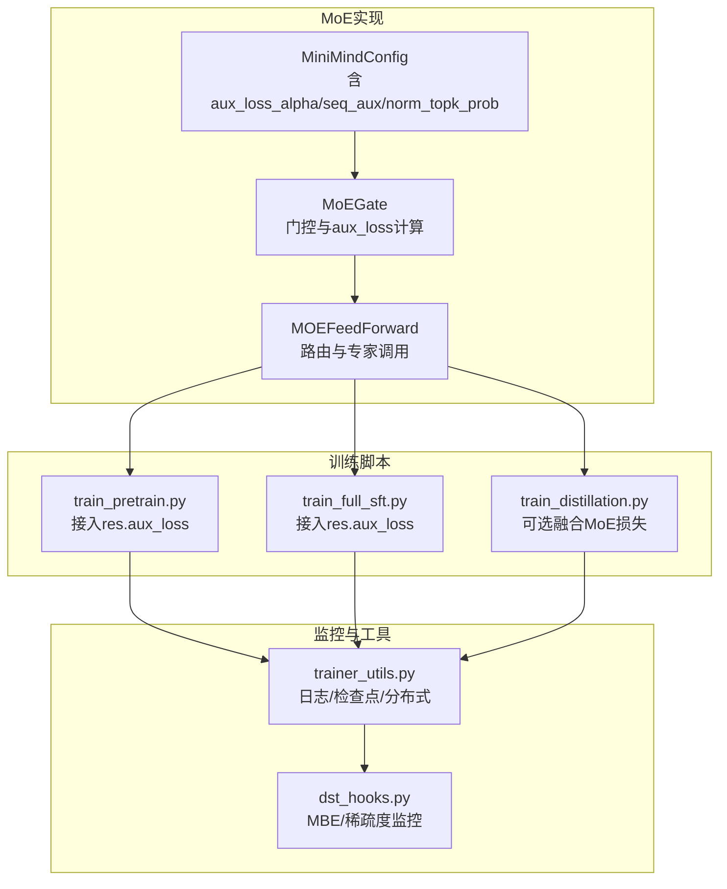
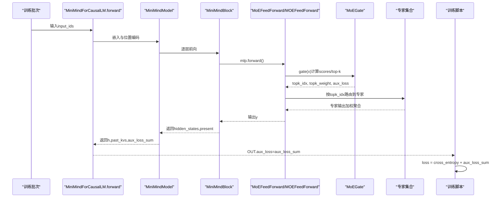
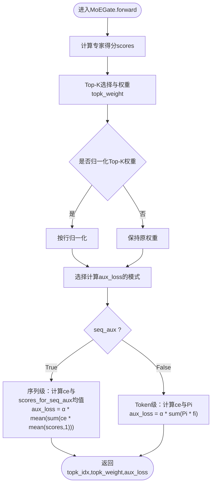
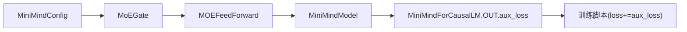

# 辅助损失机制

<cite>
**本文引用的文件**
- [model/model_minimind.py](file://model/model_minimind.py)
- [DST-train/model/baseline_hf/model_minimind.py](file://DST-train/model/baseline_hf/model_minimind.py)
- [DST-train/model/dst_hf/model_minimind.py](file://DST-train/model/dst_hf/model_minimind.py)
- [trainer/train_pretrain.py](file://trainer/train_pretrain.py)
- [trainer/train_full_sft.py](file://trainer/train_full_sft.py)
- [trainer/train_distillation.py](file://trainer/train_distillation.py)
- [docs/03_Phase3_模型架构详解.md](file://docs/03_Phase3_模型架构详解.md)
- [docs/04_Phase4_预训练.md](file://docs/04_Phase4_预训练.md)
- [trainer/trainer_utils.py](file://trainer/trainer_utils.py)
- [DST-train/dst_hooks.py](file://DST-train/dst_hooks.py)
</cite>

## 目录
1. [引言](#引言)
2. [项目结构](#项目结构)
3. [核心组件](#核心组件)
4. [架构总览](#架构总览)
5. [详细组件分析](#详细组件分析)
6. [依赖分析](#依赖分析)
7. [性能考量](#性能考量)
8. [故障排查指南](#故障排查指南)
9. [结论](#结论)
10. [附录](#附录)

## 引言
本文件系统性阐述MiniMind项目中MoE（Mixture-of-Experts）的辅助损失（aux_loss）机制，聚焦以下目标：
- 深入解析aux_loss的计算原理，包括专家使用分布的KL散度思想、序列级别与token级别的损失计算方式；
- 明确aux_loss_alpha参数的作用、aux_loss在总损失中的贡献与平衡策略；
- 提供辅助损失的数学推导、计算公式与实现映射；
- 给出辅助损失监控方法、训练过程中的调试技巧、以及防止路由崩塌的有效手段；
- 解释专家利用率与辅助损失的关系，以及如何通过辅助损失优化专家使用。

## 项目结构
与MoE辅助损失直接相关的代码分布在如下模块：
- MoE门控与辅助损失计算：model_minimind.py、DST-train/model/baseline_hf/model_minimind.py、DST-train/model/dst_hf/model_minimind.py
- 训练脚本中对aux_loss的接入与监控：trainer/train_pretrain.py、trainer/train_full_sft.py、trainer/train_distillation.py
- 文档与配置说明：docs/03_Phase3_模型架构详解.md、docs/04_Phase4_预训练.md
- 训练工具与Hook：trainer/trainer_utils.py、DST-train/dst_hooks.py

图表来源
- [model/model_minimind.py:245-298](file://model/model_minimind.py#L245-L298)
- [trainer/train_pretrain.py:23-43](file://trainer/train_pretrain.py#L23-L43)
- [trainer/train_full_sft.py:23-43](file://trainer/train_full_sft.py#L23-L43)
- [trainer/train_distillation.py:38-89](file://trainer/train_distillation.py#L38-L89)
- [trainer/trainer_utils.py:100-111](file://trainer/trainer_utils.py#L100-L111)
- [DST-train/dst_hooks.py:10-138](file://DST-train/dst_hooks.py#L10-L138)

章节来源
- [model/model_minimind.py:245-298](file://model/model_minimind.py#L245-L298)
- [trainer/train_pretrain.py:23-43](file://trainer/train_pretrain.py#L23-L43)
- [trainer/train_full_sft.py:23-43](file://trainer/train_full_sft.py#L23-L43)
- [trainer/train_distillation.py:38-89](file://trainer/train_distillation.py#L38-L89)
- [trainer/trainer_utils.py:100-111](file://trainer/trainer_utils.py#L100-L111)
- [DST-train/dst_hooks.py:10-138](file://DST-train/dst_hooks.py#L10-L138)

## 核心组件
- MoEGate：负责计算专家得分scores、Top-K选择、归一化权重，并在训练中按配置计算aux_loss。
- MOEFeedForward：根据门控结果路由到专家，聚合输出，并持有aux_loss供上层汇总。
- MiniMindModel：遍历各层，汇总所有MOE层的aux_loss，形成全局aux_loss。
- 训练脚本：在总损失中直接累加res.aux_loss，实现MoE负载均衡约束。

章节来源
- [model/model_minimind.py:245-298](file://model/model_minimind.py#L245-L298)
- [model/model_minimind.py:301-337](file://model/model_minimind.py#L301-L337)
- [model/model_minimind.py:434-440](file://model/model_minimind.py#L434-L440)
- [trainer/train_pretrain.py:42](file://trainer/train_pretrain.py#L42)
- [trainer/train_full_sft.py:42](file://trainer/train_full_sft.py#L42)

## 架构总览
MoE辅助损失贯穿“门控→路由→专家执行→损失汇总”的链路，训练脚本在主损失基础上直接叠加aux_loss，从而在训练过程中施加专家使用分布的均衡约束。

图表来源
- [model/model_minimind.py:403-440](file://model/model_minimind.py#L403-L440)
- [model/model_minimind.py:316-337](file://model/model_minimind.py#L316-L337)
- [model/model_minimind.py:264-298](file://model/model_minimind.py#L264-L298)
- [trainer/train_pretrain.py:34-43](file://trainer/train_pretrain.py#L34-L43)
- [trainer/train_full_sft.py:34-43](file://trainer/train_full_sft.py#L34-L43)

## 详细组件分析

### MoEGate与aux_loss计算
- 专家得分与Top-K选择
  - 依据隐藏态线性投影得到专家得分logits，经softmax得到scores；
  - 通过topk选出前K个专家及其权重topk_weight，若开启norm_topk_prob则做归一化。
- 辅助损失计算（两种模式）
  - 序列级别(seq_aux=True)：对每个专家在批次内的累计使用次数做归一化，得到专家使用频率ce；对每个序列的专家平均分数scores_for_seq_aux取均值，二者逐元素相乘并求和，再对批次取均值得到aux_loss，最后乘以alpha。
  - Token级别(seq_aux=False)：基于one-hot统计专家被选择的频率ce，计算全局专家平均分数Pi，二者逐元素乘积求和，再乘以alpha。
- 关键参数
  - aux_loss_alpha（alpha）：控制aux_loss在总损失中的权重；
  - seq_aux：决定使用序列级还是token级的专家使用分布；
  - norm_topk_prob：是否对Top-K权重做归一化。

图表来源
- [model/model_minimind.py:264-298](file://model/model_minimind.py#L264-L298)
- [DST-train/model/baseline_hf/model_minimind.py:264-298](file://DST-train/model/baseline_hf/model_minimind.py#L264-L298)
- [DST-train/model/dst_hf/model_minimind.py:264-298](file://DST-train/model/dst_hf/model_minimind.py#L264-L298)

章节来源
- [model/model_minimind.py:264-298](file://model/model_minimind.py#L264-L298)
- [DST-train/model/baseline_hf/model_minimind.py:264-298](file://DST-train/model/baseline_hf/model_minimind.py#L264-L298)
- [DST-train/model/dst_hf/model_minimind.py:264-298](file://DST-train/model/dst_hf/model_minimind.py#L264-L298)

### MOEFeedForward与专家路由
- 训练时：按topk_idx将token分发至对应专家，执行后按topk_weight加权聚合；
- 推理时：通过moe_infer按专家分组批量处理，提升效率；
- 持有aux_loss并在前向结束赋值，供上层汇总。

章节来源
- [model/model_minimind.py:301-337](file://model/model_minimind.py#L301-L337)

### MiniMindModel的aux_loss汇总
- 遍历所有层，仅对MOE层累加其内部的aux_loss，形成全局aux_loss；
- 供MiniMindForCausalLM.forward返回的OUT.aux_loss使用。

章节来源
- [model/model_minimind.py:434-440](file://model/model_minimind.py#L434-L440)

### 训练脚本中的接入与监控
- 预训练/全量SFT：直接将res.aux_loss加到交叉熵损失上，作为总损失的一部分参与反向。
- 知识蒸馏：在distillation.py中，若学生模型启用MoE，则将res.aux_loss加入CE损失后再与蒸馏损失加权组合。

章节来源
- [trainer/train_pretrain.py:42](file://trainer/train_pretrain.py#L42)
- [trainer/train_full_sft.py:42](file://trainer/train_full_sft.py#L42)
- [trainer/train_distillation.py:75-89](file://trainer/train_distillation.py#L75-L89)

### 数学推导与公式
- 序列级别（seq_aux=True）：
  - 专家使用频率：对每个专家在批次内累计使用次数除以总分配次数（按专家数归一），得到ce；
  - 序列平均分数：对每个序列的专家平均分数取均值；
  - 辅助损失：aux_loss = α · mean(Σ ce_i · mean(score_i,1))。
- Token级别（seq_aux=False）：
  - 专家使用频率：基于one-hot统计的专家选择频率ce；
  - 全局专家平均分数：Pi = mean(scores)；
  - 辅助损失：aux_loss = α · sum(Pi · fi)，其中fi为专家被选择的频率（与ce的含义一致，此处以Pi·fi表述）。

章节来源
- [model/model_minimind.py:283-295](file://model/model_minimind.py#L283-L295)
- [DST-train/model/baseline_hf/model_minimind.py:283-295](file://DST-train/model/baseline_hf/model_minimind.py#L283-L295)
- [DST-train/model/dst_hf/model_minimind.py:283-295](file://DST-train/model/dst_hf/model_minimind.py#L283-L295)

### aux_loss_alpha的作用与平衡策略
- 作用：作为正则项权重，控制专家使用分布均衡对总损失的贡献程度；
- 平衡策略：
  - 初始可设较小值（如默认0.1），随训练稳定逐步增大；
  - 若aux_loss过大导致主损失退化，应降低alpha或增加主损失权重；
  - 结合学习率调度与梯度裁剪，避免aux_loss主导训练动态。

章节来源
- [model/model_minimind.py:75](file://model/model_minimind.py#L75)
- [trainer/train_pretrain.py:42](file://trainer/train_pretrain.py#L42)
- [trainer/train_full_sft.py:42](file://trainer/train_full_sft.py#L42)

### 防止路由崩塌的有效手段
- 合理设置alpha，使aux_loss对路由分布产生足够约束；
- 启用Top-K权重归一化（norm_topk_prob），避免权重集中在少数专家；
- 控制num_experts_per_tok（top_k），避免过度集中；
- 监控专家使用分布，必要时降低alpha或增加top_k；
- 使用序列级辅助损失（seq_aux=True）以增强跨token的均衡性。

章节来源
- [model/model_minimind.py:275-277](file://model/model_minimind.py#L275-L277)
- [model/model_minimind.py:283-289](file://model/model_minimind.py#L283-L289)

### 专家利用率与辅助损失的关系
- 辅助损失衡量的是专家使用频率分布与均匀分布的偏离程度；
- 当出现路由崩塌（全部token分配给少数专家），aux_loss会显著上升；
- 通过监控aux_loss与专家使用直方图，可判断是否需要调整alpha或路由策略。

章节来源
- [model/model_minimind.py:283-295](file://model/model_minimind.py#L283-L295)

### 通过辅助损失优化专家使用
- 动态调节alpha：在训练初期较小，后期逐步增大；
- 调整top_k与专家数：在保证表达能力前提下，适度增加专家数或top_k；
- 使用序列级辅助损失：在长序列场景下更易发现路由偏斜；
- 结合监控指标：MBE与稀疏度，避免模型陷入饱和或过度稀疏。

章节来源
- [DST-train/dst_hooks.py:10-138](file://DST-train/dst_hooks.py#L10-L138)
- [docs/03_Phase3_模型架构详解.md:272-279](file://docs/03_Phase3_模型架构详解.md#L272-L279)

## 依赖分析
- MoEGate依赖MiniMindConfig中的aux_loss_alpha、seq_aux、norm_topk_prob等配置；
- MOEFeedForward依赖MoEGate输出的路由索引与权重，并在前向结束保存aux_loss；
- MiniMindModel遍历各层，仅对MOE层累加aux_loss；
- 训练脚本在总损失中直接使用res.aux_loss，形成端到端的损失链路。

图表来源
- [model/model_minimind.py:245-298](file://model/model_minimind.py#L245-L298)
- [model/model_minimind.py:301-337](file://model/model_minimind.py#L301-L337)
- [model/model_minimind.py:434-440](file://model/model_minimind.py#L434-L440)
- [trainer/train_pretrain.py:42](file://trainer/train_pretrain.py#L42)
- [trainer/train_full_sft.py:42](file://trainer/train_full_sft.py#L42)

章节来源
- [model/model_minimind.py:245-298](file://model/model_minimind.py#L245-L298)
- [model/model_minimind.py:301-337](file://model/model_minimind.py#L301-L337)
- [model/model_minimind.py:434-440](file://model/model_minimind.py#L434-L440)
- [trainer/train_pretrain.py:42](file://trainer/train_pretrain.py#L42)
- [trainer/train_full_sft.py:42](file://trainer/train_full_sft.py#L42)

## 性能考量
- 计算开销：aux_loss计算涉及scatter_add、one_hot、mean等张量操作，序列较长时需关注显存与吞吐；
- 混合精度：在bfloat16/float16下运行可降低内存占用，但需确保数值稳定性；
- 梯度裁剪：配合aux_loss的引入，适当增大梯度裁剪阈值以抑制异常波动；
- 分布式训练：DDP环境下确保aux_loss在各rank间正确聚合（训练脚本已统一记录与日志）。

## 故障排查指南
- 现象：aux_loss异常升高
  - 可能原因：alpha过大、路由过度集中、top_k过小、seq_aux设置不当；
  - 处理建议：降低alpha、增大top_k、启用序列级辅助损失、检查norm_topk_prob。
- 现象：主损失不降或震荡
  - 可能原因：aux_loss主导训练；
  - 处理建议：降低alpha、增加主损失权重、检查学习率与梯度裁剪。
- 现象：专家利用率极不均衡
  - 可能原因：路由崩塌；
  - 处理建议：增大alpha、增加专家数、检查门控权重分布、使用序列级aux_loss。
- 监控手段：
  - 训练日志：记录aux_loss与总损失比值；
  - Hook监控：MBE与稀疏度，识别模型饱和与过度稀疏；
  - 专家使用直方图：观察路由分布，及时调整超参。

章节来源
- [trainer/train_pretrain.py:57-65](file://trainer/train_pretrain.py#L57-L65)
- [trainer/train_full_sft.py:57-65](file://trainer/train_full_sft.py#L57-L65)
- [DST-train/dst_hooks.py:10-138](file://DST-train/dst_hooks.py#L10-L138)

## 结论
MiniMind的MoE辅助损失通过在门控阶段计算专家使用分布与均匀分布的偏差，并在训练脚本中将其直接纳入总损失，有效缓解路由崩塌、提升专家利用率与模型鲁棒性。合理设置aux_loss_alpha、选择seq_aux模式、并结合监控指标与超参调优，可在保证主损失稳定的同时，获得更均衡的专家使用与更好的训练效果。

## 附录
- 参考文档与配置
  - 模型架构与MoE说明：[docs/03_Phase3_模型架构详解.md](file://docs/03_Phase3_模型架构详解.md)
  - 预训练与aux_loss接入：[docs/04_Phase4_预训练.md](file://docs/04_Phase4_预训练.md)
- 训练脚本与工具
  - 预训练脚本：[trainer/train_pretrain.py](file://trainer/train_pretrain.py)
  - 全量SFT脚本：[trainer/train_full_sft.py](file://trainer/train_full_sft.py)
  - 知识蒸馏脚本：[trainer/train_distillation.py](file://trainer/train_distillation.py)
  - 模型初始化与检查点：[trainer/trainer_utils.py](file://trainer/trainer_utils.py)
  - DST监控Hook：[DST-train/dst_hooks.py](file://DST-train/dst_hooks.py)