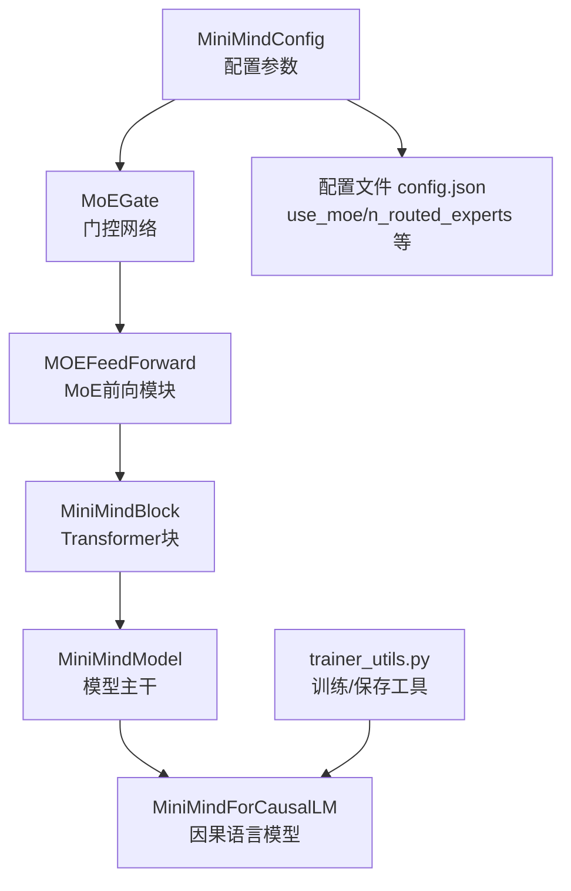
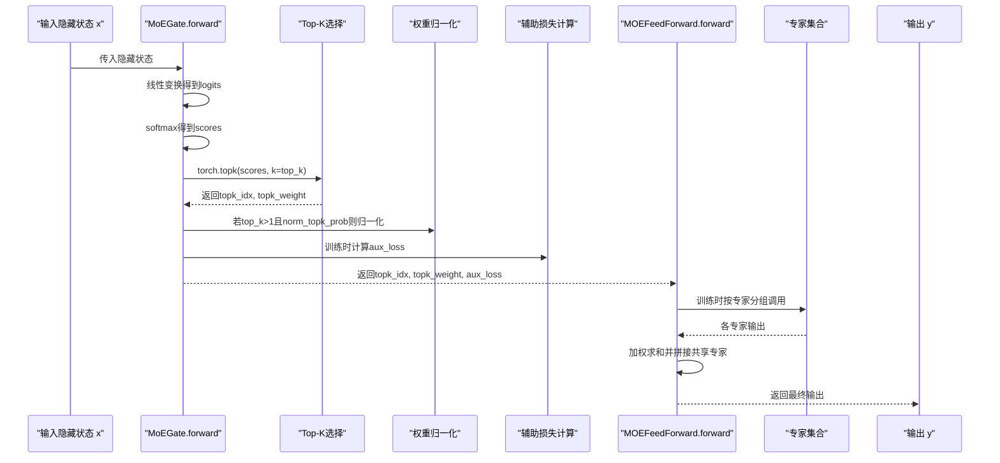
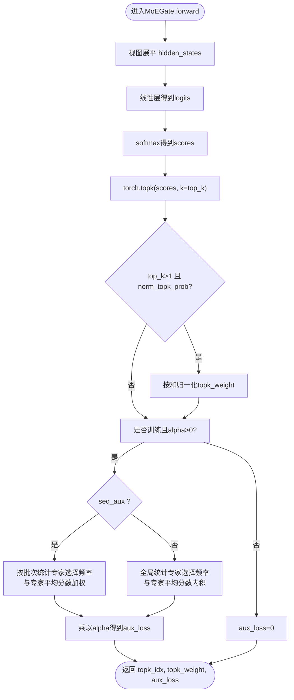
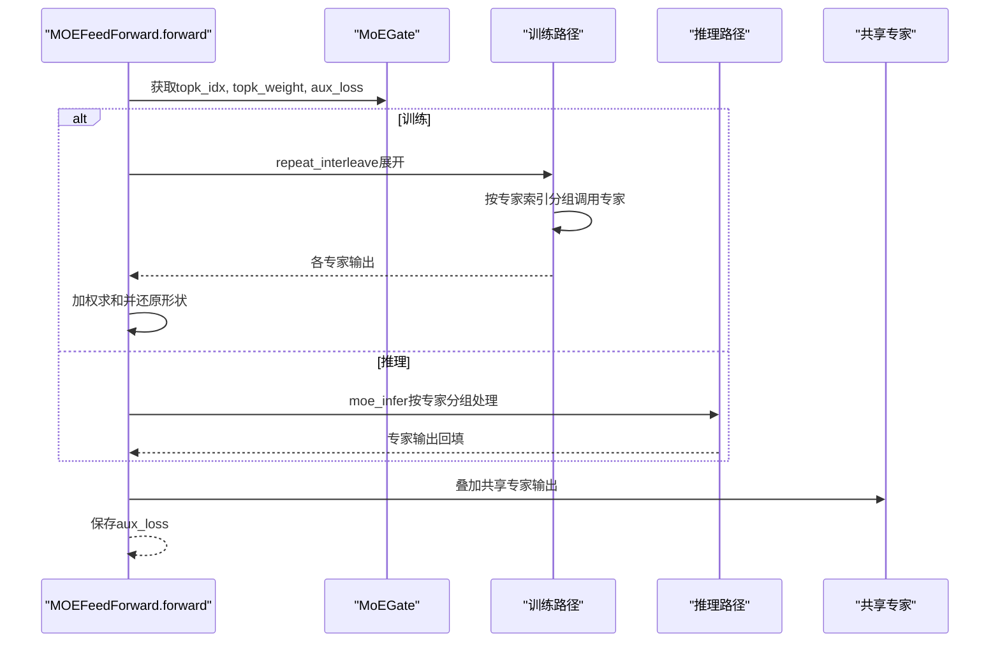
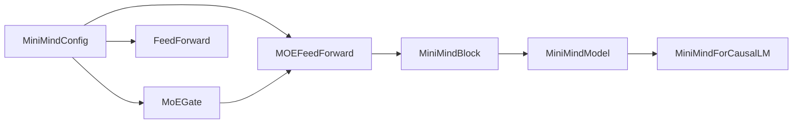
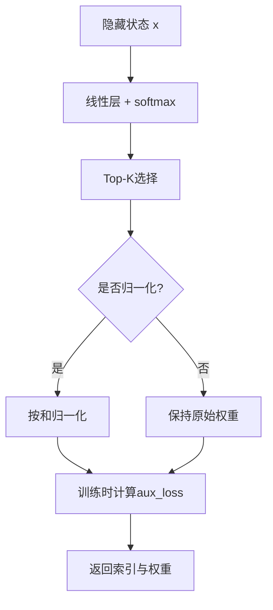

# 门控网络

<cite>
**本文引用的文件**
- [model_minimind.py](file://model/model_minimind.py)
- [03_Phase3_模型架构详解.md](file://docs/03_Phase3_模型架构详解.md)
- [config.json](file://DST-train/model/baseline_hf/config.json)
- [trainer_utils.py](file://trainer/trainer_utils.py)
</cite>

## 目录
1. [简介](#简介)
2. [项目结构](#项目结构)
3. [核心组件](#核心组件)
4. [架构总览](#架构总览)
5. [详细组件分析](#详细组件分析)
6. [依赖关系分析](#依赖关系分析)
7. [性能考量](#性能考量)
8. [故障排查指南](#故障排查指南)
9. [结论](#结论)
10. [附录](#附录)

## 简介
本文件聚焦MiniMind项目中的MoE门控网络，系统性解析MoEGate类的实现原理与工作机制，涵盖：
- 门控权重初始化策略
- 评分函数选择（当前支持softmax）
- Top-K专家选择机制
- 门控网络如何根据隐藏状态计算专家得分
- Top-K选择过程中的权重归一化
- 辅助损失（负载均衡）的计算方式与目的
- 前向传播过程在训练与推理模式下的差异
- 数学公式推导与流程图
- 参数配置说明与性能优化建议
- 路由崩塌问题的成因与解决方案

## 项目结构
MoE门控网络位于模型实现文件中，配合MoE前向模块与配置共同工作。下图展示了与MoE门控相关的核心文件与职责映射。

图表来源
- [model_minimind.py:8-78](file://model/model_minimind.py#L8-L78)
- [model_minimind.py:245-299](file://model/model_minimind.py#L245-L299)
- [model_minimind.py:301-360](file://model/model_minimind.py#L301-L360)
- [model_minimind.py:363-440](file://model/model_minimind.py#L363-L440)
- [config.json:1-37](file://DST-train/model/baseline_hf/config.json#L1-L37)
- [trainer_utils.py:100-111](file://trainer/trainer_utils.py#L100-L111)

章节来源
- [model_minimind.py:8-78](file://model/model_minimind.py#L8-L78)
- [model_minimind.py:245-299](file://model/model_minimind.py#L245-L299)
- [model_minimind.py:301-360](file://model/model_minimind.py#L301-L360)
- [model_minimind.py:363-440](file://model/model_minimind.py#L363-L440)
- [config.json:1-37](file://DST-train/model/baseline_hf/config.json#L1-L37)
- [trainer_utils.py:100-111](file://trainer/trainer_utils.py#L100-L111)

## 核心组件
- MoEGate：负责根据当前token的隐藏状态计算每个专家的得分，执行Top-K选择，并在训练时计算辅助损失。
- MOEFeedForward：封装专家集合与门控，实现训练/推理两种前向路径，并聚合共享专家输出。
- MiniMindConfig：集中管理MoE相关超参数（如每token专家数、专家总数、评分函数、辅助损失系数、是否序列级辅助等）。

章节来源
- [model_minimind.py:245-299](file://model/model_minimind.py#L245-L299)
- [model_minimind.py:301-360](file://model/model_minimind.py#L301-L360)
- [model_minimind.py:8-78](file://model/model_minimind.py#L8-L78)

## 架构总览
MoE门控网络嵌入在Transformer块的前馈子层中，与注意力子层并列。门控网络在每个token上独立计算专家得分，选择Top-K专家并进行加权求和；同时在训练阶段引入辅助损失以促进专家间的负载均衡。

图表来源
- [model_minimind.py:264-298](file://model/model_minimind.py#L264-L298)
- [model_minimind.py:316-337](file://model/model_minimind.py#L316-L337)

## 详细组件分析

### MoEGate类实现与数学原理
- 权重初始化：采用Kaiming均匀初始化，保证门控权重的数值稳定性与梯度流动。
- 评分函数：当前实现仅支持softmax，将隐藏状态线性映射到专家维度，得到每个专家的得分分布。
- Top-K选择：对每个token的专家得分取Top-K，得到索引与原始权重。
- 权重归一化：当top_k>1且开启归一化时，将Top-K权重按其和进行归一化，避免权重过大导致数值不稳定。
- 辅助损失（负载均衡）：在训练时计算，防止“路由崩塌”（所有token都路由到少数专家）。支持两种模式：
  - 序列级（seq_aux=true）：按批次统计专家被选择的频率，结合每个专家在序列上的平均分数，计算加权损失。
  - 样本级（seq_aux=false）：对所有样本的专家选择频率做全局平均，与专家平均分数做内积，再乘以系数alpha。

图表来源
- [model_minimind.py:264-298](file://model/model_minimind.py#L264-L298)

章节来源
- [model_minimind.py:245-299](file://model/model_minimind.py#L245-L299)

### MOEFeedForward前向传播（训练 vs 推理）
- 训练模式：将输入按Top-K专家分组，分别调用对应专家，再按Top-K权重加权求和；随后叠加共享专家输出。
- 推理模式：使用moe_infer进行批处理优化，先对专家索引排序，按专家分组收集token，逐专家计算输出并乘以权重，最后通过scatter_add回填到原位置，避免重复展开。

图表来源
- [model_minimind.py:316-360](file://model/model_minimind.py#L316-L360)

章节来源
- [model_minimind.py:301-360](file://model/model_minimind.py#L301-L360)

### 辅助损失（负载均衡）的数学推导
- 目的：防止路由崩塌，促使每个token均匀地路由到不同专家，提升专家利用率与模型鲁棒性。
- 训练时，aux_loss由两部分构成：
  - 专家选择频率（ce）：统计Top-K专家的选择频次（可按序列或全局平均）。
  - 专家平均分数（Pi）：专家在所有样本上的平均得分。
- 损失形式：aux_loss = α · Σ(ce_i · Pi_i)，其中α为超参数，控制辅助损失在总损失中的比重。

章节来源
- [model_minimind.py:279-298](file://model/model_minimind.py#L279-L298)
- [03_Phase3_模型架构详解.md:272-279](file://docs/03_Phase3_模型架构详解.md#L272-L279)

### 参数配置说明
- use_moe：是否启用MoE。
- num_experts_per_tok：每个token选择的专家数量（Top-K）。
- n_routed_experts：MoE专家总数。
- scoring_func：评分函数，当前实现为softmax。
- aux_loss_alpha：辅助损失系数α。
- seq_aux：是否按序列级计算辅助损失。
- norm_topk_prob：是否对Top-K权重进行归一化。
- n_shared_experts：始终参与计算的共享专家数量。

章节来源
- [model_minimind.py:8-78](file://model/model_minimind.py#L8-L78)
- [config.json:1-37](file://DST-train/model/baseline_hf/config.json#L1-L37)

## 依赖关系分析
- MoEGate依赖MiniMindConfig提供的超参数（如top_k、n_routed_experts、scoring_func、aux_loss_alpha、seq_aux、norm_topk_prob）。
- MOEFeedForward依赖MoEGate的输出（topk_idx、topk_weight、aux_loss），并在训练/推理两种路径中复用。
- MiniMindModel在各层中根据use_moe动态选择FeedForward或MOEFeedForward。
- MiniMindForCausalLM汇总各层的aux_loss，便于训练日志与优化。

图表来源
- [model_minimind.py:8-78](file://model/model_minimind.py#L8-L78)
- [model_minimind.py:245-299](file://model/model_minimind.py#L245-L299)
- [model_minimind.py:301-360](file://model/model_minimind.py#L301-L360)
- [model_minimind.py:363-440](file://model/model_minimind.py#L363-L440)

章节来源
- [model_minimind.py:8-78](file://model/model_minimind.py#L8-L78)
- [model_minimind.py:363-440](file://model/model_minimind.py#L363-L440)

## 性能考量
- 计算开销
  - 门控线性层：O(B·S·H·E)，其中B为batch size，S为序列长度，H为隐藏维，E为专家数。
  - Top-K选择：O(B·S·E·log K)，K为Top-K。
  - 训练路径专家展开：按K倍展开，显存与计算开销上升。
  - 推理路径优化：moe_infer通过分组与scatter_add减少重复计算与内存碎片。
- 内存优化
  - 训练时使用半精度（参考配置dtype为float16）可显著降低显存占用。
  - 归一化时加入极小常数（如1e-20）避免除零。
- 并行与分布式
  - 专家并行：可将专家分布到不同设备，结合分布式策略提升吞吐。
  - 梯度同步：共享专家与门控参数需合理同步，避免通信瓶颈。

[本节为通用性能建议，不直接分析具体文件]

## 故障排查指南
- 路由崩塌（所有token路由到少数专家）
  - 现象：某些专家被过度使用，其余专家闲置，aux_loss异常增大。
  - 解决方案：
    - 提高aux_loss_alpha，增强负载均衡约束。
    - 减小num_experts_per_tok，扩大专家选择范围。
    - 确认seq_aux设置为True，以便按序列级统计专家使用情况。
    - 检查scoring_func是否为softmax，避免其他评分函数未实现导致异常。
- 数值不稳定
  - 现象：softmax后出现NaN或Inf。
  - 解决方案：
    - 确保门控权重初始化合理（Kaiming均匀）。
    - 对Top-K权重进行归一化（norm_topk_prob）。
    - 在归一化时加入稳定项（如1e-20）。
- 显存不足
  - 现象：训练时OOM。
  - 解决方案：
    - 降低num_experts_per_tok或n_routed_experts。
    - 使用推理路径优化（moe_infer）。
    - 使用混合精度（配置dtype为float16）。
- 训练不收敛
  - 现象：aux_loss持续偏高或loss震荡。
  - 解决方案：
    - 逐步增大aux_loss_alpha，观察专家使用均衡性。
    - 检查共享专家数量与权重共享设置，避免冗余计算。
    - 确认训练脚本正确汇总并反向传播aux_loss。

章节来源
- [model_minimind.py:275-277](file://model/model_minimind.py#L275-L277)
- [model_minimind.py:279-298](file://model/model_minimind.py#L279-L298)
- [trainer_utils.py:100-111](file://trainer/trainer_utils.py#L100-L111)

## 结论
MoEGate通过简洁高效的softmax评分与Top-K选择机制，实现了轻量且可扩展的专家路由；配合权重归一化与辅助损失，有效缓解路由崩塌问题。训练与推理两条路径在性能与资源占用上各有侧重，结合配置参数可灵活适配不同规模与场景需求。建议在实践中优先保证专家使用均衡（通过aux_loss与seq_aux），并根据硬件条件调整Top-K与专家数量，以获得最佳的训练稳定性与推理效率。

[本节为总结性内容，不直接分析具体文件]

## 附录

### 关键流程图（概念性）

[本图为概念性示意，不直接映射具体源码文件]