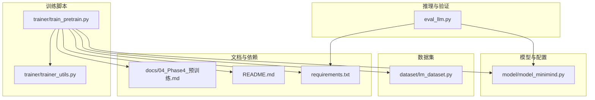
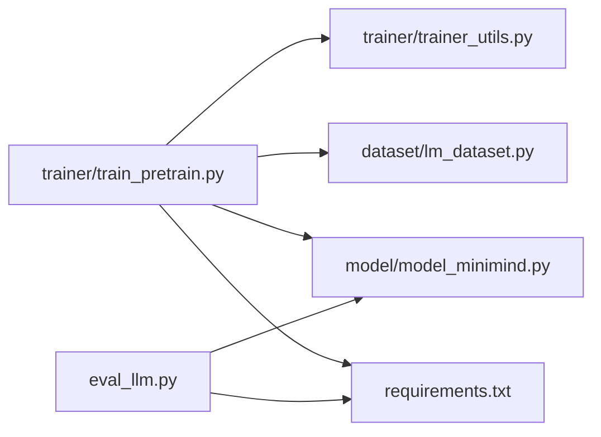

# Phase 4: 预训练

<cite>
**本文引用的文件列表**
- [docs/04_Phase4_预训练.md](file://docs/04_Phase4_预训练.md)
- [trainer/train_pretrain.py](file://trainer/train_pretrain.py)
- [trainer/trainer_utils.py](file://trainer/trainer_utils.py)
- [model/model_minimind.py](file://model/model_minimind.py)
- [dataset/lm_dataset.py](file://dataset/lm_dataset.py)
- [README.md](file://README.md)
- [requirements.txt](file://requirements.txt)
- [eval_llm.py](file://eval_llm.py)
</cite>

## 目录
1. [简介](#简介)
2. [项目结构](#项目结构)
3. [核心组件](#核心组件)
4. [架构总览](#架构总览)
5. [详细组件分析](#详细组件分析)
6. [依赖关系分析](#依赖关系分析)
7. [性能考量](#性能考量)
8. [故障排查指南](#故障排查指南)
9. [结论](#结论)
10. [附录](#附录)

## 简介
本章节聚焦MiniMind项目Phase 4的无监督预训练，系统阐述自回归语言建模目标与损失函数设计、训练流程配置、学习率调度策略、混合精度训练技术、分布式训练支持、数据加载与批次处理、内存优化与断点续训、训练监控与调试方法，以及硬件要求与资源优化建议。目标是帮助读者完整复现预训练流程并进行高效训练管理。

## 项目结构
- 训练入口与工具
  - 训练脚本：trainer/train_pretrain.py
  - 工具函数：trainer/trainer_utils.py
- 模型与配置
  - 模型实现：model/model_minimind.py
- 数据集
  - 预训练数据集：dataset/lm_dataset.py（提供PretrainDataset）
- 文档与说明
  - Phase 4文档：docs/04_Phase4_预训练.md
  - 项目总览与训练开销：README.md
  - 依赖清单：requirements.txt
- 推理与验证
  - 推理脚本：eval_llm.py



图表来源
- [trainer/train_pretrain.py:1-162](file://trainer/train_pretrain.py#L1-L162)
- [trainer/trainer_utils.py:1-139](file://trainer/trainer_utils.py#L1-L139)
- [model/model_minimind.py:1-475](file://model/model_minimind.py#L1-L475)
- [dataset/lm_dataset.py:1-250](file://dataset/lm_dataset.py#L1-L250)
- [docs/04_Phase4_预训练.md:1-352](file://docs/04_Phase4_预训练.md#L1-L352)
- [README.md:1-800](file://README.md#L1-L800)
- [requirements.txt:1-31](file://requirements.txt#L1-L31)
- [eval_llm.py:1-89](file://eval_llm.py#L1-L89)

章节来源
- [docs/04_Phase4_预训练.md:1-352](file://docs/04_Phase4_预训练.md#L1-L352)
- [trainer/train_pretrain.py:1-162](file://trainer/train_pretrain.py#L1-L162)
- [trainer/trainer_utils.py:1-139](file://trainer/trainer_utils.py#L1-L139)
- [model/model_minimind.py:1-475](file://model/model_minimind.py#L1-L475)
- [dataset/lm_dataset.py:1-250](file://dataset/lm_dataset.py#L1-L250)
- [README.md:1-800](file://README.md#L1-L800)
- [requirements.txt:1-31](file://requirements.txt#L1-L31)
- [eval_llm.py:1-89](file://eval_llm.py#L1-L89)

## 核心组件
- 训练脚本入口与主循环
  - 解析参数、初始化分布式环境、设置随机种子、构建模型与分词器、加载数据集、配置优化器、DDP封装、训练循环与断点续训。
- 训练工具函数
  - 学习率调度、分布式初始化、随机种子设置、模型与检查点保存/加载、跳过已训练batch的采样器。
- 模型与配置
  - MiniMindConfig、MiniMindForCausalLM、注意力与前馈网络、MoE专家门控与辅助损失、RMSNorm与RoPE位置编码。
- 数据集
  - PretrainDataset：将文本切分为输入X、目标Y与loss_mask，实现自回归语言建模的监督信号。
- 推理与验证
  - eval_llm.py：加载预训练权重，进行生成与对话测试。

章节来源
- [trainer/train_pretrain.py:81-162](file://trainer/train_pretrain.py#L81-L162)
- [trainer/trainer_utils.py:15-139](file://trainer/trainer_utils.py#L15-L139)
- [model/model_minimind.py:8-475](file://model/model_minimind.py#L8-L475)
- [dataset/lm_dataset.py:16-52](file://dataset/lm_dataset.py#L16-L52)
- [eval_llm.py:12-89](file://eval_llm.py#L12-L89)

## 架构总览
预训练训练管线从数据加载开始，经模型前向得到logits，计算自回归交叉熵损失并应用loss_mask，结合MoE辅助损失与梯度累积，使用混合精度与梯度裁剪进行反向传播，按间隔保存检查点并在DDP环境下同步参数。

```mermaid
sequenceDiagram
participant CLI as "命令行"
participant TP as "train_pretrain.py"
participant TU as "trainer_utils.py"
participant DS as "PretrainDataset"
participant MM as "MiniMindForCausalLM"
participant OPT as "AdamW优化器"
participant CKP as "lm_checkpoint"
CLI->>TP : 启动训练(参数)
TP->>TU : init_distributed_mode()/setup_seed()
TP->>MM : init_model(config, from_weight)
TP->>DS : PretrainDataset(data_path, tokenizer, max_length)
TP->>OPT : AdamW(model.parameters(), lr)
TP->>TP : 训练循环(train_epoch)
loop 每个step
TP->>DS : __getitem__ -> (X, Y, loss_mask)
TP->>TP : get_lr(step)
TP->>OPT : set_lr
TP->>MM : 前向(autocast)
TP->>TP : 计算CrossEntropy + loss_mask + aux_loss
TP->>TP : loss /= accumulation_steps
TP->>OPT : backward(scaler.scale(loss))
alt 达到累积步数
TP->>OPT : clip_grad_norm_
TP->>OPT : scaler.step()/update()
TP->>OPT : zero_grad(set_to_none)
TP->>TP : cuda.empty_cache()
end
TP->>TP : Logger/可视化
TP->>CKP : 定期保存检查点
end
```

图表来源
- [trainer/train_pretrain.py:23-79](file://trainer/train_pretrain.py#L23-L79)
- [trainer/trainer_utils.py:24-26](file://trainer/trainer_utils.py#L24-L26)
- [dataset/lm_dataset.py:34-51](file://dataset/lm_dataset.py#L34-L51)
- [model/model_minimind.py:441-475](file://model/model_minimind.py#L441-L475)

章节来源
- [trainer/train_pretrain.py:23-79](file://trainer/train_pretrain.py#L23-L79)
- [trainer/trainer_utils.py:24-26](file://trainer/trainer_utils.py#L24-L26)
- [dataset/lm_dataset.py:34-51](file://dataset/lm_dataset.py#L34-L51)
- [model/model_minimind.py:441-475](file://model/model_minimind.py#L441-L475)

## 详细组件分析

### 无监督预训练与自回归语言建模
- 目标与原理
  - 预训练通过大量无标注文本学习语言统计规律与知识，核心是“词语接龙”：给定前文，预测下一个词。
- 自回归建模
  - 输入序列X取input_ids[:-1]，目标Y取input_ids[1:]，形成滑窗监督信号。
  - 损失掩码loss_mask屏蔽pad区域，仅对有效token计算损失。
- 损失函数设计
  - 交叉熵损失：对logits与Y展平后计算，还原为Y形状后按loss_mask求和并归一化。
  - MoE辅助损失：当use_moe为真时，累加各层aux_loss并加到主损失上，提升专家路由的稀疏性与稳定性。
  - 梯度累积归一化：loss除以accumulation_steps，模拟更大batch_size。

章节来源
- [docs/04_Phase4_预训练.md:96-147](file://docs/04_Phase4_预训练.md#L96-L147)
- [dataset/lm_dataset.py:34-51](file://dataset/lm_dataset.py#L34-L51)
- [model/model_minimind.py:432-438](file://model/model_minimind.py#L432-L438)
- [trainer/train_pretrain.py:23-79](file://trainer/train_pretrain.py#L23-L79)

### 训练流程配置与参数
- 关键参数
  - epochs、batch_size、learning_rate、accumulation_steps、max_seq_len、hidden_size、num_hidden_layers、use_moe、dtype、data_path、from_weight、from_resume、use_wandb、wandb_project等。
- 默认行为
  - 单卡/多卡均可，DDP下自动设置device为local_rank。
  - 混合精度：bfloat16无需GradScaler，float16启用GradScaler。
  - 分布式采样器：每个epoch设置不同随机种子，保证数据分布随机性。
  - 断点续训：自动检测并加载检查点，支持跨GPU数量恢复。

章节来源
- [docs/04_Phase4_预训练.md:32-93](file://docs/04_Phase4_预训练.md#L32-L93)
- [trainer/train_pretrain.py:82-104](file://trainer/train_pretrain.py#L82-L104)
- [trainer/train_pretrain.py:106-162](file://trainer/train_pretrain.py#L106-L162)
- [trainer/trainer_utils.py:47-97](file://trainer/trainer_utils.py#L47-L97)

### 学习率调度策略
- 余弦退火调度
  - warmup阶段线性增长，随后余弦退火至最低学习率（当前实现最低为初始学习率的1/10）。
  - 每步更新学习率并写入优化器参数组。

章节来源
- [docs/04_Phase4_预训练.md:149-178](file://docs/04_Phase4_预训练.md#L149-L178)
- [trainer/trainer_utils.py:24-26](file://trainer/trainer_utils.py#L24-L26)
- [trainer/train_pretrain.py:30-32](file://trainer/train_pretrain.py#L30-L32)

### 混合精度训练技术
- autocast上下文
  - 根据dtype选择bfloat16或float16，CPU路径使用nullcontext。
- GradScaler
  - float16场景启用GradScaler，避免梯度下溢；bfloat16路径无需GradScaler。
- 半精度保存
  - 检查点与模型保存时将权重转为半精度，节省存储空间。

章节来源
- [docs/04_Phase4_预训练.md:180-199](file://docs/04_Phase4_预训练.md#L180-L199)
- [trainer/train_pretrain.py:116-135](file://trainer/train_pretrain.py#L116-L135)
- [trainer/trainer_utils.py:53-87](file://trainer/trainer_utils.py#L53-L87)

### 分布式训练（DDP）
- 初始化
  - 通过环境变量判断是否为DDP模式，初始化NCCL后设置本地设备。
- 模型封装
  - DDP包裹模型，忽略RoPE频率缓存参数同步，避免不必要的通信。
- 分布式采样
  - 每个epoch设置不同随机种子，DataLoader使用DistributedSampler。

章节来源
- [docs/04_Phase4_预训练.md:221-254](file://docs/04_Phase4_预训练.md#L221-L254)
- [trainer/trainer_utils.py:28-35](file://trainer/trainer_utils.py#L28-L35)
- [trainer/train_pretrain.py:146-149](file://trainer/train_pretrain.py#L146-L149)

### 数据加载机制与批次处理
- PretrainDataset
  - 读取JSONL文本，使用分词器编码，返回X、Y与loss_mask。
- DataLoader
  - 单卡shuffle，多卡使用DistributedSampler；支持pin_memory与num_workers。
- 跳过已训练batch
  - SkipBatchSampler在断点续训时跳过已处理的step，确保从正确位置继续。

章节来源
- [dataset/lm_dataset.py:16-52](file://dataset/lm_dataset.py#L16-L52)
- [trainer/train_pretrain.py:132-135](file://trainer/train_pretrain.py#L132-L135)
- [trainer/trainer_utils.py:114-139](file://trainer/trainer_utils.py#L114-L139)

### 内存优化技巧
- 梯度累积
  - 通过loss/accumulation_steps模拟更大batch，减少显存峰值。
- 梯度裁剪
  - 防止梯度爆炸，稳定训练。
- CUDA缓存清理
  - 每次优化器step后调用empty_cache，释放临时张量占用。
- 半精度保存
  - 检查点与模型权重保存为半精度，降低IO与存储压力。

章节来源
- [docs/04_Phase4_预训练.md:200-219](file://docs/04_Phase4_预训练.md#L200-L219)
- [trainer/train_pretrain.py:47-55](file://trainer/train_pretrain.py#L47-L55)
- [trainer/trainer_utils.py:53-87](file://trainer/trainer_utils.py#L53-L87)

### 断点续训功能
- 检查点保存
  - 同步保存模型权重、优化器状态、GradScaler状态、epoch与step、wandb run id等。
- 检查点加载
  - 自动检测并加载最近的resume.pth；跨GPU数量时自动转换step。
- 跳过已训练batch
  - 使用SkipBatchSampler跳过已处理的batch，保证训练连续性。

章节来源
- [docs/04_Phase4_预训练.md:256-293](file://docs/04_Phase4_预训练.md#L256-L293)
- [trainer/trainer_utils.py:47-97](file://trainer/trainer_utils.py#L47-L97)
- [trainer/train_pretrain.py:137-161](file://trainer/train_pretrain.py#L137-L161)

### 训练监控与调试
- 日志与可视化
  - 定期打印loss、学习率、剩余时间；支持SwanLab/W&B记录训练指标。
- 训练曲线分析
  - 正常应呈现warmup快速下降、中期平稳、后期收敛；震荡剧烈、不下降、爆炸分别对应学习率、数据/配置、梯度裁剪问题。

章节来源
- [docs/04_Phase4_预训练.md:294-320](file://docs/04_Phase4_预训练.md#L294-L320)
- [trainer/train_pretrain.py:57-78](file://trainer/train_pretrain.py#L57-L78)

### 模型与MoE架构
- 结构组成
  - MiniMindModel：嵌入层、若干MiniMindBlock、RMSNorm与RoPE频率缓存。
  - MiniMindBlock：RMSNorm、Attention、MLP（普通或MoE）。
  - MiniMindForCausalLM：共享词嵌入与输出头，继承GenerationMixin。
- MoE门控与辅助损失
  - MoEGate：softmax评分选择top-k专家，计算aux_loss；训练时加权聚合，推理时按token分组高效聚合。
- RoPE与注意力
  - 支持flash attention与扩展的YaRN缩放策略，提升长序列外推能力。

章节来源
- [model/model_minimind.py:8-78](file://model/model_minimind.py#L8-L78)
- [model/model_minimind.py:361-383](file://model/model_minimind.py#L361-L383)
- [model/model_minimind.py:441-475](file://model/model_minimind.py#L441-L475)

## 依赖关系分析
- 训练脚本依赖
  - 训练脚本依赖工具函数（学习率、分布式、随机种子、模型初始化、检查点）、数据集（PretrainDataset）、模型（MiniMindForCausalLM）。
- 模块耦合
  - 训练脚本与工具函数松耦合，通过函数接口交互；数据集与模型通过张量接口连接。
- 外部依赖
  - PyTorch、transformers、SwanLab/W&B、einops等。



图表来源
- [trainer/train_pretrain.py:16-18](file://trainer/train_pretrain.py#L16-L18)
- [trainer/trainer_utils.py:11-12](file://trainer/trainer_utils.py#L11-L12)
- [dataset/lm_dataset.py:7-11](file://dataset/lm_dataset.py#L7-L11)
- [model/model_minimind.py:5-91](file://model/model_minimind.py#L5-L91)
- [requirements.txt:1-31](file://requirements.txt#L1-L31)
- [eval_llm.py:6-9](file://eval_llm.py#L6-L9)

章节来源
- [trainer/train_pretrain.py:16-18](file://trainer/train_pretrain.py#L16-L18)
- [trainer/trainer_utils.py:11-12](file://trainer/trainer_utils.py#L11-L12)
- [dataset/lm_dataset.py:7-11](file://dataset/lm_dataset.py#L7-L11)
- [model/model_minimind.py:5-91](file://model/model_minimind.py#L5-L91)
- [requirements.txt:1-31](file://requirements.txt#L1-L31)
- [eval_llm.py:6-9](file://eval_llm.py#L6-L9)

## 性能考量
- 训练开销参考
  - 基于单卡3090的预训练时间与成本，不同模型规模与数据集组合下的估算。
- 硬件要求
  - 至少一张支持CUDA的GPU；推荐使用现代GPU以获得更好混合精度与Flash Attention性能。
- 资源优化建议
  - 合理设置batch_size与accumulation_steps以平衡显存与吞吐。
  - 使用bfloat16在支持的硬件上可获得更稳定的数值表现。
  - 启用pin_memory与合适的num_workers提升数据加载效率。
  - 在长序列场景下启用RoPE YaRN缩放以提升外推能力。

章节来源
- [README.md:674-718](file://README.md#L674-L718)
- [docs/04_Phase4_预训练.md:25-31](file://docs/04_Phase4_预训练.md#L25-L31)
- [model/model_minimind.py:57-64](file://model/model_minimind.py#L57-L64)

## 故障排查指南
- 训练不收敛或震荡
  - 检查学习率是否过高；确认数据质量与loss_mask是否正确应用。
- 梯度爆炸
  - 提高grad_clip阈值或减小学习率；检查数据分布与标签。
- 显存不足
  - 减小batch_size或增大accumulation_steps；关闭不必要的可视化；使用bfloat16。
- 分布式训练异常
  - 确认NCCL环境变量与后端；检查world_size与local_rank；确保模型参数同步策略正确。
- 断点续训失败
  - 检查resume.pth是否存在；跨GPU数量时确认step转换逻辑；确保wandb run id一致。

章节来源
- [docs/04_Phase4_预训练.md:310-319](file://docs/04_Phase4_预训练.md#L310-L319)
- [trainer/train_pretrain.py:146-149](file://trainer/train_pretrain.py#L146-L149)
- [trainer/trainer_utils.py:88-97](file://trainer/trainer_utils.py#L88-L97)

## 结论
本章节系统梳理了MiniMind Phase 4预训练的完整流程与关键技术点：自回归语言建模目标与损失设计、训练配置与学习率调度、混合精度与分布式训练、数据加载与批次处理、内存优化与断点续训、训练监控与调试方法。结合模型架构与数据集实现，读者可据此高效复现预训练并进行训练管理。

## 附录
- 快速启动
  - 单卡训练：python trainer/train_pretrain.py
  - 多卡DDP：torchrun --nproc_per_node N trainer/train_pretrain.py
  - 断点续训：python trainer/train_pretrain.py --from_resume 1
- 推理验证
  - python eval_llm.py --weight pretrain

章节来源
- [docs/04_Phase4_预训练.md:32-45](file://docs/04_Phase4_预训练.md#L32-L45)
- [eval_llm.py:32-89](file://eval_llm.py#L32-L89)