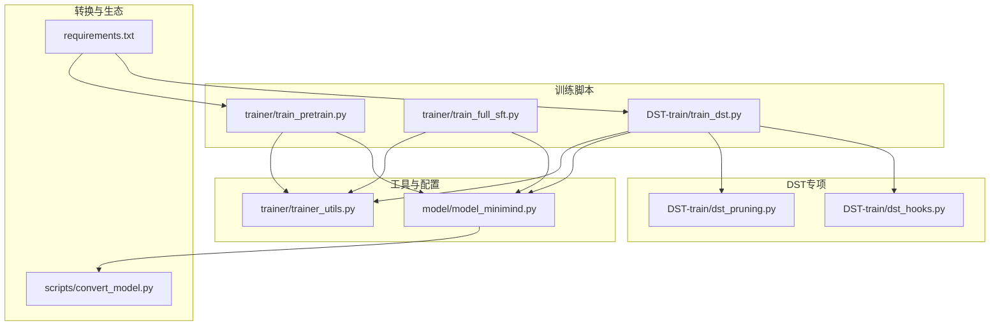
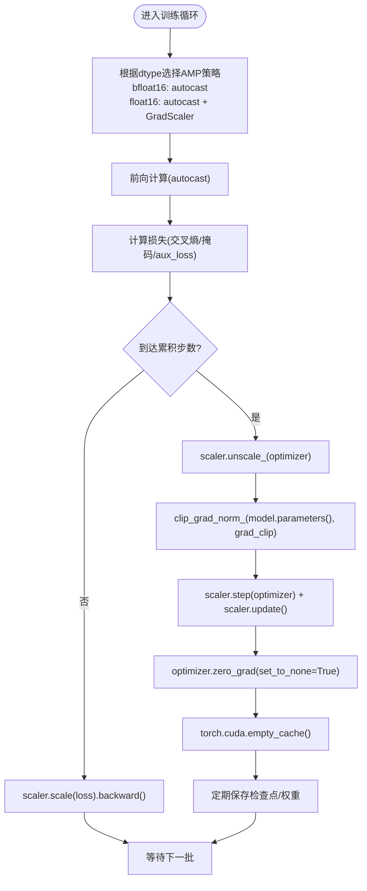
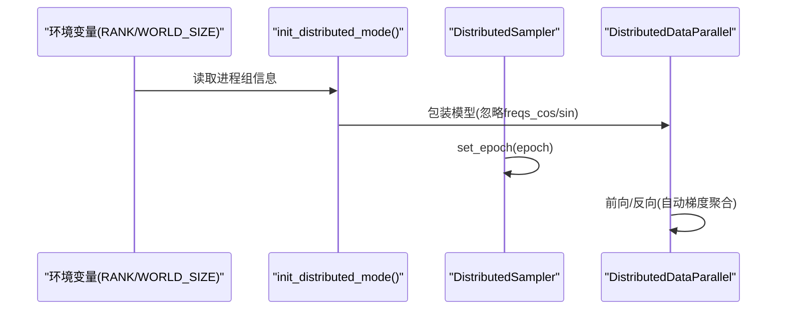
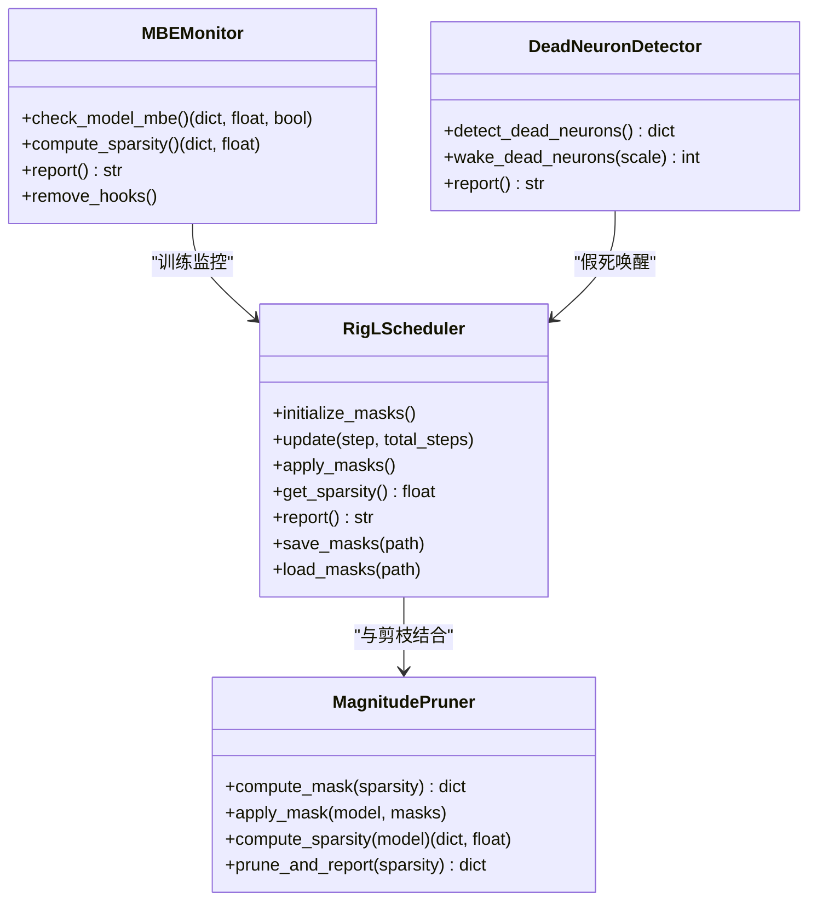
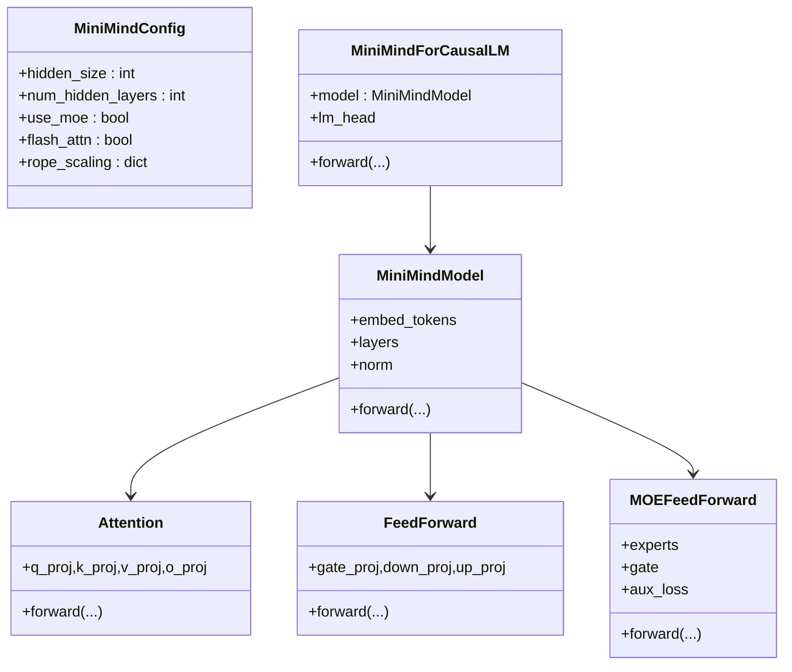
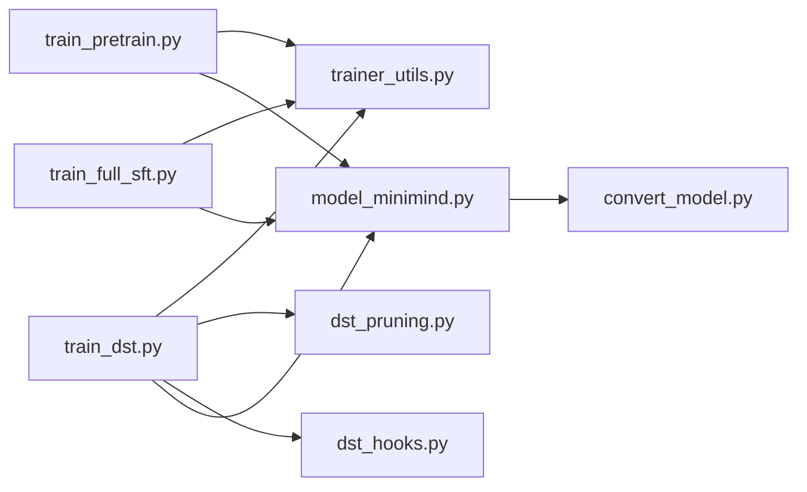

# 优化技术与策略

<cite>
**本文引用的文件**
- [trainer/train_pretrain.py](file://trainer/train_pretrain.py)
- [trainer/trainer_utils.py](file://trainer/trainer_utils.py)
- [DST-train/train_dst.py](file://DST-train/train_dst.py)
- [DST-train/dst_hooks.py](file://DST-train/dst_hooks.py)
- [DST-train/dst_pruning.py](file://DST-train/dst_pruning.py)
- [model/model_minimind.py](file://model/model_minimind.py)
- [trainer/train_full_sft.py](file://trainer/train_full_sft.py)
- [scripts/convert_model.py](file://scripts/convert_model.py)
- [requirements.txt](file://requirements.txt)
- [docs/04_Phase4_预训练.md](file://docs/04_Phase4_预训练.md)
- [README.md](file://README.md)
</cite>

## 目录
1. [简介](#简介)
2. [项目结构](#项目结构)
3. [核心组件](#核心组件)
4. [架构总览](#架构总览)
5. [详细组件分析](#详细组件分析)
6. [依赖关系分析](#依赖关系分析)
7. [性能考量](#性能考量)
8. [故障排查指南](#故障排查指南)
9. [结论](#结论)
10. [附录](#附录)

## 简介
本文件系统化梳理 MiniMind 项目的预训练优化技术与策略，覆盖混合精度训练（bfloat16/float16）、自动混合精度（AMP）与数值稳定性、梯度累积与裁剪、学习率调度、优化器配置、分布式训练（DDP）与参数同步、内存优化与显存利用、OOM 解决、性能监控与可视化、训练加速与并行化建议等。文档面向不同层次读者，既提供高层概览，也给出代码级图示与定位来源，便于工程落地与持续优化。

## 项目结构
- 训练脚本集中在 trainer 与 DST-train 目录，分别覆盖基础预训练、SFT 以及动态稀疏训练（DST）全流程。
- 模型定义位于 model 目录，包含 MiniMindConfig、MiniMindForCausalLM 以及注意力、FFN、MoE 等核心模块。
- 工具与辅助模块位于 trainer/trainer_utils.py，提供分布式初始化、日志、LR 调度、断点续训、模型初始化等。
- DST 专项模块包括剪枝（Magnitude Pruning）与动态稀疏（RigL）、MBE 监控与假死神经元检测。
- 转换脚本用于将内部权重格式转换为 Transformers 生态兼容格式，便于部署与评测。



图表来源
- [trainer/train_pretrain.py:1-162](file://trainer/train_pretrain.py#L1-162)
- [trainer/train_full_sft.py:1-163](file://trainer/train_full_sft.py#L1-163)
- [DST-train/train_dst.py:1-472](file://DST-train/train_dst.py#L1-472)
- [trainer/trainer_utils.py:1-139](file://trainer/trainer_utils.py#L1-139)
- [model/model_minimind.py:1-477](file://model/model_minimind.py#L1-477)
- [DST-train/dst_pruning.py:1-291](file://DST-train/dst_pruning.py#L1-291)
- [DST-train/dst_hooks.py:1-263](file://DST-train/dst_hooks.py#L1-263)
- [scripts/convert_model.py:1-76](file://scripts/convert_model.py#L1-76)
- [requirements.txt:1-31](file://requirements.txt#L1-31)

章节来源
- [trainer/train_pretrain.py:1-162](file://trainer/train_pretrain.py#L1-162)
- [trainer/train_full_sft.py:1-163](file://trainer/train_full_sft.py#L1-163)
- [DST-train/train_dst.py:1-472](file://DST-train/train_dst.py#L1-472)
- [trainer/trainer_utils.py:1-139](file://trainer/trainer_utils.py#L1-139)
- [model/model_minimind.py:1-477](file://model/model_minimind.py#L1-477)
- [DST-train/dst_pruning.py:1-291](file://DST-train/dst_pruning.py#L1-291)
- [DST-train/dst_hooks.py:1-263](file://DST-train/dst_hooks.py#L1-263)
- [scripts/convert_model.py:1-76](file://scripts/convert_model.py#L1-76)
- [requirements.txt:1-31](file://requirements.txt#L1-31)

## 核心组件
- 混合精度与自动混合精度（AMP）
  - 通过 autocast 上下文与 GradScaler 控制前向精度与反向缩放，支持 bfloat16 与 float16。
  - 在 CPU 或非 float16 场景下使用空上下文，避免不必要的开销。
- 梯度累积与梯度裁剪
  - 通过 accumulation_steps 模拟更大 batch，结合 clip_grad_norm 防止梯度爆炸。
- 学习率调度
  - 采用余弦退火调度，配合固定 warmup 与最小学习率，保证稳定收敛。
- 优化器配置
  - AdamW 优化器，权重衰减与参数组学习率动态更新。
- 分布式训练（DDP）
  - 使用 DistributedSampler 与 DistributedDataParallel，忽略 RoPE 缓存同步，减少通信。
- 内存优化与显存利用
  - 每 N 步清空 CUDA 缓存，半精度保存权重，合理设置 pin_memory 与 num_workers。
- 性能监控与可视化
  - 使用 SwanLab（兼容 WandB）记录 loss、学习率、耗时等指标。
- DST 专项优化
  - RigL 动态稀疏训练、Magnitude 剪枝、MBE 监控与假死神经元唤醒。

章节来源
- [trainer/train_pretrain.py:23-79](file://trainer/train_pretrain.py#L23-79)
- [trainer/trainer_utils.py:24-25](file://trainer/trainer_utils.py#L24-25)
- [DST-train/train_dst.py:74-139](file://DST-train/train_dst.py#L74-139)
- [DST-train/dst_pruning.py:9-118](file://DST-train/dst_pruning.py#L9-118)
- [DST-train/dst_hooks.py:10-160](file://DST-train/dst_hooks.py#L10-160)

## 架构总览
下图展示预训练与 DST 训练的关键流程与模块交互，包括 AMP、DDP、LR 调度、剪枝与监控等。

```mermaid
sequenceDiagram
participant CLI as "命令行参数"
participant Utils as "trainer_utils.py"
participant Model as "MiniMindForCausalLM"
participant AMP as "Autocast/GradScaler"
participant Opt as "AdamW优化器"
participant DDP as "DistributedDataParallel"
participant Log as "日志/可视化"
participant CKP as "断点续训"
CLI->>Utils : 初始化分布式/随机种子/混合精度
Utils->>Model : 初始化模型与分词器
CLI->>DDP : DDP包装多卡
loop 每个epoch
loop 每个batch
Utils->>Opt : 更新学习率(get_lr)
Opt->>AMP : autocast上下文
AMP->>Model : 前向计算
Model-->>AMP : logits/aux_loss
AMP->>Opt : 反向传播(scaler.scale)
Opt->>Opt : 梯度累积/裁剪
Opt->>DDP : 参数更新
Opt->>Log : 记录loss/lr/耗时
Opt->>CKP : 定期保存检查点
end
end
```

图表来源
- [trainer/train_pretrain.py:23-79](file://trainer/train_pretrain.py#L23-79)
- [trainer/trainer_utils.py:24-25](file://trainer/trainer_utils.py#L24-25)
- [model/model_minimind.py:443-477](file://model/model_minimind.py#L443-477)

章节来源
- [trainer/train_pretrain.py:81-162](file://trainer/train_pretrain.py#L81-162)
- [trainer/trainer_utils.py:15-139](file://trainer/trainer_utils.py#L15-139)
- [model/model_minimind.py:443-477](file://model/model_minimind.py#L443-477)

## 详细组件分析

### 混合精度与自动混合精度（AMP）
- 选择策略
  - bfloat16：数值稳定，无需 GradScaler，适合大多数 GPU；在 CPU 或 dtype 非 float16 时使用空上下文。
  - float16：需要 GradScaler 防止梯度下溢，提升吞吐。
- 数值稳定性保证
  - AMP 前向使用 autocast，反向使用 scaler.scale 与 scaler.unscale_，随后 clip_grad_norm，最后 scaler.step/update。
  - 模型保存时将权重转为半精度，兼顾存储与推理效率。
- 关键实现定位
  - 混合精度上下文与 GradScaler 初始化、AMP 前向与反向流程、保存权重半精度。



图表来源
- [trainer/train_pretrain.py:34-55](file://trainer/train_pretrain.py#L34-55)
- [trainer/train_full_sft.py:34-55](file://trainer/train_full_sft.py#L34-55)
- [DST-train/train_dst.py:90-116](file://DST-train/train_dst.py#L90-116)

章节来源
- [trainer/train_pretrain.py:116-135](file://trainer/train_pretrain.py#L116-135)
- [trainer/train_full_sft.py:117-136](file://trainer/train_full_sft.py#L117-136)
- [DST-train/train_dst.py:353-399](file://DST-train/train_dst.py#L353-399)

### 梯度累积与梯度裁剪
- 梯度累积
  - 将损失除以 accumulation_steps，模拟更大 batch size；在累积步数整除时执行优化器更新。
- 梯度裁剪
  - 使用 clip_grad_norm_ 控制梯度范数，避免爆炸与不稳定。
- 实践建议
  - 根据显存与吞吐权衡 batch_size 与 accumulation_steps；适当提高 grad_clip 以应对稀疏训练波动。

章节来源
- [trainer/train_pretrain.py:45-55](file://trainer/train_pretrain.py#L45-55)
- [DST-train/train_dst.py:103-116](file://DST-train/train_dst.py#L103-116)

### 学习率调度策略
- 余弦退火
  - get_lr 返回随训练步数单调递减的学习率，结合固定 warmup 与最小学习率，保证稳定收敛。
- 阶段化学习率
  - DST 阶段一与阶段三分别使用不同学习率，阶段三更低以稳定恢复。

章节来源
- [trainer/trainer_utils.py:24-25](file://trainer/trainer_utils.py#L24-25)
- [DST-train/train_dst.py:85-88](file://DST-train/train_dst.py#L85-88)
- [DST-train/train_dst.py:194-197](file://DST-train/train_dst.py#L194-197)

### 优化器配置
- AdamW
  - 权重衰减默认开启，参数组学习率动态更新；与 AMP 协同工作。
- 参数同步
  - DDP 模式下，优化器状态在多卡间自动同步（由 PyTorch 分布式框架负责）。

章节来源
- [trainer/train_pretrain.py](file://trainer/train_pretrain.py#L135)
- [DST-train/train_dst.py](file://DST-train/train_dst.py#L399)
- [DST-train/train_dst.py](file://DST-train/train_dst.py#L450)

### 分布式训练（DDP）
- 初始化与包装
  - init_distributed_mode 使用 NCCL 后端；DDP 包装模型并忽略 RoPE 频率缓存，避免无意义同步。
- 数据采样
  - 使用 DistributedSampler，每 epoch 设置不同随机种子，保证分布式一致性。
- 参数同步机制
  - DDP 在前向时自动聚合梯度，优化器 step 时参数同步；通过 _ddp_params_and_buffers_to_ignore 控制同步范围。



图表来源
- [trainer/trainer_utils.py:28-35](file://trainer/trainer_utils.py#L28-35)
- [trainer/trainer_utils.py:15-16](file://trainer/trainer_utils.py#L15-16)
- [trainer/train_pretrain.py:146-149](file://trainer/train_pretrain.py#L146-149)
- [DST-train/train_dst.py:370-373](file://DST-train/train_dst.py#L370-373)

章节来源
- [trainer/trainer_utils.py:28-35](file://trainer/trainer_utils.py#L28-35)
- [trainer/train_pretrain.py:133-149](file://trainer/train_pretrain.py#L133-149)
- [DST-train/train_dst.py:397-451](file://DST-train/train_dst.py#L397-451)

### 内存优化与显存利用率
- CUDA 缓存管理
  - 每 N 步调用 torch.cuda.empty_cache() 清理缓存，缓解碎片化与峰值占用。
- 半精度保存
  - 保存权重时将 state_dict 转为半精度，降低存储与传输成本。
- 数据加载优化
  - DataLoader 使用 pin_memory，num_workers 合理设置；Windows 建议 0 以避免 fork 问题。
- OOM 问题解决思路
  - 降低 batch_size 或增大 accumulation_steps；关闭不必要的可视化；减少 max_seq_len；清理缓存与释放中间变量。

章节来源
- [trainer/train_pretrain.py](file://trainer/train_pretrain.py#L55)
- [trainer/train_full_sft.py](file://trainer/train_full_sft.py#L75)
- [DST-train/train_dst.py](file://DST-train/train_dst.py#L116)
- [DST-train/train_dst.py](file://DST-train/train_dst.py#L243)

### 性能监控与可视化
- 可视化平台
  - 使用 SwanLab（兼容 WandB）记录 loss、学习率、耗时等指标，支持断点续训与跨 GPU 恢复。
- 日志与 ETA
  - 训练循环内计算耗时与 ETA，定期打印；在主进程输出，避免重复日志。

章节来源
- [trainer/train_pretrain.py:63-65](file://trainer/train_pretrain.py#L63-65)
- [trainer/train_full_sft.py:63-65](file://trainer/train_full_sft.py#L63-65)
- [DST-train/train_dst.py](file://DST-train/train_dst.py#L127)
- [DST-train/train_dst.py](file://DST-train/train_dst.py#L258)

### DST 专项：动态稀疏训练（RigL）、剪枝与监控
- RigL 动态稀疏训练
  - 按频率在活跃连接中剪掉权重绝对值最小的，在非活跃连接中选择梯度绝对值最大的进行“生长”，固定掩码在 T_end 后停止调整。
- Magnitude 剪枝
  - 基于权重绝对值阈值进行剪枝，支持报告与掩码保存/加载。
- MBE 监控与假死神经元检测
  - 通过 SVD 计算矩阵基熵（MBE）判断学习饱和；检测并唤醒假死神经元，提升训练活力。



图表来源
- [DST-train/dst_pruning.py:120-291](file://DST-train/dst_pruning.py#L120-291)
- [DST-train/dst_hooks.py:10-263](file://DST-train/dst_hooks.py#L10-263)

章节来源
- [DST-train/train_dst.py:74-139](file://DST-train/train_dst.py#L74-139)
- [DST-train/train_dst.py:143-168](file://DST-train/train_dst.py#L143-168)
- [DST-train/train_dst.py:174-264](file://DST-train/train_dst.py#L174-264)
- [DST-train/dst_pruning.py:9-118](file://DST-train/dst_pruning.py#L9-118)
- [DST-train/dst_hooks.py:10-160](file://DST-train/dst_hooks.py#L10-160)

### 模型与数据结构（代码级）
- 模型结构
  - MiniMindForCausalLM 由 MiniMindModel 与 LM Head 组成，支持 KV Cache 与 RoPE。
  - 注意力模块支持 Flash Attention 与常规实现，具备 RoPE 频率缓存。
  - FFN 支持普通 MLP 与 MoE，MoE 包含门控与专家路由、辅助损失。
- 数据集与掩码
  - PretrainDataset/SFTDataset 提供掩码与损失计算，支持忽略 padding。



图表来源
- [model/model_minimind.py:8-78](file://model/model_minimind.py#L8-78)
- [model/model_minimind.py:387-477](file://model/model_minimind.py#L387-477)
- [model/model_minimind.py:150-227](file://model/model_minimind.py#L150-227)
- [model/model_minimind.py:229-243](file://model/model_minimind.py#L229-243)
- [model/model_minimind.py:301-361](file://model/model_minimind.py#L301-361)

章节来源
- [model/model_minimind.py:8-78](file://model/model_minimind.py#L8-78)
- [model/model_minimind.py:387-477](file://model/model_minimind.py#L387-477)

### 训练加速与并行化策略
- 单机多卡（DDP）
  - 使用 torchrun 启动，NCCL 后端，合理设置 num_workers 与 pin_memory。
- 混合精度
  - bfloat16 优先，必要时使用 float16 + GradScaler；在 CPU 或非 float16 场景使用空上下文。
- 梯度累积
  - 在显存受限时优先增大 accumulation_steps，而非提升 batch_size。
- 数据并行
  - 使用 DistributedSampler 与 DataLoader，每 epoch set_epoch，保证全局随机性。
- 推理与部署兼容
  - 通过 convert_model.py 将内部权重转换为 Transformers/Llama 格式，便于 vLLM/llama.cpp 等生态使用。

章节来源
- [trainer/train_pretrain.py:107-109](file://trainer/train_pretrain.py#L107-109)
- [trainer/train_pretrain.py:133-135](file://trainer/train_pretrain.py#L133-135)
- [DST-train/train_dst.py:344-347](file://DST-train/train_dst.py#L344-347)
- [scripts/convert_model.py:14-28](file://scripts/convert_model.py#L14-28)

## 依赖关系分析
- 训练脚本依赖 trainer_utils 提供的公共能力（LR、分布式、日志、断点续训、模型初始化）。
- DST 训练额外依赖 dst_pruning 与 dst_hooks，形成“稀疏训练—监控—恢复”的闭环。
- 模型定义独立于训练脚本，通过 AutoModelForCausalLM 注册实现生态兼容。



图表来源
- [trainer/train_pretrain.py](file://trainer/train_pretrain.py#L18)
- [trainer/train_full_sft.py](file://trainer/train_full_sft.py#L18)
- [DST-train/train_dst.py](file://DST-train/train_dst.py#L26)
- [DST-train/dst_pruning.py:1-5](file://DST-train/dst_pruning.py#L1-5)
- [DST-train/dst_hooks.py:1-8](file://DST-train/dst_hooks.py#L1-8)
- [model/model_minimind.py:1-10](file://model/model_minimind.py#L1-10)
- [scripts/convert_model.py:8-9](file://scripts/convert_model.py#L8-9)

章节来源
- [trainer/train_pretrain.py](file://trainer/train_pretrain.py#L18)
- [trainer/train_full_sft.py](file://trainer/train_full_sft.py#L18)
- [DST-train/train_dst.py](file://DST-train/train_dst.py#L26)

## 性能考量
- 混合精度选择
  - bfloat16 更稳定，适合大多数场景；float16 需要 GradScaler，注意数值范围与梯度缩放。
- 显存与吞吐平衡
  - 优先增大 accumulation_steps，其次降低 max_seq_len 或关闭非必要模块（如 MoE）。
- 分布式效率
  - 减少同步参数（如 RoPE 缓存）；合理设置 num_workers；避免在 Windows 上使用多线程数据加载。
- 监控与调参
  - 通过 SwanLab 观察 loss 与学习率曲线，识别震荡、停滞或过拟合迹象，及时调整 LR、clip、accumulation。

## 故障排查指南
- 训练不收敛或震荡
  - 检查学习率是否过高；确认余弦退火参数；适当增大 grad_clip。
- 梯度爆炸或 NaN
  - 启用 clip_grad_norm；检查 AMP dtype 与 GradScaler；确认 loss_mask 正确。
- OOM（显存不足）
  - 降低 batch_size 或增大 accumulation_steps；关闭可视化；减少 max_seq_len；定期 empty_cache。
- 分布式不同步
  - 确认 NCCL 环境变量；检查 _ddp_params_and_buffers_to_ignore；确保 DistributedSampler 每 epoch set_epoch。
- DST 训练饱和或停滞
  - 使用 MBE 监控判断饱和；必要时调整 RigL 更新频率与剪枝比例；唤醒假死神经元。

章节来源
- [trainer/train_pretrain.py:48-55](file://trainer/train_pretrain.py#L48-55)
- [DST-train/dst_hooks.py:85-112](file://DST-train/dst_hooks.py#L85-112)
- [DST-train/dst_hooks.py:212-238](file://DST-train/dst_hooks.py#L212-238)

## 结论
MiniMind 在预训练与 DST 训练中系统性采用了混合精度、梯度累积与裁剪、余弦退火调度、DDP 分布式与内存优化等关键技术，辅以 MBE 与假死神经元监控，形成从“稀疏训练—剪枝—恢复”的完整优化闭环。通过 SwanLab 可视化与断点续训，项目在工程落地与可运维性方面具备良好实践。建议在实际部署中结合硬件条件与任务需求，灵活调整 AMP 类型、batch/accumulation、序列长度与分布式策略，以获得最佳吞吐与稳定性。

## 附录
- 相关文档与生态
  - 项目 README 与 Phase4 文档提供了训练参数、启动方式与监控建议。
  - 转换脚本支持将内部权重转换为 Transformers/Llama 格式，便于第三方生态使用。

章节来源
- [README.md:117-122](file://README.md#L117-122)
- [docs/04_Phase4_预训练.md:320-352](file://docs/04_Phase4_预训练.md#L320-352)
- [scripts/convert_model.py:14-28](file://scripts/convert_model.py#L14-28)