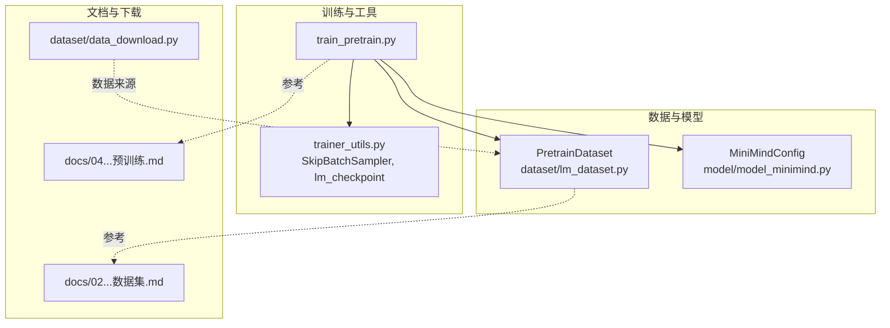
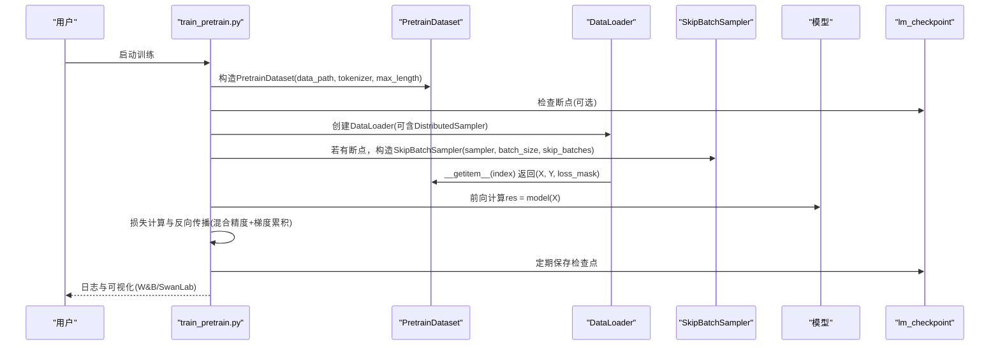
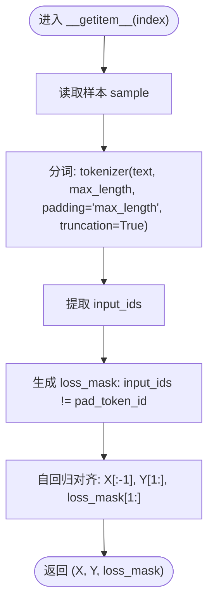
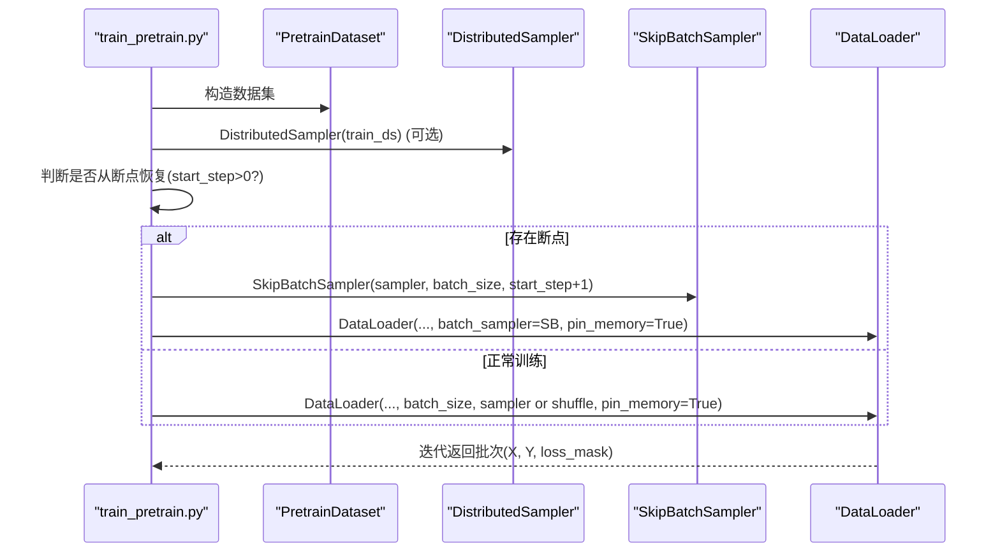
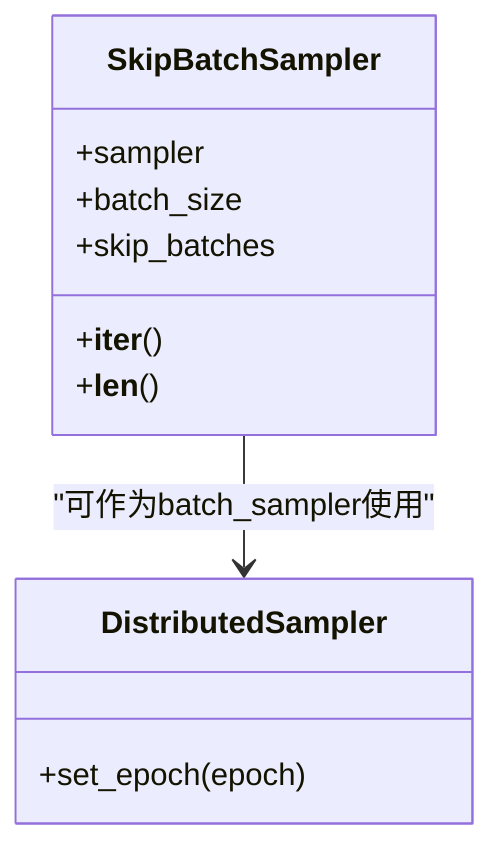
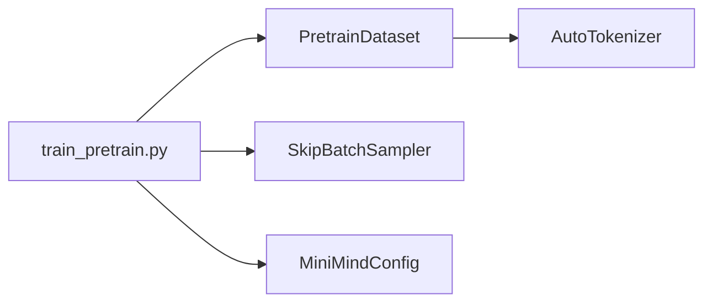

# 数据加载与处理

<cite>
**本文引用的文件**
- [dataset/lm_dataset.py](file://dataset/lm_dataset.py)
- [trainer/train_pretrain.py](file://trainer/train_pretrain.py)
- [trainer/trainer_utils.py](file://trainer/trainer_utils.py)
- [docs/02_Phase2_Tokenizer与数据集.md](file://docs/02_Phase2_Tokenizer与数据集.md)
- [docs/04_Phase4_预训练.md](file://docs/04_Phase4_预训练.md)
- [model/model_minimind.py](file://model/model_minimind.py)
- [dataset/data_download.py](file://dataset/data_download.py)
</cite>

## 目录
1. [简介](#简介)
2. [项目结构](#项目结构)
3. [核心组件](#核心组件)
4. [架构总览](#架构总览)
5. [详细组件分析](#详细组件分析)
6. [依赖关系分析](#依赖关系分析)
7. [性能考量](#性能考量)
8. [故障排查指南](#故障排查指南)
9. [结论](#结论)
10. [附录](#附录)

## 简介
本文件面向MiniMind项目的预训练数据加载与处理，系统性解析PretrainDataset类的实现原理、数据格式要求与预处理流程，覆盖数据加载机制、批次采样策略、分布式数据采样与内存管理技术，详述数据预处理步骤、序列截断策略、填充机制与掩码处理。同时提供数据管道优化、异步加载思路、缓存策略与I/O性能优化建议，给出数据质量检查方法、异常处理机制与数据完整性验证手段，并解释SkipBatchSampler的跳步机制与断点续训的数据处理逻辑。

## 项目结构
围绕预训练数据加载与处理的关键文件与职责如下：
- 数据集与预处理：dataset/lm_dataset.py
- 训练入口与分布式/采样：trainer/train_pretrain.py
- 工具与断点续训：trainer/trainer_utils.py
- 数据格式与预训练说明：docs/02_Phase2_Tokenizer与数据集.md、docs/04_Phase4_预训练.md
- 模型配置与RoPE等：model/model_minimind.py
- 数据下载脚本：dataset/data_download.py

图表来源
- [dataset/lm_dataset.py:16-51](file://dataset/lm_dataset.py#L16-L51)
- [trainer/train_pretrain.py:132-161](file://trainer/train_pretrain.py#L132-L161)
- [trainer/trainer_utils.py:114-138](file://trainer/trainer_utils.py#L114-L138)
- [docs/02_Phase2_Tokenizer与数据集.md:109-136](file://docs/02_Phase2_Tokenizer与数据集.md#L109-L136)
- [docs/04_Phase4_预训练.md:221-254](file://docs/04_Phase4_预训练.md#L221-L254)

章节来源
- [dataset/lm_dataset.py:16-51](file://dataset/lm_dataset.py#L16-L51)
- [trainer/train_pretrain.py:132-161](file://trainer/train_pretrain.py#L132-L161)
- [trainer/trainer_utils.py:114-138](file://trainer/trainer_utils.py#L114-L138)
- [docs/02_Phase2_Tokenizer与数据集.md:109-136](file://docs/02_Phase2_Tokenizer与数据集.md#L109-L136)
- [docs/04_Phase4_预训练.md:221-254](file://docs/04_Phase4_预训练.md#L221-L254)

## 核心组件
- PretrainDataset：面向纯文本的自回归预训练数据集，负责JSONL逐行读取、分词、截断与填充、损失掩码生成与自回归对齐。
- SkipBatchSampler：在断点续训时跳过已完成的批次，保证从指定step继续训练。
- 训练脚本train_pretrain.py：构建数据集、分布式采样器、DataLoader、混合精度与梯度累积、DDP封装与断点续训恢复。
- 训练工具trainer_utils.py：提供日志、LR调度、分布式初始化、检查点保存/加载、模型初始化等。

章节来源
- [dataset/lm_dataset.py:16-51](file://dataset/lm_dataset.py#L16-L51)
- [trainer/trainer_utils.py:114-138](file://trainer/trainer_utils.py#L114-L138)
- [trainer/train_pretrain.py:132-161](file://trainer/train_pretrain.py#L132-L161)

## 架构总览
预训练数据加载与处理的端到端流程如下：
- 数据准备：JSONL纯文本数据，每行一条记录，字段包含text。
- 数据加载：PretrainDataset逐行读取并用分词器编码，按max_length截断与填充。
- 损失掩码：基于pad_token_id生成loss_mask，确保仅对有效token计算损失。
- 自回归对齐：X为input_ids[:-1]，Y为input_ids[1:]，loss_mask相应对齐。
- 分布式与采样：使用DistributedSampler与DataLoader，结合SkipBatchSampler支持断点续训。
- 训练循环：混合精度、梯度累积、DDP封装、定期保存检查点。

图表来源
- [trainer/train_pretrain.py:132-161](file://trainer/train_pretrain.py#L132-L161)
- [dataset/lm_dataset.py:34-51](file://dataset/lm_dataset.py#L34-L51)
- [trainer/trainer_utils.py:114-138](file://trainer/trainer_utils.py#L114-L138)

## 详细组件分析

### PretrainDataset类实现与数据格式
- 数据格式要求
  - 输入为JSONL文件，每行包含一个字典，键为text，值为纯文本字符串。
  - 示例格式参见文档中的预训练数据格式说明。
- 数据加载机制
  - 逐行读取，使用json.loads解析为Python对象，存储为samples列表。
- 预处理流程
  - 使用分词器对str(sample['text'])进行编码，设置max_length、padding='max_length'、truncation=True、return_tensors='pt'。
  - 生成loss_mask：非pad位置为1，pad位置为0。
  - 自回归对齐：X取input_ids[:-1]，Y取input_ids[1:]，loss_mask相应切片对齐。
- 关键点
  - 所有token均参与损失计算，但通过loss_mask屏蔽pad位置。
  - 截断与填充在分词阶段完成，确保序列长度一致。
  - 返回张量类型为long，便于交叉熵损失直接使用。

图表来源
- [dataset/lm_dataset.py:34-51](file://dataset/lm_dataset.py#L34-L51)

章节来源
- [dataset/lm_dataset.py:16-51](file://dataset/lm_dataset.py#L16-L51)
- [docs/02_Phase2_Tokenizer与数据集.md:109-136](file://docs/02_Phase2_Tokenizer与数据集.md#L109-L136)

### 批次采样策略与分布式数据采样
- DataLoader配置
  - 训练脚本中使用DataLoader(train_ds, batch_size, shuffle或sampler, num_workers, pin_memory=True)。
  - 在分布式环境下，使用DistributedSampler(train_ds)并设置epoch，确保每轮打乱一致。
- 断点续训与跳步
  - 若存在检查点且start_step>0，则构造SkipBatchSampler(train_sampler or range(len(train_ds)), args.batch_size, start_step + 1)，跳过已完成的前start_step个step对应的批次。
  - DataLoader使用batch_sampler替代batch_size，从而实现从指定step继续训练。
- 分布式参数忽略
  - DDP封装时将freqs_cos/freqs_sin加入忽略同步集合，避免不必要的通信开销。

图表来源
- [trainer/train_pretrain.py:132-161](file://trainer/train_pretrain.py#L132-L161)
- [trainer/trainer_utils.py:114-138](file://trainer/trainer_utils.py#L114-L138)

章节来源
- [trainer/train_pretrain.py:132-161](file://trainer/train_pretrain.py#L132-L161)
- [trainer/trainer_utils.py:114-138](file://trainer/trainer_utils.py#L114-L138)
- [docs/04_Phase4_预训练.md:221-254](file://docs/04_Phase4_预训练.md#L221-L254)

### 内存管理与I/O优化
- pin_memory与num_workers
  - DataLoader启用pin_memory=True，加速CPU到GPU传输。
  - num_workers>0时可并行读取，但需注意与tokenizers并行冲突，文档中明确设置TOKENIZERS_PARALLELISM=false以避免竞争。
- 混合精度与显存回收
  - 使用autocast与GradScaler，降低显存占用。
  - 每次优化器step后调用torch.cuda.empty_cache()，释放临时缓存。
- 梯度累积
  - 通过累积步数扩大有效batch size，缓解显存压力。
- 检查点保存
  - 模型权重半精度保存，节省磁盘空间与IO时间。

章节来源
- [trainer/train_pretrain.py:118-161](file://trainer/train_pretrain.py#L118-L161)
- [dataset/lm_dataset.py:13](file://dataset/lm_dataset.py#L13)

### 数据预处理步骤、截断与填充、掩码处理
- 截断策略
  - 分词时设置max_length与truncation=True，确保所有样本长度一致。
- 填充机制
  - padding='max_length'，补齐至max_length；pad_token_id由分词器提供。
- 掩码处理
  - loss_mask基于pad_token_id生成，仅对有效token计算损失。
  - 自回归对齐时，X/Y与loss_mask均向右移动一位，保证预测位置与标签对齐。

章节来源
- [dataset/lm_dataset.py:34-51](file://dataset/lm_dataset.py#L34-L51)

### 数据质量检查与完整性验证
- 数据完整性
  - JSONL逐行解析，若某行无效，将在json.loads处抛出异常，应在外层捕获并记录错误行号。
- 文本有效性
  - 分词器对空字符串或特殊字符的处理需关注，必要时在__getitem__前增加清洗逻辑。
- 损失掩码一致性
  - 可在调试时打印loss_mask与input_ids的对应关系，确保pad位置为0、其余为1。
- 数据下载与来源
  - 使用data_download.py从ModelScope下载数据集，确保路径与权限正确。

章节来源
- [dataset/data_download.py:1-5](file://dataset/data_download.py#L1-L5)
- [dataset/lm_dataset.py:23-29](file://dataset/lm_dataset.py#L23-L29)

### 异常处理机制
- 断点恢复兼容性
  - lm_checkpoint在GPU数量变化时自动转换step，避免不同world_size导致的步数错配。
- DataLoader异常
  - num_workers与pin_memory在某些环境中可能导致fork问题，建议在单进程或禁用pin_memory时测试。
- 分词器异常
  - 对于未知token或特殊字符，分词器可能返回特殊ID，需在下游损失计算中保持鲁棒性。

章节来源
- [trainer/trainer_utils.py:88-97](file://trainer/trainer_utils.py#L88-L97)

### 数据管道优化与I/O性能
- 并行读取
  - num_workers>0可提升吞吐，但需结合pin_memory与数据集大小评估收益。
- TOKENIZERS_PARALLELISM
  - 明确设置为false，避免与DataLoader并行造成竞争。
- 缓存策略
  - 可考虑将已分词的input_ids缓存到内存或磁盘，减少重复分词开销（需权衡内存占用）。
- 异步加载思路
  - 使用多进程/多线程队列预取样本，配合prefetch_factor与persistent_workers优化。

章节来源
- [dataset/lm_dataset.py:13](file://dataset/lm_dataset.py#L13)
- [trainer/train_pretrain.py:90](file://trainer/train_pretrain.py#L90)

### SkipBatchSampler的跳步机制与断点续训
- 跳步机制
  - SkipBatchSampler在遍历sampler时，收集batch_size个索引组成一个批次；当已跳过次数小于skip_batches时丢弃该批次并继续收集，否则产出该批次。
  - __len__返回总批次数减去skip_batches，保证迭代次数正确。
- 断点续训
  - 训练脚本在存在检查点且start_step>0时，使用SkipBatchSampler跳过已完成的批次，从指定step继续训练。
  - 检查点包含epoch、step、optimizer、scaler等状态，恢复后继续训练。

图表来源
- [trainer/trainer_utils.py:114-138](file://trainer/trainer_utils.py#L114-L138)

章节来源
- [trainer/trainer_utils.py:114-138](file://trainer/trainer_utils.py#L114-L138)
- [trainer/train_pretrain.py:154-158](file://trainer/train_pretrain.py#L154-L158)

## 依赖关系分析
- PretrainDataset依赖分词器与PyTorch Dataset/DataLoader。
- 训练脚本依赖PretrainDataset、DistributedSampler、SkipBatchSampler、混合精度与DDP封装。
- 模型配置影响RoPE频率缓存等参数，需与DDP忽略集合配合。

图表来源
- [trainer/train_pretrain.py:132-161](file://trainer/train_pretrain.py#L132-L161)
- [dataset/lm_dataset.py:16-51](file://dataset/lm_dataset.py#L16-L51)
- [model/model_minimind.py:8-78](file://model/model_minimind.py#L8-L78)

章节来源
- [trainer/train_pretrain.py:132-161](file://trainer/train_pretrain.py#L132-L161)
- [dataset/lm_dataset.py:16-51](file://dataset/lm_dataset.py#L16-L51)
- [model/model_minimind.py:8-78](file://model/model_minimind.py#L8-L78)

## 性能考量
- 显存与吞吐
  - 混合精度与梯度累积可显著降低显存峰值；适当增大accumulation_steps可提升有效batch size。
  - pin_memory与num_workers需根据硬件与数据规模调优。
- I/O与CPU瓶颈
  - 分词器并行需关闭，避免与DataLoader并行冲突。
  - 对于超大数据集，可考虑预分词与缓存策略，减少在线分词开销。
- 分布式效率
  - DistributedSampler确保每轮打乱一致；DDP忽略RoPE频率缓存避免冗余同步。
- 检查点与持久化
  - 半精度保存权重，定期保存检查点，缩短恢复时间。

章节来源
- [trainer/train_pretrain.py:118-161](file://trainer/train_pretrain.py#L118-L161)
- [dataset/lm_dataset.py:13](file://dataset/lm_dataset.py#L13)
- [docs/04_Phase4_预训练.md:221-254](file://docs/04_Phase4_预训练.md#L221-L254)

## 故障排查指南
- JSONL解析错误
  - 症状：读取时抛出异常。
  - 处理：检查数据文件完整性，定位无效行并修复。
- 分词器异常
  - 症状：未知token或特殊字符导致异常。
  - 处理：在__getitem__前增加清洗逻辑，或调整分词器配置。
- 分布式训练问题
  - 症状：不同GPU间同步异常或性能不均衡。
  - 处理：确认NCCL后端、CUDA设备绑定与world_size一致；检查忽略参数集合。
- 检查点不兼容
  - 症状：GPU数量变化导致step不匹配。
  - 处理：利用lm_checkpoint自动转换step，或手动调整。

章节来源
- [dataset/lm_dataset.py:23-29](file://dataset/lm_dataset.py#L23-L29)
- [trainer/trainer_utils.py:88-97](file://trainer/trainer_utils.py#L88-L97)

## 结论
本文系统梳理了MiniMind预训练数据加载与处理的实现细节，重点阐述了PretrainDataset的数据格式与预处理流程、SkipBatchSampler的跳步机制与断点续训逻辑、分布式采样与内存管理策略，并提供了性能优化与故障排查建议。通过合理配置DataLoader、混合精度与梯度累积，结合SkipBatchSampler与DDP，可在有限资源下高效完成大规模预训练任务。

## 附录
- 数据格式参考：预训练数据为JSONL，每行包含text字段。
- 训练参数建议：max_seq_len、batch_size、accumulation_steps需结合显存与数据规模调优。
- 检查点保存：定期保存全量权重与优化器状态，支持断点续训与多GPU切换。