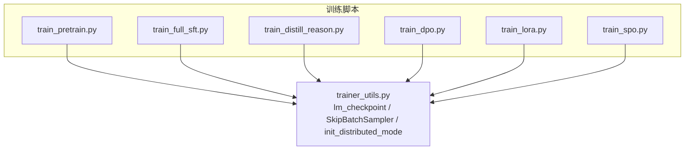
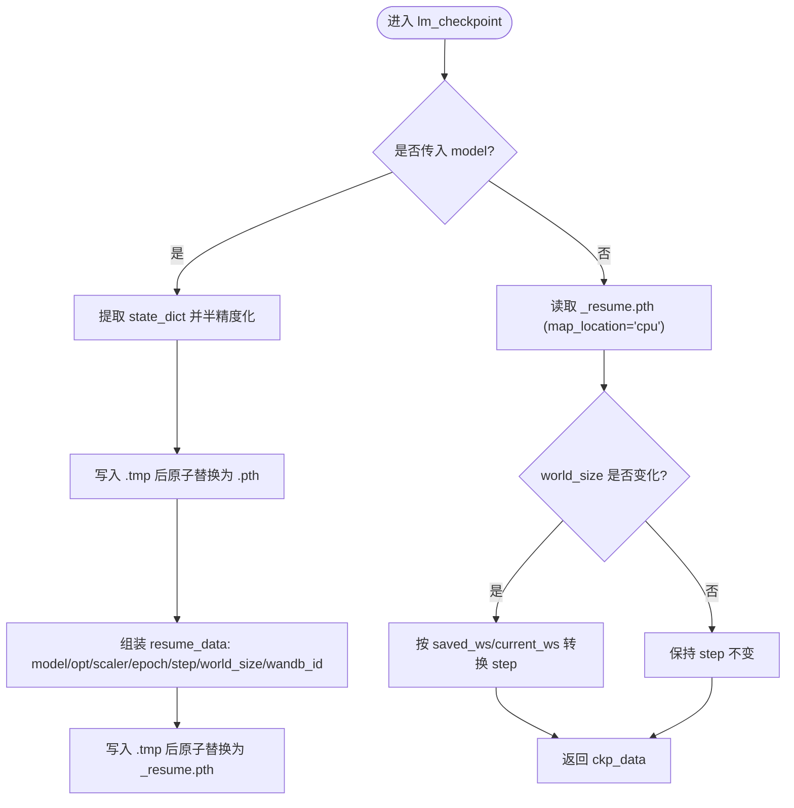
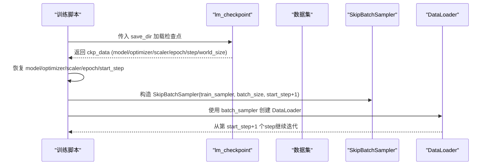
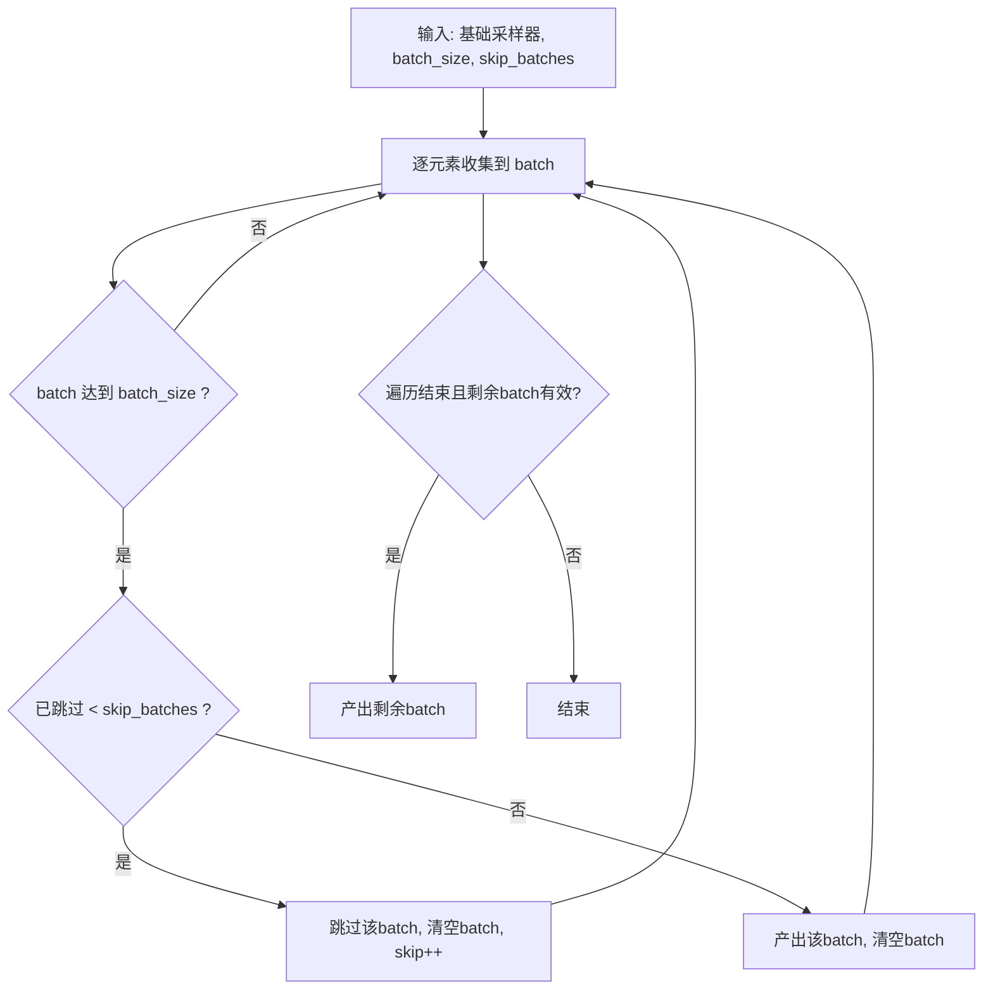
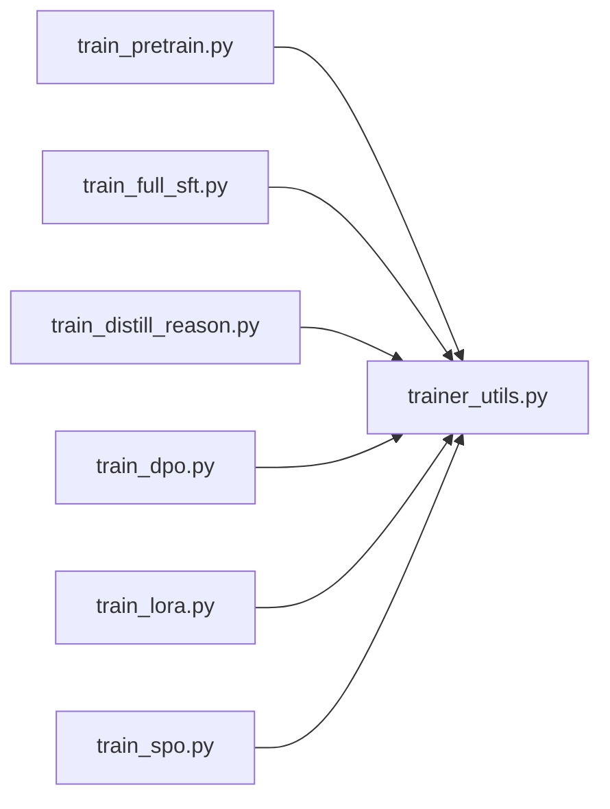

# 检查点管理与恢复

<cite>
**本文引用的文件**
- [trainer/trainer_utils.py](file://trainer/trainer_utils.py)
- [trainer/train_pretrain.py](file://trainer/train_pretrain.py)
- [trainer/train_full_sft.py](file://trainer/train_full_sft.py)
- [trainer/train_distill_reason.py](file://trainer/train_distill_reason.py)
- [trainer/train_dpo.py](file://trainer/train_dpo.py)
- [trainer/train_lora.py](file://trainer/train_lora.py)
- [trainer/train_spo.py](file://trainer/train_spo.py)
- [docs/04_Phase4_预训练.md](file://docs/04_Phase4_预训练.md)
- [README.md](file://README.md)
</cite>

## 目录
1. [简介](#简介)
2. [项目结构](#项目结构)
3. [核心组件](#核心组件)
4. [架构总览](#架构总览)
5. [详细组件分析](#详细组件分析)
6. [依赖分析](#依赖分析)
7. [性能考量](#性能考量)
8. [故障排查指南](#故障排查指南)
9. [结论](#结论)
10. [附录](#附录)

## 简介
本文件面向MiniMind项目的检查点管理与恢复，围绕lm_checkpoint函数展开，系统阐述检查点保存策略、恢复机制、文件结构与命名规范、半精度存储技术、断点续训流程、状态恢复细节（模型、优化器、混合精度缩放器、学习率调度器、分布式世界大小）、版本与备份策略、损坏检测与修复、监控与清理策略，以及分布式训练下的同步与一致性保障。同时解释SkipBatchSampler的跳步机制及其与检查点恢复的数据处理逻辑。

## 项目结构
与检查点管理直接相关的核心文件与职责：
- trainer/trainer_utils.py：提供通用训练工具，包含lm_checkpoint检查点函数、SkipBatchSampler跳步采样器、分布式初始化与主进程判定等。
- trainer/train_pretrain.py、trainer/train_full_sft.py、trainer/train_distill_reason.py、trainer/train_dpo.py、trainer/train_lora.py、trainer/train_spo.py：各训练脚本在合适时机调用lm_checkpoint保存检查点，并在启动时尝试从检查点恢复状态。
- docs/04_Phase4_预训练.md：文档化了检查点保存与恢复的接口与流程。
- README.md：概述了断点续训能力与检查点命名规范。



**图表来源**
- [trainer/trainer_utils.py:47-97](file://trainer/trainer_utils.py#L47-L97)
- [trainer/train_pretrain.py:114](file://trainer/train_pretrain.py#L114)
- [trainer/train_full_sft.py:115](file://trainer/train_full_sft.py#L115)
- [trainer/train_distill_reason.py:17](file://trainer/train_distill_reason.py#L17)
- [trainer/train_dpo.py:18](file://trainer/train_dpo.py#L18)
- [trainer/train_lora.py:17](file://trainer/train_lora.py#L17)
- [trainer/train_spo.py:310](file://trainer/train_spo.py#L310)

**章节来源**
- [trainer/trainer_utils.py:15-138](file://trainer/trainer_utils.py#L15-L138)
- [trainer/train_pretrain.py:114](file://trainer/train_pretrain.py#L114)
- [trainer/train_full_sft.py:115](file://trainer/train_full_sft.py#L115)
- [trainer/train_distill_reason.py:17](file://trainer/train_distill_reason.py#L17)
- [trainer/train_dpo.py:18](file://trainer/train_dpo.py#L18)
- [trainer/train_lora.py:17](file://trainer/train_lora.py#L17)
- [trainer/train_spo.py:310](file://trainer/train_spo.py#L310)
- [docs/04_Phase4_预训练.md:256-292](file://docs/04_Phase4_预训练.md#L256-L292)
- [README.md:319-326](file://README.md#L319-L326)

## 核心组件
- lm_checkpoint函数：负责保存与加载检查点，保存模型权重（半精度）、优化器状态、混合精度缩放器状态、epoch/step等训练进度，以及分布式世界大小与wandb运行ID，便于跨GPU数量恢复与训练记录连续性。
- SkipBatchSampler：在断点续训时跳过已处理的batch，确保从正确的step继续训练。
- 分布式工具：is_main_process、init_distributed_mode等，确保仅主进程保存检查点，分布式环境正确初始化。

**章节来源**
- [trainer/trainer_utils.py:47-97](file://trainer/trainer_utils.py#L47-L97)
- [trainer/trainer_utils.py:114-138](file://trainer/trainer_utils.py#L114-L138)
- [trainer/trainer_utils.py:15-35](file://trainer/trainer_utils.py#L15-L35)

## 架构总览
检查点管理贯穿训练生命周期：训练过程中定期保存权重（半精度）与完整检查点；启动时自动检测并加载检查点，恢复模型、优化器、缩放器、epoch/step等状态；分布式场景下自动调整step以适配GPU数量变化；通过SkipBatchSampler确保数据流与训练进度一致。

```mermaid
sequenceDiagram
participant Train as "训练脚本"
participant Utils as "trainer_utils.py"
participant Model as "模型"
participant Opt as "优化器"
participant Scaler as "GradScaler"
participant FS as "文件系统"
participant Dist as "分布式"
Train->>Utils : 调用 lm_checkpoint(..., model, optimizer, scaler, epoch, step, wandb, save_dir)
Utils->>Dist : 获取 world_size
Utils->>Model : 提取 state_dict支持DDP
Utils->>FS : 保存权重(.pth，半精度)
Utils->>FS : 保存检查点(_resume.pth，含model/optimizer/scaler/epoch/step/world_size/wandb_id)
Note over Utils,FS : 使用临时文件+原子替换，保证写入原子性
Train->>Utils : 启动时再次调用 lm_checkpoint(save_dir) 仅加载
Utils->>FS : 读取 _resume.pth
Utils->>Dist : 若 world_size 变化，转换 step
Utils-->>Train : 返回 ckp_data
Train->>Model : load_state_dict(ckp_data['model'])
Train->>Opt : load_state_dict(ckp_data['optimizer'])
Train->>Scaler : load_state_dict(ckp_data['scaler'])
Train->>Train : set_epoch(epoch), SkipBatchSampler(step+1)
```

**图表来源**
- [trainer/trainer_utils.py:47-97](file://trainer/trainer_utils.py#L47-L97)
- [trainer/train_pretrain.py:139-161](file://trainer/train_pretrain.py#L139-L161)
- [trainer/train_full_sft.py:140-162](file://trainer/train_full_sft.py#L140-L162)
- [trainer/train_distill_reason.py:151-174](file://trainer/train_distill_reason.py#L151-L174)
- [trainer/train_dpo.py:196-207](file://trainer/train_dpo.py#L196-L207)
- [trainer/train_lora.py:170-176](file://trainer/train_lora.py#L170-L176)
- [trainer/train_spo.py:316-341](file://trainer/train_spo.py#L316-L341)

## 详细组件分析

### lm_checkpoint函数实现原理与策略
- 文件命名与结构
  - 权重文件：基于权重名与隐藏维度生成，如“<权重名>_<维度>.pth”，支持MoE后缀。
  - 检查点文件：在权重文件名基础上追加“_resume”，如“<权重名>_<维度>_resume.pth”。
- 保存策略
  - 权重保存：提取state_dict，将张量转为半精度，写入临时文件后原子替换，避免部分写入。
  - 检查点保存：包含model、optimizer、scaler、epoch、step、world_size、wandb_id，以及通过关键字参数传入的其他对象（如调度器等）的状态字典。
- 加载策略
  - 当仅传入save_dir时，函数以加载模式工作，读取“_resume.pth”，若分布式世界大小变化，自动按比例转换step，保证数据索引与训练进度一致。
- 分布式与主进程
  - 仅在主进程保存检查点，避免重复写入与竞态。
  - 保存时记录world_size，加载时用于step转换。
- wandb集成
  - 自动捕获当前运行ID，便于断点续训时恢复同一run。



**图表来源**
- [trainer/trainer_utils.py:47-97](file://trainer/trainer_utils.py#L47-L97)

**章节来源**
- [trainer/trainer_utils.py:47-97](file://trainer/trainer_utils.py#L47-L97)
- [docs/04_Phase4_预训练.md:256-271](file://docs/04_Phase4_预训练.md#L256-L271)
- [README.md:319-326](file://README.md#L319-L326)

### 检查点文件结构与权重保存格式
- 权重文件（.pth）
  - 结构：键为参数名，值为张量；所有张量以半精度存储，显著节省空间。
  - 用途：快速加载权重进行推理或作为后续训练的初始化权重。
- 检查点文件（_resume.pth）
  - 结构：包含模型权重、优化器状态、混合精度缩放器状态、epoch、step、分布式世界大小、wandb运行ID，以及通过关键字参数传入的对象状态（如调度器）。
  - 用途：断点续训的完整状态恢复。

**章节来源**
- [trainer/trainer_utils.py:56-87](file://trainer/trainer_utils.py#L56-L87)
- [trainer/trainer_utils.py:88-97](file://trainer/trainer_utils.py#L88-L97)
- [docs/04_Phase4_预训练.md:256-271](file://docs/04_Phase4_预训练.md#L256-L271)

### 半精度存储技术
- 权重半精度：保存时对state_dict中的张量调用半精度转换，降低存储占用。
- 混合精度训练：训练脚本中使用GradScaler进行混合精度训练，检查点中保存scaler状态，确保恢复后缩放行为一致。

**章节来源**
- [trainer/trainer_utils.py:56-58](file://trainer/trainer_utils.py#L56-L58)
- [trainer/train_pretrain.py:75](file://trainer/train_pretrain.py#L75)
- [trainer/train_full_sft.py:77](file://trainer/train_full_sft.py#L77)

### 文件命名规范
- 权重文件："<权重名>_<维度>.pth"，若使用MoE则附加"_moe"。
- 检查点文件："<权重名>_<维度>_resume.pth"，同样支持"_moe"后缀。
- 目录：权重保存至训练脚本的save_dir，检查点保存至固定目录（默认"../checkpoints"）。

**章节来源**
- [trainer/trainer_utils.py:49-51](file://trainer/trainer_utils.py#L49-L51)
- [trainer/train_pretrain.py:70](file://trainer/train_pretrain.py#L70)
- [trainer/train_full_sft.py:70](file://trainer/train_full_sft.py#L70)
- [README.md:321](file://README.md#L321)

### 断点续训流程与状态恢复机制
- 启动阶段
  - 训练脚本在初始化后尝试调用lm_checkpoint加载检查点（仅传入save_dir）。
  - 若存在检查点，恢复模型权重、优化器状态、scaler状态、epoch与step。
- 分布式世界大小变化处理
  - 加载时比较saved_ws与current_ws，按比例转换step，确保数据索引正确。
- 学习率调度恢复
  - 预训练与SFT脚本中保存并恢复优化器状态，学习率由优化器参数组控制。
  - SPO脚本额外保存并恢复学习率调度器状态。
- SkipBatchSampler跳步
  - 在第一个epoch且存在start_step时，使用SkipBatchSampler跳过已处理的batch，保证数据流与训练进度一致。



**图表来源**
- [trainer/train_pretrain.py:139-161](file://trainer/train_pretrain.py#L139-L161)
- [trainer/train_full_sft.py:140-162](file://trainer/train_full_sft.py#L140-L162)
- [trainer/train_distill_reason.py:151-174](file://trainer/train_distill_reason.py#L151-L174)
- [trainer/train_dpo.py:196-207](file://trainer/train_dpo.py#L196-L207)
- [trainer/train_lora.py:170-176](file://trainer/train_lora.py#L170-L176)
- [trainer/train_spo.py:316-341](file://trainer/train_spo.py#L316-L341)

**章节来源**
- [trainer/train_pretrain.py:139-161](file://trainer/train_pretrain.py#L139-L161)
- [trainer/train_full_sft.py:140-162](file://trainer/train_full_sft.py#L140-L162)
- [trainer/train_distill_reason.py:151-174](file://trainer/train_distill_reason.py#L151-L174)
- [trainer/train_dpo.py:196-207](file://trainer/train_dpo.py#L196-L207)
- [trainer/train_lora.py:170-176](file://trainer/train_lora.py#L170-L176)
- [trainer/train_spo.py:316-341](file://trainer/train_spo.py#L316-L341)

### SkipBatchSampler的跳步机制与数据处理逻辑
- 跳步原理
  - 通过迭代基础采样器，按batch_size聚合索引；在skip_batches范围内丢弃整批索引，实现“跳过已处理的batch”。
- 与检查点的衔接
  - start_step对应已处理的batch数量，SkipBatchSampler以start_step+1为起点，确保从正确位置继续训练。
- 长度计算
  - 总batch数减去skip_batches，避免越界。



**图表来源**
- [trainer/trainer_utils.py:114-138](file://trainer/trainer_utils.py#L114-L138)

**章节来源**
- [trainer/trainer_utils.py:114-138](file://trainer/trainer_utils.py#L114-L138)
- [trainer/train_pretrain.py:154-161](file://trainer/train_pretrain.py#L154-L161)
- [trainer/train_full_sft.py:155-162](file://trainer/train_full_sft.py#L155-L162)

### 分布式训练中的检查点同步与一致性
- 主进程协调
  - 仅主进程保存检查点，避免多进程竞争写入。
- 世界大小感知
  - 保存时记录world_size；加载时若变化，按比例转换step，保证数据索引一致性。
- DDP参数忽略
  - 训练脚本中将某些参数（如RoPE频率缓存）加入忽略列表，避免不必要的同步，提高效率。

**章节来源**
- [trainer/trainer_utils.py:15-16](file://trainer/trainer_utils.py#L15-L16)
- [trainer/trainer_utils.py:91-95](file://trainer/trainer_utils.py#L91-L95)
- [trainer/train_pretrain.py:147-149](file://trainer/train_pretrain.py#L147-L149)
- [trainer/train_full_sft.py:147-149](file://trainer/train_full_sft.py#L147-L149)

### 版本管理、备份策略与损坏检查
- 版本与命名
  - 通过权重名与维度组合形成稳定文件名，便于版本识别与管理。
- 备份策略
  - 建议在重要里程碑（如完成一轮epoch、达到特定step）手动复制_checkpoints/_resume.pth与对应权重文件，形成多版本备份。
- 损坏检查与修复
  - 检查点加载时若world_size变化，自动转换step；若检查点文件损坏，应删除或重命名为“.bak”，重新训练生成新检查点。
  - 权重文件采用半精度保存，若加载失败，可尝试以CPU映射加载或重建权重文件。

**章节来源**
- [trainer/trainer_utils.py:49-51](file://trainer/trainer_utils.py#L49-L51)
- [trainer/trainer_utils.py:88-97](file://trainer/trainer_utils.py#L88-L97)

### 监控方法、存储空间管理与清理策略
- 监控
  - 使用SwanLab（兼容WandB API）记录loss、学习率、耗时等指标，断点续训时自动恢复同一run。
- 存储空间管理
  - 权重文件与检查点文件均采用半精度，显著降低存储占用；定期清理旧版本权重与检查点，保留最近N个版本。
- 清理策略
  - 建议按“最近N次保存”策略清理，或按“最大容量阈值”清理；保留一个完整检查点与最近一次权重文件。

**章节来源**
- [trainer/train_pretrain.py:122-128](file://trainer/train_pretrain.py#L122-L128)
- [trainer/train_full_sft.py:123-129](file://trainer/train_full_sft.py#L123-L129)
- [README.md:319-326](file://README.md#L319-L326)

## 依赖分析
- 训练脚本依赖trainer_utils中的lm_checkpoint与SkipBatchSampler。
- 训练脚本在合适时机调用lm_checkpoint保存权重与检查点。
- 训练脚本在启动时尝试加载检查点并恢复状态。



**图表来源**
- [trainer/train_pretrain.py:18](file://trainer/train_pretrain.py#L18)
- [trainer/train_full_sft.py:18](file://trainer/train_full_sft.py#L18)
- [trainer/train_distill_reason.py:17](file://trainer/train_distill_reason.py#L17)
- [trainer/train_dpo.py:18](file://trainer/train_dpo.py#L18)
- [trainer/train_lora.py:17](file://trainer/train_lora.py#L17)
- [trainer/train_spo.py:21](file://trainer/train_spo.py#L21)

**章节来源**
- [trainer/train_pretrain.py:18](file://trainer/train_pretrain.py#L18)
- [trainer/train_full_sft.py:18](file://trainer/train_full_sft.py#L18)
- [trainer/train_distill_reason.py:17](file://trainer/train_distill_reason.py#L17)
- [trainer/train_dpo.py:18](file://trainer/train_dpo.py#L18)
- [trainer/train_lora.py:17](file://trainer/train_lora.py#L17)
- [trainer/train_spo.py:21](file://trainer/train_spo.py#L21)

## 性能考量
- 半精度存储显著降低I/O与存储压力，缩短保存/加载时间。
- 原子写入（.tmp+os.replace）避免部分写入导致的损坏。
- 仅主进程保存检查点，减少分布式写入开销。
- SkipBatchSampler避免重复处理已训练数据，提升续训效率。

[本节为通用指导，无需列出具体文件来源]

## 故障排查指南
- 检查点损坏
  - 现象：加载检查点时报错或数据索引异常。
  - 排查：确认_checkpoints/_resume.pth存在且可读；若world_size变化，确认step已按比例转换。
- 权重加载失败
  - 现象：加载权重时报错。
  - 排查：确认权重文件与模型配置一致（维度、MoE开关）；尝试以CPU映射加载或重建权重。
- 分布式世界大小变化
  - 现象：多卡与单卡切换后step不一致。
  - 处理：依赖lm_checkpoint自动转换step；若仍异常，删除检查点后从头训练。
- 保存权限问题
  - 现象：无法写入_checkpoints或权重目录。
  - 处理：确认目录存在且具有写权限；必要时调整save_dir与checkpoints目录。

**章节来源**
- [trainer/trainer_utils.py:88-97](file://trainer/trainer_utils.py#L88-L97)
- [trainer/train_pretrain.py:139-161](file://trainer/train_pretrain.py#L139-L161)
- [trainer/train_full_sft.py:140-162](file://trainer/train_full_sft.py#L140-L162)

## 结论
MiniMind的检查点管理通过lm_checkpoint实现了“权重半精度保存+完整状态恢复”的闭环，配合SkipBatchSampler确保断点续训的数据一致性；在分布式场景下，通过主进程协调与world_size感知，保证多卡与单卡间的平滑过渡。建议在生产环境中结合版本备份、监控与清理策略，确保长期训练的稳定性与可维护性。

[本节为总结性内容，无需列出具体文件来源]

## 附录
- 命名规范速查
  - 权重文件：<权重名>_<维度>.pth（MoE时附加_moe）
  - 检查点文件：<权重名>_<维度>_resume.pth（MoE时附加_moe）
- 断点续训启动
  - 在训练脚本中添加--from_resume 1参数，自动检测并加载检查点。

**章节来源**
- [trainer/trainer_utils.py:49-51](file://trainer/trainer_utils.py#L49-L51)
- [README.md:319-326](file://README.md#L319-L326)