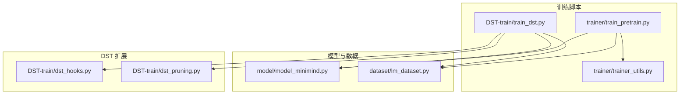
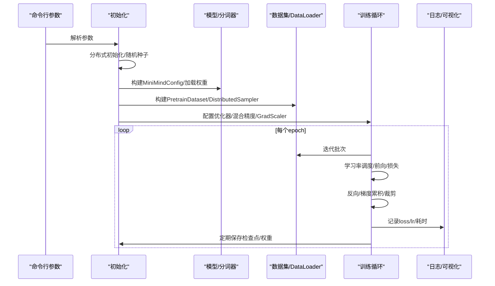
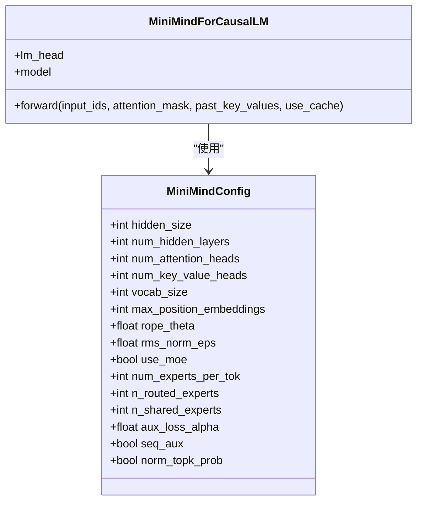
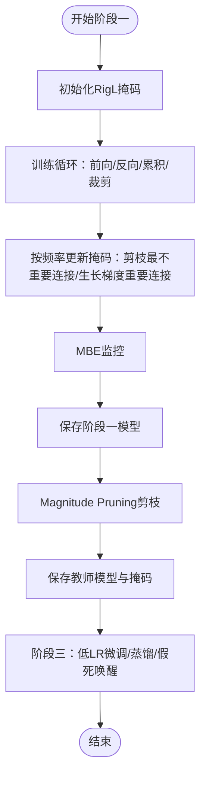
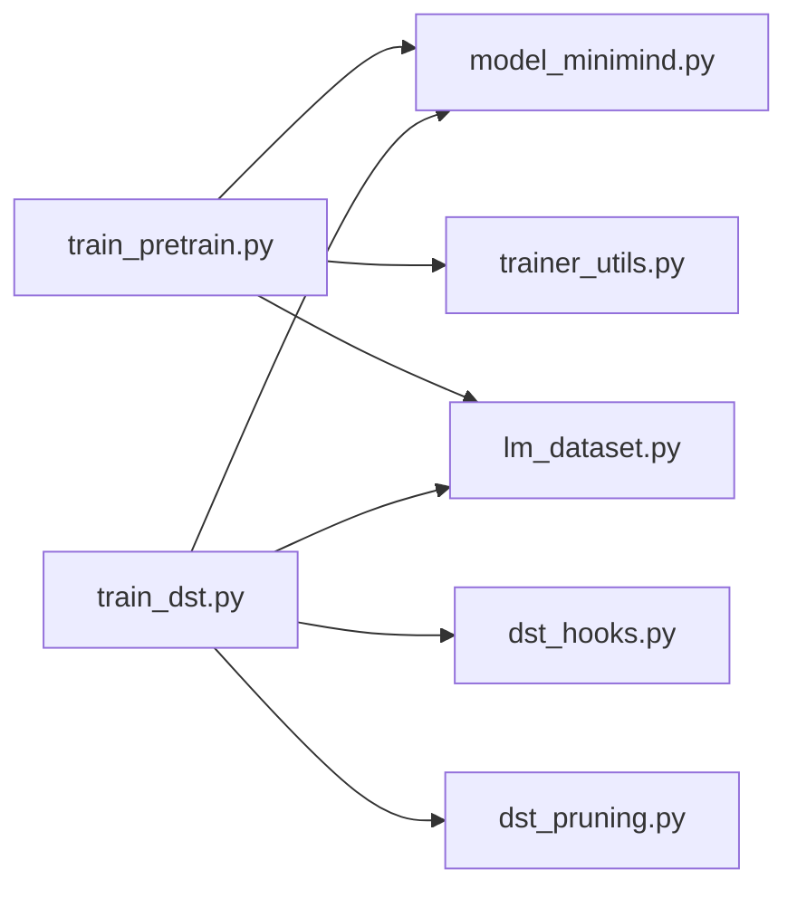

# 训练配置与参数

<cite>
**本文引用的文件**
- [trainer/train_pretrain.py](file://trainer/train_pretrain.py)
- [trainer/trainer_utils.py](file://trainer/trainer_utils.py)
- [model/model_minimind.py](file://model/model_minimind.py)
- [dataset/lm_dataset.py](file://dataset/lm_dataset.py)
- [DST-train/train_dst.py](file://DST-train/train_dst.py)
- [DST-train/dst_hooks.py](file://DST-train/dst_hooks.py)
- [DST-train/dst_pruning.py](file://DST-train/dst_pruning.py)
- [docs/04_Phase4_预训练.md](file://docs/04_Phase4_预训练.md)
- [docs/03_Phase3_模型架构详解.md](file://docs/03_Phase3_模型架构详解.md)
- [requirements.txt](file://requirements.txt)
</cite>

## 目录
1. [简介](#简介)
2. [项目结构](#项目结构)
3. [核心组件](#核心组件)
4. [架构总览](#架构总览)
5. [详细组件分析](#详细组件分析)
6. [依赖关系分析](#依赖关系分析)
7. [性能考量](#性能考量)
8. [故障排查指南](#故障排查指南)
9. [结论](#结论)
10. [附录](#附录)

## 简介
本文件系统化梳理 MiniMind 项目的预训练配置与参数，覆盖训练脚本可配置项、模型架构参数、混合精度与分布式训练、梯度裁剪与梯度累积、参数调优与性能影响分析、不同硬件下的参数推荐与内存优化策略、参数验证与错误处理机制等内容。目标是帮助使用者在不同硬件与场景下高效、稳定地完成预训练与扩展训练（如 DST 动态稀疏训练）。

## 项目结构
围绕预训练与参数配置的核心文件与职责如下：
- 训练脚本与工具
  - 预训练脚本：trainer/train_pretrain.py
  - 训练工具：trainer/trainer_utils.py
- 模型与数据
  - 模型定义：model/model_minimind.py
  - 数据集封装：dataset/lm_dataset.py
- 扩展训练（DST）
  - DST 主脚本：DST-train/train_dst.py
  - DST 诊断与剪枝：DST-train/dst_hooks.py、DST-train/dst_pruning.py
- 文档与依赖
  - 预训练文档：docs/04_Phase4_预训练.md
  - 模型架构文档：docs/03_Phase3_模型架构详解.md
  - 依赖清单：requirements.txt

**图表来源**
- [trainer/train_pretrain.py:1-162](file://trainer/train_pretrain.py#L1-L162)
- [trainer/trainer_utils.py:1-139](file://trainer/trainer_utils.py#L1-L139)
- [model/model_minimind.py:1-477](file://model/model_minimind.py#L1-L477)
- [dataset/lm_dataset.py:1-250](file://dataset/lm_dataset.py#L1-L250)
- [DST-train/train_dst.py:1-472](file://DST-train/train_dst.py#L1-L472)
- [DST-train/dst_hooks.py:1-263](file://DST-train/dst_hooks.py#L1-L263)
- [DST-train/dst_pruning.py:1-291](file://DST-train/dst_pruning.py#L1-L291)

**章节来源**
- [trainer/train_pretrain.py:1-162](file://trainer/train_pretrain.py#L1-L162)
- [model/model_minimind.py:1-477](file://model/model_minimind.py#L1-L477)
- [dataset/lm_dataset.py:1-250](file://dataset/lm_dataset.py#L1-L250)
- [DST-train/train_dst.py:1-472](file://DST-train/train_dst.py#L1-L472)

## 核心组件
- 预训练脚本（train_pretrain.py）
  - 负责解析参数、初始化分布式环境、构建模型与数据集、配置优化器与混合精度、执行训练循环、保存检查点与模型权重。
- 训练工具（trainer_utils.py）
  - 提供分布式初始化、随机种子设置、学习率调度、检查点保存与加载、模型加载、跳过已训练 batch 的采样器等。
- 模型定义（model_minimind.py）
  - 定义 MiniMindConfig 与 MiniMindForCausalLM，包含 Transformer 块、注意力、FFN/MoE、RoPE、权重共享等。
- 数据集（lm_dataset.py）
  - 提供预训练与 SFT 数据集封装，负责 tokenization、loss mask 生成与样本切片。
- DST 扩展（DST-train/*）
  - 提供 RigL 动态稀疏训练、剪枝、MBE 监控、假死神经元检测等高级训练流程。

**章节来源**
- [trainer/train_pretrain.py:81-162](file://trainer/train_pretrain.py#L81-L162)
- [trainer/trainer_utils.py:15-139](file://trainer/trainer_utils.py#L15-L139)
- [model/model_minimind.py:8-477](file://model/model_minimind.py#L8-L477)
- [dataset/lm_dataset.py:16-124](file://dataset/lm_dataset.py#L16-L124)
- [DST-train/train_dst.py:293-472](file://DST-train/train_dst.py#L293-L472)

## 架构总览
预训练训练流的关键节点包括：参数解析、分布式初始化、模型与分词器初始化、数据集与 DataLoader、混合精度与优化器、训练循环（学习率调度、前向、损失、反向、梯度累积、裁剪、优化器步进）、日志与可视化、检查点与模型保存。

**图表来源**
- [trainer/train_pretrain.py:106-162](file://trainer/train_pretrain.py#L106-L162)
- [trainer/trainer_utils.py:24-97](file://trainer/trainer_utils.py#L24-L97)
- [dataset/lm_dataset.py:16-51](file://dataset/lm_dataset.py#L16-L51)

## 详细组件分析

### 训练脚本参数与行为
- 关键参数
  - 训练轮数：--epochs
  - 批大小：--batch_size
  - 初始学习率：--learning_rate
  - 梯度累积步数：--accumulation_steps
  - 混合精度类型：--dtype（bfloat16/float16）
  - 梯度裁剪阈值：--grad_clip
  - 日志间隔：--log_interval
  - 保存间隔：--save_interval
  - 隐藏层维度：--hidden_size
  - 隐藏层数量：--num_hidden_layers
  - 最大序列长度：--max_seq_len
  - MoE 开关：--use_moe
  - 数据路径：--data_path
  - 基于权重继续训练：--from_weight
  - 断点续训：--from_resume
  - 设备与多卡：--device、torchrun
  - 可视化：--use_wandb、--wandb_project
- 训练循环要点
  - 学习率：余弦退火调度
  - 混合精度：Autocast + GradScaler（dtype=float16 时启用）
  - 梯度累积：累计到 accumulation_steps 再更新
  - 梯度裁剪：clip_grad_norm_
  - 检查点：lm_checkpoint 保存模型、优化器、scaler、wandb run id
  - 分布式：DDP 包装，忽略 RoPE 频率缓存同步

**章节来源**
- [trainer/train_pretrain.py:82-104](file://trainer/train_pretrain.py#L82-L104)
- [trainer/train_pretrain.py:23-79](file://trainer/train_pretrain.py#L23-L79)
- [trainer/train_pretrain.py:116-135](file://trainer/train_pretrain.py#L116-L135)
- [trainer/train_pretrain.py:146-162](file://trainer/train_pretrain.py#L146-L162)
- [trainer/trainer_utils.py:24-97](file://trainer/trainer_utils.py#L24-L97)

### 模型架构参数与 MoE 影响
- 模型配置（MiniMindConfig）
  - 关键维度：hidden_size、num_hidden_layers、num_attention_heads、num_key_value_heads、vocab_size、max_position_embeddings、rope_theta、rms_norm_eps、flash_attn
  - MoE 参数：use_moe、num_experts_per_tok、n_routed_experts、n_shared_experts、scoring_func、aux_loss_alpha、seq_aux、norm_topk_prob
- 模型组件
  - RMSNorm、RoPE、GQA（分组查询注意力）、SwiGLU FFN、MoE FFN（含门控与辅助损失）、Transformer Block、CausalLM 头
- MoE 影响
  - 训练时引入 aux_loss，有助于负载均衡与路由稳定性
  - 推理时采用专家分组聚合与共享专家，兼顾容量与效率

**图表来源**
- [model/model_minimind.py:8-78](file://model/model_minimind.py#L8-L78)
- [model/model_minimind.py:443-477](file://model/model_minimind.py#L443-L477)

**章节来源**
- [model/model_minimind.py:8-78](file://model/model_minimind.py#L8-L78)
- [model/model_minimind.py:245-337](file://model/model_minimind.py#L245-L337)
- [docs/03_Phase3_模型架构详解.md:17-50](file://docs/03_Phase3_模型架构详解.md#L17-L50)

### 数据与损失掩码
- 预训练数据集
  - 输入 X 为 input_ids[:-1]，目标 Y 为 input_ids[1:]，loss_mask 为非 pad 的位置
  - 最大长度由 max_seq_len 控制
- SFT 数据集（DST 使用）
  - 通过 chat template 构造对话，loss_mask 仅对 assistant 回答部分生效

**章节来源**
- [dataset/lm_dataset.py:16-51](file://dataset/lm_dataset.py#L16-L51)
- [DST-train/train_dst.py:436-447](file://DST-train/train_dst.py#L436-L447)

### 分布式训练（DDP）
- 初始化：NCCL 后端，设置本地设备
- 包装：DDP 模型，忽略 RoPE 频率缓存同步
- 采样：DistributedSampler，每 epoch set_epoch

**章节来源**
- [trainer/trainer_utils.py:28-35](file://trainer/trainer_utils.py#L28-L35)
- [trainer/train_pretrain.py:147-149](file://trainer/train_pretrain.py#L147-L149)
- [trainer/train_pretrain.py:133-134](file://trainer/train_pretrain.py#L133-L134)

### 学习率调度与混合精度
- 学习率：余弦退火（cosine annealing），随 step 线性衰减
- 混合精度：bfloat16（无需 GradScaler）；float16（启用 GradScaler）

**章节来源**
- [trainer/trainer_utils.py:24-25](file://trainer/trainer_utils.py#L24-L25)
- [trainer/train_pretrain.py:118-119](file://trainer/train_pretrain.py#L118-L119)

### 梯度累积与裁剪
- 梯度累积：loss 除以 accumulation_steps，每 accumulation_steps 步执行优化器更新
- 梯度裁剪：clip_grad_norm_，防止梯度爆炸

**章节来源**
- [trainer/train_pretrain.py:45-55](file://trainer/train_pretrain.py#L45-L55)
- [trainer/train_pretrain.py:132-138](file://trainer/train_pretrain.py#L132-L138)

### 检查点与断点续训
- 保存：lm_checkpoint 保存模型、优化器、scaler、epoch、step、wandb run id
- 加载：自动检测 _resume.pth，支持跨 GPU 数量恢复（自动转换 step）

**章节来源**
- [trainer/trainer_utils.py:47-97](file://trainer/trainer_utils.py#L47-L97)
- [trainer/train_pretrain.py:137-144](file://trainer/train_pretrain.py#L137-L144)

### DST 动态稀疏训练（扩展）
- 阶段一：RigL 动态稀疏训练（剪枝-生长），周期性更新掩码，MBE 监控
- 阶段二：Magnitude Pruning 剪枝，保存掩码与教师模型
- 阶段三：低学习率微调 + 可选蒸馏 + 假死神经元唤醒

**图表来源**
- [DST-train/train_dst.py:74-138](file://DST-train/train_dst.py#L74-L138)
- [DST-train/train_dst.py:143-168](file://DST-train/train_dst.py#L143-L168)
- [DST-train/train_dst.py:174-264](file://DST-train/train_dst.py#L174-L264)
- [DST-train/dst_pruning.py:120-291](file://DST-train/dst_pruning.py#L120-L291)
- [DST-train/dst_hooks.py:10-160](file://DST-train/dst_hooks.py#L10-L160)

**章节来源**
- [DST-train/train_dst.py:293-472](file://DST-train/train_dst.py#L293-L472)
- [DST-train/dst_pruning.py:9-118](file://DST-train/dst_pruning.py#L9-L118)
- [DST-train/dst_hooks.py:10-160](file://DST-train/dst_hooks.py#L10-L160)

## 依赖关系分析
- 训练脚本依赖
  - 模型与配置：model_minimind.py
  - 工具函数：trainer_utils.py
  - 数据集：lm_dataset.py
  - 可视化：swanlab（wandb 的国内替代）
- DST 扩展依赖
  - 剪枝与稀疏调度：dst_pruning.py
  - 诊断与监控：dst_hooks.py

**图表来源**
- [trainer/train_pretrain.py:16-18](file://trainer/train_pretrain.py#L16-L18)
- [DST-train/train_dst.py:24-28](file://DST-train/train_dst.py#L24-L28)

**章节来源**
- [requirements.txt:29-30](file://requirements.txt#L29-L30)
- [trainer/train_pretrain.py:16-18](file://trainer/train_pretrain.py#L16-L18)
- [DST-train/train_dst.py:24-28](file://DST-train/train_dst.py#L24-L28)

## 性能考量
- 计算与显存
  - hidden_size、num_hidden_layers、max_seq_len、batch_size、accumulation_steps 共同决定有效 batch size 与显存占用
  - MoE 增加计算与通信开销，但可提升容量；aux_loss 会增加少量计算
- 混合精度
  - bfloat16 更稳定，适合大多数场景；float16 需 GradScaler 防止下溢
- 分布式
  - DDP 可线性扩展；注意忽略 RoPE 缓存同步，避免不必要的通信
- 学习率与收敛
  - 余弦退火有助于稳定收敛；过低学习率导致收敛慢，过高导致震荡
- 梯度累积与裁剪
  - 增大 effective batch size 时应相应调整学习率；合理设置 grad_clip 防止爆炸

[本节为通用指导，不直接分析具体文件]

## 故障排查指南
- 训练不收敛或震荡
  - 检查学习率是否过高；确认余弦退火参数；核对数据与 loss_mask
- 梯度爆炸或 NaN
  - 提高 grad_clip；切换 bfloat16；检查数据分布与标签
- 显存不足
  - 减小 batch_size 或 max_seq_len；增大 accumulation_steps；关闭 MoE；使用 bfloat16
- 分布式异常
  - 确认 NCCL 环境变量与后端；检查 LOCAL_RANK 与设备绑定；确保 DistributedSampler
- 断点续训失败
  - 检查 _resume.pth 是否存在；跨 GPU 数量恢复时 step 会自动转换；确认 world_size 一致性

**章节来源**
- [trainer/train_pretrain.py:132-138](file://trainer/train_pretrain.py#L132-L138)
- [trainer/trainer_utils.py:88-97](file://trainer/trainer_utils.py#L88-L97)
- [trainer/train_pretrain.py:147-149](file://trainer/train_pretrain.py#L147-L149)

## 结论
本文系统梳理了 MiniMind 预训练与扩展训练的参数与实现细节，明确了关键超参数的作用与相互影响，并给出了针对不同硬件与场景的调优建议与排错思路。结合 MoE、分布式与混合精度等技术，可在保证稳定性的同时提升训练效率与模型容量。

[本节为总结性内容，不直接分析具体文件]

## 附录

### 参数一览与调优建议
- 学习率与调度
  - 初始学习率：建议从 5e-4 开始；余弦退火，总步数为 epochs × steps_per_epoch
- 批大小与梯度累积
  - effective_batch_size = batch_size × accumulation_steps；显存紧张时优先增大 accumulation_steps
- 混合精度
  - bfloat16：默认首选；float16：启用 GradScaler
- 梯度裁剪
  - 常用阈值 1.0；若出现震荡可适当降低
- 模型架构
  - hidden_size：512/768/1024 等；num_hidden_layers：8/16 等；MoE：use_moe=1 时注意 aux_loss
- 序列长度
  - max_seq_len：512/1024/2048 等；长序列可考虑 YaRN 外推
- 分布式
  - torchrun --nproc_per_node N；确保 NCCL 环境与设备绑定

**章节来源**
- [trainer/train_pretrain.py:82-104](file://trainer/train_pretrain.py#L82-L104)
- [docs/04_Phase4_预训练.md:47-61](file://docs/04_Phase4_预训练.md#L47-L61)
- [docs/03_Phase3_模型架构详解.md:17-50](file://docs/03_Phase3_模型架构详解.md#L17-L50)