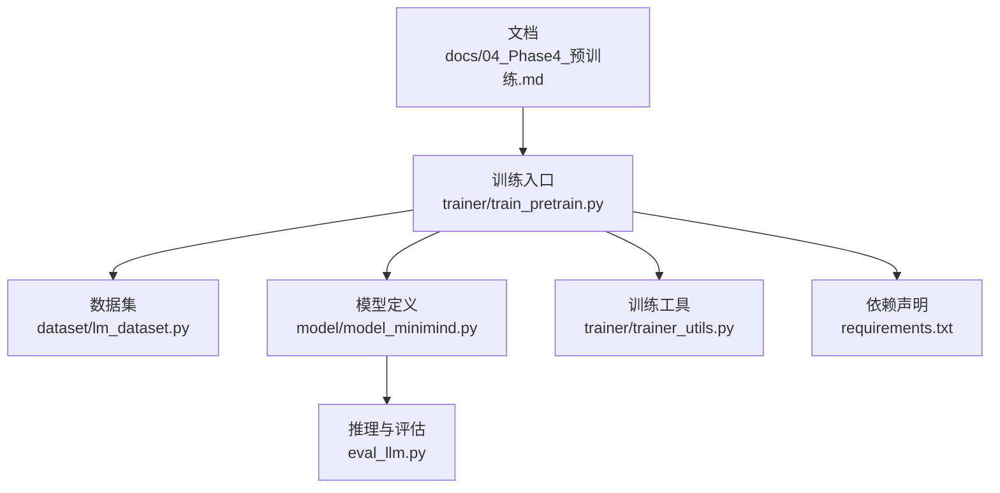
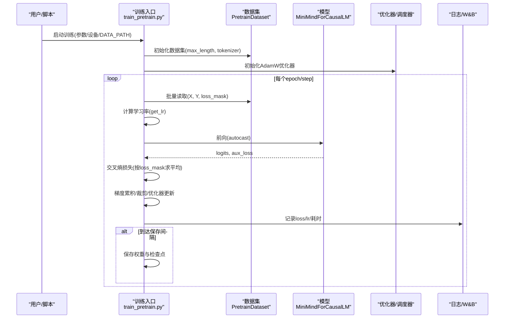
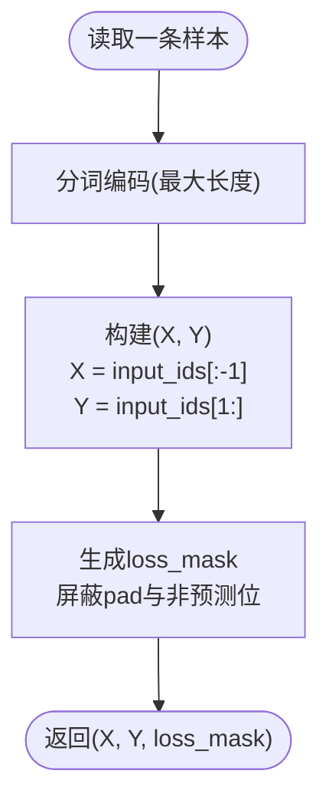
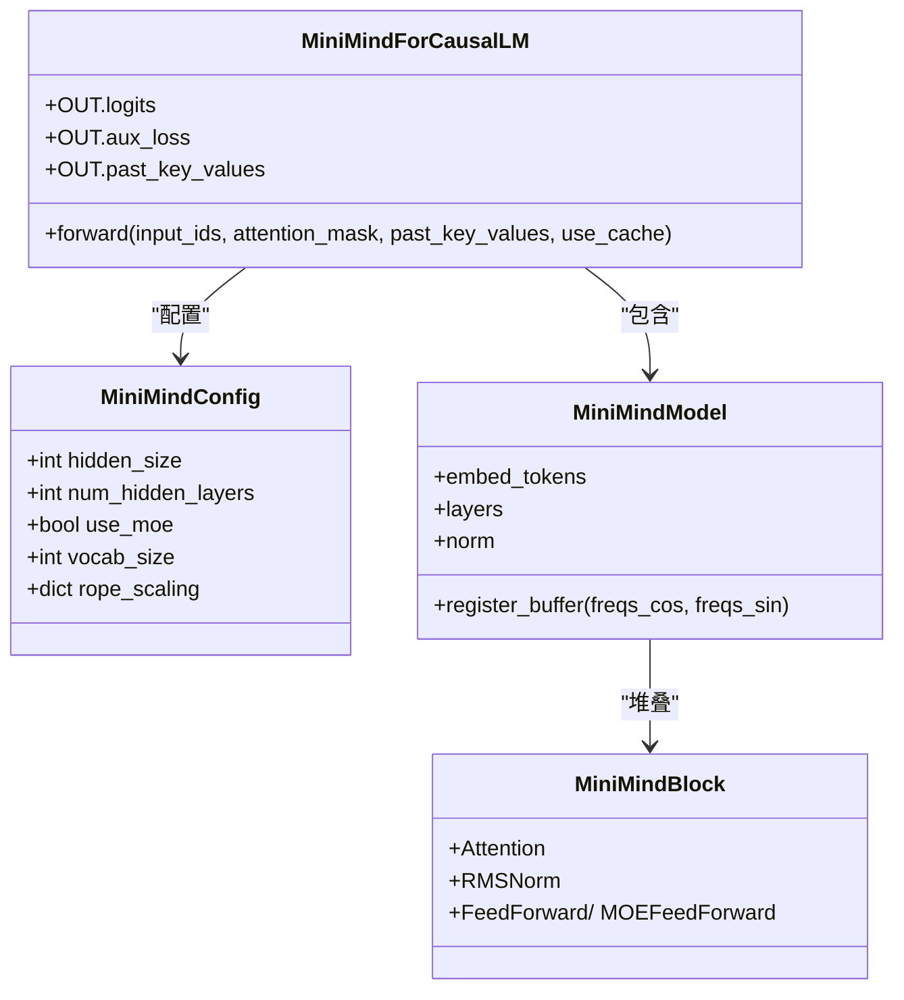
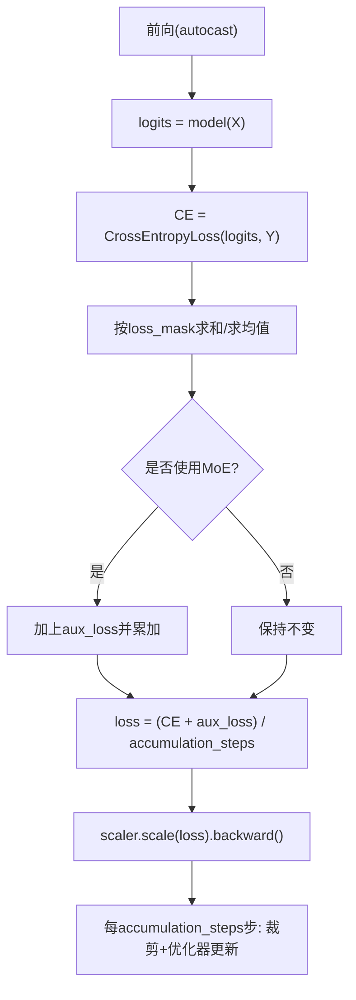
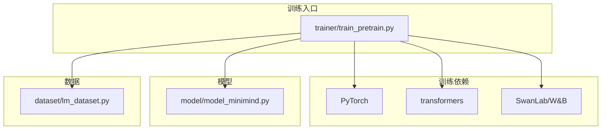

# 预训练原理与目标

<cite>
**本文引用的文件**
- [docs/04_Phase4_预训练.md](file://docs/04_Phase4_预训练.md)
- [trainer/train_pretrain.py](file://trainer/train_pretrain.py)
- [model/model_minimind.py](file://model/model_minimind.py)
- [dataset/lm_dataset.py](file://dataset/lm_dataset.py)
- [trainer/trainer_utils.py](file://trainer/trainer_utils.py)
- [eval_llm.py](file://eval_llm.py)
- [requirements.txt](file://requirements.txt)
</cite>

## 目录
1. [引言](#引言)
2. [项目结构](#项目结构)
3. [核心组件](#核心组件)
4. [架构总览](#架构总览)
5. [详细组件分析](#详细组件分析)
6. [依赖分析](#依赖分析)
7. [性能考量](#性能考量)
8. [故障排查指南](#故障排查指南)
9. [结论](#结论)
10. [附录](#附录)

## 引言
本章节围绕MiniMind项目的无监督预训练阶段，系统阐述预训练的基本概念、自回归语言建模的核心思想、交叉熵损失函数的设计原理与实现细节，并结合代码实现解析目标函数、上下文建模策略与序列预测机制。同时，说明预训练在大语言模型训练中的关键作用，以及如何通过无监督学习获得通用的语言表示能力；最后给出预训练效果评估方法与质量判断标准，帮助读者理解预训练阶段的技术价值与实现要点。

## 项目结构
MiniMind的预训练相关代码主要分布在以下模块：
- 文档与流程说明：docs/04_Phase4_预训练.md
- 训练入口与训练循环：trainer/train_pretrain.py
- 模型定义与前向输出：model/model_minimind.py
- 数据集构造与标签生成：dataset/lm_dataset.py
- 训练工具与分布式支持：trainer/trainer_utils.py
- 推理与效果验证：eval_llm.py
- 依赖声明：requirements.txt

**图示来源**
- [docs/04_Phase4_预训练.md](file://docs/04_Phase4_预训练.md)
- [trainer/train_pretrain.py](file://trainer/train_pretrain.py)
- [model/model_minimind.py](file://model/model_minimind.py)
- [dataset/lm_dataset.py](file://dataset/lm_dataset.py)
- [trainer/trainer_utils.py](file://trainer/trainer_utils.py)
- [eval_llm.py](file://eval_llm.py)
- [requirements.txt](file://requirements.txt)

**章节来源**
- [docs/04_Phase4_预训练.md](file://docs/04_Phase4_预训练.md)
- [trainer/train_pretrain.py](file://trainer/train_pretrain.py)
- [model/model_minimind.py](file://model/model_minimind.py)
- [dataset/lm_dataset.py](file://dataset/lm_dataset.py)
- [trainer/trainer_utils.py](file://trainer/trainer_utils.py)
- [eval_llm.py](file://eval_llm.py)
- [requirements.txt](file://requirements.txt)

## 核心组件
- 预训练数据集构造：将单条文本切分为输入序列X与目标序列Y，其中Y为X右移一位的标签；同时生成loss_mask以忽略padding与非预测位置。
- 模型与前向：MiniMindForCausalLM输出logits与辅助损失aux_loss（当使用MoE时），并支持past_key_values缓存以加速推理。
- 训练循环：采用余弦退火学习率、混合精度、梯度累积与梯度裁剪；损失按loss_mask求平均，并可叠加MoE辅助损失。
- 分布式与断点续训：支持DDP初始化、分布式采样器、跳过已训练batch、保存/加载检查点。

**章节来源**
- [dataset/lm_dataset.py](file://dataset/lm_dataset.py)
- [model/model_minimind.py](file://model/model_minimind.py)
- [trainer/train_pretrain.py](file://trainer/train_pretrain.py)
- [trainer/trainer_utils.py](file://trainer/trainer_utils.py)

## 架构总览
预训练端到端流程如下：

**图示来源**
- [trainer/train_pretrain.py](file://trainer/train_pretrain.py)
- [dataset/lm_dataset.py](file://dataset/lm_dataset.py)
- [model/model_minimind.py](file://model/model_minimind.py)
- [trainer/trainer_utils.py](file://trainer/trainer_utils.py)

## 详细组件分析

### 数据集与标签生成（自回归建模）
- 输入X：去掉最后一个token的原始序列
- 目标Y：X整体右移一位，即预测下一个token
- loss_mask：屏蔽padding与非预测位置，确保仅对有效token计算损失
- 截断与填充：按max_length进行截断与填充，保证批次内等长张量

**图示来源**
- [dataset/lm_dataset.py](file://dataset/lm_dataset.py)

**章节来源**
- [dataset/lm_dataset.py](file://dataset/lm_dataset.py)

### 模型与前向输出（自回归语言建模）
- 模型结构：嵌入层→多层Transformer块→RMSNorm→线性输出头
- 注意力掩码：默认使用因果掩码；支持传入attention_mask扩展到任意掩码场景
- 位置编码：RoPE（YaRN可选缩放）注入相对位置信息
- 输出：logits（用于交叉熵）、aux_loss（MoE时存在）、past_key_values（KV缓存）

**图示来源**
- [model/model_minimind.py](file://model/model_minimind.py)

**章节来源**
- [model/model_minimind.py](file://model/model_minimind.py)

### 训练循环与损失计算（交叉熵与MoE辅助损失）
- 损失函数：交叉熵（CrossEntropyLoss），按loss_mask求平均
- 梯度累积：将小批量损失除以accumulation_steps，累积到一定步数再更新
- 梯度裁剪：防止梯度爆炸
- 学习率调度：余弦退火（含warmup阶段）
- 混合精度：bfloat16无需GradScaler，fp16需要GradScaler

**图示来源**
- [trainer/train_pretrain.py](file://trainer/train_pretrain.py)
- [model/model_minimind.py](file://model/model_minimind.py)

**章节来源**
- [trainer/train_pretrain.py](file://trainer/train_pretrain.py)
- [model/model_minimind.py](file://model/model_minimind.py)

### 分布式训练与断点续训
- 分布式：NCCL后端，DDP包装模型，忽略RoPE频率缓存同步
- 分布式采样：DistributedSampler，每epoch设置不同随机种子
- 断点续训：保存模型权重、优化器状态、GradScaler状态、wandb运行ID与起始step；支持跳过已训练batch

**章节来源**
- [trainer/train_pretrain.py](file://trainer/train_pretrain.py)
- [trainer/trainer_utils.py](file://trainer/trainer_utils.py)

### 推理与效果评估（预训练模型可用性验证）
- 推理入口：支持从本地权重或HuggingFace加载，生成文本
- 预训练模型特点：能进行文本续写，但不进行对话（无SFT/微调）
- 评估建议：关注续写连贯性、语法正确性、主题一致性；可结合下游任务指标进行迁移评估

**章节来源**
- [eval_llm.py](file://eval_llm.py)

## 依赖分析
- 训练框架与库：PyTorch、transformers、accelerate（通过requirements声明）
- 训练工具：DDP、GradScaler、Autocast、分布式采样器
- 评估与可视化：SwanLab/W&B（文档中提及）

**图示来源**
- [requirements.txt](file://requirements.txt)
- [trainer/train_pretrain.py](file://trainer/train_pretrain.py)
- [model/model_minimind.py](file://model/model_minimind.py)
- [dataset/lm_dataset.py](file://dataset/lm_dataset.py)

**章节来源**
- [requirements.txt](file://requirements.txt)
- [trainer/train_pretrain.py](file://trainer/train_pretrain.py)
- [model/model_minimind.py](file://model/model_minimind.py)
- [dataset/lm_dataset.py](file://dataset/lm_dataset.py)

## 性能考量
- 混合精度：bfloat16更稳定，fp16需GradScaler；可显著降低显存占用
- 梯度累积：在显存受限时扩大有效batch size
- 梯度裁剪：防止梯度爆炸，提升训练稳定性
- 分布式：DDP并行可加速训练；注意忽略RoPE频率缓存同步
- 学习率调度：余弦退火+warmup适合长程训练，避免震荡

[本节为通用指导，不直接分析具体文件]

## 故障排查指南
- Loss震荡剧烈：降低学习率或检查数据质量
- Loss不下降：检查模型配置、数据路径、是否正确应用loss_mask
- Loss爆炸：确认梯度裁剪阈值设置合理
- 分布式报错：检查NCCL环境变量与GPU可见性
- 续训异常：核对world_size变化导致的step转换逻辑

**章节来源**
- [trainer/train_pretrain.py](file://trainer/train_pretrain.py)
- [trainer/trainer_utils.py](file://trainer/trainer_utils.py)

## 结论
MiniMind的预训练通过自回归语言建模与交叉熵损失，使模型在无标注文本上学习语言统计规律与通用表征。训练脚本实现了从数据准备、模型前向、损失计算到分布式训练与断点续训的完整闭环；配合RoPE位置编码与可选MoE结构，兼顾效率与表达能力。通过合理的超参与工程实践，预训练阶段可稳定产出高质量的通用语言表示，为后续SFT、LoRA微调与强化学习奠定基础。

[本节为总结性内容，不直接分析具体文件]

## 附录
- 预训练数据格式：每行为一条JSON，包含text字段
- 训练命令示例：单卡/多卡训练、断点续训
- 推理命令示例：加载预训练权重进行文本续写

**章节来源**
- [docs/04_Phase4_预训练.md](file://docs/04_Phase4_预训练.md)
- [eval_llm.py](file://eval_llm.py)