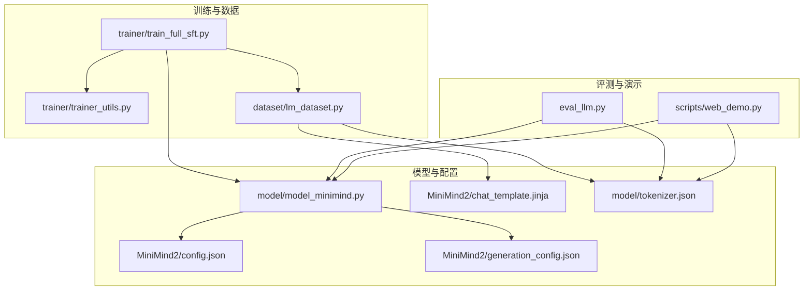
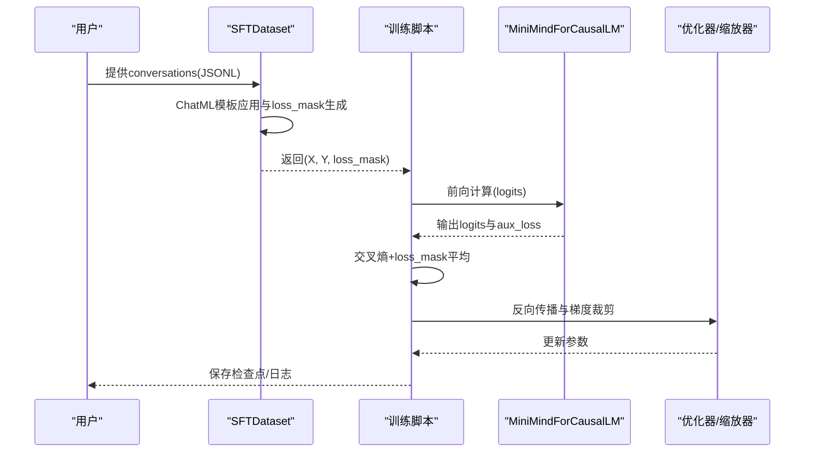
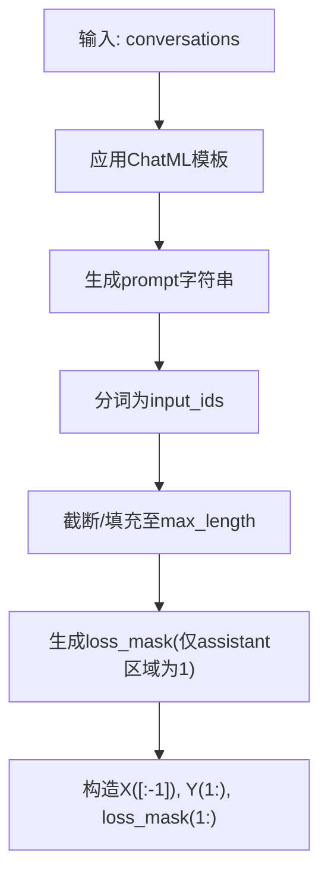
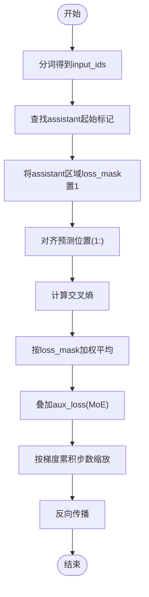
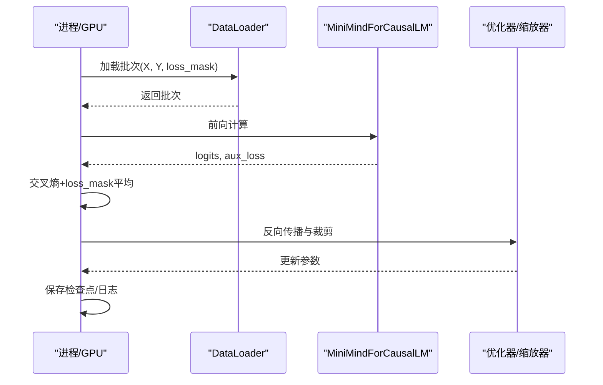
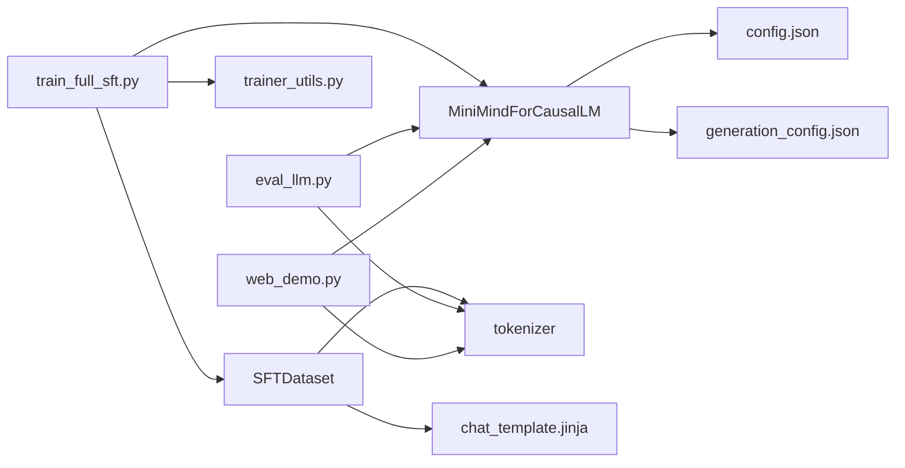

# Phase 5: 监督微调SFT

<cite>
**本文引用的文件列表**
- [docs/05_Phase5_监督微调SFT.md](file://docs/05_Phase5_监督微调SFT.md)
- [trainer/train_full_sft.py](file://trainer/train_full_sft.py)
- [trainer/trainer_utils.py](file://trainer/trainer_utils.py)
- [dataset/lm_dataset.py](file://dataset/lm_dataset.py)
- [model/model_minimind.py](file://model/model_minimind.py)
- [eval_llm.py](file://eval_llm.py)
- [scripts/web_demo.py](file://scripts/web_demo.py)
- [MiniMind2/chat_template.jinja](file://MiniMind2/chat_template.jinja)
- [MiniMind2/config.json](file://MiniMind2/config.json)
- [MiniMind2/generation_config.json](file://MiniMind2/generation_config.json)
- [model/tokenizer.json](file://model/tokenizer.json)
</cite>

## 目录
1. [引言](#引言)
2. [项目结构](#项目结构)
3. [核心组件](#核心组件)
4. [架构总览](#架构总览)
5. [详细组件分析](#详细组件分析)
6. [依赖关系分析](#依赖关系分析)
7. [性能考量](#性能考量)
8. [故障排查指南](#故障排查指南)
9. [结论](#结论)
10. [附录](#附录)

## 引言
本阶段聚焦监督微调（Supervised Fine-Tuning, SFT），目标是让预训练模型掌握对话格式、学会在合适位置停止生成，并遵循指令格式。SFT通过ChatML模板组织对话数据，采用“仅在assistant回复位置计算损失”的损失掩码策略，显著降低过拟合风险并提升对话质量。本文件面向工程实践，系统阐述数据格式规范、模板应用、损失掩码与标签对齐、训练循环与优化策略、评估方法与收敛监控，并提供不同规模数据集的训练策略与过拟合防护建议。

## 项目结构
SFT相关代码与资源分布于以下模块：
- 文档与说明：docs/05_Phase5_监督微调SFT.md
- 训练脚本：trainer/train_full_sft.py
- 训练工具：trainer/trainer_utils.py
- 数据集与损失掩码：dataset/lm_dataset.py
- 模型实现：model/model_minimind.py
- 推理与评测：eval_llm.py
- Web演示：scripts/web_demo.py
- ChatML模板：MiniMind2/chat_template.jinja
- 模型配置：MiniMind2/config.json、MiniMind2/generation_config.json
- 分词器：model/tokenizer.json

图表来源
- [trainer/train_full_sft.py:1-163](file://trainer/train_full_sft.py#L1-L163)
- [trainer/trainer_utils.py:1-139](file://trainer/trainer_utils.py#L1-L139)
- [dataset/lm_dataset.py:1-250](file://dataset/lm_dataset.py#L1-L250)
- [model/model_minimind.py:1-475](file://model/model_minimind.py#L1-L475)
- [eval_llm.py:1-89](file://eval_llm.py#L1-L89)
- [scripts/web_demo.py:1-329](file://scripts/web_demo.py#L1-L329)
- [MiniMind2/chat_template.jinja:1-74](file://MiniMind2/chat_template.jinja#L1-L74)
- [MiniMind2/config.json:1-33](file://MiniMind2/config.json#L1-L33)
- [MiniMind2/generation_config.json:1-10](file://MiniMind2/generation_config.json#L1-L10)
- [model/tokenizer.json:1-200](file://model/tokenizer.json#L1-L200)

章节来源
- [docs/05_Phase5_监督微调SFT.md:1-212](file://docs/05_Phase5_监督微调SFT.md#L1-L212)

## 核心组件
- 训练脚本：负责初始化分布式环境、模型与优化器、数据加载、训练循环、梯度累积与半精度训练、断点续训与日志记录。
- 数据集：SFTDataset将多轮对话转为ChatML格式，动态生成仅在assistant回复位置为1的损失掩码，构造X/Y与loss_mask三元组。
- 模型：MiniMindForCausalLM基于MiniMindModel实现因果语言建模输出，支持MoE专家路由与辅助损失。
- 推理与评测：eval_llm.py提供对话生成接口，支持历史对话拼接与生成参数控制；web_demo.py提供Web交互演示。
- 模板与配置：chat_template.jinja定义ChatML模板；config.json/generation_config.json定义模型与生成参数；tokenizer.json提供分词器字节级BPE模型。

章节来源
- [trainer/train_full_sft.py:23-163](file://trainer/train_full_sft.py#L23-L163)
- [dataset/lm_dataset.py:54-125](file://dataset/lm_dataset.py#L54-L125)
- [model/model_minimind.py:441-475](file://model/model_minimind.py#L441-L475)
- [eval_llm.py:32-89](file://eval_llm.py#L32-L89)
- [scripts/web_demo.py:207-329](file://scripts/web_demo.py#L207-L329)
- [MiniMind2/chat_template.jinja:1-74](file://MiniMind2/chat_template.jinja#L1-L74)
- [MiniMind2/config.json:1-33](file://MiniMind2/config.json#L1-L33)
- [MiniMind2/generation_config.json:1-10](file://MiniMind2/generation_config.json#L1-L10)
- [model/tokenizer.json:1-200](file://model/tokenizer.json#L1-L200)

## 架构总览
SFT训练流水线从数据加载开始，经由ChatML模板与损失掩码处理，进入模型前向与反向传播，最终保存检查点并支持断点续训。推理阶段通过tokenizer.apply_chat_template拼接历史对话，调用model.generate进行流式生成。

图表来源
- [dataset/lm_dataset.py:74-124](file://dataset/lm_dataset.py#L74-L124)
- [trainer/train_full_sft.py:23-80](file://trainer/train_full_sft.py#L23-L80)
- [model/model_minimind.py:441-475](file://model/model_minimind.py#L441-L475)

## 详细组件分析

### 数据格式与ChatML模板
- 数据格式：每个样本包含conversations数组，交替出现user与assistant，支持system角色与工具调用（tool call）。
- ChatML模板：通过tokenizer.apply_chat_template将messages转为字符串，自动插入system、user、assistant标记及工具调用JSON。
- 模板渲染：chat_template.jinja定义了系统提示、多轮对话、工具调用与生成提示位的渲染逻辑，add_generation_prompt控制是否附加assistant起始标记。

图表来源
- [dataset/lm_dataset.py:74-124](file://dataset/lm_dataset.py#L74-L124)
- [MiniMind2/chat_template.jinja:12-74](file://MiniMind2/chat_template.jinja#L12-L74)

章节来源
- [docs/05_Phase5_监督微调SFT.md:56-78](file://docs/05_Phase5_监督微调SFT.md#L56-L78)
- [dataset/lm_dataset.py:74-124](file://dataset/lm_dataset.py#L74-L124)
- [MiniMind2/chat_template.jinja:12-74](file://MiniMind2/chat_template.jinja#L12-L74)

### 损失掩码机制与标签对齐
- 目标：仅在assistant回复位置计算交叉熵损失，避免user/system与padding区域对loss的干扰。
- 实现：遍历input_ids，定位assistant起止位置，将对应位置loss_mask置1；对预测位置Y与loss_mask进行对齐，确保loss仅作用于assistant区域。
- 数学表达：loss = (cross_entropy(logit, label) * loss_mask).sum() / loss_mask.sum()，并叠加aux_loss（MoE）与梯度累积缩放。

图表来源
- [dataset/lm_dataset.py:84-100](file://dataset/lm_dataset.py#L84-L100)
- [trainer/train_full_sft.py:24-44](file://trainer/train_full_sft.py#L24-L44)
- [model/model_minimind.py:432-438](file://model/model_minimind.py#L432-L438)

章节来源
- [docs/05_Phase5_监督微调SFT.md:79-133](file://docs/05_Phase5_监督微调SFT.md#L79-L133)
- [dataset/lm_dataset.py:84-100](file://dataset/lm_dataset.py#L84-L100)
- [trainer/train_full_sft.py:24-44](file://trainer/train_full_sft.py#L24-L44)

### 训练循环与优化策略
- 分布式与混合精度：支持torchrun多卡训练，bfloat16/float16混合精度，GradScaler缩放防止溢出。
- 学习率调度：余弦退火调度，从初始学习率降至1/10，平滑收敛。
- 梯度累积与裁剪：通过accumulation_steps降低显存占用；clip_grad_norm防止梯度爆炸。
- 断点续训：lm_checkpoint保存模型、优化器、缩放器状态与wandb run id，支持GPU数量变化时step转换。

图表来源
- [trainer/train_full_sft.py:23-80](file://trainer/train_full_sft.py#L23-L80)
- [trainer/trainer_utils.py:47-97](file://trainer/trainer_utils.py#L47-L97)

章节来源
- [trainer/train_full_sft.py:82-163](file://trainer/train_full_sft.py#L82-L163)
- [trainer/trainer_utils.py:24-25](file://trainer/trainer_utils.py#L24-L25)
- [trainer/trainer_utils.py:47-97](file://trainer/trainer_utils.py#L47-L97)

### 模型配置与生成参数
- 模型配置：MiniMind2/config.json定义注意力头数、层数、隐藏维、最大位置嵌入、RoPE参数等；generation_config.json控制生成行为。
- 分词器：tokenizer.json提供字节级BPE模型，支持特殊token（BOS/EOS/PAD）与ByteLevel解码。
- ChatML：chat_template.jinja定义模板渲染规则，支持工具调用与生成提示位。

章节来源
- [MiniMind2/config.json:1-33](file://MiniMind2/config.json#L1-L33)
- [MiniMind2/generation_config.json:1-10](file://MiniMind2/generation_config.json#L1-L10)
- [model/tokenizer.json:1-200](file://model/tokenizer.json#L1-L200)
- [MiniMind2/chat_template.jinja:12-74](file://MiniMind2/chat_template.jinja#L12-L74)

### 推理与评测
- eval_llm.py：支持从本地权重或transformers路径加载模型，apply_chat_template拼接历史对话，调用model.generate进行流式生成，支持温度、top_p、最大生成长度等参数。
- web_demo.py：Streamlit前端，支持本地模型与OpenAI兼容API两种来源，提供历史轮数、最大长度、温度等参数调整，流式展示assistant回复。

章节来源
- [eval_llm.py:32-89](file://eval_llm.py#L32-L89)
- [scripts/web_demo.py:207-329](file://scripts/web_demo.py#L207-L329)

## 依赖关系分析
- 训练脚本依赖：SFTDataset（数据）、trainer_utils（分布式/随机种子/断点）、MiniMindForCausalLM（模型）、AutoTokenizer（分词器）。
- 数据集依赖：tokenizer.apply_chat_template（模板）、自定义loss_mask生成逻辑。
- 模型依赖：MiniMindConfig（配置）、RMSNorm/Attention/FeedForward/MoE（组件）。
- 推理依赖：tokenizer与模型权重，支持LoRA权重加载（当使用lora分支）。

图表来源
- [trainer/train_full_sft.py:16-18](file://trainer/train_full_sft.py#L16-L18)
- [dataset/lm_dataset.py:74-82](file://dataset/lm_dataset.py#L74-L82)
- [model/model_minimind.py:441-475](file://model/model_minimind.py#L441-L475)
- [eval_llm.py:6-8](file://eval_llm.py#L6-L8)
- [scripts/web_demo.py:326-328](file://scripts/web_demo.py#L326-L328)

章节来源
- [trainer/train_full_sft.py:16-18](file://trainer/train_full_sft.py#L16-L18)
- [dataset/lm_dataset.py:74-82](file://dataset/lm_dataset.py#L74-L82)
- [model/model_minimind.py:441-475](file://model/model_minimind.py#L441-L475)
- [eval_llm.py:6-8](file://eval_llm.py#L6-L8)
- [scripts/web_demo.py:326-328](file://scripts/web_demo.py#L326-L328)

## 性能考量
- 学习率：SFT学习率远低于预训练（5e-7 vs 5e-4），避免灾难性遗忘。
- 梯度累积：在有限显存下提升有效batch size，建议从1开始逐步增大。
- 混合精度：bfloat16/float16加速训练，配合GradScaler防止溢出。
- 分布式：torchrun多卡训练，DDP包裹模型，忽略RoPE缓存参数以减少同步开销。
- 序列长度：根据数据集与硬件选择max_seq_len，长对话可配合RoPE外推（YaRN）。
- 过拟合防护：较小学习率、早停策略、验证集监控、数据增强（如随机打乱、噪声注入）。

章节来源
- [docs/05_Phase5_监督微调SFT.md:42-52](file://docs/05_Phase5_监督微调SFT.md#L42-L52)
- [trainer/train_full_sft.py:108-151](file://trainer/train_full_sft.py#L108-L151)

## 故障排查指南
- 断点续训失败：检查world_size变化导致的step转换与resume文件完整性。
- 损失异常：确认loss_mask生成逻辑与X/Y对齐，避免padding区域参与损失。
- 分布式报错：核对NCCL后端、CUDA可见设备、LOCAL_RANK设置。
- 内存不足：降低batch size或max_seq_len，启用梯度累积，关闭不必要的日志。
- 生成异常：检查tokenizer.special_tokens_map与eos_token_id，确保生成终止符正确。

章节来源
- [trainer/trainer_utils.py:88-97](file://trainer/trainer_utils.py#L88-L97)
- [dataset/lm_dataset.py:84-100](file://dataset/lm_dataset.py#L84-L100)
- [trainer/train_full_sft.py:108-151](file://trainer/train_full_sft.py#L108-L151)

## 结论
SFT通过ChatML模板与损失掩码机制，使模型在对话场景下实现“仅在assistant回复位置学习”，显著提升对话质量与稳定性。结合分布式训练、混合精度与断点续训，可在不同规模数据集上高效完成监督微调。建议在训练中严格监控loss与生成质量，采用早停与验证集策略防止过拟合，并通过eval_llm与web_demo进行人工与自动化评估。

## 附录
- 数据格式规范：conversations数组，交替出现user/assistant，支持system与工具调用。
- 训练策略：快速训练使用sft_t2t_mini.jsonl，完整训练使用sft_t2t.jsonl；长对话可配合RoPE外推。
- 评测方法：人工评测（对话流畅度、一致性、安全性）与自动化评估（困惑度、BLEU/ROUGE近似指标）。

章节来源
- [docs/05_Phase5_监督微调SFT.md:161-212](file://docs/05_Phase5_监督微调SFT.md#L161-L212)
- [README.md:491-530](file://README.md#L491-L530)