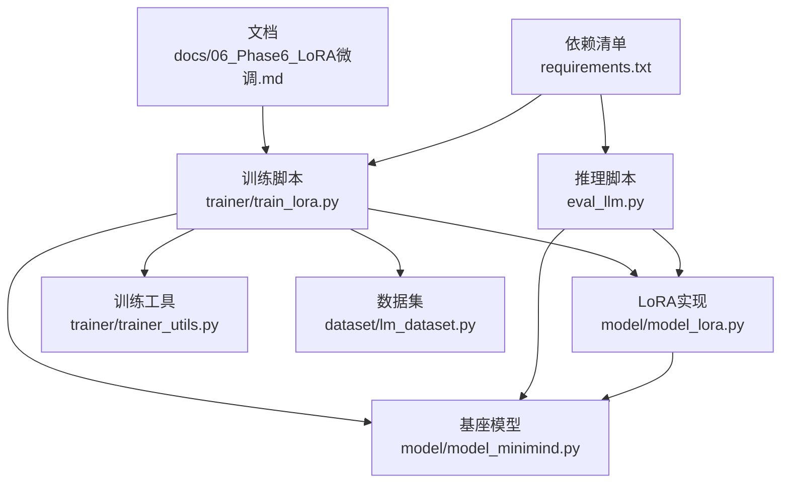
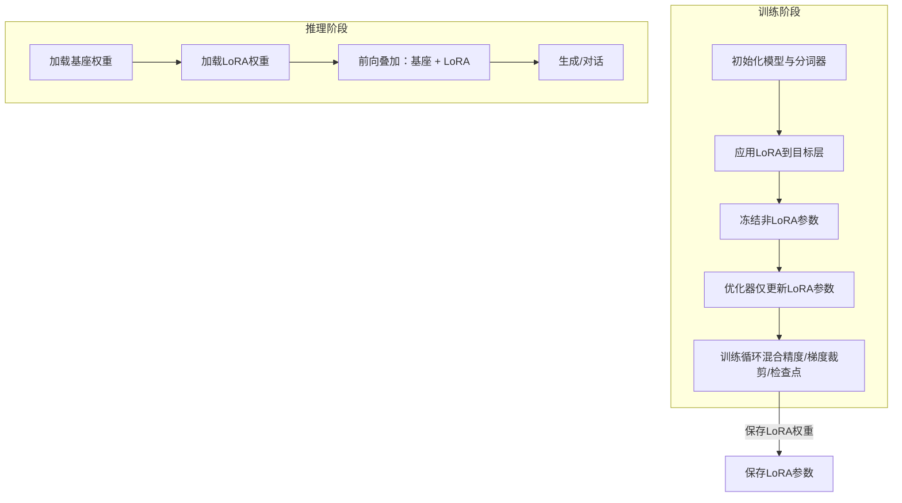
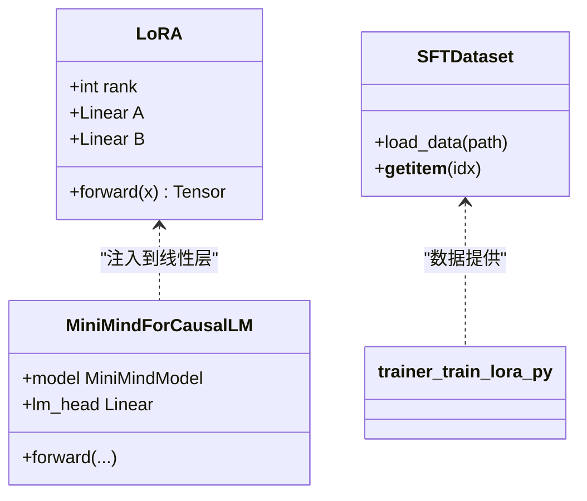
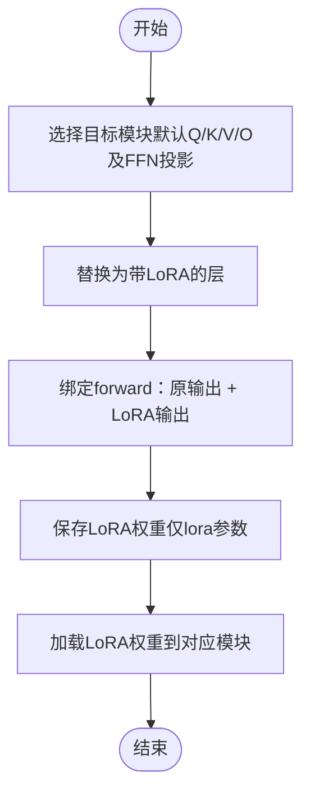
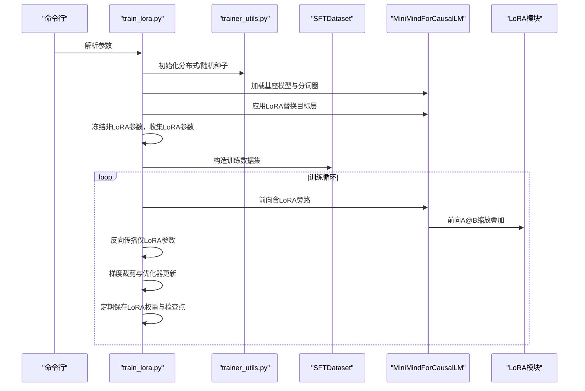
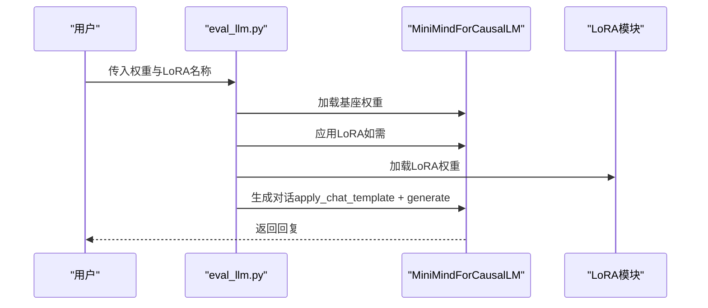
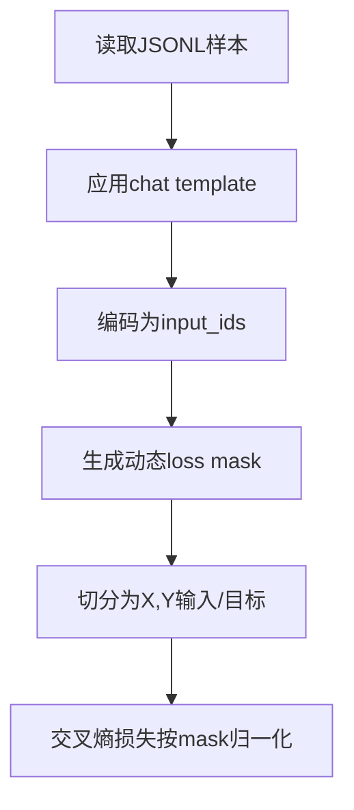
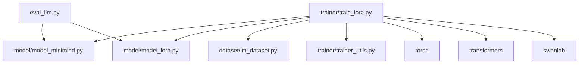

# Phase 6: LoRA微调

<cite>
**本文引用的文件**
- [docs/06_Phase6_LoRA微调.md](file://docs/06_Phase6_LoRA微调.md)
- [model/model_lora.py](file://model/model_lora.py)
- [trainer/train_lora.py](file://trainer/train_lora.py)
- [trainer/trainer_utils.py](file://trainer/trainer_utils.py)
- [model/model_minimind.py](file://model/model_minimind.py)
- [dataset/lm_dataset.py](file://dataset/lm_dataset.py)
- [eval_llm.py](file://eval_llm.py)
- [requirements.txt](file://requirements.txt)
</cite>

## 目录
1. [引言](#引言)
2. [项目结构](#项目结构)
3. [核心组件](#核心组件)
4. [架构总览](#架构总览)
5. [详细组件分析](#详细组件分析)
6. [依赖关系分析](#依赖关系分析)
7. [性能考量](#性能考量)
8. [故障排查指南](#故障排查指南)
9. [结论](#结论)
10. [附录](#附录)

## 引言
本阶段围绕LoRA（低秩适配）参数高效微调展开，系统讲解其理论基础、实现细节与工程化落地。LoRA通过在预训练权重旁引入低秩矩阵分解的可训练旁路，以极少量参数实现领域迁移与风格调整，显著降低显存占用与训练成本，同时保持灾难性遗忘风险较低。本项目提供了从模型定义、LoRA层注入、训练脚本、权重保存加载到推理集成的完整链路。

## 项目结构
- 文档与说明：docs/06_Phase6_LoRA微调.md 提供LoRA概览、实现与实战指导
- 模型与LoRA实现：model/model_lora.py 定义LoRA模块与应用/保存/加载逻辑
- 训练流程：trainer/train_lora.py 实现LoRA训练主循环、参数冻结与优化器配置
- 工具与检查点：trainer/trainer_utils.py 提供分布式初始化、随机种子、检查点与模型加载
- 基座模型：model/model_minimind.py 定义MiniMind架构（注意力、FFN、MoE等），用于LoRA注入
- 数据集：dataset/lm_dataset.py 提供SFT数据集构造与损失掩码
- 推理与评估：eval_llm.py 支持LoRA权重加载与对话推理
- 依赖：requirements.txt 指定torch、transformers、swanlab等关键库版本

图表来源
- [docs/06_Phase6_LoRA微调.md:1-260](file://docs/06_Phase6_LoRA微调.md#L1-L260)
- [model/model_lora.py:1-50](file://model/model_lora.py#L1-L50)
- [trainer/train_lora.py:1-177](file://trainer/train_lora.py#L1-L177)
- [trainer/trainer_utils.py:1-139](file://trainer/trainer_utils.py#L1-L139)
- [model/model_minimind.py:1-475](file://model/model_minimind.py#L1-L475)
- [dataset/lm_dataset.py:1-250](file://dataset/lm_dataset.py#L1-L250)
- [eval_llm.py:1-89](file://eval_llm.py#L1-L89)
- [requirements.txt:1-31](file://requirements.txt#L1-L31)

章节来源
- [docs/06_Phase6_LoRA微调.md:1-260](file://docs/06_Phase6_LoRA微调.md#L1-L260)
- [model/model_lora.py:1-50](file://model/model_lora.py#L1-L50)
- [trainer/train_lora.py:1-177](file://trainer/train_lora.py#L1-L177)
- [trainer/trainer_utils.py:1-139](file://trainer/trainer_utils.py#L1-L139)
- [model/model_minimind.py:1-475](file://model/model_minimind.py#L1-L475)
- [dataset/lm_dataset.py:1-250](file://dataset/lm_dataset.py#L1-L250)
- [eval_llm.py:1-89](file://eval_llm.py#L1-L89)
- [requirements.txt:1-31](file://requirements.txt#L1-L31)

## 核心组件
- LoRA层与注入
  - LoRA模块：通过低秩分解A、B矩阵实现旁路增量更新，支持缩放因子控制
  - 注入策略：遍历模型模块，将目标线性层替换为带LoRA的层，并在前向中叠加LoRA输出
- 训练流程
  - 加载基座模型 → 应用LoRA → 冻结非LoRA参数 → 仅优化LoRA参数 → 训练循环（含混合精度、梯度裁剪、检查点）
- 权重管理
  - 仅保存LoRA参数，便于轻量化部署与多任务切换
  - 推理时按需加载对应LoRA权重
- 数据与推理
  - SFT数据集构造与动态损失掩码
  - 推理脚本支持LoRA权重加载与对话生成

章节来源
- [docs/06_Phase6_LoRA微调.md:42-184](file://docs/06_Phase6_LoRA微调.md#L42-L184)
- [model/model_lora.py:6-50](file://model/model_lora.py#L6-L50)
- [trainer/train_lora.py:126-177](file://trainer/train_lora.py#L126-L177)
- [eval_llm.py:12-31](file://eval_llm.py#L12-L31)

## 架构总览
LoRA微调在基座模型之上叠加“可训练旁路”，训练阶段仅更新旁路参数，推理阶段将旁路与基座相加形成增强模型。训练与推理均通过统一的数据管线与工具链完成。

图表来源
- [trainer/train_lora.py:126-177](file://trainer/train_lora.py#L126-L177)
- [eval_llm.py:24-26](file://eval_llm.py#L24-L26)
- [model/model_lora.py:21-50](file://model/model_lora.py#L21-L50)

## 详细组件分析

### LoRA层与矩阵分解
- 设计要点
  - 低秩矩阵A、B分别控制旁路的通道扩展与投影回原维，缩放因子控制整体增益
  - 初始化策略：A采用高斯初始化，B初始化为零，保证训练初期旁路输出为零，避免破坏基座行为
- 前向传播
  - 输出为原始层输出与LoRA旁路输出之和，缩放因子参与融合
- 适配器模块设计
  - 将LoRA模块嵌入到目标线性层内部，通过覆盖forward实现无缝拼接

图表来源
- [model/model_lora.py:6-18](file://model/model_lora.py#L6-L18)
- [model/model_minimind.py:441-475](file://model/model_minimind.py#L441-L475)
- [dataset/lm_dataset.py:54-124](file://dataset/lm_dataset.py#L54-L124)

章节来源
- [docs/06_Phase6_LoRA微调.md:48-80](file://docs/06_Phase6_LoRA微调.md#L48-L80)
- [model/model_lora.py:6-18](file://model/model_lora.py#L6-L18)

### LoRA应用与权重注入
- 目标模块选择
  - 默认对Q/K/V/O以及门控/上下文投影层应用LoRA，覆盖注意力与FFN子层
- 注入机制
  - 遍历模型模块，匹配目标名称并替换为带LoRA的层；通过闭包绑定保留原始forward并叠加LoRA输出
- 权重保存与加载
  - 仅保存含“lora”关键字的参数，加载时通过名称映射更新对应模块的LoRA子模块

图表来源
- [docs/06_Phase6_LoRA微调.md:83-120](file://docs/06_Phase6_LoRA微调.md#L83-L120)
- [model/model_lora.py:21-50](file://model/model_lora.py#L21-L50)

章节来源
- [docs/06_Phase6_LoRA微调.md:82-120](file://docs/06_Phase6_LoRA微调.md#L82-L120)
- [model/model_lora.py:21-50](file://model/model_lora.py#L21-L50)

### 训练流程与优化策略
- 训练启动与参数
  - 支持分布式训练、混合精度、学习率调度、梯度累积与裁剪
  - 仅对LoRA参数设置requires_grad，其余参数冻结
- 训练循环
  - 前向计算损失（交叉熵+辅助损失），反向传播仅作用于LoRA参数，定期保存LoRA权重与检查点
- 参数统计
  - 训练前后打印总参数量与LoRA参数占比，直观体现参数高效性

图表来源
- [trainer/train_lora.py:77-177](file://trainer/train_lora.py#L77-L177)
- [trainer/trainer_utils.py:100-111](file://trainer/trainer_utils.py#L100-L111)
- [dataset/lm_dataset.py:54-124](file://dataset/lm_dataset.py#L54-L124)
- [model/model_minimind.py:441-475](file://model/model_minimind.py#L441-L475)
- [model/model_lora.py:21-32](file://model/model_lora.py#L21-L32)

章节来源
- [trainer/train_lora.py:24-75](file://trainer/train_lora.py#L24-L75)
- [trainer/train_lora.py:126-177](file://trainer/train_lora.py#L126-L177)
- [trainer/trainer_utils.py:100-111](file://trainer/trainer_utils.py#L100-L111)
- [docs/06_Phase6_LoRA微调.md:122-184](file://docs/06_Phase6_LoRA微调.md#L122-L184)

### 推理与权重加载
- 推理入口
  - 支持从本地权重或transformers路径加载模型
  - 若指定LoRA权重名称，则先应用LoRA再加载对应权重
- 生成流程
  - 构造对话模板，调用generate接口生成回答，支持温度与top-p采样

图表来源
- [eval_llm.py:12-31](file://eval_llm.py#L12-L31)
- [eval_llm.py:72-85](file://eval_llm.py#L72-L85)
- [model/model_lora.py:35-50](file://model/model_lora.py#L35-L50)

章节来源
- [eval_llm.py:12-31](file://eval_llm.py#L12-L31)
- [eval_llm.py:72-85](file://eval_llm.py#L72-L85)

### 数据与损失掩码
- SFT数据集
  - 读取JSONL对话样本，构造chat template字符串
  - 动态生成loss mask，仅对assistant回答部分计算损失，屏蔽pad与system等区域
- 训练损失
  - 交叉熵损失按mask求和并归一化，支持辅助损失（如MoE场景）

图表来源
- [dataset/lm_dataset.py:54-124](file://dataset/lm_dataset.py#L54-L124)

章节来源
- [dataset/lm_dataset.py:54-124](file://dataset/lm_dataset.py#L54-L124)

## 依赖关系分析
- 训练脚本依赖
  - 基座模型与LoRA实现：MiniMindForCausalLM、LoRA模块
  - 数据集：SFTDataset
  - 工具：分布式初始化、随机种子、检查点、模型加载
- 推理脚本依赖
  - 分词器与模型加载
  - LoRA应用与权重加载
- 外部依赖
  - torch、transformers、swanlab等版本要求见requirements.txt

图表来源
- [trainer/train_lora.py:16-19](file://trainer/train_lora.py#L16-L19)
- [trainer/trainer_utils.py:100-111](file://trainer/trainer_utils.py#L100-L111)
- [eval_llm.py:12-30](file://eval_llm.py#L12-L30)
- [requirements.txt:1-31](file://requirements.txt#L1-L31)

章节来源
- [trainer/train_lora.py:16-19](file://trainer/train_lora.py#L16-L19)
- [trainer/trainer_utils.py:100-111](file://trainer/trainer_utils.py#L100-L111)
- [eval_llm.py:12-30](file://eval_llm.py#L12-L30)
- [requirements.txt:1-31](file://requirements.txt#L1-L31)

## 性能考量
- 参数效率
  - LoRA仅训练少量旁路参数，显著降低显存占用与训练时间，适合资源受限场景
- 训练稳定性
  - 初始旁路为零输出，避免灾难性遗忘；学习率可略高于全参微调
- 推理开销
  - 推理时LoRA旁路与基座线性层叠加，额外计算开销较小
- 分布式与混合精度
  - 支持DDP分布式训练与bf16/f16混合精度，提升吞吐与显存效率

章节来源
- [docs/06_Phase6_LoRA微调.md:25-41](file://docs/06_Phase6_LoRA微调.md#L25-L41)
- [trainer/train_lora.py:112-115](file://trainer/train_lora.py#L112-L115)
- [trainer/train_lora.py:161-164](file://trainer/train_lora.py#L161-L164)

## 故障排查指南
- LoRA未生效
  - 确认目标模块名称匹配（默认包含Q/K/V/O与FFN投影），检查是否正确替换为LoRA层
  - 确认训练时仅LoRA参数requires_grad，非LoRA参数已被冻结
- 权重加载失败
  - 检查保存的LoRA权重文件命名与hidden_size是否一致
  - 加载时使用严格模式关闭，允许新增键（LoRA权重）
- 分布式训练异常
  - 确认NCCL后端可用与CUDA可见设备设置
  - 检查world size变化导致的检查点步数转换
- 推理结果异常
  - 确认推理脚本中是否正确应用LoRA并加载对应权重
  - 检查对话模板与特殊token处理

章节来源
- [model/model_lora.py:21-50](file://model/model_lora.py#L21-L50)
- [trainer/train_lora.py:137-144](file://trainer/train_lora.py#L137-L144)
- [trainer/trainer_utils.py:88-97](file://trainer/trainer_utils.py#L88-L97)
- [eval_llm.py:24-26](file://eval_llm.py#L24-L26)

## 结论
本阶段完整实现了LoRA参数高效微调：从理论到实现，从训练到推理，覆盖了权重初始化、矩阵分解、梯度更新与内存优化的关键环节。通过仅训练少量旁路参数，LoRA在保持通用模型能力的同时，实现了低成本、可切换的垂直领域迁移与风格调整。结合项目的分布式训练与混合精度方案，可在有限资源下高效完成LoRA微调与部署。

## 附录
- 常用命令
  - 训练：进入trainer目录执行训练脚本，指定LoRA名称与数据路径
  - 推理：指定基座权重与LoRA权重名称进行对话生成
- 最佳实践
  - 合理设置rank与alpha，平衡表达能力与稳定性
  - 使用动态损失掩码聚焦训练目标，提升收敛质量
  - 定期保存LoRA权重，便于多任务切换与快速回滚

章节来源
- [docs/06_Phase6_LoRA微调.md:126-143](file://docs/06_Phase6_LoRA微调.md#L126-L143)
- [docs/06_Phase6_LoRA微调.md:196-206](file://docs/06_Phase6_LoRA微调.md#L196-L206)
- [docs/06_Phase6_LoRA微调.md:231-248](file://docs/06_Phase6_LoRA微调.md#L231-L248)