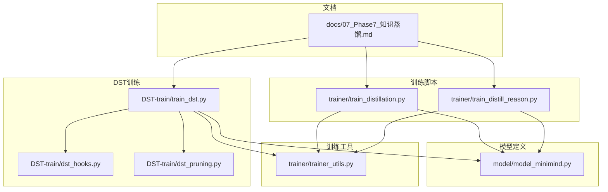
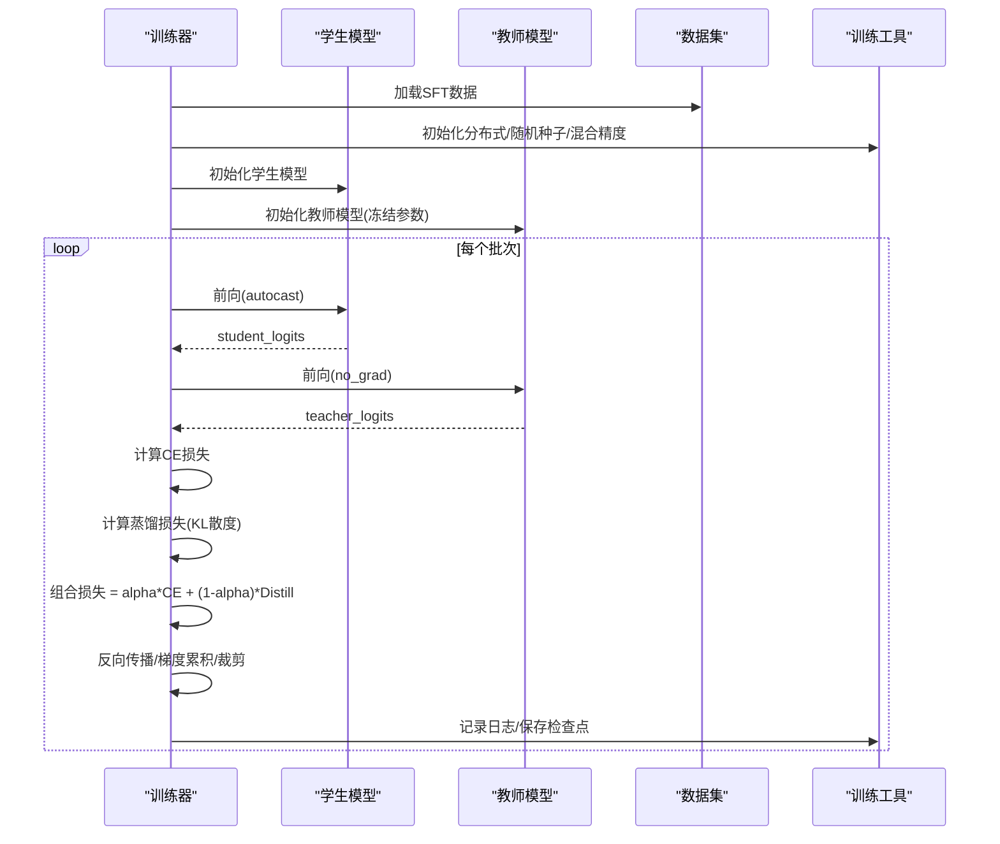
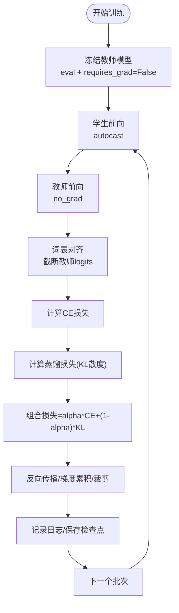
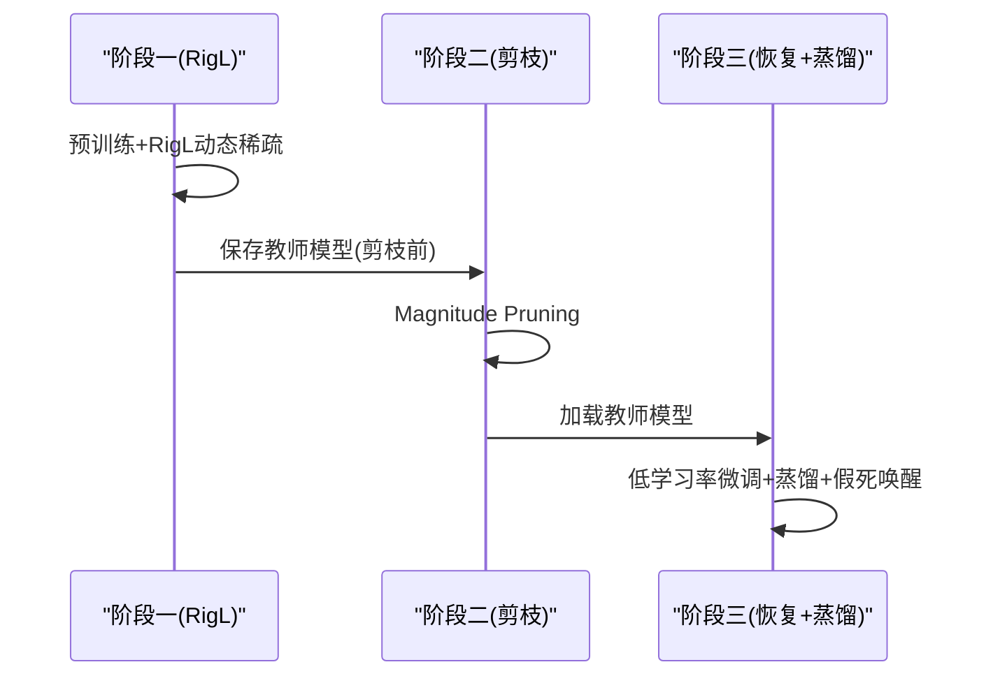
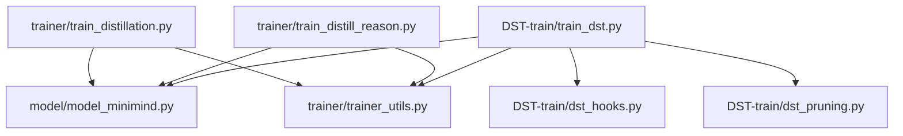

# Phase 7: 知识蒸馏

<cite>
**本文引用的文件**
- [docs/07_Phase7_知识蒸馏.md](file://docs/07_Phase7_知识蒸馏.md)
- [trainer/train_distillation.py](file://trainer/train_distillation.py)
- [trainer/train_distill_reason.py](file://trainer/train_distill_reason.py)
- [DST-train/train_dst.py](file://DST-train/train_dst.py)
- [DST-train/dst_hooks.py](file://DST-train/dst_hooks.py)
- [DST-train/dst_pruning.py](file://DST-train/dst_pruning.py)
- [model/model_minimind.py](file://model/model_minimind.py)
- [trainer/trainer_utils.py](file://trainer/trainer_utils.py)
</cite>

## 目录
1. [简介](#简介)
2. [项目结构](#项目结构)
3. [核心组件](#核心组件)
4. [架构总览](#架构总览)
5. [详细组件分析](#详细组件分析)
6. [依赖分析](#依赖分析)
7. [性能考量](#性能考量)
8. [故障排查指南](#故障排查指南)
9. [结论](#结论)
10. [附录](#附录)

## 简介
本阶段围绕MiniMind项目的“知识蒸馏”展开，系统讲解白盒蒸馏的理论基础、KL散度损失计算与软标签学习机制；深入分析教师-学生模型架构设计、温度参数调节、特征对齐策略与损失函数组合；给出不同蒸馏场景的应用策略、模型压缩效果评估与性能保持方法；提供完整的蒸馏实现分析，包括教师模型配置、学生模型初始化、训练流程控制与参数共享机制；并覆盖蒸馏过程的监控指标、收敛判断标准与调试技巧，以及不同规模模型的蒸馏策略、推理速度提升与内存占用优化。

## 项目结构
本阶段涉及的代码主要分布在以下模块：
- 文档：知识蒸馏的背景、原理与实践要点
- 训练脚本：白盒蒸馏与推理蒸馏的训练实现
- DST动态稀疏训练：融合RigL、剪枝与蒸馏的三阶段流程
- 模型定义：MiniMind配置与模型结构
- 训练工具：分布式、日志、检查点、学习率调度等

图表来源
- [docs/07_Phase7_知识蒸馏.md:1-220](file://docs/07_Phase7_知识蒸馏.md#L1-L220)
- [trainer/train_distillation.py:1-224](file://trainer/train_distillation.py#L1-L224)
- [trainer/train_distill_reason.py:1-175](file://trainer/train_distill_reason.py#L1-L175)
- [DST-train/train_dst.py:1-472](file://DST-train/train_dst.py#L1-L472)
- [DST-train/dst_hooks.py:1-263](file://DST-train/dst_hooks.py#L1-L263)
- [DST-train/dst_pruning.py:1-291](file://DST-train/dst_pruning.py#L1-L291)
- [model/model_minimind.py:1-475](file://model/model_minimind.py#L1-L475)
- [trainer/trainer_utils.py:1-139](file://trainer/trainer_utils.py#L1-L139)

章节来源
- [docs/07_Phase7_知识蒸馏.md:1-220](file://docs/07_Phase7_知识蒸馏.md#L1-L220)

## 核心组件
- KL散度蒸馏损失：在学生与教师logits之间计算KL散度，并通过温度参数软化分布，最后进行温度平方补偿。
- 组合损失：将交叉熵损失与蒸馏损失按权重alpha组合，平衡硬标签与软标签学习。
- 教师-学生模型：支持不同隐藏维度与层数的配置，教师模型在蒸馏期间冻结参数。
- 温度参数：控制软化程度，过大导致信息丢失，过小接近硬标签。
- 特征对齐：当词表大小不一致时，截断教师logits以匹配学生词表。
- 训练流程：混合精度、梯度累积、梯度裁剪、学习率调度、分布式训练与检查点管理。

章节来源
- [trainer/train_distillation.py:24-35](file://trainer/train_distillation.py#L24-L35)
- [trainer/train_distillation.py:38-130](file://trainer/train_distillation.py#L38-L130)
- [model/model_minimind.py:8-78](file://model/model_minimind.py#L8-L78)
- [trainer/trainer_utils.py:24-26](file://trainer/trainer_utils.py#L24-L26)

## 架构总览
下图展示白盒蒸馏与DST蒸馏的整体流程与关键模块交互。

图表来源
- [trainer/train_distillation.py:38-130](file://trainer/train_distillation.py#L38-L130)
- [trainer/trainer_utils.py:19-26](file://trainer/trainer_utils.py#L19-L26)
- [trainer/trainer_utils.py:47-97](file://trainer/trainer_utils.py#L47-L97)

## 详细组件分析

### 白盒蒸馏实现（trainer/train_distillation.py）
- 蒸馏损失函数：在autograd上下文中，教师logits先按温度软化并detach，学生logits同样软化后计算KL散度，并乘以温度平方补偿。
- 训练流程：教师模型在蒸馏期间eval且requires_grad=False；学生模型前向得到logits；计算CE损失与蒸馏损失；按alpha组合并反向传播。
- 损失掩码：仅对有效token计算蒸馏损失，保证对齐。
- 混合精度与分布式：支持bfloat16/float16、DDP、梯度累积、梯度裁剪、学习率余弦退火。
- 检查点：保存半精度权重与训练状态，支持续训。

图表来源
- [trainer/train_distillation.py:38-130](file://trainer/train_distillation.py#L38-L130)

章节来源
- [trainer/train_distillation.py:24-35](file://trainer/train_distillation.py#L24-L35)
- [trainer/train_distillation.py:38-130](file://trainer/train_distillation.py#L38-L130)
- [trainer/train_distillation.py:132-224](file://trainer/train_distillation.py#L132-L224)

### 推理蒸馏（trainer/train_distill_reason.py）
- 该脚本专注于“推理思考”标签的特殊加权，对思考/回答起止标记位置提高损失权重，以强化推理过程的建模。
- 采用标准交叉熵损失，但通过掩码对特定token位置施加重权，适合推理链路的蒸馏场景。

章节来源
- [trainer/train_distill_reason.py:23-92](file://trainer/train_distill_reason.py#L23-L92)
- [trainer/train_distill_reason.py:94-175](file://trainer/train_distill_reason.py#L94-L175)

### DST动态稀疏训练中的蒸馏（DST-train/train_dst.py）
- 三阶段流程：阶段一学习与成长（含RigL动态稀疏）、阶段二压缩与巩固（剪枝）、阶段三恢复与再成长（微调+蒸馏+假死神经元唤醒）。
- 阶段三：使用剪枝前的模型作为教师，与学生模型共同训练，蒸馏损失与CE损失组合，学习率较低，掩码固定。
- 词表对齐：与白盒蒸馏一致，截断教师logits以匹配学生词表。
- 诊断与恢复：MBE监控与假死神经元检测，定期唤醒假死神经元，提升恢复效果。

图表来源
- [DST-train/train_dst.py:74-139](file://DST-train/train_dst.py#L74-L139)
- [DST-train/train_dst.py:143-168](file://DST-train/train_dst.py#L143-L168)
- [DST-train/train_dst.py:174-264](file://DST-train/train_dst.py#L174-L264)

章节来源
- [DST-train/train_dst.py:62-68](file://DST-train/train_dst.py#L62-L68)
- [DST-train/train_dst.py:174-264](file://DST-train/train_dst.py#L174-L264)

### DST诊断与恢复（DST-train/dst_hooks.py）
- MBE监控：通过权重矩阵SVD计算矩阵基熵(MBE)，判断模型是否学习饱和，连续低于阈值则判定饱和。
- 假死神经元检测：检测权重行全零的神经元，按比例唤醒，避免训练停滞。
- 报告输出：提供每层MBE与稀疏度、假死神经元统计，便于诊断与优化。

章节来源
- [DST-train/dst_hooks.py:10-160](file://DST-train/dst_hooks.py#L10-L160)
- [DST-train/dst_hooks.py:162-263](file://DST-train/dst_hooks.py#L162-L263)

### 剪枝与RigL（DST-train/dst_pruning.py）
- MagnitudePruner：按权重绝对值大小进行剪枝，支持报告各层稀疏度与整体稀疏度。
- RigLScheduler：周期性在活跃连接中剪枝最小权重，在非活跃连接中选择梯度绝对值最大者生长，实现动态稀疏训练。

章节来源
- [DST-train/dst_pruning.py:9-118](file://DST-train/dst_pruning.py#L9-L118)
- [DST-train/dst_pruning.py:120-291](file://DST-train/dst_pruning.py#L120-L291)

### 模型架构与配置（model/model_minimind.py）
- MiniMindConfig：定义隐藏维度、层数、注意力头数、RoPE缩放、MoE开关等超参。
- MiniMindForCausalLM：基于MiniMindModel的因果语言模型，输出logits与辅助损失（MoE时）。
- 注意力与FFN：支持Flash Attention与RoPE旋转位置编码，支持MoE专家路由与共享专家。

章节来源
- [model/model_minimind.py:8-78](file://model/model_minimind.py#L8-L78)
- [model/model_minimind.py:441-475](file://model/model_minimind.py#L441-L475)

### 训练工具（trainer/trainer_utils.py）
- 分布式初始化与主进程判定
- 学习率余弦退火
- 检查点保存与续训
- 模型初始化与权重加载
- 跳过批次采样器（续训跳步）

章节来源
- [trainer/trainer_utils.py:15-139](file://trainer/trainer_utils.py#L15-L139)

## 依赖分析
- 训练脚本依赖模型配置与工具函数，实现统一的蒸馏损失、混合精度与分布式训练。
- DST训练在RigL基础上引入剪枝与蒸馏，形成“学习—压缩—恢复”的闭环。
- 诊断模块独立于训练流程，提供MBE与假死神经元检测，辅助恢复阶段的稳定性。

图表来源
- [trainer/train_distillation.py:1-224](file://trainer/train_distillation.py#L1-L224)
- [trainer/train_distill_reason.py:1-175](file://trainer/train_distill_reason.py#L1-L175)
- [DST-train/train_dst.py:1-472](file://DST-train/train_dst.py#L1-L472)
- [DST-train/dst_hooks.py:1-263](file://DST-train/dst_hooks.py#L1-L263)
- [DST-train/dst_pruning.py:1-291](file://DST-train/dst_pruning.py#L1-L291)
- [model/model_minimind.py:1-475](file://model/model_minimind.py#L1-L475)
- [trainer/trainer_utils.py:1-139](file://trainer/trainer_utils.py#L1-L139)

## 性能考量
- 温度参数：建议在1.0~2.0范围内，过大导致信息丢失，过小接近硬标签。
- 组合权重alpha：平衡CE与蒸馏贡献，通常0.3~0.7较为稳健。
- 混合精度：bfloat16/float16可显著降低显存占用并提升吞吐。
- 梯度累积与裁剪：在显存受限时提升batch有效容量，防止梯度爆炸。
- 分布式训练：DDP可扩展到多卡，注意忽略某些缓冲区以减少通信开销。
- MoE：在教师模型中启用MoE时，蒸馏损失需考虑aux_loss叠加。
- 推理加速：蒸馏后模型参数更少，推理速度提升；结合剪枝可进一步降低延迟与内存占用。

## 故障排查指南
- 教师/学生词表不一致：确保截断教师logits以匹配学生词表大小。
- 梯度爆炸或NaN：启用梯度裁剪，检查学习率与alpha设置。
- 显存不足：降低batch size、使用混合精度、开启梯度累积、关闭不必要的日志与wandb。
- 收敛缓慢：适当提高温度、增大蒸馏权重、检查学习率调度与warmup。
- 检查点不生效：确认DDP世界大小变化时step转换逻辑，确保resume文件存在。
- DST阶段二剪枝过度：降低剪枝比例或调整RigL参数，避免信息丢失过多。

章节来源
- [trainer/train_distillation.py:62-63](file://trainer/train_distillation.py#L62-L63)
- [trainer/trainer_utils.py:47-97](file://trainer/trainer_utils.py#L47-L97)
- [DST-train/train_dst.py:157-168](file://DST-train/train_dst.py#L157-L168)
- [DST-train/dst_hooks.py:10-160](file://DST-train/dst_hooks.py#L10-L160)

## 结论
MiniMind在Phase 7实现了白盒蒸馏与DST三阶段流程，结合KL散度损失、温度调节与特征对齐策略，有效提升了学生模型的泛化能力与推理质量。通过MoE、混合精度、分布式与RigL动态稀疏，项目在模型压缩与性能保持方面取得良好平衡。建议在实践中根据任务特性调整温度与alpha，并结合DST诊断模块持续优化蒸馏效果。

## 附录
- 实践建议
  - 白盒蒸馏：先用较小温度与适中alpha进行预热，再逐步提高蒸馏权重。
  - DST蒸馏：在阶段三使用较低学习率，配合蒸馏与假死神经元唤醒。
  - 评估指标：关注验证集困惑度、下游评测分数、推理耗时与显存占用。
  - 调试技巧：利用日志与检查点快速定位问题，必要时回退到纯CE基线。