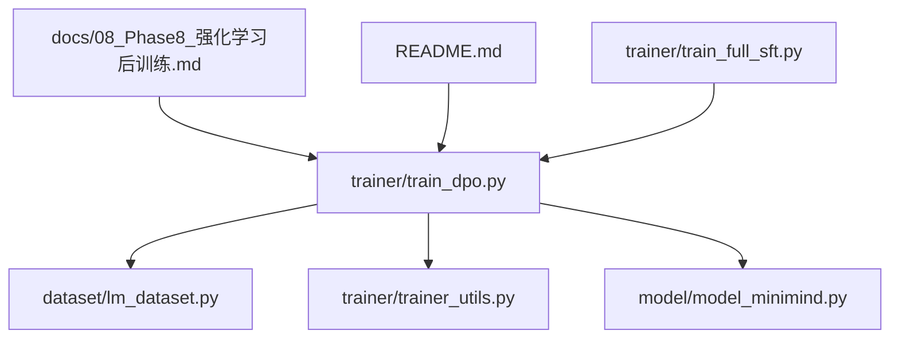
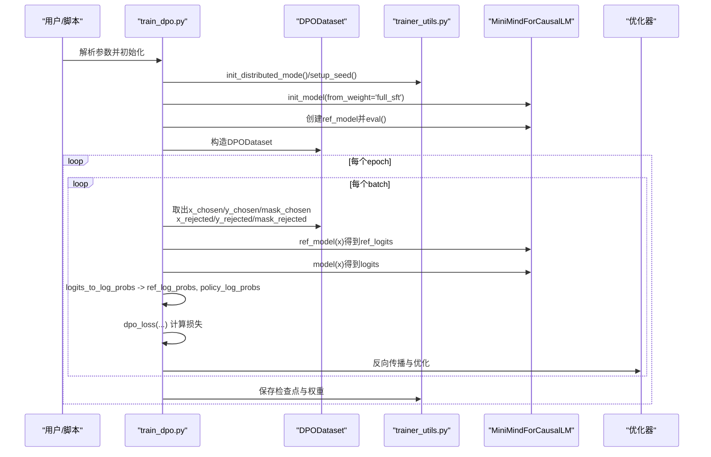
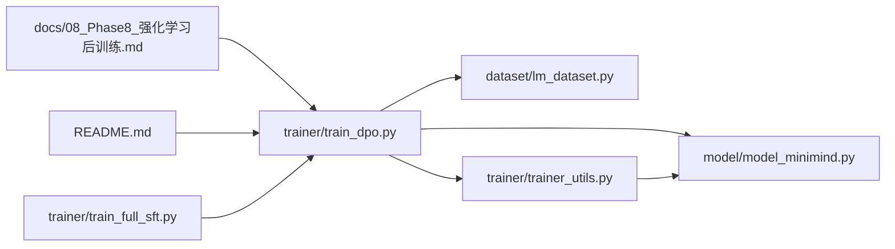

# DPO 直接偏好优化

<cite>
**本文引用的文件列表**
- [train_dpo.py](file://trainer/train_dpo.py)
- [trainer_utils.py](file://trainer/trainer_utils.py)
- [lm_dataset.py](file://dataset/lm_dataset.py)
- [model_minimind.py](file://model/model_minimind.py)
- [08_Phase8_强化学习后训练.md](file://docs/08_Phase8_强化学习后训练.md)
- [README.md](file://README.md)
- [train_full_sft.py](file://trainer/train_full_sft.py)
</cite>

## 目录
1. [简介](#简介)
2. [项目结构](#项目结构)
3. [核心组件](#核心组件)
4. [架构总览](#架构总览)
5. [详细组件分析](#详细组件分析)
6. [依赖关系分析](#依赖关系分析)
7. [性能考量](#性能考量)
8. [故障排查指南](#故障排查指南)
9. [结论](#结论)
10. [附录](#附录)

## 简介
本文件面向MiniMind项目的DPO（直接偏好优化）训练实现，系统性讲解DPO的理论基础、从PPO的KL约束目标推导出的解析训练目标，以及在本仓库中的完整代码实现与使用方式。重点覆盖以下内容：
- DPO损失函数的数学原理与推导思路
- off-policy、仅需Actor+Ref两模型、无需奖励模型的实现优势
- 代码实现要点：log_prob归一化、chosen/rejected数据分离、概率比计算、损失函数实现
- 训练参数配置：β参数、学习率、基于SFT权重的初始化
- 适用场景、性能特点与最佳实践
- 完整训练启动命令与参数说明

## 项目结构
围绕DPO训练的关键文件组织如下：
- 训练入口与逻辑：trainer/train_dpo.py
- 训练工具与分布式支持：trainer/trainer_utils.py
- 数据集封装：dataset/lm_dataset.py（DPODataset）
- 模型定义：model/model_minimind.py（MiniMindForCausalLM）
- 文档与公式来源：docs/08_Phase8_强化学习后训练.md、README.md
- SFT训练参考：trainer/train_full_sft.py

图表来源
- [train_dpo.py:1-208](file://trainer/train_dpo.py#L1-L208)
- [lm_dataset.py:127-182](file://dataset/lm_dataset.py#L127-L182)
- [trainer_utils.py:100-111](file://trainer/trainer_utils.py#L100-L111)
- [model_minimind.py:443-477](file://model/model_minimind.py#L443-L477)

章节来源
- [train_dpo.py:119-208](file://trainer/train_dpo.py#L119-L208)
- [lm_dataset.py:127-182](file://dataset/lm_dataset.py#L127-L182)
- [trainer_utils.py:100-111](file://trainer/trainer_utils.py#L100-L111)
- [model_minimind.py:443-477](file://model/model_minimind.py#L443-L477)

## 核心组件
- DPO训练主流程：读取DPO数据、前向计算策略与参考模型log_probs、按序列长度归一化、分离chosen/rejected、计算DPO损失、反向与优化器更新
- 数据集封装：DPODataset将每条样本的“被选中回答”与“被拒绝回答”分别编码，并生成对应的输入、标签与损失掩码
- 模型与工具：MiniMindForCausalLM提供CausalLM输出；trainer_utils提供分布式初始化、学习率调度、检查点管理、模型加载等通用能力

章节来源
- [train_dpo.py:24-51](file://trainer/train_dpo.py#L24-L51)
- [train_dpo.py:54-117](file://trainer/train_dpo.py#L54-L117)
- [lm_dataset.py:127-182](file://dataset/lm_dataset.py#L127-L182)
- [trainer_utils.py:100-111](file://trainer/trainer_utils.py#L100-L111)

## 架构总览
DPO训练采用off-policy范式，使用静态偏好数据集，仅需Actor（策略模型）与Ref（参考模型）两个模型，无需显式训练奖励或价值模型。训练流程如下：

图表来源
- [train_dpo.py:119-208](file://trainer/train_dpo.py#L119-L208)
- [lm_dataset.py:127-182](file://dataset/lm_dataset.py#L127-L182)
- [trainer_utils.py:100-111](file://trainer/trainer_utils.py#L100-L111)
- [model_minimind.py:443-477](file://model/model_minimind.py#L443-L477)

## 详细组件分析

### 数学原理与损失函数
- DPO从PPO的KL约束目标出发，推导出对偏好对的解析训练目标，直接最大化“chosen优于rejected”的对数几率，无需显式奖励/价值模型。
- 损失函数的核心思想：
  - 对于每条偏好对，分别计算策略模型与参考模型在chosen与rejected上的对数概率
  - 将序列长度归一化后的log_probs相减，得到策略项与参考项的概率比
  - 两者之差即为logits，再乘以β并经logsigmoid激活，最后取负号作为损失
- 优势特性：
  - Off-Policy：静态偏好数据集可反复训练
  - 仅需Actor+Ref两模型，显存占用低
  - 无需训练Reward Model，收敛稳定、实现简单

章节来源
- [README.md:1035-1054](file://README.md#L1035-L1054)
- [08_Phase8_强化学习后训练.md:40-87](file://docs/08_Phase8_强化学习后训练.md#L40-L87)

### 代码实现要点
- log_prob归一化
  - 使用掩码对序列进行求和并按有效长度归一化，避免填充token影响
- chosen与rejected分离
  - 将batch按顺序切分为前半部分（chosen）与后半部分（rejected），分别计算策略与参考模型的log_probs
- 概率比计算与损失
  - 策略项：chosen_policy_log_probs - reject_policy_log_probs
  - 参考项：chosen_ref_log_probs - reject_ref_log_probs
  - logits = 策略项 - 参考项
  - loss = -logsigmoid(β * logits)，取均值

章节来源
- [train_dpo.py:24-51](file://trainer/train_dpo.py#L24-L51)

### 训练流程与数据处理
- 数据集封装
  - DPODataset读取每条样本的chosen与rejected对话，应用chat模板编码，生成输入、标签与损失掩码
  - 掩码用于区分“需要参与损失计算”的token（例如assistant回复区域）
- 训练循环
  - 将chosen与rejected拼接成同一batch，同时前向参考模型与策略模型
  - 使用autocast与GradScaler进行混合精度训练
  - 梯度累积、梯度裁剪、学习率余弦衰减
  - 定期保存权重与检查点

章节来源
- [lm_dataset.py:127-182](file://dataset/lm_dataset.py#L127-L182)
- [train_dpo.py:54-117](file://trainer/train_dpo.py#L54-L117)

### 模型与初始化
- 模型：MiniMindForCausalLM，提供forward返回logits与past_key_values等
- 初始化：通过trainer_utils.init_model从指定权重（如full_sft）加载，作为策略模型与参考模型的起点
- 参考模型：冻结参数、关闭梯度，仅用于提供稳定的参考分布

章节来源
- [model_minimind.py:443-477](file://model/model_minimind.py#L443-L477)
- [trainer_utils.py:100-111](file://trainer/trainer_utils.py#L100-L111)
- [train_dpo.py:169-176](file://trainer/train_dpo.py#L169-L176)

### 训练参数与最佳实践
- 关键参数
  - --beta：控制偏离参考模型的程度，通常较小（如0.1）
  - --learning_rate：建议较小（如4e-8），避免遗忘
  - --from_weight：基于SFT权重初始化，确保策略模型具备良好基础
  - --accumulation_steps：梯度累积步数，平衡显存与稳定性
  - --grad_clip：梯度裁剪阈值，防止爆炸
  - --dtype：混合精度类型（bfloat16/float16）
- 最佳实践
  - 使用off-policy数据集，可多次epoch重复训练
  - 参考模型固定，避免过拟合
  - 学习率与β需结合数据质量与模型规模谨慎调整
  - 使用混合精度与梯度累积以提升吞吐与显存利用率

章节来源
- [train_dpo.py:119-143](file://trainer/train_dpo.py#L119-L143)
- [train_dpo.py:169-181](file://trainer/train_dpo.py#L169-L181)
- [08_Phase8_强化学习后训练.md:89-93](file://docs/08_Phase8_强化学习后训练.md#L89-L93)

### 训练启动命令与参数说明
- 启动方式
  - 单机单卡：python trainer/train_dpo.py
  - 多机多卡：torchrun --nproc_per_node N trainer/train_dpo.py
- 常用参数
  - --data_path：DPO训练数据路径（默认../dataset/dpo.jsonl）
  - --from_weight：基于SFT权重初始化（默认full_sft）
  - --beta：DPO中的β参数（默认0.1）
  - --learning_rate：学习率（默认4e-8）
  - --epochs/batch_size/accumulation_steps/grad_clip：常规训练超参
  - --dtype：混合精度类型（默认bfloat16）
  - --use_wandb：是否记录实验（默认不启用）

章节来源
- [README.md:1047-1054](file://README.md#L1047-L1054)
- [train_dpo.py:119-143](file://trainer/train_dpo.py#L119-L143)

## 依赖关系分析
DPO训练模块的依赖关系如下：

图表来源
- [train_dpo.py:17-19](file://trainer/train_dpo.py#L17-L19)
- [lm_dataset.py:17-18](file://dataset/lm_dataset.py#L17-L18)
- [trainer_utils.py:12](file://trainer/trainer_utils.py#L12)
- [model_minimind.py:8](file://model/model_minimind.py#L8)

章节来源
- [train_dpo.py:17-19](file://trainer/train_dpo.py#L17-L19)
- [lm_dataset.py:17-18](file://dataset/lm_dataset.py#L17-L18)
- [trainer_utils.py:12](file://trainer/trainer_utils.py#L12)
- [model_minimind.py:8](file://model/model_minimind.py#L8)

## 性能考量
- Off-Policy与静态数据：可重复训练，适合大规模数据集与多轮训练
- 仅需Actor+Ref两模型：显存占用低，适合中小规模模型
- 混合精度与梯度累积：在保证数值稳定的同时提升吞吐
- 学习率与β：过大的学习率或β可能导致策略漂移或不稳定
- 掩码与序列长度归一化：避免填充token干扰，提高训练稳定性

## 故障排查指南
- 训练不收敛或发散
  - 检查学习率是否过大（建议≤4e-8）
  - 检查β是否过大（建议0.05~0.2之间尝试）
  - 确认参考模型是否正确冻结（requires_grad=False）
- 显存不足
  - 降低batch_size或增大accumulation_steps
  - 切换dtype为bfloat16以节省显存
- 数据格式错误
  - 确认DPO数据集中每条样本包含chosen与rejected字段
  - 确认掩码生成逻辑与tokenizer的特殊token一致
- 分布式训练异常
  - 检查NCCL环境变量与GPU可见性
  - 确保world_size与本地GPU数量匹配

章节来源
- [train_dpo.py:169-176](file://trainer/train_dpo.py#L169-L176)
- [lm_dataset.py:127-182](file://dataset/lm_dataset.py#L127-L182)
- [trainer_utils.py:28-35](file://trainer/trainer_utils.py#L28-L35)

## 结论
DPO在MiniMind项目中提供了简洁而高效的偏好对齐方案：通过off-policy、仅需Actor+Ref两模型、无需奖励模型的实现，显著降低了训练复杂度与资源消耗。配合合理的β与学习率设置、混合精度与梯度累积策略，可在保持稳定性的前提下高效完成偏好优化任务。建议在实际使用中结合数据质量与模型规模，逐步调试超参以获得最佳效果。

## 附录
- 参考文档与公式来源
  - [08_Phase8_强化学习后训练.md](file://docs/08_Phase8_强化学习后训练.md)
  - [README.md](file://README.md)
- 相关训练脚本
  - [train_full_sft.py](file://trainer/train_full_sft.py)