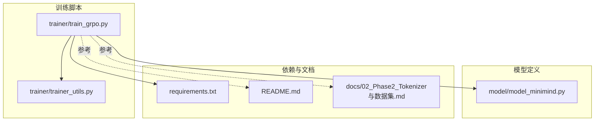
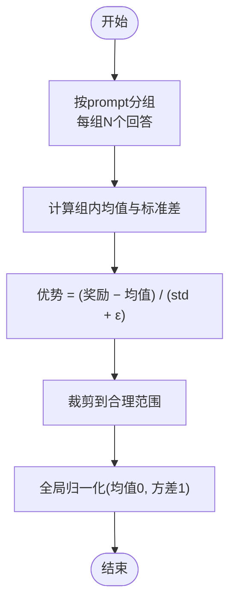
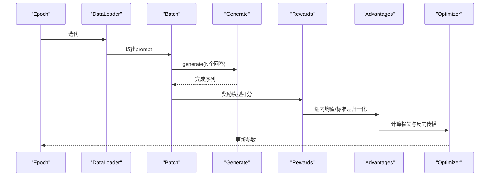
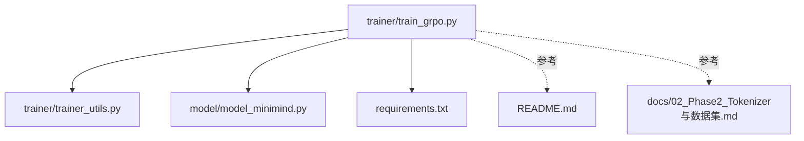

# GRPO 分组相对策略优化

<cite>
**本文引用的文件列表**
- [train_grpo.py](file://trainer/train_grpo.py)
- [trainer_utils.py](file://trainer/trainer_utils.py)
- [model_minimind.py](file://model/model_minimind.py)
- [requirements.txt](file://requirements.txt)
- [README.md](file://README.md)
- [docs/02_Phase2_Tokenizer与数据集.md](file://docs/02_Phase2_Tokenizer与数据集.md)
</cite>

## 目录
1. [引言](#引言)
2. [项目结构](#项目结构)
3. [核心组件](#核心组件)
4. [架构总览](#架构总览)
5. [详细组件分析](#详细组件分析)
6. [依赖关系分析](#依赖关系分析)
7. [性能考量](#性能考量)
8. [故障排除指南](#故障排除指南)
9. [结论](#结论)
10. [附录](#附录)

## 引言
本文件面向MiniMind项目中的GRPO（Group Relative Policy Optimization，分组相对策略优化）算法，系统化阐述其核心创新“分组相对价值估计”的理论基础与工程实现。GRPO通过在每个prompt生成N个回答，并以组内平均奖励作为baseline，从而消除对Critic网络的需求，实现On-Policy特性与更高的收敛上限。本文将深入解析GRPO的训练流程、优势与局限、参数配置与实践建议，并提供可视化图示帮助理解。

## 项目结构
本次文档聚焦于GRPO训练脚本、训练工具函数、模型定义与依赖项，以及数据集说明与项目README中的对比信息。



图表来源
- [train_grpo.py:1-292](file://trainer/train_grpo.py#L1-L292)
- [trainer_utils.py:1-139](file://trainer/trainer_utils.py#L1-L139)
- [model_minimind.py:1-477](file://model/model_minimind.py#L1-L477)
- [requirements.txt:1-31](file://requirements.txt#L1-L31)
- [README.md:1374-1395](file://README.md#L1374-L1395)
- [docs/02_Phase2_Tokenizer与数据集.md:206-369](file://docs/02_Phase2_Tokenizer与数据集.md#L206-L369)

章节来源
- [train_grpo.py:1-292](file://trainer/train_grpo.py#L1-L292)
- [trainer_utils.py:1-139](file://trainer/trainer_utils.py#L1-L139)
- [model_minimind.py:1-477](file://model/model_minimind.py#L1-L477)
- [requirements.txt:1-31](file://requirements.txt#L1-L31)
- [README.md:1374-1395](file://README.md#L1374-L1395)
- [docs/02_Phase2_Tokenizer与数据集.md:206-369](file://docs/02_Phase2_Tokenizer与数据集.md#L206-L369)

## 核心组件
- GRPO训练主流程与策略优化
  - prompt批处理与生成N个回答
  - 奖励模型打分与格式化奖励
  - 组内均值与标准差归一化作为优势估计
  - KL正则与策略梯度损失
  - 梯度累积、学习率调度与检查点保存
- 训练工具函数
  - 分布式初始化、随机种子设置、日志输出
  - 模型加载、检查点持久化与续训
  - 自定义SkipBatchSampler跳过已训练step
- 模型与配置
  - MiniMindConfig与MiniMindForCausalLM
  - 支持MoE开关与RoPE扩展配置
- 数据与依赖
  - RLAIF数据集格式与提示词结构
  - 训练所需第三方库版本

章节来源
- [train_grpo.py:95-186](file://trainer/train_grpo.py#L95-L186)
- [trainer_utils.py:15-139](file://trainer/trainer_utils.py#L15-L139)
- [model_minimind.py:8-78](file://model/model_minimind.py#L8-L78)
- [docs/02_Phase2_Tokenizer与数据集.md:206-369](file://docs/02_Phase2_Tokenizer与数据集.md#L206-L369)
- [requirements.txt:1-31](file://requirements.txt#L1-L31)

## 架构总览
GRPO的训练流程围绕“rollout-比较-优化”展开：每个prompt生成N个回答，用奖励模型打分，组内统计均值与标准差形成优势估计，再基于策略梯度与KL正则进行优化。

```mermaid
sequenceDiagram
participant DS as "数据集(RLAIF)"
participant TR as "GRPO训练器(train_grpo.py)"
participant GEN as "策略模型(Generate)"
participant RM as "奖励模型"
participant OPT as "优化器/调度器"
DS->>TR : 批量prompt
TR->>GEN : generate(max_new_tokens, do_sample, num_return_sequences=N)
GEN-->>TR : [B*N, R] 完成序列
TR->>RM : get_score(prompt+assistant)
RM-->>TR : 奖励分数
TR->>TR : 组内均值/标准差归一化
TR->>OPT : 反向传播与参数更新
OPT-->>TR : 梯度裁剪/学习率衰减
```

图表来源
- [train_grpo.py:95-186](file://trainer/train_grpo.py#L95-L186)

## 详细组件分析

### 1) 分组相对价值估计与优势计算
- 组内均值baseline：将每个prompt生成的N个回答视为一组，组内奖励均值作为该组的baseline，用于衡量单个回答的优劣。
- 组内归一化优势：使用组内均值与标准差对奖励进行归一化，得到优势值，并进一步对优势进行全局归一化，降低方差。
- 优势公式要点
  - 组内均值与标准差重复到每个样本，形成[B*N]形状的baseline与std。
  - 优势 = clamp((奖励 − 均值) / (std + ε), [−10, 10])，随后再做均值为0、标准差为1的全局归一化。
- 优势估计的动机
  - 通过组内比较消除绝对尺度差异，使学习信号更稳定。
  - 不依赖外部Critic网络，简化训练流程。



图表来源
- [train_grpo.py:129-133](file://trainer/train_grpo.py#L129-L133)

章节来源
- [train_grpo.py:129-133](file://trainer/train_grpo.py#L129-L133)

### 2) 奖励模型与格式化奖励
- 奖励模型打分：对每个prompt+assistant组合调用奖励模型的get_score接口，限制在[-scale, scale]范围内。
- 推理模型分支：当启用推理模式时，提取answer标签内的内容再次打分，并按加权融合得到最终奖励。
- 格式化奖励：对不符合格式的响应给予额外奖励，鼓励符合期望格式的输出。

章节来源
- [train_grpo.py:27-92](file://trainer/train_grpo.py#L27-L92)

### 3) 策略梯度与KL正则
- 对数似然与优势：使用当前策略对完成序列的逐token对数概率乘以优势，形成策略梯度项。
- KL正则：使用参考模型与当前策略的逐token KL散度，作为正则项抑制策略漂移。
- 损失函数：逐token损失为负的比例项减去β倍KL正则，按完成掩码求平均，再取批次均值。

章节来源
- [train_grpo.py:113-143](file://trainer/train_grpo.py#L113-L143)

### 4) 训练流程与控制流
- 每个epoch按数据加载器迭代，对每个batch：
  - 使用策略模型生成N个回答
  - 计算奖励与优势
  - 计算逐token损失并反向传播
  - 梯度累积、裁剪与优化器步进
  - 日志记录与检查点保存
- 分布式训练：支持DDP，本地rank设置与参数忽略列表配置。



图表来源
- [train_grpo.py:95-186](file://trainer/train_grpo.py#L95-L186)

章节来源
- [train_grpo.py:95-186](file://trainer/train_grpo.py#L95-L186)

### 5) 参数与配置
- 关键超参
  - num_generations：每个prompt生成的样本数（默认8）
  - beta：KL正则系数（默认0.02）
  - learning_rate：初始学习率（默认8e-8）
  - accumulation_steps：梯度累积步数（默认1）
  - grad_clip：梯度裁剪阈值（默认1.0）
  - max_seq_len、max_gen_len：输入与生成长度限制
  - reasoning：是否启用推理模式（默认1）
  - reward_model_path：奖励模型路径
- 训练脚本参数入口与默认值详见命令行解析部分。

章节来源
- [train_grpo.py:189-216](file://trainer/train_grpo.py#L189-L216)

### 6) 模型与配置
- MiniMindConfig：包含隐藏维度、层数、注意力头数、MoE开关、RoPE缩放等配置。
- MiniMindForCausalLM：基于MiniMindModel的因果语言模型，支持logits切片与past_key_values缓存。

章节来源
- [model_minimind.py:8-78](file://model/model_minimind.py#L8-L78)
- [model_minimind.py:443-477](file://model/model_minimind.py#L443-L477)

### 7) 数据与环境
- RLAIF数据集：返回prompt文本，训练时在循环内进行tokenizer编码。
- 依赖库：PyTorch、Transformers、SwanLab/W&B、PEFT等。

章节来源
- [docs/02_Phase2_Tokenizer与数据集.md:206-369](file://docs/02_Phase2_Tokenizer与数据集.md#L206-L369)
- [requirements.txt:1-31](file://requirements.txt#L1-L31)

## 依赖关系分析
- 训练脚本依赖
  - 训练工具模块：分布式初始化、随机种子、日志、模型加载、检查点
  - 模型模块：MiniMindForCausalLM与配置
  - 数据模块：RLAIFDataset
  - 第三方库：Transformers、AutoModel、CosineAnnealingLR、SwanLab/W&B
- 依赖关系图



图表来源
- [train_grpo.py:1-24](file://trainer/train_grpo.py#L1-L24)
- [trainer_utils.py:1-22](file://trainer/trainer_utils.py#L1-L22)
- [model_minimind.py:1-22](file://model/model_minimind.py#L1-L22)
- [requirements.txt:1-31](file://requirements.txt#L1-L31)
- [README.md:1374-1395](file://README.md#L1374-L1395)
- [docs/02_Phase2_Tokenizer与数据集.md:206-369](file://docs/02_Phase2_Tokenizer与数据集.md#L206-L369)

章节来源
- [train_grpo.py:1-24](file://trainer/train_grpo.py#L1-L24)
- [trainer_utils.py:1-22](file://trainer/trainer_utils.py#L1-L22)
- [model_minimind.py:1-22](file://model/model_minimind.py#L1-L22)
- [requirements.txt:1-31](file://requirements.txt#L1-L31)
- [README.md:1374-1395](file://README.md#L1374-L1395)
- [docs/02_Phase2_Tokenizer与数据集.md:206-369](file://docs/02_Phase2_Tokenizer与数据集.md#L206-L369)

## 性能考量
- 计算开销
  - 每个prompt生成N个回答，显存与计算时间随N线性增长。
  - 组内均值/标准差与优势归一化为轻量算子，可并行化。
- 内存管理
  - 每步结束后释放中间张量并触发垃圾回收，减少峰值显存占用。
- 学习率与稳定性
  - 使用余弦退火调度，结合梯度裁剪，提升训练稳定性。
- 分布式训练
  - DDP模式下按rank设置设备，忽略特定缓冲区参与同步，减少通信开销。

章节来源
- [train_grpo.py:146-186](file://trainer/train_grpo.py#L146-L186)
- [trainer_utils.py:28-35](file://trainer/trainer_utils.py#L28-L35)

## 故障排除指南
- 无法找到奖励模型路径
  - 确认reward_model_path指向正确目录，且支持trust_remote_code。
- 训练不稳定或loss爆炸
  - 适当降低学习率、增大β、启用梯度裁剪、减少num_generations。
- 显存不足
  - 降低batch_size、num_generations或max_gen_len；关闭MoE；使用bfloat16/float16混合精度。
- 分布式训练异常
  - 检查NCCL环境变量与GPU可见性；确保各进程端口可用。
- 检查点恢复问题
  - 确认world_size变化时step会自动转换；检查resume文件完整性。

章节来源
- [train_grpo.py:251-255](file://trainer/train_grpo.py#L251-L255)
- [trainer_utils.py:47-97](file://trainer/trainer_utils.py#L47-L97)

## 结论
GRPO通过“分组相对价值估计”实现了无需Critic的On-Policy策略优化，利用组内均值与标准差构造稳定的相对优势，结合KL正则与逐token策略梯度，获得更高的收敛上限与更好的稳定性。实践中需关注num_generations与β的平衡、奖励模型质量与格式化奖励的设计，以及分布式与内存管理的配置。

## 附录

### A. GRPO与PPO/CISPO/SPO的对比要点
- PPO：需要Critic网络估计V(s)，使用优势估计与裁剪目标，训练更复杂但泛化能力强。
- CISPO：基于基线的自适应优势估计，引入动态基线跟踪。
- GRPO：完全省去Critic，以组内均值作为baseline，实现On-Policy且更简洁的训练流程。

章节来源
- [README.md:1374-1395](file://README.md#L1374-L1395)

### B. 适用场景与使用注意事项
- 适用场景
  - 需要快速实现、资源受限的强化学习场景
  - 奖励模型稳定、格式化奖励可设计良好的任务
- 注意事项
  - num_generations过大可能导致显存与时间压力
  - β过小易导致策略漂移，过大则抑制探索
  - 推理模式下的answer标签提取需保证格式一致性

章节来源
- [train_grpo.py:189-216](file://trainer/train_grpo.py#L189-L216)
- [train_grpo.py:78-85](file://trainer/train_grpo.py#L78-L85)