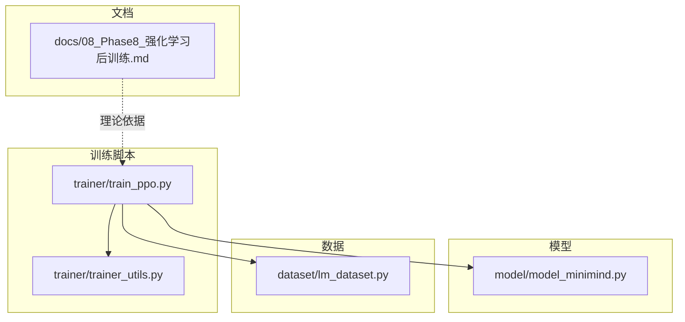
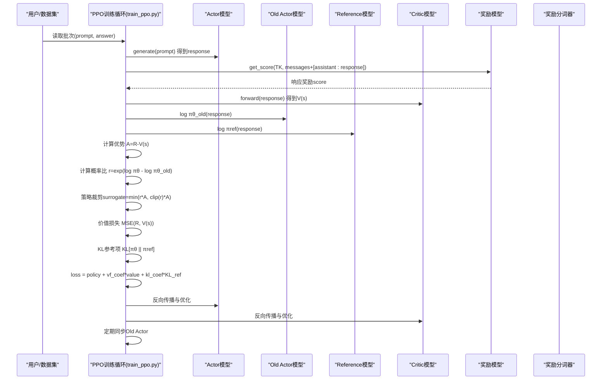
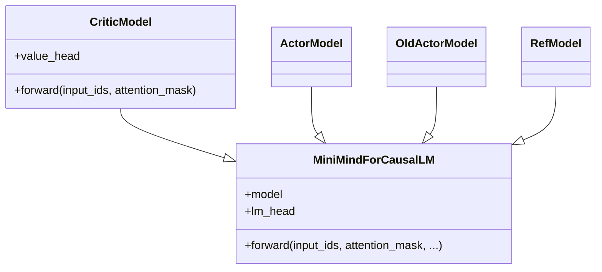
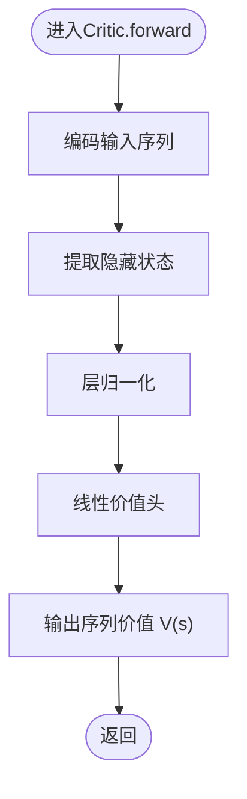
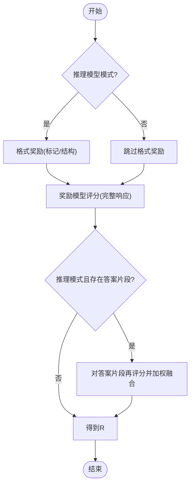
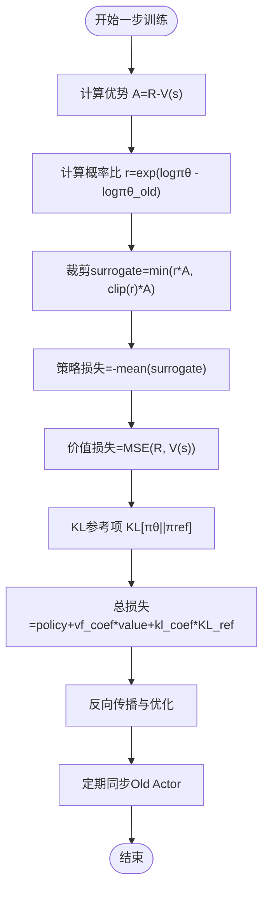
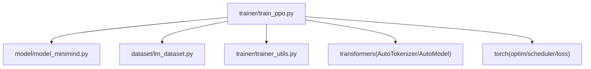

# PPO 近端策略优化

<cite>
**本文引用的文件列表**
- [train_ppo.py](file://trainer/train_ppo.py)
- [trainer_utils.py](file://trainer/trainer_utils.py)
- [model_minimind.py](file://model/model_minimind.py)
- [lm_dataset.py](file://dataset/lm_dataset.py)
- [08_Phase8_强化学习后训练.md](file://docs/08_Phase8_强化学习后训练.md)
</cite>

## 目录
1. [引言](#引言)
2. [项目结构](#项目结构)
3. [核心组件](#核心组件)
4. [架构总览](#架构总览)
5. [详细组件分析](#详细组件分析)
6. [依赖关系分析](#依赖关系分析)
7. [性能考量](#性能考量)
8. [故障排查指南](#故障排查指南)
9. [结论](#结论)
10. [附录](#附录)

## 引言
本文件面向MiniMind项目中的PPO（近端策略优化）实现，系统梳理其理论基础、代码实现、训练流程与工程实践。重点覆盖：
- PPO三大核心组件：策略项（裁剪概率比）、优势项（Critic价值估计）、正则项（KL散度约束）
- Actor+Critic+Ref+Old Actor四模型架构与Critic价值头实现
- 奖励计算机制（格式奖励与奖励模型评分的组合策略）
- 关键实现细节：优势计算、裁剪操作、KL散度计算、策略更新
- 训练流程、参数配置、显存优化与收敛监控
- 奖励模型准备与集成（InternLM2-1.8B-Reward）
- 最佳实践与调试技巧

## 项目结构
与PPO训练直接相关的模块与文件如下：
- 训练入口与核心逻辑：trainer/train_ppo.py
- 工具函数与分布式/检查点：trainer/trainer_utils.py
- 模型基类与架构：model/model_minimind.py
- 数据集适配：dataset/lm_dataset.py
- 文档与理论说明：docs/08_Phase8_强化学习后训练.md

图表来源
- [train_ppo.py:1-362](file://trainer/train_ppo.py#L1-L362)
- [trainer_utils.py:1-139](file://trainer/trainer_utils.py#L1-L139)
- [model_minimind.py:1-477](file://model/model_minimind.py#L1-L477)
- [lm_dataset.py:1-250](file://dataset/lm_dataset.py#L1-L250)
- [08_Phase8_强化学习后训练.md:1-315](file://docs/08_Phase8_强化学习后训练.md#L1-L315)

章节来源
- [train_ppo.py:1-362](file://trainer/train_ppo.py#L1-L362)
- [trainer_utils.py:1-139](file://trainer/trainer_utils.py#L1-L139)
- [model_minimind.py:1-477](file://model/model_minimind.py#L1-L477)
- [lm_dataset.py:1-250](file://dataset/lm_dataset.py#L1-L250)
- [08_Phase8_强化学习后训练.md:1-315](file://docs/08_Phase8_强化学习后训练.md#L1-L315)

## 核心组件
- Actor模型：当前策略网络，负责生成响应并计算新策略对数似然
- Old Actor模型：上一轮策略快照，用于计算概率比 r_t = πθ_old / πθ_old
- Reference模型：参考策略（通常为SFT模型），用于KL参考项 KL[πθ || πref]
- Critic模型：价值网络，输出序列每个位置的价值估计 V(s)，用于优势估计 A = R - V(s)
- 奖励模型：外部奖励模型（如InternLM2-1.8B-Reward），对完整响应或答案片段打分

章节来源
- [train_ppo.py:28-42](file://trainer/train_ppo.py#L28-L42)
- [train_ppo.py:119-235](file://trainer/train_ppo.py#L119-L235)
- [08_Phase8_强化学习后训练.md:94-130](file://docs/08_Phase8_强化学习后训练.md#L94-L130)

## 架构总览
PPO采用“在线策略”范式，每步从当前Actor生成响应，结合奖励模型评分与Critic价值估计，计算优势并进行裁剪策略梯度更新，同时对策略与参考模型之间的KL进行约束。

图表来源
- [train_ppo.py:119-235](file://trainer/train_ppo.py#L119-L235)

## 详细组件分析

### Actor + Old Actor + Reference + Critic 四模型架构
- Actor模型：MiniMindForCausalLM的策略网络，输出logits并计算当前策略对数似然
- Old Actor模型：冻结参数，用于计算概率比 r_t = exp(log πθ - log πθ_old)
- Reference模型：冻结参数，用于KL参考项 KL[πθ || πref]
- Critic模型：在MiniMind基础上替换语言模型头部为线性价值头，输出序列价值估计 V(s)

图表来源
- [model_minimind.py:443-477](file://model/model_minimind.py#L443-L477)
- [train_ppo.py:28-42](file://trainer/train_ppo.py#L28-L42)

章节来源
- [model_minimind.py:443-477](file://model/model_minimind.py#L443-L477)
- [train_ppo.py:28-42](file://trainer/train_ppo.py#L28-L42)

### Critic价值头与价值函数估计
- CriticModel在MiniMindForCausalLM基础上新增线性价值头，将最后一层归一化隐藏状态映射为标量价值
- 价值估计用于优势计算：A = R - V(s)，其中R为奖励模型评分（可选答案片段加权）

图表来源
- [train_ppo.py:28-42](file://trainer/train_ppo.py#L28-L42)

章节来源
- [train_ppo.py:28-42](file://trainer/train_ppo.py#L28-L42)

### 奖励计算机制（格式奖励 + 奖励模型评分）
- 格式奖励：针对推理模型格式（如特定标记与结构）给予正向奖励，缓解奖励稀疏
- 奖励模型评分：对完整响应或答案片段进行评分，支持裁剪到[-scale, scale]范围
- 组合策略：格式奖励与模型评分相加，形成最终奖励向量R

图表来源
- [train_ppo.py:44-116](file://trainer/train_ppo.py#L44-L116)

章节来源
- [train_ppo.py:44-116](file://trainer/train_ppo.py#L44-L116)
- [08_Phase8_强化学习后训练.md:132-154](file://docs/08_Phase8_强化学习后训练.md#L132-L154)

### 优势计算、裁剪与KL散度
- 优势：A = R - V(s)，其中V(s)来自Critic
- 概率比：r_t = exp(log πθ - log πθ_old)
- 策略项裁剪：min(r*A, clip(r)*A)，clip(r)在区间[1-ε, 1+ε]
- 价值损失：MSE(R, V(s))
- KL参考项：KL[πθ || πref]，用于正则约束策略漂移
- 总损失：policy_loss + vf_coef*value_loss + kl_coef*KL_ref

图表来源
- [train_ppo.py:154-171](file://trainer/train_ppo.py#L154-L171)

章节来源
- [train_ppo.py:154-171](file://trainer/train_ppo.py#L154-L171)

### 训练流程与参数配置
- 初始化：分布式、随机种子、混合精度、W&B/SwanLab日志
- 模型初始化：Actor、Old Actor、Reference、Critic（从SFT权重加载）
- 数据：RLAIFDataset，按max_seq_len+max_gen_len拼接prompt与生成序列
- 优化器与调度器：AdamW + CosineAnnealingLR
- 训练循环：每步生成响应、计算奖励、优势、裁剪策略更新、价值更新、同步Old Actor、周期性保存

章节来源
- [train_ppo.py:237-362](file://trainer/train_ppo.py#L237-L362)
- [lm_dataset.py:203-245](file://dataset/lm_dataset.py#L203-L245)

### 显存优化与收敛监控
- 梯度裁剪：对Actor与Critic参数分别裁剪
- 混合精度：bfloat16或float16，配合autocast
- DDP：对Actor与Critic启用DDP并忽略旋转位置编码缓存
- 内存回收：每步后清理CUDA缓存
- 日志：Actor Loss、Critic Loss、Reward、KL、KL_ref、平均响应长度、学习率

章节来源
- [train_ppo.py:173-182](file://trainer/train_ppo.py#L173-L182)
- [train_ppo.py:280-282](file://trainer/train_ppo.py#L280-L282)
- [train_ppo.py:340-346](file://trainer/train_ppo.py#L340-L346)
- [train_ppo.py:184-215](file://trainer/train_ppo.py#L184-L215)

### 奖励模型准备与使用
- 下载：InternLM2-1.8B-Reward（ModelScope或HuggingFace）
- 集成：加载AutoModel与AutoTokenizer，使用get_score接口对消息列表评分
- 注意：缩放至[-scale, scale]，推理模式下可对答案片段再评分并加权融合

章节来源
- [08_Phase8_强化学习后训练.md:249-270](file://docs/08_Phase8_强化学习后训练.md#L249-L270)
- [train_ppo.py:311-316](file://trainer/train_ppo.py#L311-L316)
- [train_ppo.py:88-116](file://trainer/train_ppo.py#L88-L116)

## 依赖关系分析
- train_ppo.py依赖：
  - model_minimind.py：MiniMindForCausalLM、MiniMindConfig
  - dataset.lm_dataset.RLAIFDataset：RLAIF数据加载
  - trainer_utils：分布式、检查点、日志、模型初始化工具
  - transformers：AutoTokenizer、AutoModel
  - torch：优化器、调度器、损失函数、梯度裁剪
- 训练脚本内部模块耦合：
  - Actor/Critic/Ref/Old Actor四模型并行训练，通过共享的tokenizer与奖励模型交互
  - 价值估计与策略更新在同一循环中完成，保证On-Policy一致性

图表来源
- [train_ppo.py:1-30](file://trainer/train_ppo.py#L1-L30)

章节来源
- [train_ppo.py:1-30](file://trainer/train_ppo.py#L1-L30)

## 性能考量
- 显存占用：约单网络方法的1.5–2倍（Actor+Critic双网络）
- 收敛特性：较慢但理论稳健，适合追求高质量策略的场景
- 奖励稀疏：MiniMind小模型在通用任务上易出现奖励稀疏，建议：
  - 引入格式奖励与标记奖励
  - 监控奖励方差，必要时调整任务难度或奖励机制
- 训练稳定性：
  - 合理设置clip_epsilon、vf_coef、kl_coef
  - 使用CosineAnnealingLR与梯度裁剪
  - 定期同步Old Actor，避免策略漂移过大

[本节为通用指导，不直接分析具体文件]

## 故障排查指南
- 生成长度异常或未截断：
  - 检查tokenizer.padding_side设置与attention_mask构造
  - 确认eos判断与响应长度统计逻辑
- 奖励为常数或接近0：
  - 检查奖励模型评分是否正确传入消息列表
  - 确认格式奖励与标记奖励是否生效
- 显存溢出：
  - 降低batch_size或max_seq_len+max_gen_len
  - 启用混合精度与梯度裁剪
  - 检查DDP参数忽略列表与缓存清理
- 收敛停滞：
  - 调整学习率、clip_epsilon、vf_coef、kl_coef
  - 检查Old Actor同步频率与KL参考项权重

章节来源
- [train_ppo.py:125-144](file://trainer/train_ppo.py#L125-L144)
- [train_ppo.py:173-182](file://trainer/train_ppo.py#L173-L182)
- [train_ppo.py:217-221](file://trainer/train_ppo.py#L217-L221)

## 结论
MiniMind的PPO实现遵循经典PO框架，通过Actor+Critic+Ref+Old Actor四模型协同，结合奖励模型评分与格式奖励，实现了对策略的稳定优化。实践中需重视On-Policy采样、裁剪机制与KL约束，合理配置超参数与显存优化策略，以获得稳健的收敛与高质量策略。

[本节为总结性内容，不直接分析具体文件]

## 附录

### 参数配置速查
- 学习率与优化器：Actor与Critic分别配置AdamW与CosineAnnealingLR
- 裁剪与正则：clip_epsilon、vf_coef、kl_coef
- 采样与长度：max_seq_len、max_gen_len、accumulation_steps
- 检查点与日志：save_interval、log_interval、W&B/Swanlab
- 模型与数据：from_weight、data_path、reward_model_path

章节来源
- [train_ppo.py:237-267](file://trainer/train_ppo.py#L237-L267)
- [train_ppo.py:318-326](file://trainer/train_ppo.py#L318-L326)