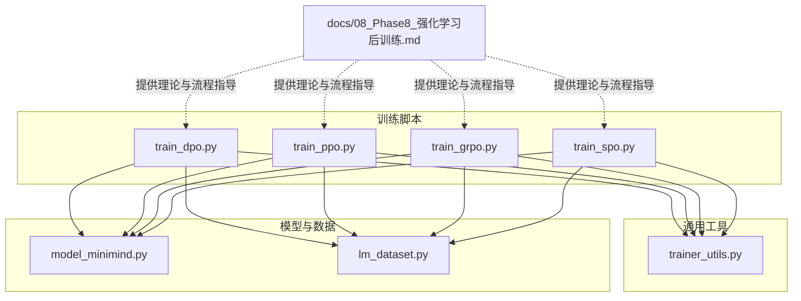
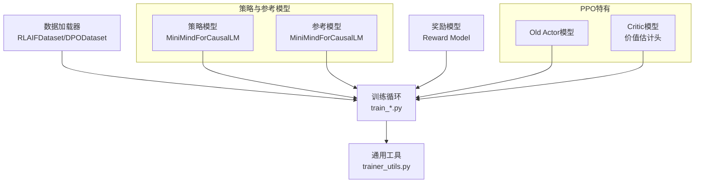
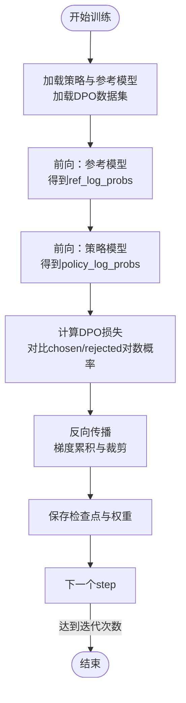
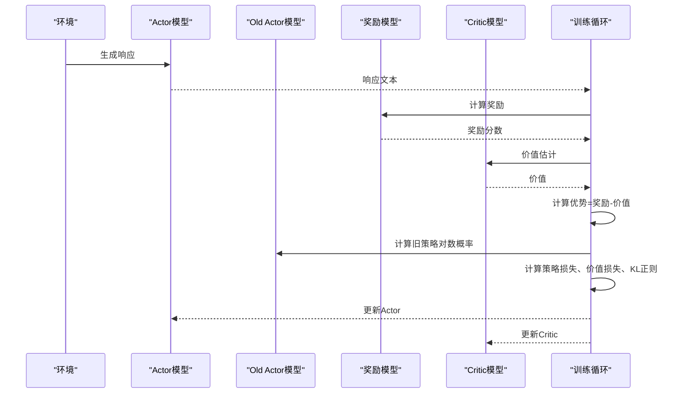
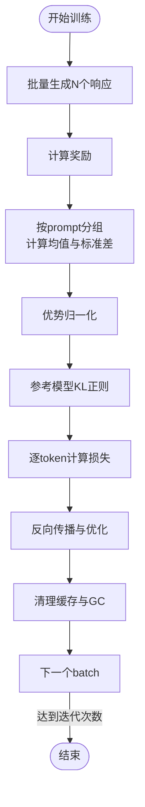
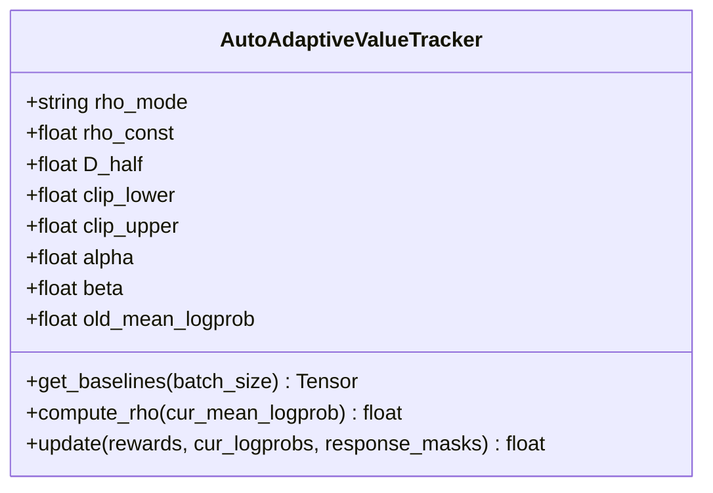
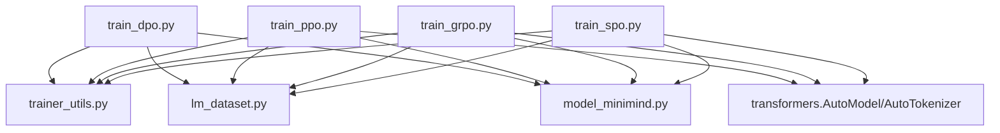

# Phase 8: 强化学习后训练

<cite>
**本文引用的文件列表**
- [docs/08_Phase8_强化学习后训练.md](file://docs/08_Phase8_强化学习后训练.md)
- [trainer/train_dpo.py](file://trainer/train_dpo.py)
- [trainer/train_ppo.py](file://trainer/train_ppo.py)
- [trainer/train_grpo.py](file://trainer/train_grpo.py)
- [trainer/train_spo.py](file://trainer/train_spo.py)
- [trainer/trainer_utils.py](file://trainer/trainer_utils.py)
- [model/model_minimind.py](file://model/model_minimind.py)
- [dataset/lm_dataset.py](file://dataset/lm_dataset.py)
- [requirements.txt](file://requirements.txt)
</cite>

## 目录
1. [引言](#引言)
2. [项目结构](#项目结构)
3. [核心组件](#核心组件)
4. [架构总览](#架构总览)
5. [详细组件分析](#详细组件分析)
6. [依赖关系分析](#依赖关系分析)
7. [性能考量](#性能考量)
8. [故障排查指南](#故障排查指南)
9. [结论](#结论)
10. [附录](#附录)

## 引言
本阶段聚焦于强化学习后训练（Post-Training with Reinforcement Learning），旨在通过偏好对齐提升模型在对话、推理与工具调用等任务上的表现。文档系统梳理了 DPO、PPO、GRPO、SPO 四类策略优化算法的统一视角与实现要点，覆盖奖励模型训练、偏好数据标注、策略梯度估计与更新机制，并给出参数配置、训练流程、数值稳定性与收敛监控的实操建议，以及奖励模型评估、人类反馈与自动化训练策略的最佳实践。

## 项目结构
- 文档与实现分离：文档位于 docs/08_Phase8_强化学习后训练.md，训练脚本集中在 trainer/，模型与数据集分别位于 model/ 与 dataset/。
- 训练脚本按算法划分：train_dpo.py、train_ppo.py、train_grpo.py、train_spo.py。
- 通用工具：trainer/trainer_utils.py 提供分布式初始化、检查点、学习率调度、模型加载等。
- 模型定义：model/model_minimind.py 提供 MiniMindConfig 与 MiniMindForCausalLM。
- 数据集适配：dataset/lm_dataset.py 提供 DPODataset、RLAIFDataset 等。

图表来源
- [trainer/train_dpo.py](file://trainer/train_dpo.py)
- [trainer/train_ppo.py](file://trainer/train_ppo.py)
- [trainer/train_grpo.py](file://trainer/train_grpo.py)
- [trainer/train_spo.py](file://trainer/train_spo.py)
- [trainer/trainer_utils.py](file://trainer/trainer_utils.py)
- [model/model_minimind.py](file://model/model_minimind.py)
- [dataset/lm_dataset.py](file://dataset/lm_dataset.py)
- [docs/08_Phase8_强化学习后训练.md](file://docs/08_Phase8_强化学习后训练.md)

章节来源
- [docs/08_Phase8_强化学习后训练.md](file://docs/08_Phase8_强化学习后训练.md)
- [trainer/train_dpo.py](file://trainer/train_dpo.py)
- [trainer/train_ppo.py](file://trainer/train_ppo.py)
- [trainer/train_grpo.py](file://trainer/train_grpo.py)
- [trainer/train_spo.py](file://trainer/train_spo.py)
- [trainer/trainer_utils.py](file://trainer/trainer_utils.py)
- [model/model_minimind.py](file://model/model_minimind.py)
- [dataset/lm_dataset.py](file://dataset/lm_dataset.py)

## 核心组件
- 统一策略优化视角：所有 PO 算法共享同一期望优化目标，区别在于策略项、优势项与正则项的具体实例化。
- DPO（直接偏好优化）：Off-Policy，仅需策略模型与参考模型，不训练奖励模型，损失函数直接基于偏好对的对数几率。
- PPO（近端策略优化）：On-Policy，需要 Actor、Critic、Old Actor、Reference 四模型，采用裁剪的概率比与价值函数估计的优势项。
- GRPO（分组相对策略优化）：On-Policy，无需 Critic，使用组内均值与标准差归一化的优势估计，缓解 Critic 偏差。
- SPO（单流策略优化）：实验性算法，引入自适应 Beta 分布基线跟踪，避免 GRPO 的退化组问题。

章节来源
- [docs/08_Phase8_强化学习后训练.md](file://docs/08_Phase8_强化学习后训练.md)

## 架构总览
下图展示各算法在 MiniMind 项目中的模块关系与数据流：策略模型与参考模型贯穿 DPO/GRPO/SPO；PPO 额外引入 Critic 与 Old Actor；奖励模型用于 PPO/GRPO/SPO 的奖励计算。

图表来源
- [trainer/train_dpo.py](file://trainer/train_dpo.py)
- [trainer/train_ppo.py](file://trainer/train_ppo.py)
- [trainer/train_grpo.py](file://trainer/train_grpo.py)
- [trainer/train_spo.py](file://trainer/train_spo.py)
- [trainer/trainer_utils.py](file://trainer/trainer_utils.py)
- [model/model_minimind.py](file://model/model_minimind.py)
- [dataset/lm_dataset.py](file://dataset/lm_dataset.py)

## 详细组件分析

### DPO（直接偏好优化）
- 理论要点
  - Off-Policy：使用静态偏好数据集，支持重复训练。
  - 不训练奖励模型，仅需策略模型与参考模型。
  - 损失函数基于偏好对的对数几率，隐式包含优势与 KL 正则。
- 关键实现
  - 日志概率归一化与 chosen/rejected 对比。
  - 使用半精度混合训练与梯度累积。
  - 学习率极小，避免遗忘参考模型。
- 训练流程
  - 初始化策略与参考模型，加载 DPO 数据集。
  - 前向得到参考与策略对数概率，计算损失并反向传播。
  - 定期保存检查点与权重。
- 参数与配置
  - --beta 控制 KL 正则强度；--learning_rate 建议较小值；--from_weight 指定 SFT 权重。
- 数值稳定性
  - 序列长度归一化防止除零；掩码裁剪避免无效 token 影响。
- 收敛监控
  - 记录 loss、学习率、每轮耗时；可接入可视化工具记录指标。

图表来源
- [trainer/train_dpo.py](file://trainer/train_dpo.py)

章节来源
- [trainer/train_dpo.py](file://trainer/train_dpo.py)
- [docs/08_Phase8_强化学习后训练.md](file://docs/08_Phase8_强化学习后训练.md)

### PPO（近端策略优化）
- 理论要点
  - On-Policy：实时采样，需要 Actor、Critic、Old Actor、Reference 四模型。
  - 损失包含裁剪的概率比、价值函数 MSE 与 KL 正则。
- 关键实现
  - CriticModel 在基础模型上替换 lm_head 为价值估计头。
  - 奖励计算整合格式奖励与奖励模型打分，并裁剪到合理范围。
  - 使用 CosineAnnealingLR 调度学习率，定期更新 Old Actor。
- 训练流程
  - 生成响应，计算奖励与优势（奖励减去 Critic 价值）。
  - 计算策略损失、价值损失与 KL 正则，联合优化。
  - 定期保存 Actor/Critic 与调度器状态。
- 参数与配置
  - --clip_epsilon、--vf_coef、--kl_coef 控制裁剪、价值函数权重与 KL 正则。
  - 需要外部奖励模型（InternLM2-1.8B-Reward）。
- 数值稳定性
  - 优势裁剪与梯度裁剪；KL 正则抑制过大更新。
- 收敛监控
  - 记录 Actor Loss、Critic Loss、Reward、KL、平均响应长度与学习率。

图表来源
- [trainer/train_ppo.py](file://trainer/train_ppo.py)

章节来源
- [trainer/train_ppo.py](file://trainer/train_ppo.py)
- [docs/08_Phase8_强化学习后训练.md](file://docs/08_Phase8_强化学习后训练.md)

### GRPO（分组相对策略优化）
- 理论要点
  - On-Policy：无需 Critic，使用组内均值与标准差归一化的优势估计。
  - 通过组内统计消除 Critic 偏差，缓解 Critic 训练带来的不稳定。
- 关键实现
  - 每个 prompt 生成多个响应，组内计算均值与标准差，优势归一化。
  - 使用参考模型 KL 正则，逐 token 计算损失。
- 训练流程
  - 生成多响应，计算奖励与组内优势，逐 token 计算损失并反向传播。
  - 定期清理缓存与垃圾回收，降低显存压力。
- 参数与配置
  - --num_generations 控制每 prompt 生成样本数；--beta 控制 KL 正则。
- 数值稳定性
  - 优势裁剪与归一化；组内方差加小常数避免除零。
- 收敛监控
  - 记录策略损失、奖励、平均响应长度与学习率。

图表来源
- [trainer/train_grpo.py](file://trainer/train_grpo.py)

章节来源
- [trainer/train_grpo.py](file://trainer/train_grpo.py)
- [docs/08_Phase8_强化学习后训练.md](file://docs/08_Phase8_强化学习后训练.md)

### SPO（单流策略优化）
- 理论要点
  - 实验性算法，避免 GRPO 的退化组问题，采用自适应 Beta 分布基线跟踪。
  - 通过动态 ρ 调整基线，提供稳定的单样本优势估计。
- 关键实现
  - AutoAdaptiveValueTracker 维护 α/β，根据均值对数概率动态计算 ρ 并更新。
  - 使用参考模型 KL 正则，逐 token 计算损失。
- 训练流程
  - 生成单响应，计算奖励与自适应基线，计算优势并逐 token 损失。
  - 更新基线参数，定期保存权重与检查点。
- 参数与配置
  - --beta 控制 KL 正则；--accumulation_steps 增大以稳定训练。
- 数值稳定性
  - 优势裁剪；基线归一化至原始奖励尺度；动态 ρ 限制上下界。
- 收敛监控
  - 记录策略损失、奖励、基线、KL、ρ 与学习率。

图表来源
- [trainer/train_spo.py](file://trainer/train_spo.py)

章节来源
- [trainer/train_spo.py](file://trainer/train_spo.py)
- [docs/08_Phase8_强化学习后训练.md](file://docs/08_Phase8_强化学习后训练.md)

## 依赖关系分析
- 训练脚本依赖关系
  - 所有算法脚本依赖 trainer_utils.py（分布式、检查点、学习率、模型初始化）。
  - DPO/GRPO/SPO 依赖 DPODataset/RLAIFDataset；PPO 依赖 RLAIFDataset。
  - 所有算法依赖 MiniMindForCausalLM 与 MiniMindConfig。
- 外部依赖
  - transformers、torch、accelerate 等；swanlab/wandb 用于可视化；transformers 的 AutoModel/AutoTokenizer 用于奖励模型加载。

图表来源
- [trainer/train_dpo.py](file://trainer/train_dpo.py)
- [trainer/train_ppo.py](file://trainer/train_ppo.py)
- [trainer/train_grpo.py](file://trainer/train_grpo.py)
- [trainer/train_spo.py](file://trainer/train_spo.py)
- [trainer/trainer_utils.py](file://trainer/trainer_utils.py)
- [model/model_minimind.py](file://model/model_minimind.py)
- [dataset/lm_dataset.py](file://dataset/lm_dataset.py)

章节来源
- [requirements.txt](file://requirements.txt)
- [trainer/train_dpo.py](file://trainer/train_dpo.py)
- [trainer/train_ppo.py](file://trainer/train_ppo.py)
- [trainer/train_grpo.py](file://trainer/train_grpo.py)
- [trainer/train_spo.py](file://trainer/train_spo.py)
- [trainer/trainer_utils.py](file://trainer/trainer_utils.py)
- [model/model_minimind.py](file://model/model_minimind.py)
- [dataset/lm_dataset.py](file://dataset/lm_dataset.py)

## 性能考量
- 显存与吞吐
  - PPO 需要 Actor/Critic 双网络，显存约为单网络方法的 1.5–2 倍；GRPO/SPO 仅需策略与参考模型，显存占用较低。
  - DPO 为 Off-Policy，可重复利用数据，适合大规模静态偏好数据集。
- 混合精度与梯度累积
  - 使用 bfloat16 或 float16 混合精度；通过 --accumulation_steps 增大有效 batch，稳定训练。
- 学习率与正则
  - DPO/PPO/GRPO/SPO 均采用较小学习率与 KL 正则，避免遗忘参考模型或策略漂移。
- 优势估计与奖励稀疏
  - 使用连续奖励信号与多源奖励融合，缓解奖励稀疏导致的零梯度问题；监控奖励方差，及时调整数据或奖励机制。

[本节为通用性能讨论，不直接分析特定文件]

## 故障排查指南
- 训练不收敛或 loss 为 NaN
  - 检查学习率是否过大；开启梯度裁剪；确认混合精度 dtype 设置正确。
  - DPO：核对掩码与序列长度归一化，避免除零。
  - PPO：检查 Critic 价值估计与优势计算，确保奖励裁剪与梯度裁剪生效。
  - GRPO/SPO：关注组内方差与优势归一化，必要时增大 --num_generations 或调整 --beta。
- 显存不足
  - 降低 batch_size 或增大 --accumulation_steps；关闭不必要的可视化；减少 max_seq_len。
  - 使用 DDP 分布式训练，合理设置 LOCAL_RANK。
- 检查点与续训
  - 使用 trainer_utils 的 lm_checkpoint 保存完整状态；注意 world_size 变化时 step 的自动转换。
- 奖励模型加载失败
  - 确认奖励模型路径与 trust_remote_code 设置；确保 GPU 设备可用并设置 dtype。

章节来源
- [trainer/train_dpo.py](file://trainer/train_dpo.py)
- [trainer/train_ppo.py](file://trainer/train_ppo.py)
- [trainer/train_grpo.py](file://trainer/train_grpo.py)
- [trainer/train_spo.py](file://trainer/train_spo.py)
- [trainer/trainer_utils.py](file://trainer/trainer_utils.py)

## 结论
MiniMind 的强化学习后训练实现了 DPO、PPO、GRPO、SPO 四类策略优化算法，统一在“策略项—优势项—正则项”的框架下，结合奖励模型与规则奖励，形成可扩展、可监控的偏好对齐流水线。实践中建议优先尝试 DPO 与 GRPO，前者稳定高效，后者无需 Critic；PPO 作为经典基线可用于更严格的策略约束；SPO 作为实验性算法，可探索自适应基线在单样本场景下的潜力。通过合理的参数配置、数值稳定性保障与奖励机制设计，可在中小规模模型上取得稳健的偏好对齐效果。

[本节为总结性内容，不直接分析特定文件]

## 附录
- 算法对比与适用场景
  - DPO：Off-Policy、稳定、实现简单，适合静态偏好数据集。
  - PPO：On-Policy、理论成熟、需要四模型，适合严格策略约束。
  - GRPO：On-Policy、无需 Critic、可能退化组，适合多响应生成场景。
  - SPO：实验性、自适应基线、单样本设计，适合探索性研究。
- 奖励模型准备与评估
  - 下载并放置奖励模型至指定目录；使用连续奖励信号与多源融合；监控奖励方差与分布。
- 自动化训练策略
  - 使用 swanlab/wandb 记录指标；定期保存检查点；根据验证指标选择最佳权重。

章节来源
- [docs/08_Phase8_强化学习后训练.md](file://docs/08_Phase8_强化学习后训练.md)