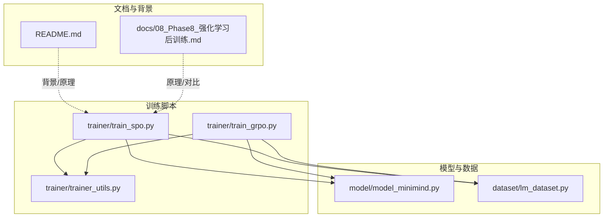
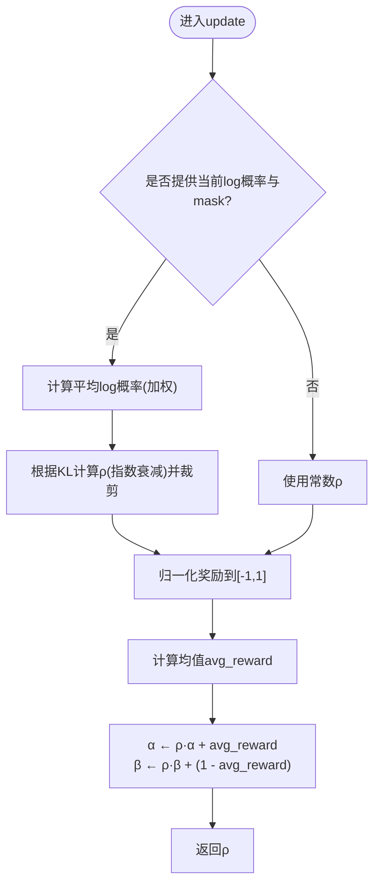
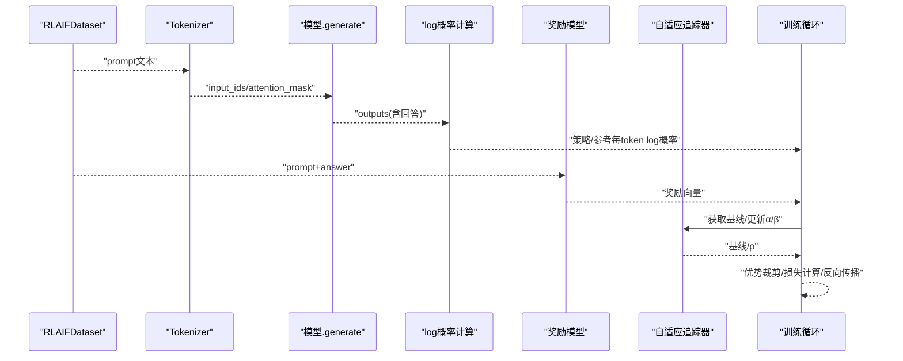
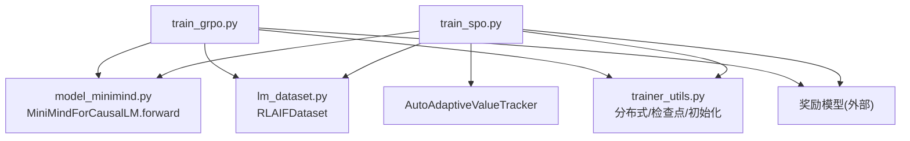

# SPO 单流策略优化

<cite>
**本文引用的文件列表**
- [train_spo.py](file://trainer/train_spo.py)
- [train_grpo.py](file://trainer/train_grpo.py)
- [trainer_utils.py](file://trainer/trainer_utils.py)
- [model_minimind.py](file://model/model_minimind.py)
- [lm_dataset.py](file://dataset/lm_dataset.py)
- [README.md](file://README.md)
- [08_Phase8_强化学习后训练.md](file://docs/08_Phase8_强化学习后训练.md)
</cite>

## 目录
1. [引言](#引言)
2. [项目结构](#项目结构)
3. [核心组件](#核心组件)
4. [架构总览](#架构总览)
5. [详细组件分析](#详细组件分析)
6. [依赖关系分析](#依赖关系分析)
7. [性能考量](#性能考量)
8. [故障排查指南](#故障排查指南)
9. [结论](#结论)
10. [附录](#附录)

## 引言
本文件面向MiniMind项目中的SPO（单流策略优化）算法，系统阐述其针对GRPO退化组问题的改进理念与实现细节。SPO回归RL本质：1个输入、1个输出、1个训练样本，采用“单流”范式，直接使用策略项log概率，结合自适应baseline（Beta分布动态跟踪）与token级KL正则及动态ρ调整，形成稳定的训练信号，避免组内差异导致的退化组问题。本文同时对比GRPO的组内均值/方差归一化方案，说明SPO在MiniMind中的实验性定位与验证价值，并提供训练配置、参数调优与效果评估方法。

## 项目结构
围绕SPO的关键文件与模块如下：
- 训练脚本：trainer/train_spo.py（SPO主流程与自适应baseline）
- 对比算法：trainer/train_grpo.py（组相对策略优化）
- 工具函数：trainer/trainer_utils.py（分布式、检查点、模型初始化等）
- 模型定义：model/model_minimind.py（MiniMindForCausalLM及其forward/logits切片接口）
- 数据集：dataset/lm_dataset.py（RLAIFDataset等）
- 文档与背景：README.md、docs/08_Phase8_强化学习后训练.md



图表来源
- [train_spo.py:1-342](file://trainer/train_spo.py#L1-L342)
- [train_grpo.py:1-292](file://trainer/train_grpo.py#L1-L292)
- [trainer_utils.py:1-139](file://trainer/trainer_utils.py#L1-L139)
- [model_minimind.py:443-477](file://model/model_minimind.py#L443-L477)
- [lm_dataset.py:203-246](file://dataset/lm_dataset.py#L203-L246)
- [README.md:1245-1260](file://README.md#L1245-L1260)
- [08_Phase8_强化学习后训练.md:214-233](file://docs/08_Phase8_强化学习后训练.md#L214-L233)

章节来源
- [train_spo.py:1-342](file://trainer/train_spo.py#L1-L342)
- [train_grpo.py:1-292](file://trainer/train_grpo.py#L1-L292)
- [trainer_utils.py:1-139](file://trainer/trainer_utils.py#L1-L139)
- [model_minimind.py:443-477](file://model/model_minimind.py#L443-L477)
- [lm_dataset.py:203-246](file://dataset/lm_dataset.py#L203-L246)
- [README.md:1245-1260](file://README.md#L1245-L1260)
- [08_Phase8_强化学习后训练.md:214-233](file://docs/08_Phase8_强化学习后训练.md#L214-L233)

## 核心组件
- 自适应价值追踪器（AutoAdaptiveValueTracker）
  - 作用：为每个样本提供跨批次持久化、自适应的基线B_t，避免组内归一化带来的退化组风险
  - 实现：Beta分布参数α/β动态更新，基于平均log概率与奖励的归一化值进行更新，支持常数ρ或基于KL的动态ρ
- 策略项log概率
  - 设计：直接使用策略项log πθ(a_t|s)，不进行比率估计，简化训练范式
- 优势项（自适应baseline）
  - 设计：R - B_t^adaptive，其中B_t^adaptive来自Beta分布的期望，随时间动态更新
- 正则项（token级KL + 动态ρ）
  - 设计：β·KL_t，其中KL_t为token级KL散度，ρ按策略稳定性动态调整，抑制过度偏离

章节来源
- [train_spo.py:27-66](file://trainer/train_spo.py#L27-L66)
- [train_spo.py:131-235](file://trainer/train_spo.py#L131-L235)

## 架构总览
SPO训练流程概览：
- 初始化：分布式、随机种子、混合精度、模型/参考模型/奖励模型、数据集、优化器/调度器
- 训练循环：生成回答、计算每token log概率与参考log概率、计算奖励、构造自适应baseline、计算优势、计算token级KL、构建损失并反向传播、更新自适应baseline、梯度裁剪与优化器步进
- 日志与检查点：记录策略损失、奖励、KL、基线、优势均值、学习率；周期性保存权重与恢复信息

```mermaid
sequenceDiagram
participant Loader as "数据加载器"
participant Gen as "生成器(模型)"
participant Logp as "log概率计算"
participant RM as "奖励模型"
participant AT as "自适应追踪器"
participant Opt as "优化器"
Loader->>Gen : "prompt批量输入"
Gen-->>Loader : "生成回答(完成标记)"
Loader->>Logp : "计算策略/参考每token log概率"
Loader->>RM : "计算奖励(格式/规则/模型评分)"
RM-->>Loader : "奖励向量"
Loader->>AT : "获取基线/更新α/β(含ρ)"
AT-->>Loader : "基线向量/ρ"
Loader->>Loader : "计算优势=奖励-基线, 裁剪"
Loader->>Loader : "计算token级KL, 构建损失"
Loader->>Opt : "反向传播/梯度裁剪/优化器步进"
Opt-->>Loader : "参数更新"
```

图表来源
- [train_spo.py:131-235](file://trainer/train_spo.py#L131-L235)

章节来源
- [train_spo.py:237-342](file://trainer/train_spo.py#L237-L342)

## 详细组件分析

### 自适应价值追踪器（Beta分布动态跟踪）
- 参数初始化：根据clip_lower确定初始N_init，进而初始化α/β
- 基线计算：B_t^adaptive = α/(α+β)，返回与batch_size一致的基线向量
- 动态ρ计算：
  - 常数模式：直接返回ρ_const
  - KL模式：计算当前平均log概率与上一时刻的KL，按指数衰减公式计算ρ，并裁剪至[clip_lower, clip_upper]
- 更新规则：
  - 将奖励归一化到[-1,1]区间，计算均值avg_reward
  - α ← ρ·α + avg_reward, β ← ρ·β + (1 - avg_reward)
  - 返回当前ρ



图表来源
- [train_spo.py:44-66](file://trainer/train_spo.py#L44-L66)

章节来源
- [train_spo.py:27-66](file://trainer/train_spo.py#L27-L66)

### 策略项log概率与优势项
- 策略项：直接使用策略log概率，不进行比率估计，简化为“1个输入、1个输出、1个样本”的训练范式
- 优势项：使用自适应基线B_t^adaptive，优势A_t = R - B_t^adaptive，并对优势进行裁剪以抑制梯度爆炸
- 与GRPO对比：GRPO使用组内均值/方差归一化与批内标准化，易受退化组影响；SPO通过跨样本持久化基线避免该问题

章节来源
- [train_spo.py:131-235](file://trainer/train_spo.py#L131-L235)
- [train_grpo.py:95-187](file://trainer/train_grpo.py#L95-L187)
- [08_Phase8_强化学习后训练.md:181-201](file://docs/08_Phase8_强化学习后训练.md#L181-L201)

### 正则项与动态ρ调整
- 正则项：β·KL_t，其中KL_t为token级KL散度，抑制策略过度偏离参考策略
- 动态ρ：根据策略稳定性（平均log概率的KL）自适应调整，策略越稳定，ρ越大，基线更新越保守；反之则更激进
- 与GRPO对比：GRPO未显式引入正则项与动态ρ，SPO通过自适应基线与动态ρ增强稳定性

章节来源
- [train_spo.py:180-187](file://trainer/train_spo.py#L180-L187)
- [train_spo.py:44-66](file://trainer/train_spo.py#L44-L66)

### 训练流程与数据流
- 数据加载：RLAIFDataset返回prompt与answer占位，训练时对prompt批量编码并生成回答
- 生成与log概率：使用模型生成回答，计算策略与参考模型的每token log概率
- 奖励计算：整合格式奖励、标记奖励与奖励模型评分，必要时对answer片段单独打分
- 损失计算：优势裁剪、token级KL、按完成mask求平均，反向传播并更新参数
- 检查点：周期性保存权重与优化器状态，支持续训



图表来源
- [train_spo.py:131-235](file://trainer/train_spo.py#L131-L235)
- [lm_dataset.py:237-245](file://dataset/lm_dataset.py#L237-L245)

章节来源
- [train_spo.py:131-235](file://trainer/train_spo.py#L131-L235)
- [lm_dataset.py:203-246](file://dataset/lm_dataset.py#L203-L246)

## 依赖关系分析
- 模块耦合
  - SPO主流程依赖：模型（MiniMindForCausalLM）、数据集（RLAIFDataset）、工具函数（分布式/检查点/模型初始化）、奖励模型（外部加载）
  - GRPO对比流程与SPO共享相同依赖，但优势计算方式不同
- 关键依赖链
  - 训练脚本 → 模型.forward/logits切片接口（支持logits_to_keep）→ 生成与log概率计算
  - 训练脚本 → 数据集 → prompt/answer占位 → 生成回答
  - 训练脚本 → 奖励模型 → 连续奖励分数
  - 训练脚本 → 自适应追踪器 → 基线/ρ更新



图表来源
- [train_spo.py:1-342](file://trainer/train_spo.py#L1-L342)
- [train_grpo.py:1-292](file://trainer/train_grpo.py#L1-L292)
- [model_minimind.py:443-477](file://model/model_minimind.py#L443-L477)
- [lm_dataset.py:203-246](file://dataset/lm_dataset.py#L203-L246)
- [trainer_utils.py:1-139](file://trainer/trainer_utils.py#L1-L139)

章节来源
- [train_spo.py:1-342](file://trainer/train_spo.py#L1-L342)
- [train_grpo.py:1-292](file://trainer/train_grpo.py#L1-L292)
- [model_minimind.py:443-477](file://model/model_minimind.py#L443-L477)
- [lm_dataset.py:203-246](file://dataset/lm_dataset.py#L203-L246)
- [trainer_utils.py:1-139](file://trainer/trainer_utils.py#L1-L139)

## 性能考量
- 梯度裁剪与学习率调度：使用余弦退火调度器与梯度裁剪，避免训练不稳定
- 混合精度：在CUDA设备上启用bfloat16/float16混合精度，降低显存占用
- 分布式训练：支持NCCL后端，自动设置本地设备，减少通信开销
- 计算开销控制：每token log概率与KL计算按完成mask求平均，避免无效token干扰
- 奖励范围裁剪：将奖励映射到[-1,1]区间，提升数值稳定性

章节来源
- [train_spo.py:189-196](file://trainer/train_spo.py#L189-L196)
- [train_spo.py:277-279](file://trainer/train_spo.py#L277-L279)
- [trainer_utils.py:28-35](file://trainer/trainer_utils.py#L28-L35)

## 故障排查指南
- 退化组问题
  - 症状：组内奖励方差接近0，优势归一化失效
  - 解决：SPO通过自适应基线避免组内归一化，若仍出现信号弱，检查奖励范围与奖励组合权重
- 奖励稀疏
  - 症状：奖励分布集中在边界值，Var(r)接近0
  - 解决：增加格式奖励与标记奖励权重，或调整奖励模型评分范围
- 梯度爆炸
  - 症状：策略损失发散、优势异常大
  - 解决：启用优势裁剪与梯度裁剪，适当降低学习率
- 检查点不兼容
  - 症状：多卡数量变化导致step转换异常
  - 解决：使用工具函数自动转换step，确保恢复数据一致性

章节来源
- [README.md:1135-1143](file://README.md#L1135-L1143)
- [trainer_utils.py:88-97](file://trainer/trainer_utils.py#L88-L97)

## 结论
SPO通过“1个输入、1个输出、1个样本”的单流范式，直接使用策略项log概率，结合自适应baseline（Beta分布动态跟踪）与token级KL正则及动态ρ调整，有效缓解GRPO的退化组问题，提供更稳定的训练信号。在MiniMind中，SPO作为实验性前沿算法，旨在探索更高效的RL训练路径，其验证价值体现在对奖励稀疏与组内差异的鲁棒性提升。建议在奖励设计与参数调优上持续迭代，结合可视化监控（奖励、KL、基线、优势均值）进行效果评估。

## 附录

### 训练配置与参数调优
- 基本配置
  - 学习率、批次大小、累计步数、梯度裁剪阈值、日志/保存间隔
  - 隐藏维度、层数、是否使用MoE、最大序列长度、生成长度
- 奖励与格式
  - 奖励模型路径、推理模式开关、格式奖励与标记奖励权重
- 自适应基线
  - rho模式（常数/基于KL）、ρ常数、D_half、上下界裁剪
- 训练流程
  - 分布式初始化、混合精度、Cosine退火调度器、检查点保存与续训

章节来源
- [train_spo.py:237-342](file://trainer/train_spo.py#L237-L342)
- [train_grpo.py:189-292](file://trainer/train_grpo.py#L189-L292)

### 效果评估方法
- 指标
  - 策略损失、平均奖励、平均响应长度、KL散度、基线均值、优势均值、学习率
- 可视化
  - 使用W&B/SwanLab记录上述指标，观察奖励方差与KL趋势，判断是否出现退化组或奖励稀疏
- 对比
  - 与GRPO在相同数据与奖励设置下的收敛曲线与稳定性对比

章节来源
- [train_spo.py:197-219](file://trainer/train_spo.py#L197-L219)
- [train_grpo.py:154-171](file://trainer/train_grpo.py#L154-L171)
- [README.md:1135-1143](file://README.md#L1135-L1143)