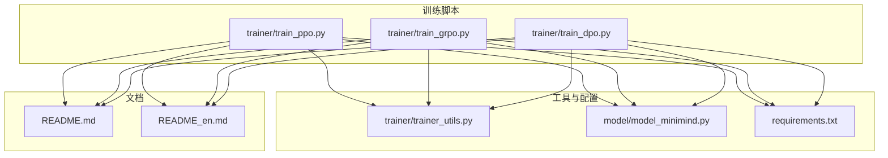
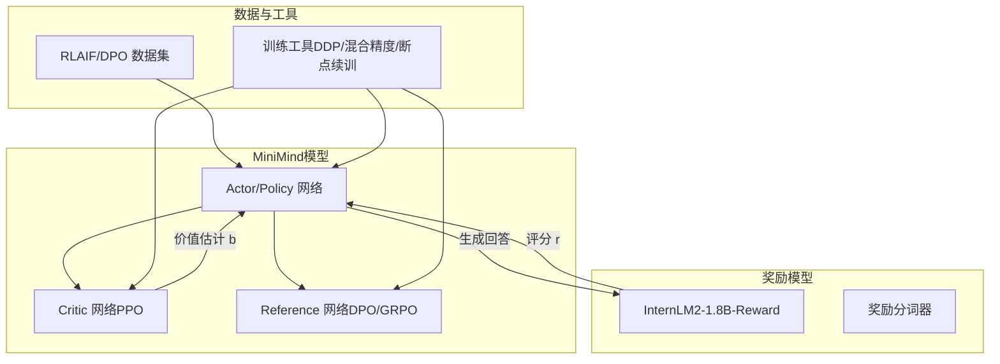
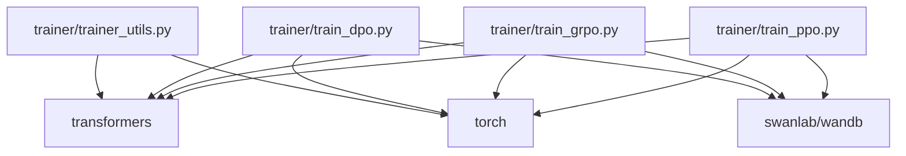

# 奖励模型准备与使用

<cite>
**本文引用的文件**
- [README.md](file://README.md)
- [README_en.md](file://README_en.md)
- [requirements.txt](file://requirements.txt)
- [trainer/train_ppo.py](file://trainer/train_ppo.py)
- [trainer/train_grpo.py](file://trainer/train_grpo.py)
- [trainer/train_dpo.py](file://trainer/train_dpo.py)
- [trainer/trainer_utils.py](file://trainer/trainer_utils.py)
- [model/model_minimind.py](file://model/model_minimind.py)
</cite>

## 目录
1. [简介](#简介)
2. [项目结构](#项目结构)
3. [核心组件](#核心组件)
4. [架构总览](#架构总览)
5. [详细组件分析](#详细组件分析)
6. [依赖关系分析](#依赖关系分析)
7. [性能考量](#性能考量)
8. [故障排查指南](#故障排查指南)
9. [结论](#结论)
10. [附录](#附录)

## 简介
本文件面向MiniMind项目，系统化阐述奖励模型在强化学习（RLAIF）中的作用与落地方法，重点覆盖：
- 奖励模型在RLHF/RLAIF中的关键地位：为模型生成的回答提供数值化质量评分，驱动策略梯度更新。
- InternLM2-1.8B-Reward奖励模型的获取与放置规范（ModelScope与HuggingFace双通道）。
- MiniMind超小模型（0.1B参数）在通用任务上面临的奖励稀疏问题及其后果（优势函数接近0、策略梯度信号消失）。
- 缓解策略：使用model-based连续性奖励信号、监控奖励方差、限定在模型能力边界内的任务。
- 奖励模型的集成实现、评分计算方法与质量评估策略。
- 最佳实践与调试技巧。

## 项目结构
围绕奖励模型准备与使用，项目中与之直接相关的目录与文件包括：
- 训练脚本：trainer/train_ppo.py、trainer/train_grpo.py、trainer/train_dpo.py
- 训练工具：trainer/trainer_utils.py
- 模型配置与实现：model/model_minimind.py
- 环境依赖：requirements.txt
- 文档与说明：README.md、README_en.md



图表来源
- [trainer/train_ppo.py](file://trainer/train_ppo.py)
- [trainer/train_grpo.py](file://trainer/train_grpo.py)
- [trainer/train_dpo.py](file://trainer/train_dpo.py)
- [trainer/trainer_utils.py](file://trainer/trainer_utils.py)
- [model/model_minimind.py](file://model/model_minimind.py)
- [requirements.txt](file://requirements.txt)
- [README.md](file://README.md)
- [README_en.md](file://README_en.md)

章节来源
- [README.md](file://README.md)
- [README_en.md](file://README_en.md)
- [requirements.txt](file://requirements.txt)

## 核心组件
- 奖励模型加载与评分
  - 训练脚本通过AutoModel.from_pretrained加载奖励模型，并使用AutoTokenizer加载对应分词器。
  - 评分接口统一为get_score(reward_tokenizer, messages)，其中messages为系统/用户/助手对话格式。
- 奖励合成与裁剪
  - 计算奖励时对连续分数进行裁剪（如±3.0），并可叠加格式/标记奖励，形成稠密信号。
- 训练流程中的奖励使用
  - PPO：使用Critic估计价值，优势函数A=r-b，策略更新依赖优势。
  - GRPO：组内归一化优势，避免额外Critic网络。
  - DPO：偏好优化，无需奖励模型，直接使用偏好对数似然。

章节来源
- [trainer/train_ppo.py](file://trainer/train_ppo.py)
- [trainer/train_grpo.py](file://trainer/train_grpo.py)
- [trainer/train_dpo.py](file://trainer/train_dpo.py)

## 架构总览
奖励模型在MiniMind强化学习训练中的位置如下：



图表来源
- [trainer/train_ppo.py](file://trainer/train_ppo.py)
- [trainer/train_grpo.py](file://trainer/train_grpo.py)
- [trainer/train_dpo.py](file://trainer/train_dpo.py)
- [trainer/trainer_utils.py](file://trainer/trainer_utils.py)

## 详细组件分析

### 奖励模型准备与下载
- 获取途径
  - ModelScope：Shanghai_AI_Laboratory/internlm2-1_8b-reward
  - HuggingFace：internlm/internlm2-1_8b-reward
- 目录结构要求
  - 将奖励模型与MiniMind项目置于同一级目录，确保训练脚本可通过相对路径加载。
- 依赖与版本
  - 训练脚本使用transformers AutoModel/AutoTokenizer加载奖励模型，需满足依赖版本要求。

章节来源
- [README.md](file://README.md)
- [README_en.md](file://README_en.md)
- [requirements.txt](file://requirements.txt)

### 奖励模型集成与评分计算
- 加载与初始化
  - 训练脚本通过AutoModel.from_pretrained加载奖励模型，设置精度与设备。
  - 使用AutoTokenizer加载奖励模型对应的分词器。
- 评分流程
  - 将prompt与assistant回复拼接为messages，调用reward_model.get_score(tokenizer, messages)获得连续分数。
  - 对分数进行裁剪（如±3.0），避免极端值影响稳定性。
  - 在推理模型场景下，可叠加格式奖励与标记奖励，形成更稠密的信号。
- PPO与GRPO中的奖励使用
  - PPO：优势A=r-b，策略损失包含裁剪项与价值损失。
  - GRPO：组内优势归一化，消除Critic网络依赖，但同样依赖奖励模型给出的连续分数。

```mermaid
sequenceDiagram
participant Loader as "训练脚本"
participant RM as "奖励模型"
participant RT as "奖励分词器"
participant Actor as "Actor/Policy"
participant Critic as "Critic"
Loader->>RM : 加载奖励模型
Loader->>RT : 加载奖励分词器
Actor->>Actor : 生成回答
Actor->>RM : get_score(RT, messages)
RM-->>Actor : 返回连续分数 r
Actor->>Critic : 估计价值 bPPO
Actor->>Actor : 计算优势 A=r-b
Actor-->>Loader : 返回策略损失与指标
```

图表来源
- [trainer/train_ppo.py](file://trainer/train_ppo.py)
- [trainer/train_grpo.py](file://trainer/train_grpo.py)

章节来源
- [trainer/train_ppo.py](file://trainer/train_ppo.py)
- [trainer/train_grpo.py](file://trainer/train_grpo.py)

### MiniMind超小模型的奖励稀疏问题
- 现象
  - 在通用任务（如R1风格数学数据集）上，MiniMind（0.1B参数）生成的回答几乎全部错误，导致r(x,y)≈0。
- 后果
  - 优势函数A(x,y)=r(x,y)−b(x)≈0，策略梯度信号消失，无法有效更新参数θ。
- 缓解策略
  - 使用model-based连续性奖励信号，即使质量普遍较差，也能区分“更差”与“更更差”，提供非零梯度。
  - 混合多种奖励源：r_total=α·r_model+β·r_rule。
  - 监控奖励分数方差Var(r)，若持续接近0，需调整数据或奖励机制。
  - 限定任务难度在模型能力边界内，避免超出范围导致全零奖励。

章节来源
- [README.md](file://README.md)
- [README_en.md](file://README_en.md)

### 训练脚本中的奖励使用细节
- PPO
  - CriticModel继承自MiniMindForCausalLM，替换lm_head为输出单一价值的线性层。
  - 优势函数A=r−values.detach()，策略损失包含裁剪与价值损失，KL惩罚项用于稳定更新。
- GRPO
  - 不使用Critic，采用组内均值与标准差归一化的优势，减少网络间耦合。
  - 对奖励进行裁剪与归一化，提升稳定性。
- DPO
  - 不依赖奖励模型，直接使用偏好对（chosen/rejected）计算偏好对数似然损失。

章节来源
- [trainer/train_ppo.py](file://trainer/train_ppo.py)
- [trainer/train_grpo.py](file://trainer/train_grpo.py)
- [trainer/train_dpo.py](file://trainer/train_dpo.py)

### 目录结构配置指导
- 奖励模型放置位置
  - 与MiniMind项目同级目录，确保训练脚本可通过相对路径加载。
- 模型与分词器
  - 训练脚本会自动加载config.json与权重文件（如model.safetensors），无需额外配置。
- 数据集
  - RLAIF训练使用rlaif-mini.jsonl，DPO训练使用dpo.jsonl，确保格式与长度截断符合预期。

章节来源
- [README.md](file://README.md)
- [README_en.md](file://README_en.md)

### 评分计算方法与质量评估策略
- 评分方法
  - 统一messages格式：系统/用户/助手，调用get_score(tokenizer, messages)。
  - 对分数进行裁剪与加权（推理模型场景下对answer片段单独评分并加权融合）。
- 质量评估
  - 监控奖励均值与方差，若方差接近0，说明奖励信号稀疏，需调整任务或奖励机制。
  - 结合格式奖励与标记奖励，提升信号稠密度，避免严格稀疏。

章节来源
- [trainer/train_ppo.py](file://trainer/train_ppo.py)
- [trainer/train_grpo.py](file://trainer/train_grpo.py)

## 依赖关系分析
- 训练脚本依赖
  - transformers：AutoModel/AutoTokenizer加载奖励模型与分词器。
  - torch：张量运算、混合精度、DDP分布式训练。
  - swanlab/wandb：训练可视化（MiniMind默认使用SwanLab）。
- 训练工具
  - 断点续训、DDP初始化、随机种子设置、模型保存等。



图表来源
- [trainer/train_ppo.py](file://trainer/train_ppo.py)
- [trainer/train_grpo.py](file://trainer/train_grpo.py)
- [trainer/train_dpo.py](file://trainer/train_dpo.py)
- [trainer/trainer_utils.py](file://trainer/trainer_utils.py)
- [requirements.txt](file://requirements.txt)

章节来源
- [requirements.txt](file://requirements.txt)
- [trainer/trainer_utils.py](file://trainer/trainer_utils.py)

## 性能考量
- 奖励模型加载与推理
  - 使用float16精度加载奖励模型，减少显存占用；推理时禁用梯度以节省内存。
- 训练稳定性
  - 对奖励分数进行裁剪与归一化，避免极端值破坏优势估计。
  - PPO使用Critic估计价值，GRPO采用组内归一化优势，减少网络耦合。
- 任务难度与信号密度
  - 在超小模型场景下，优先选择与模型能力匹配的任务，避免全零奖励导致策略无法学习。

## 故障排查指南
- 奖励模型加载失败
  - 确认奖励模型与项目同级目录，路径正确；检查config.json与权重文件是否存在。
- 分词器不匹配
  - 确保使用奖励模型自带的分词器，不要混用MiniMind分词器。
- 奖励信号全零或方差接近0
  - 调整任务难度或奖励机制，增加格式/标记奖励；监控Var(r)并逐步收敛。
- 训练不稳定或发散
  - 降低学习率、增大裁剪阈值、检查数据截断长度与padding策略。

章节来源
- [trainer/train_ppo.py](file://trainer/train_ppo.py)
- [trainer/train_grpo.py](file://trainer/train_grpo.py)
- [trainer/train_dpo.py](file://trainer/train_dpo.py)

## 结论
- 奖励模型是MiniMind在RLAIF训练中的关键组件，提供连续、稠密的质量评分信号。
- 对于超小模型，奖励稀疏是核心挑战，需通过model-based连续奖励、信号密度增强与任务边界控制来缓解。
- 通过统一的评分接口与训练脚本，MiniMind实现了奖励模型的无缝集成与高效训练。

## 附录
- 最佳实践
  - 使用连续奖励信号，避免二元稀疏奖励。
  - 监控奖励方差，及时调整数据与奖励机制。
  - 将任务难度限制在模型能力范围内，确保正向信号。
- 调试技巧
  - 逐步降低任务难度，观察奖励均值与方差变化。
  - 在推理模型场景下，叠加格式与标记奖励，提升信号密度。
  - 使用SwanLab/W&B记录奖励、优势与损失，定位异常波动。