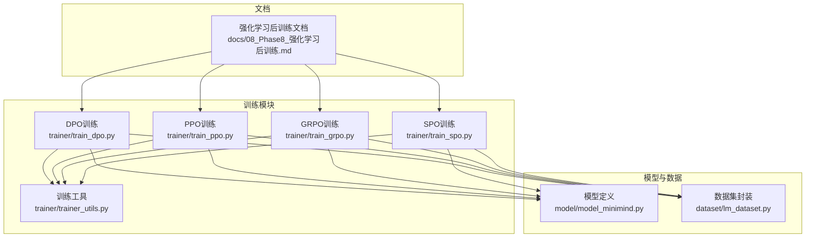
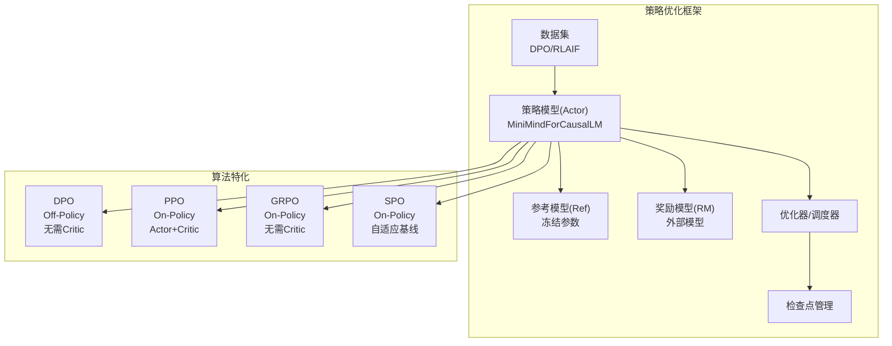
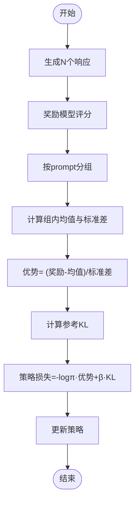
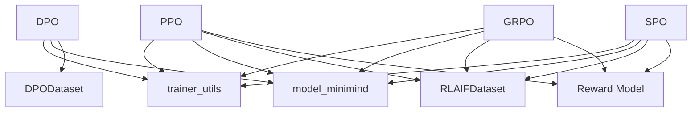
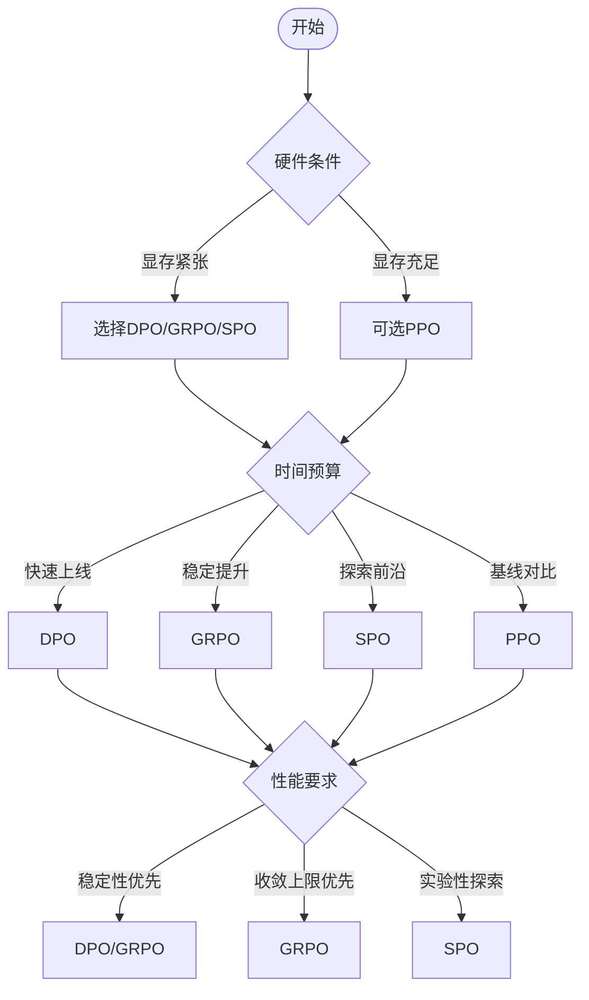

# 算法对比与选择指南

<cite>
**本文引用的文件**
- [train_dpo.py](file://trainer/train_dpo.py)
- [train_ppo.py](file://trainer/train_ppo.py)
- [train_grpo.py](file://trainer/train_grpo.py)
- [train_spo.py](file://trainer/train_spo.py)
- [trainer_utils.py](file://trainer/trainer_utils.py)
- [model_minimind.py](file://model/model_minimind.py)
- [lm_dataset.py](file://dataset/lm_dataset.py)
- [08_Phase8_强化学习后训练.md](file://docs/08_Phase8_强化学习后训练.md)
</cite>

## 目录
1. [简介](#简介)
2. [项目结构](#项目结构)
3. [核心组件](#核心组件)
4. [架构总览](#架构总览)
5. [详细组件分析](#详细组件分析)
6. [依赖关系分析](#依赖关系分析)
7. [性能考量](#性能考量)
8. [故障排查指南](#故障排查指南)
9. [结论](#结论)
10. [附录](#附录)

## 简介
本指南面向MiniMind项目中DPO、PPO、GRPO、SPO四类强化学习算法的对比与选择。文档从算法设计理念、实现细节、适用场景、训练曲线特征、参数调优与常见问题等方面进行系统梳理，并提供决策树帮助用户在不同硬件条件、时间预算与性能要求下做出合理选择。

## 项目结构
- 训练脚本位于trainer目录，分别对应四种算法的独立训练入口
- 模型定义位于model目录，提供MiniMindConfig与MiniMindForCausalLM等核心组件
- 数据集适配位于dataset目录，包含DPO与RLAIF等数据集封装
- 文档位于docs目录，包含强化学习后训练的完整说明与算法矩阵



**图表来源**
- [train_dpo.py:1-208](file://trainer/train_dpo.py#L1-L208)
- [train_ppo.py:1-362](file://trainer/train_ppo.py#L1-L362)
- [train_grpo.py:1-292](file://trainer/train_grpo.py#L1-L292)
- [train_spo.py:1-342](file://trainer/train_spo.py#L1-L342)
- [trainer_utils.py:1-139](file://trainer/trainer_utils.py#L1-L139)
- [model_minimind.py:1-200](file://model/model_minimind.py#L1-L200)
- [lm_dataset.py:1-200](file://dataset/lm_dataset.py#L1-L200)
- [08_Phase8_强化学习后训练.md:1-315](file://docs/08_Phase8_强化学习后训练.md#L1-L315)

**章节来源**
- [train_dpo.py:1-208](file://trainer/train_dpo.py#L1-L208)
- [train_ppo.py:1-362](file://trainer/train_ppo.py#L1-L362)
- [train_grpo.py:1-292](file://trainer/train_grpo.py#L1-L292)
- [train_spo.py:1-342](file://trainer/train_spo.py#L1-L342)
- [trainer_utils.py:1-139](file://trainer/trainer_utils.py#L1-L139)
- [model_minimind.py:1-200](file://model/model_minimind.py#L1-L200)
- [lm_dataset.py:1-200](file://dataset/lm_dataset.py#L1-L200)
- [08_Phase8_强化学习后训练.md:1-315](file://docs/08_Phase8_强化学习后训练.md#L1-L315)

## 核心组件
- 训练工具：分布式初始化、学习率调度、检查点管理、模型加载等
- 模型组件：MiniMindConfig与MiniMindForCausalLM，支持MoE与RoPE扩展
- 数据集适配：DPODataset与RLAIFDataset，支持偏好对与推理对话数据
- 奖励模型：通过外部奖励模型提供连续评分，缓解奖励稀疏问题

**章节来源**
- [trainer_utils.py:1-139](file://trainer/trainer_utils.py#L1-L139)
- [model_minimind.py:1-200](file://model/model_minimind.py#L1-L200)
- [lm_dataset.py:127-200](file://dataset/lm_dataset.py#L127-L200)
- [08_Phase8_强化学习后训练.md:249-282](file://docs/08_Phase8_强化学习后训练.md#L249-L282)

## 架构总览
四种算法共享统一的训练框架：均以策略模型（Actor）为核心，结合参考模型（Ref）与奖励模型（RM），在不同范式下进行策略优化。



**图表来源**
- [train_dpo.py:169-176](file://trainer/train_dpo.py#L169-L176)
- [train_ppo.py:29-42](file://trainer/train_ppo.py#L29-L42)
- [train_grpo.py:244-249](file://trainer/train_grpo.py#L244-L249)
- [train_spo.py:292-296](file://trainer/train_spo.py#L292-L296)

## 详细组件分析

### DPO（直接偏好优化）
- 设计理念
  - 从PPO的KL约束目标推导出对偏好对的解析训练目标，直接最大化“chosen优于rejected”的对数几率
  - 无需显式优势估计，隐式通过偏好对比实现
- 实现要点
  - 参考模型冻结，策略模型与参考模型共同计算log概率
  - 使用beta参数控制偏离参考模型的程度
  - Off-Policy：使用静态偏好数据集，可反复训练
- 关键流程

```mermaid
sequenceDiagram
participant Loader as "数据加载器"
participant Actor as "策略模型"
participant Ref as "参考模型"
participant Loss as "DPO损失"
participant Opt as "优化器"
Loader->>Actor : 前向计算logits
Actor-->>Actor : 计算策略log概率
Loader->>Ref : 前向计算logits
Ref-->>Ref : 计算参考log概率
Actor->>Loss : 输入策略/参考log概率与mask
Ref->>Loss : 输入参考log概率
Loss-->>Opt : 反向传播得到梯度
Opt-->>Actor : 更新参数
```

**图表来源**
- [train_dpo.py:33-51](file://trainer/train_dpo.py#L33-L51)
- [train_dpo.py:72-82](file://trainer/train_dpo.py#L72-L82)

**章节来源**
- [train_dpo.py:33-51](file://trainer/train_dpo.py#L33-L51)
- [train_dpo.py:119-207](file://trainer/train_dpo.py#L119-L207)
- [08_Phase8_强化学习后训练.md:36-93](file://docs/08_Phase8_强化学习后训练.md#L36-L93)

### PPO（近端策略优化）
- 设计理念
  - 经典PO算法，需要Actor+Critic+Ref+Old Actor四个模型
  - 使用裁剪的概率比与价值函数估计优势项，加入KL正则
- 实现要点
  - Critic模型替换语言模型头部为价值估计头
  - 在线采样，On-Policy
  - 使用旧策略与参考策略计算KL，控制策略更新幅度
- 关键流程

```mermaid
sequenceDiagram
participant Actor as "策略模型(Actor)"
participant Old as "旧策略(Old)"
participant Ref as "参考模型(Ref)"
participant Critic as "价值模型(Critic)"
participant RM as "奖励模型"
participant OptA as "Actor优化器"
participant OptC as "Critic优化器"
Actor->>Actor : 生成响应
Actor->>RM : 计算奖励
RM-->>Actor : 奖励分数
Actor->>Critic : 估计价值V(s)
Critic-->>Actor : 价值估计
Actor->>Actor : 计算log概率比与KL
Old->>Actor : 计算旧log概率
Ref->>Actor : 计算参考log概率
Actor->>OptA : 更新策略(裁剪概率比+KL)
Critic->>OptC : 更新价值(回归奖励)
```

**图表来源**
- [train_ppo.py:119-171](file://trainer/train_ppo.py#L119-L171)
- [train_ppo.py:129-161](file://trainer/train_ppo.py#L129-L161)

**章节来源**
- [train_ppo.py:29-42](file://trainer/train_ppo.py#L29-L42)
- [train_ppo.py:119-234](file://trainer/train_ppo.py#L119-L234)
- [08_Phase8_强化学习后训练.md:94-163](file://docs/08_Phase8_强化学习后训练.md#L94-L163)

### GRPO（分组相对策略优化）
- 设计理念
  - 来自DeepSeekMath论文，核心是“分组相对价值估计”
  - 对同一问题生成N个回答，用组内均值/标准差作为基线，消除Critic
- 实现要点
  - 每个prompt生成多个样本，按组计算优势
  - 无需Critic，仅需Actor+Ref
  - On-Policy：在线生成
- 关键流程



**图表来源**
- [train_grpo.py:95-181](file://trainer/train_grpo.py#L95-L181)
- [train_grpo.py:129-143](file://trainer/train_grpo.py#L129-L143)

**章节来源**
- [train_grpo.py:95-181](file://trainer/train_grpo.py#L95-L181)
- [08_Phase8_强化学习后训练.md:165-213](file://docs/08_Phase8_强化学习后训练.md#L165-L213)

### SPO（单流策略优化）
- 设计理念
  - 针对GRPO退化组问题改进，回到“1个输入，1个输出，1个训练样本”的设计
  - 使用自适应基线（Beta分布）跟踪优势，动态调整ρ
- 实现要点
  - 自适应价值追踪器维护α/β，随奖励分布动态更新
  - 无需Critic，仅需Actor+Ref
  - On-Policy：在线生成
- 关键流程

```mermaid
sequenceDiagram
participant Actor as "策略模型"
participant Ref as "参考模型"
participant RM as "奖励模型"
participant Tracker as "自适应价值追踪器"
participant Opt as "优化器"
Actor->>Actor : 生成单个响应
Actor->>RM : 计算奖励
RM-->>Actor : 奖励分数
Actor->>Tracker : 获取基线
Tracker-->>Actor : 基线值
Actor->>Actor : 计算优势=奖励-基线
Actor->>Ref : 计算参考KL
Actor->>Opt : 更新策略(-logπ·优势+β·KL)
Tracker->>Tracker : 更新α/β与ρ
```

**图表来源**
- [train_spo.py:131-234](file://trainer/train_spo.py#L131-L234)
- [train_spo.py:27-66](file://trainer/train_spo.py#L27-L66)

**章节来源**
- [train_spo.py:131-234](file://trainer/train_spo.py#L131-L234)
- [08_Phase8_强化学习后训练.md:214-233](file://docs/08_Phase8_强化学习后训练.md#L214-L233)

## 依赖关系分析
- 模块耦合
  - 四种算法均依赖trainer_utils提供的分布式初始化、学习率调度、检查点管理
  - 均依赖model_minimind.py中的MiniMindForCausalLM与MiniMindConfig
  - 奖励模型通过transformers AutoModel/AutoTokenizer加载，RM为外部依赖
- 数据依赖
  - DPO使用DPODataset；PPO/GRPO/SPO使用RLAIFDataset
- 外部依赖
  - PPO/GRPO/SPO依赖外部奖励模型（如internlm2-1_8b-reward）



**图表来源**
- [train_dpo.py:17-19](file://trainer/train_dpo.py#L17-L19)
- [train_ppo.py:21-23](file://trainer/train_ppo.py#L21-L23)
- [train_grpo.py:20-22](file://trainer/train_grpo.py#L20-L22)
- [train_spo.py:20-22](file://trainer/train_spo.py#L20-L22)
- [lm_dataset.py:127-200](file://dataset/lm_dataset.py#L127-L200)
- [model_minimind.py:1-200](file://model/model_minimind.py#L1-L200)

**章节来源**
- [train_dpo.py:17-19](file://trainer/train_dpo.py#L17-L19)
- [train_ppo.py:21-23](file://trainer/train_ppo.py#L21-L23)
- [train_grpo.py:20-22](file://trainer/train_grpo.py#L20-L22)
- [train_spo.py:20-22](file://trainer/train_spo.py#L20-L22)
- [lm_dataset.py:127-200](file://dataset/lm_dataset.py#L127-L200)
- [model_minimind.py:1-200](file://model/model_minimind.py#L1-L200)

## 性能考量
- 收敛速度与稳定性
  - DPO：Off-Policy，实现简单，收敛稳定
  - PPO：On-Policy，双网络联合优化，收敛较慢
  - GRPO：On-Policy，组内归一化优势，收敛更稳且上限更高
  - SPO：On-Policy，自适应基线，波动与PPO接近
- 显存占用
  - DPO/GRPO/SPO仅需Actor+Ref，显存占用较低
  - PPO需要Actor+Critic，显存约为单网络方法的1.5-2倍
- 计算开销
  - DPO：仅一次前向计算参考log概率
  - PPO：在线生成+Critic价值估计+奖励计算
  - GRPO：在线生成N个样本，组内统计
  - SPO：在线生成单个样本，自适应基线更新

**章节来源**
- [08_Phase8_强化学习后训练.md:244-247](file://docs/08_Phase8_强化学习后训练.md#L244-L247)
- [train_dpo.py:54-116](file://trainer/train_dpo.py#L54-L116)
- [train_ppo.py:119-234](file://trainer/train_ppo.py#L119-L234)
- [train_grpo.py:95-181](file://trainer/train_grpo.py#L95-L181)
- [train_spo.py:131-234](file://trainer/train_spo.py#L131-L234)

## 故障排查指南
- 奖励稀疏问题
  - 现象：奖励分数方差接近0，优势函数≈0，策略梯度信号消失
  - 解决：使用连续奖励信号，混合多种奖励源，监控Var(r)，避免超出模型能力范围的任务
- 学习率过大导致遗忘
  - DPO建议使用较小学习率（如4e-8），避免遗忘参考模型
- 梯度爆炸与不稳定
  - 启用梯度裁剪（grad_clip），合理设置accumulation_steps
- 分布式训练一致性
  - 使用trainer_utils中的分布式初始化与检查点管理，确保世界规模变化时step转换正确

**章节来源**
- [08_Phase8_强化学习后训练.md:271-282](file://docs/08_Phase8_强化学习后训练.md#L271-L282)
- [train_dpo.py:125-126](file://trainer/train_dpo.py#L125-L126)
- [trainer_utils.py:47-97](file://trainer/trainer_utils.py#L47-L97)

## 结论
- DPO适合快速稳定训练，Off-Policy，显存占用低
- PPO适合经典基线验证，On-Policy，理论成熟但收敛较慢
- GRPO适合无Critic需求场景，On-Policy，优势估计稳定且上限更高
- SPO适合实验性探索，On-Policy，自适应基线减少退化组影响

## 附录

### 算法矩阵对比表
- 维度：策略项、优势项、正则项、优化模型数量、是否需要Critic、On-Policy/Off-Policy、收敛速度、稳定性
- 参考文档中的算法矩阵与训练曲线描述

**章节来源**
- [08_Phase8_强化学习后训练.md:235-247](file://docs/08_Phase8_强化学习后训练.md#L235-L247)

### 算法选择决策树
- 硬件条件
  - 显存紧张：优先DPO/GRPO/SPO
  - 显存充足：可选PPO
- 时间预算
  - 快速上线：DPO
  - 基线对比：PPO
  - 稳定提升：GRPO
  - 探索前沿：SPO
- 性能要求
  - 稳定性优先：DPO/GRPO
  - 收敛上限优先：GRPO
  - 实验性探索：SPO



[此图为概念性流程图，不直接映射具体源码文件]

### 参数调优建议
- DPO
  - beta：控制偏离参考模型程度，建议从0.1起步
  - learning_rate：建议较小值（如4e-8），避免遗忘
  - accumulation_steps：适当增大以降低显存峰值
- PPO
  - clip_epsilon：通常0.1
  - vf_coef：价值函数系数，平衡策略与价值损失
  - kl_coef：KL惩罚系数，控制策略更新幅度
  - update_old_actor_freq：定期更新旧策略
- GRPO
  - num_generations：每prompt生成样本数，建议8
  - beta：KL惩罚系数，建议0.02
- SPO
  - accumulation_steps：建议较大（如4），稳定训练
  - beta：KL惩罚系数，建议0.02
  - rho_mode/rho_const/D_half：自适应基线参数，建议从默认值起步

**章节来源**
- [train_dpo.py:140-141](file://trainer/train_dpo.py#L140-L141)
- [train_ppo.py:258-262](file://trainer/train_ppo.py#L258-L262)
- [train_grpo.py:209-211](file://trainer/train_grpo.py#L209-L211)
- [train_spo.py:247-259](file://trainer/train_spo.py#L247-L259)