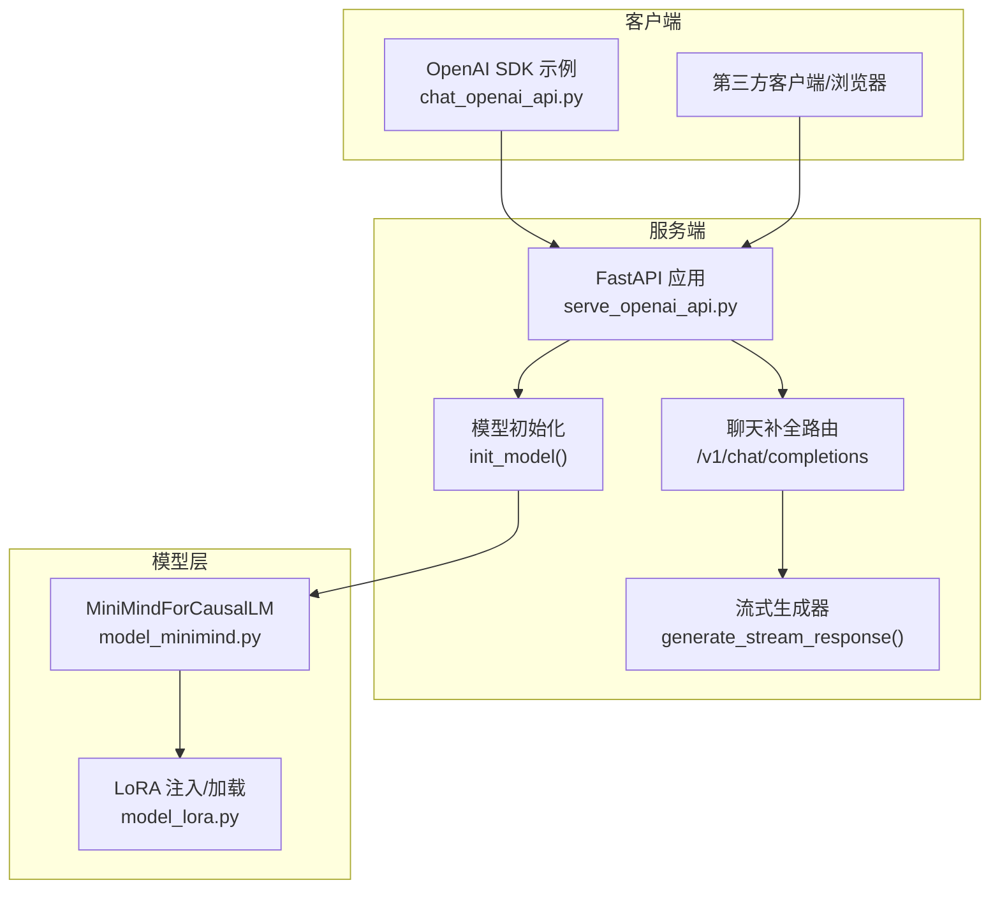
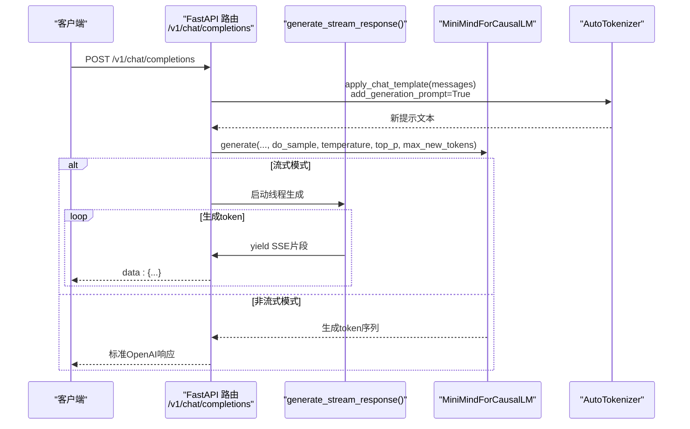
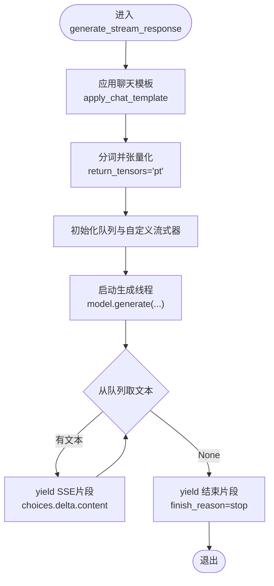
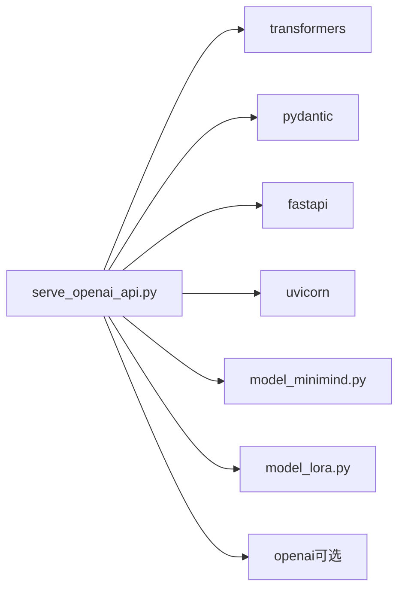

# OpenAI API兼容服务

<cite>
**本文引用的文件**
- [serve_openai_api.py](file://scripts/serve_openai_api.py)
- [chat_openai_api.py](file://scripts/chat_openai_api.py)
- [requirements.txt](file://requirements.txt)
- [model_minimind.py](file://model/model_minimind.py)
- [model_lora.py](file://model/model_lora.py)
- [README.md](file://README.md)
- [eval_llm.py](file://eval_llm.py)
- [web_demo.py](file://scripts/web_demo.py)
</cite>

## 目录
1. [简介](#简介)
2. [项目结构](#项目结构)
3. [核心组件](#核心组件)
4. [架构总览](#架构总览)
5. [详细组件分析](#详细组件分析)
6. [依赖关系分析](#依赖关系分析)
7. [性能考量](#性能考量)
8. [故障排除指南](#故障排除指南)
9. [结论](#结论)
10. [附录](#附录)

## 简介
本文件为MiniMind项目的OpenAI API兼容服务提供完整技术文档，重点围绕scripts/serve_openai_api.py的实现原理展开，涵盖：
- Flask/FastAPI服务架构与路由设计
- OpenAI API协议兼容性实现（聊天补全接口、消息格式、参数映射、响应标准化）
- 服务启动配置（端口、设备、模型加载、LoRA支持）
- 并发与流式响应处理
- 使用示例（Python SDK、curl、第三方客户端）
- 性能优化策略（内存、连接池、缓存）
- 部署、监控与故障排除

## 项目结构
该服务位于scripts目录下的serve_openai_api.py，负责将MiniMind模型暴露为OpenAI兼容的聊天补全接口。核心文件与职责如下：
- scripts/serve_openai_api.py：FastAPI服务入口，定义路由、请求体、流式生成器与模型加载逻辑
- model/model_minimind.py：MiniMind配置与模型实现（含MoE支持、RoPE缩放等）
- model/model_lora.py：LoRA低秩适配注入与加载
- scripts/chat_openai_api.py：OpenAI SDK调用示例
- requirements.txt：运行依赖（FastAPI、uvicorn、transformers、torch等）
- README.md：项目背景与OpenAI兼容说明
- eval_llm.py：推理脚本，展示apply_chat_template与生成参数
- scripts/web_demo.py：Streamlit前端，演示OpenAI SDK调用

**图表来源**
- [serve_openai_api.py:24-177](file://scripts/serve_openai_api.py#L24-L177)
- [model_minimind.py:443-477](file://model/model_minimind.py#L443-L477)
- [model_lora.py:21-50](file://model/model_lora.py#L21-L50)
- [chat_openai_api.py:1-31](file://scripts/chat_openai_api.py#L1-L31)

**章节来源**
- [serve_openai_api.py:1-178](file://scripts/serve_openai_api.py#L1-L178)
- [requirements.txt:1-31](file://requirements.txt#L1-L31)
- [README.md:119](file://README.md#L119)

## 核心组件
- FastAPI应用与路由
  - 应用实例app定义于文件顶部
  - 路由"/v1/chat/completions"处理POST请求，返回标准OpenAI格式的响应或SSE流
- 请求体模型ChatRequest
  - 字段：model、messages、temperature、top_p、max_tokens、stream、tools
  - 用于Pydantic参数校验与类型提示
- 自定义流式生成器CustomStreamer
  - 继承transformers.TextStreamer，将生成token放入队列，供SSE流推送
- generate_stream_response
  - 构造提示、调用模型generate、异步推送SSE片段
- init_model
  - 加载分词器与模型，支持原生权重与transformers格式
  - 支持LoRA权重注入与加载
- 主程序入口
  - 解析参数、初始化模型、启动uvicorn服务（默认0.0.0.0:8998）

**章节来源**
- [serve_openai_api.py:24-177](file://scripts/serve_openai_api.py#L24-L177)
- [model_minimind.py:443-477](file://model/model_minimind.py#L443-L477)
- [model_lora.py:21-50](file://model/model_lora.py#L21-L50)

## 架构总览
OpenAI兼容服务采用FastAPI + Uvicorn异步WSGI，结合transformers与自研MiniMind模型，提供标准聊天补全接口。整体交互流程如下：

**图表来源**
- [serve_openai_api.py:113-159](file://scripts/serve_openai_api.py#L113-L159)
- [serve_openai_api.py:71-111](file://scripts/serve_openai_api.py#L71-L111)
- [model_minimind.py:443-477](file://model/model_minimind.py#L443-L477)

## 详细组件分析

### FastAPI服务与路由设计
- 应用实例与中间件
  - app = FastAPI()，未显式注册中间件，保持最小依赖
- 路由"/v1/chat/completions"
  - 方法：POST
  - 请求体：ChatRequest（含messages、temperature、top_p、max_tokens、stream等）
  - 响应：
    - 非流式：返回标准OpenAI格式对象（choices[0].message.content）
    - 流式：返回text/event-stream，逐片推送choices.delta.content
- 错误处理
  - try/except包裹，捕获异常后抛出HTTPException(500)

**章节来源**
- [serve_openai_api.py:24](file://scripts/serve_openai_api.py#L24)
- [serve_openai_api.py:113-159](file://scripts/serve_openai_api.py#L113-L159)

### 请求体模型与参数映射
- ChatRequest字段
  - model：字符串，用于标识模型（兼容OpenAI风格）
  - messages：列表，OpenAI风格的消息数组
  - temperature：采样温度
  - top_p：核采样阈值
  - max_tokens：最大生成长度
  - stream：是否流式
  - tools：工具列表（兼容OpenAI，当前未使用）
- 参数映射
  - temperature/top_p映射到模型generate的采样参数
  - max_tokens映射到max_new_tokens或max_length
  - messages通过tokenizer.apply_chat_template转换为提示文本

**章节来源**
- [serve_openai_api.py:49-57](file://scripts/serve_openai_api.py#L49-L57)
- [serve_openai_api.py:113-159](file://scripts/serve_openai_api.py#L113-L159)

### 流式生成器与SSE推送
- generate_stream_response
  - 使用tokenizer.apply_chat_template构造提示
  - 创建Queue与CustomStreamer，将生成token推送到队列
  - 在独立线程中调用model.generate，主线程循环从队列取文本并yield JSON片段
  - 结束时发送空content并finish_reason=stop
- CustomStreamer
  - 继承TextStreamer，覆写on_finalized_text，将文本放入队列
  - 遇到结束标记时放入None以终止流

**图表来源**
- [serve_openai_api.py:71-111](file://scripts/serve_openai_api.py#L71-L111)
- [serve_openai_api.py:59-69](file://scripts/serve_openai_api.py#L59-L69)

**章节来源**
- [serve_openai_api.py:71-111](file://scripts/serve_openai_api.py#L71-L111)
- [serve_openai_api.py:59-69](file://scripts/serve_openai_api.py#L59-L69)

### 模型加载与LoRA支持
- init_model
  - 若load_from包含"model"，从本地权重目录加载MiniMindForCausalLM
  - 否则从transformers格式目录加载
  - 支持MoE开关与RoPE缩放配置
  - 可选加载LoRA权重（apply_lora + load_lora）
- MiniMindForCausalLM
  - 继承PreTrainedModel与GenerationMixin
  - 内部持有MiniMindModel与共享词嵌入/输出头
- LoRA实现
  - apply_lora：在满足条件的Linear层注入LoRA模块
  - load_lora/save_lora：加载/保存LoRA状态

**章节来源**
- [serve_openai_api.py:27-46](file://scripts/serve_openai_api.py#L27-L46)
- [model_minimind.py:443-477](file://model/model_minimind.py#L443-L477)
- [model_lora.py:21-50](file://model/model_lora.py#L21-L50)

### OpenAI API协议兼容性
- 路由与响应
  - 路由：/v1/chat/completions
  - 非流式响应：包含id、object、created、model、choices等字段
  - 流式响应：SSE格式，逐片推送choices.delta.content，末尾finish_reason=stop
- 消息格式
  - 使用tokenizer.apply_chat_template(messages, add_generation_prompt=True)标准化消息格式
- 参数映射
  - temperature → temperature
  - top_p → top_p
  - max_tokens → max_new_tokens 或 max_length
- 工具与系统提示
  - tools字段预留兼容OpenAI风格，当前未使用
  - 系统提示通过模板与特殊标记传递（由模板决定）

**章节来源**
- [serve_openai_api.py:113-159](file://scripts/serve_openai_api.py#L113-L159)
- [eval_llm.py:72-74](file://eval_llm.py#L72-L74)

## 依赖关系分析
- 运行时依赖
  - FastAPI、uvicorn：ASGI服务与异步WSGI
  - pydantic：请求体模型校验
  - transformers：分词器与模型加载
  - torch：张量运算与模型推理
  - openai（可选）：SDK示例
- 内部依赖
  - model_minimind.py：MiniMind配置与模型
  - model_lora.py：LoRA注入与加载

**图表来源**
- [requirements.txt:1-31](file://requirements.txt#L1-L31)
- [serve_openai_api.py:15-20](file://scripts/serve_openai_api.py#L15-L20)

**章节来源**
- [requirements.txt:1-31](file://requirements.txt#L1-L31)
- [serve_openai_api.py:15-20](file://scripts/serve_openai_api.py#L15-L20)

## 性能考量
- 内存管理
  - 使用torch.no_grad()减少反向传播开销
  - 生成时仅保留必要的attention_mask与pad/eos token id
  - 分词后立即移动到目标设备（device）
- 并发与流式
  - 流式生成通过独立线程与队列实现，避免阻塞主事件循环
  - SSE推送按块进行，降低单次响应体大小
- 模型与算子
  - MiniMind支持Flash Attention（若可用），在注意力计算中使用高效内核
  - RoPE缩放配置可提升长序列推理稳定性
- 优化建议
  - 合理设置max_tokens与max_length，避免过长序列导致显存压力
  - 在CPU设备上谨慎使用流式，建议优先使用非流式或限制并发
  - 对于高并发场景，建议使用外部反向代理（如nginx）与多进程部署

**章节来源**
- [serve_openai_api.py:133-143](file://scripts/serve_openai_api.py#L133-L143)
- [model_minimind.py:166](file://model/model_minimind.py#L166)
- [model_minimind.py:198-226](file://model/model_minimind.py#L198-L226)

## 故障排除指南
- 500错误与异常
  - 路由层捕获异常并返回HTTPException(500)，可通过日志定位
  - 常见原因：模型加载失败、分词器不匹配、CUDA内存不足
- 流式响应异常
  - 队列为空或生成线程异常：检查generate_stream_response内部逻辑
  - SSE客户端断开：uvicorn会自动清理，但需确认客户端正确处理连接
- 模型加载问题
  - transformers格式与原生权重路径不匹配：确认--load_from参数
  - LoRA权重缺失：确认--lora_weight与权重文件路径一致
- 端口占用
  - 默认端口8998被占用：通过--port参数修改（当前代码未解析端口参数，需自行修改uvicorn.run）

**章节来源**
- [serve_openai_api.py:158-159](file://scripts/serve_openai_api.py#L158-L159)
- [serve_openai_api.py:176-177](file://scripts/serve_openai_api.py#L176-L177)

## 结论
本OpenAI API兼容服务以轻量实现提供了MiniMind模型的标准化接入能力，具备：
- 完整的聊天补全接口与SSE流式响应
- 与OpenAI SDK与第三方客户端的良好兼容
- 可扩展的模型加载与LoRA支持
- 易于部署与性能优化的空间

建议在生产环境中结合反向代理、连接池与监控系统，进一步提升稳定性与可观测性。

## 附录

### 启动与配置
- 启动命令
  - python scripts/serve_openai_api.py
  - 默认监听0.0.0.0:8998
- 关键参数（命令行）
  - --load_from：模型加载路径（原生权重或transformers格式）
  - --save_dir：权重目录
  - --weight：权重前缀（如full_sft）
  - --lora_weight：LoRA权重名称（None表示不使用）
  - --hidden_size、--num_hidden_layers、--max_seq_len、--use_moe、--inference_rope_scaling、--device
- 端口设置
  - 当前代码固定端口8998；如需修改端口，需在uvicorn.run处调整

**章节来源**
- [serve_openai_api.py:162-177](file://scripts/serve_openai_api.py#L162-L177)

### API使用示例

- Python SDK调用（OpenAI）
  - 参考scripts/chat_openai_api.py，设置base_url为http://127.0.0.1:8998/v1
  - 使用client.chat.completions.create传入messages与stream参数
- curl命令测试
  - 非流式：curl -X POST http://127.0.0.1:8998/v1/chat/completions -H "Content-Type: application/json" -d '{"model":"minimind","messages":[{"role":"user","content":"你好"}],"temperature":0.7,"top_p":0.92,"max_tokens":128,"stream":false}'
  - 流式：curl -N -X POST http://127.0.0.1:8998/v1/chat/completions -H "Content-Type: application/json" -d '{"model":"minimind","messages":[{"role":"user","content":"你好"}],"temperature":0.7,"top_p":0.92,"max_tokens":128,"stream":true}'
- 第三方客户端集成
  - Streamlit前端web_demo.py中展示了OpenAI SDK调用方式，可参考其base_url与参数传递

**章节来源**
- [chat_openai_api.py:1-31](file://scripts/chat_openai_api.py#L1-L31)
- [web_demo.py:252-276](file://scripts/web_demo.py#L252-L276)

### 部署与监控
- 部署建议
  - 使用uvicorn多进程或多实例部署，结合nginx反向代理
  - 将端口参数化，便于容器化与CI/CD
- 监控
  - 记录请求/响应耗时、错误率与队列长度
  - 监控GPU/CPU利用率与显存占用
- 日志
  - 在异常处理中输出详细日志，便于定位问题

**章节来源**
- [serve_openai_api.py:158-159](file://scripts/serve_openai_api.py#L158-L159)