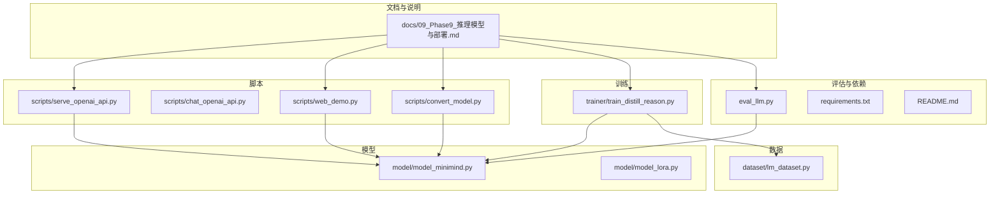
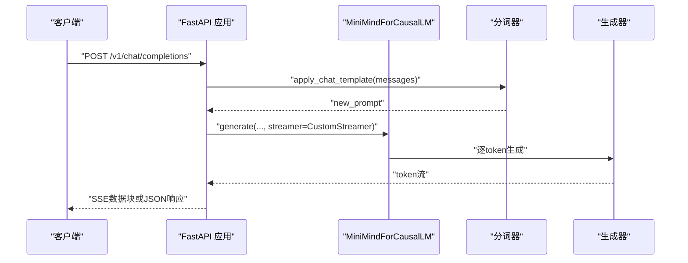
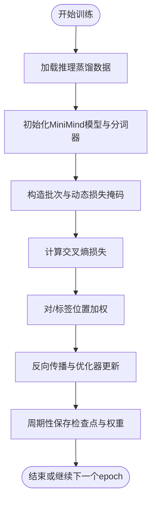
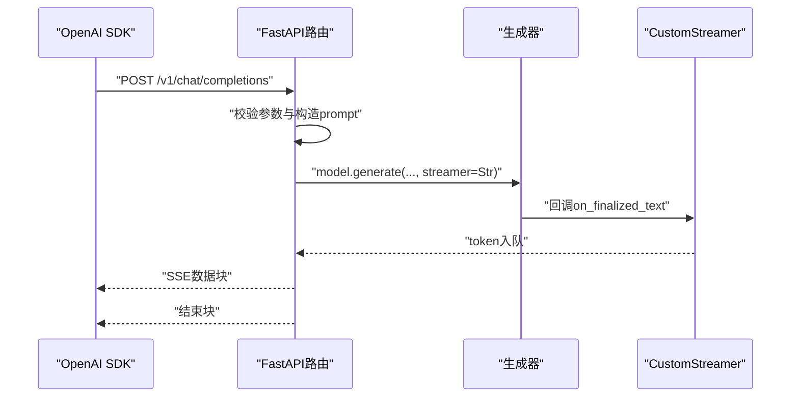
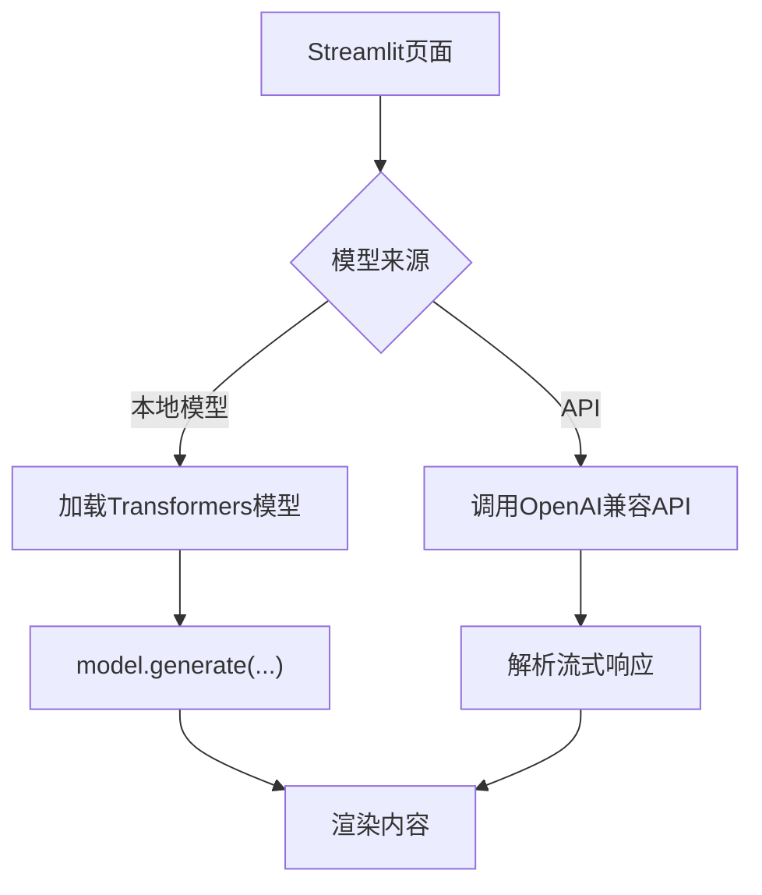
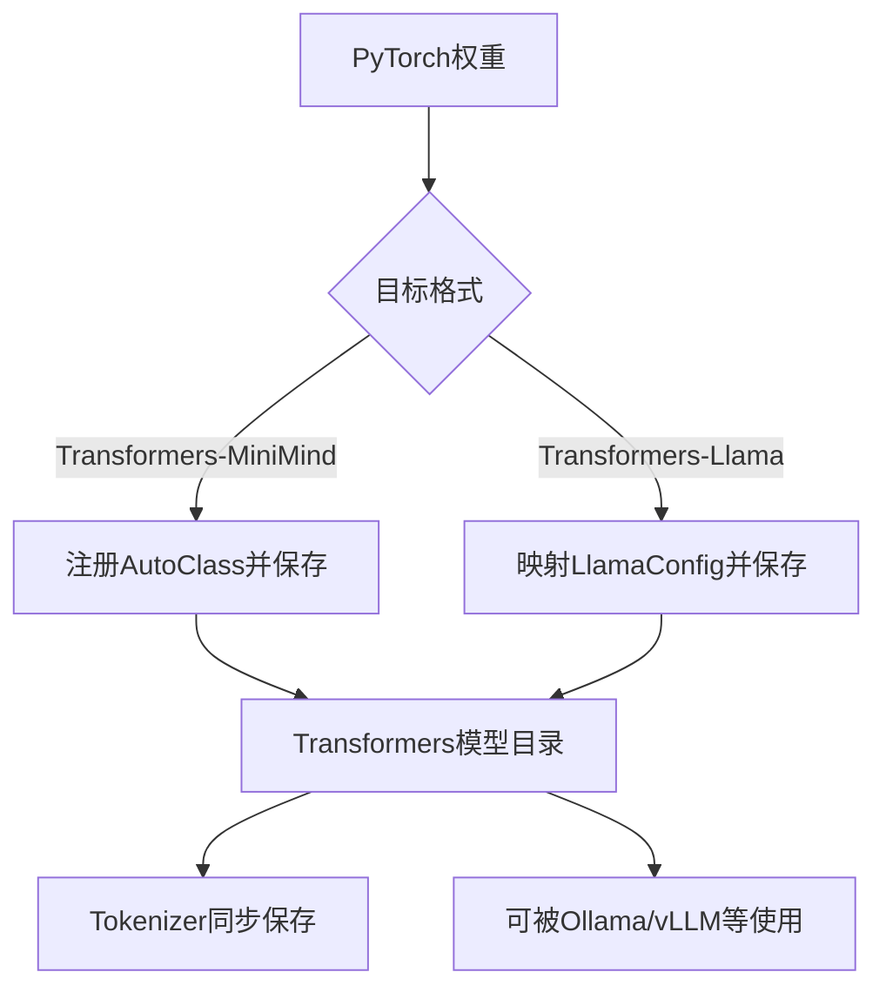
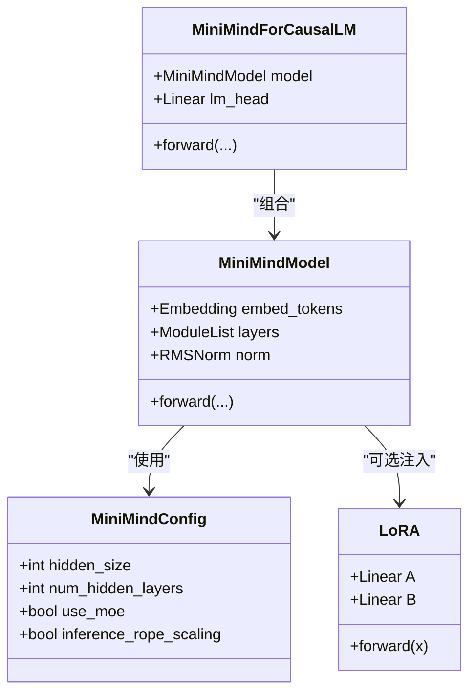
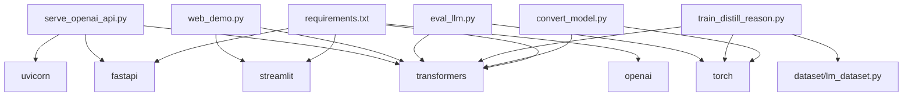

# Phase 9: 推理模型与部署

<cite>
**本文引用的文件**   
- [docs/09_Phase9_推理模型与部署.md](file://docs/09_Phase9_推理模型与部署.md)
- [scripts/serve_openai_api.py](file://scripts/serve_openai_api.py)
- [scripts/chat_openai_api.py](file://scripts/chat_openai_api.py)
- [scripts/web_demo.py](file://scripts/web_demo.py)
- [scripts/convert_model.py](file://scripts/convert_model.py)
- [trainer/train_distill_reason.py](file://trainer/train_distill_reason.py)
- [eval_llm.py](file://eval_llm.py)
- [model/model_minimind.py](file://model/model_minimind.py)
- [model/model_lora.py](file://model/model_lora.py)
- [dataset/lm_dataset.py](file://dataset/lm_dataset.py)
- [requirements.txt](file://requirements.txt)
- [README.md](file://README.md)
</cite>

## 目录
1. [引言](#引言)
2. [项目结构](#项目结构)
3. [核心组件](#核心组件)
4. [架构总览](#架构总览)
5. [详细组件分析](#详细组件分析)
6. [依赖关系分析](#依赖关系分析)
7. [性能考量](#性能考量)
8. [故障排查指南](#故障排查指南)
9. [结论](#结论)
10. [附录](#附录)

## 引言
本阶段聚焦于“推理模型与部署”，围绕以下目标展开：
- 掌握推理模型的蒸馏训练方法，理解如何通过教师模型的思考链数据引导学生模型学会“先思考再回答”的模式
- 学习模型部署与服务化，包括 OpenAI API 兼容服务、Flask/FastAPI 服务、Streamlit WebUI、第三方推理引擎（如 Ollama、vLLM）以及 llama.cpp 的本地部署
- 掌握模型格式转换工具，打通 PyTorch 原生权重与 Transformers 生态之间的互操作
- 完成从训练到部署的完整闭环，并具备性能基准测试、错误处理与日志记录、资源优化与扩展性设计的能力

## 项目结构
仓库按功能模块组织，核心与本阶段相关的关键目录与文件如下：
- docs：阶段文档，包含推理蒸馏、部署与评估的总体说明
- scripts：推理服务与演示脚本（OpenAI API 服务、Web UI、模型转换）
- trainer：训练脚本（含推理蒸馏）
- model：模型定义与 LoRA 实现
- dataset：数据集封装（SFT/Reward 等）
- eval_llm.py：命令行推理与对话测试
- requirements.txt：依赖清单

图表来源
- [docs/09_Phase9_推理模型与部署.md:1-294](file://docs/09_Phase9_推理模型与部署.md#L1-L294)
- [scripts/serve_openai_api.py:1-178](file://scripts/serve_openai_api.py#L1-L178)
- [scripts/web_demo.py:1-329](file://scripts/web_demo.py#L1-L329)
- [scripts/convert_model.py:1-76](file://scripts/convert_model.py#L1-L76)
- [trainer/train_distill_reason.py:1-175](file://trainer/train_distill_reason.py#L1-L175)
- [eval_llm.py:1-89](file://eval_llm.py#L1-L89)
- [model/model_minimind.py:1-475](file://model/model_minimind.py#L1-L475)
- [model/model_lora.py:1-50](file://model/model_lora.py#L1-L50)
- [dataset/lm_dataset.py:1-250](file://dataset/lm_dataset.py#L1-L250)
- [requirements.txt:1-31](file://requirements.txt#L1-L31)
- [README.md:208-267](file://README.md#L208-L267)

章节来源
- [docs/09_Phase9_推理模型与部署.md:1-294](file://docs/09_Phase9_推理模型与部署.md#L1-L294)
- [README.md:208-267](file://README.md#L208-L267)

## 核心组件
- 推理蒸馏训练：通过特殊损失加权，强制模型在“思考”与“答案”标签位置学习正确的格式，提升推理能力
- OpenAI API 兼容服务：基于 FastAPI 提供 /v1/chat/completions，支持流式与非流式响应
- Streamlit WebUI：本地 Web 聊天界面，支持本地模型与 API 两种来源
- 模型转换工具：在 PyTorch 原生权重与 Transformers 格式之间互转，兼容 Llama 结构以适配第三方生态
- 模型与 LoRA：MiniMind 架构、Attention/RMSNorm/FeedForward/MoE、LoRA 注入与加载
- 数据集：SFTDataset 动态损失掩码、推理数据格式适配
- 评估与部署：命令行推理、第三方引擎（Ollama、vLLM）、YaRN 长度外推

章节来源
- [trainer/train_distill_reason.py:23-92](file://trainer/train_distill_reason.py#L23-L92)
- [scripts/serve_openai_api.py:49-160](file://scripts/serve_openai_api.py#L49-L160)
- [scripts/web_demo.py:98-329](file://scripts/web_demo.py#L98-L329)
- [scripts/convert_model.py:14-76](file://scripts/convert_model.py#L14-L76)
- [model/model_minimind.py:8-475](file://model/model_minimind.py#L8-L475)
- [model/model_lora.py:21-50](file://model/model_lora.py#L21-L50)
- [dataset/lm_dataset.py:54-125](file://dataset/lm_dataset.py#L54-L125)
- [eval_llm.py:32-89](file://eval_llm.py#L32-L89)

## 架构总览
下图展示推理服务从请求到响应的端到端流程，包括 OpenAI 兼容 API、模型加载、生成与流式返回。

图表来源
- [scripts/serve_openai_api.py:113-159](file://scripts/serve_openai_api.py#L113-L159)
- [model/model_minimind.py:441-475](file://model/model_minimind.py#L441-L475)

## 详细组件分析

### 推理蒸馏训练
- 数据准备：使用整合自 DeepSeek-R1 的推理蒸馏数据集，格式为包含多轮对话的 JSONL
- 特殊损失加权：对<think>、</think>、<answer>、</answer>等标签位置增加权重，避免模型“忘记”使用推理标签
- 训练入口：trainer/train_distill_reason.py，支持分布式训练、混合精度、梯度累积与检查点恢复
- 训练后模型：保存为 reason_*.pth，可通过 eval_llm.py 进行推理测试

图表来源
- [trainer/train_distill_reason.py:23-92](file://trainer/train_distill_reason.py#L23-L92)
- [dataset/lm_dataset.py:54-125](file://dataset/lm_dataset.py#L54-L125)

章节来源
- [docs/09_Phase9_推理模型与部署.md:29-101](file://docs/09_Phase9_推理模型与部署.md#L29-L101)
- [trainer/train_distill_reason.py:94-175](file://trainer/train_distill_reason.py#L94-L175)
- [dataset/lm_dataset.py:54-125](file://dataset/lm_dataset.py#L54-L125)

### OpenAI API 兼容服务
- 服务入口：scripts/serve_openai_api.py，基于 FastAPI 提供 /v1/chat/completions
- 支持参数：temperature、top_p、max_tokens、stream、tools 等
- 流式输出：通过自定义 TextStreamer 与队列实现 SSE 数据块
- 模型加载：支持从 PyTorch 原生权重或 Transformers 模型加载；可选 LoRA 注入
- 错误处理：捕获异常并返回 HTTP 500

图表来源
- [scripts/serve_openai_api.py:49-160](file://scripts/serve_openai_api.py#L49-L160)

章节来源
- [docs/09_Phase9_推理模型与部署.md:120-147](file://docs/09_Phase9_推理模型与部署.md#L120-L147)
- [scripts/serve_openai_api.py:162-178](file://scripts/serve_openai_api.py#L162-L178)

### Streamlit WebUI
- 本地模型与 API 双模式：可直接加载 Transformers 模型或连接 OpenAI 兼容 API
- 推理内容渲染：对<think>与</think>包裹细节标签，支持展开/折叠
- 交互控制：历史对话轮数、最大生成长度、温度等参数滑条
- 流式显示：使用 TextIteratorStreamer 实时展示生成内容

图表来源
- [scripts/web_demo.py:98-329](file://scripts/web_demo.py#L98-L329)

章节来源
- [docs/09_Phase9_推理模型与部署.md:148-155](file://docs/09_Phase9_推理模型与部署.md#L148-L155)
- [scripts/web_demo.py:207-329](file://scripts/web_demo.py#L207-L329)

### 模型转换工具
- PyTorch → Transformers：注册 MiniMind AutoClass，保存为 Transformers-MiniMind 格式
- PyTorch → Transformers（Llama兼容）：映射配置字段，生成 LlamaForCausalLM，便于第三方生态使用
- Transformers → PyTorch：从 Transformers 加载权重并保存为 PyTorch 状态字典

图表来源
- [scripts/convert_model.py:14-76](file://scripts/convert_model.py#L14-L76)

章节来源
- [docs/09_Phase9_推理模型与部署.md:174-185](file://docs/09_Phase9_推理模型与部署.md#L174-L185)
- [scripts/convert_model.py:65-76](file://scripts/convert_model.py#L65-L76)

### 模型与LoRA
- MiniMind 架构：Config/Model/ForCausalLM 三层结构，支持 RMSNorm、Attention（含 RoPE 与 KV 重复）、FFN/MoE
- LoRA 注入：在特定 Linear 层叠加低秩增量，训练时仅优化 LoRA 参数，推理时与主权重相加
- 推理测试：eval_llm.py 支持不同权重、LoRA、温度、top_p、历史对话等参数

图表来源
- [model/model_minimind.py:8-475](file://model/model_minimind.py#L8-L475)
- [model/model_lora.py:21-50](file://model/model_lora.py#L21-L50)

章节来源
- [model/model_minimind.py:8-475](file://model/model_minimind.py#L8-L475)
- [model/model_lora.py:21-50](file://model/model_lora.py#L21-L50)
- [eval_llm.py:12-31](file://eval_llm.py#L12-L31)

### 数据集与推理格式
- SFTDataset：根据 ChatML 构造对话提示，动态生成损失掩码，仅对 assistant 输出部分计算损失
- 推理蒸馏数据：要求包含<think>与</think>、<answer>与</answer>标签，用于格式与内容奖励

章节来源
- [dataset/lm_dataset.py:54-125](file://dataset/lm_dataset.py#L54-L125)
- [trainer/train_distill_reason.py:23-60](file://trainer/train_distill_reason.py#L23-L60)

### 第三方推理引擎与部署
- Ollama：直接运行官方镜像进行本地推理
- vLLM：通过 vllm serve 启动高性能服务，支持多模型命名
- llama.cpp：兼容 CPU 推理与量化部署，适合边缘设备

章节来源
- [docs/09_Phase9_推理模型与部署.md:156-173](file://docs/09_Phase9_推理模型与部署.md#L156-L173)

### YaRN 长度外推
- 在 MiniMindConfig 中启用 inference_rope_scaling，使用 YaRN 算法对外推位置编码进行缩放，支持更长上下文

章节来源
- [docs/09_Phase9_推理模型与部署.md:202-212](file://docs/09_Phase9_推理模型与部署.md#L202-L212)
- [model/model_minimind.py:57-64](file://model/model_minimind.py#L57-L64)

## 依赖关系分析
- 服务端依赖：FastAPI、uvicorn、transformers、torch、pydantic
- WebUI 依赖：streamlit、transformers、torch
- 训练与评估：torch、transformers、datasets、accelerate（通过 trainer_utils 间接使用）
- 第三方生态：openai（SDK）、ollama、vLLM

图表来源
- [requirements.txt:1-31](file://requirements.txt#L1-L31)
- [scripts/serve_openai_api.py:15-21](file://scripts/serve_openai_api.py#L15-L21)
- [scripts/web_demo.py:326-329](file://scripts/web_demo.py#L326-L329)
- [eval_llm.py:6-10](file://eval_llm.py#L6-L10)
- [trainer/train_distill_reason.py:16-18](file://trainer/train_distill_reason.py#L16-L18)
- [scripts/convert_model.py:8-9](file://scripts/convert_model.py#L8-L9)

章节来源
- [requirements.txt:1-31](file://requirements.txt#L1-L31)

## 性能考量
- 推理蒸馏损失加权：对<think>/<answer>标签位置提高权重，有助于稳定推理格式
- 混合精度与梯度累积：训练脚本支持 bfloat16/float16 与梯度累积，降低显存占用
- Flash Attention：在满足条件时使用 Scaled Dot Product Attention，提升注意力计算效率
- KV Cache：MiniMind 支持 past_key_values，减少重复计算
- YaRN 外推：通过位置编码外推提升长上下文能力
- WebUI 流式渲染：减少等待时间，改善交互体验
- 第三方引擎：Ollama、vLLM、llama.cpp 提供不同场景下的高性能与低资源占用方案

章节来源
- [trainer/train_distill_reason.py:129-132](file://trainer/train_distill_reason.py#L129-L132)
- [model/model_minimind.py:166-224](file://model/model_minimind.py#L166-L224)
- [model/model_minimind.py:401-438](file://model/model_minimind.py#L401-L438)
- [docs/09_Phase9_推理模型与部署.md:202-212](file://docs/09_Phase9_推理模型与部署.md#L202-L212)
- [scripts/web_demo.py:277-315](file://scripts/web_demo.py#L277-L315)

## 故障排查指南
- OpenAI API 服务异常
  - 现象：HTTP 500 或无响应
  - 排查：确认模型加载路径与权重文件是否存在；检查设备与 dtype 设置；查看日志输出
  - 参考：[scripts/serve_openai_api.py:158-159](file://scripts/serve_openai_api.py#L158-L159)
- WebUI 无法连接 API
  - 现象：前端报错或空白响应
  - 排查：确认 API 地址、模型 ID、密钥；检查网络连通性；查看浏览器控制台
  - 参考：[scripts/web_demo.py:252-277](file://scripts/web_demo.py#L252-L277)
- 推理格式不正确
  - 现象：回答缺少<think>或</think>标签
  - 排查：确认训练时是否启用损失加权；推理权重是否为 reason_*；eval_llm 是否传入 enable_thinking
  - 参考：[trainer/train_distill_reason.py:47-57](file://trainer/train_distill_reason.py#L47-L57)、[eval_llm.py:73-74](file://eval_llm.py#L73-L74)
- 模型转换失败
  - 现象：保存失败或第三方引擎无法加载
  - 排查：确认输入权重路径与配置；使用 Llama 兼容转换以适配第三方生态
  - 参考：[scripts/convert_model.py:32-55](file://scripts/convert_model.py#L32-L55)
- 依赖缺失
  - 现象：导入错误或运行时报错
  - 排查：安装 requirements.txt 中的依赖
  - 参考：[requirements.txt:1-31](file://requirements.txt#L1-L31)

章节来源
- [scripts/serve_openai_api.py:158-159](file://scripts/serve_openai_api.py#L158-L159)
- [scripts/web_demo.py:252-277](file://scripts/web_demo.py#L252-L277)
- [trainer/train_distill_reason.py:47-57](file://trainer/train_distill_reason.py#L47-L57)
- [eval_llm.py:73-74](file://eval_llm.py#L73-L74)
- [scripts/convert_model.py:32-55](file://scripts/convert_model.py#L32-L55)
- [requirements.txt:1-31](file://requirements.txt#L1-L31)

## 结论
本阶段系统性地完成了推理模型的蒸馏训练与部署落地，覆盖了从数据准备、模型训练、格式转换到服务化与第三方引擎集成的完整链路。通过 OpenAI 兼容 API、Streamlit WebUI 与多种推理引擎，实现了跨平台、多场景的部署方案。结合 YaRN 外推、LoRA 参数高效微调与混合精度训练，能够在有限资源下获得更优的性能与成本平衡。

## 附录
- 快速开始
  - 启动 OpenAI 兼容服务：[scripts/serve_openai_api.py:162-178](file://scripts/serve_openai_api.py#L162-L178)
  - 启动 WebUI：[scripts/web_demo.py:207-329](file://scripts/web_demo.py#L207-L329)
  - 推理测试：[eval_llm.py:32-89](file://eval_llm.py#L32-L89)
  - 推理蒸馏训练：[trainer/train_distill_reason.py:94-175](file://trainer/train_distill_reason.py#L94-L175)
  - 模型转换：[scripts/convert_model.py:65-76](file://scripts/convert_model.py#L65-L76)
- 参考资源
  - [docs/09_Phase9_推理模型与部署.md:288-294](file://docs/09_Phase9_推理模型与部署.md#L288-L294)
  - [README.md:208-267](file://README.md#L208-L267)