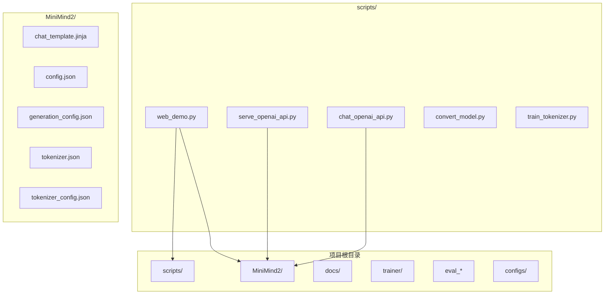
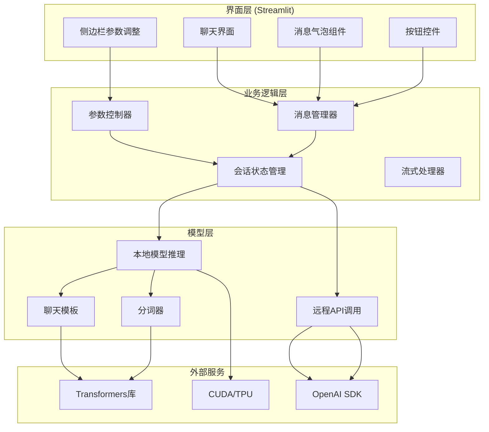
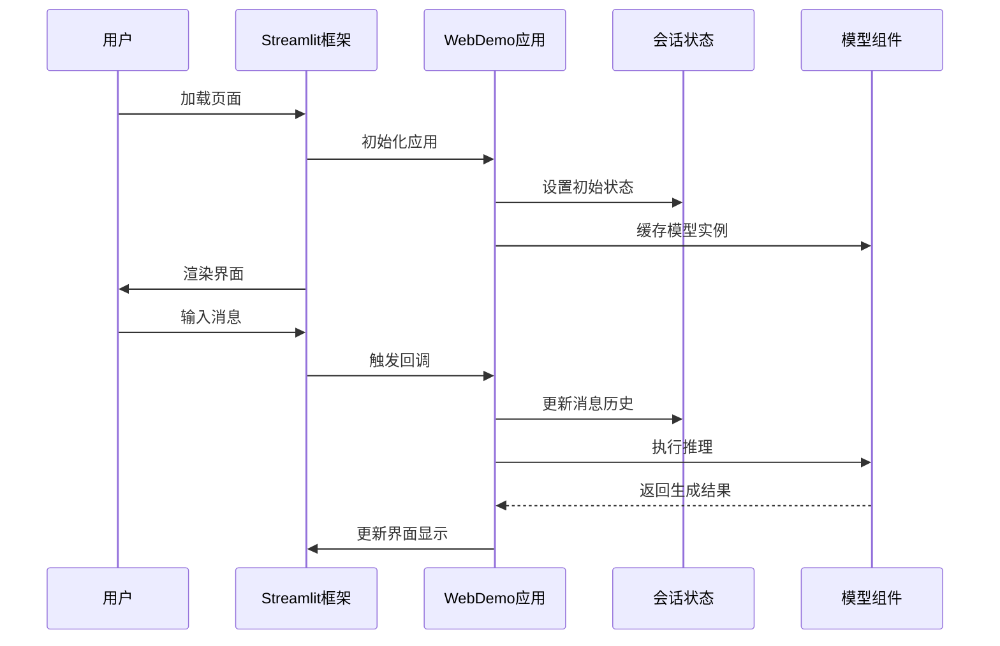
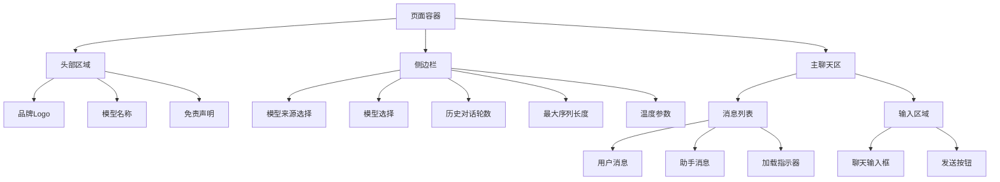
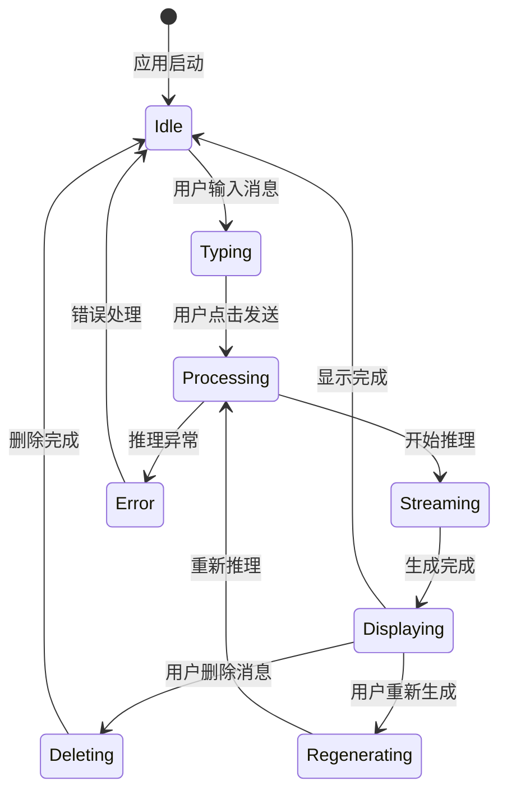
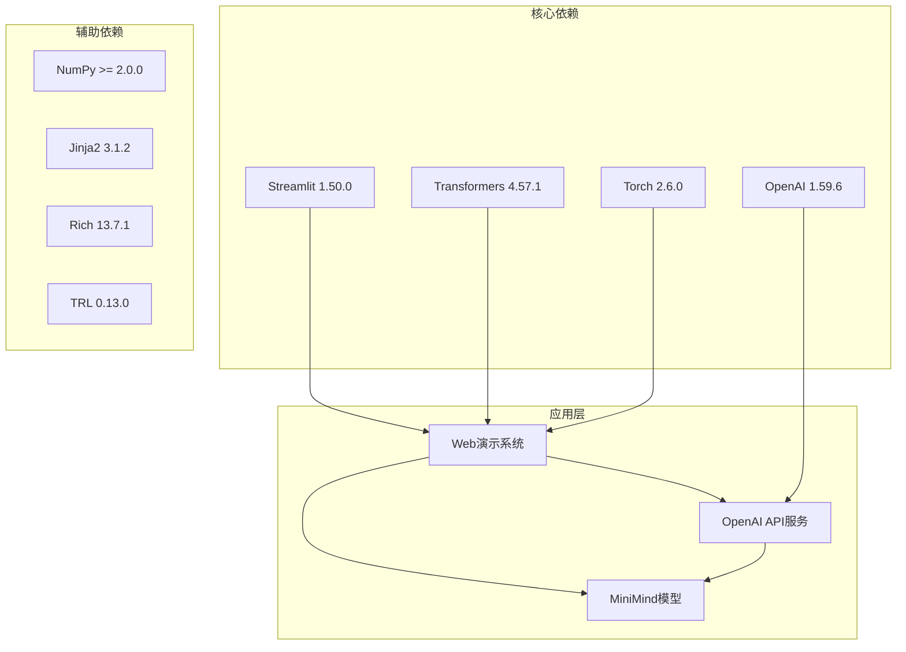

# Web界面演示系统

<cite>
**本文档引用的文件**
- [web_demo.py](file://scripts/web_demo.py)
- [requirements.txt](file://requirements.txt)
- [README.md](file://README.md)
- [chat_template.jinja](file://MiniMind2/chat_template.jinja)
- [config.json](file://MiniMind2/config.json)
- [generation_config.json](file://MiniMind2/generation_config.json)
- [serve_openai_api.py](file://scripts/serve_openai_api.py)
</cite>

## 目录
1. [简介](#简介)
2. [项目结构](#项目结构)
3. [核心组件](#核心组件)
4. [架构概览](#架构概览)
5. [详细组件分析](#详细组件分析)
6. [依赖分析](#依赖分析)
7. [性能考虑](#性能考虑)
8. [故障排除指南](#故障排除指南)
9. [结论](#结论)
10. [附录](#附录)

## 简介
本文件为MiniMind项目的Web界面演示系统技术文档，重点解析scripts/web_demo.py的实现架构。该系统基于Streamlit框架构建，提供了一个简洁直观的聊天界面，支持本地模型推理和远程API调用两种模式。文档将深入分析界面布局设计、用户交互逻辑、消息显示与处理、历史记录管理、实时响应机制，以及界面组件的设计思路（消息气泡样式、滚动机制、加载状态和错误提示）。同时提供完整的部署和运行指南、定制化选项说明、用户体验优化建议、响应式设计考虑和无障碍访问支持策略，帮助开发者理解和扩展Web演示界面功能。

## 项目结构
MiniMind项目采用模块化组织方式，Web演示系统位于scripts目录下的web_demo.py文件中。该项目的核心模型位于MiniMind2目录，包含配置文件、分词器配置和推理模板。README.md提供了详细的项目背景、快速开始指南和部署说明。requirements.txt列出了项目依赖，包括Streamlit、Transformers、PyTorch等关键组件。

**图表来源**
- [web_demo.py:1-329](file://scripts/web_demo.py#L1-L329)
- [README.md:1-800](file://README.md#L1-L800)

**章节来源**
- [web_demo.py:1-329](file://scripts/web_demo.py#L1-L329)
- [README.md:208-268](file://README.md#L208-L268)

## 核心组件
Web演示系统的核心组件包括：

1. **Streamlit应用主体**：负责页面配置、侧边栏参数调整、主聊天界面渲染
2. **模型加载与缓存**：使用@st.cache_resource装饰器缓存模型和分词器实例
3. **消息管理系统**：维护用户消息和助手消息的历史记录
4. **推理引擎**：支持本地模型推理和远程API调用两种模式
5. **界面样式系统**：通过CSS样式表定制按钮、消息气泡和整体布局
6. **实时流式响应**：使用TextIteratorStreamer实现生成过程的实时展示

**章节来源**
- [web_demo.py:98-109](file://scripts/web_demo.py#L98-L109)
- [web_demo.py:117-138](file://scripts/web_demo.py#L117-L138)
- [web_demo.py:207-323](file://scripts/web_demo.py#L207-L323)

## 架构概览
Web演示系统采用分层架构设计，清晰分离界面层、业务逻辑层和模型层：

**图表来源**
- [web_demo.py:154-183](file://scripts/web_demo.py#L154-L183)
- [web_demo.py:207-323](file://scripts/web_demo.py#L207-L323)

## 详细组件分析

### Streamlit框架集成
Web演示系统基于Streamlit 1.50.0构建，充分利用其声明式UI特性和自动状态管理能力。系统通过st.set_page_config配置页面标题和初始侧边栏状态，使用st.markdown实现自定义CSS样式注入，为整个应用提供统一的视觉风格。

**图表来源**
- [web_demo.py:9-65](file://scripts/web_demo.py#L9-L65)
- [web_demo.py:207-323](file://scripts/web_demo.py#L207-L323)

**章节来源**
- [web_demo.py:9-65](file://scripts/web_demo.py#L9-L65)
- [web_demo.py:207-323](file://scripts/web_demo.py#L207-L323)

### 界面布局设计
系统采用简洁的布局设计，主要包含三个区域：

1. **顶部品牌区**：显示Logo和模型名称，提供品牌识别
2. **侧边栏控制区**：提供模型参数调整和选择
3. **主聊天区**：显示消息历史和实时生成

**图表来源**
- [web_demo.py:154-194](file://scripts/web_demo.py#L154-L194)
- [web_demo.py:217-232](file://scripts/web_demo.py#L217-L232)

**章节来源**
- [web_demo.py:154-194](file://scripts/web_demo.py#L154-L194)
- [web_demo.py:217-232](file://scripts/web_demo.py#L217-L232)

### 用户交互逻辑
系统实现了完整的用户交互流程，包括消息输入、历史记录管理和实时响应：

**图表来源**
- [web_demo.py:232-323](file://scripts/web_demo.py#L232-L323)
- [web_demo.py:112-151](file://scripts/web_demo.py#L112-L151)

**章节来源**
- [web_demo.py:232-323](file://scripts/web_demo.py#L232-L323)
- [web_demo.py:112-151](file://scripts/web_demo.py#L112-L151)

### 聊天界面功能实现
聊天界面的核心功能包括消息显示、输入处理、历史记录管理和实时响应：

#### 消息显示机制
系统为用户消息和助手消息分别设计了不同的显示样式：
- 用户消息：右对齐的灰色圆角气泡
- 助手消息：左对齐的蓝色圆角气泡，支持HTML内容渲染
- 删除按钮：每个消息右侧提供删除按钮

#### 输入处理逻辑
用户输入通过st.chat_input捕获，系统会：
- 截取最大长度限制的消息内容
- 自动更新会话状态
- 触发推理流程

#### 历史记录管理
系统维护两套消息历史：
- messages：完整的消息历史
- chat_messages：用于推理的聊天模板消息

#### 实时响应机制
使用TextIteratorStreamer实现流式生成，实时更新界面显示。

**章节来源**
- [web_demo.py:117-138](file://scripts/web_demo.py#L117-L138)
- [web_demo.py:241-323](file://scripts/web_demo.py#L241-L323)

### 界面组件设计思路
系统在界面组件设计上注重用户体验和可访问性：

#### 消息气泡样式
- 圆角设计：提升视觉舒适度
- 颜色区分：用户消息使用灰色，助手消息使用蓝色
- 对齐方式：用户消息右对齐，助手消息左对齐
- 内边距：合理的内边距确保内容可读性

#### 滚动机制
- 自动滚动：新消息到达时自动滚动到底部
- 滚动条：支持垂直滚动条浏览历史消息

#### 加载状态
- 占位符：生成过程中显示占位符
- 实时更新：流式生成时实时更新显示内容

#### 错误提示
- 异常捕获：API调用异常时显示错误信息
- 用户友好：错误信息以HTML格式显示，易于理解

**章节来源**
- [web_demo.py:248-276](file://scripts/web_demo.py#L248-L276)
- [web_demo.py:277-314](file://scripts/web_demo.py#L277-L314)

### 推理引擎实现
系统支持两种推理模式：本地模型推理和远程API调用。

#### 本地模型推理
使用Transformers库的AutoModelForCausalLM和AutoTokenizer：
- 模型缓存：使用@st.cache_resource装饰器缓存模型实例
- 分词器应用：使用apply_chat_template生成聊天模板
- 流式生成：使用TextIteratorStreamer实现实时响应
- 参数控制：支持温度、最大长度等参数调整

#### 远程API调用
通过OpenAI兼容的API接口：
- 流式响应：使用OpenAI SDK的流式接口
- 错误处理：捕获并显示API调用异常
- 参数传递：将温度等参数传递给远程服务

**章节来源**
- [web_demo.py:98-109](file://scripts/web_demo.py#L98-L109)
- [web_demo.py:251-276](file://scripts/web_demo.py#L251-L276)
- [web_demo.py:277-314](file://scripts/web_demo.py#L277-L314)

## 依赖分析
Web演示系统依赖于多个关键库，形成完整的推理和界面生态系统：

**图表来源**
- [requirements.txt:1-31](file://requirements.txt#L1-L31)
- [web_demo.py:326-328](file://scripts/web_demo.py#L326-L328)

**章节来源**
- [requirements.txt:1-31](file://requirements.txt#L1-L31)
- [web_demo.py:326-328](file://scripts/web_demo.py#L326-L328)

## 性能考虑
Web演示系统在性能方面采取了多项优化措施：

1. **模型缓存**：使用@st.cache_resource装饰器缓存模型和分词器实例，避免重复加载
2. **设备选择**：自动检测CUDA可用性，优先使用GPU加速
3. **内存管理**：合理设置最大序列长度，避免内存溢出
4. **流式生成**：使用TextIteratorStreamer实现流式响应，提升用户体验
5. **会话状态**：使用st.session_state管理状态，避免不必要的重新渲染

## 故障排除指南
常见问题及解决方案：

### 模型加载失败
- 检查模型路径是否正确
- 确认模型文件完整性
- 验证CUDA驱动版本兼容性

### 推理性能问题
- 调整max_new_tokens参数
- 降低temperature值
- 检查GPU内存使用情况

### API连接问题
- 验证API URL和密钥
- 检查网络连接
- 确认API服务可用性

**章节来源**
- [web_demo.py:274-276](file://scripts/web_demo.py#L274-L276)

## 结论
MiniMind的Web界面演示系统通过Streamlit框架实现了简洁高效的聊天界面，支持本地模型推理和远程API调用两种模式。系统采用模块化设计，具有良好的可扩展性和维护性。通过合理的界面设计和交互逻辑，为用户提供了流畅的聊天体验。开发者可以根据需要扩展功能，如添加更多模型支持、改进界面样式或增强交互能力。

## 附录

### 部署和运行指南
1. **环境准备**：安装Python 3.10+和pip
2. **依赖安装**：`pip install -r requirements.txt`
3. **模型下载**：克隆MiniMind2模型到项目根目录
4. **启动应用**：`streamlit run scripts/web_demo.py`

### 定制化选项
1. **主题切换**：通过修改CSS样式实现主题定制
2. **参数调整**：在侧边栏调整历史对话轮数、最大序列长度、温度等参数
3. **功能扩展**：可添加更多模型支持、消息类型或交互功能

### 用户体验优化建议
1. **响应式设计**：适配不同屏幕尺寸
2. **无障碍访问**：添加键盘导航和屏幕阅读器支持
3. **性能优化**：实现消息虚拟化、延迟加载等功能
4. **错误处理**：提供更友好的错误提示和恢复机制

**章节来源**
- [README.md:252-258](file://README.md#L252-L258)
- [web_demo.py:157-160](file://scripts/web_demo.py#L157-L160)