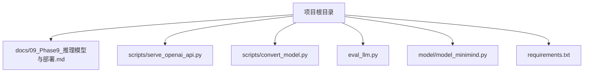
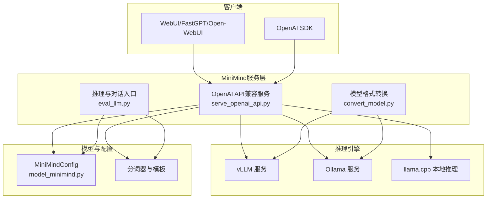
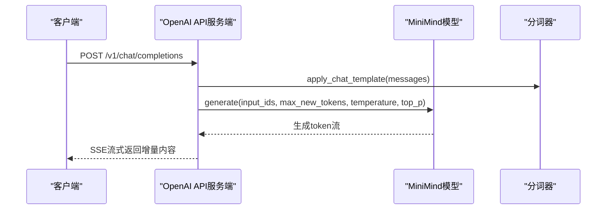
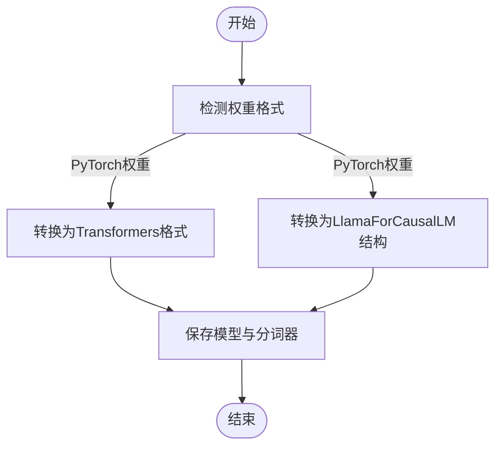
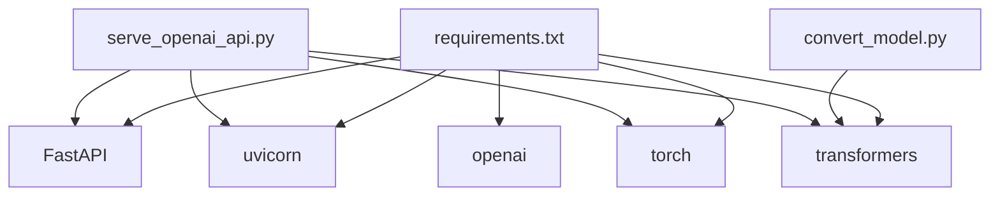

# 多引擎部署方案

<cite>
**本文档引用的文件**
- [README.md](file://README.md)
- [README_en.md](file://README_en.md)
- [requirements.txt](file://requirements.txt)
- [docs/09_Phase9_推理模型与部署.md](file://docs/09_Phase9_推理模型与部署.md)
- [scripts/serve_openai_api.py](file://scripts/serve_openai_api.py)
- [scripts/chat_openai_api.py](file://scripts/chat_openai_api.py)
- [scripts/convert_model.py](file://scripts/convert_model.py)
- [eval_llm.py](file://eval_llm.py)
- [model/model_minimind.py](file://model/model_minimind.py)
- [eval_benchmark.py](file://eval_benchmark.py)
</cite>

## 目录
1. [简介](#简介)
2. [项目结构](#项目结构)
3. [核心组件](#核心组件)
4. [架构总览](#架构总览)
5. [详细组件分析](#详细组件分析)
6. [依赖分析](#依赖分析)
7. [性能考量](#性能考量)
8. [故障排除指南](#故障排除指南)
9. [结论](#结论)
10. [附录](#附录)

## 简介
本方案围绕MiniMind项目，系统化梳理多引擎推理部署路径，覆盖Ollama容器化部署、vLLM高性能服务与llama.cpp本地推理三种主流方案。文档从技术特性、资源配置、性能表现、扩展性与易用性等维度进行对比，提供配置参数与优化策略、部署命令与配置示例、适用场景与限制条件、监控与性能测试方法，以及生产环境最佳实践（负载均衡、健康检查、自动扩缩容），帮助用户按需选择与实施最适合的部署方案。

## 项目结构
- 文档与脚本分布清晰：部署与推理相关文档集中在docs/09_Phase9_推理模型与部署.md，服务端API入口位于scripts/serve_openai_api.py，模型格式转换位于scripts/convert_model.py，推理与对话入口位于eval_llm.py。
- 依赖管理：requirements.txt列出运行OpenAI API服务、FastAPI、uvicorn、transformers等关键依赖，确保服务端与第三方生态兼容。
- 模型配置：model/model_minimind.py提供MiniMindConfig与MiniMindForCausalLM，支持MoE、Flash Attention、RoPE缩放等特性，为多引擎部署提供统一的模型接口。

**图表来源**
- [docs/09_Phase9_推理模型与部署.md](file://docs/09_Phase9_推理模型与部署.md)
- [scripts/serve_openai_api.py](file://scripts/serve_openai_api.py)
- [scripts/convert_model.py](file://scripts/convert_model.py)
- [eval_llm.py](file://eval_llm.py)
- [model/model_minimind.py](file://model/model_minimind.py)
- [requirements.txt](file://requirements.txt)

**章节来源**
- [docs/09_Phase9_推理模型与部署.md](file://docs/09_Phase9_推理模型与部署.md)
- [requirements.txt](file://requirements.txt)

## 核心组件
- OpenAI API兼容服务端：提供标准流式与非流式响应，支持温度、top_p、最大生成长度等参数，便于对接FastGPT、Open-WebUI等前端。
- 模型格式转换工具：支持将原生PyTorch权重转换为Transformers格式，或转换为LlamaForCausalLM结构以兼容第三方生态。
- 推理与对话入口：支持加载原生权重或Transformers格式模型，提供对话历史、思考链模式（reason）等推理能力。
- 模型配置与推理优化：MiniMindConfig支持MoE、Flash Attention、RoPE缩放等，为不同引擎的性能与资源占用提供基础保障。

**章节来源**
- [scripts/serve_openai_api.py](file://scripts/serve_openai_api.py)
- [scripts/convert_model.py](file://scripts/convert_model.py)
- [eval_llm.py](file://eval_llm.py)
- [model/model_minimind.py](file://model/model_minimind.py)

## 架构总览
下图展示MiniMind在多引擎部署中的典型交互：客户端通过OpenAI API或直接调用llama.cpp/vLLM/Ollama进行推理，服务端根据模型格式与配置选择最优执行路径。

**图表来源**
- [scripts/serve_openai_api.py](file://scripts/serve_openai_api.py)
- [scripts/convert_model.py](file://scripts/convert_model.py)
- [eval_llm.py](file://eval_llm.py)
- [model/model_minimind.py](file://model/model_minimind.py)
- [docs/09_Phase9_推理模型与部署.md](file://docs/09_Phase9_推理模型与部署.md)

## 详细组件分析

### OpenAI API兼容服务端
- 功能要点
  - 支持流式与非流式响应，基于TextStreamer实现增量输出。
  - 支持温度、top_p、最大生成长度等参数，兼容OpenAI SDK。
  - 自动应用chat_template，支持对话历史截断与生成提示。
- 关键参数
  - 模型加载路径、权重前缀、LoRA权重、隐藏维度、层数、是否使用MoE、RoPE缩放、设备选择等。
- 部署与调用
  - 启动服务：在scripts目录下运行OpenAI API服务端。
  - 客户端SDK调用：通过base_url指向服务端，发送messages请求。
- 适用场景
  - 需要与现有OpenAI生态集成的场景，如FastGPT、Open-WebUI等前端。

**图表来源**
- [scripts/serve_openai_api.py](file://scripts/serve_openai_api.py)

**章节来源**
- [scripts/serve_openai_api.py](file://scripts/serve_openai_api.py)
- [scripts/chat_openai_api.py](file://scripts/chat_openai_api.py)

### 模型格式转换工具
- 功能要点
  - 将原生PyTorch权重转换为Transformers格式，便于第三方引擎加载。
  - 将原生权重转换为LlamaForCausalLM结构，增强生态兼容性。
- 使用场景
  - 为vLLM、Ollama等引擎准备Transformers格式或GGUF格式模型。
- 注意事项
  - 转换后需确保分词器与配置文件齐全，以便引擎正确加载。

**图表来源**
- [scripts/convert_model.py](file://scripts/convert_model.py)

**章节来源**
- [scripts/convert_model.py](file://scripts/convert_model.py)

### 推理与对话入口
- 功能要点
  - 支持加载原生权重或Transformers格式模型。
  - 支持对话历史截断、温度与top_p采样、最大生成长度等参数。
  - 支持reason模式（思考链）与预训练模式。
- 适用场景
  - 本地调试、命令行测试、快速验证推理效果。

**章节来源**
- [eval_llm.py](file://eval_llm.py)

### 模型配置与推理优化
- 关键配置
  - hidden_size、num_hidden_layers、use_moe、flash_attn、rope_theta、inference_rope_scaling等。
  - RoPE缩放：YaRN外推，支持长序列推理。
  - MoE：专家数量、路由策略、辅助损失等。
- 性能影响
  - Flash Attention可提升注意力计算效率。
  - MoE在参数量与计算开销间提供平衡。
  - RoPE缩放提升长上下文推理能力。

**章节来源**
- [model/model_minimind.py](file://model/model_minimind.py)

## 依赖分析
- 运行时依赖
  - FastAPI、uvicorn：提供OpenAI API服务端。
  - transformers、torch：加载与推理模型。
  - openai：客户端SDK调用。
- 生态兼容
  - 通过convert_model.py输出Transformers格式，兼容vLLM、Ollama等引擎。
  - llama.cpp通过GGUF格式支持CPU/GPU推理与量化部署。

**图表来源**
- [requirements.txt](file://requirements.txt)
- [scripts/serve_openai_api.py](file://scripts/serve_openai_api.py)
- [scripts/convert_model.py](file://scripts/convert_model.py)

**章节来源**
- [requirements.txt](file://requirements.txt)
- [scripts/serve_openai_api.py](file://scripts/serve_openai_api.py)
- [scripts/convert_model.py](file://scripts/convert_model.py)

## 性能考量
- 资源消耗
  - MiniMind2系列模型参数量与显存占用较低，适合在消费级GPU与CPU上部署。
  - MoE配置可在参数量与性能间取得平衡，减少显存压力。
- 性能表现
  - Flash Attention与RoPE缩放提升推理效率与长序列能力。
  - vLLM在高吞吐场景表现优异，适合生产级服务。
- 扩展性
  - OpenAI API服务端可水平扩展，结合反向代理与负载均衡。
  - llama.cpp支持多线程与量化，适合边缘与单机部署。
- 易用性
  - Ollama提供一键部署与模型管理，适合本地与小规模场景。
  - vLLM与OpenAI API服务端适合集成到现有系统。

[本节为通用性能讨论，无需特定文件引用]

## 故障排除指南
- 服务端启动失败
  - 检查端口占用与权限，确认uvicorn监听地址与端口。
  - 确认模型路径与权重文件存在，设备可用性。
- 推理异常
  - 检查分词器与模型配置一致性，确保chat_template正确应用。
  - 调整max_new_tokens、temperature、top_p等参数。
- OpenAI SDK调用错误
  - 确认base_url与/v1路径正确，API密钥配置。
- vLLM/Ollama集成问题
  - 确认模型已转换为Transformers或GGUF格式，分词器与配置齐全。
  - 检查引擎版本与依赖兼容性。

**章节来源**
- [scripts/serve_openai_api.py](file://scripts/serve_openai_api.py)
- [scripts/chat_openai_api.py](file://scripts/chat_openai_api.py)
- [scripts/convert_model.py](file://scripts/convert_model.py)

## 结论
MiniMind项目为多引擎部署提供了良好的基础：统一的模型配置、OpenAI API兼容服务端与灵活的格式转换工具。结合vLLM、Ollama与llama.cpp，可在不同场景下实现从本地到生产的多样化部署。建议根据业务需求选择引擎：Ollama适合本地与小规模场景，vLLM适合高吞吐生产环境，llama.cpp适合边缘与CPU推理。配合合理的参数调优与监控，可获得稳定、高效、可扩展的推理服务。

[本节为总结性内容，无需特定文件引用]

## 附录

### 部署命令与配置示例
- OpenAI API服务端
  - 启动命令：在scripts目录下运行OpenAI API服务端。
  - 客户端调用：使用OpenAI SDK，base_url指向服务端，发送messages请求。
- vLLM部署
  - 启动命令：使用vLLM服务加载Transformers格式模型。
  - 适用场景：高吞吐、低延迟的生产服务。
- Ollama部署
  - 模型转换：将模型转换为GGUF格式。
  - 创建模型文件：编写Modelfile，定义SYSTEM与TEMPLATE。
  - 启动推理：使用ollama run加载模型。
- llama.cpp部署
  - 模型转换：将Transformers格式转换为GGUF。
  - 量化与推理：可选INT4/INT8量化，命令行推理测试。

**章节来源**
- [docs/09_Phase9_推理模型与部署.md](file://docs/09_Phase9_推理模型与部署.md)
- [README.md](file://README.md)
- [README_en.md](file://README_en.md)

### 配置参数与优化策略
- 模型配置
  - hidden_size、num_hidden_layers、use_moe、flash_attn、rope_theta、inference_rope_scaling。
- 推理参数
  - temperature、top_p、max_new_tokens、pad_token_id、eos_token_id。
- 优化策略
  - Flash Attention提升注意力计算效率。
  - MoE在参数量与性能间取得平衡。
  - RoPE缩放提升长序列推理能力。

**章节来源**
- [model/model_minimind.py](file://model/model_minimind.py)
- [scripts/serve_openai_api.py](file://scripts/serve_openai_api.py)
- [eval_llm.py](file://eval_llm.py)

### 适用场景与限制条件
- Ollama
  - 适用：本地开发、小规模部署、模型管理。
  - 限制：生产级高吞吐场景建议结合vLLM。
- vLLM
  - 适用：高吞吐、低延迟、大规模服务。
  - 限制：需要较高显存与合适的批处理策略。
- llama.cpp
  - 适用：边缘设备、CPU推理、量化部署。
  - 限制：推理速度与显存占用受量化精度影响。

**章节来源**
- [docs/09_Phase9_推理模型与部署.md](file://docs/09_Phase9_推理模型与部署.md)

### 监控与性能测试
- 性能测试
  - 使用eval_benchmark.py在C-Eval与CMMLU数据集上进行评测，获取准确率与分科目表现。
- 监控建议
  - 服务端指标：请求延迟、吞吐量、错误率。
  - 资源指标：GPU/CPU利用率、显存占用、内存使用。
  - 日志与告警：接入日志系统与告警平台，设置阈值与通知。

**章节来源**
- [eval_benchmark.py](file://eval_benchmark.py)

### 生产环境最佳实践
- 负载均衡
  - 使用反向代理（如Nginx）进行流量分发，结合健康检查。
- 健康检查
  - 定期探测服务端与引擎状态，自动摘除故障实例。
- 自动扩缩容
  - 基于CPU/GPU利用率与延迟指标，动态调整实例数量。
- 安全与合规
  - 限制端口访问、启用认证与加密传输。
- 版本与回滚
  - 采用蓝绿部署或滚动更新，确保快速回滚。

[本节为通用最佳实践，无需特定文件引用]