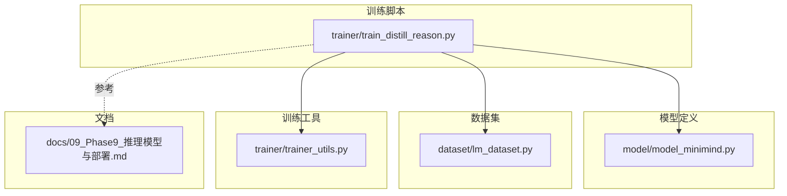
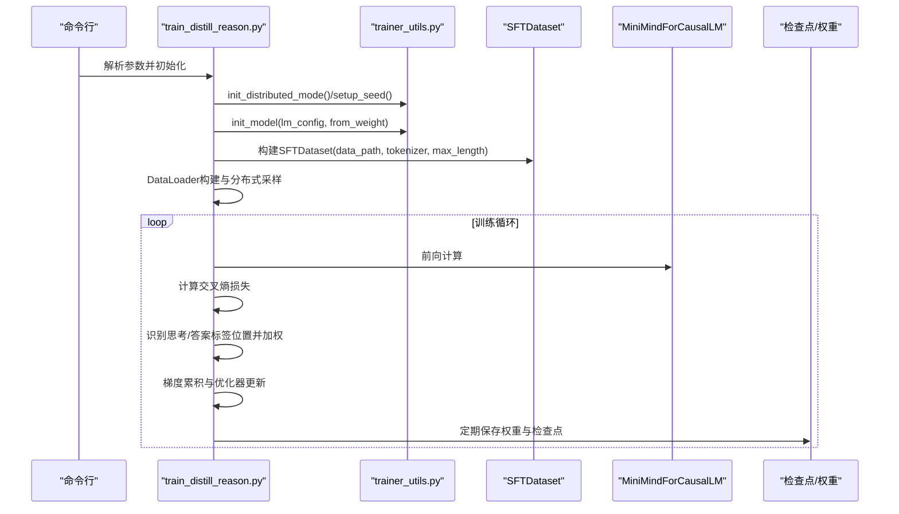
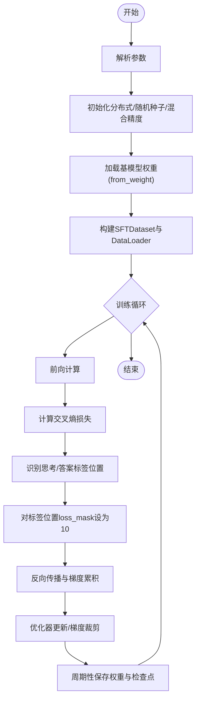
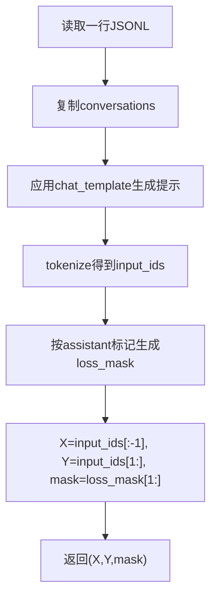
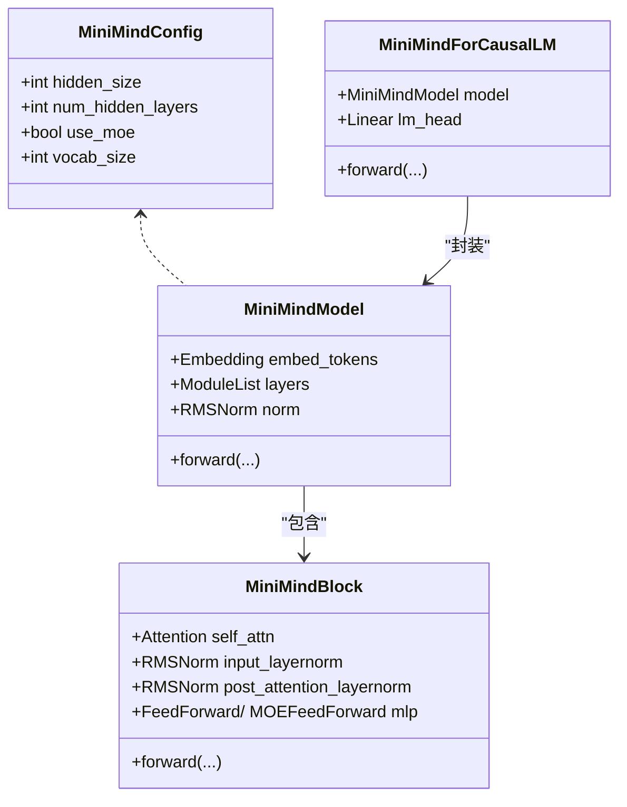
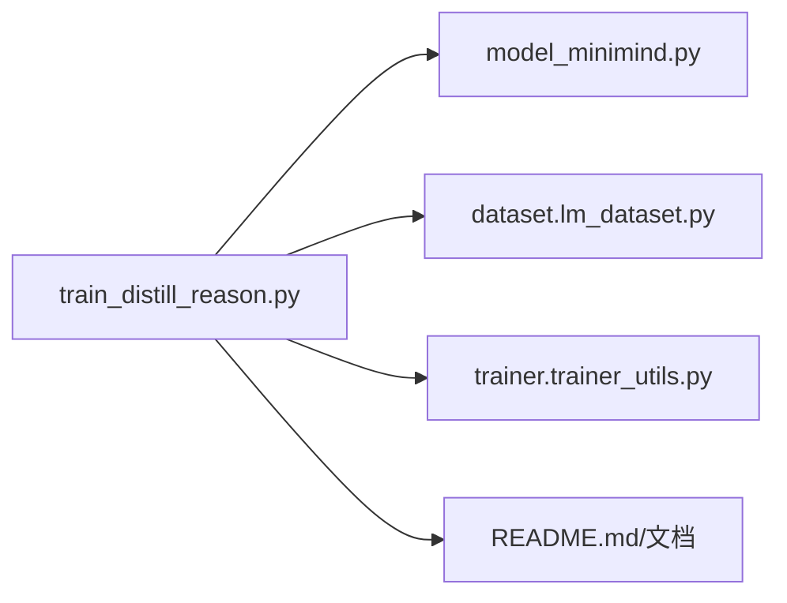

# 推理模型训练与蒸馏

<cite>
**本文引用的文件列表**
- [train_distill_reason.py](file://trainer/train_distill_reason.py)
- [model_minimind.py](file://model/model_minimind.py)
- [lm_dataset.py](file://dataset/lm_dataset.py)
- [trainer_utils.py](file://trainer/trainer_utils.py)
- [README.md](file://README.md)
- [eval_llm.py](file://eval_llm.py)
- [requirements.txt](file://requirements.txt)
- [09_Phase9_推理模型与部署.md](file://docs/09_Phase9_推理模型与部署.md)
</cite>

## 目录
1. [引言](#引言)
2. [项目结构](#项目结构)
3. [核心组件](#核心组件)
4. [架构总览](#架构总览)
5. [详细组件分析](#详细组件分析)
6. [依赖关系分析](#依赖关系分析)
7. [性能考量](#性能考量)
8. [故障排查指南](#故障排查指南)
9. [结论](#结论)
10. [附录](#附录)

## 引言
本技术文档聚焦MiniMind项目的推理模型训练与蒸馏，系统阐述推理模型的概念、训练原理与实现细节，重点解析train_distill_reason.py的实现机制，包括数据格式处理、思考标签识别、损失函数设计与训练流程。文档还涵盖推理蒸馏的关键技术点（如思考标签位置的权重增加机制、推理模板的强制学习方法），并提供完整的训练命令与参数说明、测试方法、效果评估与性能对比，帮助读者理解并实现推理模型的训练与优化。

## 项目结构
MiniMind项目采用模块化组织，训练脚本集中在trainer目录，模型定义在model目录，数据集处理在dataset目录，训练工具函数在trainer_utils中，文档在docs目录。推理蒸馏训练脚本train_distill_reason.py位于trainer目录，依赖模型定义、数据集封装与训练工具函数。

图表来源
- [train_distill_reason.py:1-175](file://trainer/train_distill_reason.py#L1-L175)
- [model_minimind.py:1-475](file://model/model_minimind.py#L1-L475)
- [lm_dataset.py:1-250](file://dataset/lm_dataset.py#L1-L250)
- [trainer_utils.py:1-139](file://trainer/trainer_utils.py#L1-L139)
- [09_Phase9_推理模型与部署.md:1-294](file://docs/09_Phase9_推理模型与部署.md#L1-L294)

章节来源
- [train_distill_reason.py:1-175](file://trainer/train_distill_reason.py#L1-L175)
- [model_minimind.py:1-475](file://model/model_minimind.py#L1-L475)
- [lm_dataset.py:1-250](file://dataset/lm_dataset.py#L1-L250)
- [trainer_utils.py:1-139](file://trainer/trainer_utils.py#L1-L139)
- [09_Phase9_推理模型与部署.md:1-294](file://docs/09_Phase9_推理模型与部署.md#L1-L294)

## 核心组件
- 推理蒸馏训练脚本：负责加载基模型权重、构建推理数据集、执行训练循环、应用思考标签加权策略、保存检查点与权重。
- 模型定义：MiniMindForCausalLM提供前向与辅助损失（MoE场景），支持推理生成与训练。
- 数据集封装：SFTDataset负责将对话数据转换为因果语言模型的X/Y与损失掩码，支持推理模板的动态掩码生成。
- 训练工具：提供分布式初始化、学习率调度、检查点保存、模型初始化等通用能力。

章节来源
- [train_distill_reason.py:1-175](file://trainer/train_distill_reason.py#L1-L175)
- [model_minimind.py:441-475](file://model/model_minimind.py#L441-L475)
- [lm_dataset.py:54-125](file://dataset/lm_dataset.py#L54-L125)
- [trainer_utils.py:1-139](file://trainer/trainer_utils.py#L1-L139)

## 架构总览
推理蒸馏训练流程从数据加载、模型初始化、训练循环到权重保存形成闭环。训练脚本通过SFTDataset读取推理数据，利用tokenizer识别思考标签与答案标签位置，对这些位置的损失进行加权，从而强制模型遵循推理模板。

图表来源
- [train_distill_reason.py:94-175](file://trainer/train_distill_reason.py#L94-L175)
- [trainer_utils.py:28-111](file://trainer/trainer_utils.py#L28-L111)
- [lm_dataset.py:54-125](file://dataset/lm_dataset.py#L54-L125)
- [model_minimind.py:441-475](file://model/model_minimind.py#L441-L475)

## 详细组件分析

### 推理蒸馏训练脚本 train_distill_reason.py
- 关键职责
  - 解析训练参数（保存目录、权重前缀、训练轮数、批次大小、学习率、设备、混合精度、梯度累积、梯度裁剪、日志/保存间隔、模型维度、层数、最大序列长度、MoE开关、数据路径、基模型权重来源、断点续训、可视化等）。
  - 初始化分布式训练、随机种子与混合精度上下文。
  - 加载基模型权重（默认从DPO权重继续训练），构建SFT数据集与DataLoader。
  - 训练循环：前向计算、交叉熵损失、思考/答案标签位置加权、梯度累积与优化器更新、周期性保存权重与检查点。
  - 支持DDP分布式训练与断点续训。

- 思考标签识别与加权策略
  - 使用tokenizer识别思考标签起止与答案标签起止的token ID。
  - 通过布尔索引定位Y中对应位置，将这些位置的loss_mask设为10（默认权重），从而在这些位置施加10倍损失惩罚，强制模型遵循推理模板。

- 训练流程要点
  - 余弦退火学习率调度。
  - 混合精度前向与反向传播，梯度累积与梯度裁剪。
  - 每log_interval打印损失、学习率与剩余时间估计。
  - 每save_interval保存半精度权重与检查点。

图表来源
- [train_distill_reason.py:23-92](file://trainer/train_distill_reason.py#L23-L92)

章节来源
- [train_distill_reason.py:1-175](file://trainer/train_distill_reason.py#L1-L175)

### 数据集封装 SFTDataset
- 数据格式
  - 输入为JSON Lines，每行包含conversations字段，表示多轮对话。
- 提示构建
  - 使用tokenizer.apply_chat_template生成对话提示字符串。
- 损失掩码生成
  - 通过查找assistant角色的起止标记，将对应位置的loss_mask设为1，其余位置为0，确保仅对assistant回答部分计算损失。
- 训练样本
  - 返回X（输入序列[:-1]）、Y（输入序列[1:]）、loss_mask（对齐后的1维掩码）。

图表来源
- [lm_dataset.py:54-125](file://dataset/lm_dataset.py#L54-L125)

章节来源
- [lm_dataset.py:54-125](file://dataset/lm_dataset.py#L54-L125)

### 模型定义 MiniMindForCausalLM
- 结构组成
  - MiniMindModel：嵌入层、若干MiniMindBlock、RMSNorm与输出头。
  - MiniMindBlock：RMSNorm、注意力、残差与FFN（可选MoE）。
  - MiniMindForCausalLM：封装模型与LM Head，提供前向输出与辅助损失（MoE场景）。
- 关键特性
  - 支持past_key_values缓存，用于生成阶段加速。
  - 辅助损失（aux_loss）在MoE场景下参与总损失，有助于专家路由的稳定性。

图表来源
- [model_minimind.py:8-78](file://model/model_minimind.py#L8-L78)
- [model_minimind.py:385-438](file://model/model_minimind.py#L385-L438)
- [model_minimind.py:441-475](file://model/model_minimind.py#L441-L475)

章节来源
- [model_minimind.py:1-475](file://model/model_minimind.py#L1-L475)

### 训练工具函数 trainer_utils.py
- 分布式初始化与主进程判定
- 随机种子设置
- 学习率余弦退火
- 检查点保存与加载（支持跨GPU数量恢复、wandb run id记录）
- 模型初始化（从指定权重加载）

章节来源
- [trainer_utils.py:1-139](file://trainer/trainer_utils.py#L1-L139)

## 依赖关系分析
- train_distill_reason.py依赖
  - model_minimind.py：MiniMindConfig与MiniMindForCausalLM。
  - dataset.lm_dataset：SFTDataset。
  - trainer.trainer_utils：分布式初始化、学习率、检查点、模型初始化、跳步采样器等。
- 训练脚本与数据/模型/工具之间的耦合度较低，通过参数与接口解耦，便于扩展与维护。

图表来源
- [train_distill_reason.py:1-20](file://trainer/train_distill_reason.py#L1-L20)
- [model_minimind.py:1-10](file://model/model_minimind.py#L1-L10)
- [lm_dataset.py:1-12](file://dataset/lm_dataset.py#L1-L12)
- [trainer_utils.py:1-12](file://trainer/trainer_utils.py#L1-L12)

章节来源
- [train_distill_reason.py:1-20](file://trainer/train_distill_reason.py#L1-L20)
- [model_minimind.py:1-10](file://model/model_minimind.py#L1-L10)
- [lm_dataset.py:1-12](file://dataset/lm_dataset.py#L1-L12)
- [trainer_utils.py:1-12](file://trainer/trainer_utils.py#L1-L12)

## 性能考量
- 混合精度：bfloat16或float16，减少显存占用并提升吞吐。
- 梯度累积：降低单步内存峰值，提升有效batch size。
- 梯度裁剪：稳定训练，防止梯度过大导致发散。
- 分布式训练：DDP并行，支持多机多卡。
- 检查点与断点续训：支持跨GPU数量恢复，避免长时间训练中断导致的损失。
- 推理模板强制：通过标签位置加权，提升推理模板遵循度，间接提升下游任务表现。

## 故障排查指南
- 训练不收敛或发散
  - 检查学习率、梯度裁剪阈值与梯度累积步数设置。
  - 确认loss_mask与标签位置加权逻辑未被意外覆盖。
- 分布式训练异常
  - 确认NCCL后端可用与环境变量设置正确。
  - 检查DDP包装与忽略参数列表。
- 检查点恢复失败
  - 确认检查点文件存在且与当前世界大小匹配，必要时允许自动转换step。
- 推理模板不遵循
  - 确认tokenizer中思考/答案标签的token ID与脚本中一致。
  - 检查max_seq_len与数据截断策略，避免标签被截断。

章节来源
- [trainer_utils.py:47-97](file://trainer/trainer_utils.py#L47-L97)
- [train_distill_reason.py:159-162](file://trainer/train_distill_reason.py#L159-L162)

## 结论
推理模型训练与蒸馏通过在SFT基础上引入思考标签位置的损失加权策略，有效提升了模型对推理模板的遵循能力。train_distill_reason.py以简洁清晰的实现完成了从数据加载、模型初始化、训练循环到权重保存的全流程，配合SFTDataset的动态掩码与trainer_utils的通用能力，形成了可扩展、可复现的训练框架。结合README与文档中的训练命令与测试方法，读者可快速实现推理模型的训练与评估。

## 附录

### 训练命令与参数说明
- 基本启动
  - 单卡训练：python trainer/train_distill_reason.py
  - 多卡训练：torchrun --nproc_per_node N trainer/train_distill_reason.py
- 关键参数
  - --save_dir：模型保存目录（默认../out）
  - --save_weight：保存权重的前缀名（默认reason）
  - --epochs：训练轮数（默认1）
  - --batch_size：批次大小（默认8）
  - --learning_rate：初始学习率（默认1e-6）
  - --device：训练设备（默认cuda:0或cpu）
  - --dtype：混合精度类型（默认bfloat16）
  - --num_workers：数据加载线程数（默认1）
  - --accumulation_steps：梯度累积步数（默认1）
  - --grad_clip：梯度裁剪阈值（默认1.0）
  - --log_interval：日志打印间隔（默认100）
  - --save_interval：模型保存间隔（默认100）
  - --hidden_size：隐藏层维度（默认512）
  - --num_hidden_layers：隐藏层数量（默认8）
  - --max_seq_len：训练的最大截断长度（默认1024）
  - --use_moe：是否使用MoE架构（0/1，默认0）
  - --data_path：推理蒸馏数据路径（默认../dataset/r1_mix_1024.jsonl）
  - --from_weight：基于哪个权重训练（默认dpo）
  - --from_resume：是否自动检测&续训（0/1，默认0）
  - --use_wandb：是否使用可视化（默认关闭）
  - --wandb_project：可视化项目名（默认MiniMind-Reasoning）

章节来源
- [train_distill_reason.py:94-117](file://trainer/train_distill_reason.py#L94-L117)
- [README.md:938-946](file://README.md#L938-L946)
- [09_Phase9_推理模型与部署.md:83-94](file://docs/09_Phase9_推理模型与部署.md#L83-L94)

### 测试与效果评估
- 测试命令
  - python eval_llm.py --weight reason
- 生成参数
  - --max_new_tokens：最大生成长度（默认8192）
  - --temperature：生成温度（默认0.85）
  - --top_p：核采样阈值（默认0.85）
  - --historys：携带历史对话轮数（默认0）
- 主观对比
  - 文档中给出reason阶段在简洁性、信息准确性与对话自然度方面的主观对比，可作为评估参考。

章节来源
- [eval_llm.py:32-89](file://eval_llm.py#L32-L89)
- [09_Phase9_推理模型与部署.md:186-201](file://docs/09_Phase9_推理模型与部署.md#L186-L201)

### 环境与依赖
- Python与PyTorch版本要求见requirements.txt，确保与项目兼容。
- 可视化工具默认使用SwanLab（兼容WandB API）。

章节来源
- [requirements.txt:1-31](file://requirements.txt#L1-L31)