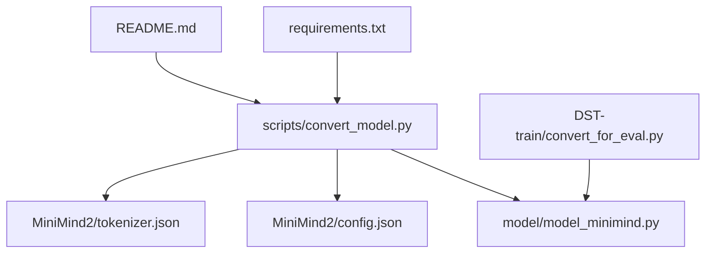
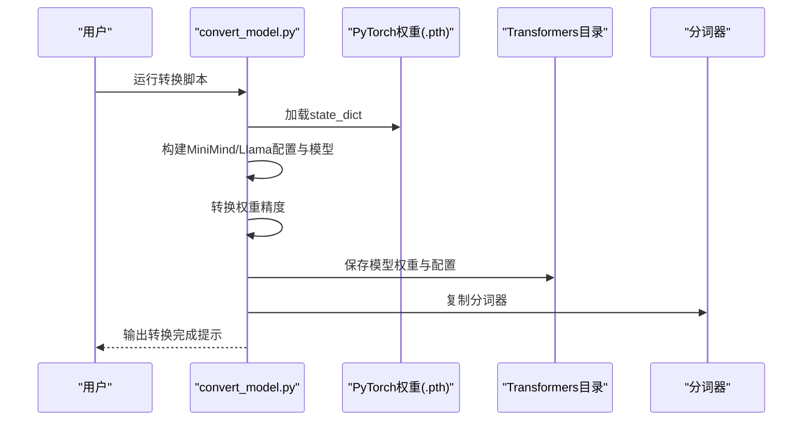
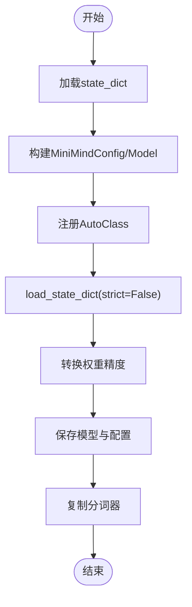
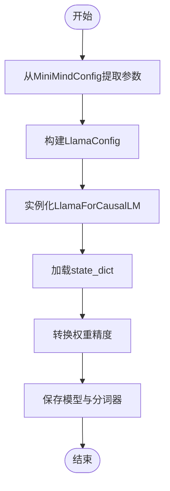
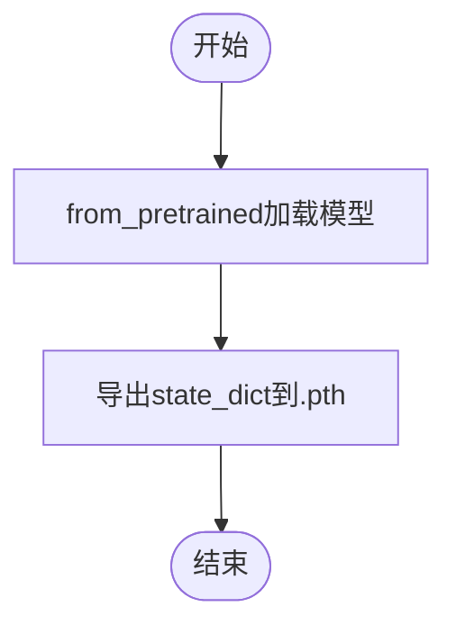
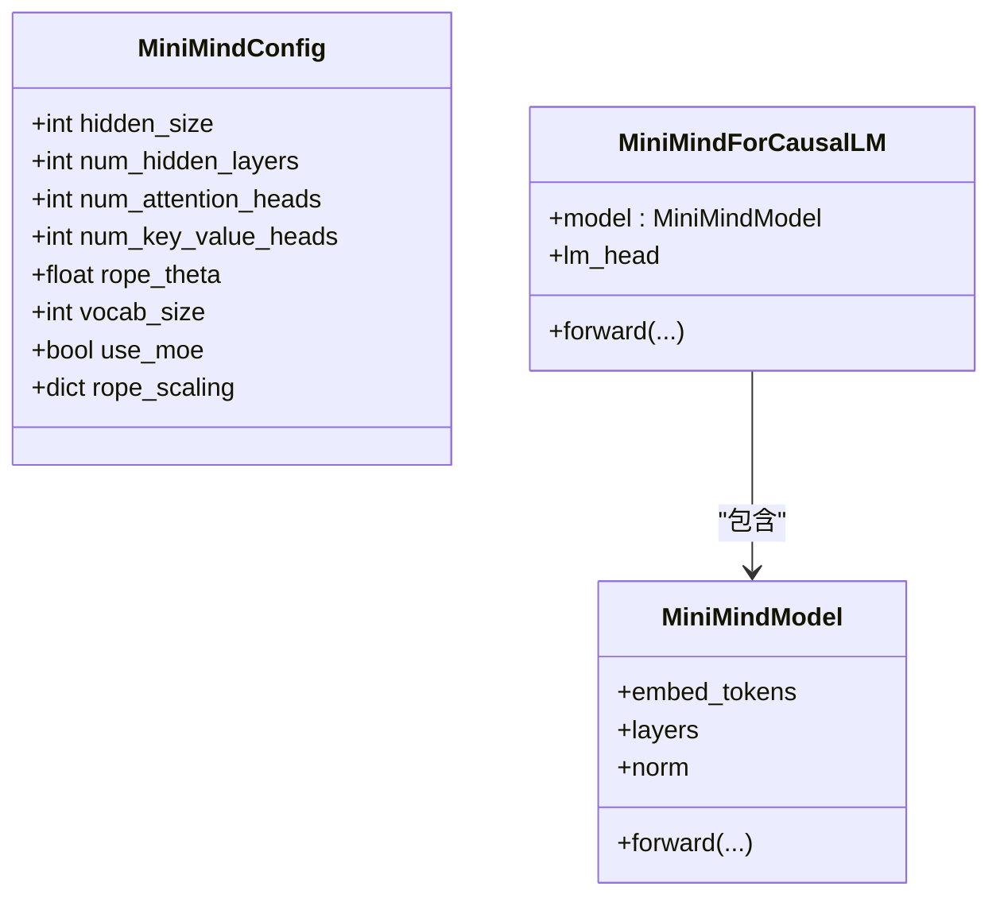
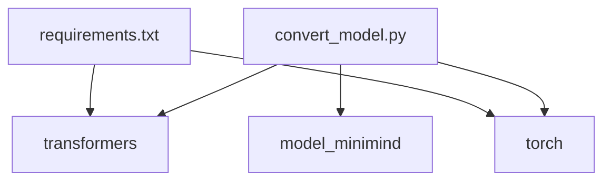

# 模型格式转换工具

<cite>
**本文引用的文件**
- [convert_model.py](file://scripts/convert_model.py)
- [model_minimind.py](file://model/model_minimind.py)
- [config.json](file://MiniMind2/config.json)
- [configuration.json](file://MiniMind2-PyTorch/configuration.json)
- [requirements.txt](file://requirements.txt)
- [README.md](file://README.md)
- [README_en.md](file://README_en.md)
- [convert_for_eval.py](file://DST-train/convert_for_eval.py)
</cite>

## 目录
1. [简介](#简介)
2. [项目结构](#项目结构)
3. [核心组件](#核心组件)
4. [架构总览](#架构总览)
5. [详细组件分析](#详细组件分析)
6. [依赖分析](#依赖分析)
7. [性能考量](#性能考量)
8. [故障排查指南](#故障排查指南)
9. [结论](#结论)
10. [附录](#附录)

## 简介
本文件面向MiniMind项目的模型格式转换工具，系统性阐述convert_model.py的实现原理与使用方法，重点覆盖：
- PyTorch原生格式与Transformers格式之间的双向转换机制
- 两种格式的结构特点、配置文件与元数据管理
- 转换过程中的关键步骤：权重映射、配置参数适配、精度转换与兼容性检查
- 命令行参数说明与使用示例
- 不同推理引擎（llama.cpp、vLLM、Ollama）对模型格式的要求与差异
- 转换后模型的测试、性能验证与错误诊断方法

## 项目结构
围绕模型格式转换，本项目涉及以下关键文件与目录：
- 转换脚本：scripts/convert_model.py
- 模型实现与配置：model/model_minimind.py
- 转换后模型示例：MiniMind2/config.json、MiniMind2/tokenizer.json等
- 原生PyTorch配置：MiniMind2-PyTorch/configuration.json
- 依赖声明：requirements.txt
- 使用说明与推理引擎集成：README.md、README_en.md
- 其他转换脚本参考：DST-train/convert_for_eval.py

图表来源
- [convert_model.py:1-76](file://scripts/convert_model.py#L1-L76)
- [model_minimind.py:1-200](file://model/model_minimind.py#L1-L200)
- [config.json:1-33](file://MiniMind2/config.json#L1-L33)
- [README.md:1685-1800](file://README.md#L1685-L1800)

章节来源
- [convert_model.py:1-76](file://scripts/convert_model.py#L1-L76)
- [README.md:1685-1800](file://README.md#L1685-L1800)

## 核心组件
- 转换入口与模式
  - 将PyTorch原生权重转换为Transformers格式（支持MiniMind自定义模型与Llama兼容两种路径）
  - 将Transformers格式转换回PyTorch原生权重
- 关键函数
  - convert_torch2transformers_minimind：注册MiniMind自定义AutoClass，加载state_dict，转换精度，保存Transformers格式并复制分词器
  - convert_torch2transformers_llama：构建LlamaConfig并实例化LlamaForCausalLM，加载state_dict，转换精度，保存Transformers格式并复制分词器
  - convert_transformers2torch：从Transformers目录加载模型，导出state_dict到PyTorch文件
- 默认配置与路径
  - 默认加载./MiniMind2-PyTorch下的权重文件，输出到./MiniMind2
  - 默认使用float16精度

章节来源
- [convert_model.py:14-62](file://scripts/convert_model.py#L14-L62)
- [convert_model.py:65-76](file://scripts/convert_model.py#L65-L76)

## 架构总览
转换工具的总体流程如下：
- 输入：PyTorch原生权重文件（.pth）
- 输出：Transformers格式目录（包含config.json、model.safetensors、tokenizer等）
- 关键步骤：加载权重、构建模型/配置、转换精度、保存模型与分词器

图表来源
- [convert_model.py:14-62](file://scripts/convert_model.py#L14-L62)

## 详细组件分析

### 组件A：PyTorch到Transformers（MiniMind自定义路径）
- 功能要点
  - 注册MiniMindConfig与MiniMindForCausalLM为AutoClass，使Transformers可识别
  - 加载state_dict并以strict=False方式加载，允许部分键缺失/多余
  - 转换权重精度（默认float16），统计参数量
  - 保存模型权重与配置，复制分词器
- 关键行为
  - 使用AutoTokenizer.from_pretrained加载分词器并保存
  - 保存时safe_serialization=False（可按需调整）

图表来源
- [convert_model.py:14-28](file://scripts/convert_model.py#L14-L28)

章节来源
- [convert_model.py:14-28](file://scripts/convert_model.py#L14-L28)

### 组件B：PyTorch到Transformers（Llama兼容路径）
- 功能要点
  - 从MiniMind配置中提取关键参数，构建LlamaConfig
  - 实例化LlamaForCausalLM并加载state_dict
  - 转换精度，保存模型与分词器
- 适配策略
  - 将MiniMind的中间层维度按Llama兼容规则计算并填充
  - 设置tie_word_embeddings为true以对齐权重共享策略

图表来源
- [convert_model.py:31-55](file://scripts/convert_model.py#L31-L55)

章节来源
- [convert_model.py:31-55](file://scripts/convert_model.py#L31-L55)

### 组件C：Transformers到PyTorch
- 功能要点
  - 从Transformers目录加载模型（trust_remote_code=True）
  - 导出state_dict到指定的PyTorch文件
- 注意事项
  - 该路径用于逆向转换，便于在不同格式间迁移

图表来源
- [convert_model.py:58-62](file://scripts/convert_model.py#L58-L62)

章节来源
- [convert_model.py:58-62](file://scripts/convert_model.py#L58-L62)

### 组件D：模型配置与权重结构
- MiniMind配置与模型结构
  - 配置类包含隐藏维度、层数、注意力头数、KV头数、RoPE theta、最大位置等
  - 模型实现采用RMSNorm、SwiGLU激活、RoPE位置编码与Flash Attention
- 转换后Transformers配置
  - 示例config.json显示模型类型为llama，dtype为float16，tie_word_embeddings为true
  - 与MiniMind配置的对应关系体现在hidden_size、num_hidden_layers、num_attention_heads、num_key_value_heads、rope_theta等字段

图表来源
- [model_minimind.py:8-78](file://model/model_minimind.py#L8-L78)
- [model_minimind.py:443-477](file://model/model_minimind.py#L443-L477)

章节来源
- [model_minimind.py:8-78](file://model/model_minimind.py#L8-L78)
- [model_minimind.py:443-477](file://model/model_minimind.py#L443-L477)
- [config.json:1-33](file://MiniMind2/config.json#L1-L33)

### 组件E：命令行参数与使用示例
- 默认行为
  - 默认加载./MiniMind2-PyTorch/grpo_768.pth（hidden_size=768，use_moe=false）
  - 输出到./MiniMind2目录
  - 转换精度为float16
- 使用示例
  - 运行转换脚本：python scripts/convert_model.py
  - 参考README中的推理引擎使用方式，验证转换后的模型在不同引擎上的可用性

章节来源
- [convert_model.py:65-76](file://scripts/convert_model.py#L65-L76)
- [README.md:248-267](file://README.md#L248-L267)

## 依赖分析
- 转换脚本依赖
  - transformers：AutoTokenizer、LlamaConfig、LlamaForCausalLM
  - torch：权重加载与精度转换
  - model_minimind：MiniMindConfig、MiniMindForCausalLM
- 依赖声明
  - requirements.txt中包含transformers==4.57.1、torch==2.6.0等关键依赖

图表来源
- [convert_model.py:6-9](file://scripts/convert_model.py#L6-L9)
- [requirements.txt:21-31](file://requirements.txt#L21-L31)

章节来源
- [convert_model.py:6-9](file://scripts/convert_model.py#L6-L9)
- [requirements.txt:1-31](file://requirements.txt#L1-L31)

## 性能考量
- 精度转换
  - 默认使用float16，可显著降低模型体积与内存占用，适合推理与部署
- 参数量统计
  - 转换过程中打印参数量（百万/十亿），便于评估模型规模
- 推理引擎适配
  - Llama兼容路径可直接对接vLLM、llama.cpp等生态，减少额外适配成本

章节来源
- [convert_model.py:23-25](file://scripts/convert_model.py#L23-L25)
- [convert_model.py:51-53](file://scripts/convert_model.py#L51-L53)

## 故障排查指南
- 权重键不匹配
  - load_state_dict使用strict=False，允许缺失/多余键；若出现异常，检查state_dict键名与模型期望是否一致
- 精度与设备
  - 若CUDA不可用，脚本会回退到CPU；确保torch与CUDA版本匹配
- 分词器缺失
  - 确保./model/目录存在分词器文件，否则复制分词器步骤会失败
- 推理引擎兼容性
  - llama.cpp需要将Transformers格式转换为GGUF；README提供了详细的转换与量化步骤
  - vLLM与Ollama可直接加载转换后的Transformers目录

章节来源
- [convert_model.py:19-20](file://scripts/convert_model.py#L19-L20)
- [convert_model.py:26-27](file://scripts/convert_model.py#L26-L27)
- [README.md:1685-1800](file://README.md#L1685-L1800)

## 结论
本转换工具实现了MiniMind原生模型与Transformers生态的双向互通，既支持自定义配置的直接保存，也支持Llama兼容路径以适配llama.cpp、vLLM、Ollama等推理引擎。通过合理的配置参数适配、权重精度转换与分词器复制，用户可在不同平台间平滑迁移模型，并结合项目提供的推理引擎使用说明完成部署与验证。

## 附录

### A. 推理引擎兼容性与差异
- vLLM
  - 支持以transformers实现方式加载模型，适合高性能推理部署
- llama.cpp
  - 需将Transformers格式转换为GGUF；README提供了分词器适配与量化步骤
- Ollama
  - 可直接加载GGUF模型或通过自定义modelfile进行本地化部署

章节来源
- [README.md:1685-1800](file://README.md#L1685-L1800)
- [README_en.md:1615-1722](file://README_en.md#L1615-L1722)

### B. 转换后模型测试与验证
- 基础验证
  - 使用eval_llm.py加载转换后的Transformers目录，确认生成结果正常
- 推理引擎验证
  - vLLM：使用README中的命令行启动服务并进行请求
  - llama.cpp：按README步骤完成GGUF转换与量化后进行命令行推理
  - Ollama：按README步骤创建modelfile并运行模型

章节来源
- [README.md:248-267](file://README.md#L248-L267)
- [README.md:1685-1800](file://README.md#L1685-L1800)