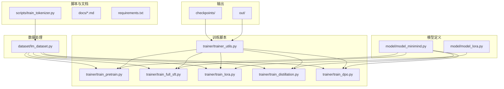
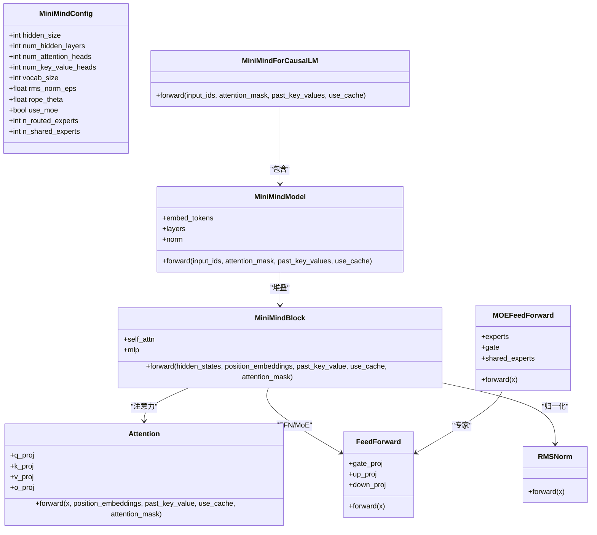
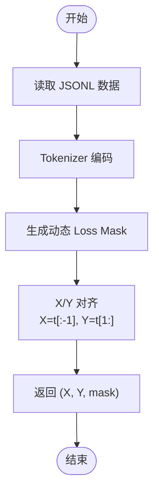
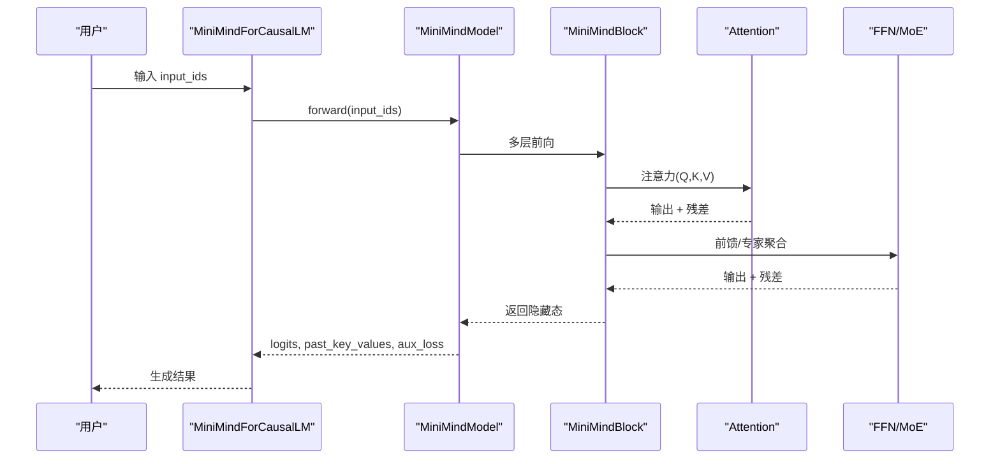
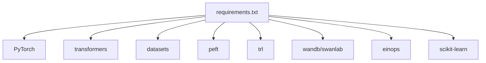

# 训练教程

<cite>
**本文引用的文件**
- [README.md](file://README.md)
- [requirements.txt](file://requirements.txt)
- [docs/00_总纲.md](file://docs/00_总纲.md)
- [docs/02_Phase2_Tokenizer与数据集.md](file://docs/02_Phase2_Tokenizer与数据集.md)
- [docs/03_Phase3_模型架构详解.md](file://docs/03_Phase3_模型架构详解.md)
- [model/model_minimind.py](file://model/model_minimind.py)
- [model/model_lora.py](file://model/model_lora.py)
- [scripts/train_tokenizer.py](file://scripts/train_tokenizer.py)
- [dataset/lm_dataset.py](file://dataset/lm_dataset.py)
- [trainer/trainer_utils.py](file://trainer/trainer_utils.py)
- [trainer/train_pretrain.py](file://trainer/train_pretrain.py)
- [trainer/train_full_sft.py](file://trainer/train_full_sft.py)
- [trainer/train_lora.py](file://trainer/train_lora.py)
- [trainer/train_distillation.py](file://trainer/train_distillation.py)
- [trainer/train_dpo.py](file://trainer/train_dpo.py)
</cite>

## 目录
1. [引言](#引言)
2. [项目结构](#项目结构)
3. [核心组件](#核心组件)
4. [架构总览](#架构总览)
5. [详细组件分析](#详细组件分析)
6. [依赖分析](#依赖分析)
7. [性能考量](#性能考量)
8. [故障排查指南](#故障排查指南)
9. [结论](#结论)
10. [附录](#附录)

## 引言
本教程系统化呈现 MiniMind 从零训练大语言模型的完整流水线，覆盖分词器训练、数据集处理、模型架构设计、预训练、监督微调、LoRA 微调、知识蒸馏、强化学习后训练（DPO）、推理与部署等九个阶段。教程以循序渐进的方式组织，既适合初学者建立全局认知，也为进阶用户提供可落地的实现细节与最佳实践。

## 项目结构
MiniMind 采用“按阶段/按职责”的模块化组织方式：
- model：模型定义与 LoRA 适配
- dataset：数据集加载与批构造
- trainer：各阶段训练脚本与工具函数
- scripts：分词器训练与推理服务脚本
- docs：教程文档与阶段性说明
- checkpoints/out：检查点与权重输出目录



图表来源
- [model/model_minimind.py:1-474](file://model/model_minimind.py#L1-L474)
- [model/model_lora.py:1-50](file://model/model_lora.py#L1-L50)
- [dataset/lm_dataset.py:1-250](file://dataset/lm_dataset.py#L1-L250)
- [trainer/train_pretrain.py:1-162](file://trainer/train_pretrain.py#L1-L162)
- [trainer/train_full_sft.py:1-163](file://trainer/train_full_sft.py#L1-L163)
- [trainer/train_lora.py:1-177](file://trainer/train_lora.py#L1-L177)
- [trainer/train_distillation.py:1-224](file://trainer/train_distillation.py#L1-L224)
- [trainer/train_dpo.py:1-208](file://trainer/train_dpo.py#L1-L208)
- [trainer/trainer_utils.py:1-139](file://trainer/trainer_utils.py#L1-L139)
- [scripts/train_tokenizer.py:1-148](file://scripts/train_tokenizer.py#L1-L148)

章节来源
- [README.md:208-424](file://README.md#L208-L424)
- [docs/00_总纲.md:1-144](file://docs/00_总纲.md#L1-L144)

## 核心组件
- 模型配置与实现：MiniMindConfig、MiniMindForCausalLM、Attention、FeedForward、MOEFeedForward、RMSNorm、RoPE、GQA、权重共享等
- 数据集适配：PretrainDataset、SFTDataset、DPODataset、RLAIFDataset
- 训练工具：学习率调度、DDP 初始化、随机种子、混合精度、断点续训、SkipBatchSampler
- LoRA 适配：apply_lora、save_lora、load_lora
- 分词器训练：基于 BPE 的自定义分词器训练脚本

章节来源
- [model/model_minimind.py:8-78](file://model/model_minimind.py#L8-L78)
- [model/model_minimind.py:95-106](file://model/model_minimind.py#L95-L106)
- [model/model_minimind.py:108-128](file://model/model_minimind.py#L108-L128)
- [model/model_minimind.py:131-224](file://model/model_minimind.py#L131-L224)
- [model/model_minimind.py:227-241](file://model/model_minimind.py#L227-L241)
- [model/model_minimind.py:243-296](file://model/model_minimind.py#L243-L296)
- [model/model_minimind.py:299-358](file://model/model_minimind.py#L299-L358)
- [model/model_minimind.py:361-438](file://model/model_minimind.py#L361-L438)
- [model/model_minimind.py:441-474](file://model/model_minimind.py#L441-L474)
- [dataset/lm_dataset.py:16-51](file://dataset/lm_dataset.py#L16-L51)
- [dataset/lm_dataset.py:54-124](file://dataset/lm_dataset.py#L54-L124)
- [dataset/lm_dataset.py:127-200](file://dataset/lm_dataset.py#L127-L200)
- [dataset/lm_dataset.py:203-245](file://dataset/lm_dataset.py#L203-L245)
- [trainer/trainer_utils.py:24-26](file://trainer/trainer_utils.py#L24-L26)
- [trainer/trainer_utils.py:28-46](file://trainer/trainer_utils.py#L28-L46)
- [trainer/trainer_utils.py:47-97](file://trainer/trainer_utils.py#L47-L97)
- [trainer/trainer_utils.py:114-138](file://trainer/trainer_utils.py#L114-L138)
- [model/model_lora.py:21-33](file://model/model_lora.py#L21-L33)
- [model/model_lora.py:43-49](file://model/model_lora.py#L43-L49)
- [scripts/train_tokenizer.py:15-59](file://scripts/train_tokenizer.py#L15-L59)

## 架构总览
MiniMind 采用 Decoder-Only Transformer，结合 RMSNorm、RoPE、GQA、SwiGLU FFN 与可选 MoE，形成轻量、高效、可扩展的训练与推理架构。训练脚本通过统一的工具函数实现分布式、混合精度、断点续训与可视化。



图表来源
- [model/model_minimind.py:8-78](file://model/model_minimind.py#L8-L78)
- [model/model_minimind.py:441-474](file://model/model_minimind.py#L441-L474)
- [model/model_minimind.py:385-438](file://model/model_minimind.py#L385-L438)
- [model/model_minimind.py:361-402](file://model/model_minimind.py#L361-L402)
- [model/model_minimind.py:150-224](file://model/model_minimind.py#L150-L224)
- [model/model_minimind.py:227-241](file://model/model_minimind.py#L227-L241)
- [model/model_minimind.py:299-358](file://model/model_minimind.py#L299-L358)

## 详细组件分析

### 阶段一：项目概览与环境搭建
- 目标：快速体验推理、理解训练流程、准备环境与依赖
- 关键点：requirements.txt、README 快速开始、模型下载与推理脚本
- 实践建议：先用已有权重跑通推理，再逐步替换为自训练权重

章节来源
- [requirements.txt:1-31](file://requirements.txt#L1-L31)
- [README.md:208-424](file://README.md#L208-L424)

### 阶段二：分词器与数据集
- 理论基础：BPE 算法、RoPE、GQA、损失掩码策略
- 实现细节：PretrainDataset、SFTDataset、DPODataset、RLAIFDataset
- 代码示例：分词器训练脚本、数据集类使用
- 最佳实践：统一 chat_template、动态 loss_mask、max_seq_len 与数据分布匹配



图表来源
- [dataset/lm_dataset.py:16-51](file://dataset/lm_dataset.py#L16-L51)
- [dataset/lm_dataset.py:54-124](file://dataset/lm_dataset.py#L54-L124)
- [dataset/lm_dataset.py:127-200](file://dataset/lm_dataset.py#L127-L200)
- [dataset/lm_dataset.py:203-245](file://dataset/lm_dataset.py#L203-L245)

章节来源
- [docs/02_Phase2_Tokenizer与数据集.md:1-424](file://docs/02_Phase2_Tokenizer与数据集.md#L1-L424)
- [scripts/train_tokenizer.py:15-59](file://scripts/train_tokenizer.py#L15-L59)
- [dataset/lm_dataset.py:16-51](file://dataset/lm_dataset.py#L16-L51)
- [dataset/lm_dataset.py:54-124](file://dataset/lm_dataset.py#L54-L124)
- [dataset/lm_dataset.py:127-200](file://dataset/lm_dataset.py#L127-L200)
- [dataset/lm_dataset.py:203-245](file://dataset/lm_dataset.py#L203-L245)

### 阶段三：模型架构详解
- 理论基础：Pre-LN、RMSNorm、RoPE、GQA、SwiGLU、MoE
- 实现细节：Attention、FeedForward、MOEFeedForward、MiniMindBlock、MiniMindForCausalLM
- 参数配置：d_model、n_layers、n_heads、kv_heads、use_moe 等
- 最佳实践：权重共享、KV Cache、Flash Attention、YaRN 外推



图表来源
- [model/model_minimind.py:441-474](file://model/model_minimind.py#L441-L474)
- [model/model_minimind.py:385-438](file://model/model_minimind.py#L385-L438)
- [model/model_minimind.py:361-402](file://model/model_minimind.py#L361-L402)
- [model/model_minimind.py:150-224](file://model/model_minimind.py#L150-L224)
- [model/model_minimind.py:227-241](file://model/model_minimind.py#L227-L241)
- [model/model_minimind.py:299-358](file://model/model_minimind.py#L299-L358)

章节来源
- [docs/03_Phase3_模型架构详解.md:1-387](file://docs/03_Phase3_模型架构详解.md#L1-L387)
- [model/model_minimind.py:8-78](file://model/model_minimind.py#L8-L78)
- [model/model_minimind.py:95-106](file://model/model_minimind.py#L95-L106)
- [model/model_minimind.py:108-128](file://model/model_minimind.py#L108-L128)
- [model/model_minimind.py:131-224](file://model/model_minimind.py#L131-L224)
- [model/model_minimind.py:227-241](file://model/model_minimind.py#L227-L241)
- [model/model_minimind.py:243-296](file://model/model_minimind.py#L243-L296)
- [model/model_minimind.py:299-358](file://model/model_minimind.py#L299-L358)
- [model/model_minimind.py:361-438](file://model/model_minimind.py#L361-L438)
- [model/model_minimind.py:441-474](file://model/model_minimind.py#L441-L474)

### 阶段四：预训练（Pretrain）
- 目标：无监督学习语言知识，使模型具备“词语接龙”能力
- 关键流程：数据加载、混合精度、学习率调度、梯度累积、梯度裁剪、DDP、断点续训
- 参数要点：hidden_size、num_hidden_layers、max_seq_len、use_moe、dtype、accumulation_steps、grad_clip
- 可视化：SwanLab（兼容 WandB）

```mermaid
sequenceDiagram
participant DS as "PretrainDataset"
participant DL as "DataLoader/DDP"
participant M as "MiniMindForCausalLM"
participant OPT as "AdamW/GradScaler"
participant CKP as "lm_checkpoint"
DS-->>DL : (X,Y,mask)
DL-->>M : 前向
M-->>OPT : 反向与loss
OPT-->>M : 更新参数
M-->>CKP : 保存权重与优化器状态
```

图表来源
- [trainer/train_pretrain.py:23-79](file://trainer/train_pretrain.py#L23-L79)
- [trainer/train_pretrain.py:106-162](file://trainer/train_pretrain.py#L106-L162)
- [dataset/lm_dataset.py:16-51](file://dataset/lm_dataset.py#L16-L51)
- [trainer/trainer_utils.py:47-97](file://trainer/trainer_utils.py#L47-L97)

章节来源
- [trainer/train_pretrain.py:1-162](file://trainer/train_pretrain.py#L1-L162)
- [dataset/lm_dataset.py:16-51](file://dataset/lm_dataset.py#L16-L51)
- [trainer/trainer_utils.py:24-26](file://trainer/trainer_utils.py#L24-L26)
- [trainer/trainer_utils.py:28-46](file://trainer/trainer_utils.py#L28-L46)
- [trainer/trainer_utils.py:47-97](file://trainer/trainer_utils.py#L47-L97)

### 阶段五：监督微调（SFT）
- 目标：将预训练模型对齐到指令与对话格式，学习“如何回答”
- 关键流程：chat_template、动态 loss_mask（仅 assistant 区域）、学习率调度
- 参数要点：max_seq_len、learning_rate、batch_size、accumulation_steps、grad_clip
- 断点续训：自动恢复权重、优化器、scaler、wandb run

章节来源
- [trainer/train_full_sft.py:1-163](file://trainer/train_full_sft.py#L1-L163)
- [dataset/lm_dataset.py:54-124](file://dataset/lm_dataset.py#L54-L124)
- [trainer/trainer_utils.py:47-97](file://trainer/trainer_utils.py#L47-L97)

### 阶段六：LoRA 微调
- 目标：低秩适配，高效参数微调，适合垂域迁移
- 关键流程：apply_lora 注入低秩模块、冻结非 LoRA 参数、仅优化 LoRA 参数
- 参数要点：rank、learning_rate、epochs、data_path
- 保存：仅保存 LoRA 权重，便于部署与切换

章节来源
- [trainer/train_lora.py:1-177](file://trainer/train_lora.py#L1-L177)
- [model/model_lora.py:21-33](file://model/model_lora.py#L21-L33)
- [model/model_lora.py:43-49](file://model/model_lora.py#L43-L49)
- [dataset/lm_dataset.py:54-124](file://dataset/lm_dataset.py#L54-L124)

### 阶段七：知识蒸馏
- 目标：学生模型学习教师模型的软知识，提升性能与效率
- 关键流程：KL 散度蒸馏损失、CE 损失与蒸馏损失加权、温度系数
- 参数要点：alpha（CE 权重）、temperature、student/teacher 配置

章节来源
- [trainer/train_distillation.py:1-224](file://trainer/train_distillation.py#L1-L224)
- [trainer/train_distillation.py:24-36](file://trainer/train_distillation.py#L24-L36)

### 阶段八：强化学习后训练（DPO）
- 目标：偏好优化，对齐人类偏好，避免遗忘参考模型知识
- 关键流程：参考模型（冻结）log_prob 计算、策略模型 log_prob 计算、DPO 损失
- 参数要点：beta、max_seq_len、learning_rate、batch_size

章节来源
- [trainer/train_dpo.py:1-208](file://trainer/train_dpo.py#L1-L208)
- [trainer/train_dpo.py:24-52](file://trainer/train_dpo.py#L24-L52)
- [dataset/lm_dataset.py:127-200](file://dataset/lm_dataset.py#L127-L200)

### 阶段九：推理模型与部署
- 目标：将训练好的权重用于推理、服务化与第三方框架兼容
- 关键点：推理脚本、OpenAI API 服务、权重加载、LoRA 合并、推理参数（max_new_tokens、temperature、top_p）

章节来源
- [README.md:358-384](file://README.md#L358-L384)

## 依赖分析
- 训练依赖：PyTorch、transformers、datasets、peft、trl、wandb/swanlab、einops、matplotlib、scikit-learn 等
- 分布式与混合精度：torch.distributed、torch.cuda.amp
- 可视化：SwanLab（兼容 WandB API）



图表来源
- [requirements.txt:1-31](file://requirements.txt#L1-L31)

章节来源
- [requirements.txt:1-31](file://requirements.txt#L1-L31)

## 性能考量
- 混合精度：bfloat16/float16，GradScaler 动态缩放，减少显存占用
- 梯度累积：增大有效 batch size，缓解显存压力
- 梯度裁剪：防止梯度爆炸，提升稳定性
- Flash Attention：在满足条件时使用 scaled_dot_product_attention
- KV Cache：推理阶段缓存 K/V，加速自回归生成
- DDP：多卡分布式训练，自动跳过已训练 step，跨 GPU 数量恢复
- 断点续训：检查点包含模型、优化器、scaler、wandb run，支持跨设备恢复

章节来源
- [trainer/train_pretrain.py:117-135](file://trainer/train_pretrain.py#L117-L135)
- [trainer/train_full_sft.py:117-136](file://trainer/train_full_sft.py#L117-L136)
- [trainer/train_lora.py:112-116](file://trainer/train_lora.py#L112-L116)
- [trainer/train_distillation.py:173-177](file://trainer/train_distillation.py#L173-L177)
- [trainer/train_dpo.py:155-158](file://trainer/train_dpo.py#L155-L158)
- [model/model_minimind.py:196-224](file://model/model_minimind.py#L196-L224)
- [model/model_minimind.py:418-438](file://model/model_minimind.py#L418-L438)
- [trainer/trainer_utils.py:47-97](file://trainer/trainer_utils.py#L47-L97)
- [trainer/trainer_utils.py:114-138](file://trainer/trainer_utils.py#L114-L138)

## 故障排查指南
- 训练中断恢复：确认 checkpoints 目录存在 _resume.pth 文件，使用 --from_resume 1 自动恢复
- GPU 数量变化：断点续训会自动调整 step，避免重复训练
- 分布式初始化：检查 LOCAL_RANK、RANK 环境变量，NCCL 后端
- 混合精度异常：CPU 上禁用 autocast，或切换 dtype
- 损失 NaN：检查学习率、梯度裁剪阈值、数据质量
- 词表不一致：不要自行重新训练分词器，避免权重与推理接口不兼容

章节来源
- [trainer/trainer_utils.py:47-97](file://trainer/trainer_utils.py#L47-L97)
- [trainer/trainer_utils.py:28-46](file://trainer/trainer_utils.py#L28-L46)
- [README.md:309-327](file://README.md#L309-L327)

## 结论
本教程以 MiniMind 为载体，系统讲解了从零训练 LLM 的完整流程。通过分阶段的理论与实践结合，读者可以掌握分词器、数据集、模型架构、预训练、SFT、LoRA、蒸馏与强化学习等核心技术，并具备断点续训、分布式训练、混合精度等工程能力。建议按阶段逐步实践，先用推荐数据组合快速复现，再深入理解各组件细节与参数调优。

## 附录
- 推荐学习路径：按 Phase 1→9 顺序完整学习，或针对专项（模型结构、RL、垂域、推理）进行深入
- 数据集下载与放置：./dataset/ 目录，按需选择推荐组合
- 硬件与显存：根据各阶段最低/推荐显存配置准备设备

章节来源
- [docs/00_总纲.md:102-144](file://docs/00_总纲.md#L102-L144)
- [README.md:550-606](file://README.md#L550-L606)