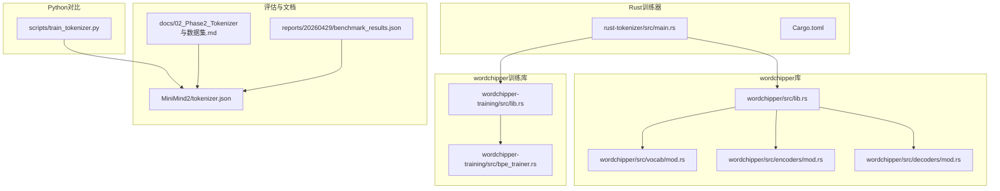
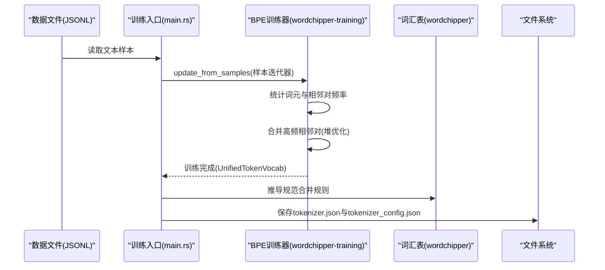
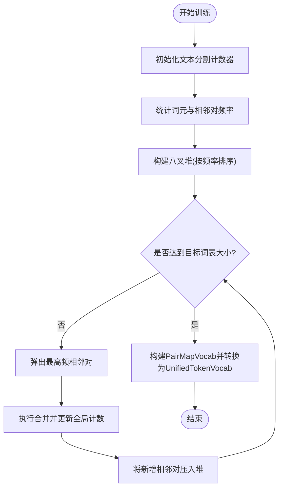
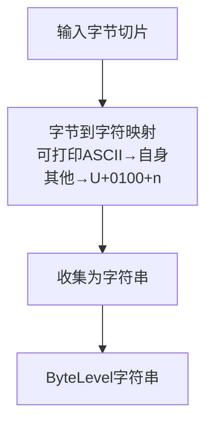
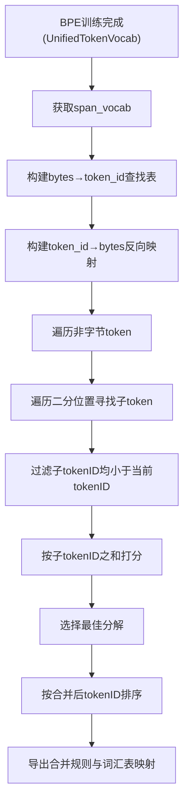
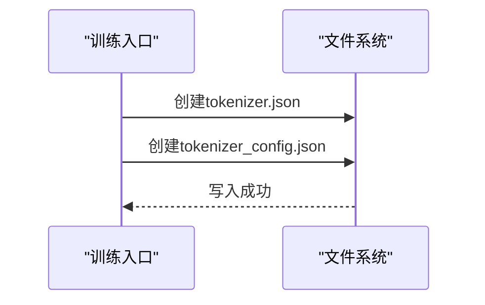
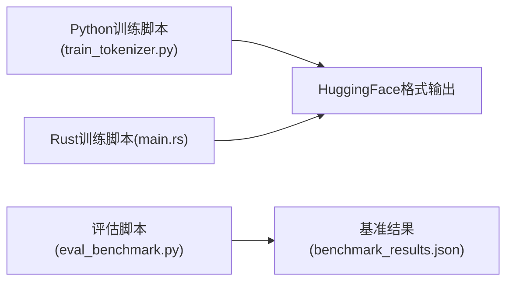
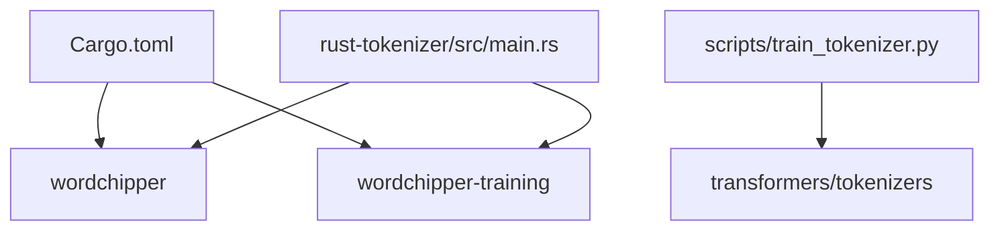

# Rust分词器优化

<cite>
**本文档引用的文件**
- [Cargo.toml](file://rust-tokenizer/Cargo.toml)
- [main.rs](file://rust-tokenizer/src/main.rs)
- [lib.rs](file://rust-tokenizer/link-code/wordchipper-main/crates/wordchipper/src/lib.rs)
- [lib.rs](file://rust-tokenizer/link-code/wordchipper-main/crates/wordchipper-training/src/lib.rs)
- [bpe_trainer.rs](file://rust-tokenizer/link-code/wordchipper-main/crates/wordchipper-training/src/bpe_trainer.rs)
- [mod.rs](file://rust-tokenizer/link-code/wordchipper-main/crates/wordchipper/src/vocab/mod.rs)
- [mod.rs](file://rust-tokenizer/link-code/wordchipper-main/crates/wordchipper/src/encoders/mod.rs)
- [mod.rs](file://rust-tokenizer/link-code/wordchipper-main/crates/wordchipper/src/decoders/mod.rs)
- [train_tokenizer.py](file://scripts/train_tokenizer.py)
- [tokenizer.json](file://MiniMind2/tokenizer.json)
- [02_Phase2_Tokenizer与数据集.md](file://docs/02_Phase2_Tokenizer与数据集.md)
- [benchmark_results.json](file://reports/20260429/benchmark_results.json)
</cite>

## 目录
1. [简介](#简介)
2. [项目结构](#项目结构)
3. [核心组件](#核心组件)
4. [架构概览](#架构概览)
5. [详细组件分析](#详细组件分析)
6. [依赖分析](#依赖分析)
7. [性能考量](#性能考量)
8. [故障排除指南](#故障排除指南)
9. [结论](#结论)
10. [附录](#附录)

## 简介
本技术文档聚焦于Rust分词器的性能优化，围绕wordchipper库展开，系统梳理BPE算法实现细节、内存管理优化、并行处理机制等核心技术。文档还深入ByteLevel编码的优化实现，包括字节到字符映射策略、内存分配优化与缓存机制设计；阐述分词器训练过程的性能优化策略，涵盖数据读取优化、批量处理策略与内存池管理等技术要点。最后提供与Python版本的性能对比、内存使用情况分析与吞吐量优化建议，帮助读者在实际工程中高效应用。

## 项目结构
该项目采用多crate组织方式，核心由Rust分词器训练程序与wordchipper及其训练库组成，配合Python脚本进行对比与评估。关键模块包括：
- Rust训练入口：负责读取JSONL数据、训练BPE、导出HuggingFace格式配置
- wordchipper库：高性能分词器核心，支持BPE与ByteLevel编码
- wordchipper-training库：BPE训练器与训练类型定义
- Python脚本：与Rust版本进行功能与性能对比

**图表来源**
- [main.rs:1-384](file://rust-tokenizer/src/main.rs#L1-384)
- [Cargo.toml:1-15](file://rust-tokenizer/Cargo.toml#L1-15)
- [lib.rs:1-155](file://rust-tokenizer/link-code/wordchipper-main/crates/wordchipper/src/lib.rs#L1-155)
- [lib.rs:1-109](file://rust-tokenizer/link-code/wordchipper-main/crates/wordchipper-training/src/lib.rs#L1-109)
- [bpe_trainer.rs:1-528](file://rust-tokenizer/link-code/wordchipper-main/crates/wordchipper-training/src/bpe_trainer.rs#L1-528)
- [mod.rs:1-73](file://rust-tokenizer/link-code/wordchipper-main/crates/wordchipper/src/vocab/mod.rs#L1-73)
- [mod.rs:1-35](file://rust-tokenizer/link-code/wordchipper-main/crates/wordchipper/src/encoders/mod.rs#L1-35)
- [mod.rs:1-48](file://rust-tokenizer/link-code/wordchipper-main/crates/wordchipper/src/decoders/mod.rs#L1-48)
- [train_tokenizer.py:1-148](file://scripts/train_tokenizer.py#L1-148)
- [tokenizer.json:1-800](file://MiniMind2/tokenizer.json#L1-L800)

**章节来源**
- [Cargo.toml:1-15](file://rust-tokenizer/Cargo.toml#L1-15)
- [main.rs:1-384](file://rust-tokenizer/src/main.rs#L1-384)

## 核心组件
本项目的核心组件包括：
- Rust训练入口：读取JSONL数据、训练BPE、推导规范合并规则、构建HuggingFace格式配置并保存
- wordchipper库：提供统一词汇表、编码器、解码器与预训练模型加载能力
- wordchipper-training库：BPE训练器与训练类型，支持大规模文本流训练
- Python脚本：与Rust版本进行功能与性能对比，便于基准测试

关键职责与交互：
- 训练入口负责数据读取与格式化、BPE训练、合并规则推导与配置导出
- wordchipper库提供高性能的编码/解码与词汇表管理
- wordchipper-training库提供BPE训练器，支持大规模文本迭代训练
- Python脚本用于对比验证与性能评估

**章节来源**
- [main.rs:132-192](file://rust-tokenizer/src/main.rs#L132-192)
- [lib.rs:10-155](file://rust-tokenizer/link-code/wordchipper-main/crates/wordchipper/src/lib.rs#L10-155)
- [lib.rs:1-109](file://rust-tokenizer/link-code/wordchipper-main/crates/wordchipper-training/src/lib.rs#L1-109)

## 架构概览
Rust分词器训练流程采用“数据读取→BPE训练→合并规则推导→配置导出”的流水线架构。wordchipper库提供统一的词汇表与编码/解码接口，训练器通过迭代样本更新词元计数并执行BPE合并，最终生成可与HuggingFace生态兼容的tokenizer.json与tokenizer_config.json。

**图表来源**
- [main.rs:132-192](file://rust-tokenizer/src/main.rs#L132-192)
- [bpe_trainer.rs:212-414](file://rust-tokenizer/link-code/wordchipper-main/crates/wordchipper-training/src/bpe_trainer.rs#L212-414)
- [lib.rs:33-94](file://rust-tokenizer/link-code/wordchipper-main/crates/wordchipper-training/src/lib.rs#L33-94)

## 详细组件分析

### BPE训练器实现与优化
BPE训练器通过文本分割计数器统计词元与相邻对频率，使用八叉堆维护待合并的相邻对，按频率优先级执行合并操作。训练完成后生成PairMapVocab并转换为UnifiedTokenVocab。

**图表来源**
- [bpe_trainer.rs:241-414](file://rust-tokenizer/link-code/wordchipper-main/crates/wordchipper-training/src/bpe_trainer.rs#L241-414)

**章节来源**
- [bpe_trainer.rs:171-414](file://rust-tokenizer/link-code/wordchipper-main/crates/wordchipper-training/src/bpe_trainer.rs#L171-414)

### ByteLevel编码优化实现
ByteLevel编码将字节映射为Unicode字符，可打印ASCII字节直接映射为自身，其他字节映射为U+0100+n。Rust实现通过字节到字符映射函数与字符串构建，避免不必要的中间结构，减少内存分配。

**图表来源**
- [main.rs:27-40](file://rust-tokenizer/src/main.rs#L27-40)

**章节来源**
- [main.rs:27-40](file://rust-tokenizer/src/main.rs#L27-40)

### 训练流程与合并规则推导
训练完成后，从span_vocab推导规范合并规则：遍历非字节token，寻找唯一规范分解（子tokenID均小于当前tokenID），选择子tokenID之和最大的分解作为合并规则。随后构建词汇表映射与合并列表，实现与HuggingFace格式的兼容。

**图表来源**
- [main.rs:74-129](file://rust-tokenizer/src/main.rs#L74-129)

**章节来源**
- [main.rs:74-192](file://rust-tokenizer/src/main.rs#L74-192)

### HuggingFace配置导出
训练完成后，Rust程序构建tokenizer.json与tokenizer_config.json，包含版本、预处理器(ByteLevel)、解码器(ByteLevel)、BPE模型、特殊token等字段，确保与HuggingFace生态兼容。

**图表来源**
- [main.rs:195-331](file://rust-tokenizer/src/main.rs#L195-331)

**章节来源**
- [main.rs:195-331](file://rust-tokenizer/src/main.rs#L195-331)

### 与Python版本的对比与验证
Python脚本使用tokenizers库进行相同流程的训练与配置导出，便于与Rust版本进行功能与性能对比。文档提供了训练脚本与评估脚本，可用于验证分词器的正确性与性能表现。

**图表来源**
- [train_tokenizer.py:15-108](file://scripts/train_tokenizer.py#L15-108)
- [benchmark_results.json:1-494](file://reports/20260429/benchmark_results.json#L1-L494)

**章节来源**
- [train_tokenizer.py:15-148](file://scripts/train_tokenizer.py#L15-148)
- [benchmark_results.json:1-494](file://reports/20260429/benchmark_results.json#L1-L494)

## 依赖分析
Rust训练器依赖wordchipper与wordchipper-training库，分别提供分词器核心与BPE训练能力。Python脚本依赖transformers与tokenizers库，用于训练与评估。

**图表来源**
- [Cargo.toml:6-14](file://rust-tokenizer/Cargo.toml#L6-14)
- [main.rs:1-11](file://rust-tokenizer/src/main.rs#L1-11)

**章节来源**
- [Cargo.toml:6-14](file://rust-tokenizer/Cargo.toml#L6-14)
- [main.rs:1-11](file://rust-tokenizer/src/main.rs#L1-11)

## 性能考量
- BPE训练复杂度：训练器通过八叉堆维护相邻对频率，时间复杂度近似O(N log N)，其中N为唯一相邻对数量。训练器注释指出训练速度主要受限于样本流的并行化程度。
- 内存管理：训练器使用紧凑字符串与哈希表存储词元计数，通过容量预估与收缩减少内存占用。词汇表与合并规则在训练完成后一次性构建，避免频繁分配。
- 并行处理：训练器本身无并行化，建议通过外部线程提供样本流以提升IO并行度。编码/解码器支持并行选项，可在生产环境中启用以提升吞吐量。
- 缓存机制：wordchipper提供磁盘缓存支持，便于预训练模型的加载与缓存，减少重复IO开销。

**章节来源**
- [lib.rs:17-25](file://rust-tokenizer/link-code/wordchipper-main/crates/wordchipper-training/src/lib.rs#L17-25)
- [bpe_trainer.rs:276-388](file://rust-tokenizer/link-code/wordchipper-main/crates/wordchipper-training/src/bpe_trainer.rs#L276-388)
- [lib.rs:10-155](file://rust-tokenizer/link-code/wordchipper-main/crates/wordchipper/src/lib.rs#L10-155)

## 故障排除指南
- 训练数据为空：检查JSONL文件路径与格式，确保每行包含text字段且非空。
- 特殊tokenID不匹配：训练完成后验证特殊tokenID是否与预期一致，若不一致需检查词汇表映射与ID重映射逻辑。
- 文件写入失败：确认输出目录存在且具有写权限，检查文件句柄与序列化错误。
- Python对比不一致：核对训练参数（如vocab_size、特殊token）与预处理设置，确保与Rust版本一致。

**章节来源**
- [main.rs:345-382](file://rust-tokenizer/src/main.rs#L345-382)

## 结论
本项目通过wordchipper库实现了高性能的Rust分词器训练与导出流程，结合BPE算法与ByteLevel编码，在保证与HuggingFace生态兼容的同时，提供了良好的性能与可扩展性。通过合理的内存管理、堆优化与并行化策略，能够在大规模数据集上实现高效的训练与推理。建议在生产环境中启用并行编码/解码与磁盘缓存，进一步提升吞吐量与稳定性。

## 附录
- 分词器文档与数据集说明：参见项目文档，了解分词器原理、数据集格式与处理方式。
- 基准测试结果：参考评估报告，了解模型在C-Eval与CMMLU数据集上的表现。

**章节来源**
- [02_Phase2_Tokenizer与数据集.md:1-424](file://docs/02_Phase2_Tokenizer与数据集.md#L1-L424)
- [benchmark_results.json:1-494](file://reports/20260429/benchmark_results.json#L1-L494)