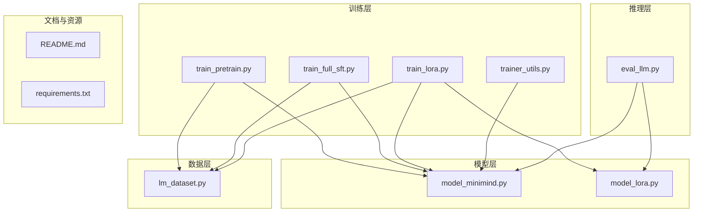
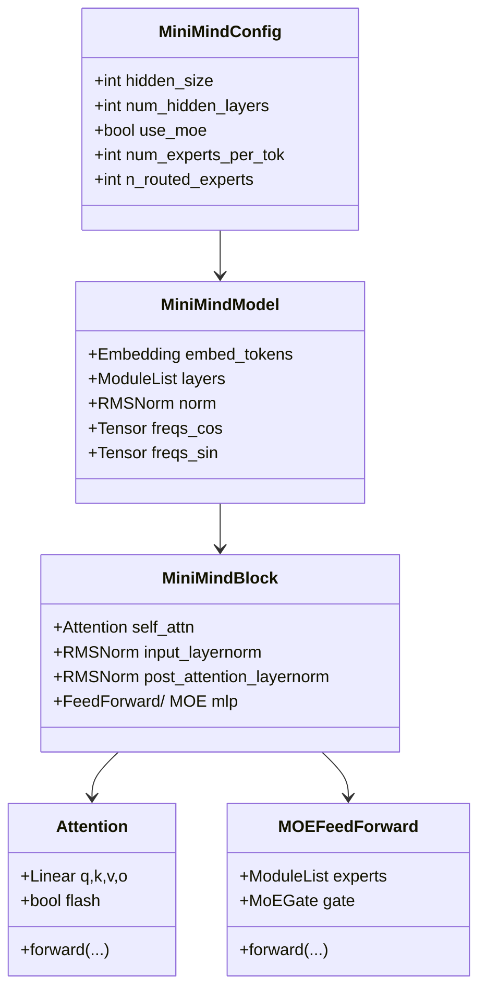
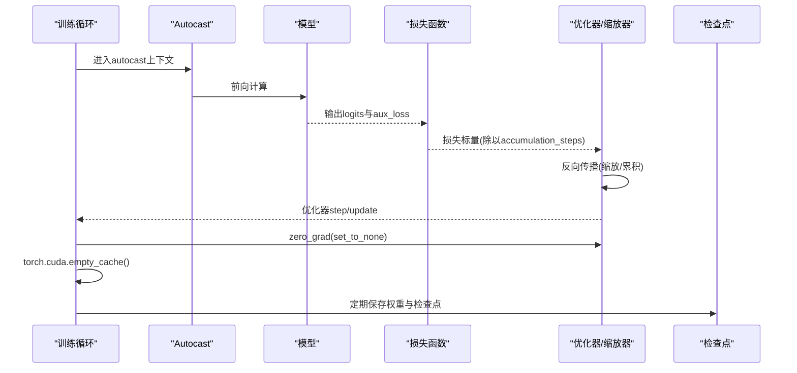
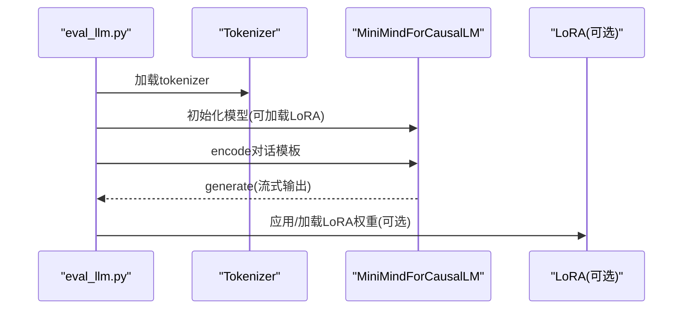
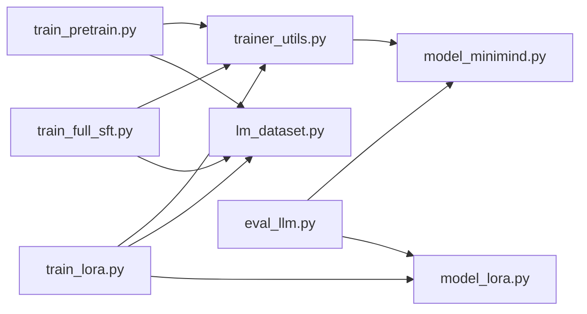

# 内存管理优化

<cite>
**本文引用的文件**
- [README.md](file://README.md)
- [requirements.txt](file://requirements.txt)
- [model_minimind.py](file://model/model_minimind.py)
- [model_lora.py](file://model/model_lora.py)
- [lm_dataset.py](file://dataset/lm_dataset.py)
- [trainer_utils.py](file://trainer/trainer_utils.py)
- [train_pretrain.py](file://trainer/train_pretrain.py)
- [train_full_sft.py](file://trainer/train_full_sft.py)
- [train_lora.py](file://trainer/train_lora.py)
- [eval_llm.py](file://eval_llm.py)
</cite>

## 目录
1. [引言](#引言)
2. [项目结构](#项目结构)
3. [核心组件](#核心组件)
4. [架构总览](#架构总览)
5. [详细组件分析](#详细组件分析)
6. [依赖分析](#依赖分析)
7. [性能考量](#性能考量)
8. [故障排查指南](#故障排查指南)
9. [结论](#结论)
10. [附录](#附录)

## 引言
本技术文档聚焦于MiniMind项目在深度学习模型训练与推理过程中的内存管理优化实践，围绕张量分配、梯度存储、缓存管理、混合精度、分布式与检查点恢复等关键环节，系统梳理当前实现与可优化方向。文档同时给出大数据集处理的内存管理方案、内存监控与调试方法，以及针对不同硬件配置的优化建议与最佳实践。

## 项目结构
本项目采用按职责分层的组织方式：
- 模型层：模型定义与推理逻辑，包含基础Dense与MoE变体
- 数据层：数据集封装与批数据生成
- 训练层：各类训练脚本与通用训练工具
- 推理层：命令行与WebUI推理入口
- 文档与资源：README、数据集与配置文件



图表来源
- [model_minimind.py](file://model/model_minimind.py)
- [model_lora.py](file://model/model_lora.py)
- [lm_dataset.py](file://dataset/lm_dataset.py)
- [trainer_utils.py](file://trainer/trainer_utils.py)
- [train_pretrain.py](file://trainer/train_pretrain.py)
- [train_full_sft.py](file://trainer/train_full_sft.py)
- [train_lora.py](file://trainer/train_lora.py)
- [eval_llm.py](file://eval_llm.py)

章节来源
- [README.md](file://README.md)
- [requirements.txt](file://requirements.txt)

## 核心组件
- 模型与注意力
  - RMSNorm、RoPE位置编码、Attention与Flash Attention路径、FFN/MoE前馈
- 数据集与批生成
  - 预训练/指令微调/偏好对数据集封装，动态损失掩码
- 训练工具与检查点
  - 分布式初始化、学习率调度、混合精度缩放器、梯度累积、检查点保存与恢复
- 推理与LoRA
  - 推理入口、LoRA参数注入与保存

章节来源
- [model_minimind.py](file://model/model_minimind.py)
- [lm_dataset.py](file://dataset/lm_dataset.py)
- [trainer_utils.py](file://trainer/trainer_utils.py)
- [train_pretrain.py](file://trainer/train_pretrain.py)
- [train_full_sft.py](file://trainer/train_full_sft.py)
- [train_lora.py](file://trainer/train_lora.py)
- [eval_llm.py](file://eval_llm.py)

## 架构总览
训练与推理的内存路径概览如下：

```mermaid
sequenceDiagram
participant U as "用户/脚本"
participant TU as "训练工具(trainer_utils)"
participant DS as "数据集(lm_dataset)"
participant MD as "模型(model_minimind)"
participant OPT as "优化器/缩放器"
participant CK as "检查点"
U->>TU : 初始化分布式/随机种子/混合精度
U->>DS : 构造数据集与DataLoader
U->>MD : 初始化模型与tokenizer
U->>OPT : 创建优化器与GradScaler
loop 每个epoch/step
DS-->>U : 批数据(X,Y,mask)
U->>MD : 前向计算(autocast)
MD-->>U : 损失与aux_loss
U->>OPT : 反向传播(梯度累积)
OPT-->>U : 优化器step/update
U->>CK : 定期保存权重与检查点
end
```

图表来源
- [trainer_utils.py](file://trainer/trainer_utils.py)
- [lm_dataset.py](file://dataset/lm_dataset.py)
- [model_minimind.py](file://model/model_minimind.py)
- [train_pretrain.py](file://trainer/train_pretrain.py)
- [train_full_sft.py](file://trainer/train_full_sft.py)
- [train_lora.py](file://trainer/train_lora.py)

## 详细组件分析

### 模型与注意力（内存热点与优化点）
- 关键内存占用点
  - 位置编码缓存（freqs_cos/freqs_sin注册为非持久缓冲区，减少显存拷贝）
  - KV缓存（past_key_value在推理时累积，显存随生成步数增长）
  - Flash Attention路径在满足条件时避免额外中间张量
  - MoE专家前馈在训练时临时张量较多，需注意dtype与缓存策略
- 优化建议
  - 合理设置max_seq_len，避免不必要的padding
  - 推理时启用use_cache并限制生成长度
  - MoE训练时可考虑降低num_experts_per_tok或n_routed_experts
  - 使用半精度保存权重与推理（训练仍可用bf16/fp16）



图表来源
- [model_minimind.py](file://model/model_minimind.py)

章节来源
- [model_minimind.py](file://model/model_minimind.py)

### 数据集与批生成（内存与吞吐）
- 关键点
  - 预训练与SFT均在__getitem__内即时编码并构造X/Y/loss_mask，避免离线缓存
  - DataLoader使用pin_memory与num_workers，提升CPU到GPU传输效率
  - SFT动态loss_mask仅对目标token生效，减少无效梯度区域
- 优化建议
  - 针对超大数据集，优先使用Streaming/分片读取策略（见“大数据集处理”章节）
  - 控制max_length与batch_size平衡显存与吞吐
  - 避免过多num_workers导致上下文切换开销

```mermaid
flowchart TD
Start(["进入__getitem__"]) --> Encode["分词编码(max_length,padding)"]
Encode --> BuildXY["构造X([:-1]), Y(从1:), loss_mask(从1:)]"
BuildXY --> Return["返回(X,Y,mask)"]
```

图表来源
- [lm_dataset.py](file://dataset/lm_dataset.py)

章节来源
- [lm_dataset.py](file://dataset/lm_dataset.py)

### 训练工具与检查点（内存与稳定性）
- 关键点
  - 分布式初始化与本地GPU设置，DDP包裹模型时忽略频率缓存参数
  - GradScaler在fp16/bf16下自动缩放，结合梯度累积降低峰值显存
  - 每步清零优化器梯度后调用torch.cuda.empty_cache()，释放空闲缓存
  - 检查点保存包含模型、优化器、缩放器、世界规模与wandb_id，支持跨GPU数量恢复
- 优化建议
  - 合理设置accumulation_steps，使有效batch size与显存匹配
  - 使用bf16在支持的GPU上获得更稳定数值精度
  - 定期保存检查点，避免长时间训练中断导致进度丢失



图表来源
- [trainer_utils.py](file://trainer/trainer_utils.py)
- [train_pretrain.py](file://trainer/train_pretrain.py)
- [train_full_sft.py](file://trainer/train_full_sft.py)
- [train_lora.py](file://trainer/train_lora.py)

章节来源
- [trainer_utils.py](file://trainer/trainer_utils.py)
- [train_pretrain.py](file://trainer/train_pretrain.py)
- [train_full_sft.py](file://trainer/train_full_sft.py)
- [train_lora.py](file://trainer/train_lora.py)

### 推理与LoRA（内存与部署）
- 关键点
  - 推理入口支持LoRA权重加载与合并，仅保存LoRA参数，显著降低存储与传输成本
  - 生成时通过TextStreamer流式输出，减少一次性内存峰值
- 优化建议
  - 推理时启用use_cache与合理max_new_tokens
  - LoRA微调仅保存与加载lora权重，部署时可直接合并到基础权重



图表来源
- [eval_llm.py](file://eval_llm.py)
- [model_lora.py](file://model/model_lora.py)
- [model_minimind.py](file://model/model_minimind.py)

章节来源
- [eval_llm.py](file://eval_llm.py)
- [model_lora.py](file://model/model_lora.py)
- [model_minimind.py](file://model/model_minimind.py)

## 依赖分析
- 训练脚本依赖
  - 训练工具：分布式初始化、学习率调度、检查点、模型初始化
  - 数据集：预训练/指令微调/偏好对数据封装
  - 模型：MiniMindConfig/MiniMindForCausalLM与LoRA模块
- 外部依赖
  - PyTorch、transformers、accelerate、einops、wandb/swanlab等



图表来源
- [train_pretrain.py](file://trainer/train_pretrain.py)
- [train_full_sft.py](file://trainer/train_full_sft.py)
- [train_lora.py](file://trainer/train_lora.py)
- [trainer_utils.py](file://trainer/trainer_utils.py)
- [lm_dataset.py](file://dataset/lm_dataset.py)
- [model_minimind.py](file://model/model_minimind.py)
- [model_lora.py](file://model/model_lora.py)
- [eval_llm.py](file://eval_llm.py)

章节来源
- [requirements.txt](file://requirements.txt)

## 性能考量
- 混合精度与缩放
  - 使用bf16/fp16自动混合精度，GradScaler在反向传播前缩放损失，后unscale优化器，再step/update
  - 训练脚本中在每步优化后调用empty_cache，释放空闲缓存，缓解碎片化
- 分布式与梯度累积
  - DDP包裹模型并忽略频率缓存参数，减少同步开销
  - 通过accumulation_steps模拟更大batch size，降低峰值显存
- 推理优化
  - 启用use_cache与限制max_new_tokens，避免KV缓存无限增长
  - LoRA仅加载lora权重，减少显存与IO

章节来源
- [trainer_utils.py](file://trainer/trainer_utils.py)
- [train_pretrain.py](file://trainer/train_pretrain.py)
- [train_full_sft.py](file://trainer/train_full_sft.py)
- [train_lora.py](file://trainer/train_lora.py)
- [model_minimind.py](file://model/model_minimind.py)
- [model_lora.py](file://model/model_lora.py)

## 故障排查指南
- 显存不足/OOM
  - 降低batch size或增大accumulation_steps，保持有效batch size不变
  - 缩短max_seq_len或关闭非必要的数据增强/掩码
  - 在训练循环中确认每步后调用empty_cache，避免长期持有缓存
  - 检查是否意外在前向中保留中间变量
- 检查点恢复异常
  - 确认检查点文件存在且与当前GPU数量兼容，跨GPU数量时step会自动转换
  - 恢复时确保模型结构与权重文件一致（use_moe、hidden_size等）
- 推理性能差
  - 启用use_cache与合理max_new_tokens
  - 使用bf16在支持的GPU上，避免fp16数值不稳定导致反复缩放
  - 减少num_workers或禁用pin_memory，观察CPU-GPU带宽瓶颈
- 内存泄漏与碎片化
  - 避免在循环中累积张量而不释放
  - 使用with autocast上下文，确保张量生命周期清晰
  - 定期保存检查点，避免长时间运行导致缓存膨胀

章节来源
- [trainer_utils.py](file://trainer/trainer_utils.py)
- [train_pretrain.py](file://trainer/train_pretrain.py)
- [train_full_sft.py](file://trainer/train_full_sft.py)
- [train_lora.py](file://trainer/train_lora.py)

## 结论
本项目在内存管理上采取了多项务实措施：混合精度与GradScaler、梯度累积、DDP与检查点恢复、KV缓存与use_cache、LoRA参数复用等，有效降低了训练与推理的显存占用与IO压力。针对超大数据集，建议结合流式读取、分片加载与内存映射等策略进一步优化。通过合理的参数配置与监控手段，可在不同硬件条件下实现稳定高效的训练与推理。

## 附录

### 大数据集处理的内存管理方案
- 流式处理
  - 使用Streaming/分片读取，避免一次性加载全部数据到内存
- 内存映射
  - 对于超大文件，采用内存映射读取，降低峰值内存
- 分块加载
  - 将数据切分为固定大小的块，按需加载与丢弃
- 数据预处理与缓存
  - 预先编码并保存为二进制索引文件，减少运行时编码开销
- I/O与CPU-GPU带宽
  - 合理设置num_workers与pin_memory，避免过度上下文切换

### 内存监控与调试方法
- GPU内存使用分析
  - 使用nvidia-smi或PyTorch内置工具监控显存峰值与碎片化
- 内存泄漏检测
  - 逐步注释与定位未释放的张量与缓存
- 性能瓶颈识别
  - 使用torch.profiler或NVTX标记关键路径，识别CPU/GPU瓶颈
- 日志与可视化
  - 训练脚本中记录loss、学习率与耗时，结合SwanLab/W&B进行可视化

### 不同硬件配置下的优化建议
- 单卡/小显存
  - 降低hidden_size与num_hidden_layers，缩短max_seq_len
  - 使用bf16，增大accumulation_steps
- 多卡/大显存
  - 启用DDP与use_cache，合理设置batch size与accumulation_steps
  - MoE训练时适度降低专家数量与top-k
- 推理部署
  - 启用use_cache与LoRA权重合并，减少显存与IO