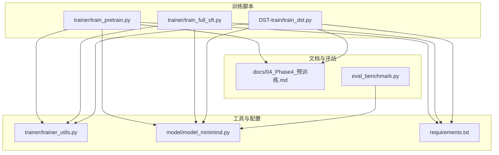
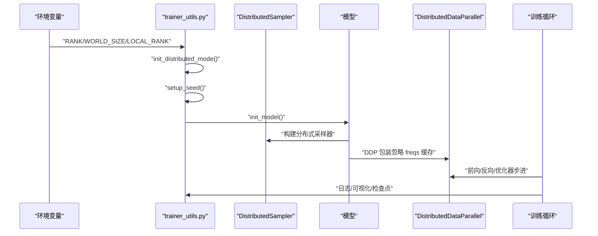
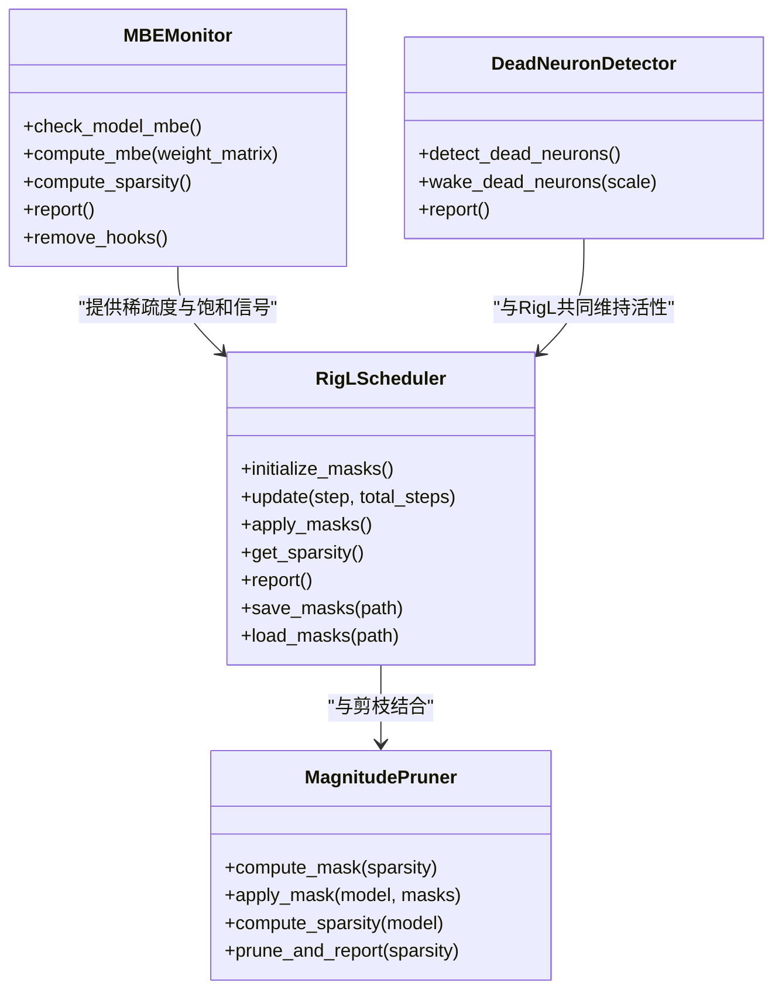
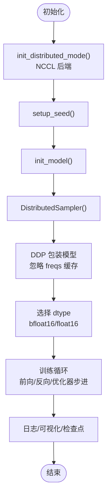
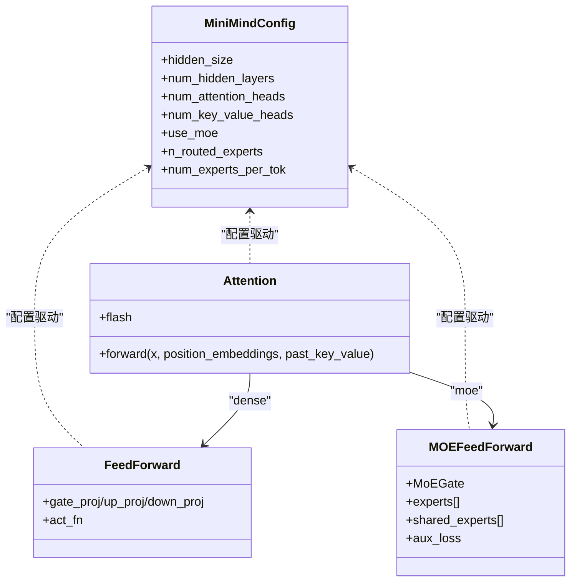
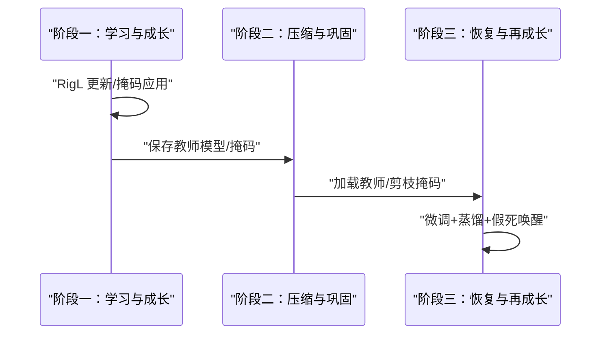
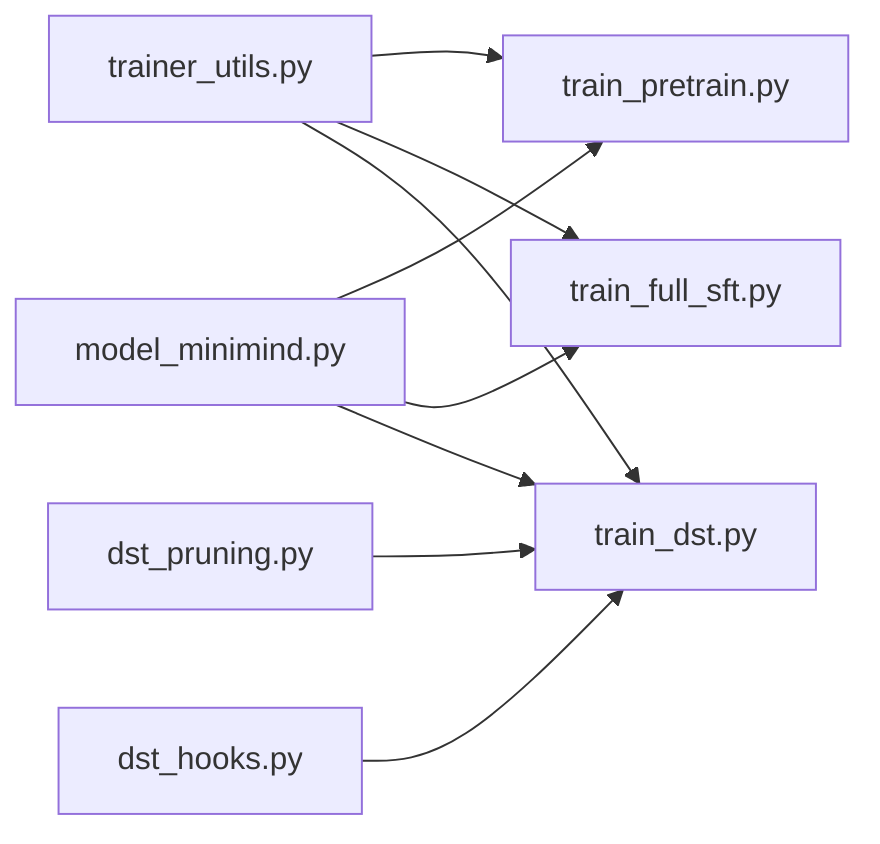

# 分布式训练优化

<cite>
**本文档引用的文件**
- [train_dst.py](file://DST-train/train_dst.py)
- [dst_hooks.py](file://DST-train/dst_hooks.py)
- [dst_pruning.py](file://DST-train/dst_pruning.py)
- [trainer_utils.py](file://trainer/trainer_utils.py)
- [train_pretrain.py](file://trainer/train_pretrain.py)
- [train_full_sft.py](file://trainer/train_full_sft.py)
- [model_minimind.py](file://model/model_minimind.py)
- [README.md](file://README.md)
- [requirements.txt](file://requirements.txt)
- [04_Phase4_预训练.md](file://docs/04_Phase4_预训练.md)
- [eval_benchmark.py](file://eval_benchmark.py)
</cite>

## 目录
1. [引言](#引言)
2. [项目结构](#项目结构)
3. [核心组件](#核心组件)
4. [架构总览](#架构总览)
5. [详细组件分析](#详细组件分析)
6. [依赖关系分析](#依赖关系分析)
7. [性能考量](#性能考量)
8. [故障排除指南](#故障排除指南)
9. [结论](#结论)
10. [附录](#附录)

## 引言
本文件围绕分布式训练优化展开，结合代码库中的动态稀疏训练（DST）、剪枝与蒸馏、知识蒸馏、以及预训练/微调脚本，系统阐述数据并行（DDP）与混合精度、梯度累积、梯度裁剪等关键技术在大规模训练中的应用。文档同时给出通信优化（NCCL）、通信聚合、带宽利用率提升的实践建议，并提供配置参数、GPU资源分配、内存管理与网络拓扑优化的部署建议，最后包含性能基准测试与故障排除指南。

## 项目结构
该项目采用“按阶段/功能模块化”的组织方式，训练脚本集中在 trainer 目录，动态稀疏训练（DST）在 DST-train 目录，模型架构在 model 目录，配套文档在 docs 目录，评估脚本在根目录。分布式训练在多个训练脚本中均有体现，统一通过 torch.distributed 与 NCCL 后端实现。



**图表来源**
- [train_pretrain.py:1-162](file://trainer/train_pretrain.py#L1-L162)
- [train_full_sft.py:1-163](file://trainer/train_full_sft.py#L1-L163)
- [train_dst.py:1-472](file://DST-train/train_dst.py#L1-L472)
- [trainer_utils.py:1-139](file://trainer/trainer_utils.py#L1-L139)
- [model_minimind.py:1-477](file://model/model_minimind.py#L1-L477)
- [requirements.txt:1-31](file://requirements.txt#L1-L31)
- [04_Phase4_预训练.md:1-352](file://docs/04_Phase4_预训练.md#L1-L352)
- [eval_benchmark.py:1-319](file://eval_benchmark.py#L1-L319)

**章节来源**
- [README.md:390-423](file://README.md#L390-L423)
- [requirements.txt:1-31](file://requirements.txt#L1-L31)

## 核心组件
- 分布式训练基础设施：统一的 DDP 初始化、本地 rank 设置、主进程判断、随机种子设置、混合精度上下文、模型 DDP 包装与参数忽略列表。
- 动态稀疏训练（DST）：RigL 动态稀疏调度器、矩阵基熵（MBE）监控、假死神经元检测与唤醒。
- 剪枝与蒸馏：基于幅度的剪枝器、蒸馏损失函数、阶段化训练流程（学习与成长→压缩与巩固→恢复与再成长）。
- 训练循环与优化：学习率调度（余弦退火）、混合精度（GradScaler）、梯度累积、梯度裁剪、日志与可视化（SwanLab/W&B）。
- 模型架构：MiniMindConfig、MiniMindModel、Attention、FeedForward、MoE（可选）。

**章节来源**
- [trainer_utils.py:1-139](file://trainer/trainer_utils.py#L1-L139)
- [dst_hooks.py:1-263](file://DST-train/dst_hooks.py#L1-L263)
- [dst_pruning.py:1-291](file://DST-train/dst_pruning.py#L1-L291)
- [train_dst.py:1-472](file://DST-train/train_dst.py#L1-L472)
- [model_minimind.py:1-477](file://model/model_minimind.py#L1-L477)

## 架构总览
分布式训练在多个脚本中采用一致的模式：初始化分布式环境 → 设置设备与混合精度 → 构建模型与数据加载器（含 DistributedSampler）→ DDP 包装 → 训练循环（前向、反向、优化器步进、日志）→ 检查点保存与可视化。



**图表来源**
- [trainer_utils.py:28-46](file://trainer/trainer_utils.py#L28-L46)
- [train_pretrain.py:107-150](file://trainer/train_pretrain.py#L107-L150)
- [train_full_sft.py:107-150](file://trainer/train_full_sft.py#L107-L150)
- [train_dst.py:344-374](file://DST-train/train_dst.py#L344-L374)

## 详细组件分析

### 动态稀疏训练（DST）与 RigL
- RigL 调度器：在训练过程中周期性地“剪枝最不重要的连接，同时生长新的连接”，通过掩码控制活跃连接与非活跃连接的切换，实现边训练边重组网络结构。
- MBE 监控：通过权重矩阵的 SVD 计算矩阵基熵，判断模型是否达到“学习饱和”，并据此触发策略调整。
- 假死神经元检测：检测权重矩阵行全零导致的神经元死亡，进行唤醒以维持网络潜力。



**图表来源**
- [dst_pruning.py:120-291](file://DST-train/dst_pruning.py#L120-L291)
- [dst_hooks.py:10-263](file://DST-train/dst_hooks.py#L10-L263)

**章节来源**
- [dst_pruning.py:1-291](file://DST-train/dst_pruning.py#L1-L291)
- [dst_hooks.py:1-263](file://DST-train/dst_hooks.py#L1-L263)
- [train_dst.py:74-264](file://DST-train/train_dst.py#L74-L264)

### 分布式数据并行（DDP）与混合精度
- DDP 初始化：通过 NCCL 后端初始化进程组，设置本地设备，返回 local_rank。
- 模型 DDP 包装：对 RoPE 频率缓存等参数加入忽略列表，避免不必要的同步。
- 混合精度：根据 dtype 选择 bfloat16 或 float16，使用 GradScaler 与 autocast 上下文。
- 分布式采样：使用 DistributedSampler，每轮设置 epoch 以保证随机性。



**图表来源**
- [trainer_utils.py:28-46](file://trainer/trainer_utils.py#L28-L46)
- [train_pretrain.py:107-150](file://trainer/train_pretrain.py#L107-L150)
- [train_full_sft.py:107-150](file://trainer/train_full_sft.py#L107-L150)
- [train_dst.py:344-374](file://DST-train/train_dst.py#L344-L374)

**章节来源**
- [trainer_utils.py:28-46](file://trainer/trainer_utils.py#L28-L46)
- [train_pretrain.py:107-150](file://trainer/train_pretrain.py#L107-L150)
- [train_full_sft.py:107-150](file://trainer/train_full_sft.py#L107-L150)
- [train_dst.py:344-374](file://DST-train/train_dst.py#L344-L374)

### 梯度累积、梯度裁剪与学习率调度
- 梯度累积：通过将损失除以 accumulation_steps，在多次前向后统一反向与优化器步进，扩大有效 batch size。
- 梯度裁剪：使用 clip_grad_norm 防止梯度爆炸，提升训练稳定性。
- 学习率调度：采用余弦退火，warmup 后平滑下降，适合大规模训练的稳定收敛。

```mermaid
sequenceDiagram
participant Loop as "训练循环"
participant Loss as "损失计算"
participant Backward as "反向传播"
participant Clip as "梯度裁剪"
participant Opt as "优化器步进"
Loop->>Loss : "前向+损失"
Loss->>Backward : "scaler.scale(loss).backward()"
Backward->>Clip : "clip_grad_norm_()"
Clip->>Opt : "scaler.step()/update()"
Opt->>Loop : "zero_grad()/empty_cache()"
```

**图表来源**
- [train_pretrain.py:23-80](file://trainer/train_pretrain.py#L23-L80)
- [train_full_sft.py:23-80](file://trainer/train_full_sft.py#L23-L80)
- [train_dst.py:74-139](file://DST-train/train_dst.py#L74-L139)

**章节来源**
- [train_pretrain.py:23-80](file://trainer/train_pretrain.py#L23-L80)
- [train_full_sft.py:23-80](file://trainer/train_full_sft.py#L23-L80)
- [train_dst.py:74-139](file://DST-train/train_dst.py#L74-L139)

### 模型架构与 MoE 支持
- MiniMindConfig：定义隐藏维度、层数、注意力头数、RoPE 参数、MoE 开关与专家配置。
- Attention：支持 Flash Attention（若可用），否则回退到标准实现；支持 KV 重复与 past_key_values 缓存。
- FeedForward：SwiGLU 激活；MoEFeedForward：Top-2 门控路由，支持共享专家与辅助损失。
- MiniMindModel：嵌入层、多层 Block、RMSNorm、RoPE 频率缓存注册为 buffer。



**图表来源**
- [model_minimind.py:8-78](file://model/model_minimind.py#L8-L78)
- [model_minimind.py:150-227](file://model/model_minimind.py#L150-L227)
- [model_minimind.py:229-243](file://model/model_minimind.py#L229-L243)
- [model_minimind.py:245-338](file://model/model_minimind.py#L245-L338)

**章节来源**
- [model_minimind.py:1-477](file://model/model_minimind.py#L1-L477)

### 知识蒸馏与阶段化训练
- 阶段一：预训练 + RigL 动态稀疏训练，MBE 监控与掩码应用。
- 阶段二：Magnitude Pruning 剪枝，保存教师模型与掩码。
- 阶段三：低学习率微调 + 可选蒸馏 + 假死神经元唤醒，恢复模型性能。



**图表来源**
- [train_dst.py:376-471](file://DST-train/train_dst.py#L376-L471)
- [dst_pruning.py:85-118](file://DST-train/dst_pruning.py#L85-L118)
- [dst_hooks.py:162-263](file://DST-train/dst_hooks.py#L162-L263)

**章节来源**
- [train_dst.py:376-471](file://DST-train/train_dst.py#L376-L471)
- [dst_pruning.py:1-291](file://DST-train/dst_pruning.py#L1-L291)
- [dst_hooks.py:1-263](file://DST-train/dst_hooks.py#L1-L263)

## 依赖关系分析
- 训练脚本依赖统一的工具函数：分布式初始化、主进程判断、日志、学习率调度、模型初始化、检查点保存等。
- DST 训练脚本引入剪枝与监控模块，形成“稀疏训练→剪枝→恢复”的闭环。
- 模型架构与训练脚本解耦，通过配置对象传递参数，便于扩展 MoE 与不同规模模型。



**图表来源**
- [trainer_utils.py:1-139](file://trainer/trainer_utils.py#L1-L139)
- [train_pretrain.py:1-162](file://trainer/train_pretrain.py#L1-L162)
- [train_full_sft.py:1-163](file://trainer/train_full_sft.py#L1-L163)
- [train_dst.py:1-472](file://DST-train/train_dst.py#L1-L472)
- [dst_pruning.py:1-291](file://DST-train/dst_pruning.py#L1-L291)
- [dst_hooks.py:1-263](file://DST-train/dst_hooks.py#L1-L263)
- [model_minimind.py:1-477](file://model/model_minimind.py#L1-L477)

**章节来源**
- [trainer_utils.py:1-139](file://trainer/trainer_utils.py#L1-L139)
- [train_dst.py:1-472](file://DST-train/train_dst.py#L1-L472)

## 性能考量
- 混合精度与梯度累积：在显存受限时通过增大 accumulation_steps 扩展有效 batch size，减少峰值显存占用。
- 梯度裁剪：防止梯度爆炸，提升训练稳定性与收敛速度。
- 学习率调度：余弦退火在大规模训练中表现稳定，建议配合 warmup 使用。
- DDP 优化：忽略非参数缓冲区（如 RoPE 频率缓存）避免同步开销；使用 DistributedSampler 确保数据均匀划分。
- MoE：在大模型中可显著降低计算与存储压力，但需关注专家路由与辅助损失的权衡。

[本节为通用指导，无需引用具体文件]

## 故障排除指南
- CUDA 可用性与版本：确认 CUDA 可用、版本匹配，GPU 数量与名称正确。
- 分布式初始化失败：检查 RANK、WORLD_SIZE、LOCAL_RANK 环境变量，确认 NCCL 后端可用。
- 检查点恢复：确认 world_size 一致性，必要时自动转换 step；确保 resume 文件存在。
- 梯度爆炸/不收敛：降低学习率、启用梯度裁剪、检查数据与掩码；观察 MBE 与稀疏度变化。
- 显存不足：减小 batch size 或增大 accumulation_steps；关闭不必要的可视化；使用 bfloat16。

**章节来源**
- [trainer_utils.py:15-46](file://trainer/trainer_utils.py#L15-L46)
- [train_pretrain.py:137-145](file://trainer/train_pretrain.py#L137-L145)
- [train_full_sft.py:137-145](file://trainer/train_full_sft.py#L137-L145)
- [train_dst.py:409-418](file://DST-train/train_dst.py#L409-L418)

## 结论
本项目在分布式训练方面提供了完整的基础设施与优化实践：统一的 DDP 模式、混合精度与梯度累积、学习率调度、检查点续训与可视化；在动态稀疏训练与知识蒸馏方面，通过 RigL、MBE 监控与剪枝恢复，实现了高效稳定的训练流程。结合 MoE 架构与合理的资源配置，可在单机多卡环境下实现快速、可控的大规模训练。

[本节为总结性内容，无需引用具体文件]

## 附录

### 配置参数与部署建议
- 分布式训练
  - 启动方式：torchrun --nproc_per_node N 训练脚本
  - NCCL 后端：确保环境变量 RANK/WORLD_SIZE/LOCAL_RANK 正确设置
  - DDP 包装：忽略 RoPE 频率缓存，避免不必要的同步
- 混合精度
  - dtype=bfloat16：无需 GradScaler，数值稳定
  - dtype=float16：使用 GradScaler 防止下溢
- 梯度累积与裁剪
  - accumulation_steps：按显存与吞吐调优
  - grad_clip：建议 1.0，防止梯度爆炸
- 学习率调度
  - 余弦退火：warmup 后平滑下降，适合大规模训练
- GPU 资源分配
  - 单机多卡：按 GPU 数量线性扩展 batch size
  - 显存紧张：优先增大 accumulation_steps，其次减小 batch size
- 内存管理
  - 训练中定期 empty_cache，释放未使用的缓存
  - 检查点保存采用半精度权重，减少磁盘占用
- 网络拓扑优化
  - 使用 NVLink/IB 等高带宽互联，减少通信瓶颈
  - 合理设置 num_workers 与 pin_memory，平衡 CPU/GPU 利用率

**章节来源**
- [README.md:390-423](file://README.md#L390-L423)
- [trainer_utils.py:28-46](file://trainer/trainer_utils.py#L28-L46)
- [train_pretrain.py:117-136](file://trainer/train_pretrain.py#L117-L136)
- [train_full_sft.py:117-136](file://trainer/train_full_sft.py#L117-L136)
- [train_dst.py:398-406](file://DST-train/train_dst.py#L398-L406)

### 性能基准测试
- 评测脚本：eval_benchmark.py 支持 C-Eval 与 CMMLU，提供多学科准确率统计与汇总报告。
- 使用建议：在验证集上运行，记录总体与分科目准确率，便于对比不同配置与模型版本。

**章节来源**
- [eval_benchmark.py:1-319](file://eval_benchmark.py#L1-L319)