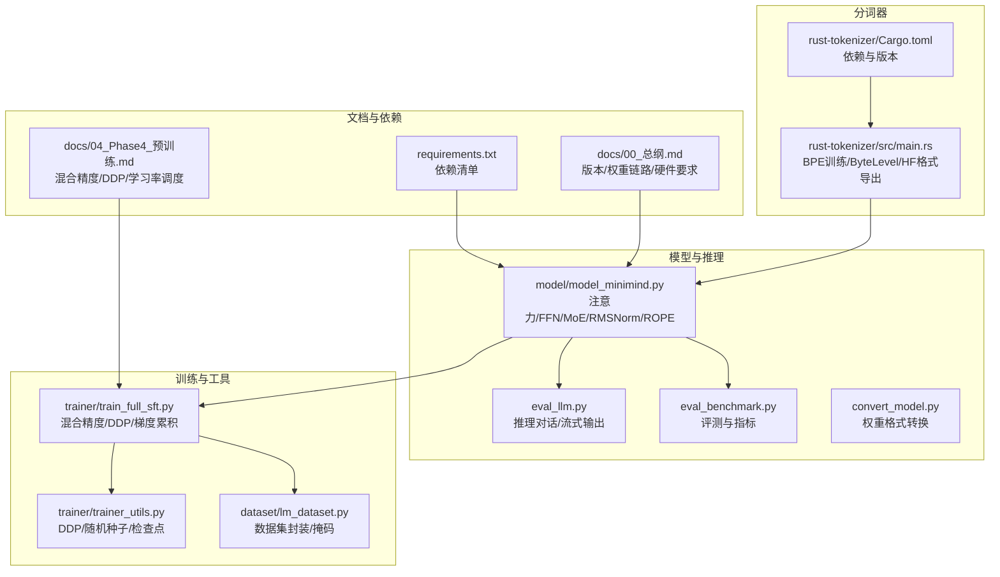
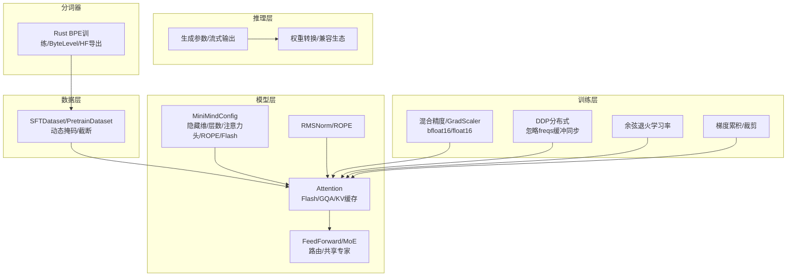
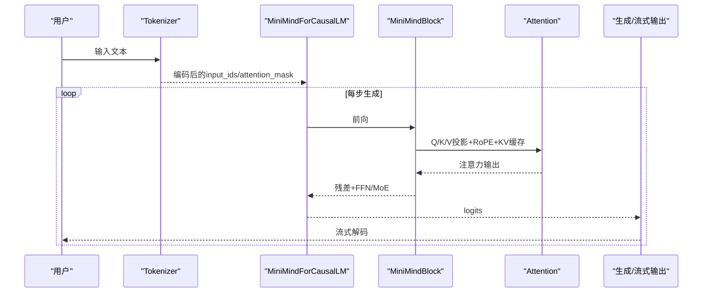
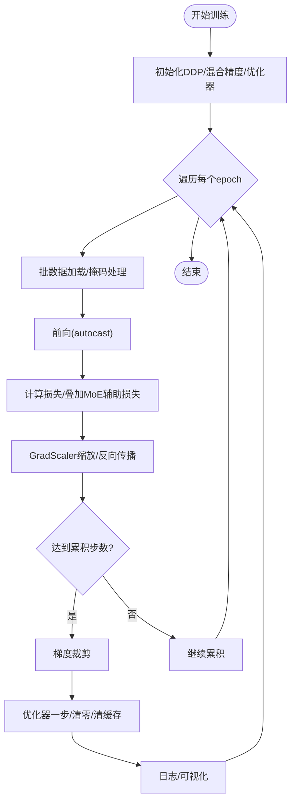
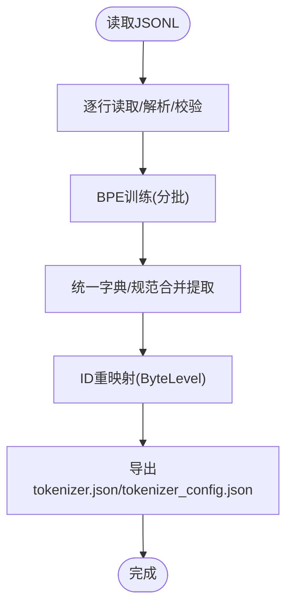
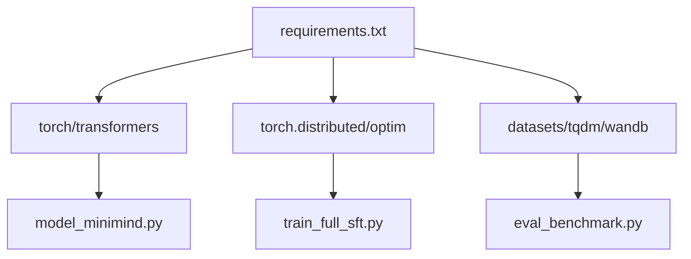

# 性能优化

<cite>
**本文引用的文件**
- [model_minimind.py](file://model/model_minimind.py)
- [train_full_sft.py](file://trainer/train_full_sft.py)
- [trainer_utils.py](file://trainer/trainer_utils.py)
- [lm_dataset.py](file://dataset/lm_dataset.py)
- [eval_benchmark.py](file://eval_benchmark.py)
- [eval_llm.py](file://eval_llm.py)
- [convert_model.py](file://scripts/convert_model.py)
- [main.rs](file://rust-tokenizer/src/main.rs)
- [Cargo.toml](file://rust-tokenizer/Cargo.toml)
- [requirements.txt](file://requirements.txt)
- [04_预训练.md](file://docs/04_Phase4_预训练.md)
- [00_总纲.md](file://docs/00_总纲.md)
</cite>

## 目录
1. [引言](#引言)
2. [项目结构](#项目结构)
3. [核心组件](#核心组件)
4. [架构总览](#架构总览)
5. [详细组件分析](#详细组件分析)
6. [依赖分析](#依赖分析)
7. [性能考量](#性能考量)
8. [故障排查指南](#故障排查指南)
9. [结论](#结论)
10. [附录](#附录)

## 引言
本指南聚焦MiniMind在性能优化方面的系统性实践，覆盖模型推理优化、训练效率提升、资源利用优化、Rust分词器性能优化、混合精度训练配置与监控、分布式训练策略、推理加速方法以及性能基准测试与瓶颈分析。文档以仓库现有实现为依据，结合可视化图示与实操建议，帮助读者在不同阶段（预训练、SFT、LoRA、蒸馏、强化学习、推理部署）获得可落地的性能提升。

## 项目结构
MiniMind采用“模块化+阶段化”的组织方式：模型定义位于model目录，训练脚本集中在trainer，数据集与评估脚本分别在dataset与eval目录，Rust分词器独立于rust-tokenizer工程，文档与配置贯穿各阶段。

**图表来源**
- [model_minimind.py:1-475](file://model/model_minimind.py#L1-L475)
- [eval_llm.py:1-89](file://eval_llm.py#L1-L89)
- [eval_benchmark.py:1-319](file://eval_benchmark.py#L1-L319)
- [convert_model.py:1-76](file://scripts/convert_model.py#L1-L76)
- [train_full_sft.py:1-163](file://trainer/train_full_sft.py#L1-L163)
- [trainer_utils.py:1-139](file://trainer/trainer_utils.py#L1-L139)
- [lm_dataset.py:1-250](file://dataset/lm_dataset.py#L1-L250)
- [main.rs:1-384](file://rust-tokenizer/src/main.rs#L1-L384)
- [Cargo.toml:1-15](file://rust-tokenizer/Cargo.toml#L1-L15)
- [04_预训练.md:94-254](file://docs/04_Phase4_预训练.md#L94-L254)
- [00_总纲.md:1-144](file://docs/00_总纲.md#L1-L144)
- [requirements.txt:1-31](file://requirements.txt#L1-L31)

**章节来源**
- [model_minimind.py:1-475](file://model/model_minimind.py#L1-L475)
- [train_full_sft.py:1-163](file://trainer/train_full_sft.py#L1-L163)
- [trainer_utils.py:1-139](file://trainer/trainer_utils.py#L1-L139)
- [lm_dataset.py:1-250](file://dataset/lm_dataset.py#L1-L250)
- [eval_benchmark.py:1-319](file://eval_benchmark.py#L1-L319)
- [eval_llm.py:1-89](file://eval_llm.py#L1-L89)
- [convert_model.py:1-76](file://scripts/convert_model.py#L1-L76)
- [main.rs:1-384](file://rust-tokenizer/src/main.rs#L1-L384)
- [Cargo.toml:1-15](file://rust-tokenizer/Cargo.toml#L1-L15)
- [04_预训练.md:94-254](file://docs/04_Phase4_预训练.md#L94-L254)
- [00_总纲.md:1-144](file://docs/00_总纲.md#L1-L144)
- [requirements.txt:1-31](file://requirements.txt#L1-L31)

## 核心组件
- 模型与注意力：实现Flash Attention路径、KV缓存、RoPE扩展、分组查询注意力（GQA）、RMSNorm与SwiGLU变体，支持MoE路由与共享专家。
- 训练流水线：混合精度（bfloat16/float16）、GradScaler、梯度累积、梯度裁剪、余弦退火学习率、DDP分布式、检查点与续训。
- 数据与掩码：预训练/指令微调数据集封装，动态loss mask屏蔽系统/用户标记区域，提升对齐质量。
- 推理与评测：对话推理（流式输出）、评测脚本（多选题ABC D概率对比法）、基准结果聚合。
- 分词器：Rust实现BPE训练、ByteLevel编码、规范化合并规则提取、导出HF格式tokenizer.json/tokenizer_config.json。
- 权重转换：将原生权重转换为Transformers格式或Llama兼容格式，便于生态对接。

**章节来源**
- [model_minimind.py:80-475](file://model/model_minimind.py#L80-L475)
- [train_full_sft.py:23-163](file://trainer/train_full_sft.py#L23-L163)
- [trainer_utils.py:1-139](file://trainer/trainer_utils.py#L1-L139)
- [lm_dataset.py:16-250](file://dataset/lm_dataset.py#L16-L250)
- [eval_benchmark.py:1-319](file://eval_benchmark.py#L1-L319)
- [eval_llm.py:1-89](file://eval_llm.py#L1-L89)
- [convert_model.py:1-76](file://scripts/convert_model.py#L1-L76)
- [main.rs:1-384](file://rust-tokenizer/src/main.rs#L1-L384)

## 架构总览
MiniMind的性能优化贯穿“数据-模型-训练-推理”全链路。训练侧通过混合精度与DDP并行、梯度累积与裁剪稳定收敛；模型侧采用Flash Attention与KV缓存减少显存与算力开销；推理侧通过流式输出、生成参数调节与权重转换实现高效部署；分词器侧以Rust实现高性能BPE训练与ByteLevel编码，确保训练与推理的一致性。

**图表来源**
- [model_minimind.py:80-475](file://model/model_minimind.py#L80-L475)
- [train_full_sft.py:23-163](file://trainer/train_full_sft.py#L23-L163)
- [trainer_utils.py:1-139](file://trainer/trainer_utils.py#L1-L139)
- [lm_dataset.py:54-124](file://dataset/lm_dataset.py#L54-L124)
- [eval_llm.py:12-89](file://eval_llm.py#L12-L89)
- [convert_model.py:14-76](file://scripts/convert_model.py#L14-L76)
- [main.rs:131-384](file://rust-tokenizer/src/main.rs#L131-L384)

## 详细组件分析

### 模型推理优化（注意力/KV缓存/Flash Attention）
- KV缓存：在推理时拼接past_key_value，避免重复计算，显著降低长序列推理时间与显存占用。
- Flash Attention：当满足条件时走scaled_dot_product_attention路径，减少中间张量分配与核函数切换开销。
- RoPE扩展：支持推理时外推，配合YARN缩放配置，提升长上下文泛化能力。
- RMSNorm与SwiGLU：数值稳定、计算友好，有助于混合精度下的稳定性。

**图表来源**
- [model_minimind.py:169-224](file://model/model_minimind.py#L169-L224)
- [model_minimind.py:361-438](file://model/model_minimind.py#L361-L438)
- [eval_llm.py:77-85](file://eval_llm.py#L77-L85)

**章节来源**
- [model_minimind.py:150-224](file://model/model_minimind.py#L150-L224)
- [model_minimind.py:361-438](file://model/model_minimind.py#L361-L438)
- [eval_llm.py:12-89](file://eval_llm.py#L12-L89)

### 训练效率提升（混合精度/DDP/梯度累积/学习率调度）
- 混合精度：根据dtype选择bfloat16或float16，使用GradScaler防止梯度下溢；训练脚本中明确区分CPU与CUDA路径。
- DDP：初始化NCCL后设置本地设备，将freqs_cos/freqs_sin加入忽略同步集合，避免同步昂贵缓冲。
- 梯度累积：通过累计步数放大batch size，平衡显存与吞吐；配合梯度裁剪防止爆炸。
- 学习率：余弦退火调度，warmup后平滑下降，兼顾收敛速度与稳定性。

**图表来源**
- [train_full_sft.py:23-80](file://trainer/train_full_sft.py#L23-L80)
- [trainer_utils.py:28-46](file://trainer/trainer_utils.py#L28-L46)
- [04_预训练.md:94-254](file://docs/04_Phase4_预训练.md#L94-L254)

**章节来源**
- [train_full_sft.py:23-163](file://trainer/train_full_sft.py#L23-L163)
- [trainer_utils.py:28-46](file://trainer/trainer_utils.py#L28-L46)
- [04_预训练.md:94-254](file://docs/04_Phase4_预训练.md#L94-L254)

### 资源利用优化（显存/内存/IO）
- 显存优化：KV缓存复用、Flash Attention、半精度存储权重、GradScaler动态缩放、torch.cuda.empty_cache定期释放碎片。
- 内存优化：数据集按需截断、动态掩码仅保留必要位置、RMSNorm与轻量激活函数。
- IO优化：数据加载使用pin_memory、num_workers、SkipBatchSampler跳过已处理step，减少重启开销。

**章节来源**
- [train_full_sft.py:47-56](file://trainer/train_full_sft.py#L47-L56)
- [trainer_utils.py:114-139](file://trainer/trainer_utils.py#L114-L139)
- [lm_dataset.py:16-124](file://dataset/lm_dataset.py#L16-L124)

### Rust分词器性能优化（内存/并行/缓存）
- ByteLevel编码：将字节映射为可打印ASCII或U+0100+偏移，减少非ASCII字符的复杂处理。
- BPE训练：使用wordchipper训练器，分批喂入样本，训练完成后提取规范合并规则，确保可复现性。
- ID重映射：将wordchipper的byte vocab(0-255)+BPE合并token映射到HF格式ID空间，特殊token优先。
- JSON导出：手动生成tokenizer.json/tokenizer_config.json，控制字段顺序与decoder行为，避免额外解析开销。
- 并行与缓存：训练主流程按行读取JSONL，逐行解析与校验，避免一次性加载全部数据；合并规则提取阶段建立查找表与反向映射，减少重复扫描。

**图表来源**
- [main.rs:42-192](file://rust-tokenizer/src/main.rs#L42-L192)
- [main.rs:194-331](file://rust-tokenizer/src/main.rs#L194-L331)

**章节来源**
- [main.rs:1-384](file://rust-tokenizer/src/main.rs#L1-L384)
- [Cargo.toml:1-15](file://rust-tokenizer/Cargo.toml#L1-L15)

### 混合精度训练配置与监控
- dtype选择：bfloat16无需GradScaler，数值更稳定；float16需GradScaler防止下溢。
- autocast上下文：仅在前向使用，反向通过GradScaler缩放。
- 监控：记录loss、学习率、剩余时间等，结合wandb/suanlab进行可视化追踪。

**章节来源**
- [train_full_sft.py:117-130](file://trainer/train_full_sft.py#L117-L130)
- [04_预训练.md:180-198](file://docs/04_Phase4_预训练.md#L180-L198)

### 分布式训练优化（数据并行/DDP）
- 初始化：NCCL后设置本地设备；忽略freqs_cos/freqs_sin同步，避免冗余通信。
- 采样器：DistributedSampler按epoch打乱，保证全局随机性。
- 检查点：DDP模型保存module.state_dict，兼容多卡恢复。

**章节来源**
- [trainer_utils.py:28-46](file://trainer/trainer_utils.py#L28-L46)
- [train_full_sft.py:147-150](file://trainer/train_full_sft.py#L147-L150)

### 推理加速（算子融合/内存池/批量处理）
- 算子融合：Flash Attention天然融合缩放点积与Softmax/Dropout，减少中间张量。
- 内存池：KV缓存复用避免重复分配；torch.cuda.empty_cache释放碎片。
- 批量处理：eval_benchmark按batch_size分批推理，提高吞吐；eval_llm支持流式输出与生成参数调节。

**章节来源**
- [model_minimind.py:196-224](file://model/model_minimind.py#L196-L224)
- [train_full_sft.py:55-56](file://trainer/train_full_sft.py#L55-L56)
- [eval_benchmark.py:55-126](file://eval_benchmark.py#L55-L126)
- [eval_llm.py:77-85](file://eval_llm.py#L77-L85)

### 性能基准测试与瓶颈分析
- 评测脚本：多选题评测（与lm_eval一致），统计整体与按科目准确率，输出JSON结果。
- 瓶颈定位：结合日志loss/lr/剩余时间、CUDA内存峰值、吞吐（samples/sec）与延迟（ms/tok）综合分析。
- 结果保存：统一保存至eval_results/benchmark_results.json，便于横向对比。

**章节来源**
- [eval_benchmark.py:1-319](file://eval_benchmark.py#L1-L319)

## 依赖分析
- PyTorch与Transformers：模型、生成、权重转换依赖torch与transformers生态。
- 训练生态：torch.distributed、GradScaler、AdamW、DDP、DistributedSampler。
- 评测与可视化：datasets、tqdm、wandb/swanlab、json等。

**图表来源**
- [requirements.txt:1-31](file://requirements.txt#L1-L31)
- [model_minimind.py:1-475](file://model/model_minimind.py#L1-L475)
- [train_full_sft.py:1-163](file://trainer/train_full_sft.py#L1-L163)
- [eval_benchmark.py:1-319](file://eval_benchmark.py#L1-L319)

**章节来源**
- [requirements.txt:1-31](file://requirements.txt#L1-L31)

## 性能考量
- 训练阶段：优先使用bfloat16以提升稳定性；在显存紧张时增大accumulation_steps，降低单步显存峰值；合理设置num_workers与pin_memory。
- 推理阶段：启用Flash Attention与KV缓存；根据硬件选择合适dtype；流式输出降低首token延迟。
- 分词器：Rust实现具备高吞吐与低GC压力，建议在大规模预训练前完成分词器构建并固化为HF格式。
- 数据管线：动态掩码与截断减少无效计算；SkipBatchSampler避免重启浪费。

[本节为通用指导，无需特定文件引用]

## 故障排查指南
- 混合精度异常：确认dtype与autocast匹配；float16需GradScaler；检查缩放比例与梯度裁剪阈值。
- DDP不同步：确认freqs_cos/freqs_sin加入忽略同步集合；检查world_size与rank环境变量。
- 显存不足：降低batch_size或增大accumulation_steps；开启KV缓存；及时调用empty_cache。
- 分词器不兼容：确保tokenizer.json/tokenizer_config.json导出完整且字段顺序正确；ByteLevel与合并规则与训练一致。

**章节来源**
- [train_full_sft.py:117-130](file://trainer/train_full_sft.py#L117-L130)
- [trainer_utils.py:28-46](file://trainer/trainer_utils.py#L28-L46)
- [main.rs:194-331](file://rust-tokenizer/src/main.rs#L194-L331)

## 结论
MiniMind在性能优化上形成了从数据、模型、训练到推理的闭环体系：以Flash Attention与KV缓存为核心推理优化手段，以混合精度与DDP为训练提速基石，并辅以Rust分词器与动态掩码的数据管线优化。通过基准测试与日志监控，可系统性定位瓶颈并迭代调优，从而在有限硬件条件下实现高效训练与稳定推理。

[本节为总结，无需特定文件引用]

## 附录
- 权重转换：支持将原生权重转换为Transformers或Llama兼容格式，便于生态对接与部署。
- 版本与链路：参考总纲文档，明确各阶段权重链路与硬件要求，便于规划资源与排期。

**章节来源**
- [convert_model.py:14-76](file://scripts/convert_model.py#L14-L76)
- [00_总纲.md:54-144](file://docs/00_总纲.md#L54-L144)