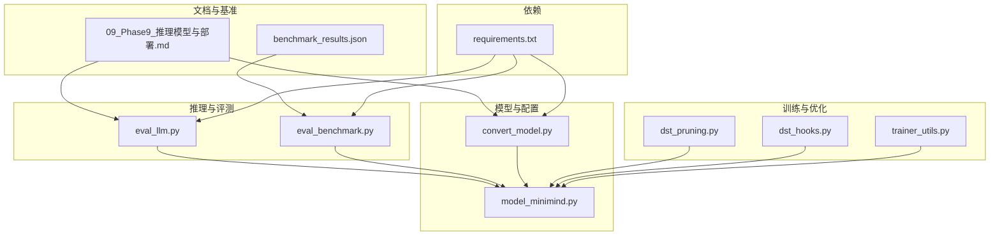
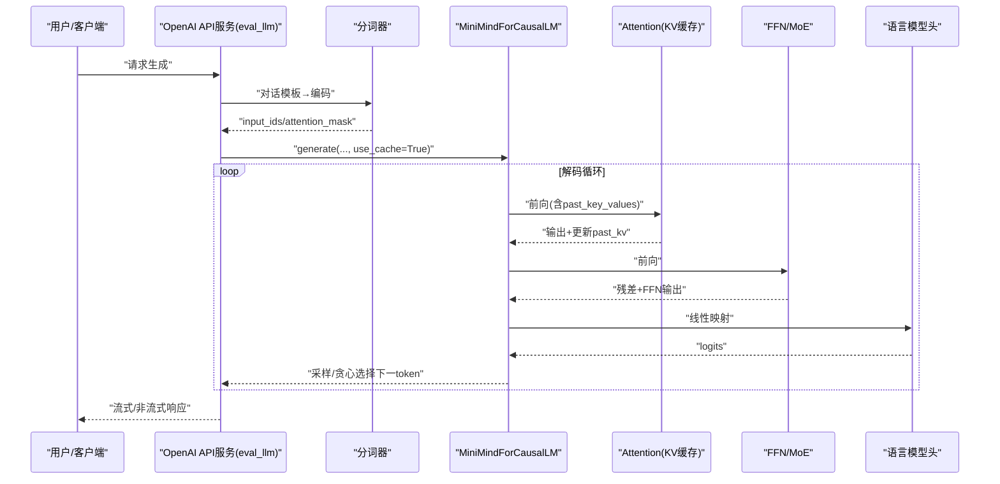
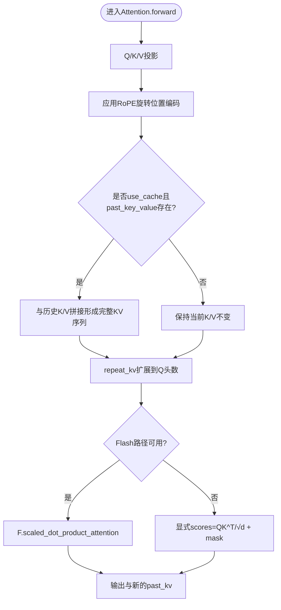
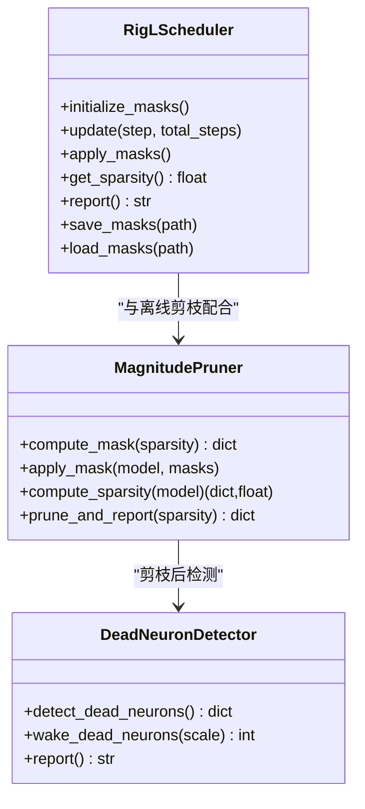
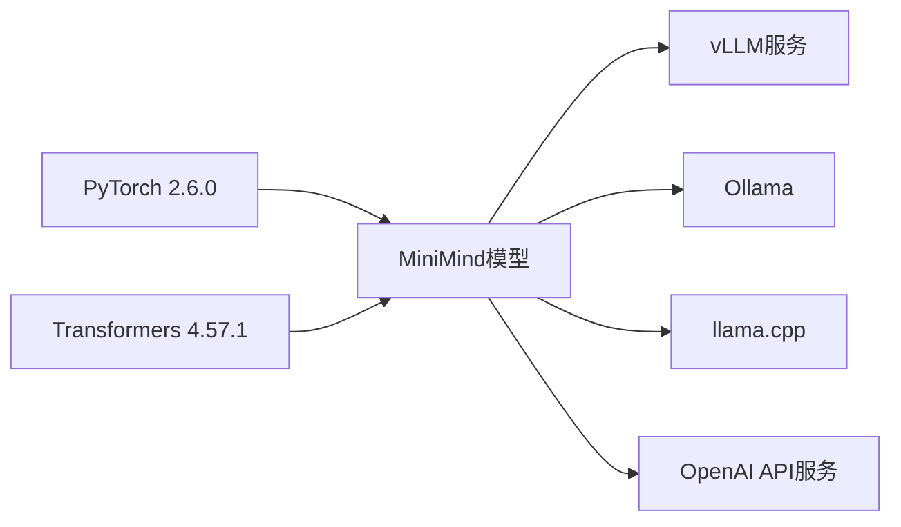

# 推理加速优化

<cite>
**本文档引用的文件**
- [README.md](file://README.md)
- [model_minimind.py](file://model/model_minimind.py)
- [eval_llm.py](file://eval_llm.py)
- [eval_benchmark.py](file://eval_benchmark.py)
- [convert_model.py](file://scripts/convert_model.py)
- [dst_pruning.py](file://DST-train/dst_pruning.py)
- [dst_hooks.py](file://DST-train/dst_hooks.py)
- [trainer_utils.py](file://trainer/trainer_utils.py)
- [requirements.txt](file://requirements.txt)
- [09_Phase9_推理模型与部署.md](file://docs/09_Phase9_推理模型与部署.md)
- [benchmark_results.json](file://reports/20260429/benchmark_results.json)
</cite>

## 目录
1. [引言](#引言)
2. [项目结构](#项目结构)
3. [核心组件](#核心组件)
4. [架构总览](#架构总览)
5. [详细组件分析](#详细组件分析)
6. [依赖关系分析](#依赖关系分析)
7. [性能考量](#性能考量)
8. [故障排查指南](#故障排查指南)
9. [结论](#结论)
10. [附录](#附录)

## 引言
本指南聚焦于MiniMind系列模型在推理阶段的加速优化实践，系统梳理从算子融合、KV缓存、注意力修剪到量化与第三方引擎集成的完整优化路径。结合项目内原生实现与第三方兼容方案，提供可落地的调优建议与性能基准参考，帮助开发者在不同硬件平台上实现低延迟、高吞吐、低内存占用的推理服务。

## 项目结构
- 模型定义与推理核心：model/model_minimind.py
- 推理评测与基准：eval_llm.py、eval_benchmark.py
- 模型格式转换：scripts/convert_model.py
- 动态稀疏与剪枝：DST-train/dst_pruning.py、DST-train/dst_hooks.py
- 训练与检查点工具：trainer/trainer_utils.py
- 文档与部署说明：docs/09_Phase9_推理模型与部署.md
- 性能基准结果：reports/20260429/benchmark_results.json
- 依赖声明：requirements.txt

**图表来源**
- [eval_llm.py:1-89](file://eval_llm.py#L1-L89)
- [eval_benchmark.py:1-319](file://eval_benchmark.py#L1-L319)
- [model_minimind.py:1-477](file://model/model_minimind.py#L1-L477)
- [convert_model.py:1-76](file://scripts/convert_model.py#L1-L76)
- [dst_pruning.py:1-291](file://DST-train/dst_pruning.py#L1-L291)
- [dst_hooks.py:1-263](file://DST-train/dst_hooks.py#L1-L263)
- [trainer_utils.py:1-139](file://trainer/trainer_utils.py#L1-L139)
- [09_Phase9_推理模型与部署.md:1-294](file://docs/09_Phase9_推理模型与部署.md#L1-L294)
- [benchmark_results.json:1-494](file://reports/20260429/benchmark_results.json#L1-L494)
- [requirements.txt:1-31](file://requirements.txt#L1-L31)

**章节来源**
- [README.md:1-200](file://README.md#L1-L200)
- [requirements.txt:1-31](file://requirements.txt#L1-L31)

## 核心组件
- 注意力与KV缓存：原生实现支持past_key_values增量解码，结合Flash Attention路径降低注意力计算开销。
- 分组查询注意力（GQA）：键/值头数小于查询头数，减少KV投影与缓存开销。
- RoPE位置编码与YaRN外推：支持推理时的长序列外推配置。
- 动态稀疏与剪枝：RigL动态稀疏训练与magnitude pruning，降低参数量与计算量。
- 推理服务与第三方引擎：OpenAI API兼容服务、Ollama、vLLM、llama.cpp等部署形态。
- 评测与基准：C-Eval/CMMLU评测脚本与结果聚合。

**章节来源**
- [model_minimind.py:150-227](file://model/model_minimind.py#L150-L227)
- [model_minimind.py:387-441](file://model/model_minimind.py#L387-L441)
- [dst_pruning.py:9-118](file://DST-train/dst_pruning.py#L9-L118)
- [dst_pruning.py:120-291](file://DST-train/dst_pruning.py#L120-L291)
- [dst_hooks.py:10-160](file://DST-train/dst_hooks.py#L10-L160)
- [09_Phase9_推理模型与部署.md:120-185](file://docs/09_Phase9_推理模型与部署.md#L120-L185)
- [eval_benchmark.py:18-127](file://eval_benchmark.py#L18-L127)

## 架构总览
MiniMind推理路径从输入token经嵌入、多层Transformer Block（注意力+FFN/MoE）、归一化与语言模型头，输出下一token分布。关键优化点包括：
- KV缓存复用：past_key_values在解码阶段增量拼接，避免重复计算。
- 注意力路径选择：Flash Attention在满足条件时走高效内核，否则回退到标准实现。
- RoPE外推：推理配置支持YaRN缩放，扩展有效上下文长度。
- 动态稀疏：训练期RigL与剪枝降低推理参数与访存压力。

**图表来源**
- [eval_llm.py:77-84](file://eval_llm.py#L77-L84)
- [model_minimind.py:443-476](file://model/model_minimind.py#L443-L476)
- [model_minimind.py:150-227](file://model/model_minimind.py#L150-L227)

## 详细组件分析

### 注意力与KV缓存优化
- KV缓存实现：在解码阶段将新增K/V与历史缓存拼接，past_key_value作为增量输入，显著降低重复注意力计算。
- 注意力路径：当seq_len>1且满足掩码条件时走scaled_dot_product_attention，否则使用显式softmax+mask路径。
- GQA与重复KV：通过repeat_kv将KV头复制到与Q头一致数量，兼顾效率与灵活性。

**图表来源**
- [model_minimind.py:150-227](file://model/model_minimind.py#L150-L227)

**章节来源**
- [model_minimind.py:150-227](file://model/model_minimind.py#L150-L227)
- [model_minimind.py:387-441](file://model/model_minimind.py#L387-L441)

### 算子融合与内存管理
- 算子融合思路：注意力与残差、FFN与残差在前向中顺序执行，减少中间激活存储；RoPE内联在Q/K投影后立即应用，避免额外张量拷贝。
- 内存池建议：在第三方引擎（如vLLM、llama.cpp）中启用连续内存分配与分页KV缓存；在PyTorch侧使用torch.compile或triton内核可进一步降低碎片化。
- 激活重计算：对非关键路径（如softmax）可在显存紧张时考虑反向激活重计算以换取显存。

**章节来源**
- [model_minimind.py:363-384](file://model/model_minimind.py#L363-L384)
- [README.md:1802-1819](file://README.md#L1802-L1819)

### 批量处理与流水线
- 批处理：eval_benchmark.py通过padding=True、truncation=True与batch_size参数实现批内并行；eval_llm.py支持多轮对话历史拼接与批量生成。
- 流水线：在服务端可将tokenize、prefill、decode阶段流水化，结合KV缓存实现prefill+decode并行。

**章节来源**
- [eval_benchmark.py:55-127](file://eval_benchmark.py#L55-L127)
- [eval_llm.py:69-84](file://eval_llm.py#L69-L84)

### 注意力修剪与稀疏注意力
- 动态稀疏（RigL）：训练期周期性剪枝权重最小连接并生长梯度最大连接，掩码固定后保持稀疏结构。
- magnitude pruning：按权重绝对值阈值剪枝，适用于部署前离线压缩。
- 假死神经元检测与唤醒：检测全零行（无连接的神经元），用小幅度随机值重初始化，缓解训练后期“假死”。

**图表来源**
- [dst_pruning.py:120-291](file://DST-train/dst_pruning.py#L120-L291)
- [dst_pruning.py:9-118](file://DST-train/dst_pruning.py#L9-L118)
- [dst_hooks.py:162-263](file://DST-train/dst_hooks.py#L162-L263)

**章节来源**
- [dst_pruning.py:120-291](file://DST-train/dst_pruning.py#L120-L291)
- [dst_pruning.py:9-118](file://DST-train/dst_pruning.py#L9-L118)
- [dst_hooks.py:162-263](file://DST-train/dst_hooks.py#L162-L263)

### 推理引擎优化配置
- vLLM部署：支持多卡推理、分页注意力与连续批量，适合高吞吐场景。
- Ollama部署：一键运行，适合本地与边缘部署。
- llama.cpp：支持CPU与量化（INT4/INT8），适合资源受限设备。
- OpenAI API兼容：统一接口便于集成第三方ChatUI与SDK。

**章节来源**
- [09_Phase9_推理模型与部署.md:120-185](file://docs/09_Phase9_推理模型与部署.md#L120-L185)
- [README.md:1802-1819](file://README.md#L1802-L1819)

### 评测与基准
- C-Eval/CMMLU评测：多学科题目评测，支持批处理与结果聚合。
- 结果参考：基准结果JSON包含各科目准确率与总体统计，便于横向对比。

**章节来源**
- [eval_benchmark.py:18-319](file://eval_benchmark.py#L18-L319)
- [benchmark_results.json:1-494](file://reports/20260429/benchmark_results.json#L1-L494)

## 依赖关系分析
- PyTorch版本：2.6.0，支持scaled_dot_product_attention与torch.compile。
- Transformers版本：4.57.1，提供AutoModelForCausalLM与AutoTokenizer。
- 第三方引擎：vLLM、Ollama、llama.cpp等通过格式转换与服务封装接入。

**图表来源**
- [requirements.txt:1-31](file://requirements.txt#L1-L31)
- [README.md:1802-1819](file://README.md#L1802-L1819)

**章节来源**
- [requirements.txt:1-31](file://requirements.txt#L1-L31)

## 性能考量
- 延迟优化
  - 启用use_cache与KV缓存复用，避免重复注意力计算。
  - 优先使用Flash Attention路径（满足掩码条件）。
  - RoPE外推：在推理配置中启用YaRN，扩大有效上下文长度。
- 吞吐量提升
  - 批量处理：增大batch_size与序列长度（受显存限制）。
  - 多卡/多进程：结合DDP或第三方引擎的多卡推理。
  - 服务端流水线：prefill与decode并行，减少首token延迟。
- 内存使用减少
  - 动态稀疏：RigL与magnitude pruning降低参数与访存。
  - 假死神经元唤醒：保持网络活性，避免无效参数。
  - 量化：llama.cpp支持INT4/INT8量化，显著降低显存占用。

**章节来源**
- [model_minimind.py:150-227](file://model/model_minimind.py#L150-L227)
- [dst_pruning.py:9-118](file://DST-train/dst_pruning.py#L9-L118)
- [dst_hooks.py:162-263](file://DST-train/dst_hooks.py#L162-L263)
- [README.md:1802-1819](file://README.md#L1802-L1819)

## 故障排查指南
- 推理报错或性能异常
  - 检查use_cache与past_key_values传递是否正确。
  - 确认attention_mask与seq_len条件满足Flash路径要求。
- 显存不足
  - 降低batch_size或序列长度。
  - 启用量化（llama.cpp）或离线剪枝（magnitude pruning）。
- 评测结果异常
  - 确认分词器与模型格式一致，必要时使用convert_model.py转换。
  - 检查eval_benchmark.py的max_length与padding策略。

**章节来源**
- [eval_benchmark.py:18-127](file://eval_benchmark.py#L18-L127)
- [convert_model.py:14-76](file://scripts/convert_model.py#L14-L76)
- [trainer_utils.py:100-112](file://trainer/trainer_utils.py#L100-L112)

## 结论
MiniMind在推理优化上具备天然优势：KV缓存、GQA、RoPE外推与可选的MoE结构。结合RigL动态稀疏、magnitude pruning与量化部署，可在不同硬件平台实现低延迟、高吞吐与低内存占用的推理服务。建议在生产环境中优先采用vLLM/Ollama等成熟引擎，并辅以动态稀疏与量化策略以获得最佳性价比。

## 附录
- 部署与服务
  - OpenAI API兼容服务：scripts/serve_openai_api.py
  - WebUI：streamlit run scripts/web_demo.py
  - 第三方引擎：vLLM、Ollama、llama.cpp
- 评测与对比
  - C-Eval/CMMLU评测脚本与结果：eval_benchmark.py、reports/20260429/benchmark_results.json

**章节来源**
- [09_Phase9_推理模型与部署.md:120-185](file://docs/09_Phase9_推理模型与部署.md#L120-L185)
- [eval_benchmark.py:18-319](file://eval_benchmark.py#L18-L319)
- [benchmark_results.json:1-494](file://reports/20260429/benchmark_results.json#L1-L494)