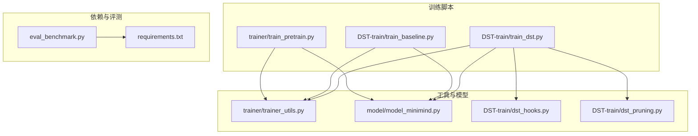
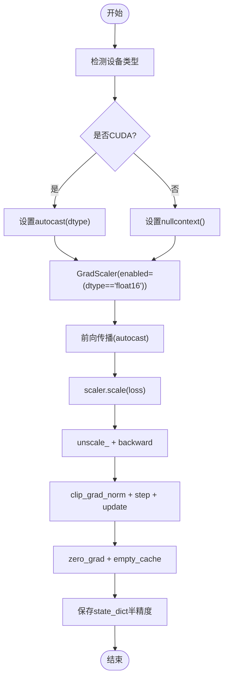
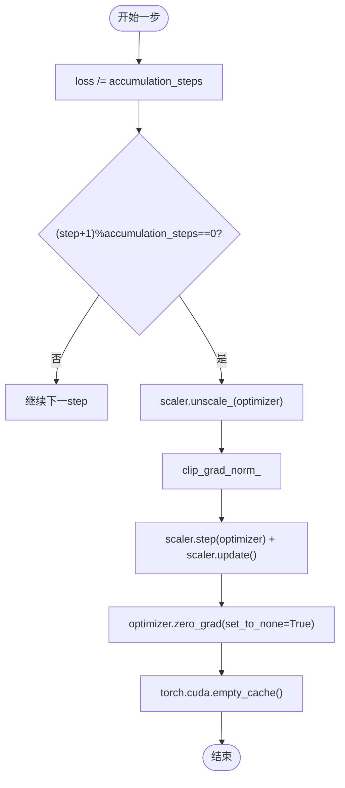
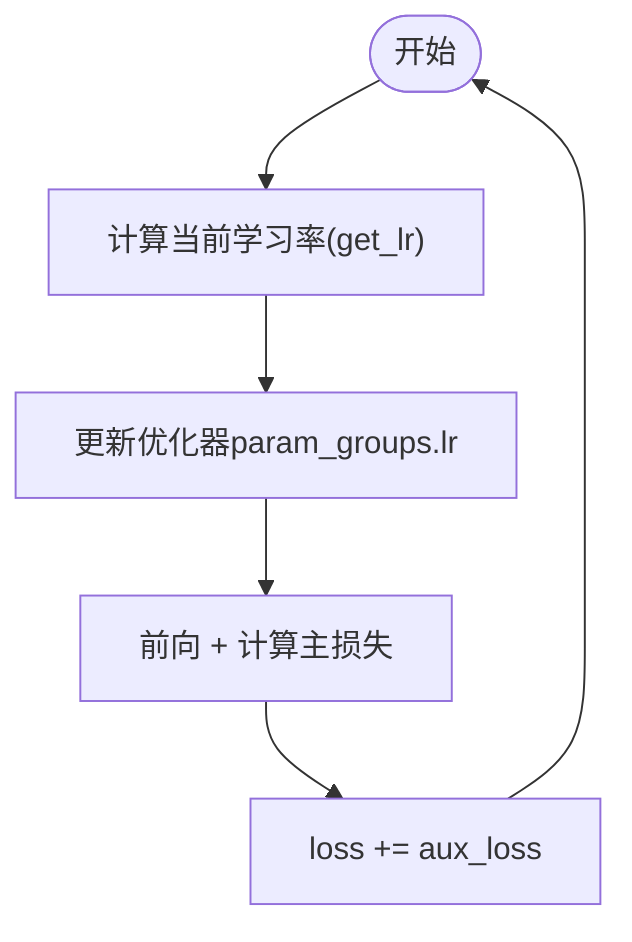
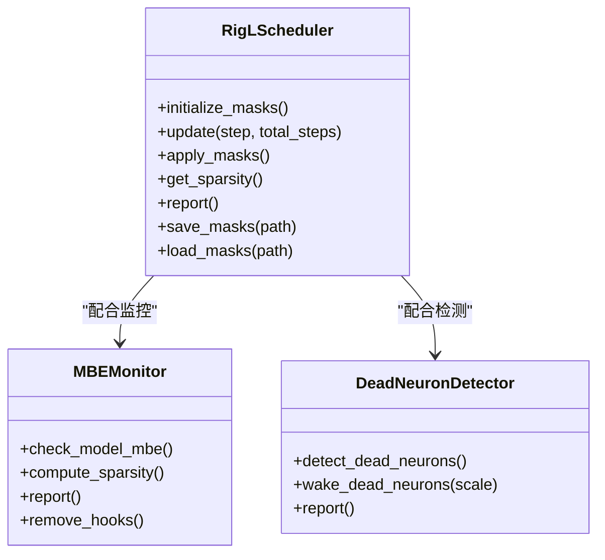
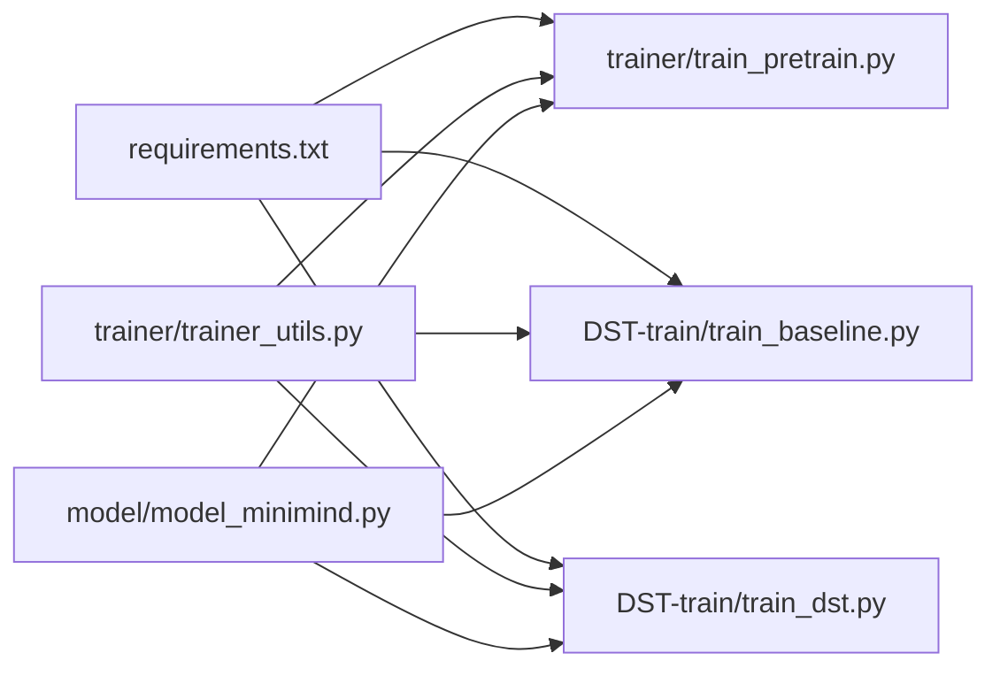

# 混合精度训练优化

<cite>
**本文引用的文件**
- [train_pretrain.py](file://trainer/train_pretrain.py)
- [train_baseline.py](file://DST-train/train_baseline.py)
- [train_dst.py](file://DST-train/train_dst.py)
- [trainer_utils.py](file://trainer/trainer_utils.py)
- [model_minimind.py](file://model/model_minimind.py)
- [dst_hooks.py](file://DST-train/dst_hooks.py)
- [dst_pruning.py](file://DST-train/dst_pruning.py)
- [requirements.txt](file://requirements.txt)
- [README.md](file://README.md)
- [eval_benchmark.py](file://eval_benchmark.py)
</cite>

## 目录
1. [简介](#简介)
2. [项目结构](#项目结构)
3. [核心组件](#核心组件)
4. [架构总览](#架构总览)
5. [详细组件分析](#详细组件分析)
6. [依赖关系分析](#依赖关系分析)
7. [性能考量](#性能考量)
8. [故障排查指南](#故障排查指南)
9. [结论](#结论)
10. [附录](#附录)

## 简介
本指南聚焦于本项目中的混合精度训练（AMP，Automatic Mixed Precision）实践，系统阐述数值精度设置、梯度缩放策略、动态损失缩放、梯度累积与裁剪、学习率调度、优化器适配、内存优化与模型保存等关键环节。结合项目中预训练、基线训练与DST（动态稀疏训练）脚本，给出可操作的配置参数说明、最佳实践建议与调优策略，帮助开发者在保证模型质量的前提下最大化训练效率。

## 项目结构
本项目围绕MiniMind模型提供从预训练到SFT、蒸馏、强化学习等全流程训练脚本，混合精度训练贯穿其中。关键训练脚本与模块如下：
- 预训练脚本：trainer/train_pretrain.py
- 基线训练脚本：DST-train/train_baseline.py
- DST训练脚本：DST-train/train_dst.py
- 工具函数：trainer/trainer_utils.py
- 模型定义：model/model_minimind.py
- DST诊断与剪枝：DST-train/dst_hooks.py、DST-train/dst_pruning.py
- 依赖声明：requirements.txt
- 评测脚本：eval_benchmark.py



图表来源
- [train_pretrain.py:1-162](file://trainer/train_pretrain.py#L1-L162)
- [train_baseline.py:1-169](file://DST-train/train_baseline.py#L1-L169)
- [train_dst.py:1-472](file://DST-train/train_dst.py#L1-L472)
- [trainer_utils.py:1-139](file://trainer/trainer_utils.py#L1-L139)
- [model_minimind.py:1-477](file://model/model_minimind.py#L1-L477)
- [dst_hooks.py:1-263](file://DST-train/dst_hooks.py#L1-L263)
- [dst_pruning.py:1-291](file://DST-train/dst_pruning.py#L1-L291)
- [requirements.txt:1-31](file://requirements.txt#L1-L31)
- [eval_benchmark.py:1-319](file://eval_benchmark.py#L1-L319)

章节来源
- [train_pretrain.py:1-162](file://trainer/train_pretrain.py#L1-L162)
- [train_baseline.py:1-169](file://DST-train/train_baseline.py#L1-L169)
- [train_dst.py:1-472](file://DST-train/train_dst.py#L1-L472)
- [trainer_utils.py:1-139](file://trainer/trainer_utils.py#L1-L139)
- [model_minimind.py:1-477](file://model/model_minimind.py#L1-L477)
- [dst_hooks.py:1-263](file://DST-train/dst_hooks.py#L1-L263)
- [dst_pruning.py:1-291](file://DST-train/dst_pruning.py#L1-L291)
- [requirements.txt:1-31](file://requirements.txt#L1-L31)
- [eval_benchmark.py:1-319](file://eval_benchmark.py#L1-L319)

## 核心组件
- 混合精度上下文与缩放器
  - 预训练与基线脚本在CUDA设备上使用autocast上下文与GradScaler进行混合精度训练；CPU设备回退为nullcontext。
  - dtype参数支持bfloat16与float16，其中float16启用GradScaler。
- 梯度累积与裁剪
  - 通过参数accumulation_steps实现梯度累积，累积步数到达后执行unscale、梯度裁剪、优化器step与update，并清空梯度。
- 学习率调度
  - 余弦退火调度，随训练步数动态调整学习率。
- 检查点与断点续训
  - 统一保存模型、优化器、GradScaler状态与wandb运行ID，支持跨GPU数量恢复。
- MoE辅助损失
  - 在MoE配置下，模型输出包含aux_loss，训练时将其加到主损失上参与反向传播。

章节来源
- [train_pretrain.py:116-135](file://trainer/train_pretrain.py#L116-L135)
- [train_baseline.py:120-140](file://DST-train/train_baseline.py#L120-L140)
- [train_dst.py:353-399](file://DST-train/train_dst.py#L353-L399)
- [trainer_utils.py:47-97](file://trainer/trainer_utils.py#L47-L97)
- [model_minimind.py:434-440](file://model/model_minimind.py#L434-L440)

## 架构总览
混合精度训练在训练脚本中的典型流程如下：

```mermaid
sequenceDiagram
participant Loader as "数据加载器"
participant Model as "模型"
participant AMP as "AMP上下文"
participant Scaler as "GradScaler"
participant Opt as "优化器"
Loader->>Model : "前向输入"
Model->>AMP : "进入autocast上下文"
AMP-->>Model : "FP16/BF16前向"
Model-->>AMP : "返回logits与aux_loss"
AMP-->>Model : "退出autocast"
Model->>Scaler : "scale(loss)"
Scaler-->>Opt : "unscale_ + backward"
Opt-->>Opt : "梯度裁剪"
Opt-->>Scaler : "step + update"
Scaler-->>Opt : "zero_grad + empty_cache"
```

图表来源
- [train_pretrain.py:34-55](file://trainer/train_pretrain.py#L34-L55)
- [train_baseline.py:42-62](file://DST-train/train_baseline.py#L42-L62)
- [train_dst.py:90-116](file://DST-train/train_dst.py#L90-L116)

## 详细组件分析

### 组件A：混合精度上下文与缩放器
- autocast上下文
  - CUDA设备：torch.cuda.amp.autocast(dtype=dtype)，dtype可选bfloat16或float16。
  - CPU设备：nullcontext，禁用混合精度。
- GradScaler
  - enabled=(dtype == 'float16')，float16时启用，bfloat16时禁用。
  - 反向传播前使用scaler.scale(loss)，反向传播后在step前执行unscale_与clip_grad_norm，最后update。
- 模型保存
  - 训练脚本在保存权重时将state_dict转为半精度（v.half()），以节省存储与传输开销。



图表来源
- [train_pretrain.py:116-135](file://trainer/train_pretrain.py#L116-L135)
- [train_baseline.py:120-140](file://DST-train/train_baseline.py#L120-L140)
- [trainer_utils.py:53-58](file://trainer/trainer_utils.py#L53-L58)

章节来源
- [train_pretrain.py:116-135](file://trainer/train_pretrain.py#L116-L135)
- [train_baseline.py:120-140](file://DST-train/train_baseline.py#L120-L140)
- [trainer_utils.py:53-58](file://trainer/trainer_utils.py#L53-L58)

### 组件B：梯度累积与裁剪
- 梯度累积
  - 每步loss除以accumulation_steps，累积步数到达后执行unscale_、clip_grad_norm、scaler.step与update、zero_grad。
- 梯度裁剪
  - 使用torch.nn.utils.clip_grad_norm_，阈值由grad_clip参数控制。
- 内存优化
  - 每次step后调用torch.cuda.empty_cache，释放缓存显存。



图表来源
- [train_pretrain.py:47-55](file://trainer/train_pretrain.py#L47-L55)
- [train_baseline.py:56-62](file://DST-train/train_baseline.py#L56-L62)
- [train_dst.py:104-116](file://DST-train/train_dst.py#L104-L116)

章节来源
- [train_pretrain.py:47-55](file://trainer/train_pretrain.py#L47-L55)
- [train_baseline.py:56-62](file://DST-train/train_baseline.py#L56-L62)
- [train_dst.py:104-116](file://DST-train/train_dst.py#L104-L116)

### 组件C：学习率调度与MoE辅助损失
- 学习率调度
  - 余弦退火：get_lr按当前步数与总步数计算，随训练推进逐步降低。
- MoE辅助损失
  - 模型输出包含aux_loss，训练时将其加到主损失上，有助于MoE路由均衡。



图表来源
- [trainer_utils.py:24-25](file://trainer/trainer_utils.py#L24-L25)
- [model_minimind.py:434-440](file://model/model_minimind.py#L434-L440)
- [train_pretrain.py:30-43](file://trainer/train_pretrain.py#L30-L43)

章节来源
- [trainer_utils.py:24-25](file://trainer/trainer_utils.py#L24-L25)
- [model_minimind.py:434-440](file://model/model_minimind.py#L434-L440)
- [train_pretrain.py:30-43](file://trainer/train_pretrain.py#L30-L43)

### 组件D：DST动态稀疏训练中的AMP
- RigL动态稀疏训练
  - 按频率更新掩码，剪枝最不重要的连接，生长梯度绝对值最大的非活跃连接。
  - 每步后应用掩码，确保被剪枝的连接权重保持为零。
- MBE监控与假死神经元检测
  - 通过MBE（矩阵基熵）判断模型是否饱和；检测并唤醒假死神经元，避免训练停滞。



图表来源
- [dst_pruning.py:120-291](file://DST-train/dst_pruning.py#L120-L291)
- [dst_hooks.py:10-263](file://DST-train/dst_hooks.py#L10-L263)

章节来源
- [dst_pruning.py:120-291](file://DST-train/dst_pruning.py#L120-L291)
- [dst_hooks.py:10-263](file://DST-train/dst_hooks.py#L10-L263)
- [train_dst.py:74-138](file://DST-train/train_dst.py#L74-L138)

## 依赖关系分析
- PyTorch版本要求
  - requirements.txt中torch==2.6.0，满足AMP与GradScaler的使用。
- 训练脚本依赖
  - 训练脚本依赖trainer_utils提供分布式初始化、检查点保存、模型初始化等工具。
  - 模型定义位于model_minimind.py，支持MoE配置与辅助损失。



图表来源
- [requirements.txt:1-31](file://requirements.txt#L1-L31)
- [trainer/train_pretrain.py:16-18](file://trainer/train_pretrain.py#L16-L18)
- [DST-train/train_baseline.py:20-22](file://DST-train/train_baseline.py#L20-L22)
- [DST-train/train_dst.py:24-28](file://DST-train/train_dst.py#L24-L28)
- [trainer/trainer_utils.py:10-12](file://trainer/trainer_utils.py#L10-L12)
- [model/model_minimind.py:5-9](file://model/model_minimind.py#L5-L9)

章节来源
- [requirements.txt:1-31](file://requirements.txt#L1-L31)
- [trainer/train_pretrain.py:16-18](file://trainer/train_pretrain.py#L16-L18)
- [DST-train/train_baseline.py:20-22](file://DST-train/train_baseline.py#L20-L22)
- [DST-train/train_dst.py:24-28](file://DST-train/train_dst.py#L24-L28)
- [trainer/trainer_utils.py:10-12](file://trainer/trainer_utils.py#L10-L12)
- [model/model_minimind.py:5-9](file://model/model_minimind.py#L5-L9)

## 性能考量
- 数值精度选择
  - bfloat16：数值稳定，无需GradScaler，适合大多数场景；在本项目中作为默认dtype。
  - float16：需要GradScaler防梯度下溢，显存占用更低，吞吐更高。
- 梯度累积
  - 通过增大accumulation_steps模拟更大的batch size，平衡显存与吞吐。
- 梯度裁剪
  - clip_grad_norm有助于缓解梯度爆炸，提升训练稳定性。
- 内存优化
  - 每步后empty_cache释放缓存显存，减少碎片化。
- 模型保存
  - 保存state_dict为半精度（half），显著降低存储与IO开销。

章节来源
- [train_pretrain.py:89-91](file://trainer/train_pretrain.py#L89-L91)
- [train_pretrain.py:116-135](file://trainer/train_pretrain.py#L116-L135)
- [train_pretrain.py:55](file://trainer/train_pretrain.py#L55)
- [trainer_utils.py:53-58](file://trainer/trainer_utils.py#L53-L58)

## 故障排查指南
- 混合精度相关
  - 症状：NaN或Inf损失、梯度爆炸。
  - 排查：确认dtype设置为float16时启用GradScaler；检查unscale_与clip_grad_norm顺序；适当降低学习率或增大accumulation_steps。
- 断点续训
  - 症状：跨GPU数量恢复后step不一致。
  - 处理：检查lm_checkpoint中step转换逻辑，确保根据world_size自动调整。
- MoE辅助损失
  - 症状：训练不稳定或收敛缓慢。
  - 处理：确认aux_loss参与损失计算；适当调整aux_loss权重系数。
- DST稀疏训练
  - 症状：模型饱和或神经元死亡。
  - 处理：使用MBE监控与DeadNeuronDetector检测并唤醒假死神经元；合理设置RigL更新频率与剪枝比例。

章节来源
- [trainer_utils.py:47-97](file://trainer/trainer_utils.py#L47-L97)
- [model_minimind.py:434-440](file://model/model_minimind.py#L434-L440)
- [dst_hooks.py:135-153](file://DST-train/dst_hooks.py#L135-L153)
- [dst_hooks.py:240-262](file://DST-train/dst_hooks.py#L240-L262)
- [dst_pruning.py:167-238](file://DST-train/dst_pruning.py#L167-L238)

## 结论
本项目在预训练、基线与DST训练中系统实现了混合精度训练，结合GradScaler、梯度累积与裁剪、学习率调度、MoE辅助损失与断点续训等机制，形成了一套高效稳定的训练流水线。通过合理配置dtype、accumulation_steps、grad_clip与学习率策略，可在保证模型质量的同时显著提升训练效率与资源利用率。

## 附录
- 配置参数速查
  - dtype：bfloat16或float16（默认bfloat16）
  - accumulation_steps：梯度累积步数（默认8）
  - grad_clip：梯度裁剪阈值（默认1.0）
  - learning_rate：初始学习率（默认5e-4）
  - num_workers：数据加载线程数（Windows建议0）
  - log_interval/save_interval：日志与保存间隔
  - use_wandb：是否使用可视化（默认swanlab）
- 最佳实践建议
  - dtype选择：优先bfloat16；若显存紧张且硬件支持，可切换float16并启用GradScaler。
  - 梯度累积：根据显存与吞吐权衡，逐步增大accumulation_steps。
  - 学习率：余弦退火配合warmup，避免过大学习率导致发散。
  - 梯度裁剪：在混合精度下更易出现梯度爆炸，务必启用clip_grad_norm。
  - 检查点：定期保存，启用断点续训，支持跨GPU数量恢复。
  - MoE：启用aux_loss并合理设置alpha，提升路由均衡。
  - DST：结合MBE监控与RigL动态稀疏，及时唤醒假死神经元。

章节来源
- [train_pretrain.py:88-104](file://trainer/train_pretrain.py#L88-L104)
- [train_baseline.py:94-107](file://DST-train/train_baseline.py#L94-L107)
- [train_dst.py:299-341](file://DST-train/train_dst.py#L299-L341)
- [README.md:418-423](file://README.md#L418-L423)