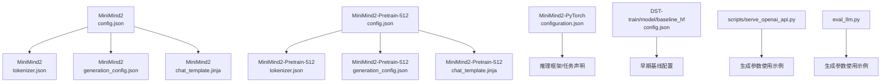
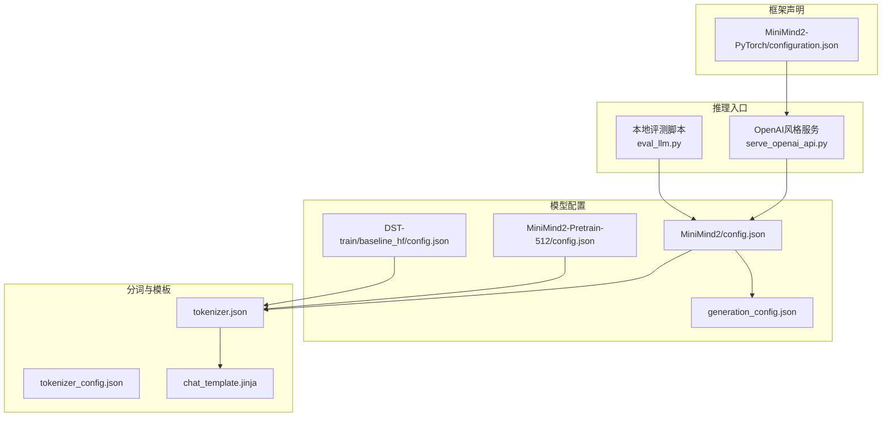
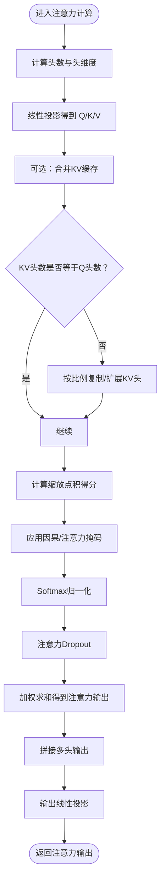
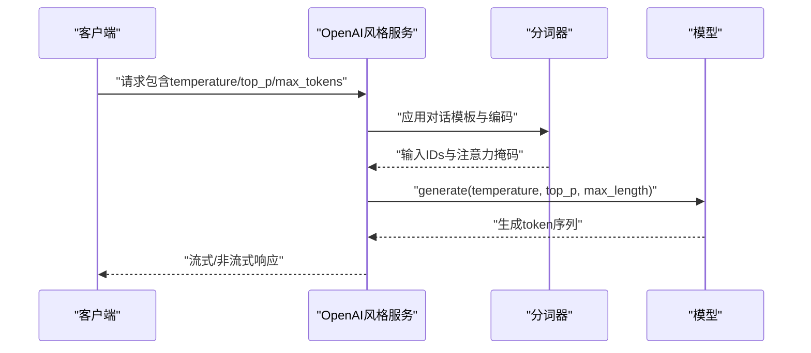
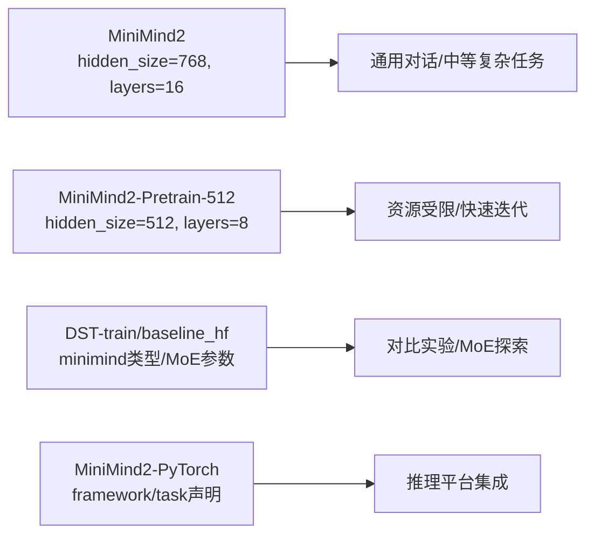
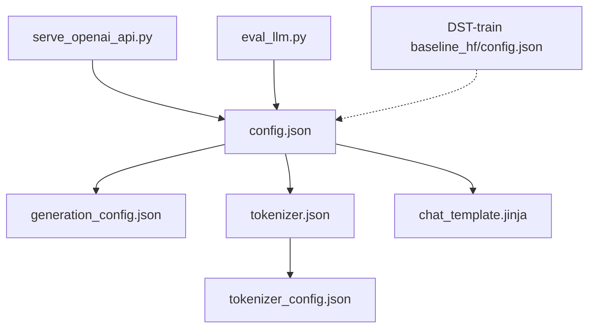

# 模型配置

<cite>
**本文引用的文件**
- [MiniMind2/config.json](file://MiniMind2/config.json)
- [MiniMind2/generation_config.json](file://MiniMind2/generation_config.json)
- [MiniMind2/tokenizer.json](file://MiniMind2/tokenizer.json)
- [MiniMind2/tokenizer_config.json](file://MiniMind2/tokenizer_config.json)
- [MiniMind2/chat_template.jinja](file://MiniMind2/chat_template.jinja)
- [MiniMind2-Pretrain-512/config.json](file://MiniMind2-Pretrain-512/config.json)
- [MiniMind2-Pretrain-512/generation_config.json](file://MiniMind2-Pretrain-512/generation_config.json)
- [MiniMind2-Pretrain-512/tokenizer.json](file://MiniMind2-Pretrain-512/tokenizer.json)
- [MiniMind2-Pretrain-512/tokenizer_config.json](file://MiniMind2-Pretrain-512/tokenizer_config.json)
- [MiniMind2-Pretrain-512/chat_template.jinja](file://MiniMind2-Pretrain-512/chat_template.jinja)
- [MiniMind2-PyTorch/configuration.json](file://MiniMind2-PyTorch/configuration.json)
- [DST-train/model/baseline_hf/config.json](file://DST-train/model/baseline_hf/config.json)
- [docs/03_Phase3_模型架构详解.md](file://docs/03_Phase3_模型架构详解.md)
- [scripts/serve_openai_api.py](file://scripts/serve_openai_api.py)
- [eval_llm.py](file://eval_llm.py)
</cite>

## 目录
1. [简介](#简介)
2. [项目结构](#项目结构)
3. [核心组件](#核心组件)
4. [架构总览](#架构总览)
5. [详细组件分析](#详细组件分析)
6. [依赖关系分析](#依赖关系分析)
7. [性能考量](#性能考量)
8. [故障排查指南](#故障排查指南)
9. [结论](#结论)
10. [附录](#附录)

## 简介
本文件系统性梳理 MiniMind 系列模型的配置体系，聚焦以下关键配置文件与参数：
- config.json：模型架构与训练/推理超参
- generation_config.json：生成阶段的通用配置
- tokenizer.json 与 tokenizer_config.json：分词器结构与配置
- chat_template.jinja：对话模板（含工具调用）
- MiniMind2、MiniMind2-Pretrain-512、MiniMind2-PyTorch 等变体的配置差异与适用场景
- 生成参数（temperature、top_p、max_length 等）对推理质量的控制
- 架构参数（hidden_size、num_hidden_layers、num_attention_heads 等）与注意力机制（head_dim、num_key_value_heads、attention_dropout 等）对性能与效果的影响
- 配置优化建议与最佳实践

## 项目结构
围绕配置与推理的关键目录与文件如下：
- MiniMind2：标准版配置与分词器
- MiniMind2-Pretrain-512：预训练专用小尺寸配置
- MiniMind2-PyTorch：框架标注与任务声明
- DST-train/model/baseline_hf：早期基线 HF 配置
- docs/03_Phase3_模型架构详解.md：架构与实现细节
- scripts/serve_openai_api.py、eval_llm.py：推理脚本中的生成参数使用示例

**图表来源**
- [MiniMind2/config.json:1-33](file://MiniMind2/config.json#L1-L33)
- [MiniMind2/tokenizer.json:1-800](file://MiniMind2/tokenizer.json#L1-L800)
- [MiniMind2/generation_config.json:1-10](file://MiniMind2/generation_config.json#L1-L10)
- [MiniMind2/chat_template.jinja:1-74](file://MiniMind2/chat_template.jinja#L1-L74)
- [MiniMind2-Pretrain-512/config.json:1-33](file://MiniMind2-Pretrain-512/config.json#L1-L33)
- [MiniMind2-Pretrain-512/tokenizer.json:1-800](file://MiniMind2-Pretrain-512/tokenizer.json#L1-L800)
- [MiniMind2-Pretrain-512/generation_config.json:1-10](file://MiniMind2-Pretrain-512/generation_config.json#L1-L10)
- [MiniMind2-Pretrain-512/chat_template.jinja:1-74](file://MiniMind2-Pretrain-512/chat_template.jinja#L1-L74)
- [MiniMind2-PyTorch/configuration.json:1-1](file://MiniMind2-PyTorch/configuration.json#L1-L1)
- [DST-train/model/baseline_hf/config.json:1-37](file://DST-train/model/baseline_hf/config.json#L1-L37)
- [scripts/serve_openai_api.py:116-145](file://scripts/serve_openai_api.py#L116-L145)
- [eval_llm.py:42-66](file://eval_llm.py#L42-L66)

**章节来源**
- [MiniMind2/config.json:1-33](file://MiniMind2/config.json#L1-L33)
- [MiniMind2-Pretrain-512/config.json:1-33](file://MiniMind2-Pretrain-512/config.json#L1-L33)
- [MiniMind2-PyTorch/configuration.json:1-1](file://MiniMind2-PyTorch/configuration.json#L1-L1)
- [DST-train/model/baseline_hf/config.json:1-37](file://DST-train/model/baseline_hf/config.json#L1-L37)

## 核心组件
本节从配置文件角度拆解核心组件及其职责。

- 模型配置（config.json）
  - 架构与类型：architectures、model_type、transformers_version
  - 词表与位置编码：vocab_size、max_position_embeddings、rope_parameters
  - 规范化与激活：rms_norm_eps、hidden_act
  - 架构维度：hidden_size、intermediate_size、num_hidden_layers
  - 注意力与KV：num_attention_heads、num_key_value_heads、head_dim、attention_dropout、attention_bias、mlp_bias
  - 词汇嵌入与缓存：tie_word_embeddings、use_cache、dtype
  - 特殊token：bos_token_id、eos_token_id、pad_token_id
  - 其他：initializer_range、pretraining_tp

- 生成配置（generation_config.json）
  - 生成相关开关：output_attentions、output_hidden_states、use_cache
  - 与模型配置的继承关系：_from_model_config、transformers_version

- 分词器配置（tokenizer.json、tokenizer_config.json）
  - 结构：model（BPE）、pre_tokenizer（ByteLevel）、post_processor（TemplateProcessing）、decoder（ByteLevel）
  - 特殊token：added_tokens（<|im_start|>、<|im_end|>）
  - 长度上限：model_max_length（32768）

- 对话模板（chat_template.jinja）
  - 支持 system、user、assistant、tool 等角色
  - 工具调用 JSON 格式化
  - 可选思维链占位符

**章节来源**
- [MiniMind2/config.json:1-33](file://MiniMind2/config.json#L1-L33)
- [MiniMind2/generation_config.json:1-10](file://MiniMind2/generation_config.json#L1-L10)
- [MiniMind2/tokenizer.json:1-800](file://MiniMind2/tokenizer.json#L1-L800)
- [MiniMind2/tokenizer_config.json:1-18](file://MiniMind2/tokenizer_config.json#L1-L18)
- [MiniMind2/chat_template.jinja:1-74](file://MiniMind2/chat_template.jinja#L1-L74)
- [MiniMind2-Pretrain-512/config.json:1-33](file://MiniMind2-Pretrain-512/config.json#L1-L33)
- [MiniMind2-Pretrain-512/generation_config.json:1-10](file://MiniMind2-Pretrain-512/generation_config.json#L1-L10)
- [MiniMind2-Pretrain-512/tokenizer.json:1-800](file://MiniMind2-Pretrain-512/tokenizer.json#L1-L800)
- [MiniMind2-Pretrain-512/tokenizer_config.json:1-18](file://MiniMind2-Pretrain-512/tokenizer_config.json#L1-L18)
- [MiniMind2-Pretrain-512/chat_template.jinja:1-74](file://MiniMind2-Pretrain-512/chat_template.jinja#L1-L74)

## 架构总览
下图展示 MiniMind 系列配置在推理与生成阶段的交互关系，以及与分词器、对话模板的衔接。

**图表来源**
- [scripts/serve_openai_api.py:116-145](file://scripts/serve_openai_api.py#L116-L145)
- [eval_llm.py:42-66](file://eval_llm.py#L42-L66)
- [MiniMind2/config.json:1-33](file://MiniMind2/config.json#L1-L33)
- [MiniMind2-Pretrain-512/config.json:1-33](file://MiniMind2-Pretrain-512/config.json#L1-L33)
- [DST-train/model/baseline_hf/config.json:1-37](file://DST-train/model/baseline_hf/config.json#L1-L37)
- [MiniMind2/generation_config.json:1-10](file://MiniMind2/generation_config.json#L1-L10)
- [MiniMind2/tokenizer.json:1-800](file://MiniMind2/tokenizer.json#L1-L800)
- [MiniMind2/tokenizer_config.json:1-18](file://MiniMind2/tokenizer_config.json#L1-L18)
- [MiniMind2/chat_template.jinja:1-74](file://MiniMind2/chat_template.jinja#L1-L74)
- [MiniMind2-PyTorch/configuration.json:1-1](file://MiniMind2-PyTorch/configuration.json#L1-L1)

## 详细组件分析

### 配置文件结构与参数含义
- 模型架构参数
  - hidden_size：隐藏层维度，决定特征向量规模与计算/显存开销
  - num_hidden_layers：Transformer层数，影响建模复杂度与推理延迟
  - num_attention_heads / num_key_value_heads：注意力头数与KV头数，决定并行度与KV复用程度
  - head_dim：每头维度，通常由 hidden_size / num_attention_heads 推导
  - intermediate_size：FFN中间维度，影响非线性表达能力
  - rms_norm_eps：RMSNorm数值稳定项
  - hidden_act：激活函数（如 SiLU）
  - rope_parameters：RoPE基础频率与类型
  - tie_word_embeddings：嵌入与输出头权重共享，减少参数量
  - dtype/use_cache：半精度与KV缓存，提升吞吐与降低显存
  - initializer_range：初始化范围
  - pretraining_tp：并行策略（张量并行）
  - vocab_size/max_position_embeddings：词表与上下文长度上限

- 生成配置参数
  - output_attentions/output_hidden_states：是否输出中间状态（调试/分析用途）
  - use_cache：启用KV缓存，显著降低自回归生成的重复计算
  - transformers_version/_from_model_config：版本与继承标记

- 分词器配置
  - tokenizer.json：BPE模型、ByteLevel预/后处理器、Decoder、特殊token集合
  - tokenizer_config.json：特殊token字符串、最大长度、后端类型等

- 对话模板
  - chat_template.jinja：支持工具调用、思维链占位、角色拼接与特殊token包裹

**章节来源**
- [MiniMind2/config.json:1-33](file://MiniMind2/config.json#L1-L33)
- [MiniMind2/generation_config.json:1-10](file://MiniMind2/generation_config.json#L1-L10)
- [MiniMind2/tokenizer.json:1-800](file://MiniMind2/tokenizer.json#L1-L800)
- [MiniMind2/tokenizer_config.json:1-18](file://MiniMind2/tokenizer_config.json#L1-L18)
- [MiniMind2/chat_template.jinja:1-74](file://MiniMind2/chat_template.jinja#L1-L74)
- [MiniMind2-Pretrain-512/config.json:1-33](file://MiniMind2-Pretrain-512/config.json#L1-L33)
- [MiniMind2-Pretrain-512/generation_config.json:1-10](file://MiniMind2-Pretrain-512/generation_config.json#L1-L10)
- [MiniMind2-Pretrain-512/tokenizer.json:1-800](file://MiniMind2-Pretrain-512/tokenizer.json#L1-L800)
- [MiniMind2-Pretrain-512/tokenizer_config.json:1-18](file://MiniMind2-Pretrain-512/tokenizer_config.json#L1-L18)
- [MiniMind2-Pretrain-512/chat_template.jinja:1-74](file://MiniMind2-Pretrain-512/chat_template.jinja#L1-L74)

### 注意力机制配置与技术原理
- 头维度与并行度
  - head_dim = hidden_size / num_attention_heads
  - 更大的 num_attention_heads 提升并行度，但需确保 head_dim 合理
- 分组查询注意力（GQA）
  - num_key_value_heads < num_attention_heads，减少KV计算与显存
  - 通过KV复制或扩展匹配Q头数，保持注意力通道一致性
- 注意力掩码与因果约束
  - 自回归生成中使用因果掩码，避免信息泄漏
- Dropout与正则
  - attention_dropout 控制注意力权重随机失活，有助于泛化
- Flash Attention
  - 在满足条件时使用高效内核，否则回退到手工实现
- RoPE位置编码
  - 通过旋转矩阵注入相对位置信息，支持长序列与外推

**图表来源**
- [docs/03_Phase3_模型架构详解.md:131-176](file://docs/03_Phase3_模型架构详解.md#L131-L176)

**章节来源**
- [docs/03_Phase3_模型架构详解.md:118-176](file://docs/03_Phase3_模型架构详解.md#L118-L176)

### 生成配置参数对推理质量的控制
- temperature（采样温度）
  - 越小越保守，越高越随机；过高可能导致语义漂移，过低可能单调
- top_p（核采样阈值）
  - 在累积概率达到阈值的候选集中采样，平衡多样性与稳定性
- max_length / model_max_length
  - 控制生成长度与上下文上限，避免过长导致的幻觉与资源耗尽
- use_cache
  - 启用KV缓存显著降低重复计算，提高吞吐
- attention_dropout
  - 生成阶段通常关闭或保持较小，以稳定输出

**图表来源**
- [scripts/serve_openai_api.py:116-145](file://scripts/serve_openai_api.py#L116-L145)
- [eval_llm.py:42-66](file://eval_llm.py#L42-L66)

**章节来源**
- [scripts/serve_openai_api.py:116-145](file://scripts/serve_openai_api.py#L116-L145)
- [eval_llm.py:42-66](file://eval_llm.py#L42-L66)

### 不同模型变体的配置差异与适用场景
- MiniMind2（标准版）
  - hidden_size=768、num_hidden_layers=16、head_dim=96、num_key_value_heads=2
  - 适合通用对话与中等复杂任务，兼顾性能与精度
- MiniMind2-Pretrain-512（预训练小尺寸）
  - hidden_size=512、num_hidden_layers=8、head_dim=64、num_key_value_heads=2
  - 适合资源受限环境或快速迭代的预训练/评测
- DST-train/baseline_hf（早期基线）
  - 模型类型为 minima（非 llama），包含MoE相关参数（use_moe、n_routed_experts等）
  - 适用于对比实验与MoE探索
- MiniMind2-PyTorch（框架声明）
  - 仅声明框架与任务类型，便于模型托管与推理平台识别

**图表来源**
- [MiniMind2/config.json:1-33](file://MiniMind2/config.json#L1-L33)
- [MiniMind2-Pretrain-512/config.json:1-33](file://MiniMind2-Pretrain-512/config.json#L1-L33)
- [DST-train/model/baseline_hf/config.json:1-37](file://DST-train/model/baseline_hf/config.json#L1-L37)
- [MiniMind2-PyTorch/configuration.json:1-1](file://MiniMind2-PyTorch/configuration.json#L1-L1)

**章节来源**
- [MiniMind2/config.json:1-33](file://MiniMind2/config.json#L1-L33)
- [MiniMind2-Pretrain-512/config.json:1-33](file://MiniMind2-Pretrain-512/config.json#L1-L33)
- [DST-train/model/baseline_hf/config.json:1-37](file://DST-train/model/baseline_hf/config.json#L1-L37)
- [MiniMind2-PyTorch/configuration.json:1-1](file://MiniMind2-PyTorch/configuration.json#L1-L1)

## 依赖关系分析
- 配置文件之间的耦合
  - generation_config.json 通常继承模型配置，保持版本与行为一致
  - tokenizer.json 与 tokenizer_config.json 共同决定分词行为与特殊token
  - chat_template.jinja 依赖 tokenizer 的特殊token与最大长度
- 推理脚本对生成参数的使用
  - OpenAI风格服务与本地评测脚本直接消费 temperature、top_p、max_tokens 等参数
- 变体间的差异
  - MiniMind2 与 MiniMind2-Pretrain-512 在维度与层数上存在明显差异
  - DST-train 基线配置引入了 MoE 相关参数，与标准 LLaMA 类型不同

**图表来源**
- [MiniMind2/config.json:1-33](file://MiniMind2/config.json#L1-L33)
- [MiniMind2/generation_config.json:1-10](file://MiniMind2/generation_config.json#L1-L10)
- [MiniMind2/tokenizer.json:1-800](file://MiniMind2/tokenizer.json#L1-L800)
- [MiniMind2/tokenizer_config.json:1-18](file://MiniMind2/tokenizer_config.json#L1-L18)
- [MiniMind2/chat_template.jinja:1-74](file://MiniMind2/chat_template.jinja#L1-L74)
- [scripts/serve_openai_api.py:116-145](file://scripts/serve_openai_api.py#L116-L145)
- [eval_llm.py:42-66](file://eval_llm.py#L42-L66)
- [DST-train/model/baseline_hf/config.json:1-37](file://DST-train/model/baseline_hf/config.json#L1-L37)

**章节来源**
- [scripts/serve_openai_api.py:116-145](file://scripts/serve_openai_api.py#L116-L145)
- [eval_llm.py:42-66](file://eval_llm.py#L42-L66)
- [DST-train/model/baseline_hf/config.json:1-37](file://DST-train/model/baseline_hf/config.json#L1-L37)

## 性能考量
- 显存与吞吐
  - hidden_size 与 num_hidden_layers 成正比影响显存占用
  - use_cache 与 dtype（float16）显著降低显存与提升吞吐
- 计算效率
  - attention_dropout 在推理阶段建议关闭或设为0
  - Flash Attention 在满足条件时优先使用
- 上下文长度
  - max_position_embeddings 与 rope_theta 决定长文本能力与外推范围
- 生成稳定性
  - temperature 与 top_p 需结合任务需求调优；过高易发散，过低易僵化

## 故障排查指南
- 生成过短或过长
  - 检查 max_length 与 model_max_length 设置是否合理
  - 确认推理脚本传入的 max_tokens 是否覆盖预期
- 输出质量不稳定
  - 调整 temperature 与 top_p；尝试不同的组合
  - 关闭 attention_dropout 或降低其值
- 分词异常或截断
  - 校验 tokenizer_config.json 中的特殊token与最大长度
  - 确认 chat_template.jinja 的拼接逻辑与特殊token一致
- 模板工具调用失败
  - 检查工具调用JSON格式与模板占位符是否匹配
- 框架/任务不匹配
  - 确认 MiniMind2-PyTorch 的 framework/task 声明与推理平台一致

**章节来源**
- [MiniMind2/tokenizer_config.json:1-18](file://MiniMind2/tokenizer_config.json#L1-L18)
- [MiniMind2/chat_template.jinja:1-74](file://MiniMind2/chat_template.jinja#L1-L74)
- [scripts/serve_openai_api.py:116-145](file://scripts/serve_openai_api.py#L116-L145)
- [eval_llm.py:42-66](file://eval_llm.py#L42-L66)
- [MiniMind2-PyTorch/configuration.json:1-1](file://MiniMind2-PyTorch/configuration.json#L1-L1)

## 结论
- MiniMind 系列通过清晰的配置文件体系实现了从预训练到推理的全链路管理
- 架构参数与注意力机制配置直接影响模型容量、显存与吞吐
- 生成参数对推理质量具有强约束性，需结合任务进行系统调优
- 不同变体在资源与能力之间提供灵活权衡，便于在多种部署环境中落地

## 附录
- 配置优化建议与最佳实践
  - 参数调优策略
    - 先固定 temperature 与 top_p，逐步调整 max_length 与 use_cache
    - 在资源允许前提下，优先增大 hidden_size 与 num_hidden_layers 提升表达力
    - 若显存紧张，优先降低层数或使用 MiniMind2-Pretrain-512 变体
  - 性能与精度平衡
    - 推理阶段关闭 attention_dropout，必要时降低其值
    - 启用 KV 缓存与半精度，优先使用 Flash Attention
    - 长序列任务建议检查 rope_theta 与最大长度设置
  - 变体选择
    - 通用对话与中等复杂任务：MiniMind2
    - 资源受限或快速迭代：MiniMind2-Pretrain-512
    - 对比实验与MoE探索：DST-train 基线配置
    - 推理平台集成：MiniMind2-PyTorch 框架声明