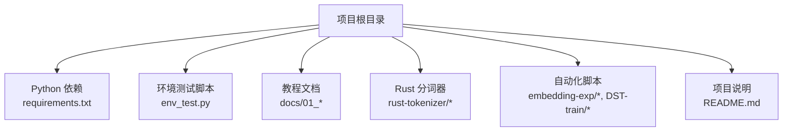
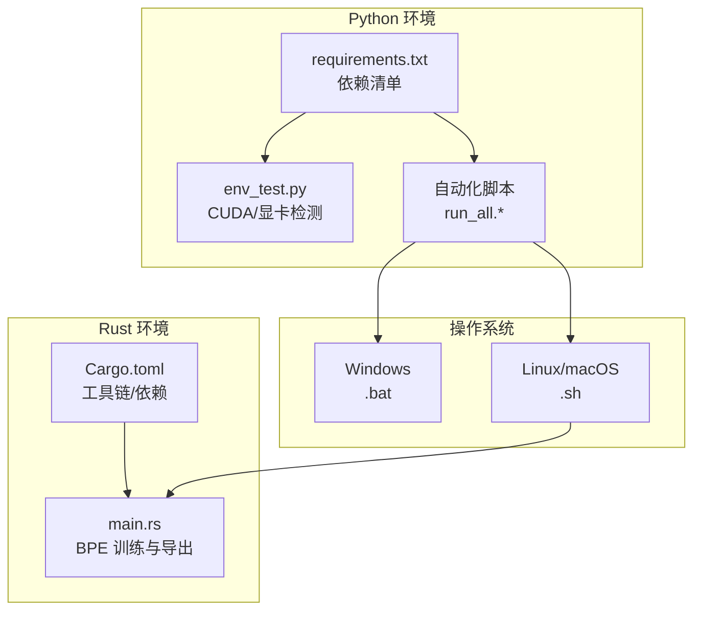
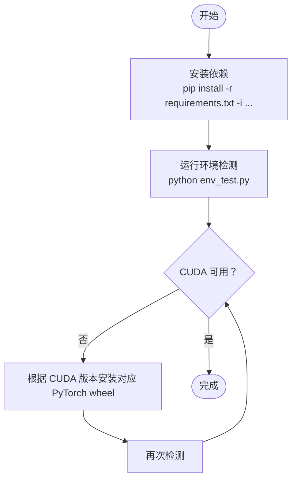
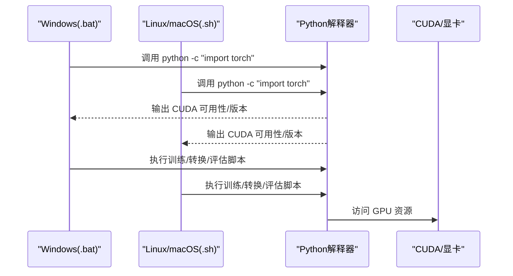
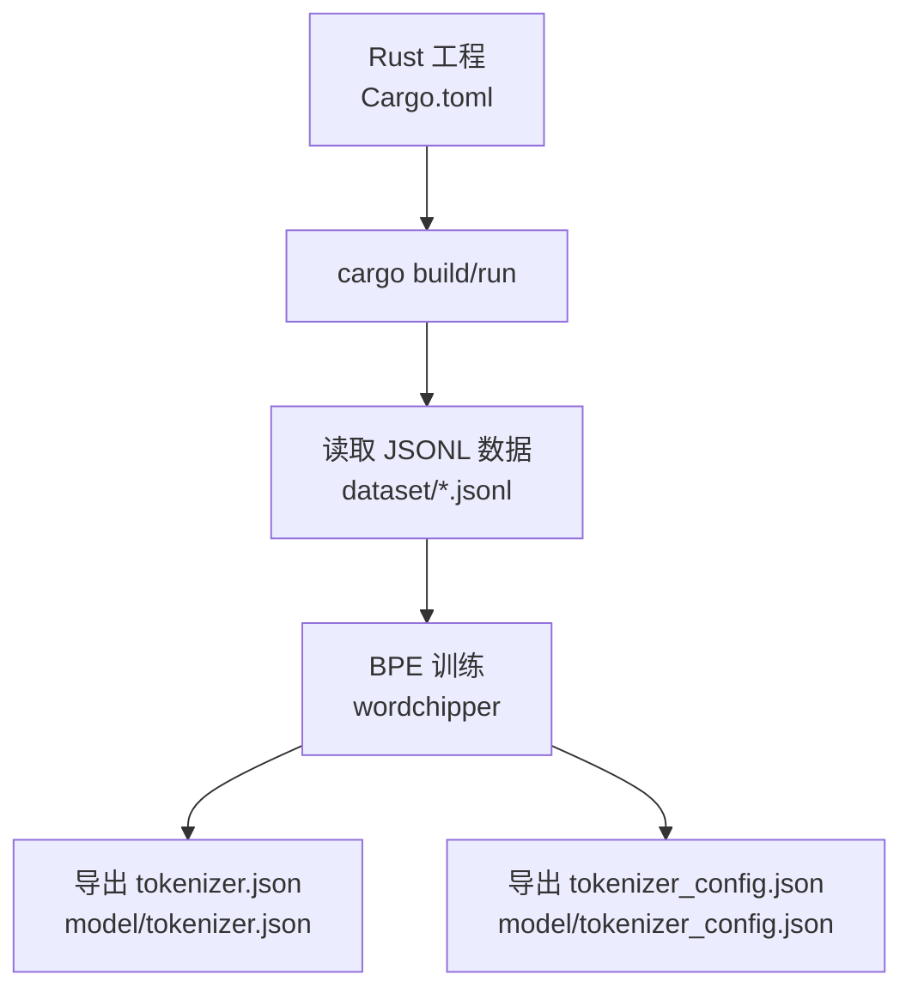
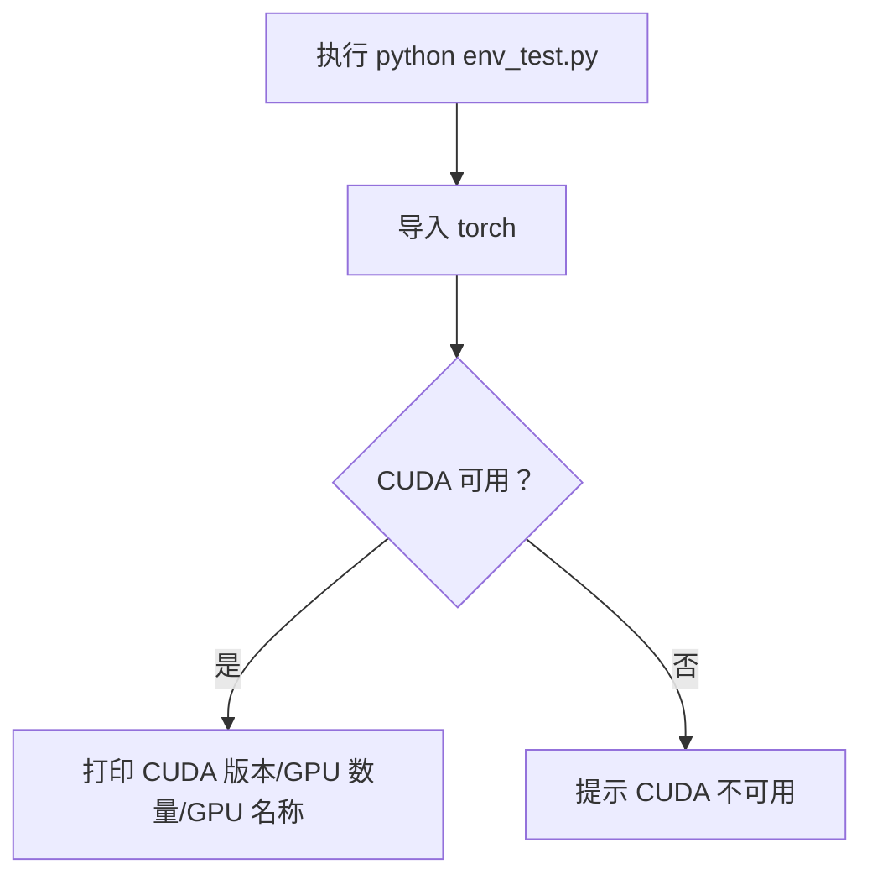
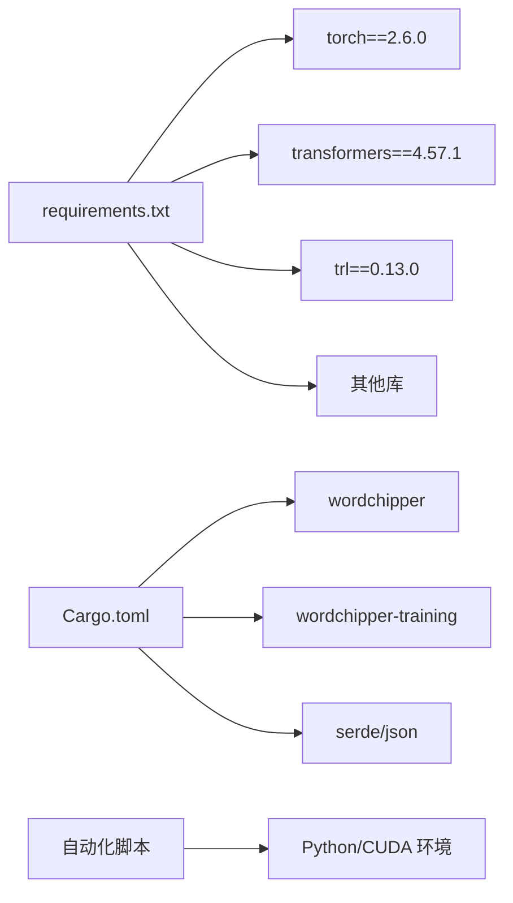

# 环境配置

<cite>
**本文引用的文件**
- [requirements.txt](file://requirements.txt)
- [env_test.py](file://env_test.py)
- [README.md](file://README.md)
- [docs/01_Phase1_项目概览与环境搭建.md](file://docs/01_Phase1_项目概览与环境搭建.md)
- [docs/00_总纲.md](file://docs/00_总纲.md)
- [rust-tokenizer/Cargo.toml](file://rust-tokenizer/Cargo.toml)
- [rust-tokenizer/src/main.rs](file://rust-tokenizer/src/main.rs)
- [embedding-exp/run_all.sh](file://embedding-exp/run_all.sh)
- [embedding-exp/run_all.bat](file://embedding-exp/run_all.bat)
- [DST-train/run_all.bat](file://DST-train/run_all.bat)
</cite>

## 目录
1. [简介](#简介)
2. [项目结构](#项目结构)
3. [核心组件](#核心组件)
4. [架构总览](#架构总览)
5. [详细组件分析](#详细组件分析)
6. [依赖关系分析](#依赖关系分析)
7. [性能考量](#性能考量)
8. [故障排查指南](#故障排查指南)
9. [结论](#结论)
10. [附录](#附录)

## 简介
本指南面向首次接触 MiniMind 项目的用户，提供从零开始的完整环境配置方案，涵盖：
- Python 环境搭建与依赖安装（含版本兼容性）
- 不同操作系统（Windows、Linux、macOS）的配置步骤
- Rust 环境配置与编译优化
- 环境测试脚本 env_test.py 的使用方法
- 虚拟环境管理、依赖隔离与版本冲突解决的最佳实践

## 项目结构
MiniMind 项目围绕 Python 训练与推理、Rust 分词器、Shell/批处理脚本自动化等模块组织，核心目录与文件如下：
- Python 依赖与测试：requirements.txt、env_test.py
- 教程与环境搭建文档：docs/01_Phase1_项目概览与环境搭建.md、docs/00_总纲.md
- Rust 分词器：rust-tokenizer/Cargo.toml、rust-tokenizer/src/main.rs
- 自动化脚本：embedding-exp/run_all.sh、embedding-exp/run_all.bat、DST-train/run_all.bat
- 项目说明与依赖版本参考：README.md

**图表来源**
- [requirements.txt](file://requirements.txt)
- [env_test.py](file://env_test.py)
- [docs/01_Phase1_项目概览与环境搭建.md](file://docs/01_Phase1_项目概览与环境搭建.md)
- [docs/00_总纲.md](file://docs/00_总纲.md)
- [rust-tokenizer/Cargo.toml](file://rust-tokenizer/Cargo.toml)
- [rust-tokenizer/src/main.rs](file://rust-tokenizer/src/main.rs)
- [embedding-exp/run_all.sh](file://embedding-exp/run_all.sh)
- [embedding-exp/run_all.bat](file://embedding-exp/run_all.bat)
- [DST-train/run_all.bat](file://DST-train/run_all.bat)
- [README.md](file://README.md)

**章节来源**
- [README.md](file://README.md)
- [docs/01_Phase1_项目概览与环境搭建.md](file://docs/01_Phase1_项目概览与环境搭建.md)
- [docs/00_总纲.md](file://docs/00_总纲.md)

## 核心组件
- Python 依赖与版本约束：通过 requirements.txt 统一声明，包含 PyTorch 2.6.0、Transformers 4.57.1、TRL 0.13.0 等关键框架。
- 环境测试：env_test.py 用于快速验证 CUDA 可用性、版本与 GPU 数量。
- Rust 分词器：rust-tokenizer 提供基于 BPE 的分词器训练与导出，依赖 wordchipper 等 crates。
- 自动化脚本：Windows 批处理与 Linux/macOS Shell 脚本，统一调用 Python 并进行环境探测。

**章节来源**
- [requirements.txt](file://requirements.txt)
- [env_test.py](file://env_test.py)
- [rust-tokenizer/Cargo.toml](file://rust-tokenizer/Cargo.toml)
- [rust-tokenizer/src/main.rs](file://rust-tokenizer/src/main.rs)
- [embedding-exp/run_all.sh](file://embedding-exp/run_all.sh)
- [embedding-exp/run_all.bat](file://embedding-exp/run_all.bat)
- [DST-train/run_all.bat](file://DST-train/run_all.bat)

## 架构总览
下图展示环境配置涉及的核心模块及其交互关系：

**图表来源**
- [requirements.txt](file://requirements.txt)
- [env_test.py](file://env_test.py)
- [embedding-exp/run_all.sh](file://embedding-exp/run_all.sh)
- [embedding-exp/run_all.bat](file://embedding-exp/run_all.bat)
- [DST-train/run_all.bat](file://DST-train/run_all.bat)
- [rust-tokenizer/Cargo.toml](file://rust-tokenizer/Cargo.toml)
- [rust-tokenizer/src/main.rs](file://rust-tokenizer/src/main.rs)

## 详细组件分析

### Python 环境与依赖安装
- 依赖来源与安装方式
  - 通过 requirements.txt 统一安装，推荐使用国内镜像源加速。
  - 核心框架版本要求：
    - PyTorch 2.6.0
    - Transformers 4.57.1
    - TRL 0.13.0
    - 其他常用库：datasets、scikit_learn、matplotlib、wandb/swanlab、streamlit 等
- CUDA 兼容性与验证
  - 项目文档明确 CUDA 版本与 Python 版本的参考配置。
  - 使用 env_test.py 快速检测 CUDA 可用性、版本与 GPU 数量。
  - 若 CUDA 不可用，参考文档提供的 PyTorch 官方安装链接下载对应 wheel 文件。

**图表来源**
- [requirements.txt](file://requirements.txt)
- [env_test.py](file://env_test.py)
- [README.md](file://README.md)

**章节来源**
- [requirements.txt](file://requirements.txt)
- [env_test.py](file://env_test.py)
- [README.md](file://README.md)
- [docs/01_Phase1_项目概览与环境搭建.md](file://docs/01_Phase1_项目概览与环境搭建.md)

### 不同操作系统配置方案
- Windows
  - 使用 .venv 中的 python.exe 调用训练脚本。
  - 自动化脚本会先检测 Python 与 CUDA 可用性，再执行训练与评估。
- Linux/macOS
  - Shell 脚本默认使用系统 python，自动创建模型输出目录并执行训练/评估。
  - 建议在虚拟环境中运行，避免系统 Python 被污染。

**图表来源**
- [embedding-exp/run_all.bat](file://embedding-exp/run_all.bat)
- [embedding-exp/run_all.sh](file://embedding-exp/run_all.sh)
- [DST-train/run_all.bat](file://DST-train/run_all.bat)
- [env_test.py](file://env_test.py)

**章节来源**
- [embedding-exp/run_all.bat](file://embedding-exp/run_all.bat)
- [embedding-exp/run_all.sh](file://embedding-exp/run_all.sh)
- [DST-train/run_all.bat](file://DST-train/run_all.bat)

### Rust 环境配置与编译
- 工具链与版本
  - Rust 工程使用 2024 版本，建议使用较新的稳定版 Rust（如 1.93+）。
  - Cargo.toml 中声明了关键依赖：wordchipper、wordchipper-training、serde、serde_json、anyhow、env_logger 等。
- 编译与运行
  - Rust 工程位于 rust-tokenizer 目录，可通过 cargo build 或 cargo run 进行编译与运行。
  - 程序会读取 dataset 目录下的 JSONL 数据，训练 BPE 分词器并导出 HuggingFace 格式的 tokenizer.json 与 tokenizer_config.json 至 model 目录。
- 性能优化建议
  - 使用 release 构建以获得更佳性能（cargo build --release）。
  - 合理设置线程与内存，确保训练数据一次性加载到内存中以减少 IO。

**图表来源**
- [rust-tokenizer/Cargo.toml](file://rust-tokenizer/Cargo.toml)
- [rust-tokenizer/src/main.rs](file://rust-tokenizer/src/main.rs)

**章节来源**
- [rust-tokenizer/Cargo.toml](file://rust-tokenizer/Cargo.toml)
- [rust-tokenizer/src/main.rs](file://rust-tokenizer/src/main.rs)

### 环境测试脚本 env_test.py 使用方法
- 功能概述
  - 检测 CUDA 是否可用、打印 CUDA 版本与 GPU 数量。
  - 若存在 GPU，打印第一块 GPU 的名称。
- 使用步骤
  - 在项目根目录执行：python env_test.py
  - 若 CUDA 不可用，根据项目文档指引安装对应版本的 PyTorch wheel。

**图表来源**
- [env_test.py](file://env_test.py)

**章节来源**
- [env_test.py](file://env_test.py)
- [README.md](file://README.md)

### 虚拟环境管理与依赖隔离
- 推荐做法
  - 使用 venv 创建独立虚拟环境，避免全局 Python 环境污染。
  - Windows 使用 .venv\Scripts\python.exe，Linux/macOS 使用 venv/bin/python。
  - 自动化脚本已内置对 .venv 的引用，确保在受控环境中运行。
- 版本冲突解决
  - 当出现依赖冲突时，优先升级 pip 并使用 requirements.txt 的精确版本。
  - 对于 CUDA/PyTorch 版本不匹配问题，参考项目文档提供的 PyTorch 官方安装链接下载对应 wheel。

**章节来源**
- [embedding-exp/run_all.bat](file://embedding-exp/run_all.bat)
- [embedding-exp/run_all.sh](file://embedding-exp/run_all.sh)
- [DST-train/run_all.bat](file://DST-train/run_all.bat)
- [README.md](file://README.md)

## 依赖关系分析
- Python 依赖与版本约束
  - requirements.txt 明确列出 PyTorch、Transformers、TRL 等核心依赖的版本。
  - 其他库如 datasets、scikit_learn、matplotlib、wandb/swanlab、streamlit 等用于数据处理、训练可视化与 Web 推理。
- Rust 依赖
  - wordchipper 与 wordchipper-training 提供 BPE 训练能力。
  - serde/serde_json 用于 JSON 结构化处理。
  - env_logger 与 anyhow 用于日志与错误处理。
- 自动化脚本与环境耦合
  - Windows 与 Linux/macOS 脚本均在执行前检测 Python 与 CUDA 状态，确保后续流程顺利进行。

**图表来源**
- [requirements.txt](file://requirements.txt)
- [rust-tokenizer/Cargo.toml](file://rust-tokenizer/Cargo.toml)
- [embedding-exp/run_all.sh](file://embedding-exp/run_all.sh)
- [embedding-exp/run_all.bat](file://embedding-exp/run_all.bat)
- [DST-train/run_all.bat](file://DST-train/run_all.bat)

**章节来源**
- [requirements.txt](file://requirements.txt)
- [rust-tokenizer/Cargo.toml](file://rust-tokenizer/Cargo.toml)
- [embedding-exp/run_all.sh](file://embedding-exp/run_all.sh)
- [embedding-exp/run_all.bat](file://embedding-exp/run_all.bat)
- [DST-train/run_all.bat](file://DST-train/run_all.bat)

## 性能考量
- CUDA 与 PyTorch 版本匹配
  - 项目文档提供了 CUDA 与 Python 的参考配置，确保安装对应版本的 PyTorch wheel。
- Rust 编译优化
  - 使用 cargo build --release 生成优化版本，提升分词器训练与导出性能。
- 训练与推理资源
  - 根据硬件条件选择合适模型规模与 batch 设置，避免显存不足导致的训练中断。

[本节为通用指导，不直接分析具体文件]

## 故障排查指南
- CUDA 不可用
  - 现象：env_test.py 输出 CUDA 不可用。
  - 处理：根据项目文档提供的链接下载对应 CUDA 版本的 PyTorch wheel 并重新安装。
- 模型下载缓慢
  - 建议使用国内镜像（如 ModelScope）加速下载。
- 显存不足
  - 降低模型规模（如使用 hidden_size=512 的 Small 版本）或减小生成长度参数。
- Rust 编译失败
  - 确认 Rust 工具链版本与 Cargo.toml 中的 rust-version 兼容。
  - 使用 cargo build --release 生成优化版本。

**章节来源**
- [README.md](file://README.md)
- [docs/01_Phase1_项目概览与环境搭建.md](file://docs/01_Phase1_项目概览与环境搭建.md)
- [env_test.py](file://env_test.py)
- [rust-tokenizer/Cargo.toml](file://rust-tokenizer/Cargo.toml)

## 结论
通过本指南，您可以在 Windows、Linux、macOS 上完成 MiniMind 的环境配置与验证，掌握 Python 与 Rust 工具链的安装与使用，并结合自动化脚本与环境测试脚本快速进入训练与推理阶段。建议始终在虚拟环境中管理依赖，遵循 requirements.txt 的版本约束，确保 CUDA 与 PyTorch 版本匹配，以获得最佳稳定性与性能。

[本节为总结性内容，不直接分析具体文件]

## 附录
- 快速参考
  - 安装依赖：pip install -r requirements.txt -i https://mirrors.aliyun.com/pypi/simple
  - 环境检测：python env_test.py
  - Rust 编译：cargo build 或 cargo build --release
  - Windows 自动化：.venv\Scripts\python.exe 调用训练/评估脚本
  - Linux/macOS 自动化：使用 python 调用训练/评估脚本

[本节为辅助信息，不直接分析具体文件]