# API服务部署

<cite>
**本文档引用的文件**
- [serve_openai_api.py](file://scripts/serve_openai_api.py)
- [chat_openai_api.py](file://scripts/chat_openai_api.py)
- [model_minimind.py](file://model/model_minimind.py)
- [model_lora.py](file://model/model_lora.py)
- [web_demo.py](file://scripts/web_demo.py)
- [requirements.txt](file://requirements.txt)
- [README.md](file://README.md)
- [09_Phase9_推理模型与部署.md](file://docs/09_Phase9_推理模型与部署.md)
</cite>

## 目录
1. [简介](#简介)
2. [项目结构](#项目结构)
3. [核心组件](#核心组件)
4. [架构概览](#架构概览)
5. [详细组件分析](#详细组件分析)
6. [依赖分析](#依赖分析)
7. [性能考虑](#性能考虑)
8. [故障排除指南](#故障排除指南)
9. [结论](#结论)
10. [附录](#附录)

## 简介

MiniMind OpenAI API服务部署是一个基于FastAPI的高性能推理服务，实现了OpenAI兼容的API接口，支持流式传输和非流式响应。该服务提供了完整的模型加载、推理和部署解决方案，适用于各种应用场景。

## 项目结构

项目采用模块化设计，主要包含以下核心目录：

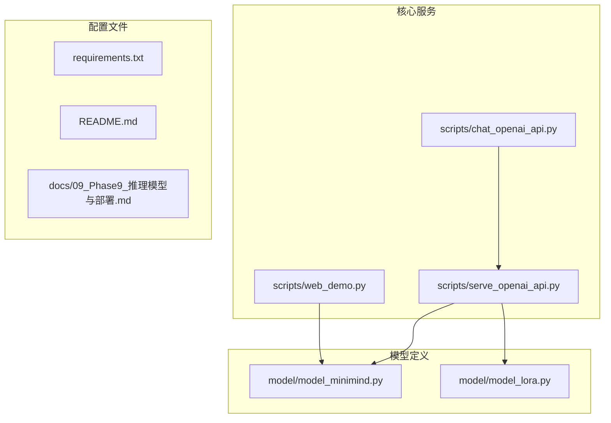

**图表来源**
- [serve_openai_api.py:1-178](file://scripts/serve_openai_api.py#L1-L178)
- [model_minimind.py:1-475](file://model/model_minimind.py#L1-L475)
- [model_lora.py:1-50](file://model/model_lora.py#L1-L50)

**章节来源**
- [serve_openai_api.py:1-178](file://scripts/serve_openai_api.py#L1-L178)
- [README.md:208-268](file://README.md#L208-L268)

## 核心组件

### FastAPI服务核心

服务基于FastAPI框架构建，提供了以下核心功能：

- **OpenAI兼容API**: 实现`/v1/chat/completions`端点
- **流式传输**: 支持SSE（Server-Sent Events）流式响应
- **多模型支持**: 原生权重和Transformers格式模型
- **LoRA微调**: 支持参数高效微调
- **MoE架构**: 支持混合专家模型

### 模型加载系统

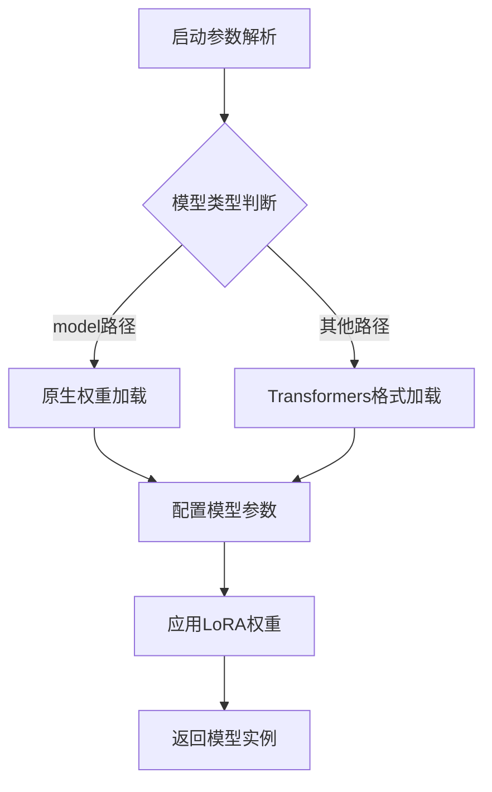

**图表来源**
- [serve_openai_api.py:27-46](file://scripts/serve_openai_api.py#L27-L46)

**章节来源**
- [serve_openai_api.py:27-46](file://scripts/serve_openai_api.py#L27-L46)

## 架构概览

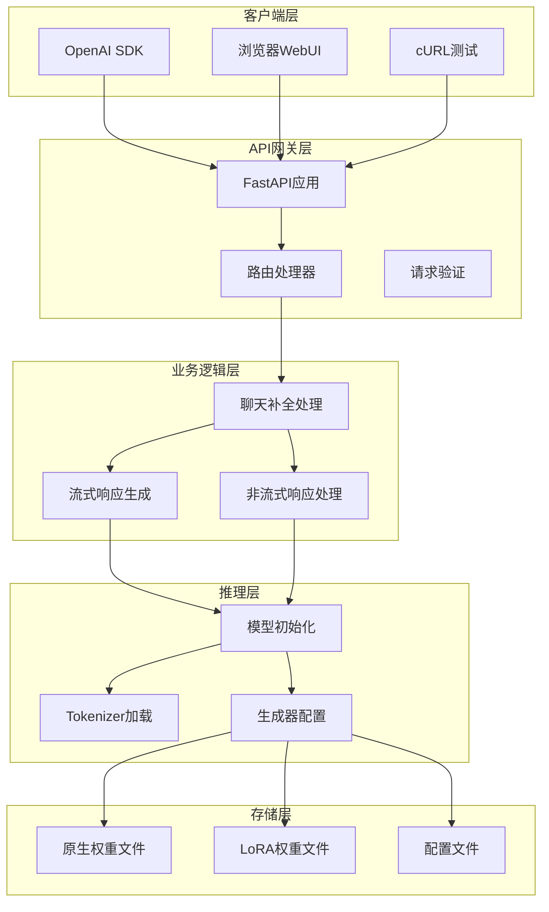

**图表来源**
- [serve_openai_api.py:113-159](file://scripts/serve_openai_api.py#L113-L159)
- [model_minimind.py:441-475](file://model/model_minimind.py#L441-L475)

## 详细组件分析

### API接口规范

#### /v1/chat/completions端点

该端点实现了OpenAI兼容的聊天补全API：

**请求格式**:
```json
{
  "model": "string",
  "messages": [
    {
      "role": "user",
      "content": "string"
    }
  ],
  "temperature": 0.7,
  "top_p": 0.92,
  "max_tokens": 8192,
  "stream": false,
  "tools": []
}
```

**响应结构**:
- **非流式响应**: 完整的JSON对象
- **流式响应**: SSE格式的增量数据块

**章节来源**
- [serve_openai_api.py:49-57](file://scripts/serve_openai_api.py#L49-L57)
- [serve_openai_api.py:113-159](file://scripts/serve_openai_api.py#L113-L159)

#### 流式传输机制

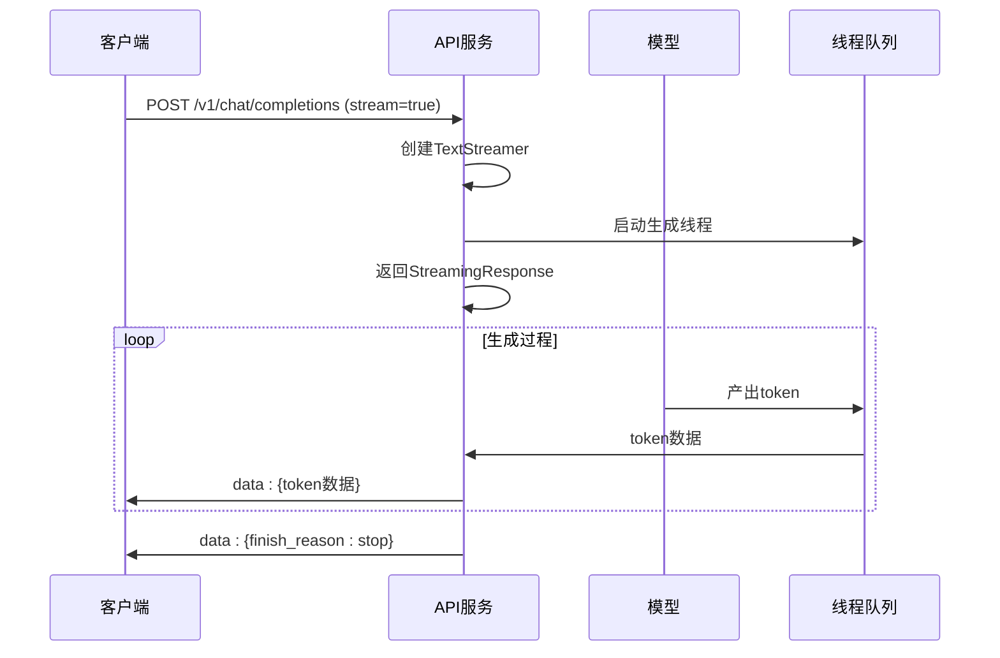

**图表来源**
- [serve_openai_api.py:71-111](file://scripts/serve_openai_api.py#L71-L111)

**章节来源**
- [serve_openai_api.py:71-111](file://scripts/serve_openai_api.py#L71-L111)

### 模型初始化过程

#### 原生权重加载

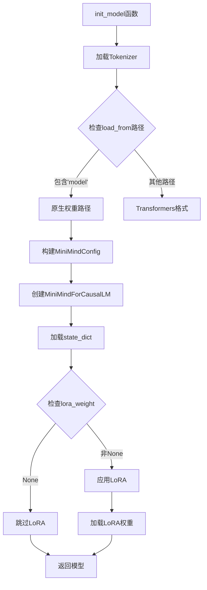

**图表来源**
- [serve_openai_api.py:27-46](file://scripts/serve_openai_api.py#L27-L46)

**章节来源**
- [serve_openai_api.py:27-46](file://scripts/serve_openai_api.py#L27-L46)

#### LoRA权重应用

LoRA（Low-Rank Adaptation）提供了参数高效微调机制：

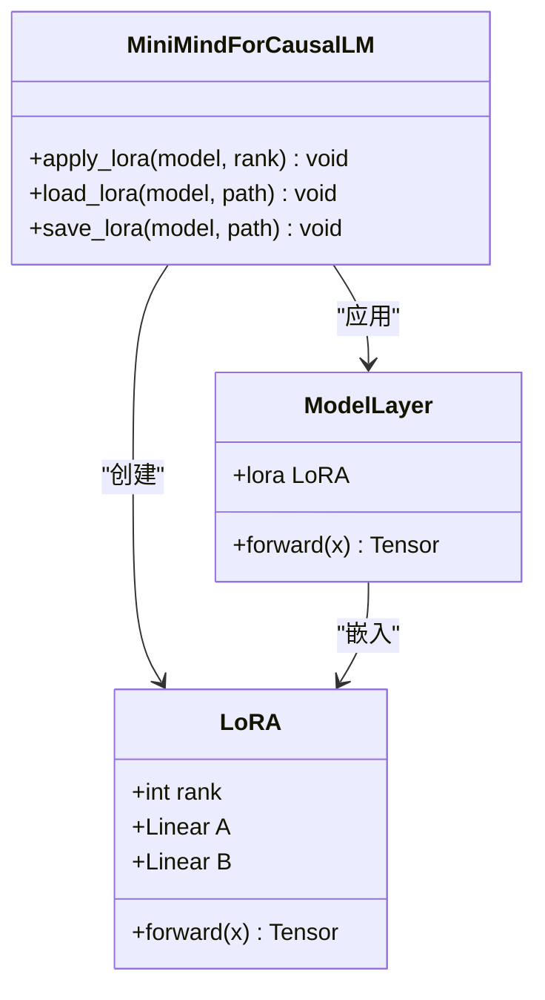

**图表来源**
- [model_lora.py:6-18](file://model/model_lora.py#L6-L18)
- [model_lora.py:21-50](file://model/model_lora.py#L21-L50)

**章节来源**
- [model_lora.py:6-50](file://model/model_lora.py#L6-L50)

### MoE架构配置

MiniMind支持混合专家（Mixture of Experts）架构：

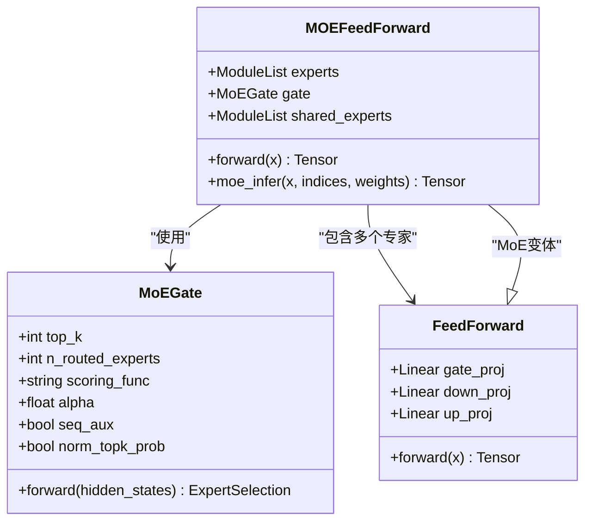

**图表来源**
- [model_minimind.py:243-297](file://model/model_minimind.py#L243-L297)
- [model_minimind.py:299-358](file://model/model_minimind.py#L299-L358)

**章节来源**
- [model_minimind.py:243-358](file://model/model_minimind.py#L243-L358)

## 依赖分析

### 外部依赖关系

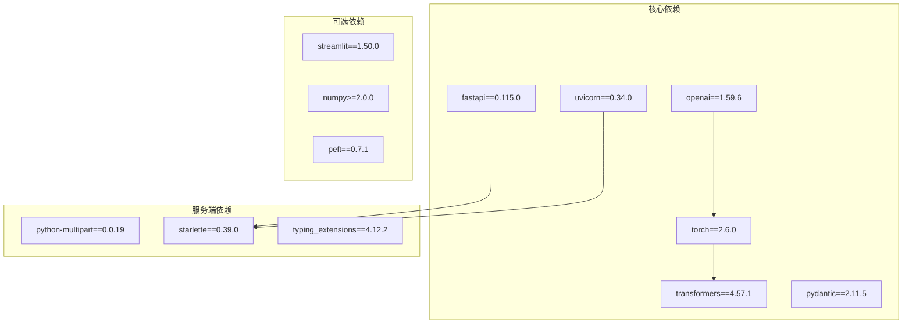

**图表来源**
- [requirements.txt:1-31](file://requirements.txt#L1-L31)

**章节来源**
- [requirements.txt:1-31](file://requirements.txt#L1-L31)

### 内部模块依赖

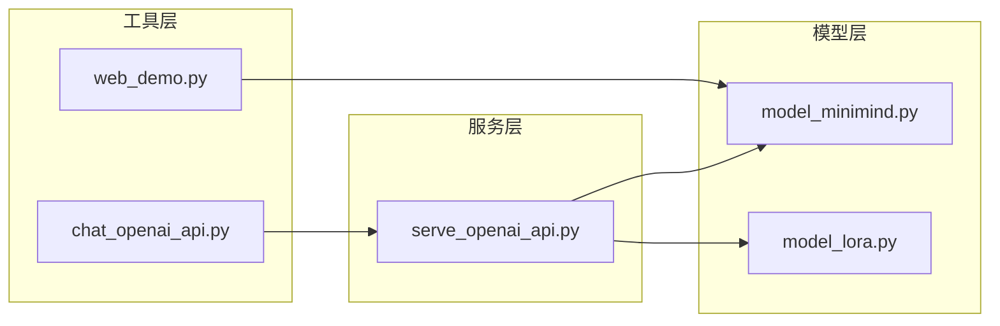

**图表来源**
- [serve_openai_api.py:18-20](file://scripts/serve_openai_api.py#L18-L20)

**章节来源**
- [serve_openai_api.py:18-20](file://scripts/serve_openai_api.py#L18-L20)

## 性能考虑

### 设备选择策略

服务支持CPU和GPU两种运行模式：

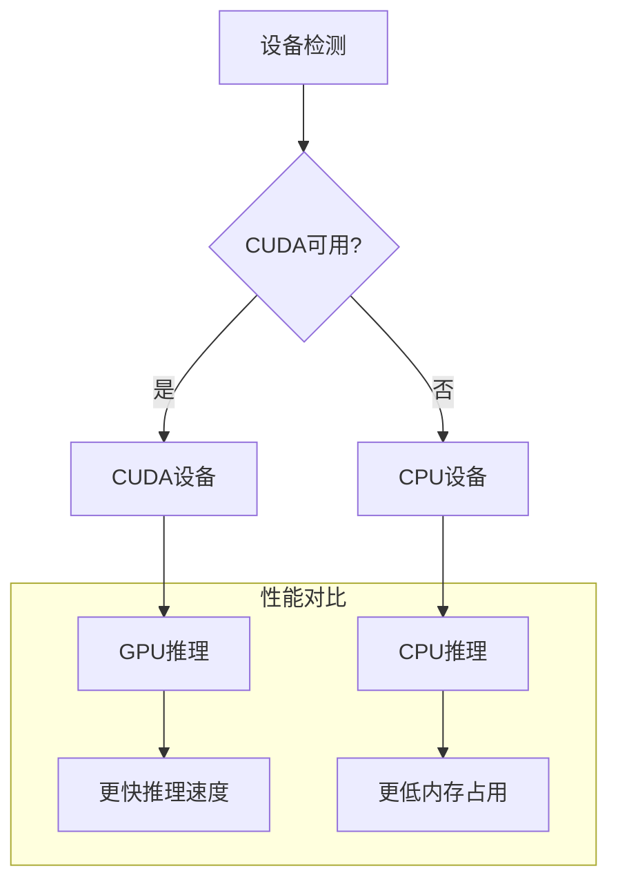

**章节来源**
- [serve_openai_api.py:173](file://scripts/serve_openai_api.py#L173)

### 内存管理策略

1. **模型参数量控制**: 
   - Small模型: ~26M参数
   - Base模型: ~104M参数  
   - MoE模型: ~145M参数

2. **序列长度优化**:
   - 默认最大序列长度: 8192
   - 支持可配置的序列长度

3. **生成策略优化**:
   - 使用`torch.no_grad()`减少内存占用
   - 支持KV缓存机制

### 并发处理配置

服务采用异步处理模式：

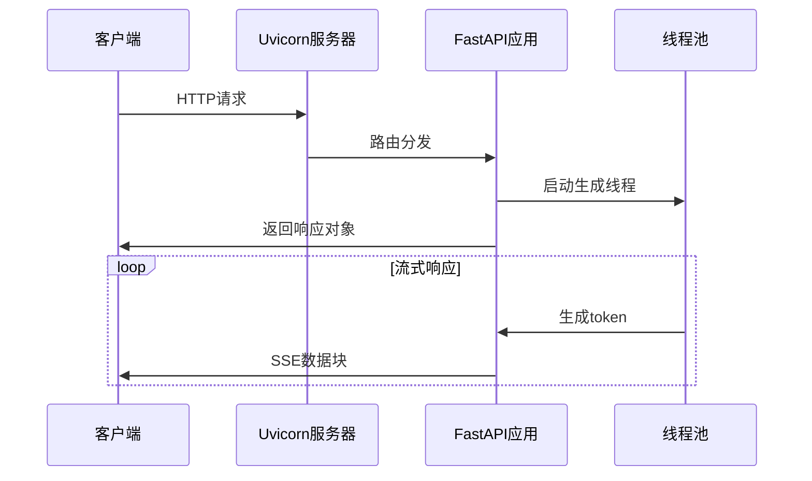

**章节来源**
- [serve_openai_api.py:92](file://scripts/serve_openai_api.py#L92)

## 故障排除指南

### 常见部署问题

1. **端口占用问题**
   - 默认端口: 8998
   - 解决方案: 修改端口或停止占用进程

2. **模型加载失败**
   - 检查权重文件路径
   - 验证模型配置参数
   - 确认设备兼容性

3. **内存不足错误**
   - 减少批量大小
   - 降低序列长度
   - 使用CPU模式

### 调试技巧

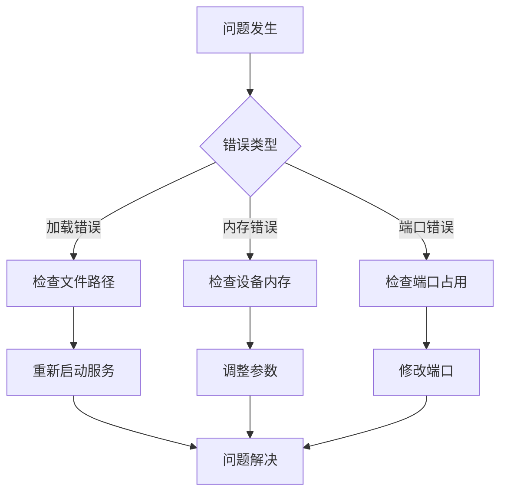

**章节来源**
- [serve_openai_api.py:176](file://scripts/serve_openai_api.py#L176)

## 结论

MiniMind OpenAI API服务部署提供了一个完整、高性能的推理服务解决方案。该服务具有以下优势：

1. **OpenAI兼容性**: 完全兼容OpenAI API规范
2. **灵活部署**: 支持多种部署方式和配置选项
3. **高性能推理**: 优化的内存管理和并发处理
4. **丰富功能**: 支持LoRA微调、MoE架构等多种高级特性

通过合理的参数配置和优化策略，该服务能够在各种硬件环境下提供稳定的推理服务。

## 附录

### 部署命令示例

#### 基础部署
```bash
cd scripts
python serve_openai_api.py
```

#### 自定义参数部署
```bash
python serve_openai_api.py \
    --load_from ../model \
    --weight full_sft \
    --hidden_size 512 \
    --num_hidden_layers 8 \
    --max_seq_len 8192 \
    --use_moe 0 \
    --device cuda
```

#### LoRA微调部署
```bash
python serve_openai_api.py \
    --load_from ../model \
    --weight full_sft \
    --lora_weight lora_identity \
    --hidden_size 512
```

### 关键参数说明

| 参数名 | 类型 | 默认值 | 描述 |
|--------|------|--------|------|
| `--load_from` | string | '../model' | 模型加载路径 |
| `--weight` | string | 'full_sft' | 权重名称前缀 |
| `--hidden_size` | int | 512 | 隐藏层维度 |
| `--num_hidden_layers` | int | 8 | 隐藏层数量 |
| `--max_seq_len` | int | 8192 | 最大序列长度 |
| `--use_moe` | int (0/1) | 0 | 是否使用MoE架构 |
| `--device` | string | 'cuda' | 运行设备 |

### API使用示例

#### Python客户端
```python
from openai import OpenAI

client = OpenAI(
    api_key="ollama",
    base_url="http://127.0.0.1:8998/v1"
)

response = client.chat.completions.create(
    model="minimind",
    messages=[{"role": "user", "content": "你好"}],
    temperature=0.7,
    top_p=0.92,
    max_tokens=8192,
    stream=False
)
```

**章节来源**
- [chat_openai_api.py:3-6](file://scripts/chat_openai_api.py#L3-L6)
- [09_Phase9_推理模型与部署.md:126-144](file://docs/09_Phase9_推理模型与部署.md#L126-L144)