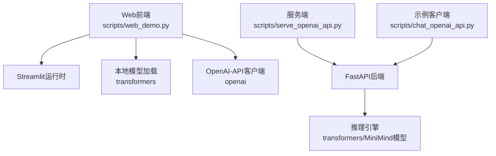
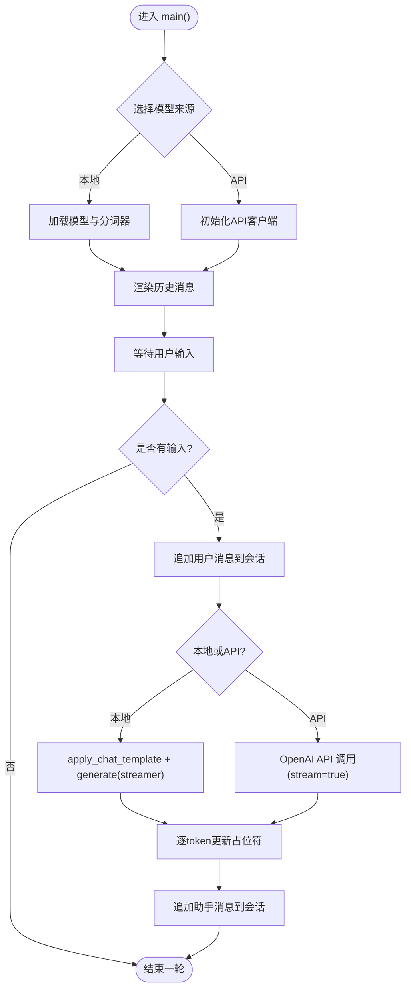
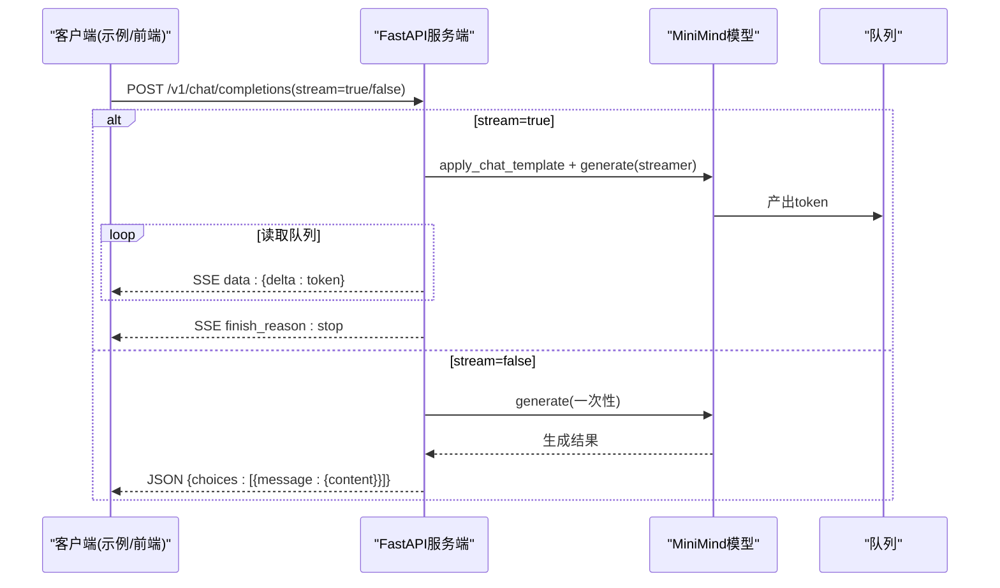
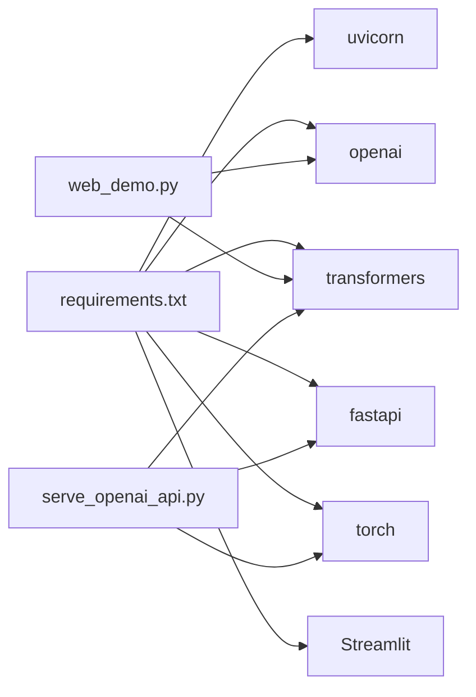

# Web界面部署

<cite>
**本文引用的文件列表**
- [web_demo.py](file://scripts/web_demo.py)
- [requirements.txt](file://requirements.txt)
- [README.md](file://README.md)
- [serve_openai_api.py](file://scripts/serve_openai_api.py)
- [chat_openai_api.py](file://scripts/chat_openai_api.py)
- [model_minimind.py](file://model/model_minimind.py)
- [09_Phase9_推理模型与部署.md](file://docs/09_Phase9_推理模型与部署.md)
</cite>

## 目录
1. [简介](#简介)
2. [项目结构](#项目结构)
3. [核心组件](#核心组件)
4. [架构总览](#架构总览)
5. [详细组件分析](#详细组件分析)
6. [依赖关系分析](#依赖关系分析)
7. [性能考量](#性能考量)
8. [故障排查指南](#故障排查指南)
9. [结论](#结论)
10. [附录](#附录)

## 简介
本指南围绕 MiniMind Web 聊天界面的部署与使用，系统讲解 Streamlit 应用的启动流程、依赖安装、环境配置、端口设置、界面功能特性（对话历史、消息发送、实时响应、主题切换等）、模型集成方式（本地模型与后端 API 的连接、请求处理、响应显示）、部署命令与配置选项（自定义参数、样式调整、功能扩展），以及浏览器兼容性、移动端适配与性能优化建议。读者可据此在本地快速启动 MiniMind Web UI，并可选接入 OpenAI-API 兼容服务端以实现远程推理。

## 项目结构
- Web 前端入口：scripts/web_demo.py
- 依赖清单：requirements.txt
- 项目文档与部署说明：README.md、docs/09_Phase9_推理模型与部署.md
- OpenAI-API 兼容服务端：scripts/serve_openai_api.py
- 示例客户端：scripts/chat_openai_api.py
- 模型配置与推理：model/model_minimind.py

图表来源
- [web_demo.py:1-329](file://scripts/web_demo.py#L1-L329)
- [serve_openai_api.py:1-178](file://scripts/serve_openai_api.py#L1-L178)
- [chat_openai_api.py:1-31](file://scripts/chat_openai_api.py#L1-L31)

章节来源
- [web_demo.py:1-329](file://scripts/web_demo.py#L1-L329)
- [requirements.txt:1-31](file://requirements.txt#L1-L31)
- [README.md:252-258](file://README.md#L252-L258)
- [09_Phase9_推理模型与部署.md:148-154](file://docs/09_Phase9_推理模型与部署.md#L148-L154)

## 核心组件
- Streamlit Web UI：负责渲染聊天界面、管理会话状态、处理用户输入、展示消息与流式输出。
- 本地模型加载：通过 transformers 加载 MiniMind 模型与分词器，支持 TextIteratorStreamer 实现流式生成。
- OpenAI-API 兼容服务端：提供 /v1/chat/completions 接口，支持流式与非流式响应。
- 示例客户端：演示如何使用 openai SDK 调用服务端接口。
- 模型配置：MiniMindConfig/MiniMindForCausalLM 提供推理配置与生成逻辑。

章节来源
- [web_demo.py:98-109](file://scripts/web_demo.py#L98-L109)
- [serve_openai_api.py:27-46](file://scripts/serve_openai_api.py#L27-L46)
- [model_minimind.py:8-78](file://model/model_minimind.py#L8-L78)

## 架构总览
Web UI 既可直接加载本地模型进行推理，也可通过 OpenAI-API 兼容服务端进行远程推理。两种模式共享相同的用户交互与消息展示逻辑，差异在于生成路径与流式输出实现。

```mermaid
sequenceDiagram
participant U as "用户"
participant S as "Streamlit前端<br/>web_demo.py"
participant T as "本地模型<br/>transformers"
participant A as "OpenAI-API服务端<br/>serve_openai_api.py"
participant R as "推理引擎<br/>MiniMind模型"
U->>S : 输入消息
alt 本地模型模式
S->>T : 加载模型与分词器
S->>T : apply_chat_template + generate(streamer)
T->>R : 生成token
R-->>T : token流
T-->>S : 流式文本
S-->>U : 实时显示响应
else API模式
S->>A : POST /v1/chat/completions(stream=true)
A->>R : 生成token
R-->>A : token流
A-->>S : SSE流
S-->>U : 实时显示响应
end
```

图表来源
- [web_demo.py:251-314](file://scripts/web_demo.py#L251-L314)
- [serve_openai_api.py:113-125](file://scripts/serve_openai_api.py#L113-L125)

章节来源
- [web_demo.py:207-323](file://scripts/web_demo.py#L207-L323)
- [serve_openai_api.py:71-111](file://scripts/serve_openai_api.py#L71-L111)

## 详细组件分析

### Streamlit Web UI 组件
- 页面配置与样式
  - 设置页面标题与侧边栏初始状态
  - 注入自定义按钮与布局样式，优化按钮尺寸、间距与悬停效果
- 会话状态管理
  - messages：完整消息历史（含用户与助手）
  - chat_messages：用于构建对话模板的历史片段
- 模型来源选择
  - 本地模型：选择 MiniMind2 系列模型路径
  - API 模式：配置 API 地址、模型标识、API Key
- 生成参数
  - 历史对话轮数 slider（0~6，步进2）
  - 最大生成长度 slider（256~8192，步进1）
  - 温度 slider（0.6~1.2，步进0.01）
- 功能实现
  - 初始化与渲染历史消息
  - 用户输入处理与消息追加
  - 本地模式：apply_chat_template + TextIteratorStreamer + 线程生成
  - API 模式：OpenAI SDK 调用 /v1/chat/completions，流式读取 delta
  - 推理标签处理：对 R1 推理标签进行 HTML 展开/收起细节块
  - 删除与重新生成：支持删除某条消息并回滚生成

图表来源
- [web_demo.py:207-323](file://scripts/web_demo.py#L207-L323)

章节来源
- [web_demo.py:9-65](file://scripts/web_demo.py#L9-L65)
- [web_demo.py:117-138](file://scripts/web_demo.py#L117-L138)
- [web_demo.py:154-183](file://scripts/web_demo.py#L154-L183)
- [web_demo.py:207-323](file://scripts/web_demo.py#L207-L323)
- [web_demo.py:71-95](file://scripts/web_demo.py#L71-L95)

### OpenAI-API 兼容服务端
- FastAPI 路由
  - POST /v1/chat/completions：支持流式与非流式响应
- 流式实现
  - 自定义 TextStreamer 将生成 token 放入队列
  - 通过线程触发 model.generate，主线程循环消费队列并返回 SSE
- 请求参数
  - model、messages、temperature、top_p、max_tokens、stream、tools
- 模型初始化
  - 支持 Transformers 格式与原生 PyTorch 权重加载
  - 可选 LoRA 权重加载
- 启动与端口
  - 默认监听 0.0.0.0:8998

图表来源
- [serve_openai_api.py:113-159](file://scripts/serve_openai_api.py#L113-L159)
- [serve_openai_api.py:71-111](file://scripts/serve_openai_api.py#L71-L111)

章节来源
- [serve_openai_api.py:1-178](file://scripts/serve_openai_api.py#L1-L178)
- [chat_openai_api.py:1-31](file://scripts/chat_openai_api.py#L1-L31)

### 模型配置与推理
- MiniMindConfig
  - 关键参数：hidden_size、num_hidden_layers、max_position_embeddings、rope_theta、use_moe、flash_attn 等
  - 支持 YaRN 外推配置（inference_rope_scaling）
- MiniMindForCausalLM
  - 继承 GenerationMixin，提供 generate 流式生成能力
  - 注意：服务端与前端均依赖 transformers 的 apply_chat_template 与 generate

章节来源
- [model_minimind.py:8-78](file://model/model_minimind.py#L8-L78)
- [model_minimind.py:80-200](file://model/model_minimind.py#L80-L200)

## 依赖关系分析
- 运行时依赖
  - Streamlit、transformers、torch、openai、fastapi、uvicorn 等
- 本地模型加载
  - AutoModelForCausalLM.from_pretrained + AutoTokenizer.from_pretrained
- API 模式
  - OpenAI SDK 客户端 + base_url 指向服务端 /v1
- 服务端
  - FastAPI + TextIteratorStreamer + 线程池 + 队列

图表来源
- [requirements.txt:1-31](file://requirements.txt#L1-L31)
- [web_demo.py:1-7](file://scripts/web_demo.py#L1-L7)
- [serve_openai_api.py:1-22](file://scripts/serve_openai_api.py#L1-L22)

章节来源
- [requirements.txt:1-31](file://requirements.txt#L1-L31)
- [web_demo.py:1-7](file://scripts/web_demo.py#L1-L7)
- [serve_openai_api.py:1-22](file://scripts/serve_openai_api.py#L1-L22)

## 性能考量
- 本地推理
  - 使用 TextIteratorStreamer 与线程异步生成，避免阻塞 UI
  - 通过 temperature、top_p 控制多样性与稳定性
  - 历史对话轮数与最大生成长度直接影响显存与延迟
- 远程推理
  - 服务端采用队列+线程触发生成，前端通过 SSE 流式接收
  - 建议在高并发场景下使用反向代理（如 Nginx）与进程池
- 显存与吞吐
  - 减少历史轮数、降低 max_new_tokens、合理设置温度与 top_p
  - 使用 MoE 模型（如 MiniMind2-MoE）可在同等显存下获得更大参数规模
- 网络与延迟
  - API 模式下，网络抖动与服务端延迟影响用户体验，建议开启本地缓存与重试策略

[本节为通用性能建议，不直接分析具体文件]

## 故障排查指南
- 依赖安装失败
  - 确认 Python 版本满足要求（README 中提示需要 Python>=3.10）
  - 使用镜像源安装 requirements.txt
- Torch CUDA 不可用
  - 按 README 提示下载并安装对应 CUDA 版本的 torch wheel
- Streamlit 启动端口占用
  - 默认端口为 8501，可通过 Streamlit 配置或命令行参数调整
- API 模式连接失败
  - 确认服务端已启动并监听 0.0.0.0:8998
  - 检查 base_url、model、api_key 配置
- 流式输出异常
  - 本地模式：确认 TextIteratorStreamer 与线程未被阻塞
  - API 模式：检查服务端 SSE 输出是否正常
- 推理标签显示问题
  - 仅在 R1 模型或 R1 名称下生效，否则直接显示原文

章节来源
- [README.md:277-288](file://README.md#L277-L288)
- [README.md:252-258](file://README.md#L252-L258)
- [web_demo.py:71-95](file://scripts/web_demo.py#L71-L95)
- [serve_openai_api.py:162-177](file://scripts/serve_openai_api.py#L162-L177)

## 结论
通过本指南，您可以在本地快速启动 MiniMind Web UI，并根据需要选择本地模型或 OpenAI-API 兼容服务端进行推理。合理配置生成参数与历史轮数，结合流式输出与队列机制，可获得较好的交互体验。对于生产部署，建议结合反向代理、进程池与缓存策略，进一步提升稳定性与性能。

[本节为总结性内容，不直接分析具体文件]

## 附录

### 部署命令与配置选项
- 本地环境准备
  - 安装依赖：pip install -r requirements.txt -i https://mirrors.aliyun.com/pypi/simple
  - 测试 Torch CUDA：import torch; print(torch.cuda.is_available())
- 启动 Web UI
  - streamlit run scripts/web_demo.py
  - 默认访问 http://localhost:8501
- 启动 OpenAI-API 兼容服务端
  - python scripts/serve_openai_api.py
  - 默认监听 http://0.0.0.0:8998
- 配置选项（侧边栏）
  - 历史对话轮数：0~6（步进2）
  - 最大生成长度：256~8192（步进1）
  - 温度：0.6~1.2（步进0.01）
  - 模型来源：本地模型 / API
  - API 模式参数：API URL、Model ID、Model Name、API Key
- 自定义参数与样式
  - 可在前端样式注入处调整按钮尺寸、颜色与间距
  - 可在服务端通过参数传入控制生成策略（如 max_tokens、temperature、top_p）

章节来源
- [README.md:233-258](file://README.md#L233-L258)
- [09_Phase9_推理模型与部署.md:148-154](file://docs/09_Phase9_推理模型与部署.md#L148-L154)
- [web_demo.py:154-183](file://scripts/web_demo.py#L154-L183)
- [serve_openai_api.py:162-177](file://scripts/serve_openai_api.py#L162-L177)

### 用户交互功能说明
- 对话历史记录：会话状态 messages 与 chat_messages 双轨存储，支持渲染与删除
- 消息发送：chat_input 获取输入，追加用户消息并触发生成
- 实时响应：本地模式使用 TextIteratorStreamer，API 模式使用 SSE 流式传输
- 主题切换：当前实现为静态样式注入，未提供动态主题切换功能

章节来源
- [web_demo.py:117-138](file://scripts/web_demo.py#L117-L138)
- [web_demo.py:241-323](file://scripts/web_demo.py#L241-L323)

### 浏览器兼容性与移动端适配
- 浏览器兼容性
  - Streamlit 基于浏览器渲染，建议使用现代浏览器（Chrome/Firefox/Edge）
- 移动端适配
  - 当前样式未针对移动端进行专门优化，建议在生产环境中引入媒体查询与响应式布局
  - API 模式在移动端网络不稳定时，建议增加重试与降级策略

[本节为通用建议，不直接分析具体文件]