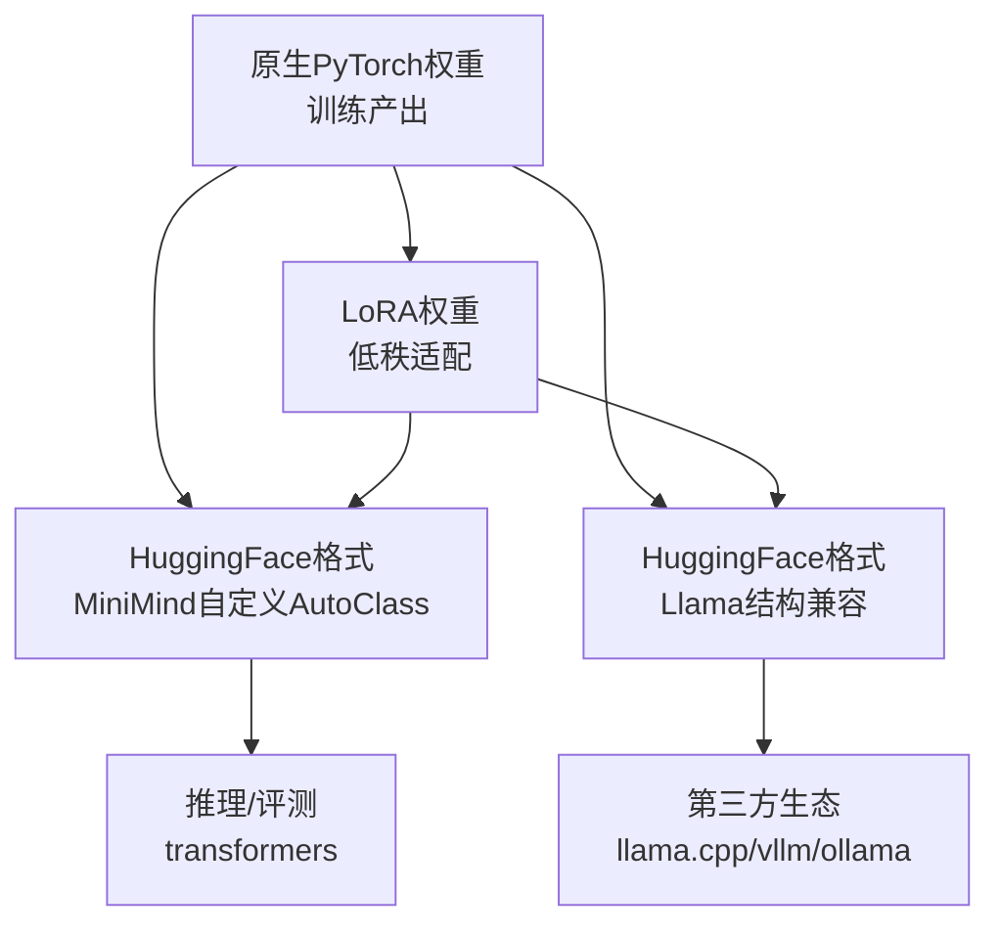
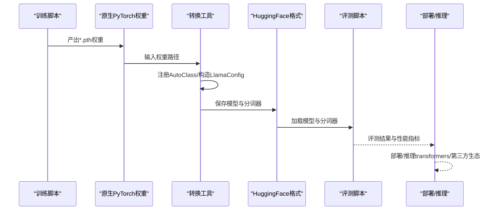
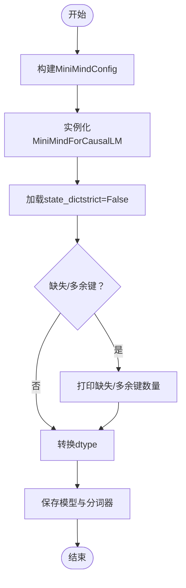
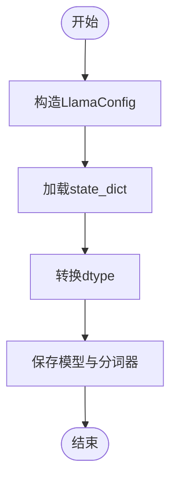
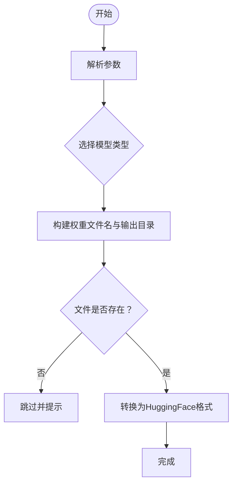
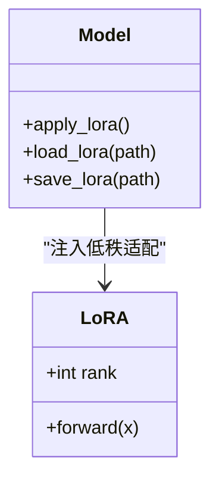
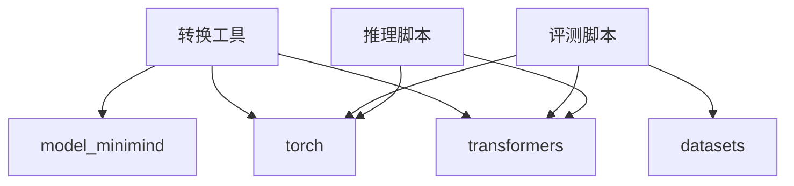

# 模型转换部署

<cite>
**本文引用的文件**   
- [scripts/convert_model.py](file://scripts/convert_model.py)
- [DST-train/convert_for_eval.py](file://DST-train/convert_for_eval.py)
- [embedding-exp/convert_for_eval.py](file://embedding-exp/convert_for_eval.py)
- [model/model_minimind.py](file://model/model_minimind.py)
- [model/model_lora.py](file://model/model_lora.py)
- [eval_benchmark.py](file://eval_benchmark.py)
- [eval_llm.py](file://eval_llm.py)
- [DST-train/train_dst.py](file://DST-train/train_dst.py)
- [trainer/train_lora.py](file://trainer/train_lora.py)
- [requirements.txt](file://requirements.txt)
- [MiniMind2/config.json](file://MiniMind2/config.json)
- [DST-train/model/baseline_hf/config.json](file://DST-train/model/baseline_hf/config.json)
</cite>

## 目录
1. [简介](#简介)
2. [项目结构](#项目结构)
3. [核心组件](#核心组件)
4. [架构总览](#架构总览)
5. [详细组件分析](#详细组件分析)
6. [依赖分析](#依赖分析)
7. [性能考量](#性能考量)
8. [故障排查指南](#故障排查指南)
9. [结论](#结论)
10. [附录](#附录)

## 简介
本指南围绕MiniMind的模型转换与部署展开，聚焦于将训练产出的原生PyTorch权重转换为HuggingFace格式、兼容第三方生态（如Llama结构）、以及评估与部署前的质量保障流程。文档涵盖：
- 权重格式转换：原生PyTorch → HuggingFace（MiniMind自定义AutoClass注册）、原生PyTorch → Transformers-Llama（结构兼容）
- 模型结构优化：支持MoE开关、中间维度对齐、Flash Attention等配置
- 兼容性处理：分词器复制、dtype精度控制、权重键缺失/多余提示
- 支持的转换目标：HuggingFace格式（MiniMind自定义AutoClass）、原生PyTorch格式、第三方框架兼容格式（Llama结构）
- 关键参数配置：模型大小选择、架构类型切换、LoRA权重合并、精度控制
- 转换命令示例与参数说明：输入输出路径、质量控制、错误处理
- 转换后验证：性能评测（C-Eval/CMMLU）、推理一致性检查、部署前检查清单

## 项目结构
本项目围绕“训练产出权重”到“可部署模型格式”的转换链路组织，关键目录与文件如下：
- scripts/convert_model.py：提供原生PyTorch到HuggingFace（MiniMind自定义）与Llama结构的转换函数
- DST-train/convert_for_eval.py：将DST训练产物（baseline/dst_phase1/dst_pruned/dst_recovered）转换为HuggingFace格式，支持MoE与稀疏度参数
- embedding-exp/convert_for_eval.py：将嵌入实验（方案B/C1/C2）的PyTorch权重转换为HuggingFace格式
- model/model_minimind.py：MiniMind配置与模型实现，含MoE、RMSNorm、RoPE、注意力与FFN等
- model/model_lora.py：LoRA低秩适配结构与加载/保存逻辑
- eval_benchmark.py：C-Eval/CMMLU评测脚本，用于转换后模型质量验证
- eval_llm.py：推理与对话演示，支持LoRA权重合并
- DST-train/train_dst.py：动态稀疏训练（DST）主流程，包含阶段一/二/三与蒸馏
- trainer/train_lora.py：LoRA微调训练脚本，支持冻结非LoRA参数
- 配置文件：MiniMind2/config.json、DST-train/model/baseline_hf/config.json

**图表来源**
- [scripts/convert_model.py:14-55](file://scripts/convert_model.py#L14-L55)
- [DST-train/convert_for_eval.py:30-82](file://DST-train/convert_for_eval.py#L30-L82)
- [embedding-exp/convert_for_eval.py:21-84](file://embedding-exp/convert_for_eval.py#L21-L84)
- [eval_llm.py:12-30](file://eval_llm.py#L12-L30)

**章节来源**
- [scripts/convert_model.py:14-76](file://scripts/convert_model.py#L14-L76)
- [DST-train/convert_for_eval.py:30-150](file://DST-train/convert_for_eval.py#L30-L150)
- [embedding-exp/convert_for_eval.py:21-135](file://embedding-exp/convert_for_eval.py#L21-L135)
- [model/model_minimind.py:8-78](file://model/model_minimind.py#L8-L78)

## 核心组件
- 转换工具
  - 原生PyTorch → HuggingFace（MiniMind自定义AutoClass注册）：注册MiniMindConfig与MiniMindForCausalLM的AutoClass，加载state_dict，转换dtype，保存模型与分词器
  - 原生PyTorch → HuggingFace（Llama结构兼容）：根据MiniMind配置构造LlamaConfig，映射关键参数，加载state_dict，转换dtype，保存模型与分词器
  - HuggingFace → 原生PyTorch：从HuggingFace加载模型，保存state_dict
- 模型配置与结构
  - MiniMindConfig：包含隐藏维度、层数、注意力头数、KV头数、RoPE theta、是否使用MoE、专家数等
  - MiniMindForCausalLM：基于MiniMindModel的因果语言模型，支持辅助损失（MoE）
- LoRA适配
  - LoRA低秩矩阵A/B定义、apply_lora/ load_lora/save_lora
- 评测与推理
  - eval_benchmark.py：C-Eval/CMMLU评测，多选题概率对比法
  - eval_llm.py：推理与对话，支持LoRA权重合并

**章节来源**
- [scripts/convert_model.py:14-76](file://scripts/convert_model.py#L14-L76)
- [model/model_minimind.py:8-78](file://model/model_minimind.py#L8-L78)
- [model/model_lora.py:6-50](file://model/model_lora.py#L6-L50)
- [eval_benchmark.py:18-31](file://eval_benchmark.py#L18-L31)
- [eval_llm.py:12-30](file://eval_llm.py#L12-L30)

## 架构总览
下图展示从训练权重到部署可用模型的转换与验证路径。

**图表来源**
- [scripts/convert_model.py:14-55](file://scripts/convert_model.py#L14-L55)
- [DST-train/convert_for_eval.py:30-82](file://DST-train/convert_for_eval.py#L30-L82)
- [eval_benchmark.py:18-31](file://eval_benchmark.py#L18-L31)

## 详细组件分析

### 组件A：原生PyTorch到HuggingFace（MiniMind自定义AutoClass）
- 功能要点
  - 注册MiniMindConfig与MiniMindForCausalLM的AutoClass，使HuggingFace可自动识别与加载
  - 加载state_dict，strict=False，打印缺失/多余键统计
  - 转换dtype（如float16/bfloat16），打印参数量
  - 保存模型与分词器
- 关键参数
  - torch_path：原生PyTorch权重路径
  - transformers_path：HuggingFace输出目录
  - dtype：保存精度（float16/bfloat16）
  - tokenizer_path：分词器路径
- 错误处理
  - 未找到权重文件时跳过
  - load_state_dict返回missing与unexpected键，便于诊断键名不匹配

**图表来源**
- [scripts/convert_model.py:14-28](file://scripts/convert_model.py#L14-L28)

**章节来源**
- [scripts/convert_model.py:14-28](file://scripts/convert_model.py#L14-L28)

### 组件B：原生PyTorch到HuggingFace（Llama结构兼容）
- 功能要点
  - 根据MiniMind配置构造LlamaConfig，映射关键参数（hidden_size、num_hidden_layers、num_attention_heads、num_key_value_heads、max_position_embeddings、rms_norm_eps、rope_theta等）
  - 加载state_dict，转换dtype，保存模型与分词器
- 适用场景
  - 需要与llama.cpp、vllm、ollama等第三方生态兼容时
- 注意事项
  - 该路径不注册MiniMind AutoClass，直接使用Llama结构

**图表来源**
- [scripts/convert_model.py:32-55](file://scripts/convert_model.py#L32-L55)

**章节来源**
- [scripts/convert_model.py:32-55](file://scripts/convert_model.py#L32-L55)

### 组件C：DST训练产物到HuggingFace（批量转换）
- 功能要点
  - 支持baseline/dst_phase1/dst_pruned/dst_recovered四类模型
  - 支持MoE开关与稀疏度参数（sparsity）
  - 自动构建输出目录与权重文件名，按需跳过不存在的文件
- 关键参数
  - model_dir：原生PyTorch权重所在目录
  - model_type：all/baseline/dst_phase1/dst_pruned/dst_recovered
  - hidden_size/num_hidden_layers/use_moe/sparsity/dtype/tokenizer_path
- 输出
  - 生成对应的HuggingFace目录（如baseline_hf、dst_hf等）

**图表来源**
- [DST-train/convert_for_eval.py:85-150](file://DST-train/convert_for_eval.py#L85-L150)

**章节来源**
- [DST-train/convert_for_eval.py:30-150](file://DST-train/convert_for_eval.py#L30-L150)

### 组件D：嵌入实验方案到HuggingFace（批量转换）
- 功能要点
  - 支持方案B/C1/C2三种嵌入方案
  - 构建MiniMindEmbeddingConfig与MiniMindEmbeddingForCausalLM
  - 保存模型与分词器，打印模型与嵌入相关参数量
- 关键参数
  - embed_type：all/B/C1/C2
  - hidden_size/num_hidden_layers/use_moe/dtype/tokenizer_path

**章节来源**
- [embedding-exp/convert_for_eval.py:21-135](file://embedding-exp/convert_for_eval.py#L21-L135)

### 组件E：LoRA权重合并与推理
- 功能要点
  - apply_lora：在线性层上注入低秩矩阵A/B，实现参数高效适配
  - load_lora/save_lora：加载/保存LoRA权重
  - eval_llm：支持加载LoRA权重并参与推理
- 关键参数
  - rank：LoRA秩（默认8）
  - lora_weight：LoRA权重名称（如lora_identity/lora_medical）

**图表来源**
- [model/model_lora.py:6-50](file://model/model_lora.py#L6-L50)

**章节来源**
- [model/model_lora.py:6-50](file://model/model_lora.py#L6-L50)
- [eval_llm.py:12-30](file://eval_llm.py#L12-L30)

## 依赖分析
- 转换工具依赖
  - transformers：AutoTokenizer、AutoModelForCausalLM、LlamaConfig/LlamaForCausalLM
  - torch：权重加载、dtype转换、保存
  - model/model_minimind：MiniMindConfig/MiniMindForCausalLM
- 评测与推理依赖
  - transformers：AutoModelForCausalLM.from_pretrained
  - datasets：C-Eval/CMMLU数据加载
  - torch：推理与评测

**图表来源**
- [requirements.txt:1-31](file://requirements.txt#L1-L31)
- [scripts/convert_model.py:8-9](file://scripts/convert_model.py#L8-L9)
- [eval_benchmark.py:14-15](file://eval_benchmark.py#L14-L15)
- [eval_llm.py:6](file://eval_llm.py#L6)

**章节来源**
- [requirements.txt:1-31](file://requirements.txt#L1-L31)

## 性能考量
- dtype选择
  - float16/bfloat16：降低显存占用，提升吞吐，但需注意数值稳定性
- 精度控制
  - 转换时统一转换dtype，避免推理时反复转换带来的额外开销
- 模型大小与层数
  - 通过hidden_size与num_hidden_layers调节模型规模，影响参数量与推理延迟
- MoE开关
  - use_moe影响中间维度与辅助损失，推理时需注意配置一致性

[本节为通用指导，无需列出章节来源]

## 故障排查指南
- 权重键缺失/多余
  - 转换时打印missing与unexpected键数量，定位键名不匹配问题
- dtype不一致
  - 确认转换时dtype与推理时dtype一致，避免精度不匹配导致的数值异常
- 分词器缺失
  - 确保tokenizer_path正确，转换时会复制分词器到输出目录
- 推理报错
  - 使用eval_llm进行最小化复现，确认模型加载路径与参数配置一致
- 评测失败
  - 检查eval_benchmark.py的模型路径与设备设置，确保trust_remote_code与dtype正确

**章节来源**
- [DST-train/convert_for_eval.py:62-66](file://DST-train/convert_for_eval.py#L62-L66)
- [embedding-exp/convert_for_eval.py:55-67](file://embedding-exp/convert_for_eval.py#L55-L67)
- [eval_benchmark.py:18-31](file://eval_benchmark.py#L18-L31)
- [eval_llm.py:12-30](file://eval_llm.py#L12-L30)

## 结论
通过本指南，您可以：
- 将训练产出的原生PyTorch权重转换为HuggingFace格式（MiniMind自定义AutoClass）或Llama结构兼容格式
- 在转换过程中灵活配置模型大小、架构类型与精度，满足不同部署场景
- 利用C-Eval/CMMLU与推理脚本对转换后的模型进行质量验证
- 基于LoRA实现参数高效的下游任务适配，并在推理时合并权重

[本节为总结性内容，无需列出章节来源]

## 附录

### 转换命令与参数说明（示例）
- 原生PyTorch → HuggingFace（MiniMind自定义）
  - 输入：torch_path、transformers_path、dtype、tokenizer_path
  - 输出：HuggingFace模型与分词器
  - 参考路径：[scripts/convert_model.py:14-28](file://scripts/convert_model.py#L14-L28)
- 原生PyTorch → HuggingFace（Llama结构兼容）
  - 输入：torch_path、transformers_path、dtype、tokenizer_path
  - 输出：HuggingFace模型与分词器
  - 参考路径：[scripts/convert_model.py:32-55](file://scripts/convert_model.py#L32-L55)
- DST训练产物批量转换
  - 输入：model_dir、model_type、hidden_size、num_hidden_layers、use_moe、sparsity、dtype、tokenizer_path
  - 输出：baseline_hf/dst_hf等目录
  - 参考路径：[DST-train/convert_for_eval.py:85-150](file://DST-train/convert_for_eval.py#L85-L150)
- 嵌入实验方案批量转换
  - 输入：model_dir、embed_type、hidden_size、num_hidden_layers、use_moe、dtype、tokenizer_path
  - 输出：B/C1/C2_hf目录
  - 参考路径：[embedding-exp/convert_for_eval.py:87-135](file://embedding-exp/convert_for_eval.py#L87-L135)
- HuggingFace → 原生PyTorch
  - 输入：transformers_path
  - 输出：torch_path
  - 参考路径：[scripts/convert_model.py:58-61](file://scripts/convert_model.py#L58-L61)

### 转换后验证与部署前检查清单
- 验证
  - 使用eval_benchmark.py进行C-Eval/CMMLU评测，核对准确率与各科目分布
  - 使用eval_llm.py进行推理与对话，确认LoRA权重合并生效
- 部署前检查
  - 模型配置一致性：config.json与训练配置一致
  - 分词器完整性：tokenizer.json、tokenizer_config.json齐全
  - dtype与设备：推理时dtype与转换时一致，设备可用
  - 第三方生态兼容：如需llama.cpp/vllm/ollama，使用Llama结构兼容路径

**章节来源**
- [eval_benchmark.py:234-319](file://eval_benchmark.py#L234-L319)
- [eval_llm.py:32-89](file://eval_llm.py#L32-L89)
- [MiniMind2/config.json:1-33](file://MiniMind2/config.json#L1-L33)
- [DST-train/model/baseline_hf/config.json:1-37](file://DST-train/model/baseline_hf/config.json#L1-L37)