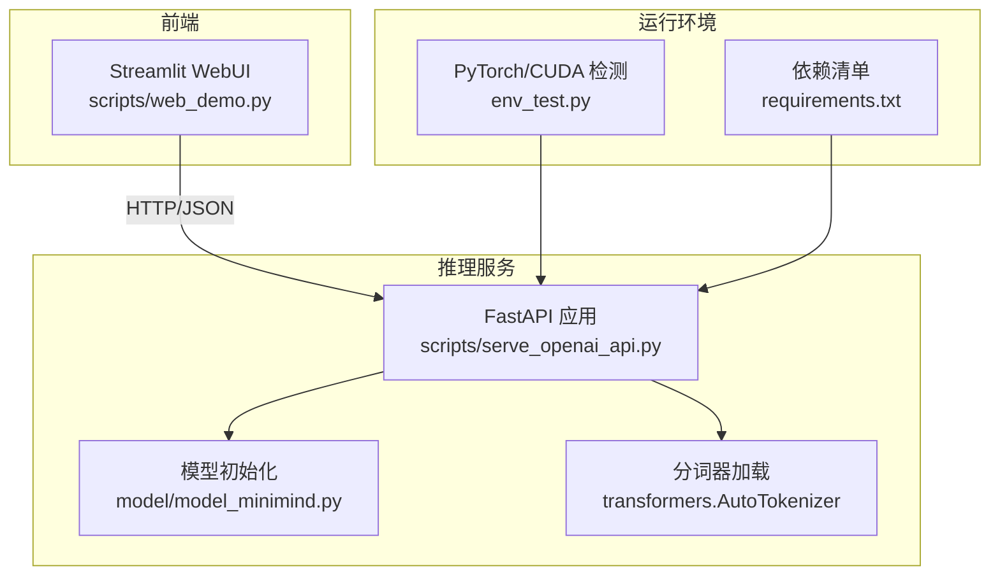
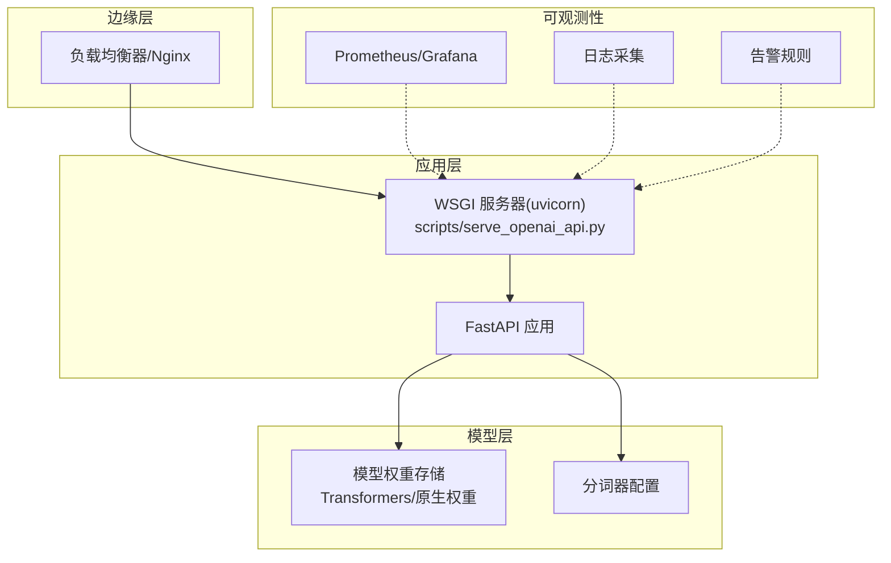
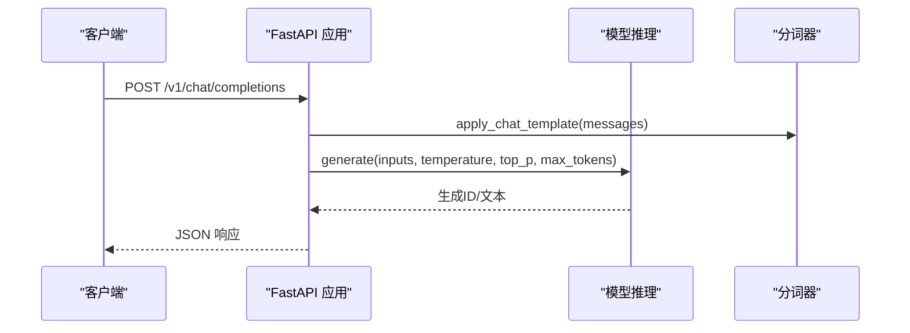
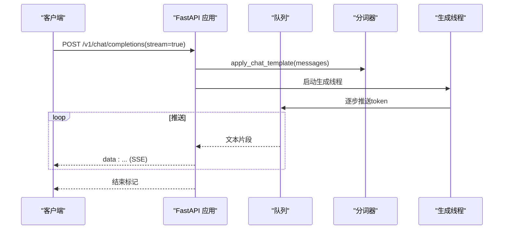
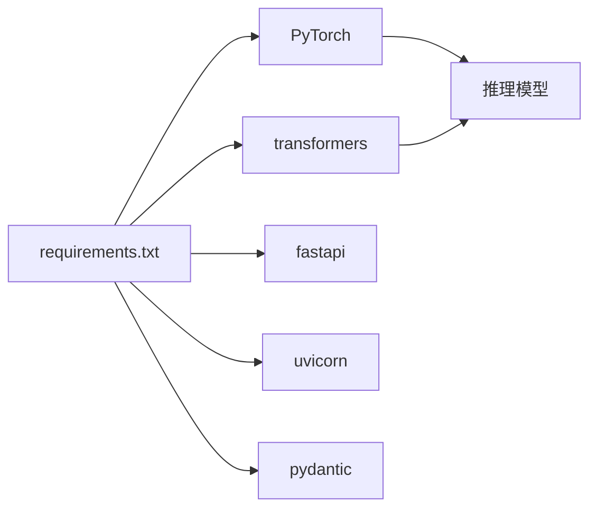

# 生产环境部署

<cite>
**本文档引用的文件**
- [README.md](file://README.md)
- [README_en.md](file://README_en.md)
- [requirements.txt](file://requirements.txt)
- [serve_openai_api.py](file://scripts/serve_openai_api.py)
- [web_demo.py](file://scripts/web_demo.py)
- [model_minimind.py](file://model/model_minimind.py)
- [env_test.py](file://env_test.py)
- [09_Phase9_推理模型与部署.md](file://docs/09_Phase9_推理模型与部署.md)
</cite>

## 目录
1. [简介](#简介)
2. [项目结构](#项目结构)
3. [核心组件](#核心组件)
4. [架构总览](#架构总览)
5. [详细组件分析](#详细组件分析)
6. [依赖关系分析](#依赖关系分析)
7. [性能考量](#性能考量)
8. [故障排查指南](#故障排查指南)
9. [结论](#结论)
10. [附录](#附录)

## 简介
本指南面向MiniMind在生产环境中的落地部署，围绕容器化、容器编排、资源限制、负载均衡、高可用、监控告警、安全加固、备份恢复与版本升级等企业级主题，结合项目现有服务端与推理能力，提供可操作的部署最佳实践与架构图示。

## 项目结构
- 服务端入口：OpenAI API兼容的FastAPI服务，基于uvicorn运行，提供流式与非流式对话能力。
- 推理模型：支持Transformers格式与原生权重两种加载路径，可按需启用LoRA与MoE。
- 前端演示：Streamlit WebUI，支持本地模型与API两种模式。
- 运行环境：依赖PyTorch与CUDA可用性检测脚本，便于生产环境验证。

图表来源
- [serve_openai_api.py:162-178](file://scripts/serve_openai_api.py#L162-L178)
- [model_minimind.py:27-46](file://model/model_minimind.py#L27-L46)
- [web_demo.py:252-276](file://scripts/web_demo.py#L252-L276)
- [env_test.py:1-6](file://env_test.py#L1-L6)
- [requirements.txt:1-31](file://requirements.txt#L1-L31)

章节来源
- [README.md:1634-1684](file://README.md#L1634-L1684)
- [README_en.md:1566-1614](file://README_en.md#L1566-L1614)
- [requirements.txt:1-31](file://requirements.txt#L1-L31)

## 核心组件
- OpenAI API兼容服务端
  - 提供/v1/chat/completions端点，支持流式与非流式响应。
  - 支持参数：温度、top_p、max_tokens、工具调用等。
  - 支持设备选择（CPU/GPU）与RoPE外推配置。
- 模型加载与推理
  - 支持Transformers格式与原生权重加载。
  - 支持LoRA权重注入与MoE开关。
- Streamlit WebUI
  - 本地模型与API两种模式，便于联调与演示。
- 环境检测
  - 验证CUDA可用性、驱动版本与GPU数量。

章节来源
- [serve_openai_api.py:49-178](file://scripts/serve_openai_api.py#L49-L178)
- [web_demo.py:162-185](file://scripts/web_demo.py#L162-L185)
- [env_test.py:1-6](file://env_test.py#L1-L6)

## 架构总览
生产部署建议采用“反向代理 + WSGI + 应用服务 + 模型存储”的分层架构，结合容器编排实现多副本、弹性扩缩与滚动升级。

图表来源
- [serve_openai_api.py:162-178](file://scripts/serve_openai_api.py#L162-L178)
- [README.md:1634-1684](file://README.md#L1634-L1684)

## 详细组件分析

### 组件A：OpenAI API兼容服务端
- 功能要点
  - 初始化模型与分词器，支持Transformers与原生权重路径。
  - 提供/v1/chat/completions，支持流式SSE与非流式JSON。
  - 参数校验与异常处理，返回标准错误码。
- 关键流程（非流式）

图表来源
- [serve_openai_api.py:113-159](file://scripts/serve_openai_api.py#L113-L159)

- 关键流程（流式）

图表来源
- [serve_openai_api.py:71-111](file://scripts/serve_openai_api.py#L71-L111)

章节来源
- [serve_openai_api.py:1-178](file://scripts/serve_openai_api.py#L1-L178)

### 组件B：模型加载与推理
- 模型初始化
  - Transformers路径：直接from_pretrained加载。
  - 原生权重路径：根据配置构造模型并加载state_dict。
  - LoRA权重：可选注入与加载。
- 推理参数
  - hidden_size、num_hidden_layers、max_seq_len、use_moe、inference_rope_scaling等。
- RoPE外推
  - 支持YaRN外推配置，提升长序列推理能力。

章节来源
- [serve_openai_api.py:27-46](file://scripts/serve_openai_api.py#L27-L46)
- [model_minimind.py:8-78](file://model/model_minimind.py#L8-L78)

### 组件C：Streamlit WebUI
- 模式切换
  - 本地模型：直接加载Transformers格式模型。
  - API模式：通过OpenAI SDK对接服务端。
- 交互特性
  - 支持历史轮次、最大生成长度、温度调节等。

章节来源
- [web_demo.py:162-185](file://scripts/web_demo.py#L162-L185)
- [web_demo.py:252-276](file://scripts/web_demo.py#L252-L276)

### 组件D：环境检测
- 验证CUDA可用性、驱动版本、GPU数量与设备名称。
- 建议在容器启动探针与CI/CD中使用。

章节来源
- [env_test.py:1-6](file://env_test.py#L1-L6)

## 依赖关系分析
- 运行时依赖
  - PyTorch、transformers、fastapi、uvicorn、pydantic等。
- 推理依赖
  - CUDA可用性与版本要求，建议在容器镜像中固化。
- 第三方生态
  - 支持llama.cpp、vllm、ollama等推理引擎，便于异构部署。

图表来源
- [requirements.txt:1-31](file://requirements.txt#L1-L31)

章节来源
- [requirements.txt:1-31](file://requirements.txt#L1-L31)
- [README.md:119-122](file://README.md#L119-L122)

## 性能考量
- 推理性能
  - 使用Flash Attention（PyTorch>=2.0）与KV缓存减少重复计算。
  - 合理设置max_seq_len与batch大小，避免显存溢出。
- 并发与吞吐
  - uvicorn多进程/多线程配置，结合请求并发与生成长度控制。
- 长序列处理
  - 启用inference_rope_scaling（YaRN）提升长上下文稳定性。
- 资源限制
  - 容器CPU/内存限额与GPU可见性控制，避免资源争抢。

章节来源
- [model_minimind.py:166-200](file://model/model_minimind.py#L166-L200)
- [serve_openai_api.py:168-174](file://scripts/serve_openai_api.py#L168-L174)

## 故障排查指南
- CUDA/显存问题
  - 使用env_test.py验证环境；若不可用，检查驱动与容器GPU可见性。
- 服务端异常
  - 查看uvicorn日志与FastAPI异常栈；确认模型路径与权重文件存在。
- 推理异常
  - 检查max_tokens与max_seq_len设置；确认分词器配置与模型一致。
- 网络与代理
  - 确认Nginx上游upstream指向正确端口；检查超时与缓冲区配置。

章节来源
- [env_test.py:1-6](file://env_test.py#L1-L6)
- [serve_openai_api.py:158-159](file://scripts/serve_openai_api.py#L158-L159)

## 结论
通过将OpenAI API兼容服务端容器化、结合Nginx反向代理与多副本部署，辅以uvicorn并发与模型侧的KV缓存与Flash Attention优化，可实现高性能、高可用的MiniMind生产部署。配套的监控、日志与告警体系，以及完善的备份与升级流程，将为企业级稳定运行提供坚实保障。

## 附录

### A. 容器化与镜像构建（建议）
- 基础镜像
  - 选择含CUDA与Python的官方PyTorch镜像，固定驱动版本。
- 依赖安装
  - 使用requirements.txt安装运行时依赖；避免在镜像中包含训练数据。
- 工作目录与入口
  - 设置WORKDIR为项目根目录；ENTRYPOINT使用uvicorn运行服务端。
- 环境变量
  - 暴露端口（如8998）、设备选择（CUDA_VISIBLE_DEVICES）、推理参数等。

章节来源
- [requirements.txt:1-31](file://requirements.txt#L1-L31)
- [serve_openai_api.py:162-178](file://scripts/serve_openai_api.py#L162-L178)

### B. 容器编排与资源限制（建议）
- 多副本与滚动升级
  - 使用Deployment/StatefulSet管理；设置maxUnavailable与maxSurge。
- 资源配额
  - 为Pod设置requests/limits；GPU通过DevicePlugins与nvidia.com/gpu资源申请。
- 存储
  - 模型权重挂载只读卷；分词器配置与生成配置通过ConfigMap管理。

章节来源
- [serve_openai_api.py:168-174](file://scripts/serve_openai_api.py#L168-L174)

### C. 负载均衡与高可用（建议）
- 多实例部署
  - Nginx upstream指向多个服务实例；启用健康检查与故障转移。
- 健康检查
  - GET /health（建议扩展）或基于TCP探针；失败自动摘除。
- 故障转移
  - 超时与重试策略；灰度发布与金丝雀流量控制。

章节来源
- [README.md:1634-1684](file://README.md#L1634-L1684)

### D. 监控告警与日志（建议）
- 指标采集
  - Prometheus抓取uvicorn指标；自定义QPS、P95/P99延迟、错误率。
- 日志管理
  - stdout/stderr统一采集；结构化日志便于检索与聚合。
- 告警规则
  - 错误率阈值、延迟阈值、资源使用率阈值、健康检查失败。

章节来源
- [README.md:1634-1684](file://README.md#L1634-L1684)

### E. 安全加固（建议）
- 网络
  - 仅暴露必要端口；TLS终止于Nginx；限制来源IP。
- 认证与授权
  - API密钥校验；速率限制；敏感参数脱敏。
- 镜像与运行
  - 只读根文件系统；非root用户运行；最小权限原则。

章节来源
- [README.md:1634-1684](file://README.md#L1634-L1684)

### F. 备份恢复与版本升级（建议）
- 备份
  - 定期备份模型权重、分词器配置与生成配置；版本化存储。
- 恢复
  - 快速回滚至上一稳定版本；灰度回退策略。
- 升级
  - 滚动升级；蓝绿/金丝雀发布；升级前后一致性校验。

章节来源
- [README.md:1634-1684](file://README.md#L1634-L1684)