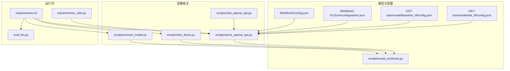
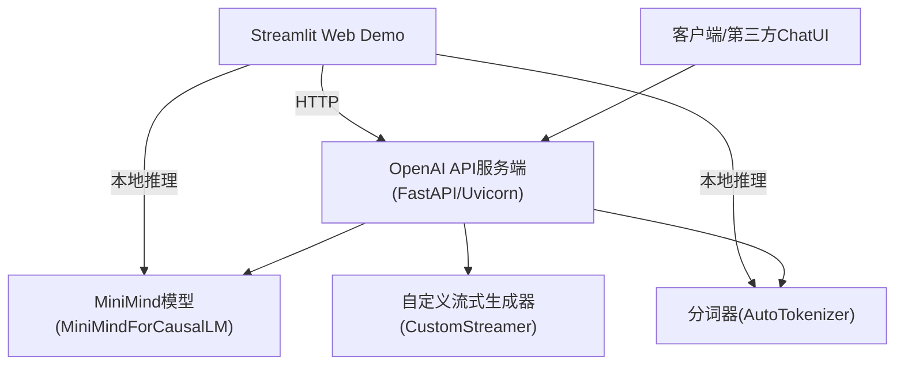
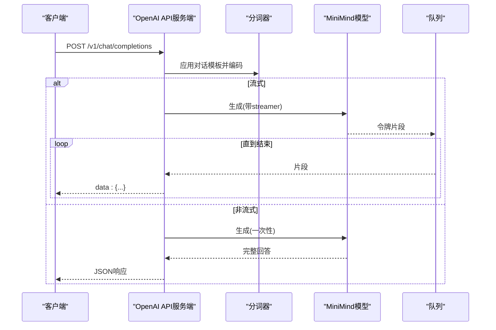
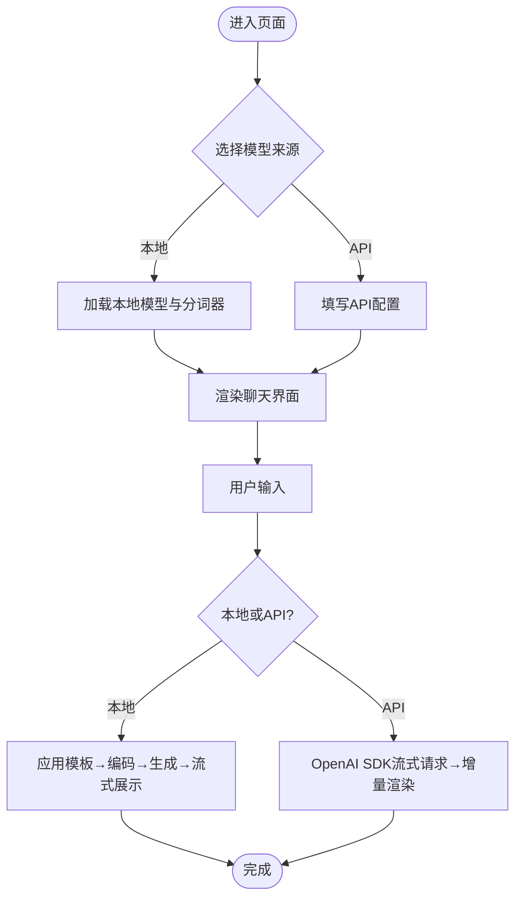
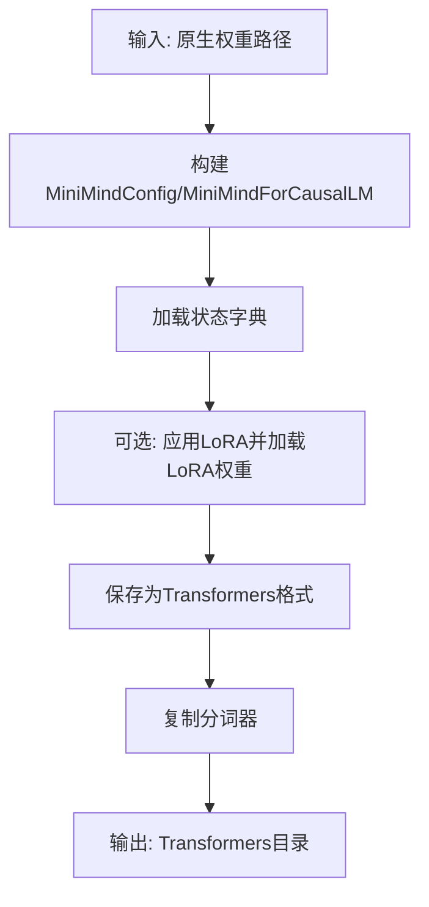
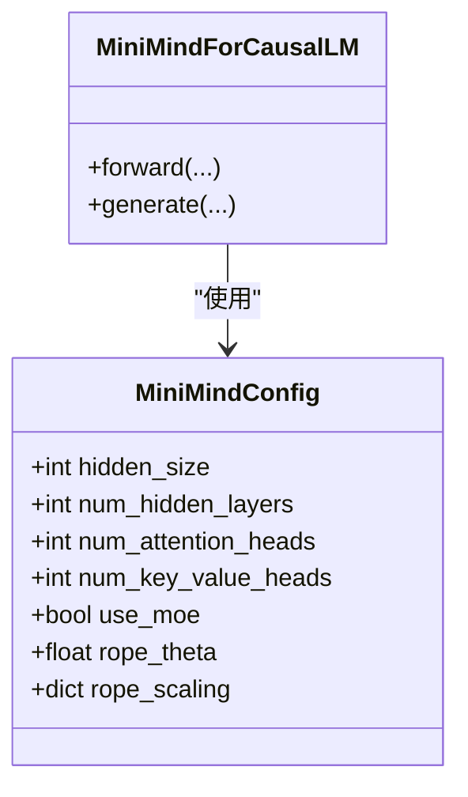
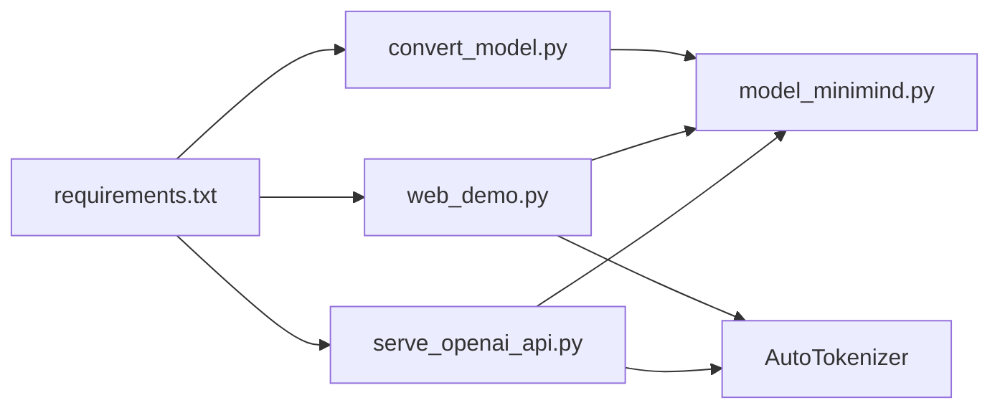

# 部署指南

<cite>
**本文引用的文件**
- [README.md](file://README.md)
- [requirements.txt](file://requirements.txt)
- [scripts/serve_openai_api.py](file://scripts/serve_openai_api.py)
- [scripts/chat_openai_api.py](file://scripts/chat_openai_api.py)
- [scripts/web_demo.py](file://scripts/web_demo.py)
- [scripts/convert_model.py](file://scripts/convert_model.py)
- [model/model_minimind.py](file://model/model_minimind.py)
- [eval_llm.py](file://eval_llm.py)
- [trainer/trainer_utils.py](file://trainer/trainer_utils.py)
- [MiniMind2/config.json](file://MiniMind2/config.json)
- [MiniMind2-PyTorch/configuration.json](file://MiniMind2-PyTorch/configuration.json)
- [DST-train/model/baseline_hf/config.json](file://DST-train/model/baseline_hf/config.json)
- [DST-train/model/dst_hf/config.json](file://DST-train/model/dst_hf/config.json)
</cite>

## 目录
1. [简介](#简介)
2. [项目结构](#项目结构)
3. [核心组件](#核心组件)
4. [架构总览](#架构总览)
5. [组件详解](#组件详解)
6. [依赖关系分析](#依赖关系分析)
7. [性能与资源](#性能与资源)
8. [故障排查](#故障排查)
9. [结论](#结论)
10. [附录](#附录)

## 简介
本指南面向从本地到生产的MiniMind模型部署全流程，重点覆盖：
- OpenAI API服务端部署与配置（端口、认证、流式响应、请求处理）
- Web聊天界面（Streamlit）部署与定制
- 模型转换工具（权重格式转换、第三方生态兼容、LoRA融合）
- 生产环境最佳实践（容器化、负载均衡、监控告警、日志管理）
- 性能调优、资源限制与故障排查

## 项目结构
项目采用按功能域划分的组织方式，核心与部署相关的目录与文件如下：
- scripts：OpenAI API服务端、Web Demo、模型转换等部署脚本
- model：MiniMind模型实现与配置
- trainer：训练工具与断点续训
- MiniMind2、MiniMind2-PyTorch、MiniMind2-Pretrain-512：模型权重与配置
- requirements.txt：运行依赖

**图表来源**
- [scripts/serve_openai_api.py:1-178](file://scripts/serve_openai_api.py#L1-L178)
- [scripts/web_demo.py:1-329](file://scripts/web_demo.py#L1-L329)
- [scripts/convert_model.py:1-76](file://scripts/convert_model.py#L1-L76)
- [model/model_minimind.py:1-200](file://model/model_minimind.py#L1-L200)
- [MiniMind2/config.json:1-33](file://MiniMind2/config.json#L1-L33)
- [MiniMind2-PyTorch/configuration.json:1-1](file://MiniMind2-PyTorch/configuration.json#L1-L1)
- [DST-train/model/baseline_hf/config.json:1-37](file://DST-train/model/baseline_hf/config.json#L1-L37)
- [DST-train/model/dst_hf/config.json:1-37](file://DST-train/model/dst_hf/config.json#L1-L37)
- [requirements.txt:1-31](file://requirements.txt#L1-L31)
- [eval_llm.py:1-89](file://eval_llm.py#L1-L89)
- [trainer/trainer_utils.py:1-139](file://trainer/trainer_utils.py#L1-L139)

**章节来源**
- [README.md:208-268](file://README.md#L208-L268)
- [requirements.txt:1-31](file://requirements.txt#L1-L31)

## 核心组件
- OpenAI API服务端：基于FastAPI + Uvicorn，提供/v1/chat/completions接口，支持流式与非流式响应，内置对话模板与采样参数。
- Streamlit Web Demo：本地或远程部署的Web聊天界面，支持本地模型与API两种来源，具备历史对话、温度、最大长度等参数调节。
- 模型转换工具：将原生权重转换为Transformers格式或Llama兼容格式，便于第三方生态（如vLLM、ollama）使用；支持LoRA融合。
- 模型实现与配置：MiniMindForCausalLM与MiniMindConfig，包含注意力、RoPE、MoE等关键组件。

**章节来源**
- [scripts/serve_openai_api.py:1-178](file://scripts/serve_openai_api.py#L1-L178)
- [scripts/web_demo.py:1-329](file://scripts/web_demo.py#L1-L329)
- [scripts/convert_model.py:1-76](file://scripts/convert_model.py#L1-L76)
- [model/model_minimind.py:1-200](file://model/model_minimind.py#L1-L200)

## 架构总览
OpenAI API服务端与Web Demo的部署架构如下：

**图表来源**
- [scripts/serve_openai_api.py:1-178](file://scripts/serve_openai_api.py#L1-L178)
- [scripts/web_demo.py:1-329](file://scripts/web_demo.py#L1-L329)
- [model/model_minimind.py:1-200](file://model/model_minimind.py#L1-L200)

## 组件详解

### OpenAI API服务端部署与配置
- 启动与端口
  - 默认监听0.0.0.0:8998，可通过命令行参数host/port调整。
- 模型加载
  - 支持从原生torch权重或Transformers格式加载；可选MoE与LoRA权重。
  - 关键参数：--load_from、--weight、--hidden_size、--num_hidden_layers、--use_moe、--lora_weight、--save_dir。
- 请求处理
  - /v1/chat/completions：支持流式与非流式；内置对话模板应用与截断。
  - 流式响应：基于队列与TextStreamer，逐片返回SSE格式数据。
- 采样与生成
  - temperature、top_p、max_tokens、tools等参数透传。
- 认证与安全
  - 当前未内置鉴权；建议通过反向代理（如Nginx）或网关添加鉴权与限流。

**图表来源**
- [scripts/serve_openai_api.py:71-125](file://scripts/serve_openai_api.py#L71-L125)
- [model/model_minimind.py:1-200](file://model/model_minimind.py#L1-L200)

**章节来源**
- [scripts/serve_openai_api.py:162-178](file://scripts/serve_openai_api.py#L162-L178)
- [scripts/serve_openai_api.py:113-160](file://scripts/serve_openai_api.py#L113-L160)
- [scripts/serve_openai_api.py:71-111](file://scripts/serve_openai_api.py#L71-L111)

### Web聊天界面（Streamlit）部署
- 启动方式
  - streamlit run scripts/web_demo.py
- 模型来源
  - 本地模型：选择MiniMind2系列目录，直接加载Transformers格式权重。
  - API模式：配置API URL、模型ID、API Key，调用外部OpenAI API服务端。
- 用户界面与交互
  - 支持历史对话轮数滑杆、最大生成长度、温度调节。
  - 支持删除/重新生成对话、滚动与Markdown渲染。
- 推理流程
  - 本地模式：应用对话模板、编码、生成、流式展示。
  - API模式：使用OpenAI SDK发起流式请求，增量渲染。

**图表来源**
- [scripts/web_demo.py:207-323](file://scripts/web_demo.py#L207-L323)

**章节来源**
- [scripts/web_demo.py:1-329](file://scripts/web_demo.py#L1-L329)

### 模型转换工具
- 转换目标
  - Transformers-MiniMind格式：注册AutoClass，便于项目内加载。
  - Transformers-Llama格式：兼容第三方生态（如vLLM、ollama）。
- 关键流程
  - 读取原生权重→构建模型→加载状态字典→保存为Transformers格式→复制分词器。
  - 支持LoRA融合：在加载原生权重后应用LoRA并加载LoRA权重。
- 输出
  - 生成Transformers格式目录与分词器，便于后续推理引擎使用。

**图表来源**
- [scripts/convert_model.py:14-55](file://scripts/convert_model.py#L14-L55)

**章节来源**
- [scripts/convert_model.py:1-76](file://scripts/convert_model.py#L1-L76)

### 模型实现与配置
- MiniMindConfig：定义隐藏维度、层数、注意力头数、RoPE theta、MoE参数等。
- MiniMindForCausalLM：实现注意力、RMSNorm、RoPE、KV缓存、生成输出等。
- 配置文件：MiniMind2/config.json、MiniMind2-PyTorch/configuration.json、DST训练产物HF配置等。

**图表来源**
- [model/model_minimind.py:8-78](file://model/model_minimind.py#L8-L78)
- [model/model_minimind.py:84-200](file://model/model_minimind.py#L84-L200)
- [MiniMind2/config.json:1-33](file://MiniMind2/config.json#L1-L33)
- [DST-train/model/baseline_hf/config.json:1-37](file://DST-train/model/baseline_hf/config.json#L1-L37)
- [DST-train/model/dst_hf/config.json:1-37](file://DST-train/model/dst_hf/config.json#L1-L37)

**章节来源**
- [model/model_minimind.py:1-200](file://model/model_minimind.py#L1-L200)
- [MiniMind2/config.json:1-33](file://MiniMind2/config.json#L1-L33)
- [DST-train/model/baseline_hf/config.json:1-37](file://DST-train/model/baseline_hf/config.json#L1-L37)
- [DST-train/model/dst_hf/config.json:1-37](file://DST-train/model/dst_hf/config.json#L1-L37)

## 依赖关系分析
- 运行时依赖：PyTorch、Transformers、FastAPI、Uvicorn、Streamlit、OpenAI SDK等。
- 组件耦合：
  - OpenAI API服务端依赖模型实现与分词器；Web Demo可直接本地推理或调用API。
  - 转换工具依赖模型实现与Transformers生态。

**图表来源**
- [requirements.txt:1-31](file://requirements.txt#L1-L31)
- [scripts/serve_openai_api.py:1-25](file://scripts/serve_openai_api.py#L1-L25)
- [scripts/web_demo.py:1-10](file://scripts/web_demo.py#L1-L10)
- [scripts/convert_model.py:1-11](file://scripts/convert_model.py#L1-L11)
- [model/model_minimind.py:1-200](file://model/model_minimind.py#L1-L200)

**章节来源**
- [requirements.txt:1-31](file://requirements.txt#L1-L31)

## 性能与资源
- 推理参数
  - temperature、top_p、max_new_tokens、历史对话轮数等直接影响生成质量与延迟。
- 设备与精度
  - 服务端默认使用CUDA（若可用），可结合半精度降低显存占用。
- 流式响应
  - 流式返回可显著改善首token延迟与用户体验。
- 断点续训与检查点
  - 训练侧提供断点续训能力，部署侧可结合模型权重版本管理与热更新策略。

**章节来源**
- [scripts/serve_openai_api.py:113-160](file://scripts/serve_openai_api.py#L113-L160)
- [scripts/web_demo.py:157-161](file://scripts/web_demo.py#L157-L161)
- [trainer/trainer_utils.py:47-98](file://trainer/trainer_utils.py#L47-L98)

## 故障排查
- 依赖缺失
  - 确认requirements.txt中依赖已安装；特别是PyTorch、Transformers、FastAPI、Uvicorn、Streamlit、OpenAI SDK。
- CUDA不可用
  - 若CUDA不可用，服务端与Web Demo会回退到CPU；推理速度会显著下降。
- 模型加载失败
  - 确认--load_from与--weight参数正确；若使用LoRA，需确保LoRA权重路径存在。
- 流式响应异常
  - 检查CustomStreamer与队列逻辑；确认SSE响应头与JSON格式正确。
- Web Demo无法连接API
  - 校验API URL、模型ID与API Key；确认服务端已启动并监听正确端口。

**章节来源**
- [requirements.txt:1-31](file://requirements.txt#L1-L31)
- [scripts/serve_openai_api.py:162-178](file://scripts/serve_openai_api.py#L162-L178)
- [scripts/web_demo.py:164-169](file://scripts/web_demo.py#L164-L169)

## 结论
本指南提供了从本地到生产的MiniMind部署路径：OpenAI API服务端、Web聊天界面、模型转换工具与生产实践建议。通过合理配置参数、选择合适推理引擎与监控体系，可在保证性能的同时获得稳定的用户体验。

## 附录

### OpenAI API服务端启动参数（摘要）
- --load_from：模型加载路径（原生torch权重或Transformers目录）
- --weight：权重名称前缀（pretrain/full_sft/dpo/reason/ppo/grpo/spo等）
- --hidden_size：隐藏维度（512/640/768）
- --num_hidden_layers：层数（8/16）
- --use_moe：是否使用MoE
- --lora_weight：LoRA权重名称（None/lora_identity/lora_medical）
- --save_dir：权重目录
- --device：运行设备（cuda/cpu）

**章节来源**
- [scripts/serve_openai_api.py:162-178](file://scripts/serve_openai_api.py#L162-L178)

### Web Demo参数（摘要）
- 历史对话轮数：0~6（偶数）
- 最大生成长度：256~8192
- 温度：0.6~1.2
- 模型来源：本地模型或API
- API配置：URL、模型ID、API Key

**章节来源**
- [scripts/web_demo.py:157-169](file://scripts/web_demo.py#L157-L169)

### 模型转换命令（摘要）
- 转换为Transformers-MiniMind格式：注册AutoClass并保存模型与分词器
- 转换为Transformers-Llama格式：兼容第三方生态
- 可选：在原生权重基础上应用LoRA并加载LoRA权重

**章节来源**
- [scripts/convert_model.py:14-55](file://scripts/convert_model.py#L14-L55)