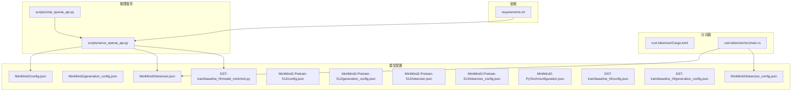
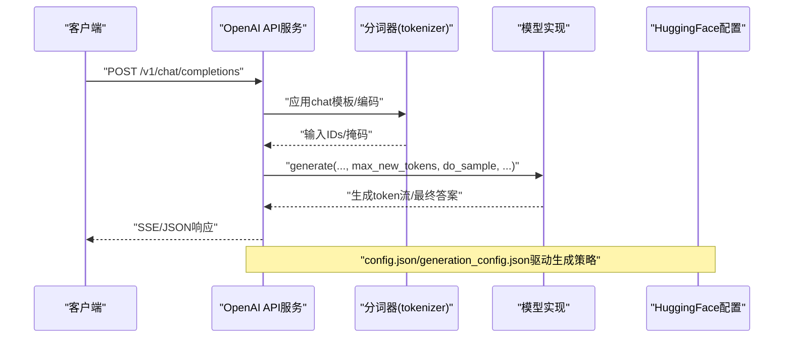
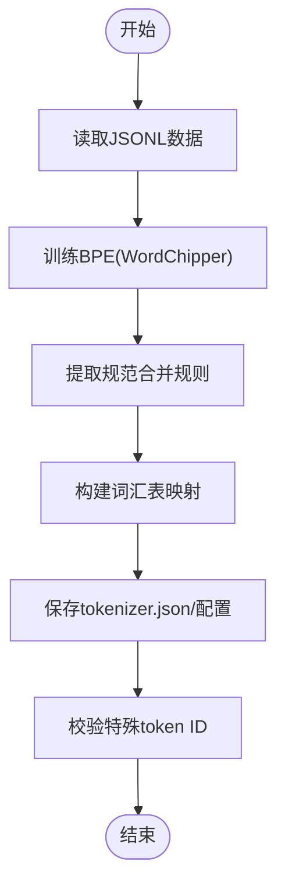
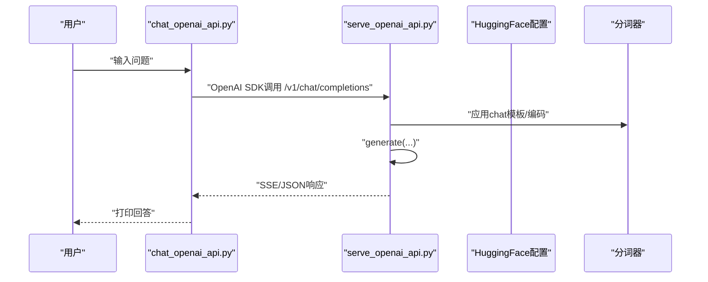
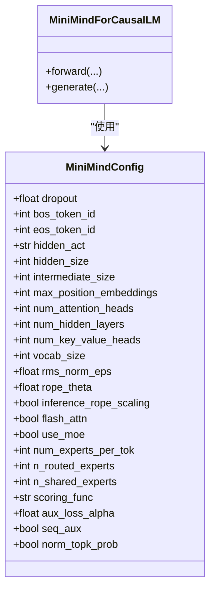
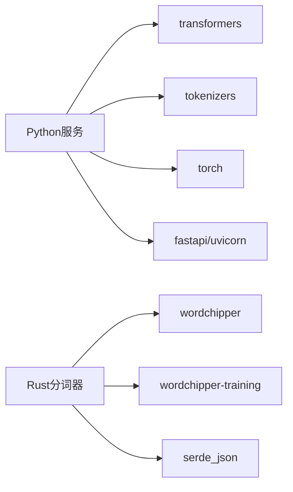

# 配置与部署

<cite>
**本文引用的文件**
- [MiniMind2/config.json](file://MiniMind2/config.json)
- [MiniMind2/generation_config.json](file://MiniMind2/generation_config.json)
- [MiniMind2/tokenizer.json](file://MiniMind2/tokenizer.json)
- [MiniMind2/tokenizer_config.json](file://MiniMind2/tokenizer_config.json)
- [MiniMind2-Pretrain-512/config.json](file://MiniMind2-Pretrain-512/config.json)
- [MiniMind2-Pretrain-512/generation_config.json](file://MiniMind2-Pretrain-512/generation_config.json)
- [MiniMind2-Pretrain-512/tokenizer.json](file://MiniMind2-Pretrain-512/tokenizer.json)
- [MiniMind2-Pretrain-512/tokenizer_config.json](file://MiniMind2-Pretrain-512/tokenizer_config.json)
- [MiniMind2-PyTorch/configuration.json](file://MiniMind2-PyTorch/configuration.json)
- [DST-train/model/baseline_hf/config.json](file://DST-train/model/baseline_hf/config.json)
- [DST-train/model/baseline_hf/generation_config.json](file://DST-train/model/baseline_hf/generation_config.json)
- [DST-train/model/baseline_hf/model_minimind.py](file://DST-train/model/baseline_hf/model_minimind.py)
- [requirements.txt](file://requirements.txt)
- [rust-tokenizer/Cargo.toml](file://rust-tokenizer/Cargo.toml)
- [rust-tokenizer/src/main.rs](file://rust-tokenizer/src/main.rs)
- [scripts/serve_openai_api.py](file://scripts/serve_openai_api.py)
- [scripts/chat_openai_api.py](file://scripts/chat_openai_api.py)
</cite>

## 目录
1. [简介](#简介)
2. [项目结构](#项目结构)
3. [核心组件](#核心组件)
4. [架构总览](#架构总览)
5. [详细组件分析](#详细组件分析)
6. [依赖关系分析](#依赖关系分析)
7. [性能考虑](#性能考虑)
8. [故障排查指南](#故障排查指南)
9. [结论](#结论)
10. [附录](#附录)

## 简介
本指南面向MiniMind项目的配置与部署，覆盖以下重点：
- 模型配置文件结构与参数含义：config.json、generation_config.json、tokenizer.json、tokenizer_config.json
- 不同模型变体的配置差异与适用场景：MiniMind2、MiniMind2-Pretrain-512、MiniMind2-PyTorch
- Rust分词器的训练流程、编译与性能优化要点
- 环境配置最佳实践：依赖管理、版本兼容、性能调优
- 生产环境部署流程与监控建议

## 项目结构
本仓库围绕“模型配置”“分词器训练”“推理服务”三大块组织：
- 模型配置：MiniMind2、MiniMind2-Pretrain-512、MiniMind2-PyTorch、DST-train/baseline_hf
- 分词器：Python脚本与Rust实现（wordchipper）
- 推理服务：OpenAI风格API服务与本地演示客户端
- 依赖：requirements.txt统一管理Python生态

**图示来源**
- [MiniMind2/config.json:1-33](file://MiniMind2/config.json#L1-L33)
- [MiniMind2/tokenizer.json:1-800](file://MiniMind2/tokenizer.json#L1-L800)
- [MiniMind2/tokenizer_config.json:1-18](file://MiniMind2/tokenizer_config.json#L1-L18)
- [MiniMind2-Pretrain-512/config.json:1-33](file://MiniMind2-Pretrain-512/config.json#L1-L33)
- [MiniMind2-Pretrain-512/tokenizer.json:1-800](file://MiniMind2-Pretrain-512/tokenizer.json#L1-L800)
- [MiniMind2-PyTorch/configuration.json:1-1](file://MiniMind2-PyTorch/configuration.json#L1-L1)
- [DST-train/model/baseline_hf/config.json:1-37](file://DST-train/model/baseline_hf/config.json#L1-L37)
- [DST-train/model/baseline_hf/model_minimind.py:1-474](file://DST-train/model/baseline_hf/model_minimind.py#L1-L474)
- [rust-tokenizer/Cargo.toml:1-15](file://rust-tokenizer/Cargo.toml#L1-L15)
- [rust-tokenizer/src/main.rs:1-384](file://rust-tokenizer/src/main.rs#L1-L384)
- [scripts/serve_openai_api.py:1-178](file://scripts/serve_openai_api.py#L1-L178)
- [scripts/chat_openai_api.py:1-31](file://scripts/chat_openai_api.py#L1-L31)
- [requirements.txt:1-31](file://requirements.txt#L1-L31)

**章节来源**
- [MiniMind2/config.json:1-33](file://MiniMind2/config.json#L1-L33)
- [MiniMind2-Pretrain-512/config.json:1-33](file://MiniMind2-Pretrain-512/config.json#L1-L33)
- [MiniMind2-PyTorch/configuration.json:1-1](file://MiniMind2-PyTorch/configuration.json#L1-L1)
- [DST-train/model/baseline_hf/config.json:1-37](file://DST-train/model/baseline_hf/config.json#L1-L37)
- [rust-tokenizer/Cargo.toml:1-15](file://rust-tokenizer/Cargo.toml#L1-L15)
- [scripts/serve_openai_api.py:1-178](file://scripts/serve_openai_api.py#L1-L178)
- [requirements.txt:1-31](file://requirements.txt#L1-L31)

## 核心组件
- 模型配置文件
  - config.json：定义模型架构、注意力头数、层数、嵌入维度、RoPE参数、dtype、缓存开关等
  - generation_config.json：生成阶段的默认行为（如是否使用缓存）
- 分词器配置
  - tokenizer.json：BPE词汇表、合并规则、ByteLevel预处理器、后处理器等
  - tokenizer_config.json：特殊token、最大长度、chat_template等
- 推理服务
  - OpenAI风格API：支持流式与非流式响应
  - 本地演示客户端：模拟OpenAI SDK调用

**章节来源**
- [MiniMind2/config.json:1-33](file://MiniMind2/config.json#L1-L33)
- [MiniMind2/generation_config.json:1-10](file://MiniMind2/generation_config.json#L1-L10)
- [MiniMind2/tokenizer.json:1-800](file://MiniMind2/tokenizer.json#L1-L800)
- [MiniMind2/tokenizer_config.json:1-18](file://MiniMind2/tokenizer_config.json#L1-L18)
- [scripts/serve_openai_api.py:1-178](file://scripts/serve_openai_api.py#L1-L178)
- [scripts/chat_openai_api.py:1-31](file://scripts/chat_openai_api.py#L1-L31)

## 架构总览
MiniMind的推理链路由“配置文件驱动 + 分词器 + 模型实现 + API服务”构成。Rust分词器负责训练BPE并导出HuggingFace兼容格式；Python服务加载配置与模型，提供OpenAI风格接口。

**图示来源**
- [scripts/serve_openai_api.py:71-125](file://scripts/serve_openai_api.py#L71-L125)
- [MiniMind2/config.json:1-33](file://MiniMind2/config.json#L1-L33)
- [MiniMind2/generation_config.json:1-10](file://MiniMind2/generation_config.json#L1-L10)

## 详细组件分析

### 模型配置文件结构与参数说明
- config.json关键字段
  - 架构与类型：architectures、model_type、dtype、use_cache
  - 注意力与位置编码：num_attention_heads、num_key_value_heads、head_dim、rope_parameters、max_position_embeddings
  - 网络规模：hidden_size、intermediate_size、num_hidden_layers
  - 激活与归一化：hidden_act、rms_norm_eps
  - 词表与特殊token：vocab_size、bos_token_id、eos_token_id、pad_token_id
- generation_config.json关键字段
  - 控制生成行为：use_cache、bos_token_id、eos_token_id
- tokenizer.json关键结构
  - added_tokens、pre_tokenizer(ByteLevel)、decoder(ByteLevel)、model(BPE)
  - vocab与merges
- tokenizer_config.json关键字段
  - 特殊token、最大长度、chat_template、tokenizer_class等

**章节来源**
- [MiniMind2/config.json:1-33](file://MiniMind2/config.json#L1-L33)
- [MiniMind2/generation_config.json:1-10](file://MiniMind2/generation_config.json#L1-L10)
- [MiniMind2/tokenizer.json:1-800](file://MiniMind2/tokenizer.json#L1-L800)
- [MiniMind2/tokenizer_config.json:1-18](file://MiniMind2/tokenizer_config.json#L1-L18)
- [MiniMind2-Pretrain-512/config.json:1-33](file://MiniMind2-Pretrain-512/config.json#L1-L33)
- [MiniMind2-Pretrain-512/generation_config.json:1-10](file://MiniMind2-Pretrain-512/generation_config.json#L1-L10)
- [MiniMind2-Pretrain-512/tokenizer.json:1-800](file://MiniMind2-Pretrain-512/tokenizer.json#L1-L800)
- [MiniMind2-Pretrain-512/tokenizer_config.json:1-18](file://MiniMind2-Pretrain-512/tokenizer_config.json#L1-L18)

### 不同模型变体的配置差异与适用场景
- MiniMind2
  - 基准配置，适合通用推理与评测
- MiniMind2-Pretrain-512
  - 更小的hidden_size与更少层数，适合资源受限或快速验证
- MiniMind2-PyTorch
  - 以PyTorch框架标注，便于与HF生态对接
- DST-train/baseline_hf
  - 包含MoE相关参数（use_moe、n_routed_experts等），适合MoE实验与对比

**章节来源**
- [MiniMind2/config.json:1-33](file://MiniMind2/config.json#L1-L33)
- [MiniMind2-Pretrain-512/config.json:1-33](file://MiniMind2-Pretrain-512/config.json#L1-L33)
- [MiniMind2-PyTorch/configuration.json:1-1](file://MiniMind2-PyTorch/configuration.json#L1-L1)
- [DST-train/model/baseline_hf/config.json:1-37](file://DST-train/model/baseline_hf/config.json#L1-L37)

### Rust分词器：训练流程与性能优化
- 训练流程
  - 读取JSONL文本数据
  - 使用wordchipper训练BPE，提取规范合并规则
  - 生成HuggingFace兼容的tokenizer.json与tokenizer_config.json
- 关键优化点
  - ByteLevel预处理与正则匹配
  - 合并规则按训练顺序排序，保证一致性
  - 特殊token ID校验，确保与HF格式一致
- 并发与内存
  - 训练采用批处理与有序合并，避免重复分配
  - ID重映射减少内存碎片

**图示来源**
- [rust-tokenizer/src/main.rs:132-192](file://rust-tokenizer/src/main.rs#L132-L192)
- [rust-tokenizer/src/main.rs:194-272](file://rust-tokenizer/src/main.rs#L194-L272)
- [rust-tokenizer/src/main.rs:274-331](file://rust-tokenizer/src/main.rs#L274-L331)
- [rust-tokenizer/src/main.rs:333-382](file://rust-tokenizer/src/main.rs#L333-L382)

**章节来源**
- [rust-tokenizer/Cargo.toml:1-15](file://rust-tokenizer/Cargo.toml#L1-L15)
- [rust-tokenizer/src/main.rs:1-384](file://rust-tokenizer/src/main.rs#L1-L384)

### 推理服务：OpenAI风格API
- 服务端
  - 支持流式与非流式响应
  - 参数：temperature、top_p、max_tokens、stream等
  - 设备选择：CUDA优先
- 客户端
  - 使用OpenAI SDK调用本地服务，支持流式输出

**图示来源**
- [scripts/chat_openai_api.py:1-31](file://scripts/chat_openai_api.py#L1-L31)
- [scripts/serve_openai_api.py:113-158](file://scripts/serve_openai_api.py#L113-L158)

**章节来源**
- [scripts/serve_openai_api.py:1-178](file://scripts/serve_openai_api.py#L1-L178)
- [scripts/chat_openai_api.py:1-31](file://scripts/chat_openai_api.py#L1-L31)

### 模型实现与配置联动
- DST-train/baseline_hf/model_minimind.py
  - 定义MiniMindConfig与MiniMindForCausalLM
  - 支持RoPE缩放、Flash Attention、MoE参数
  - 与config.json/generation_config.json联动决定生成行为

**图示来源**
- [DST-train/model/baseline_hf/model_minimind.py:8-78](file://DST-train/model/baseline_hf/model_minimind.py#L8-L78)
- [DST-train/model/baseline_hf/model_minimind.py:441-474](file://DST-train/model/baseline_hf/model_minimind.py#L441-L474)

**章节来源**
- [DST-train/model/baseline_hf/model_minimind.py:1-474](file://DST-train/model/baseline_hf/model_minimind.py#L1-L474)
- [DST-train/model/baseline_hf/config.json:1-37](file://DST-train/model/baseline_hf/config.json#L1-L37)
- [DST-train/model/baseline_hf/generation_config.json:1-9](file://DST-train/model/baseline_hf/generation_config.json#L1-L9)

## 依赖关系分析
- Python依赖
  - transformers、torch、fastapi、uvicorn、pydantic等
  - 与推理服务、模型实现直接相关
- Rust依赖
  - wordchipper、wordchipper-training、serde、serde_json等
  - 用于BPE训练与JSON序列化

**图示来源**
- [requirements.txt:1-31](file://requirements.txt#L1-L31)
- [rust-tokenizer/Cargo.toml:1-15](file://rust-tokenizer/Cargo.toml#L1-L15)

**章节来源**
- [requirements.txt:1-31](file://requirements.txt#L1-L31)
- [rust-tokenizer/Cargo.toml:1-15](file://rust-tokenizer/Cargo.toml#L1-L15)

## 性能考虑
- 模型侧
  - Flash Attention与RoPE缩放可提升长序列性能
  - use_cache与dtype（如float16）降低显存占用
  - MoE参数影响吞吐与显存平衡
- 分词器侧
  - ByteLevel正则与合并规则数量直接影响编码速度
  - 训练时批处理与有序合并减少内存峰值
- 推理侧
  - 流式响应降低首token延迟
  - CUDA可用时优先使用GPU
  - 合理设置max_tokens与temperature/top_p

[本节为通用指导，无需特定文件引用]

## 故障排查指南
- 服务启动失败
  - 检查端口占用与依赖安装
  - 确认config.json与tokenizer.json路径正确
- 生成异常
  - 核对generation_config.json与模型配置的一致性
  - 检查特殊token（bos/eos）与pad设置
- 分词器训练失败
  - 确认JSONL数据格式与字段
  - 校验特殊tokenID映射与导出逻辑
- 性能问题
  - 切换Flash Attention与float16
  - 减少max_position_embeddings或层数
  - 使用流式响应与合理批大小

**章节来源**
- [scripts/serve_openai_api.py:162-178](file://scripts/serve_openai_api.py#L162-L178)
- [rust-tokenizer/src/main.rs:356-371](file://rust-tokenizer/src/main.rs#L356-L371)

## 结论
本指南系统梳理了MiniMind的配置与部署要点，从模型配置、分词器训练到推理服务与性能优化均有覆盖。建议在生产环境中结合硬件条件选择合适变体，严格校验配置文件与分词器导出结果，并通过流式API与缓存策略提升用户体验。

[本节为总结，无需特定文件引用]

## 附录

### A. 环境配置最佳实践
- 依赖管理
  - 使用requirements.txt锁定版本，避免生态漂移
  - Rust工具链与Cargo依赖版本稳定
- 版本兼容
  - transformers与torch版本需与config.json中的transformers_version匹配
  - wordchipper版本固定，确保训练一致性
- 性能调优
  - GPU可用时启用CUDA与float16
  - 合理设置max_position_embeddings与层数
  - 启用use_cache与Flash Attention

**章节来源**
- [requirements.txt:1-31](file://requirements.txt#L1-L31)
- [rust-tokenizer/Cargo.toml:1-15](file://rust-tokenizer/Cargo.toml#L1-L15)
- [MiniMind2/config.json:1-33](file://MiniMind2/config.json#L1-L33)

### B. 生产部署流程与监控
- 部署流程
  - 准备分词器：执行Rust分词器训练并导出tokenizer.json与tokenizer_config.json
  - 准备模型：确保config.json与权重文件齐备
  - 启动服务：指定负载路径、设备与端口
- 监控建议
  - 指标：请求QPS、P95/P99延迟、显存占用、错误率
  - 日志：请求ID、输入长度、生成长度、异常栈
  - 告警：超时、OOM、异常比例阈值

[本节为通用指导，无需特定文件引用]