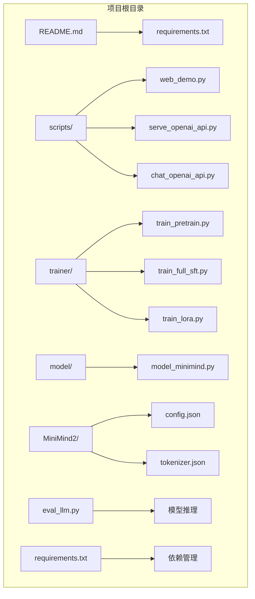
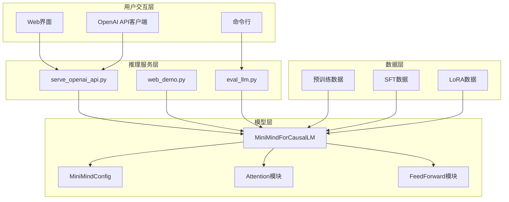
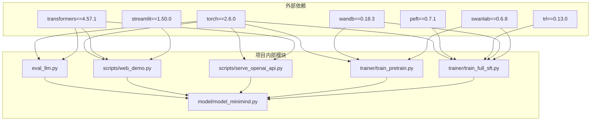

# 快速开始指南

<cite>
**本文档引用的文件**
- [README.md](file://README.md)
- [requirements.txt](file://requirements.txt)
- [eval_llm.py](file://eval_llm.py)
- [scripts/web_demo.py](file://scripts/web_demo.py)
- [scripts/serve_openai_api.py](file://scripts/serve_openai_api.py)
- [scripts/chat_openai_api.py](file://scripts/chat_openai_api.py)
- [trainer/train_pretrain.py](file://trainer/train_pretrain.py)
- [trainer/train_full_sft.py](file://trainer/train_full_sft.py)
- [trainer/train_lora.py](file://trainer/train_lora.py)
- [trainer/trainer_utils.py](file://trainer/trainer_utils.py)
- [model/model_minimind.py](file://model/model_minimind.py)
- [MiniMind2/config.json](file://MiniMind2/config.json)
- [MiniMind2/tokenizer.json](file://MiniMind2/tokenizer.json)
- [env_test.py](file://env_test.py)
- [scripts/train_tokenizer.py](file://scripts/train_tokenizer.py)
</cite>

## 目录
1. [简介](#简介)
2. [项目结构](#项目结构)
3. [核心组件](#核心组件)
4. [架构概览](#架构概览)
5. [详细组件分析](#详细组件分析)
6. [依赖关系分析](#依赖关系分析)
7. [性能考虑](#性能考虑)
8. [故障排除指南](#故障排除指南)
9. [结论](#结论)
10. [附录](#附录)

## 简介
MiniMind是一个从零开始训练超小语言模型的开源项目，最小版本仅25.8M参数，可在普通个人GPU上快速训练和推理。项目提供完整的预训练、监督微调、LoRA微调、强化学习后训练等全流程代码，支持多种推理框架和部署方式。

## 项目结构
项目采用模块化设计，主要包含以下核心目录：



**图表来源**
- [README.md:208-424](file://README.md#L208-L424)
- [requirements.txt:1-31](file://requirements.txt#L1-L31)

**章节来源**
- [README.md:208-424](file://README.md#L208-L424)
- [requirements.txt:1-31](file://requirements.txt#L1-L31)

## 核心组件
项目的核心组件包括：

### 1. 模型架构
- **MiniMindForCausalLM**: 主要的因果语言模型实现
- **MiniMindConfig**: 模型配置类，支持MoE架构
- **Attention模块**: 实现注意力机制和旋转位置编码
- **FeedForward模块**: 前馈神经网络，支持MoE扩展

### 2. 训练系统
- **训练脚本**: 预训练、监督微调、LoRA微调等
- **数据集处理**: JSONL格式数据的加载和预处理
- **分布式训练**: 支持DDP和多GPU训练

### 3. 推理服务
- **Web界面**: 基于Streamlit的聊天界面
- **OpenAI API**: 兼容OpenAI格式的推理服务
- **命令行工具**: 直接的模型测试和评估

**章节来源**
- [model/model_minimind.py:441-474](file://model/model_minimind.py#L441-L474)
- [trainer/train_pretrain.py:81-162](file://trainer/train_pretrain.py#L81-L162)
- [scripts/web_demo.py:1-329](file://scripts/web_demo.py#L1-L329)

## 架构概览



**图表来源**
- [scripts/serve_openai_api.py:162-178](file://scripts/serve_openai_api.py#L162-L178)
- [scripts/web_demo.py:207-329](file://scripts/web_demo.py#L207-L329)
- [eval_llm.py:12-89](file://eval_llm.py#L12-L89)

## 详细组件分析

### 环境配置与依赖

#### Python版本要求
- **Python版本**: 3.10.16
- **CUDA版本**: 12.2
- **操作系统**: Ubuntu 20.04

#### 依赖包安装
```bash
# 克隆项目
git clone https://github.com/jingyaogong/minimind.git

# 安装依赖包
pip install -r requirements.txt -i https://mirrors.aliyun.com/pypi/simple
```

#### CUDA配置验证
```python
import torch
print(f"CUDA 可用: {torch.cuda.is_available()}")
print(f"CUDA 版本: {torch.version.cuda}")
print(f"GPU 数量: {torch.cuda.device_count()}")
if torch.cuda.is_available():
    print(f"GPU 名称: {torch.cuda.get_device_name(0)}")
```

**章节来源**
- [README.md:210-221](file://README.md#L210-L221)
- [requirements.txt:1-31](file://requirements.txt#L1-L31)
- [env_test.py:1-6](file://env_test.py#L1-L6)

### 测试模式使用指南

#### 1. 下载预训练模型
```bash
# 克隆模型仓库
git clone https://huggingface.co/jingyaogong/MiniMind2
# 或者使用ModelScope
git clone https://www.modelscope.cn/models/gongjy/MiniMind2
```

#### 2. 命令行问答测试
```bash
# 使用transformers格式模型
python eval_llm.py --load_from ./MiniMind2
```

#### 3. Web界面启动
```bash
# 安装streamlit依赖
pip install streamlit

# 启动Web界面
cd scripts
streamlit run web_demo.py
```

#### 4. OpenAI API服务
```bash
# 启动OpenAI API服务
python scripts/serve_openai_api.py

# 使用OpenAI API客户端
python scripts/chat_openai_api.py
```

**章节来源**
- [README.md:229-268](file://README.md#L229-L268)
- [eval_llm.py:32-89](file://eval_llm.py#L32-L89)
- [scripts/web_demo.py:207-329](file://scripts/web_demo.py#L207-L329)
- [scripts/serve_openai_api.py:162-178](file://scripts/serve_openai_api.py#L162-L178)

### 训练模式完整流程

#### 1. 数据准备
从ModelScope或HuggingFace下载训练数据集到`./dataset/`目录：
- `pretrain_hq.jsonl` (1.6GB) - 预训练数据
- `sft_mini_512.jsonl` (1.2GB) - 最小化SFT数据
- `sft_512.jsonl` (7.5GB) - 标准SFT数据
- `sft_1024.jsonl` (5.6GB) - 长序列SFT数据

#### 2. 预训练阶段
```bash
# 进入训练目录
cd trainer

# 执行预训练
python train_pretrain.py
```

#### 3. 监督微调阶段
```bash
# 执行监督微调
python train_full_sft.py
```

#### 4. LoRA微调（可选）
```bash
# LoRA微调
python train_lora.py --lora_name lora_identity
```

#### 5. 模型测试
```bash
# 测试训练效果
python eval_llm.py --weight full_sft
```

**章节来源**
- [README.md:269-384](file://README.md#L269-L384)
- [trainer/train_pretrain.py:81-162](file://trainer/train_pretrain.py#L81-L162)
- [trainer/train_full_sft.py:82-163](file://trainer/train_full_sft.py#L82-L163)
- [trainer/train_lora.py:77-177](file://trainer/train_lora.py#L77-L177)

### 模型配置详解

#### 配置参数说明
| 参数 | Small模型 | Base模型 | MoE模型 |
|------|-----------|----------|---------|
| 隐藏层维度 | 512 | 768 | 640 |
| 隐藏层数量 | 8 | 16 | 8 |
| 注意力头数 | 8 | 8 | 8 |
| 键值头数 | 2 | 2 | 2 |
| 词表大小 | 6400 | 6400 | 6400 |
| 参数量 | ~26M | ~104M | ~145M |

#### RoPE位置编码
- **基础theta**: 1,000,000
- **最大位置**: 32,768
- **外推因子**: 4
- **类型**: YaRN算法

**章节来源**
- [model/model_minimind.py:8-78](file://model/model_minimind.py#L8-L78)
- [MiniMind2/config.json:1-33](file://MiniMind2/config.json#L1-L33)

## 依赖关系分析



**图表来源**
- [requirements.txt:1-31](file://requirements.txt#L1-L31)
- [eval_llm.py:1-10](file://eval_llm.py#L1-L10)
- [scripts/web_demo.py:1-10](file://scripts/web_demo.py#L1-L10)
- [scripts/serve_openai_api.py:1-22](file://scripts/serve_openai_api.py#L1-L22)

**章节来源**
- [requirements.txt:1-31](file://requirements.txt#L1-L31)
- [trainer/trainer_utils.py:1-139](file://trainer/trainer_utils.py#L1-L139)

## 性能考虑

### 硬件配置建议
- **最低配置**: NVIDIA RTX 3090 (24GB) + 128GB RAM
- **推荐配置**: 2-4张RTX 4090 (24GB) + 256GB+ RAM
- **单卡训练**: 3090单卡约2小时完成Zero模型训练
- **多卡加速**: 8卡4090可将训练时间压缩至10分钟

### 训练时间估算
基于单卡NVIDIA 3090的训练时间（小时）：

| 模型 | 预训练 | SFT(512) | SFT(1024) | SFT(2048) | RLHF |
|------|--------|----------|-----------|-----------|------|
| Small(26M) | 1.1 | 1.0 | 6.0 | 7.5 | 1.0 |
| Base(104M) | 3.9 | 3.3 | 20.0 | 25.0 | 3.0 |

### 成本预算
- **3090租卡单价**: ≈1.3元/小时
- **单卡3090**: 2.73元完成Zero模型训练
- **8卡4090**: 3元完成训练（时间约10分钟）

**章节来源**
- [README.md:674-718](file://README.md#L674-L718)

## 故障排除指南

### 常见问题及解决方案

#### 1. CUDA相关问题
**问题**: Torch无法使用CUDA
**解决方案**:
```python
# 检查CUDA可用性
import torch
print(torch.cuda.is_available())

# 如果不可用，下载对应版本的whl文件安装
# 参考: https://download.pytorch.org/whl/torch_stable.html
```

#### 2. 显存不足问题
**解决方案**:
- 减少batch size
- 使用bfloat16混合精度
- 启用梯度累积
- 降低序列长度

#### 3. 分布式训练问题
**解决方案**:
```bash
# 检查NCCL环境
export NCCL_DEBUG=INFO

# 使用torchrun启动多卡训练
torchrun --nproc_per_node N train_xxx.py
```

#### 4. 模型加载错误
**解决方案**:
```bash
# 确认模型文件存在
ls -la ./out/full_sft_*.pth

# 检查权重前缀
python eval_llm.py --weight full_sft --load_from ./MiniMind2
```

#### 5. Web界面显示问题
**解决方案**:
```bash
# 安装必要的依赖
pip install streamlit

# 检查端口占用
netstat -tulpn | grep 8501

# 重启服务
streamlit cache clear
```

**章节来源**
- [README.md:277-288](file://README.md#L277-L288)
- [trainer/trainer_utils.py:28-46](file://trainer/trainer_utils.py#L28-L46)

## 结论
MiniMind项目为开发者提供了一个完整、高效的小型语言模型训练和推理解决方案。通过合理的硬件配置和依赖管理，新手开发者可以在最短时间内体验到从零开始训练AI模型的强大功能。项目支持多种使用模式，既适合快速体验，也适合深入学习和定制开发。

## 附录

### 快速命令参考

#### 测试模式
```bash
# 环境准备
pip install -r requirements.txt -i https://mirrors.aliyun.com/pypi/simple

# 下载模型
git clone https://huggingface.co/jingyaogong/MiniMind2

# 命令行测试
python eval_llm.py --load_from ./MiniMind2

# Web界面
cd scripts && streamlit run web_demo.py
```

#### 训练模式
```bash
# 数据准备
mkdir dataset && cd dataset
# 下载所需数据集文件

# 预训练
cd ../trainer
python train_pretrain.py

# 监督微调
python train_full_sft.py

# 模型测试
python ../eval_llm.py --weight full_sft
```

### 模型文件结构
- **权重文件**: `./out/*.pth`
- **检查点**: `./checkpoints/*.pth`
- **配置文件**: `./model/*.json`
- **分词器**: `./model/tokenizer.json`