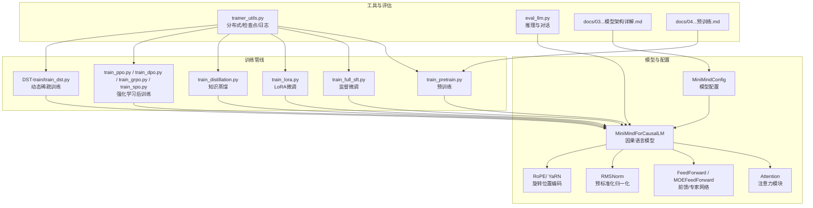
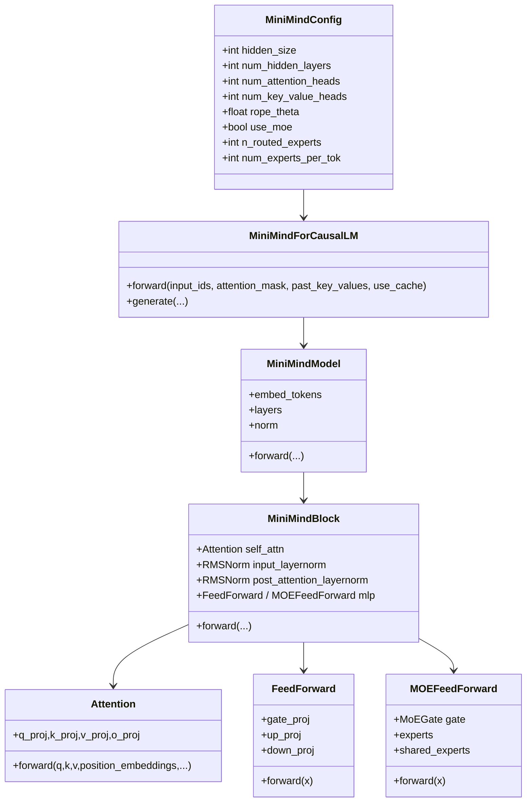
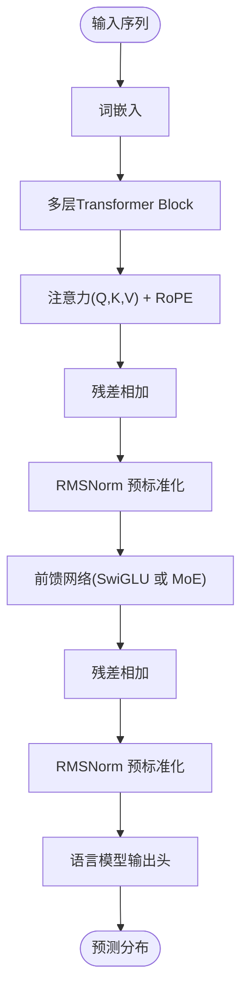
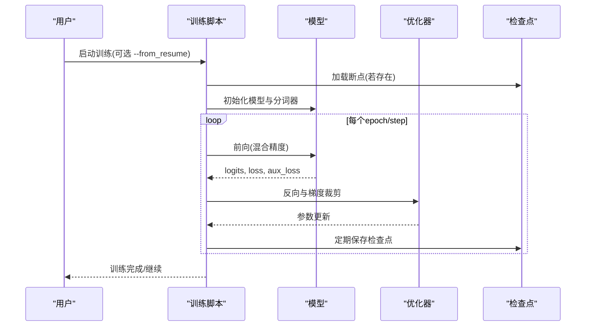
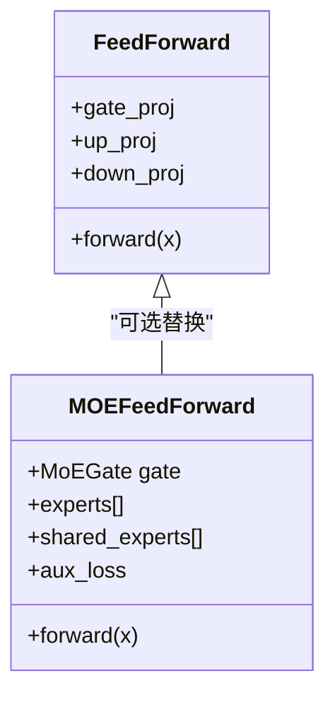
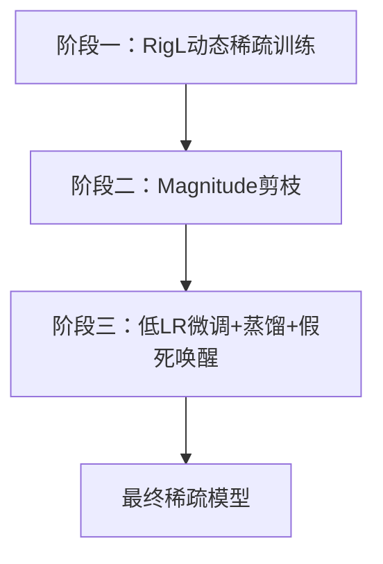
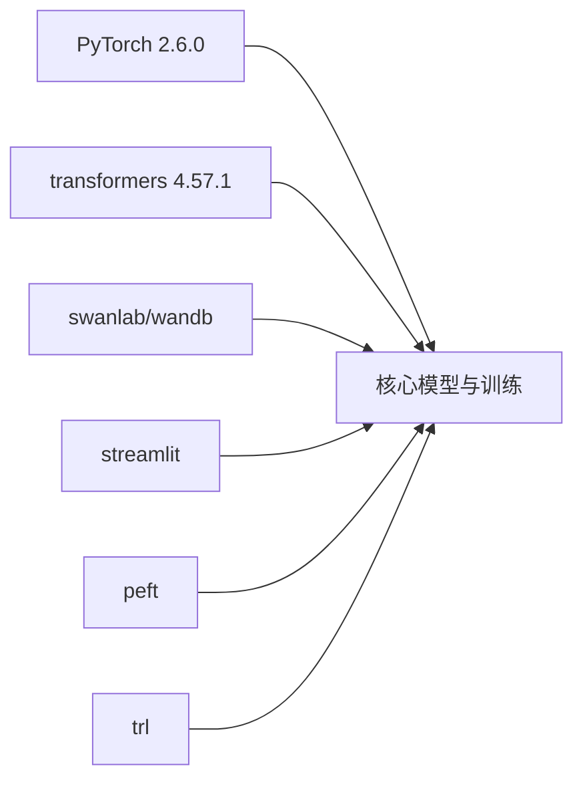

# 技术特色与创新

<cite>
**本文引用的文件**
- [README.md](file://README.md)
- [model/model_minimind.py](file://model/model_minimind.py)
- [trainer/train_pretrain.py](file://trainer/train_pretrain.py)
- [trainer/train_lora.py](file://trainer/train_lora.py)
- [trainer/train_distillation.py](file://trainer/train_distillation.py)
- [model/model_lora.py](file://model/model_lora.py)
- [trainer/trainer_utils.py](file://trainer/trainer_utils.py)
- [docs/03_Phase3_模型架构详解.md](file://docs/03_Phase3_模型架构详解.md)
- [docs/04_Phase4_预训练.md](file://docs/04_Phase4_预训练.md)
- [requirements.txt](file://requirements.txt)
- [DST-train/train_dst.py](file://DST-train/train_dst.py)
- [DST-train/model/baseline_hf/model_minimind.py](file://DST-train/model/baseline_hf/model_minimind.py)
- [eval_llm.py](file://eval_llm.py)
</cite>

## 目录
1. [引言](#引言)
2. [项目结构](#项目结构)
3. [核心组件](#核心组件)
4. [架构总览](#架构总览)
5. [详细组件分析](#详细组件分析)
6. [依赖关系分析](#依赖关系分析)
7. [性能考量](#性能考量)
8. [故障排查指南](#故障排查指南)
9. [结论](#结论)
10. [附录](#附录)

## 引言
本项目以“大道至简”为核心理念，从零开始仅用PyTorch原生实现全部核心算法，不依赖第三方高层抽象接口，系统性复现并开源MiniMind系列模型的全流程训练与部署能力。项目覆盖从预训练、监督微调、LoRA微调、知识蒸馏，到强化学习后训练（RLAIF）与推理部署的完整链路，同时提供教学价值与工程实践指导。

## 项目结构
项目采用按阶段与按职责分离的组织方式：
- 模型定义与实现：model/ 目录包含核心模型结构与LoRA扩展
- 训练脚本：trainer/ 目录包含预训练、SFT、LoRA、蒸馏等训练脚本
- 文档：docs/ 目录提供阶段式教程与技术解析
- DST训练：DST-train/ 目录提供动态稀疏训练（DST）的完整三阶段流程
- 评估与推理：eval_llm.py 提供统一的推理与对话接口
- 依赖声明：requirements.txt 明确运行环境与可选生态集成

图表来源
- [model/model_minimind.py:1-474](file://model/model_minimind.py#L1-L474)
- [trainer/train_pretrain.py:1-162](file://trainer/train_pretrain.py#L1-L162)
- [trainer/train_lora.py:1-177](file://trainer/train_lora.py#L1-L177)
- [trainer/train_distillation.py:1-224](file://trainer/train_distillation.py#L1-L224)
- [trainer/trainer_utils.py:1-139](file://trainer/trainer_utils.py#L1-L139)
- [eval_llm.py:1-89](file://eval_llm.py#L1-L89)
- [docs/03_Phase3_模型架构详解.md:1-387](file://docs/03_Phase3_模型架构详解.md#L1-L387)
- [docs/04_Phase4_预训练.md:1-352](file://docs/04_Phase4_预训练.md#L1-L352)
- [DST-train/train_dst.py:1-472](file://DST-train/train_dst.py#L1-L472)

章节来源
- [README.md:1-200](file://README.md#L1-L200)
- [requirements.txt:1-31](file://requirements.txt#L1-L31)

## 核心组件
- 模型配置与结构
  - MiniMindConfig：统一管理模型超参数，包括预标准化、激活函数、RoPE基础频率、注意力头数与KV头数、MoE专家配置等
  - MiniMindForCausalLM：基于Decoder-only架构，采用RMSNorm预标准化、SwiGLU激活、RoPE位置编码、GQA注意力与可选MoE前馈
- 关键模块
  - RMSNorm：计算更高效，与LayerNorm等价效果
  - RoPE/YaRN：相对位置编码，支持长序列外推
  - Attention：支持Flash Attention与兼容模式，KV缓存与重复
  - FeedForward：SwiGLU门控线性单元
  - MOEFeedForward：Top-2路由专家，共享专家，辅助损失（负载均衡）
- 训练工具
  - 分布式训练（DDP）、混合精度（bfloat16/float16）、梯度累积、梯度裁剪、学习率余弦退火
  - 断点续训与检查点保存，支持跨GPU数量恢复
- 推理与评估
  - 统一推理接口，支持LoRA权重加载与对话模板

章节来源
- [model/model_minimind.py:8-474](file://model/model_minimind.py#L8-L474)
- [trainer/trainer_utils.py:1-139](file://trainer/trainer_utils.py#L1-L139)
- [eval_llm.py:1-89](file://eval_llm.py#L1-L89)

## 架构总览
MiniMind采用Transformer Decoder-only结构，结合多项技术创新：
- 预标准化与RMSNorm：在每个子层输入处进行归一化，提升稳定性与收敛速度
- SwiGLU激活：以SiLU为门控激活，优于ReLU的表达能力
- RoPE旋转位置编码：相对位置建模，支持YaRN长序列外推
- GQA分组查询注意力：8查询头、2KV头，兼顾效率与性能
- 可选MoE混合专家：路由到专家子网络，共享专家增强全局信息

图表来源
- [model/model_minimind.py:8-474](file://model/model_minimind.py#L8-L474)

章节来源
- [docs/03_Phase3_模型架构详解.md:1-387](file://docs/03_Phase3_模型架构详解.md#L1-L387)

## 详细组件分析

### 模型架构与技术创新
- 预标准化与RMSNorm
  - 在每个子层输入处进行归一化，减少内部协变量偏移，提升训练稳定性
- SwiGLU激活
  - 以SiLU为门控激活，结合gate与up投影，表达能力优于ReLU
- RoPE旋转位置编码
  - 相对位置建模，通过旋转矩阵注入位置信息；YaRN支持长序列外推
- GQA分组查询注意力
  - 8查询头、2KV头，减少KV计算与存储开销，兼顾性能
- 可选MoE混合专家
  - Top-2路由专家，共享专家增强全局信息，辅助损失防止路由崩塌

图表来源
- [model/model_minimind.py:361-474](file://model/model_minimind.py#L361-L474)

章节来源
- [model/model_minimind.py:8-474](file://model/model_minimind.py#L8-L474)
- [docs/03_Phase3_模型架构详解.md:1-387](file://docs/03_Phase3_模型架构详解.md#L1-L387)

### 训练流水线与断点续训
- 预训练
  - 使用自回归语言建模目标，学习“词语接龙”，支持MoE辅助损失
  - 余弦退火学习率、混合精度、梯度累积与裁剪
- 监督微调（SFT）
  - 使用对话模板与损失掩码，引导模型遵循指令与对话格式
- LoRA微调
  - 仅训练低秩增量，冻结主干，显著降低参数与显存占用
- 知识蒸馏
  - 学生模型在CE与KL蒸馏损失间权衡，提升性能与效率
- 强化学习后训练（RLAIF）
  - 支持PPO、GRPO、SPO等算法，结合偏好数据优化回复质量
- 断点续训
  - 统一检查点保存与恢复，支持跨GPU数量步数转换

图表来源
- [trainer/train_pretrain.py:23-79](file://trainer/train_pretrain.py#L23-L79)
- [trainer/trainer_utils.py:47-97](file://trainer/trainer_utils.py#L47-L97)

章节来源
- [trainer/train_pretrain.py:1-162](file://trainer/train_pretrain.py#L1-L162)
- [trainer/train_lora.py:1-177](file://trainer/train_lora.py#L1-L177)
- [trainer/train_distillation.py:1-224](file://trainer/train_distillation.py#L1-L224)
- [trainer/trainer_utils.py:1-139](file://trainer/trainer_utils.py#L1-L139)
- [docs/04_Phase4_预训练.md:1-352](file://docs/04_Phase4_预训练.md#L1-L352)

### 多架构支持：Dense与MoE
- Dense架构
  - 使用标准SwiGLU前馈网络，参数量紧凑，适合资源受限场景
- MoE架构
  - 引入专家路由与共享专家，提升容量与泛化，同时引入辅助损失稳定训练
- 配置切换
  - 通过MiniMindConfig.use_moe与相关专家参数在训练脚本中灵活切换

图表来源
- [model/model_minimind.py:227-359](file://model/model_minimind.py#L227-L359)

章节来源
- [model/model_minimind.py:8-474](file://model/model_minimind.py#L8-L474)

### 动态稀疏训练（DST）三阶段
- 阶段一：学习与成长（RigL动态稀疏训练）
  - 在预训练中引入动态稀疏掩码，定期剪枝与恢复，提升稀疏性与鲁棒性
- 阶段二：压缩与巩固（Magnitude Pruning）
  - 对阶段一模型进行幅度剪枝，保存教师模型与掩码
- 阶段三：恢复与再成长（微调+蒸馏+假死唤醒）
  - 低学习率微调恢复，可选蒸馏与假死神经元唤醒，最终获得高稀疏度模型

图表来源
- [DST-train/train_dst.py:74-264](file://DST-train/train_dst.py#L74-L264)

章节来源
- [DST-train/train_dst.py:1-472](file://DST-train/train_dst.py#L1-L472)

### 推理与部署
- 统一推理接口
  - 支持原生权重与Transformers格式加载，LoRA权重加载与对话模板
- 生成参数
  - 温度、top_p、最大生成长度、历史对话轮数等灵活配置
- 生态兼容
  - 支持llama.cpp、vllm、ollama等推理引擎与OpenAI API协议服务端

章节来源
- [eval_llm.py:1-89](file://eval_llm.py#L1-L89)
- [README.md:120-122](file://README.md#L120-L122)

## 依赖关系分析
- 运行时依赖
  - PyTorch 2.6.0、transformers 4.57.1、swanlab/wandb、streamlit、einops等
- 训练生态
  - 支持DDP分布式训练、混合精度、断点续训、可视化监控
- 可选集成
  - peft、trl等第三方框架兼容，便于迁移与扩展

图表来源
- [requirements.txt:1-31](file://requirements.txt#L1-L31)

章节来源
- [requirements.txt:1-31](file://requirements.txt#L1-L31)

## 性能考量
- 计算与内存
  - RMSNorm与SwiGLU在保持效果的同时降低计算开销
  - GQA减少KV计算与缓存，提升长序列效率
  - LoRA仅训练低秩参数，显著降低显存占用
- 训练稳定性
  - 预标准化与余弦退火学习率、梯度裁剪与混合精度共同保障稳定收敛
- 稀疏化与蒸馏
  - DST三阶段在保持性能前提下实现高稀疏度，蒸馏进一步提升效率与泛化

## 故障排查指南
- 训练中断与恢复
  - 使用断点续训功能，自动保存与恢复模型、优化器、缩放器与wandb运行ID
- 分布式训练
  - DDP初始化与采样器设置，注意忽略RoPE频率缓存同步
- 混合精度
  - bfloat16无需GradScaler，float16需正确使用GradScaler
- LoRA参数
  - 冻结非LoRA参数，仅训练低秩增量，避免覆盖主干权重

章节来源
- [trainer/trainer_utils.py:47-97](file://trainer/trainer_utils.py#L47-L97)
- [trainer/train_lora.py:137-145](file://trainer/train_lora.py#L137-L145)
- [trainer/train_pretrain.py:146-149](file://trainer/train_pretrain.py#L146-L149)

## 结论
MiniMind项目以“从零实现”为核心，系统性展示了从模型架构到训练流水线的完整技术路径。通过PyTorch原生实现与精心设计的模块化结构，项目在教学价值与工程实践之间取得平衡，既满足入门学习，又可支撑实际部署与扩展。项目在架构创新（预标准化、RoPE、GQA、MoE）、训练技术（断点续训、混合精度、分布式、DST、蒸馏、RLAIF）与生态兼容方面形成完整闭环，为开发者提供从理论到实践的清晰学习路径。

## 附录
- 模型参数与配置参考
  - MiniMind2系列参数表与配置项说明
- 教程与练习
  - 模型结构与参数量计算、RoPE可视化、Dense与MoE对比等动手练习

章节来源
- [docs/03_Phase3_模型架构详解.md:17-387](file://docs/03_Phase3_模型架构详解.md#L17-L387)
- [README.md:607-642](file://README.md#L607-L642)