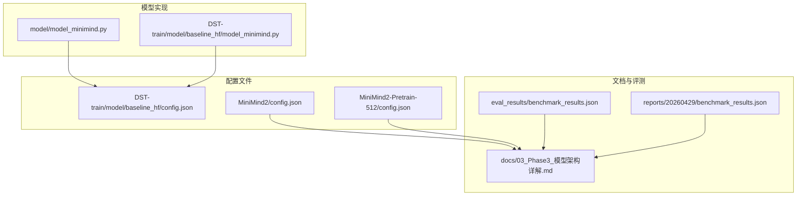
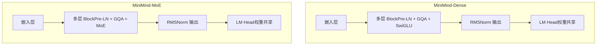
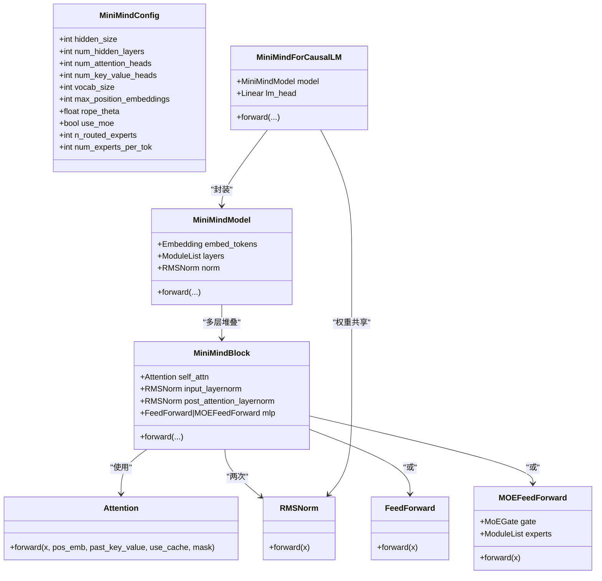
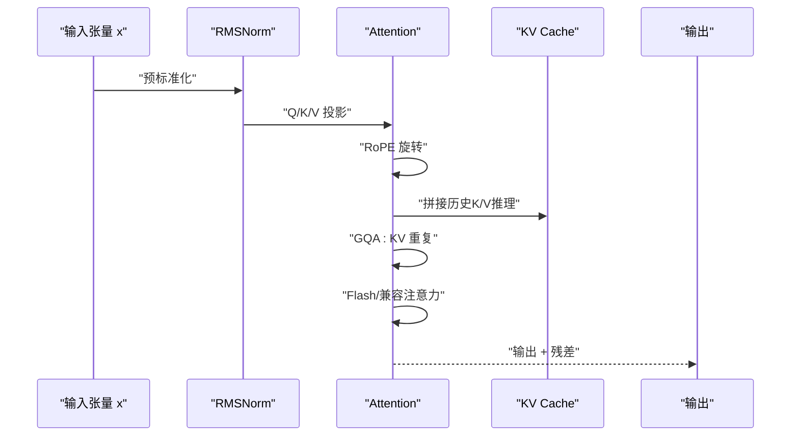
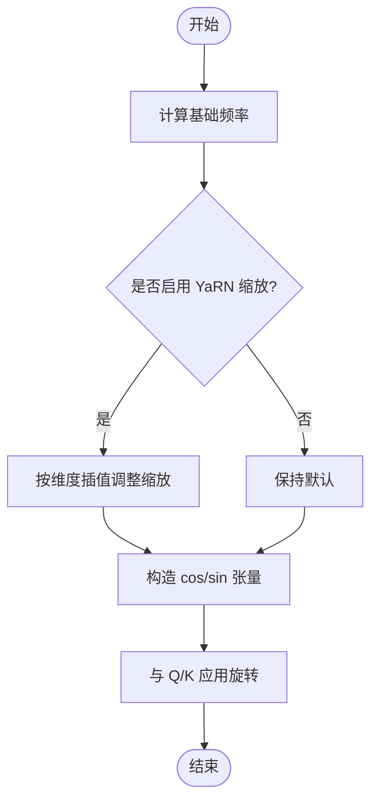
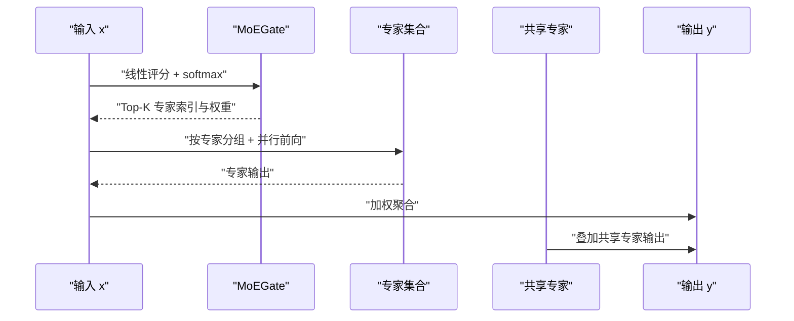
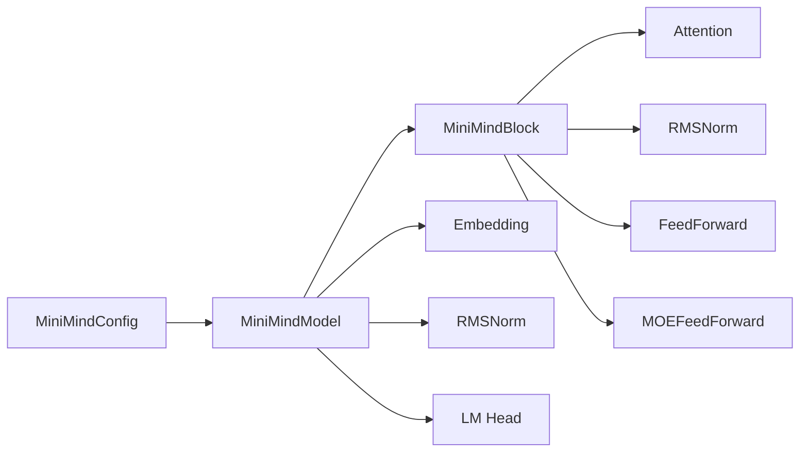

# 模型架构概览

<cite>
**本文档引用的文件**
- [model_minimind.py](file://model/model_minimind.py)
- [model_minimind.py](file://DST-train/model/baseline_hf/model_minimind.py)
- [config.json](file://DST-train/model/baseline_hf/config.json)
- [config.json](file://MiniMind2/config.json)
- [config.json](file://MiniMind2-Pretrain-512/config.json)
- [03_Phase3_模型架构详解.md](file://docs/03_Phase3_模型架构详解.md)
- [benchmark_results.json](file://eval_results/benchmark_results.json)
- [benchmark_results.json](file://reports/20260429/benchmark_results.json)
</cite>

## 目录
1. [简介](#简介)
2. [项目结构](#项目结构)
3. [核心组件](#核心组件)
4. [架构总览](#架构总览)
5. [详细组件分析](#详细组件分析)
6. [依赖关系分析](#依赖关系分析)
7. [性能考量](#性能考量)
8. [故障排查指南](#故障排查指南)
9. [结论](#结论)
10. [附录](#附录)

## 简介
本文件面向开发者与研究者，系统梳理 MiniMind 项目的模型架构，重点覆盖两类变体：
- MiniMind-Dense：基于 Transformer Decoder-only 的密集前馈网络（SwiGLU）实现
- MiniMind-MoE：在 Dense 基础上引入混合专家（Mixture-of-Experts）的扩展版本

文档围绕以下主题展开：架构设计理念、Transformer Decoder-only 的选择与实现细节（注意力机制、前馈网络、位置编码）、RoPE 旋转位置编码、RMSNorm 预标准化、SwiGLU 激活函数、MoE 路由与负载均衡、参数配置与性能对比、设计权衡与优化策略。

## 项目结构
本仓库包含模型实现、配置文件、训练与评测脚本、文档与基准评测结果。与模型架构相关的关键文件如下：
- 模型实现：model/model_minimind.py、DST-train/model/baseline_hf/model_minimind.py
- 配置文件：DST-train/model/baseline_hf/config.json、MiniMind2/config.json、MiniMind2-Pretrain-512/config.json
- 文档：docs/03_Phase3_模型架构详解.md
- 基准评测：eval_results/benchmark_results.json、reports/20260429/benchmark_results.json

**图表来源**
- [model_minimind.py:1-475](file://model/model_minimind.py#L1-L475)
- [model_minimind.py:1-474](file://DST-train/model/baseline_hf/model_minimind.py#L1-L474)
- [config.json:1-37](file://DST-train/model/baseline_hf/config.json#L1-L37)
- [config.json:1-33](file://MiniMind2/config.json#L1-L33)
- [config.json:1-33](file://MiniMind2-Pretrain-512/config.json#L1-L33)
- [03_Phase3_模型架构详解.md:1-387](file://docs/03_Phase3_模型架构详解.md#L1-L387)
- [benchmark_results.json:1-494](file://eval_results/benchmark_results.json#L1-L494)
- [benchmark_results.json:1-494](file://reports/20260429/benchmark_results.json#L1-L494)

**章节来源**
- [model_minimind.py:1-475](file://model/model_minimind.py#L1-L475)
- [model_minimind.py:1-474](file://DST-train/model/baseline_hf/model_minimind.py#L1-L474)
- [config.json:1-37](file://DST-train/model/baseline_hf/config.json#L1-L37)
- [config.json:1-33](file://MiniMind2/config.json#L1-L33)
- [config.json:1-33](file://MiniMind2-Pretrain-512/config.json#L1-L33)
- [03_Phase3_模型架构详解.md:1-387](file://docs/03_Phase3_模型架构详解.md#L1-L387)
- [benchmark_results.json:1-494](file://eval_results/benchmark_results.json#L1-L494)
- [benchmark_results.json:1-494](file://reports/20260429/benchmark_results.json#L1-L494)

## 核心组件
- 配置类 MiniMindConfig：集中定义模型超参，包括隐藏维度、层数、注意力头数、KV 头数、词表大小、最大序列长度、RoPE 基础频率、RMSNorm ε、激活函数、MoE 相关参数等。
- RMSNorm：预标准化归一化，计算更高效，常用于 Decoder-only 架构的输入归一化。
- RoPE 旋转位置编码：YaRN 外推缩放，支持长序列泛化。
- 注意力模块 Attention：支持 Flash Attention 与兼容模式，支持 GQA（分组查询注意力）与 KV Cache。
- 前馈网络 FeedForward：SwiGLU 结构，中间维度按 64 对齐。
- 混合专家 MOE：MoEGate 路由 + 多专家并行 + 共享专家 + 负载均衡辅助损失。
- Transformer Block：Pre-LN + 自注意力 + 前馈/专家模块。
- MiniMindModel：嵌入层 + 多层 Block + RMSNorm 输出。
- MiniMindForCausalLM：与嵌入层权重共享的因果语言模型头。

**章节来源**
- [model_minimind.py:8-78](file://model/model_minimind.py#L8-L78)
- [model_minimind.py:95-106](file://model/model_minimind.py#L95-L106)
- [model_minimind.py:108-128](file://model/model_minimind.py#L108-L128)
- [model_minimind.py:131-137](file://model/model_minimind.py#L131-L137)
- [model_minimind.py:150-224](file://model/model_minimind.py#L150-L224)
- [model_minimind.py:227-241](file://model/model_minimind.py#L227-L241)
- [model_minimind.py:243-296](file://model/model_minimind.py#L243-L296)
- [model_minimind.py:299-358](file://model/model_minimind.py#L299-L358)
- [model_minimind.py:361-382](file://model/model_minimind.py#L361-L382)
- [model_minimind.py:385-438](file://model/model_minimind.py#L385-L438)
- [model_minimind.py:441-474](file://model/model_minimind.py#L441-L474)

## 架构总览
MiniMind 采用 Decoder-only Transformer，遵循以下关键设计：
- 归一化位置：Pre-LN（RMSNorm），优于 Post-LN 更稳定收敛
- 激活函数：SwiGLU（SiLU 门控），优于 ReLU/GLU，训练/推理更高效
- 位置编码：RoPE（YaRN 外推），支持长上下文
- 注意力：GQA（分组查询注意力），降低 KV 计算与显存开销
- 前馈：SwiGLU FFN 或 MoE FFN
- 权重共享：Embedding 与 LM Head 权重共享，减少参数

**图表来源**
- [model_minimind.py:385-438](file://model/model_minimind.py#L385-L438)
- [model_minimind.py:361-382](file://model/model_minimind.py#L361-L382)
- [model_minimind.py:299-358](file://model/model_minimind.py#L299-L358)

**章节来源**
- [model_minimind.py:385-438](file://model/model_minimind.py#L385-L438)
- [03_Phase3_模型架构详解.md:5-16](file://docs/03_Phase3_模型架构详解.md#L5-L16)

## 详细组件分析

### Transformer Decoder-only 设计与实现
- 选择理由
  - 与 Llama3.1 一致，便于迁移与复用生态
  - Decoder-only 在因果语言建模上更高效，无需双向注意力
  - 预标准化（Pre-LN）提升训练稳定性
- 关键实现
  - 预标准化：Block 内先对输入进行 RMSNorm，再执行注意力与 FFN/MoE
  - 注意力：支持 Flash Attention 与兼容模式，GQA 通过 KV 重复匹配 Q 头数
  - 前馈：SwiGLU 结构，中间维度按 64 对齐，提升吞吐
  - 位置编码：RoPE（YaRN 外推），支持长序列

**图表来源**
- [model_minimind.py:8-78](file://model/model_minimind.py#L8-L78)
- [model_minimind.py:95-106](file://model/model_minimind.py#L95-L106)
- [model_minimind.py:150-224](file://model/model_minimind.py#L150-L224)
- [model_minimind.py:227-241](file://model/model_minimind.py#L227-L241)
- [model_minimind.py:299-358](file://model/model_minimind.py#L299-L358)
- [model_minimind.py:361-382](file://model/model_minimind.py#L361-L382)
- [model_minimind.py:385-438](file://model/model_minimind.py#L385-L438)
- [model_minimind.py:441-474](file://model/model_minimind.py#L441-L474)

**章节来源**
- [model_minimind.py:361-382](file://model/model_minimind.py#L361-L382)
- [model_minimind.py:150-224](file://model/model_minimind.py#L150-L224)
- [model_minimind.py:227-241](file://model/model_minimind.py#L227-L241)
- [model_minimind.py:385-438](file://model/model_minimind.py#L385-L438)
- [03_Phase3_模型架构详解.md:25-321](file://docs/03_Phase3_模型架构详解.md#L25-L321)

### 注意力机制与 GQA
- GQA：Q 头数为 8，KV 头数为 2，每 4 个 Q 头共享一组 KV 头，显著降低 KV 计算与显存
- KV Cache：推理时缓存 KV，加速自回归生成
- Flash Attention：在 seq_len > 1 且无注意力掩码时优先使用，否则回退兼容模式

**图表来源**
- [model_minimind.py:150-224](file://model/model_minimind.py#L150-L224)
- [model_minimind.py:140-147](file://model/model_minimind.py#L140-L147)
- [model_minimind.py:361-382](file://model/model_minimind.py#L361-L382)

**章节来源**
- [model_minimind.py:150-224](file://model/model_minimind.py#L150-L224)
- [model_minimind.py:140-147](file://model/model_minimind.py#L140-L147)
- [03_Phase3_模型架构详解.md:118-176](file://docs/03_Phase3_模型架构详解.md#L118-L176)

### RoPE 旋转位置编码与 YaRN 外推
- 频率计算：freqs_i = 1 / (theta^(2i/d))
- YaRN 缩放：在超出原始最大长度时，按维度插值调整缩放因子，实现长序列外推
- 应用：将 cos/sin 与 Q/K 进行旋转融合，注入相对位置信息

**图表来源**
- [model_minimind.py:108-128](file://model/model_minimind.py#L108-L128)
- [model_minimind.py:131-137](file://model/model_minimind.py#L131-L137)

**章节来源**
- [model_minimind.py:108-128](file://model/model_minimind.py#L108-L128)
- [model_minimind.py:131-137](file://model/model_minimind.py#L131-L137)
- [03_Phase3_模型架构详解.md:77-117](file://docs/03_Phase3_模型架构详解.md#L77-L117)

### RMSNorm 预标准化
- 优势：仅做缩放归一化，计算量小于 LayerNorm，推理更快，效果相当
- 位置：Block 输入前与输出后分别进行，形成 Pre-LN 流水线

**章节来源**
- [model_minimind.py:95-106](file://model/model_minimind.py#L95-L106)
- [03_Phase3_模型架构详解.md:52-76](file://docs/03_Phase3_模型架构详解.md#L52-L76)

### SwiGLU 激活函数与前馈网络
- 结构：gate_proj(x) 经 SiLU，与 up_proj(x) 逐元素相乘，再经 down_proj(x)
- 中间维度对齐：按 64 的倍数向上取整，提升硬件吞吐
- 优势：门控结构增强表示能力，SiLU 相比 ReLU 更平滑，训练/推理更稳定

**章节来源**
- [model_minimind.py:227-241](file://model/model_minimind.py#L227-L241)
- [03_Phase3_模型架构详解.md:178-206](file://docs/03_Phase3_模型架构详解.md#L178-L206)

### 混合专家（MoE）架构
- 路由机制：MoEGate 通过线性层计算专家得分，Top-K 选择专家并可选归一化权重
- 专家并行：训练时逐专家处理，推理时按 token 分组批量优化
- 共享专家：始终参与计算，保证信息流稳定
- 负载均衡：辅助损失（aux loss）防止“路由崩塌”，提升专家利用率

**图表来源**
- [model_minimind.py:243-296](file://model/model_minimind.py#L243-L296)
- [model_minimind.py:299-358](file://model/model_minimind.py#L299-L358)

**章节来源**
- [model_minimind.py:243-296](file://model/model_minimind.py#L243-L296)
- [model_minimind.py:299-358](file://model/model_minimind.py#L299-L358)
- [03_Phase3_模型架构详解.md:207-280](file://docs/03_Phase3_模型架构详解.md#L207-L280)

## 依赖关系分析
- 模块耦合
  - MiniMindBlock 将 Attention、RMSNorm、FeedForward/MOE 解耦，便于替换与扩展
  - MiniMindModel 仅依赖 Block 与嵌入层，职责清晰
  - MiniMindForCausalLM 通过权重共享减少参数，提升效率
- 外部依赖
  - Transformers 生态（PretrainedConfig、GenerationMixin、CausalLMOutputWithPast）
  - PyTorch（线性层、Dropout、Softmax、SDPA 等）

**图表来源**
- [model_minimind.py:8-78](file://model/model_minimind.py#L8-L78)
- [model_minimind.py:385-438](file://model/model_minimind.py#L385-L438)

**章节来源**
- [model_minimind.py:385-438](file://model/model_minimind.py#L385-L438)

## 性能考量
- 计算复杂度
  - 注意力：O(L^2·D)（Q/K/V 投影线性），GQA 降低 KV 计算比例
  - FFN/MoE：SwiGLU 与 MoE 均为线性投影组合，MoE 通过稀疏激活控制计算
- 显存占用
  - GQA 与 KV Cache 显著降低显存峰值
  - RMSNorm 与权重共享减少参数与内存
- 推理效率
  - Flash Attention 在 CUDA/TensorCore 上吞吐更高
  - KV Cache 与 RoPE 外推提升长序列生成效率

[本节为通用性能讨论，不直接分析具体文件]

## 故障排查指南
- Flash Attention 未生效
  - 检查 PyTorch 版本与设备是否支持 scaled_dot_product_attention
  - 确认 attention_mask 是否全为 1 且 seq_len > 1
- 掩码与因果性
  - 注意力掩码与因果掩码需正确组合，避免信息泄漏
- KV Cache 不生效
  - 确认 use_cache=True 且 past_key_values 正确传递
- MoE 路由异常
  - 检查 num_experts_per_tok 与 n_routed_experts 设置
  - 辅助损失 alpha 与 seq_aux 设置是否合理

**章节来源**
- [model_minimind.py:196-224](file://model/model_minimind.py#L196-L224)
- [model_minimind.py:277-296](file://model/model_minimind.py#L277-L296)

## 结论
MiniMind 通过 Decoder-only 架构、RoPE 位置编码、RMSNorm 预标准化、SwiGLU 前馈与 GQA 注意力，构建了高效稳定的中小规模语言模型。MoE 在 Dense 基础上引入稀疏激活与路由机制，兼顾参数规模与计算效率。结合权重共享与 KV Cache，MiniMind 在推理与训练中均具备良好性价比。开发者可根据任务规模与资源约束在 Dense 与 MoE 之间灵活选择。

[本节为总结性内容，不直接分析具体文件]

## 附录

### 模型参数配置表（摘要）
- MiniMind2-Small（Dense）
  - d_model=512, n_layers=8, n_heads=8, kv_heads=2, vocab=6400
  - 参数量约 26M（来自文档）
- MiniMind2-MoE（MoE）
  - d_model=640, n_layers=8, n_heads=8, kv_heads=2, vocab=6400
  - 参数量约 145M（来自文档）
- MiniMind2（Dense）
  - d_model=768, n_layers=16, n_heads=8, kv_heads=2, vocab=6400
  - 参数量约 104M（来自文档）

**章节来源**
- [03_Phase3_模型架构详解.md:17-24](file://docs/03_Phase3_模型架构详解.md#L17-L24)
- [config.json:1-33](file://MiniMind2/config.json#L1-L33)
- [config.json:1-33](file://MiniMind2-Pretrain-512/config.json#L1-L33)

### 基准评测概览（参考）
- C-Eval 总准确率：约 23.3%
- CMMLU 总准确率：约 25.1%
- 支持按学科类别统计（STEM 与人文社科）

**章节来源**
- [benchmark_results.json:1-494](file://eval_results/benchmark_results.json#L1-L494)
- [benchmark_results.json:1-494](file://reports/20260429/benchmark_results.json#L1-L494)