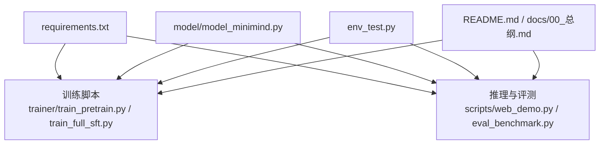
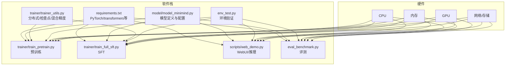
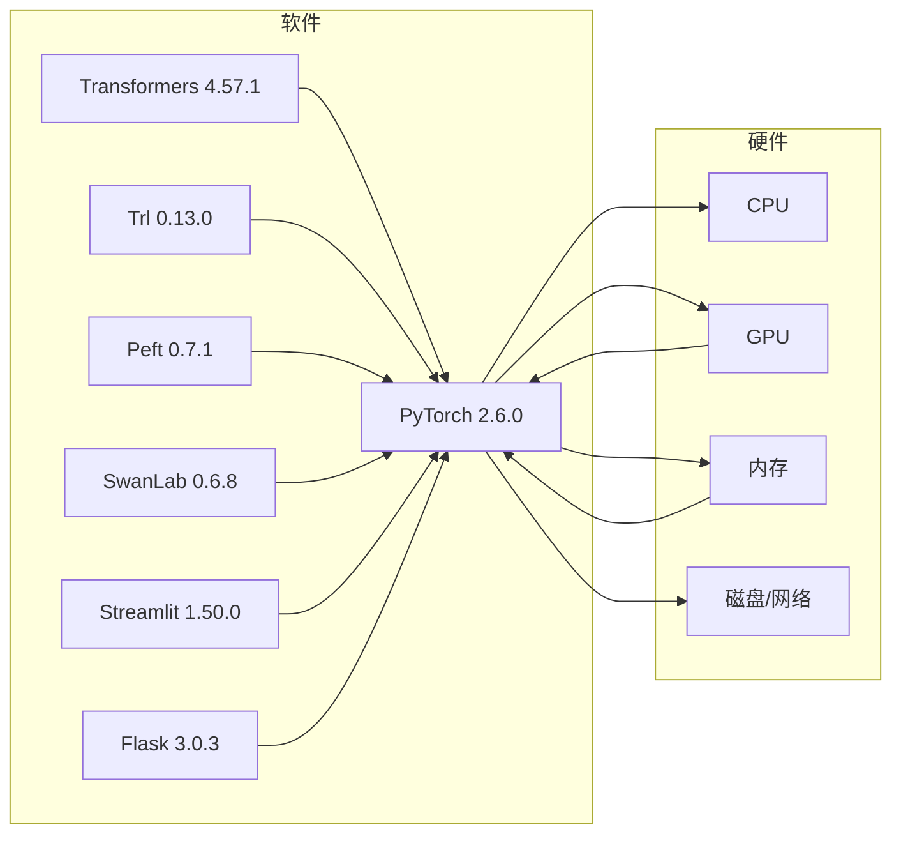

# 硬件软件要求

<cite>
**本文引用的文件**   
- [requirements.txt](file://requirements.txt)
- [README.md](file://README.md)
- [README_en.md](file://README_en.md)
- [env_test.py](file://env_test.py)
- [model/model_minimind.py](file://model/model_minimind.py)
- [trainer/trainer_utils.py](file://trainer/trainer_utils.py)
- [trainer/train_pretrain.py](file://trainer/train_pretrain.py)
- [trainer/train_full_sft.py](file://trainer/train_full_sft.py)
- [scripts/web_demo.py](file://scripts/web_demo.py)
- [eval_benchmark.py](file://eval_benchmark.py)
- [docs/00_总纲.md](file://docs/00_总纲.md)
</cite>

## 目录
1. [简介](#简介)
2. [项目结构](#项目结构)
3. [核心组件](#核心组件)
4. [架构总览](#架构总览)
5. [详细组件分析](#详细组件分析)
6. [依赖关系分析](#依赖关系分析)
7. [性能考量](#性能考量)
8. [故障排查指南](#故障排查指南)
9. [结论](#结论)
10. [附录](#附录)

## 简介
本文件面向MiniMind项目的使用者与部署者，系统化给出硬件与软件的最低/推荐规格、环境配置清单、不同使用场景下的资源配置建议、成本估算与验证方法，帮助用户在不同预算与需求下做出合理选择。

## 项目结构
围绕“硬件与软件要求”这一主题，本项目的关键支撑点包括：
- 依赖声明与版本约束：requirements.txt
- 训练与推理脚本：trainer/*、scripts/web_demo.py、eval_benchmark.py
- 模型配置与实现：model/model_minimind.py
- 环境验证脚本：env_test.py
- 文档与成本说明：README.md、docs/00_总纲.md

图表来源
- [requirements.txt](file://requirements.txt)
- [trainer/train_pretrain.py](file://trainer/train_pretrain.py)
- [trainer/train_full_sft.py](file://trainer/train_full_sft.py)
- [scripts/web_demo.py](file://scripts/web_demo.py)
- [eval_benchmark.py](file://eval_benchmark.py)
- [model/model_minimind.py](file://model/model_minimind.py)
- [env_test.py](file://env_test.py)
- [README.md](file://README.md)
- [docs/00_总纲.md](file://docs/00_总纲.md)

章节来源
- [requirements.txt](file://requirements.txt)
- [README.md](file://README.md)
- [docs/00_总纲.md](file://docs/00_总纲.md)

## 核心组件
- 训练与分布式：支持单机单卡、单机多卡（DDP），训练脚本内置断点续训与混合精度。
- 模型实现：基于PyTorch原生实现，支持Flash Attention与RoPE扩展，模型参数规模可选。
- 推理与评测：提供WebUI演示、OpenAI API服务端、基准评测脚本。
- 环境验证：CUDA可用性、版本、GPU数量与名称检测。

章节来源
- [trainer/train_pretrain.py](file://trainer/train_pretrain.py)
- [trainer/train_full_sft.py](file://trainer/train_full_sft.py)
- [model/model_minimind.py](file://model/model_minimind.py)
- [scripts/web_demo.py](file://scripts/web_demo.py)
- [eval_benchmark.py](file://eval_benchmark.py)
- [env_test.py](file://env_test.py)

## 架构总览
MiniMind的训练/推理管线与硬件依赖的关系如下：

图表来源
- [requirements.txt](file://requirements.txt)
- [model/model_minimind.py](file://model/model_minimind.py)
- [trainer/train_pretrain.py](file://trainer/train_pretrain.py)
- [trainer/train_full_sft.py](file://trainer/train_full_sft.py)
- [trainer/trainer_utils.py](file://trainer/trainer_utils.py)
- [scripts/web_demo.py](file://scripts/web_demo.py)
- [eval_benchmark.py](file://eval_benchmark.py)
- [env_test.py](file://env_test.py)

## 详细组件分析

### 软件依赖与版本要求
- Python：推荐3.10及以上（项目文档与脚本示例均基于该版本）。
- PyTorch：torch==2.6.0、torchvision==0.21.0（与requirements.txt一致）。
- Transformers：4.57.1；Trl：0.13.0；Peft：0.7.1；W&B/SwanLab：wandb==0.18.3（默认已切换为SwanLab）。
- 其他：numpy>=2.0.0、matplotlib、scikit_learn、sentence_transformers、streamlit、flask等。

章节来源
- [requirements.txt](file://requirements.txt)
- [README.md](file://README.md)

### CUDA与GPU兼容性
- 训练与推理均依赖CUDA与PyTorch CUDA后端。
- 训练脚本通过torch.cuda.is_available()与torch.version.cuda进行环境探测。
- 分布式训练使用NCCL后端（trainer_utils中init_distributed_mode使用nccl）。

章节来源
- [env_test.py](file://env_test.py)
- [trainer/trainer_utils.py](file://trainer/trainer_utils.py)

### 模型配置与显存需求
- 模型参数规模与显存占用密切相关。项目文档给出不同阶段的显存建议（最低/推荐）。
- 模型实现支持Flash Attention与RoPE扩展，有助于在有限显存下提升吞吐。

章节来源
- [docs/00_总纲.md](file://docs/00_总纲.md)
- [model/model_minimind.py](file://model/model_minimind.py)

### 训练与分布式
- 支持单机单卡与单机多卡（DDP），通过torchrun --nproc_per_node N启动。
- 断点续训：自动保存检查点与优化器状态，支持跨GPU数量恢复。
- 混合精度：支持bfloat16/float16，减少显存占用并提升吞吐。

章节来源
- [README.md](file://README.md)
- [trainer/train_pretrain.py](file://trainer/train_pretrain.py)
- [trainer/train_full_sft.py](file://trainer/train_full_sft.py)
- [trainer/trainer_utils.py](file://trainer/trainer_utils.py)

### 推理与评测
- WebUI：基于Streamlit，自动检测CUDA可用性。
- OpenAI API：提供服务端脚本，便于对接第三方前端。
- 基准评测：支持C-Eval/CMMLU等评测，可配置批量推理与设备映射。

章节来源
- [scripts/web_demo.py](file://scripts/web_demo.py)
- [eval_benchmark.py](file://eval_benchmark.py)

### 环境验证与常见问题
- 环境验证：检查CUDA可用性、CUDA版本、GPU数量与名称。
- 常见问题：CUDA不可用时需按项目提示下载对应whl安装；分布式训练需满足NCCL环境。

章节来源
- [env_test.py](file://env_test.py)
- [README.md](file://README.md)

## 依赖关系分析
MiniMind的软件栈与硬件依赖的耦合关系如下：

图表来源
- [requirements.txt](file://requirements.txt)
- [trainer/trainer_utils.py](file://trainer/trainer_utils.py)

章节来源
- [requirements.txt](file://requirements.txt)
- [trainer/trainer_utils.py](file://trainer/trainer_utils.py)

## 性能考量
- 显存与吞吐：Flash Attention与混合精度可显著降低显存占用并提升吞吐。
- 分布式训练：多卡可线性/接近线性加速，结合梯度累积与合适batch size可稳定提速。
- 数据加载：pin_memory与合适的num_workers可减少IO瓶颈。
- 模型规模：参数量越大，显存与计算需求越高；项目提供多规模配置以适配不同资源。

章节来源
- [model/model_minimind.py](file://model/model_minimind.py)
- [trainer/train_pretrain.py](file://trainer/train_pretrain.py)
- [trainer/train_full_sft.py](file://trainer/train_full_sft.py)

## 故障排查指南
- CUDA不可用
  - 现象：torch.cuda.is_available()返回False。
  - 处理：根据项目提示下载对应whl安装；确认驱动与CUDA版本匹配。
- 分布式训练异常
  - 现象：NCCL初始化失败或进程组未建立。
  - 处理：检查NCCL环境变量与网络连通性；确保每机GPU可见性与设备索引正确。
- 显存不足
  - 现象：OOM或训练中途崩溃。
  - 处理：降低batch size或max_seq_len；启用bfloat16/float16；关闭不必要的日志与可视化。
- WebUI无法加载模型
  - 现象：加载HuggingFace格式模型失败。
  - 处理：确认trust_remote_code=True；检查模型目录与权限；确保CUDA可用。

章节来源
- [README.md](file://README.md)
- [env_test.py](file://env_test.py)
- [scripts/web_demo.py](file://scripts/web_demo.py)

## 结论
MiniMind在较低硬件门槛下实现了从零训练到推理部署的完整闭环。通过合理的参数规模选择、混合精度与分布式策略，可在单卡或多卡环境下高效完成预训练、SFT与评测任务。建议用户根据自身预算与目标阶段选择合适的硬件配置，并遵循本文的成本估算与验证方法，确保顺利开展训练与部署。

## 附录

### 硬件与软件要求清单
- CPU：通用x86_64/ARM64均可，建议多核以提升数据加载与多进程能力。
- 内存：至少16GB，推荐32GB+以容纳大模型与数据缓存。
- GPU：单卡3090可满足小规模训练；多卡4090可显著缩短训练时间。
- 存储：SSD优先，预训练与SFT数据集较大，建议预留充足空间。
- 网络：训练与评测涉及远程数据与模型下载，建议稳定网络。
- 操作系统：Linux/Windows均可，Linux在分布式与容器化场景更佳。

章节来源
- [README.md](file://README.md)
- [docs/00_总纲.md](file://docs/00_总纲.md)

### 不同使用场景的硬件配置建议
- 单卡训练（预训练/SFT）
  - 最低：4GB显存（如GTX1660/RTX3060）；推荐：8GB+（如3090/4070）。
  - 注意：适当降低max_seq_len与batch size以适配显存。
- 多卡训练（DDP）
  - 建议：2-8张同型号GPU，确保PCIe带宽与电源充足。
  - 优势：显著缩短训练时间，适合大规模SFT与RLHF。
- 推理部署
  - 最低：1GB显存（26M模型）；推荐：2GB+（适配更多模型与并发）。
  - 工具：WebUI、OpenAI API服务端、第三方推理引擎（llama.cpp/vllm/ollama）。

章节来源
- [docs/00_总纲.md](file://docs/00_总纲.md)
- [README.md](file://README.md)
- [scripts/web_demo.py](file://scripts/web_demo.py)

### 成本估算与时间参考
- 单卡3090成本参考：约1.3元/小时（按项目文档）。
- 时间参考（按项目文档）：
  - MiniMind2-Small（26M）：预训练约1.1h，SFT mini约1h，合计约2.1h。
  - MiniMind2（104M）：预训练约3.9h，SFT 512约3.3h，合计约7.2h。
- 多卡4090：可将时间压缩至10分钟以内（成本仍约3元）。

章节来源
- [README.md](file://README.md)
- [README_en.md](file://README_en.md)

### 环境验证方法
- 基础验证：运行env_test.py，确认CUDA可用、版本与GPU数量。
- 训练验证：使用train_pretrain.py或train_full_sft.py进行小规模训练，观察loss收敛与显存占用。
- 推理验证：启动web_demo.py或OpenAI API服务端，进行问答测试。

章节来源
- [env_test.py](file://env_test.py)
- [trainer/train_pretrain.py](file://trainer/train_pretrain.py)
- [trainer/train_full_sft.py](file://trainer/train_full_sft.py)
- [scripts/web_demo.py](file://scripts/web_demo.py)