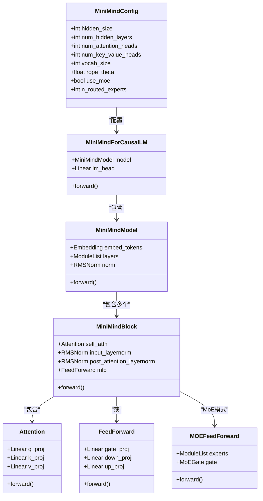
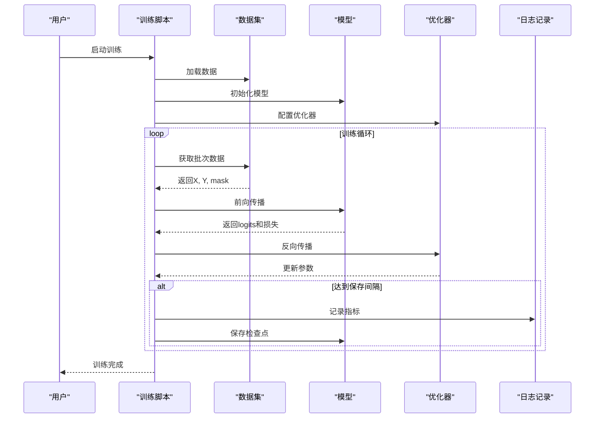
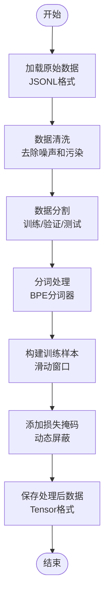

# 项目介绍与目标

<cite>
**本文引用的文件**
- [README.md](file://README.md)
- [README_en.md](file://README_en.md)
- [docs/00_总纲.md](file://docs/00_总纲.md)
- [model/model_minimind.py](file://model/model_minimind.py)
- [DST-train/model/baseline_hf/model_minimind.py](file://DST-train/model/baseline_hf/model_minimind.py)
- [requirements.txt](file://requirements.txt)
- [eval_llm.py](file://eval_llm.py)
- [trainer/train_pretrain.py](file://trainer/train_pretrain.py)
- [trainer/train_full_sft.py](file://trainer/train_full_sft.py)
- [dataset/lm_dataset.py](file://dataset/lm_dataset.py)
- [scripts/train_tokenizer.py](file://scripts/train_tokenizer.py)
- [MiniMind2/config.json](file://MiniMind2/config.json)
- [MiniMind2/tokenizer_config.json](file://MiniMind2/tokenizer_config.json)
- [model/tokenizer_config.json](file://model/tokenizer_config.json)
</cite>

## 目录
1. [项目概述](#项目概述)
2. [核心目标与使命](#核心目标与使命)
3. [技术突破与创新价值](#技术突破与创新价值)
4. [教学导向的设计理念](#教学导向的设计理念)
5. [MiniMind系列发展历程](#minimind系列发展历程)
6. [架构与组件概览](#架构与组件概览)
7. [训练流程与实现意义](#训练流程与实现意义)
8. [性能与成本优势](#性能与成本优势)
9. [结语](#结语)

## 项目概述

MiniMind是一个超轻量级大语言模型开源项目，致力于从零开始训练仅25.8M参数的极小模型，实现“3块钱成本 + 2小时”即可完成从预训练到对话的全流程训练。项目不仅实现了从0开始的完整训练代码，还提供了从预训练、监督微调、LoRA微调、知识蒸馏到强化学习后训练的全阶段开源实现，涵盖Dense与MoE两种模型架构。

项目的核心价值在于：
- 降低LLM学习门槛：让每个人都能从理解每一行代码开始，亲手训练一个极小的语言模型
- 教学导向设计：通过完整的从0实现代码帮助开发者深入理解LLM核心技术原理
- 技术复现与实践：不仅是技术复现，更是LLM入门的最佳实践教程
- 生态兼容：兼容transformers、trl、peft等主流框架，支持多推理引擎与部署方案

## 核心目标与使命

### 降低LLM学习门槛
项目旨在解决当前LLM学习面临的两大难题：
- 技术封装过度：第三方框架如transformers+trl暴露高度抽象接口，开发者难以深入理解底层实现
- 学习成本过高：传统大模型训练需要昂贵的硬件资源和复杂的环境配置

MiniMind通过以下方式解决这些问题：
- 完全从0实现的原生PyTorch代码，不依赖第三方库的抽象接口
- 极简的模型架构设计，最小版本仅25.8M参数，普通个人GPU即可快速训练
- 全流程的开源实现，从数据清洗到模型部署的每个环节都有详细说明

### 教学导向的设计理念
项目将教学价值置于首位，通过精心设计的学习路径帮助初学者系统掌握LLM核心技术：

**学习路线图**：项目将完整训练流程拆解为9个Phase，由浅入深、循序渐进，每个Phase聚焦一个核心主题，包含原理讲解、代码解读和动手实践。

**实践导向**：每个Phase都配有具体的代码实现和动手练习，确保学习者能够真正理解和掌握相关技术。

**理论与实践结合**：不仅提供代码实现，还深入讲解背后的理论原理，帮助学习者建立完整的知识体系。

## 技术突破与创新价值

### 超轻量级模型设计
MiniMind在保持模型性能的同时，实现了参数量的极致压缩：

**参数规模对比**：
- MiniMind2-Small：26M参数，体积约为GPT-3的1/7000
- MiniMind2：104M参数，兼顾性能与效率
- MiniMind2-MoE：145M参数，引入混合专家架构提升性能

**架构创新**：
- 采用Transformer Decoder-only结构，与Llama3.1保持一致
- 使用RMSNorm归一化方法替代LayerNorm
- 采用SwiGLU激活函数替代ReLU，提升性能表现
- 实现RoPE旋转位置编码，支持长文本推理

### 数据处理与优化
项目在数据处理方面实现了多项创新：

**数据集设计**：
- 预训练数据：从匠数大模型数据集中提取高质量中文语料，长度控制在512字符以内
- SFT数据：整合多个开源数据集，经过二次清洗和格式统一
- RLHF数据：基于Magpie-DPO数据集，包含偏好对齐信息

**数据处理流程**：
- 统一数据格式为jsonl，避免数据下载混乱问题
- 实现自动化的数据清洗和去重机制
- 提供多种数据组合方案，满足不同训练需求

### 训练算法创新
项目实现了多种先进的训练算法：

**MoE混合专家架构**：基于DeepSeek-V2/3的MixFFN混合专家模块，通过专家路由机制实现参数效率的提升。

**YaRN长序列外推**：实现YaRN算法，支持RoPE长文本外推，显著提升模型的长序列处理能力。

**断点续训机制**：支持训练自动恢复、跨GPU数量恢复、wandb记录连续性，提高训练的稳定性和可靠性。

## 教学导向的设计理念

### 从零开始的完整实现
项目坚持从零开始的原则，所有核心算法都使用PyTorch原生实现，不依赖第三方库的抽象接口。这种设计确保了学习者能够深入理解每个细节的实现原理。

**代码组织结构**：
- model/：模型架构定义，包含配置类、注意力机制、前馈网络等
- trainer/：训练脚本，涵盖预训练、微调、蒸馏、强化学习等
- dataset/：数据处理模块，提供各种数据集的加载和预处理
- scripts/：实用工具脚本，包括分词器训练、推理测试等

### 渐进式学习路径
项目设计了清晰的学习路径，帮助不同背景的学习者逐步掌握LLM技术：

**Phase 1-2：项目概览与环境搭建**
- 项目结构介绍和环境配置
- 快速推理体验和基础概念理解

**Phase 3：模型架构详解**
- Transformer Decoder、RoPE、GQA、MoE等核心概念
- 详细分析模型代码实现

**Phase 4-5：预训练与监督微调**
- 无监督预训练和指令微调的原理与实现
- 实际训练流程和参数调优

**Phase 6-9：高级训练与部署**
- LoRA微调、知识蒸馏、强化学习后训练
- 推理模型与部署方案

### 实践导向的教学方法
项目强调实践的重要性，每个Phase都包含具体的代码实现和动手练习：

**代码示例**：提供完整的训练脚本和模型实现，学习者可以直接运行和修改
**参数调优**：详细说明各个阶段的参数设置和调优技巧
**故障排除**：提供常见问题的解决方案和调试方法

## MiniMind系列发展历程

### 早期版本（minimind-v1）
项目最初以minimind-v1系列发布，包含基础的Dense模型和简单的MoE实现。这一阶段主要验证了超轻量级模型的可行性。

**特点**：
- 参数量：26M（small）、108M（base）
- 词表大小：6400
- 架构：基于Llama的简化实现

### 中期发展（minimind-v2）
随着技术的成熟，项目进入v2阶段，实现了更完善的架构和更丰富的功能。

**重要改进**：
- 引入MoE混合专家架构
- 优化数据处理流程
- 支持更灵活的训练配置

### 现代版本（MiniMind2）
当前的MiniMind2系列代表了项目的技术巅峰，实现了完整的训练流程和最优的性能表现。

**核心特性**：
- 参数量：26M（small）、104M（base）、145M（MoE）
- 支持YaRN长序列外推
- 全流程训练算法实现
- 丰富的部署选项

## 架构与组件概览

### 模型架构设计

**图表来源**
- [model/model_minimind.py:8-78](file://model/model_minimind.py#L8-L78)
- [model/model_minimind.py:441-474](file://model/model_minimind.py#L441-L474)
- [model/model_minimind.py:385-438](file://model/model_minimind.py#L385-L438)

### 训练流程架构

**图表来源**
- [trainer/train_pretrain.py:23-79](file://trainer/train_pretrain.py#L23-L79)
- [trainer/train_full_sft.py:23-79](file://trainer/train_full_sft.py#L23-L79)

### 数据处理管道

**图表来源**
- [dataset/lm_dataset.py:16-51](file://dataset/lm_dataset.py#L16-L51)
- [dataset/lm_dataset.py:54-124](file://dataset/lm_dataset.py#L54-L124)

## 训练流程与实现意义

### 预训练阶段（Pretrain）
预训练是LLM学习的基础阶段，模型通过无监督学习掌握语言的基本规律。

**实现特点**：
- 使用因果语言模型（Causal LM）目标函数
- 采用交叉熵损失，对每个token进行预测
- 支持混合精度训练，提高训练效率
- 实现动态学习率调度，优化收敛性能

**训练流程**：
1. 数据加载：从预训练数据集中读取文本
2. 编码处理：使用分词器将文本转换为token序列
3. 模型前向：计算每个位置的下一个token概率
4. 损失计算：基于真实标签计算交叉熵损失
5. 反向传播：更新模型参数
6. 检查点保存：定期保存训练状态

### 监督微调阶段（SFT）
监督微调阶段通过指令数据让模型学会遵循人类指令和对话规范。

**实现特点**：
- 使用ChatML格式的对话模板
- 动态损失掩码，仅对回答部分计算损失
- 支持工具调用和思维链（Reasoning）功能
- 实现多轮对话的历史上下文管理

**关键技术**：
- Chat模板应用：将对话历史转换为模型可理解的格式
- 损失掩码生成：自动识别回答部分并屏蔽其他部分
- 上下文截断：控制输入长度，避免超出模型容量

### 高级训练算法

#### LoRA微调
Low-Rank Adaptation（LoRA）通过低秩矩阵分解实现参数高效的微调。

**实现原理**：
- 在预训练权重基础上添加低秩适配矩阵
- 仅训练这些新增的参数，大幅减少训练成本
- 支持多任务学习和参数共享

#### 知识蒸馏
知识蒸馏通过教师模型指导学生模型学习，实现性能提升。

**实现方式**：
- 使用软标签（softmax概率分布）而非硬标签
- 通过KL散度衡量模型间的相似性
- 支持白盒和黑盒两种蒸馏方式

#### 强化学习后训练
通过人类反馈强化学习（RLHF）优化模型的对话质量和安全性。

**算法实现**：
- DPO（Direct Preference Optimization）：直接从偏好数据学习
- PPO（Proximal Policy Optimization）：基于策略梯度的方法
- GRPO（Generalized Reward Policy Optimization）：通用奖励策略优化
- SPO（Stochastic Policy Optimization）：随机策略优化

## 性能与成本优势

### 训练成本优化
MiniMind在保证模型性能的前提下，实现了训练成本的极致优化：

**硬件要求**：
- 最小版本可在单卡RTX 3090上2小时内完成训练
- 完整版本可在单卡4090上10分钟内完成训练
- 支持多卡分布式训练，进一步缩短训练时间

**成本控制**：
- 服务器租用成本：约3元人民币
- 显存占用：26M模型仅需1GB显存
- 训练时间：从零开始仅需2小时

### 推理性能
项目在推理阶段也实现了多项优化：

**模型压缩**：
- 26M参数的极小模型仍能保持良好的对话能力
- 支持量化和剪枝技术，进一步减小模型体积
- 实现高效的KV缓存机制，提升推理速度

**部署兼容**：
- 兼容llama.cpp、vllm、ollama等主流推理引擎
- 支持OpenAI API协议，便于集成到现有系统
- 提供多种部署方案，满足不同应用场景需求

## 结语

MiniMind项目通过其独特的设计理念和技术实现，成功地将LLM学习的门槛降到前所未有的水平。项目不仅实现了从零开始的完整训练流程，更重要的是提供了一个系统性的学习平台，帮助开发者深入理解LLM的核心技术原理。

**项目价值总结**：
- 教育价值：为LLM初学者提供了最佳的学习路径和实践平台
- 技术价值：展示了超轻量级模型设计的可能性和实用性
- 社区价值：开源了完整的训练代码和数据集，推动了AI教育的发展
- 创新价值：在模型架构、训练算法和数据处理等方面都有重要创新

MiniMind系列的发展历程体现了从简单到复杂、从理论到实践的完整演进过程。随着技术的不断进步，项目将继续优化模型性能、扩展应用场景，为更广泛的AI爱好者和研究者提供更好的学习和实践平台。

通过MiniMind，我们相信每个人都能真正理解并掌握大语言模型技术，共同推动AI技术的发展和普及。