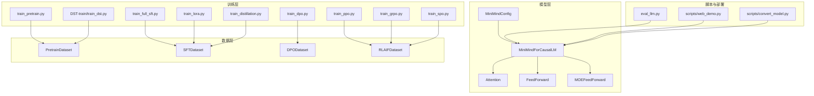
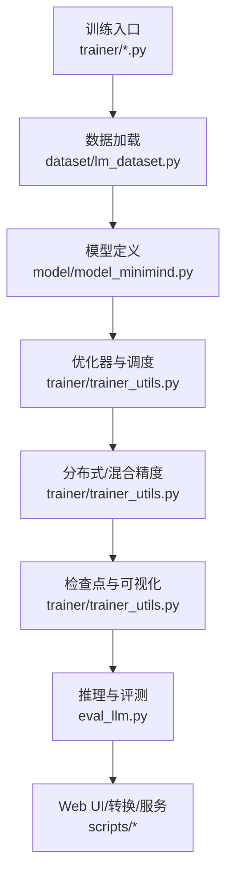
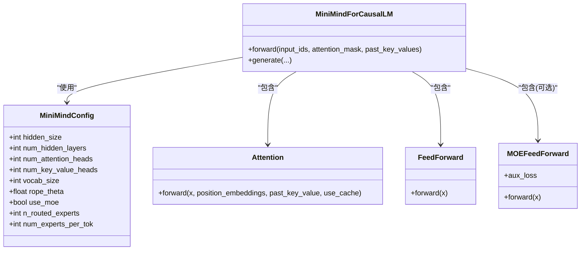
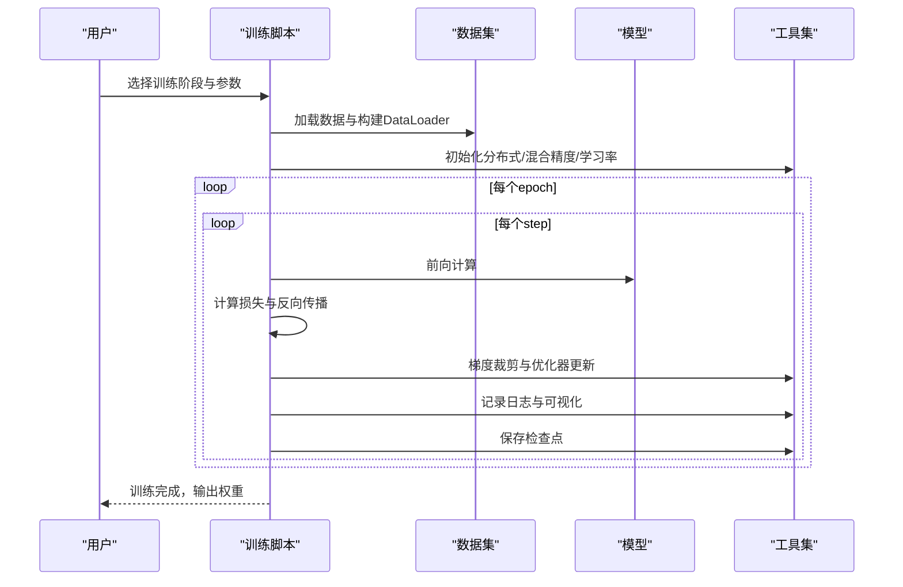
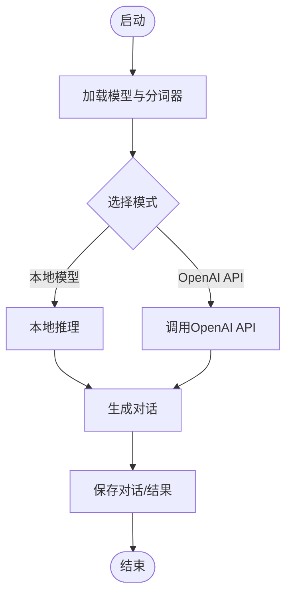
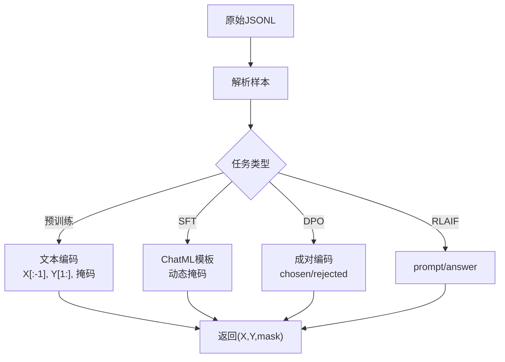
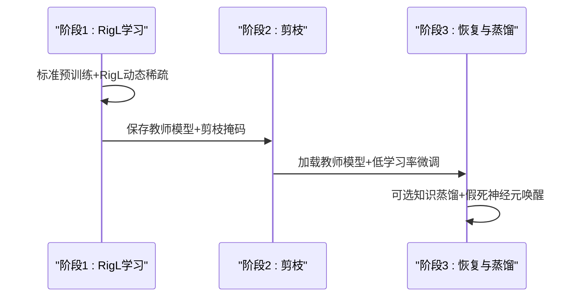
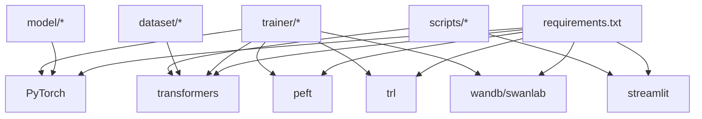

# 项目概览

<cite>
**本文引用的文件**
- [README.md](file://README.md)
- [requirements.txt](file://requirements.txt)
- [model/model_minimind.py](file://model/model_minimind.py)
- [trainer/train_pretrain.py](file://trainer/train_pretrain.py)
- [trainer/train_full_sft.py](file://trainer/train_full_sft.py)
- [trainer/train_lora.py](file://trainer/train_lora.py)
- [trainer/train_distillation.py](file://trainer/train_distillation.py)
- [trainer/train_dpo.py](file://trainer/train_dpo.py)
- [trainer/train_ppo.py](file://trainer/train_ppo.py)
- [trainer/train_grpo.py](file://trainer/train_grpo.py)
- [trainer/train_spo.py](file://trainer/train_spo.py)
- [trainer/trainer_utils.py](file://trainer/trainer_utils.py)
- [model/model_lora.py](file://model/model_lora.py)
- [eval_llm.py](file://eval_llm.py)
- [scripts/web_demo.py](file://scripts/web_demo.py)
- [scripts/convert_model.py](file://scripts/convert_model.py)
- [dataset/lm_dataset.py](file://dataset/lm_dataset.py)
- [DST-train/train_dst.py](file://DST-train/train_dst.py)
- [docs/00_总纲.md](file://docs/00_总纲.md)
- [docs/03_Phase3_模型架构详解.md](file://docs/03_Phase3_模型架构详解.md)
</cite>

## 目录
1. [项目简介](#项目简介)
2. [项目结构](#项目结构)
3. [核心组件](#核心组件)
4. [架构总览](#架构总览)
5. [详细组件分析](#详细组件分析)
6. [依赖关系分析](#依赖关系分析)
7. [性能考量](#性能考量)
8. [故障排查指南](#故障排查指南)
9. [结论](#结论)
10. [附录](#附录)

## 项目简介
MiniMind是一个超轻量级大语言模型开源项目，目标是从零开始仅用约3块钱成本 + 2小时即可训练出仅25.8M参数的极小模型。项目提供从预训练到推理部署的完整训练框架，覆盖预训练、监督微调（SFT）、LoRA微调、知识蒸馏、强化学习后训练（DPO/RLAIF PPO/GRPO/SPO）等全流程。项目强调教学导向，所有核心算法均从PyTorch原生实现，不依赖第三方高层封装，帮助开发者深入理解LLM核心技术。

项目支持多架构（Dense与MoE混合专家）、多平台兼容（transformers、llama.cpp、vllm、ollama等），并提供断点续训、分布式训练、可视化监控等功能，适合个人开发者快速上手与深入研究。

## 项目结构
项目采用清晰的功能模块化组织，主要目录与职责如下：
- model：模型定义与LoRA实现（MiniMindConfig、MiniMindForCausalLM、Attention、FeedForward、MOE等）
- trainer：各类训练脚本（预训练、SFT、LoRA、蒸馏、DPO、PPO/GRPO/SPO等）
- dataset：数据集加载与处理（预训练、SFT、DPO、RLAIF等）
- scripts：推理与部署相关脚本（Web Demo、模型转换、OpenAI API服务等）
- DST-train：动态稀疏训练（DST）全流程实现
- docs：教程文档（Phase划分、架构详解、训练流程等）
- eval_llm.py：统一的推理与评测入口
- requirements.txt：依赖清单

**图表来源**
- [model/model_minimind.py:84-474](file://model/model_minimind.py#L84-L474)
- [trainer/train_pretrain.py:16-162](file://trainer/train_pretrain.py#L16-L162)
- [trainer/train_full_sft.py:16-163](file://trainer/train_full_sft.py#L16-L163)
- [trainer/train_lora.py:16-177](file://trainer/train_lora.py#L16-L177)
- [trainer/train_distillation.py:17-224](file://trainer/train_distillation.py#L17-L224)
- [trainer/train_dpo.py:17-208](file://trainer/train_dpo.py#L17-L208)
- [trainer/train_ppo.py:21-362](file://trainer/train_ppo.py#L21-L362)
- [trainer/train_grpo.py:21-292](file://trainer/train_grpo.py#L21-L292)
- [trainer/train_spo.py:21-342](file://trainer/train_spo.py#L21-L342)
- [DST-train/train_dst.py:24-472](file://DST-train/train_dst.py#L24-L472)
- [dataset/lm_dataset.py:16-246](file://dataset/lm_dataset.py#L16-L246)
- [eval_llm.py:12-89](file://eval_llm.py#L12-L89)
- [scripts/web_demo.py:207-329](file://scripts/web_demo.py#L207-L329)
- [scripts/convert_model.py:14-76](file://scripts/convert_model.py#L14-L76)

**章节来源**
- [README.md:1-120](file://README.md#L1-L120)
- [docs/00_总纲.md:1-144](file://docs/00_总纲.md#L1-L144)

## 核心组件
- 模型配置与架构
  - MiniMindConfig：统一配置入口，支持Dense与MoE参数、RoPE缩放、注意力头数、层数、词表大小等
  - MiniMindForCausalLM：完整因果语言模型，继承GenerationMixin，支持权重共享与辅助损失
  - Attention：支持GQA（分组查询注意力）、KV缓存、Flash Attention与手动注意力两种实现
  - FeedForward：SwiGLU激活函数，中间维度按64对齐
  - MOEFeedForward：混合专家模块，支持共享专家与负载均衡辅助损失
- 训练工具
  - trainer_utils：分布式初始化、学习率调度、断点续训、模型保存等通用工具
- 数据集
  - PretrainDataset、SFTDataset、DPODataset、RLAIFDataset：统一的数据加载与损失掩码生成
- 推理与部署
  - eval_llm.py：统一推理入口，支持LoRA加载、历史对话、温度与采样参数
  - scripts/web_demo.py：Streamlit Web UI，支持本地模型与OpenAI API两种模式
  - scripts/convert_model.py：模型格式转换，支持Transformers与Llama格式

**章节来源**
- [model/model_minimind.py:8-78](file://model/model_minimind.py#L8-L78)
- [model/model_minimind.py:441-474](file://model/model_minimind.py#L441-L474)
- [model/model_minimind.py:150-225](file://model/model_minimind.py#L150-L225)
- [model/model_minimind.py:227-241](file://model/model_minimind.py#L227-L241)
- [model/model_minimind.py:299-359](file://model/model_minimind.py#L299-L359)
- [trainer/trainer_utils.py:1-139](file://trainer/trainer_utils.py#L1-L139)
- [dataset/lm_dataset.py:16-246](file://dataset/lm_dataset.py#L16-L246)
- [eval_llm.py:12-89](file://eval_llm.py#L12-L89)
- [scripts/web_demo.py:207-329](file://scripts/web_demo.py#L207-L329)
- [scripts/convert_model.py:14-76](file://scripts/convert_model.py#L14-L76)

## 架构总览
MiniMind采用Transformer Decoder-only结构，结合RMSNorm、SwiGLU、RoPE与GQA等技术，兼顾性能与参数效率。项目提供从零训练到部署的完整流水线，支持断点续训、分布式训练与可视化监控。

**图表来源**
- [trainer/train_pretrain.py:106-162](file://trainer/train_pretrain.py#L106-L162)
- [trainer/train_full_sft.py:105-163](file://trainer/train_full_sft.py#L105-L163)
- [trainer/train_lora.py:102-177](file://trainer/train_lora.py#L102-L177)
- [trainer/train_distillation.py:132-224](file://trainer/train_distillation.py#L132-L224)
- [trainer/train_dpo.py:119-208](file://trainer/train_dpo.py#L119-L208)
- [trainer/train_ppo.py:237-362](file://trainer/train_ppo.py#L237-L362)
- [trainer/train_grpo.py:189-292](file://trainer/train_grpo.py#L189-L292)
- [trainer/train_spo.py:237-342](file://trainer/train_spo.py#L237-L342)
- [dataset/lm_dataset.py:16-246](file://dataset/lm_dataset.py#L16-L246)
- [trainer/trainer_utils.py:1-139](file://trainer/trainer_utils.py#L1-L139)
- [eval_llm.py:12-89](file://eval_llm.py#L12-L89)
- [scripts/web_demo.py:207-329](file://scripts/web_demo.py#L207-L329)
- [scripts/convert_model.py:14-76](file://scripts/convert_model.py#L14-L76)

## 详细组件分析

### 模型架构组件
- RMSNorm：计算更高效，精度与LayerNorm相当
- RoPE：YaRN缩放支持长序列外推，旋转矩阵注入位置信息
- GQA：8查询头、2KV头，推理时KV缓存加速
- SwiGLU FFN：中间维度对齐到64的倍数，提升吞吐
- MoE：Top-2路由专家，共享专家与辅助损失防止路由崩塌

**图表来源**
- [model/model_minimind.py:8-78](file://model/model_minimind.py#L8-L78)
- [model/model_minimind.py:441-474](file://model/model_minimind.py#L441-L474)
- [model/model_minimind.py:150-225](file://model/model_minimind.py#L150-L225)
- [model/model_minimind.py:227-241](file://model/model_minimind.py#L227-L241)
- [model/model_minimind.py:299-359](file://model/model_minimind.py#L299-L359)

**章节来源**
- [docs/03_Phase3_模型架构详解.md:1-387](file://docs/03_Phase3_模型架构详解.md#L1-L387)
- [model/model_minimind.py:84-474](file://model/model_minimind.py#L84-L474)

### 训练流程组件
- 预训练（Pretrain）：无监督学习，目标是“词语接龙”，支持混合精度与分布式
- 监督微调（SFT）：指令微调，使用ChatML模板与动态损失掩码
- LoRA微调：低秩适配，参数高效微调，支持垂域迁移
- 知识蒸馏：学生模型学习教师模型软分布，提升性能与效率
- DPO：直接偏好优化，使用参考模型log-prob与偏好对的差值
- RLAIF：PPO/GRPO/SPO三种强化学习算法，支持推理模型训练

**图表来源**
- [trainer/train_pretrain.py:23-79](file://trainer/train_pretrain.py#L23-L79)
- [trainer/train_full_sft.py:23-79](file://trainer/train_full_sft.py#L23-L79)
- [trainer/train_lora.py:24-75](file://trainer/train_lora.py#L24-L75)
- [trainer/train_distillation.py:38-130](file://trainer/train_distillation.py#L38-L130)
- [trainer/train_dpo.py:54-117](file://trainer/train_dpo.py#L54-L117)
- [trainer/train_ppo.py:119-235](file://trainer/train_ppo.py#L119-L235)
- [trainer/train_grpo.py:95-182](file://trainer/train_grpo.py#L95-L182)
- [trainer/train_spo.py:131-230](file://trainer/train_spo.py#L131-L230)
- [trainer/trainer_utils.py:1-139](file://trainer/trainer_utils.py#L1-L139)

**章节来源**
- [trainer/train_pretrain.py:1-162](file://trainer/train_pretrain.py#L1-L162)
- [trainer/train_full_sft.py:1-163](file://trainer/train_full_sft.py#L1-L163)
- [trainer/train_lora.py:1-177](file://trainer/train_lora.py#L1-L177)
- [trainer/train_distillation.py:1-224](file://trainer/train_distillation.py#L1-L224)
- [trainer/train_dpo.py:1-208](file://trainer/train_dpo.py#L1-L208)
- [trainer/train_ppo.py:1-362](file://trainer/train_ppo.py#L1-L362)
- [trainer/train_grpo.py:1-292](file://trainer/train_grpo.py#L1-L292)
- [trainer/train_spo.py:1-342](file://trainer/train_spo.py#L1-L342)

### 推理与部署组件
- eval_llm.py：统一推理入口，支持LoRA权重加载、历史对话、温度与采样参数
- scripts/web_demo.py：Streamlit Web UI，支持本地模型与OpenAI API两种模式
- scripts/convert_model.py：模型格式转换，支持Transformers与Llama格式

**图表来源**
- [eval_llm.py:12-89](file://eval_llm.py#L12-L89)
- [scripts/web_demo.py:207-329](file://scripts/web_demo.py#L207-L329)
- [scripts/convert_model.py:14-76](file://scripts/convert_model.py#L14-L76)

**章节来源**
- [eval_llm.py:1-89](file://eval_llm.py#L1-L89)
- [scripts/web_demo.py:1-329](file://scripts/web_demo.py#L1-L329)
- [scripts/convert_model.py:1-76](file://scripts/convert_model.py#L1-L76)

### 数据处理组件
- PretrainDataset：将文本切分为X（输入）与Y（目标），生成损失掩码
- SFTDataset：应用ChatML模板，动态生成损失掩码，支持工具调用
- DPODataset：成对偏好数据（chosen/rejected），分别编码并生成掩码
- RLAIFDataset：强化学习训练数据，构建prompt与answer

**图表来源**
- [dataset/lm_dataset.py:16-246](file://dataset/lm_dataset.py#L16-L246)

**章节来源**
- [dataset/lm_dataset.py:1-250](file://dataset/lm_dataset.py#L1-L250)

### 动态稀疏训练（DST）组件
- train_dst.py：三阶段训练循环（学习与成长+RigL→压缩与巩固→恢复与再成长）
- MagnitudePruner：基于幅度的剪枝
- RigLScheduler：动态稀疏训练调度
- MBEMonitor：模型健康监测
- DeadNeuronDetector：假死神经元检测与唤醒

**图表来源**
- [DST-train/train_dst.py:74-472](file://DST-train/train_dst.py#L74-L472)

**章节来源**
- [DST-train/train_dst.py:1-472](file://DST-train/train_dst.py#L1-L472)

## 依赖关系分析
- 外部依赖：PyTorch、transformers、accelerate、datasets、peft、trl、einops、wandb/swanlab、streamlit等
- 内部依赖：model与trainer通过trainer_utils解耦，数据集与训练脚本通过Dataset接口解耦
- 可视化：默认使用SwanLab（兼容WandB API），支持分布式训练日志

**图表来源**
- [requirements.txt:1-31](file://requirements.txt#L1-L31)

**章节来源**
- [requirements.txt:1-31](file://requirements.txt#L1-L31)

## 性能考量
- 参数规模：MiniMind2-Small（26M）、MiniMind2-MoE（145M）、MiniMind2（104M）
- 训练开销（单卡3090）：预训练约1-4小时，SFT约3-25小时，DPO约1小时，RLAIF约3小时
- 硬件要求：推理测试1GB+，预训练512dim约4GB+，SFT约4GB+，DPO约8GB+，PPO/GRPO/SPO约16GB+
- 技术优化：混合精度（bfloat16/float16）、Flash Attention、GQA、RMSNorm、YaRN RoPE外推

[本节为通用指导，无需引用具体文件]

## 故障排查指南
- CUDA不可用：确认torch与CUDA版本匹配，必要时从官方源下载whl安装
- 断点续训：检查./checkpoints目录是否存在resume检查点，自动恢复模型、优化器与wandb记录
- 分布式训练：确保NCCL环境变量正确，RANK/LOCAL_RANK设置，DDP初始化成功
- 混合精度：CPU模式下自动降级为非混合精度，GPU模式下根据dtype选择bfloat16/float16
- Web UI：确保Streamlit安装，端口未被占用，模型路径正确

**章节来源**
- [trainer/trainer_utils.py:1-139](file://trainer/trainer_utils.py#L1-L139)
- [README.md:277-423](file://README.md#L277-L423)

## 结论
MiniMind通过从零实现的完整训练框架，将LLM训练的每个关键环节透明化，使开发者能够在极低成本下完成从预训练到推理部署的全流程。项目在技术上实现了参数效率与性能的平衡，教学上提供了循序渐进的Phase教程，生态上兼容主流推理框架与训练工具，是学习与研究LLM的理想起点。

[本节为总结性内容，无需引用具体文件]

## 附录

### 快速开始
- 环境准备：pip安装requirements.txt
- 下载模型：git clone jingyaogong/MiniMind2
- 命令行问答：python eval_llm.py --load_from ./MiniMind2
- Web UI：streamlit run scripts/web_demo.py
- 第三方推理：ollama run jingyaogong/minimind2；vllm serve ./MiniMind2/

**章节来源**
- [README.md:208-384](file://README.md#L208-L384)

### 硬件与软件要求
- 软件：Python 3.10+，CUDA 12.2，PyTorch 2.6+
- 硬件：推理测试1GB+显存，预训练512dim约4GB+，SFT约4GB+，DPO约8GB+，PPO/GRPO/SPO约16GB+

**章节来源**
- [README.md:210-221](file://README.md#L210-L221)

### 模型参数对比
- MiniMind2-Small：26M参数，d_model=512，n_layers=8，MoE关闭
- MiniMind2-MoE：145M参数，d_model=640，n_layers=8，MoE开启（1+4路由+共享专家）
- MiniMind2：104M参数，d_model=768，n_layers=16，MoE关闭

**章节来源**
- [README.md:607-642](file://README.md#L607-L642)