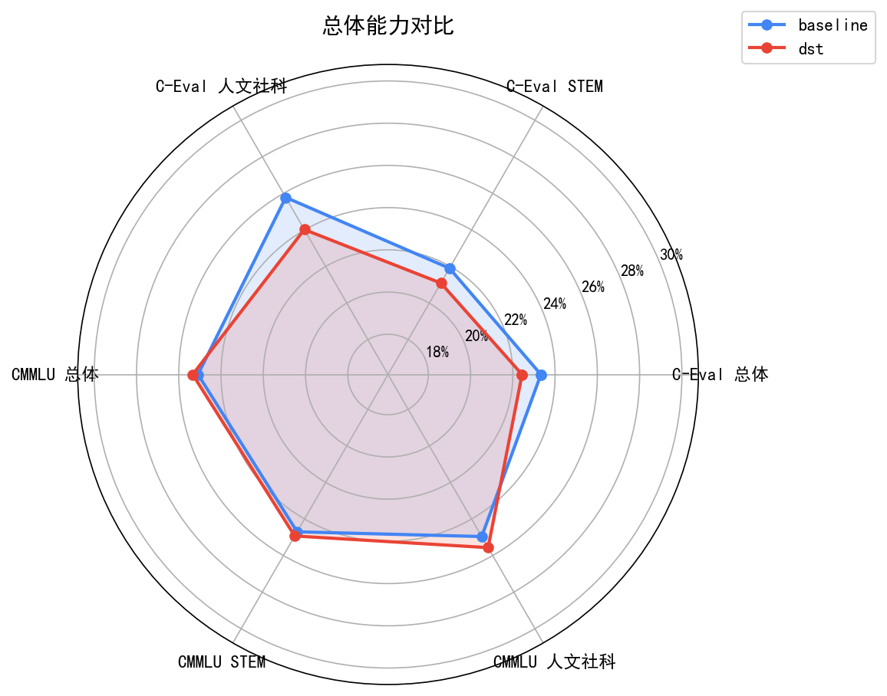
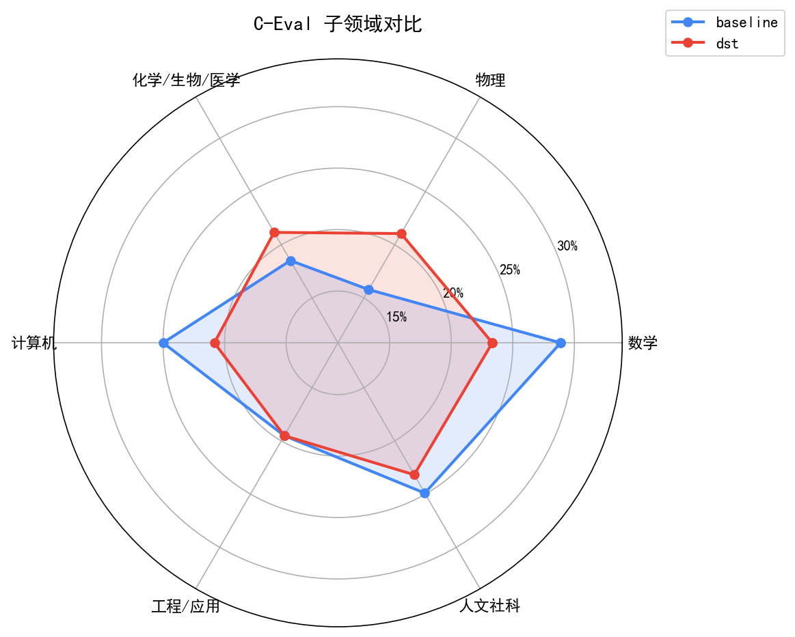
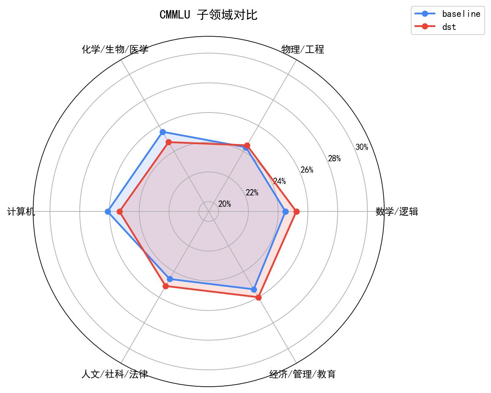
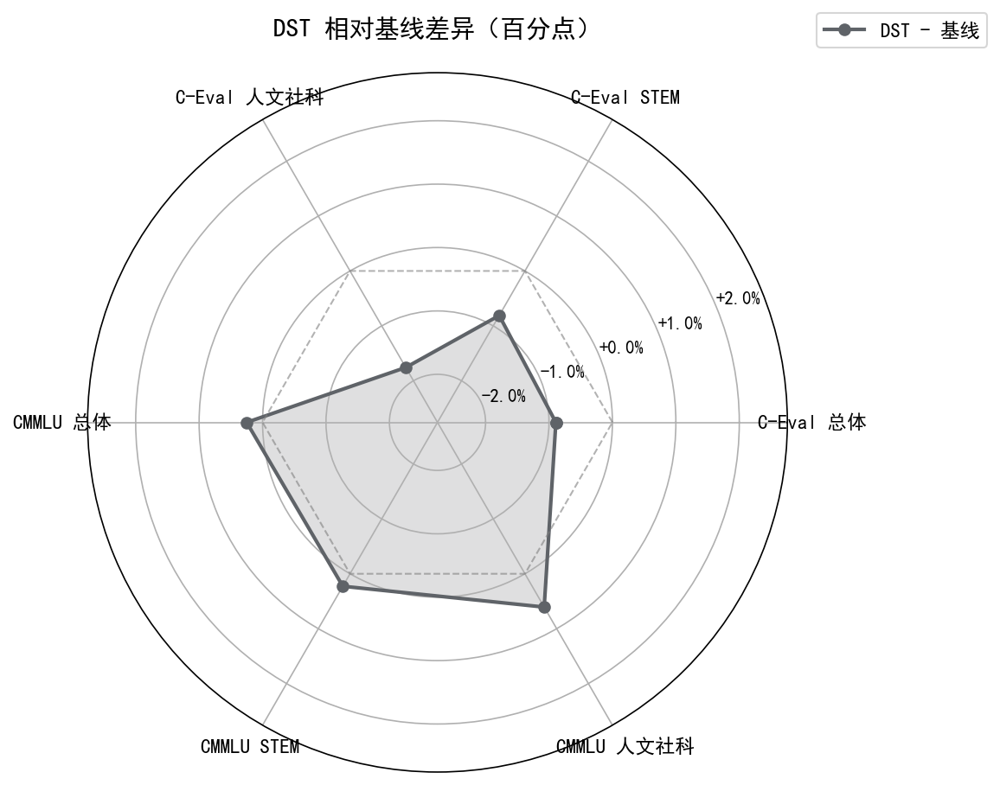

# DST 训练效果对比评测报告

**生成日期**: 2026-04-30
**对比模型**: baseline vs dst
**评测方法**: ABCD token 概率对比法（与 lm-evaluation-harness 一致）

---

## 模型信息对比

| 项目 | 基线模型 | DST 模型 |
|------|---------|---------|
| 标签 | baseline | dst |
| 结果文件 | `baseline_benchmark_results.json` | `dst_benchmark_results.json` |
| C-Eval 题目数 | 1346 | 1346 |

---

## 总体能力对比

| 维度 | 基线 | DST | 差异 |
|------|------|-----|------|
| C-Eval 总体 | 23.33% | 22.44% | -0.89pp |
| C-Eval STEM | 21.91% | 21.10% | -0.81pp |
| C-Eval 人文社科 | 25.78% | 24.02% | -1.76pp |
| CMMLU 总体 | 25.09% | 25.34% | +0.25pp |
| CMMLU STEM | 24.70% | 24.93% | +0.23pp |
| CMMLU 人文社科 | 24.96% | 25.57% | +0.61pp |

---

## C-Eval 子领域对比

| 子领域 | 基线 | DST | 差异 |
|--------|------|-----|------|
| 数学 | 28.89% | 23.33% | -5.56pp |
| 物理 | 15.79% | 21.05% | +5.26pp |
| 化学/生物/医学 | 18.52% | 21.16% | +2.65pp |
| 计算机 | 25.00% | 20.83% | -4.17pp |
| 工程/应用 | 19.51% | 19.51% | +0.00pp |
| 人文社科 | 24.91% | 23.18% | -1.73pp |

---

## CMMLU 子领域对比

| 子领域 | 基线 | DST | 差异 |
|--------|------|-----|------|
| 数学/逻辑 | 24.49% | 25.22% | +0.73pp |
| 物理/工程 | 24.33% | 24.48% | +0.15pp |
| 化学/生物/医学 | 25.53% | 24.73% | -0.80pp |
| 计算机 | 26.13% | 25.33% | -0.80pp |
| 人文/社科/法律 | 24.58% | 25.13% | +0.54pp |
| 经济/管理/教育 | 25.38% | 26.00% | +0.62pp |

---

## 差异分析

### C-Eval 差异排名

| 排名 | 科目 | 基线 | DST | 差异 |
|------|------|------|-----|------|
| 1 | 植物保护 | 9.09% | 31.82% | +22.73% |
| 2 | 高中生物 | 15.79% | 36.84% | +21.05% |
| 3 | 马克思主义 | 26.32% | 42.11% | +15.79% |
| 4 | 大学化学 | 4.17% | 16.67% | +12.50% |
| 5 | 高中物理 | 10.53% | 21.05% | +10.53% |
| ... | ... | ... | ... | ... |
| 48 | 中学化学 | 30.00% | 15.00% | -15.00% |
| 49 | 高中语文 | 36.84% | 21.05% | -15.79% |
| 50 | 离散数学 | 56.25% | 37.50% | -18.75% |
| 51 | 基础医学 | 26.32% | 5.26% | -21.05% |
| 52 | 艺术学 | 45.45% | 21.21% | -24.24% |

### CMMLU 差异排名

| 排名 | 科目 | 基线 | DST | 差异 |
|------|------|------|-----|------|
| 1 | 现代汉语 | 17.24% | 24.14% | +6.90% |
| 2 | 古汉语 | 21.95% | 28.66% | +6.71% |
| 3 | 大学法律 | 16.67% | 23.15% | +6.48% |
| 4 | 高中物理 | 19.09% | 25.45% | +6.36% |
| 5 | 高中生物 | 19.53% | 24.85% | +5.33% |
| ... | ... | ... | ... | ... |
| 63 | 哲学 | 24.76% | 20.00% | -4.76% |
| 64 | 大学医学 | 29.30% | 24.18% | -5.13% |
| 65 | 中国饮食文化 | 28.68% | 22.79% | -5.88% |
| 66 | 大学精算学 | 31.13% | 24.53% | -6.60% |
| 67 | 高中化学 | 31.82% | 25.00% | -6.82% |

---

## 结论

- C-Eval 总体差异: -0.89%（DST 下降）
- CMMLU 总体差异: +0.25%（DST 提升）
- C-Eval 科目中：17 科提升，22 科下降，13 科持平
- CMMLU 科目中：35 科提升，26 科下降，6 科持平

> 注：四选一随机基线为 25%，两个模型整体表现均接近随机猜测水平。
> 差异以百分点(pp)表示，正值表示 DST 优于基线，负值表示 DST 弱于基线。
